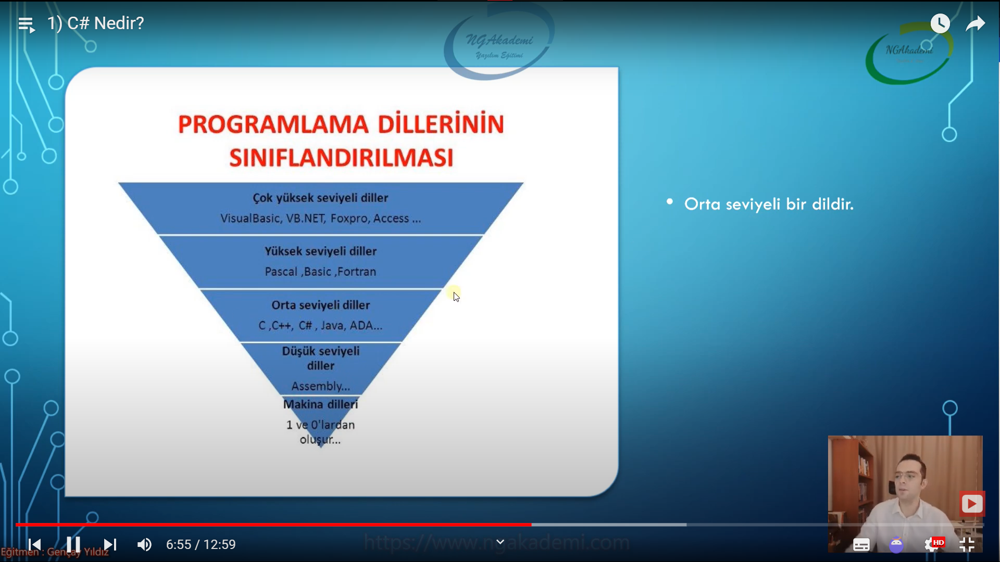
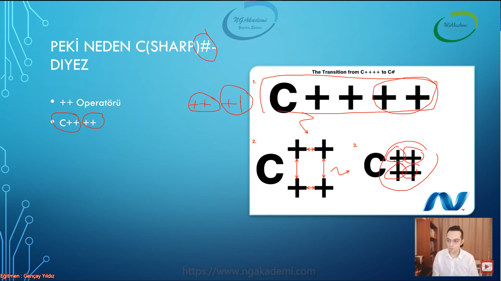
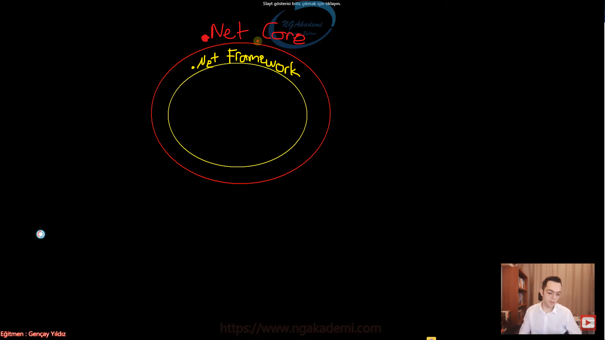
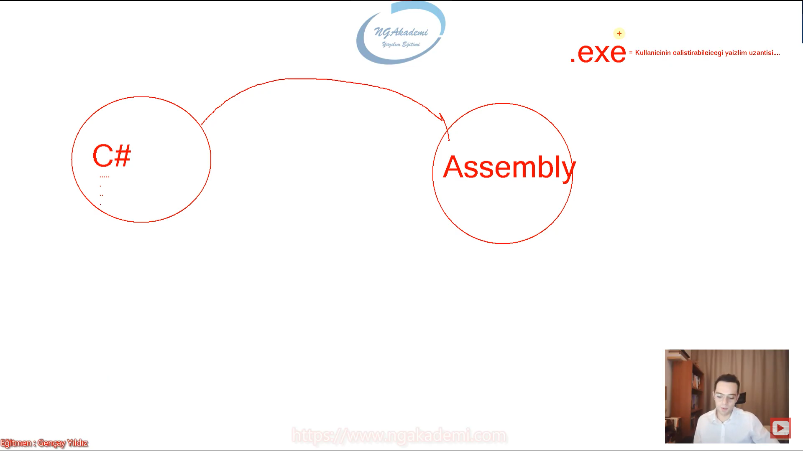
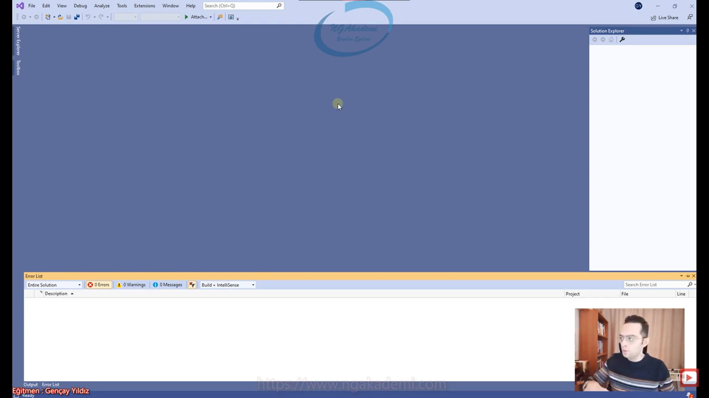

# 1) C# Nedir?
- Microsoft tarafından .NET çatısı altında geliştirilen ve gelişen modern bir programlama dilidir.

- Açık kaynak ve ücretsizdir.

- C benzeri bir dildir.

- OOP'yi ve OOP'nin gelişimini destekler.

- OOP Neste Tabanlı Programlama felsefesidir/yaklaşımıdır. C# işte bu yaklaşımı benimsemiş bir dildir.

- Orta seviyeli bir dildir.

- Burada seviyeden kasıt dilin okunabilirlik etkisi. Yani bir dil yüksek seviyeli ise bir beşeri dile daha yakındır. Baktığınız zaman makale gibi okuyabilirsiniz. 

- Mesela VisualBasic'e baktığınız zaman yazılmış bir şiir gibi takır takır takır gider. Çok fazla bir sembolik değer/ifade yoktur.

- Bir makine diline baktığınızda bildiğiniz Çince gibidir. Yani hiç birşey anlaşılmıyor 0'lardan 1'lerden oluşuyor bir assembly'e baktığınız zaman ciddi manada bakınca hiç birşey anlayamacağınız bir mantık otutturamayacağınız bir dil. 

- Yani bir dil eğer ki beşeri seviye de algılanabilir seviyedeyse baktığınızda metinselse kodları bu dil yüksek seviyelidir. Ama bir dil okunabilirliği düşüyorsa sembollerle ifade ediliyorsa ve bir matematiğe/mantığa göre yorumlanabiliyorsa o dil düşük seviyelidir.

- C 'nin bir üst versiyonu C++'tır yani C+1 denilebilir çünkü ++ operatörü kodlamada değeri bir arttırır. C#'ta aslında C++'ın bir üst versiyonudur. Yani C++++ olarak tasarlanmış ve #(diyez) işareti olmuştur C#. 

- Java'dan etkilenmiştir. Java'yı etkilemektedir.

- Diller birbirlerini örnek alabilirler. Birbirlerinden belirli şeyleri kopyalayabilirler. Belirli şeyleri miras alabilirler ya da farklı bir vizyonda daha da farklı ürünler ortaya koyup daha düne kadar kendisinin modellediğinin modellenmesine sebeb olabilirler. Dillerin gelişimi bu şekildedir.

## C# İle Neler Geliştirilebilir
- Aklınıza ne geliyorsa geliştirebilirsiniz.

- Web Uygulamaları

- Mobil

- Web Service

- Service Mimarileri

- Console

- DLL

- Windows Form

- Oyun

- ERP, Muhasebe, Multi Media, İstatistik, Güvenlik vs. Yazılımları

- Uzaya füze göndersek bile C# ile gönderebiliriz. 

- Her yerde mükemmel bir destek verebilir demiyoruz. Örneğin veri madenciliği boşuna Python diye bir dil çıkmadı. Python veri madenciliğinde dah performanslı daha da hızlı hareket etmemizi sağlıyor. C#veri madenciliği yapamaz demiyoruz. C# veri madenciliği yapabilir.

- Siz her ne olursa olsun ihtiyacınıza göre doğru olanı kullanmanız sizin açınızdan son derece iyi olacaktır.

- Derlenen bir programlama dilidir.

***
# 2) .NET Framework ve .NET Core Nedir? Farkları Nelerdir?
- Biz Microsoft'un bize sunduğu teknolojileri kullanarak yazılımlarımızı geliştiriyoruz.

- .NET Dil/Mimari/Kütüphane gibi yapılanmaları sunan çatıdır.

- .NET Microsoft'un developerler için geliştirdiği teknolojileri sunuduğu bir çatı.

| .NET Framework | .NET Core| 
|----------------|----------|
|İlk Çıkan Sürümdür.|.NET Core daha sonradan çıkmıştır.|
|Windows Ekosistemine yönelik çözümler getirir.|Cross Platform'dur. Çeşitli işletim sistemleri uygulamaları destekler|
|Geliştirdiğiniz ürün sadece Windows'a göre çözümler getirir. Microsoft'a bağlıdır. |Developer'ların her yerde geliştirme yapabileceği/çalıştırabileceği/serve edebileceği  bir çekirdek oluşturdu.|
|Sadece Windows 'işletim sisteminde çalışabilirsiniz.|Tüm işletim sistemlerinde çalışma sergileyebilir.|
|Open Source değildir.|.Net Framework'teki Windows bağımlılığını ortadan kaldırarak daha evrensel uygulamalar geliştirmemizi sağlamaktadır.|
||Modülerdir. Open Source'tur.|

- İkisinde de farketmeksizin bütün platformlara uygun geliştirmeler yapabilmekteyiz.

***
# 3) Compiler Nedir?
- Yazdığınız kodu sürekli derleyip ardından çalıştırmanız gerekecek.

- Bir programlama dili derleyici bir üslupla çalışıyorsa yani derlenen bir dilse bu programlama dilinin önce derlenmesi ardından çalıştırılması ve sonuç alınması gerekmektedir. 

- Derleme süreci bizim için önemlidir.

- Diyelim ki siz Source(kaynak) dosyanızın içine C# kodlarınızı yazdınız. Bu kodların makina tarafından okunulabilir işlenilebilir hale getirilmesi gerekiyor. İşte biz bunun için bu kodu derlemeliyiz.

- Burada derlemekten kastımız yazdığımız kodun makinanın anlayacağı dile/koda çevrilmesi gerekiyor. 

- Örneğin C# kodlarının kabataslak Assembly'e çevrilmesi için bu kodun derlenmesi gerekiyor.

- C#'ı ben algılayabiliyorum derlendikten sonra C#'ın derlenmiş halini makine/bilgisayar algılayabiliyor.

- Dolayısıyla bu derleme neticesinde bilgisayarın anlayabileceği kod üretiliyor. Dolayısıyla biz C# ile Assembly yazmadan bilgisayarla haberleşmiş oluyoruz.

- Bilgisayar bilimlerinde ön işleme süreci, derleme süreci, çevirme ve bağlama süreçleri söz konusudur.

- Windows'ta Eğer ki bir yazılımı çalıştırmak istiyorsanız .exe uzantılı bir dosyasını açarak sağlarız. 

- .exe : Kullanıcın çalıştırabileceği yazılım uzantısıdır.

- Kullanıcının çalıştırabileceği yazılım uzantısını derleme sonucunda elde edersiniz.

- Yani senin yazmış olduğun C#'taki kodunu kullanıcının işletim sisteminde çalıştırılabilir hale getirmen için o kodu derlemen lazım.

- Derlemenin 2 adet çıktısı vardır. Bu çıktılardan bir tanesi .exe'dir diğeri .dll'dir.

***
# 4) Kodlar Nasıl Compile Edilir?
- Derleme süreci ileride kullanacağımız editörler tarafından kendiliğinden yapılacağı için buradaki sorumluluk bizim üstlenmemiz gereken bir sorumluluk değil. Haliyle burası çok önemli bir konu değil.

- Derleme esnasında esasında dosyanın uzantısı önemli değildir. İçerisindeki kodlar satır satır yorumlandığından dolayı dosyanın uzantısından ziyade içerisinde ki yazan kodlar önemlidir.

- Developer Command Prompt sayesinde elimizdeki dosyaları derleyebiliyoruz. Tabiki o dosyaların içerisinde .NET türevlerinden bir dil kullanılmış olması kaydıyla.

- Bir kodu inşa ediyorsunuz ve bu inşa ettiğiniz kod derlenmediği sürece kullanılabilir hale gelmemektedir. Onun için kodu bizim derleyip daha sonra çalıştırmamız gerekiyor. Dolayısıyla buradaki süreçten kodun geçmesi gerekiyor. Buradaki süreç manuel bir şekilde geçmeyecektir. Bunu kullanacağımız editörler ya da .NET CLI dediğimiz asistan sayesinde çok rahat bir şekilde gerçekleştirebiliriz.

***
# 5) Visual Studio Ortam Tanıtımı
- Biz kodlarımızı yazarken bilgisayar ortamında en nihayetinde not defterini kullanabiliriz. Kodumuzu orada yazıp çalıştırıp inşa edip manuel derlemelerle sonuçlarımızı alıp test edebiliriz. Bu işlem basit işlemler de bir yere kadar idare edecektir ama kompleks çalışmalarda gerçekten kurumsal yapılanmalarda artık ihtiyacımız biraz da kod maliyetini düşürecek bir asistana ihtiyacımız olacaktır.

- İşte böyle durumlarda geliştirilmiş kod yazmamızı yani bir developer sürecinde bizlere eşlik edebilecek belirli ortamlar kullanmamız gerekecektir. Bu ortamlardan en yaygın olanı Visual Studio'yu kullanacağız.

- Visual Studio Microsoft tarafından geliştirilmiştir. .NET mimarilerinin hemen hemen hepsini en mükemmel şekilde kodlayabileceğimiz bir platformdur.

- [Buradan Visual Studio'ya erişim sağlayabilirsiniz](https://visualstudio.microsoft.com/tr/)

- Visual Studio dediğimiz editör Microsoft tarafından biz developerlar için geliştirilmiş harika muazzam bir editördür/ortamdır. 

- Aklınıza gelen bütün çalışmaları biz buradan yapabiliyoruz. Mimarilerinizi, kodunuzu, uygulamanızı, programınızı, tasarımınızı, herşeyinizi bunda yapabiliyorsunuz ve bunun üzerinden tek seferde derleme işlemini gerçekleştirebiliyorsunuz. 

- Derleme sürecini Visual Studio kendi sorumluluğunda/kendine dahili bir şekilde bu sorumluluğu üstlenmiştir. 

 - Yukarıdaki menülerden önemli olarak : 
    * Debug, 
    * Tools, 
    * Solution Explorer : Yazdığımız/çalıştırdığımız/ üzerinde çalıştığımız projeye dair tüm dosyalar buradaki pencere de listelenecektir. Tek elden yönetebiliyoruz.
    * Error List :Derleme sürecinde yaşanan alınan hataları görebilirsiniz.

***
# 6) Proje ve Solution Kavramları
- Uygulama oluştururken temelde 2 kavram vardır.

- Proje : İçerisinde amaca dair çözümler getirilen kodsal çalışmaların yapıldığı(yani operasyonların yürütüldüğü) bir bütündür. Gerekli algoritmalarını yazıyorsun/mimarilerini oluşturuyorsun/veritabanı işlemlerini yapıyorsun vs.

- Solution : İçerisinde bir veya birden fazla proje barındıran evrensel bir kümedir.

- Gerçek hayatta bir uygulama yazarken yazdığınız uygulama bir proje değil esasında bir çözümdür/solution'dır. Dolayısıyla bu solution yani yapacağınız uygulama birden fazla projenin bir araya gelmiş hali olabilir.

- Mesela bir banka uygulamasında ekibin bir kısmı Bakiye projesinde çalışırken bir kısmı bankamatik projesinde çalışıyor olabilir başka bir kısmı ERP projesi vardır orada çalışıyordur Her proje birbirinden farklı ama kendi aralarında bir entegrasyon var. İşte biz bunların her birini bir Solution altında toplayabiliyoruz.

