# 1) C# Nedir?
- Microsoft tarafından .NET çatısı altında geliştirilen ve gelişen modern bir programlama dilidir.

- Açık kaynak ve ücretsizdir.

- C benzeri bir dildir.

- OOP'yi ve OOP'nin gelişimini destekler.

- OOP Neste Tabanlı Programlama felsefesidir/yaklaşımıdır. C# işte bu yaklaşımı benimsemiş bir dildir.

- Orta seviyeli bir dildir.

- Burada seviyeden kasıt dilin okunabilirlik etkisi. Yani bir dil yüksek seviyeli ise bir beşeri dile daha yakındır. Baktığınız zaman makale gibi okuyabilirsiniz. 

- Mesela VisualBasic'e baktığınız zaman yazılmış bir şiir gibi takır takır takır gider. Çok fazla bir sembolik değer/ifade yoktur.

- Bir makine diline baktığınızda bildiğiniz Çince gibidir. Yani hiç birşey anlaşılmıyor 0'lardan 1'lerden oluşuyor bir assembly'e baktığınız zaman ciddi manada bakınca hiç birşey anlayamacağınız bir mantık otutturamayacağınız bir dil. 

- Yani bir dil eğer ki beşeri seviye de algılanabilir seviyedeyse baktığınızda metinselse kodları bu dil yüksek seviyelidir. Ama bir dil okunabilirliği düşüyorsa sembollerle ifade ediliyorsa ve bir matematiğe/mantığa göre yorumlanabiliyorsa o dil düşük seviyelidir.

- C 'nin bir üst versiyonu C++'tır yani C+1 denilebilir çünkü ++ operatörü kodlamada değeri bir arttırır. C#'ta aslında C++'ın bir üst versiyonudur. Yani C++++ olarak tasarlanmış ve #(diyez) işareti olmuştur C#. 

- Java'dan etkilenmiştir. Java'yı etkilemektedir.

- Diller birbirlerini örnek alabilirler. Birbirlerinden belirli şeyleri kopyalayabilirler. Belirli şeyleri miras alabilirler ya da farklı bir vizyonda daha da farklı ürünler ortaya koyup daha düne kadar kendisinin modellediğinin modellenmesine sebeb olabilirler. Dillerin gelişimi bu şekildedir.

## C# İle Neler Geliştirilebilir
- Aklınıza ne geliyorsa geliştirebilirsiniz.

- Web Uygulamaları

- Mobil

- Web Service

- Service Mimarileri

- Console

- DLL

- Windows Form

- Oyun

- ERP, Muhasebe, Multi Media, İstatistik, Güvenlik vs. Yazılımları

- Uzaya füze göndersek bile C# ile gönderebiliriz. 

- Her yerde mükemmel bir destek verebilir demiyoruz. Örneğin veri madenciliği boşuna Python diye bir dil çıkmadı. Python veri madenciliğinde dah performanslı daha da hızlı hareket etmemizi sağlıyor. C#veri madenciliği yapamaz demiyoruz. C# veri madenciliği yapabilir.

- Siz her ne olursa olsun ihtiyacınıza göre doğru olanı kullanmanız sizin açınızdan son derece iyi olacaktır.

- Derlenen bir programlama dilidir.

***
# 2) .NET Framework ve .NET Core Nedir? Farkları Nelerdir?
- Biz Microsoft'un bize sunduğu teknolojileri kullanarak yazılımlarımızı geliştiriyoruz.

- .NET Dil/Mimari/Kütüphane gibi yapılanmaları sunan çatıdır.

- .NET Microsoft'un developerler için geliştirdiği teknolojileri sunuduğu bir çatı.

| .NET Framework | .NET Core| 
|----------------|----------|
|İlk Çıkan Sürümdür.|.NET Core daha sonradan çıkmıştır.|
|Windows Ekosistemine yönelik çözümler getirir.|Cross Platform'dur. Çeşitli işletim sistemleri uygulamaları destekler|
|Geliştirdiğiniz ürün sadece Windows'a göre çözümler getirir. Microsoft'a bağlıdır. |Developer'ların her yerde geliştirme yapabileceği/çalıştırabileceği/serve edebileceği  bir çekirdek oluşturdu.|
|Sadece Windows 'işletim sisteminde çalışabilirsiniz.|Tüm işletim sistemlerinde çalışma sergileyebilir.|
|Open Source değildir.|.Net Framework'teki Windows bağımlılığını ortadan kaldırarak daha evrensel uygulamalar geliştirmemizi sağlamaktadır.|
||Modülerdir. Open Source'tur.|

- İkisinde de farketmeksizin bütün platformlara uygun geliştirmeler yapabilmekteyiz.

***
# 3) Compiler Nedir?
- Yazdığınız kodu sürekli derleyip ardından çalıştırmanız gerekecek.

- Bir programlama dili derleyici bir üslupla çalışıyorsa yani derlenen bir dilse bu programlama dilinin önce derlenmesi ardından çalıştırılması ve sonuç alınması gerekmektedir. 

- Derleme süreci bizim için önemlidir.

- Diyelim ki siz Source(kaynak) dosyanızın içine C# kodlarınızı yazdınız. Bu kodların makina tarafından okunulabilir işlenilebilir hale getirilmesi gerekiyor. İşte biz bunun için bu kodu derlemeliyiz.

- Burada derlemekten kastımız yazdığımız kodun makinanın anlayacağı dile/koda çevrilmesi gerekiyor. 

- Örneğin C# kodlarının kabataslak Assembly'e çevrilmesi için bu kodun derlenmesi gerekiyor.

- C#'ı ben algılayabiliyorum derlendikten sonra C#'ın derlenmiş halini makine/bilgisayar algılayabiliyor.

- Dolayısıyla bu derleme neticesinde bilgisayarın anlayabileceği kod üretiliyor. Dolayısıyla biz C# ile Assembly yazmadan bilgisayarla haberleşmiş oluyoruz.

- Bilgisayar bilimlerinde ön işleme süreci, derleme süreci, çevirme ve bağlama süreçleri söz konusudur.

- Windows'ta Eğer ki bir yazılımı çalıştırmak istiyorsanız .exe uzantılı bir dosyasını açarak sağlarız. 

- .exe : Kullanıcın çalıştırabileceği yazılım uzantısıdır.

- Kullanıcının çalıştırabileceği yazılım uzantısını derleme sonucunda elde edersiniz.

- Yani senin yazmış olduğun C#'taki kodunu kullanıcının işletim sisteminde çalıştırılabilir hale getirmen için o kodu derlemen lazım.

- Derlemenin 2 adet çıktısı vardır. Bu çıktılardan bir tanesi .exe'dir diğeri .dll'dir.

***
# 4) Kodlar Nasıl Compile Edilir?
- Derleme süreci ileride kullanacağımız editörler tarafından kendiliğinden yapılacağı için buradaki sorumluluk bizim üstlenmemiz gereken bir sorumluluk değil. Haliyle burası çok önemli bir konu değil.

- Derleme esnasında esasında dosyanın uzantısı önemli değildir. İçerisindeki kodlar satır satır yorumlandığından dolayı dosyanın uzantısından ziyade içerisinde ki yazan kodlar önemlidir.

- Developer Command Prompt sayesinde elimizdeki dosyaları derleyebiliyoruz. Tabiki o dosyaların içerisinde .NET türevlerinden bir dil kullanılmış olması kaydıyla.

- Bir kodu inşa ediyorsunuz ve bu inşa ettiğiniz kod derlenmediği sürece kullanılabilir hale gelmemektedir. Onun için kodu bizim derleyip daha sonra çalıştırmamız gerekiyor. Dolayısıyla buradaki süreçten kodun geçmesi gerekiyor. Buradaki süreç manuel bir şekilde geçmeyecektir. Bunu kullanacağımız editörler ya da .NET CLI dediğimiz asistan sayesinde çok rahat bir şekilde gerçekleştirebiliriz.

***
# 5) Visual Studio Ortam Tanıtımı
- Biz kodlarımızı yazarken bilgisayar ortamında en nihayetinde not defterini kullanabiliriz. Kodumuzu orada yazıp çalıştırıp inşa edip manuel derlemelerle sonuçlarımızı alıp test edebiliriz. Bu işlem basit işlemler de bir yere kadar idare edecektir ama kompleks çalışmalarda gerçekten kurumsal yapılanmalarda artık ihtiyacımız biraz da kod maliyetini düşürecek bir asistana ihtiyacımız olacaktır.

- İşte böyle durumlarda geliştirilmiş kod yazmamızı yani bir developer sürecinde bizlere eşlik edebilecek belirli ortamlar kullanmamız gerekecektir. Bu ortamlardan en yaygın olanı Visual Studio'yu kullanacağız.

- Visual Studio Microsoft tarafından geliştirilmiştir. .NET mimarilerinin hemen hemen hepsini en mükemmel şekilde kodlayabileceğimiz bir platformdur.

- [Buradan Visual Studio'ya erişim sağlayabilirsiniz](https://visualstudio.microsoft.com/tr/)

- Visual Studio dediğimiz editör Microsoft tarafından biz developerlar için geliştirilmiş harika muazzam bir editördür/ortamdır. 

- Aklınıza gelen bütün çalışmaları biz buradan yapabiliyoruz. Mimarilerinizi, kodunuzu, uygulamanızı, programınızı, tasarımınızı, herşeyinizi bunda yapabiliyorsunuz ve bunun üzerinden tek seferde derleme işlemini gerçekleştirebiliyorsunuz. 

- Derleme sürecini Visual Studio kendi sorumluluğunda/kendine dahili bir şekilde bu sorumluluğu üstlenmiştir. 

 - Yukarıdaki menülerden önemli olarak : 
    * Debug, 
    * Tools, 
    * Solution Explorer : Yazdığımız/çalıştırdığımız/ üzerinde çalıştığımız projeye dair tüm dosyalar buradaki pencere de listelenecektir. Tek elden yönetebiliyoruz.
    * Error List :Derleme sürecinde yaşanan alınan hataları görebilirsiniz.

***
# 6) Proje ve Solution Kavramları
- Uygulama oluştururken temelde 2 kavram vardır.

- Proje : İçerisinde amaca dair çözümler getirilen kodsal çalışmaların yapıldığı(yani operasyonların yürütüldüğü) bir bütündür. Gerekli algoritmalarını yazıyorsun/mimarilerini oluşturuyorsun/veritabanı işlemlerini yapıyorsun vs.

- Solution : İçerisinde bir veya birden fazla proje barındıran evrensel bir kümedir.

- Gerçek hayatta bir uygulama yazarken yazdığınız uygulama bir proje değil esasında bir çözümdür/solution'dır. Dolayısıyla bu solution yani yapacağınız uygulama birden fazla projenin bir araya gelmiş hali olabilir.

- Mesela bir banka uygulamasında ekibin bir kısmı Bakiye projesinde çalışırken bir kısmı bankamatik projesinde çalışıyor olabilir başka bir kısmı ERP projesi vardır orada çalışıyordur Her proje birbirinden farklı ama kendi aralarında bir entegrasyon var. İşte biz bunların her birini bir Solution altında toplayabiliyoruz.

# 7) Visual Studio İle Proje Oluşturma ve Derleme
1. İlk olarak hangi proje de çalışacağımızı seçeriz. Hangi platform'da çalıştığınız önemli değil.

2. Sonra açılan ekranda proje ismi ve Solution ismi belirlenir. Ve aynı zaman da yapılan Solution'ın/kaynak dosyalarının hangi lokasyon'da/nerede depolanması gerektiği belirtilir.
    * Diyelim ki bir banka uygulaması; Banka uygulamasında solution Banka olur Projeler de Bankamatik, Bakiye, ERP bunların hepsini Banka Solution'ı daha evrensel bir isim altında toplamış olursunuz. 
    * Bir Solution altında birden fazla aynı isimde proje bulunamaz.

- Hangi platform da çalıştığımız önemli olmaksızın her daim Solution Explorer penceresinde ilgili projenin dosyalarını görebilirsiniz.

- Bir solution'a birden fazla proje eklemek için solution oluşturulduktan sonra Solution üzerinde sağ click yaparak Add->New Project diyerek projeler ekleyebilirsiniz

- Proje derlemeyi ister Proje bazlı isterseniz de Solution bazlı yapabilirsiniz. Solution'da derleme yaparsanız altındaki bütün projeler derlenir. Eğer ki proje bazlı yaparsanız sadece o proje derlenir. 

- İlgili projeye sağ click yaptığınızda;
    * Build : Derlemeyi yapar.
    * Rebuild : Önceden derlenip çıktı alınan dosyaları siler yeniden üzerine derleme yapar.
    * Clean : Derlenmiş dosyaları siler.

- Proje üzerinde sağ click Open Folder in File Explorer dediğimizde projenin kaynak dosyalarına erişebiliriz.

- Hangi proje seçiliyse başlat düğmesine tıklayarak ilgili projenin derlenip arkada üretilen exe dosyası çalıştırılacaktır.

- Proje üzerinde sağ click Set As Startup Project dersek eğer ilgili/seçilen proje o Solution'da başlangıç projesi olacaktır.

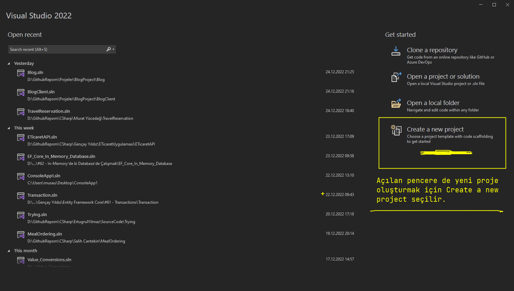

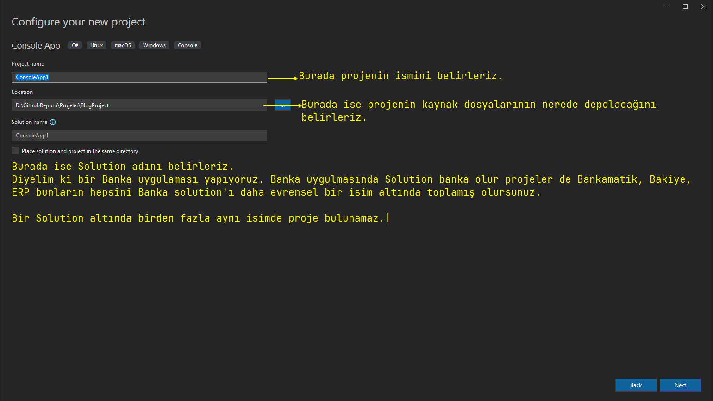

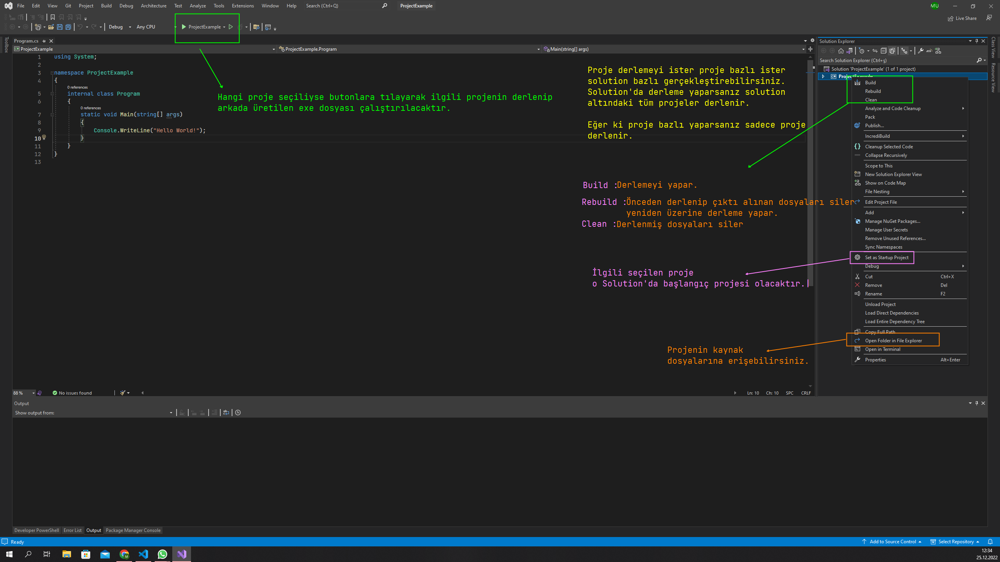

***
# 8) Visual Studio Code Ortam Tanıtımı
- Visual Studio Code çok hızlıdır.

- Microsoft tarafından UI teknolojileri için geliştirilen bir editör olduğundan dolayı hızlı kod yazmamızı/geliştirmemizi sağlıyor.

- Backend'de geliştirebilirsiniz.

- dotnet CLI dediğimiz asistana Terminal(komut satırı) üzerinden çok rahat bir şekilde komutlar verebiliyoruz.

- debugging yapabiliyorsunuz.

- Build işlemini CLI dediğimiz kod üzerinden gerçekleştiririz.

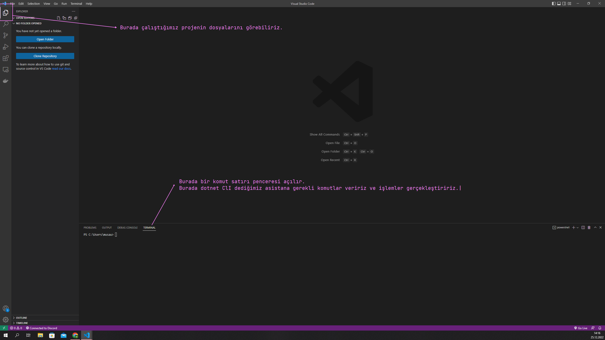

***
# 9) Visual Studio Code İle Proje Oluşturma ve Derleme
- Visual Studio Code, Visual Studio gibi direkt efektif komponentler barındırmamaktadır. Bu yüzden hali hazırda proje oluşturacak bir menü taşımamaktadır.

- Proje oluşturmak için dotnet cli komutlarından yararlanırız. 

- Dotnet CLI bizim komut satırı arayüzümüz aynı zamanda asistanımız da diyebiliriz. Bu asistanın bir arayüzü yok. Bu asistana cmd'den/powershell'den/Console'dan yani bir komut satırından talimat vermemiz gerekiyor.

- Bu talimatı verebilmek için Visual Studio Code'dan Terminal penceresini açarız.

- Öncelikle dikkat edilmesi gereken şu; Talimatı verdiğiniz dizin çok önemlidir. Çünkü projeyi o dizine oluşturacaktır.

- İlgili dizini seçtikten sonra ilgili dizinde dotnet cli komutlarını çağırırız.

- dotnet => Dotnet CLI'i çağırır. Bundan sonrasında talimat verebiliriz.

- dotnet'te ne yapacağınızı bilmezseniz direkt enter tuşuna basabilirsiniz o sizi bilgilendirir.

- dotnet --info => Dotnet CLI ile ilgili bilgi verir.

- dotnet --help => Dotnet CLI ile yapacaklarınızı görebilirsiniz.

- dotnet new => dediğimiz zaman bir proje oluştur demiş oluyoruz.

- dotnet new projectType --name projectName => Şu formata uyduğunuz sürece ilgili type'da(Console/MVC/WebApi) ve --name parametresinden sonra verdiğiniz isimde bir proje oluşturulacaktır.

- dotnet build => bulunduğunuz dizindeki projeyi build edecektir.

- dotnet run => bu dizindeki projeyi hem derleyecek hem de run edecektir/çalıştıracaktır.

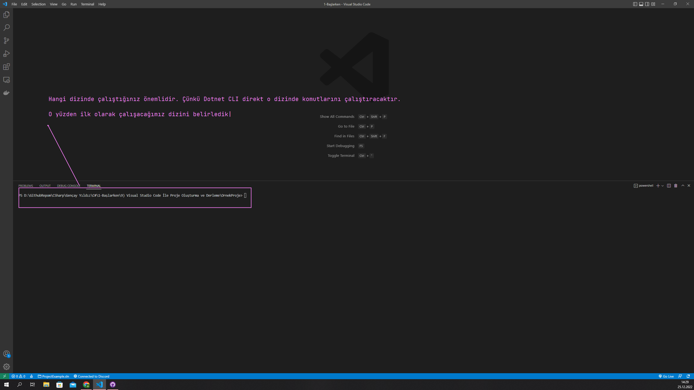
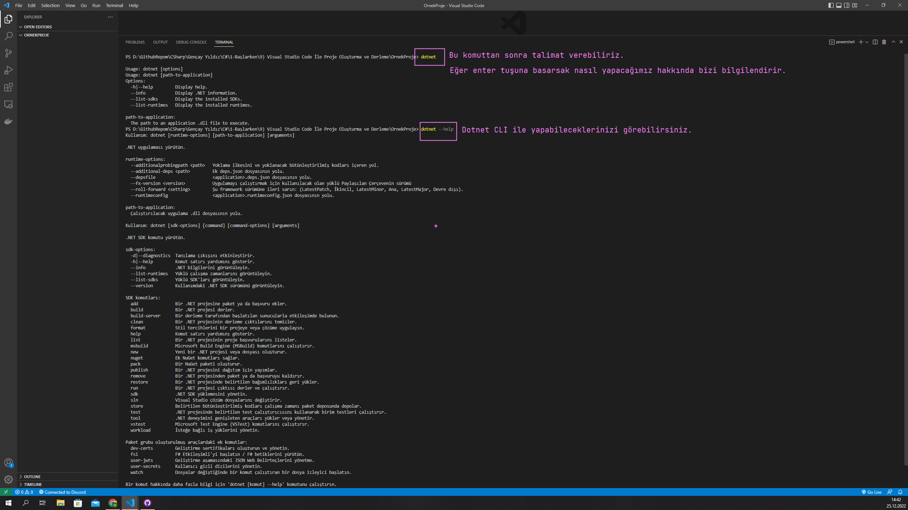
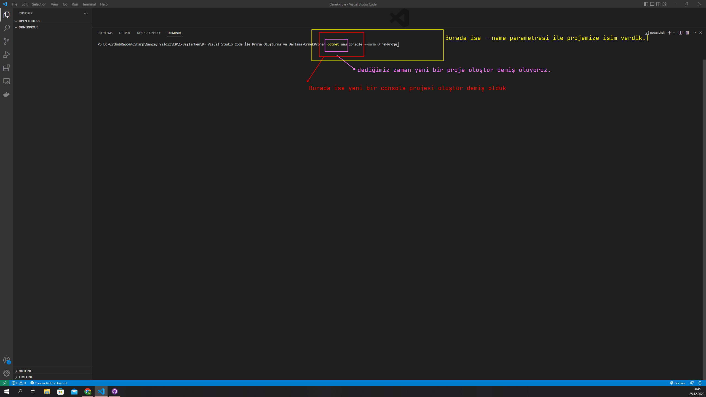

***
# 10) Dotnet CLI Nedir?
- Command Line Interface(Komut Satırı Arayüzü)

- .NET uygulamalarını geliştirirken bize eşlik eden bir komut satırı arayüzüdür.

- Programlama yaparken yazmış olduğumuz koda eşlik edecek bir asistanımızın olması lazım. Örneğin ben proje oluşturucaksam bu projeyi bir zahmet bu asistanın oluşturması gerekiyor. Benzer mantıkla kodumu yazdım en son güncellemem gerekiyor bu güncelleme işlemini manuel bir şekilde yapıp kendim sonucunu test ediyorsam bu büyük bir zamansal maliyet haliyle bunu yapacak başka bir asistana daha ihtiyacım oluyor. Bu işlemleri dotnet CLI ile de yapabiliriz.
 
- Herhangi dosyayı/projeyi oluştururken artık görsel bir grafik arayüz üzerinden işlem yapmıyorum. Çünkü iki satır kod ile ha deyince sana istediğin yapılanmayı oluşturabiliyor ve bu iki satır kopdu yazabileceğin yer herhangi bir görsellik gerektiren bir yer değil. o yüzden günümüzde CLI denilen yapılanmalar kullanıyoruz. Bu yazılımların arayüzü yoktur. Direkt konsoldan talimat alırlar.

- .NET uygulamaları geliştirmeyi, oluşturmayı, çalıştırmayı ve yayınlamayı sağlar.

- .NET SDK ile birlikte gelir.
    * SDK dediğimiz geliştirme kitimizdir. C# kodlarını yazmak çalıştırmak için SDK'ya ihtiyacımız var.

- Prototip => Dotnet [command]

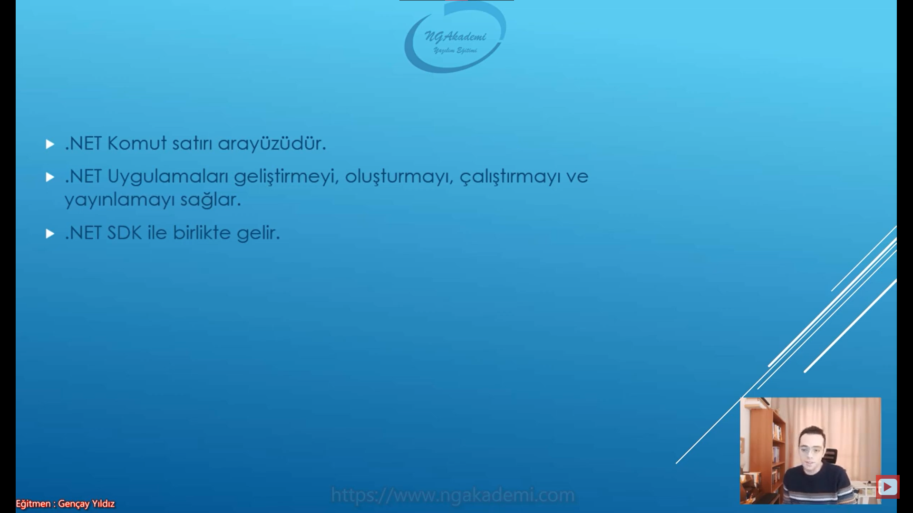

***
# 11) Dotnet CLI - Temel Komutlar - Help Komutu
- Bir program yazarken genellikle kullanacağımız .NET CLI komutlarımız bunlardır. Temel komutlar olarak geçerler.

- help

- new

- restore

- build

- publish

- run

## Help
- Dotnet CLI tarafından desteklenen komutlar hakkında ayrıntılı bilgi veren komuttur.

- dotnet help

- konsept olarak dotnet help yazdığınız zaman size neyi hangi konseptle çağırmanız gerektiğini ne şekilde kullanabileceğinizi bildiren bir komuttur.

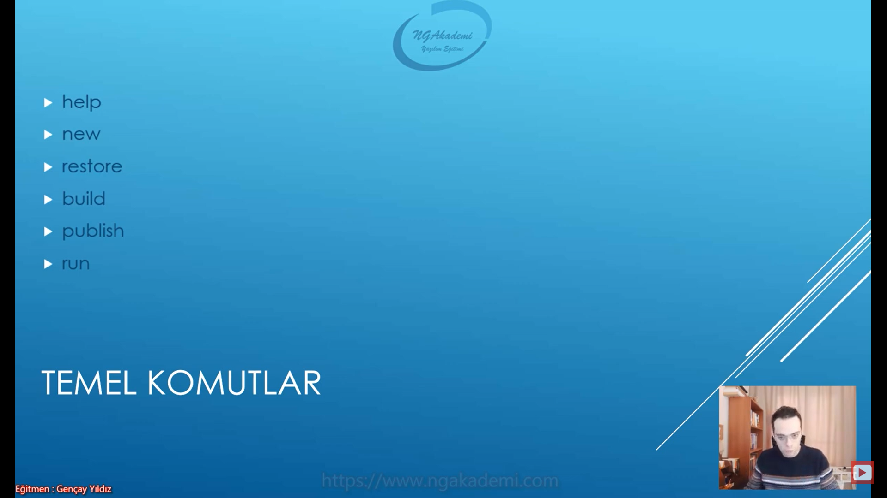

***
# 12) Dotnet CLI - Temel Komutlar - New Komutu
- dotnet CLI üzerinden proje oluşturmak istiyorsak new komutunu kullanabiliriz.

- Prototip olarak dotnet new dedikten sonra .net'e bir proje oluşturacağınızı bildiriyorsunuz. Ardından projenin türünü bildirip name parametresi eşliğinde projenin ismini belirtmeniz yeterli olacaktır. Bu işlemden sonra ilgili proje hangi dizinde enter tuşuna bastıysanız oraya oluşturulacaktır.

- dotnet new [project type] --name [project name]

- dotnet new komutunu yazdığınızda bu dotnet new  komutu ile hangi türleri oluşturabiliyorum bana onun bir yardımcısı ol söyle bakalım.

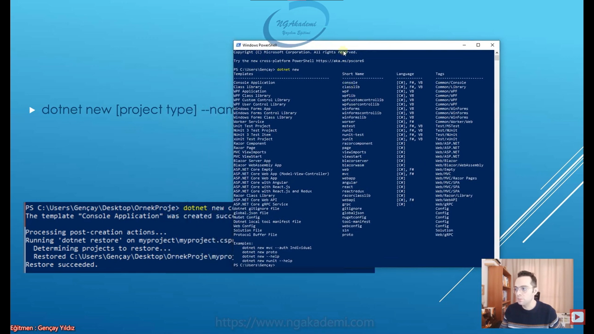

## NEW FORCE PARAMETRESİ
- dotnet new [project type] --name [project name] --force

- Eğer ki ilgili dizinde bir proje oluşturacaksanız ve oluşturacağınız projenin ismi önceki projelerle çakışıyorsa force ile siz bunu zorunlu hale getirebilirsiniz yani zorlayabilirsiniz.

- Eğer ki force paramteresiyle zorlarsan bir önceki projeyi ezecek ve yeniden oluşturacaktır.

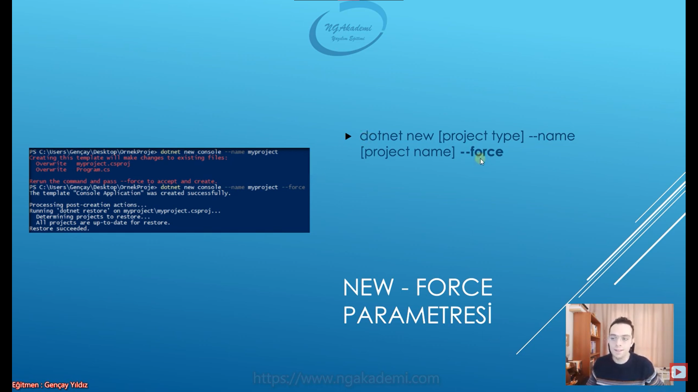

***
# 13) Dotnet CLI - Temel Komutlar - Restore Komutu
- Proje sürecinde referans edilen yahut referansı kaldırılan paketlerin restarasyonunu sağlar.

- Bir yazılımın gelişim sürecinde o yazılımla ilgili işlemleri/iş mantıklarını genellikle kah kendimiz tarafından kah başkaları tarafından önceden yazılmış kütüphanelerin desteğini alarak çözmeye biz referans mantığı diyoruz.

- Örneğin bir resim geliyor ve resimdeki yüzü almamız gerekiyor. Bu yüzü algılama algoritmasını siz önceden yazdıysanız bunu bir kütüphane olarak tutuyorsunuz ve bir daha ilgili proje de lazım olduğunda tekrardan aynı kodları yazmaksızın bu kütüphaneyi çağırıp buranın kodlarından istifade edebiliyorsunuz. İşte biz buna referans mantığı diyoruz. 

- Tabi ilgili kütüphane/kayda alınmış kütüphane/önceden oluşturulmuş kütüphane illa sizin oluşturmuş olmanıza gerek yok bunu başkaları ya da bir community tarafından oluşturulmuş kütüphane de olabilir önemli değil. Önceden oluşturulmuş mu oluşturulmuş. Önceden var olan yazılmış hali hazırdaki paketleri/kütüphaneleri kendi uygulamamızda kullanabilmek için bizim bunları uygulama da çekmemiz lazım. 

- Siz diyelim ki paketleri bir şekide referans ettiniz ve yükleyeceğinizi bildirdiniz. Bildirdiğiniz/referans ettiğiniz bu paketleri uygulamaya yükleyebilmek için uygulamayı Restore etmeniz lazım.

- Restore işleminde olmayıpta kendine referans edilmiş paketleri kendisi nuget dediğimiz bir havuzdan çeker.

- Harici paketleri sisteme yüklememizi sağlayan yapılanma Restore yapılanmasıdır.

***
# 14) Dotnet CLI - Temel Komutlar - Build Komutu
- Projeyi derler ve sonuç olarak .exe ve .dll çıktıları verir.

- Derlemeden önce projeyi Restore eder.

- \bin\Debug\net5.0 dizinine çıktı verir.

- Yani bir projeyi derleyebilmek için öncelikle onun var olan bütün kütüphanelerinin/referanslarının/bağımlılıklarının elden geçirilmiş olması lazım. Eğer ki güvenliyse/okey'se artık bunu compile/build etmesi gerekecektir.

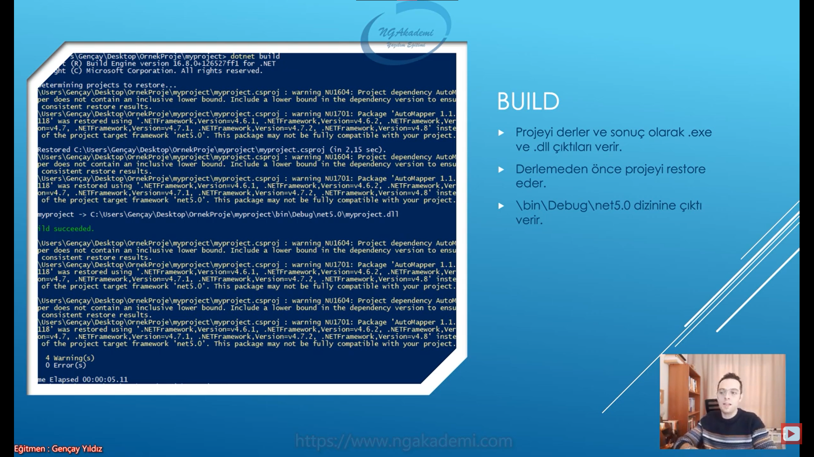

***
# 15) Dotnet CLI - Temel Komutlar - Publish Komutu
- Projeyi derleyerek yayınlanabilir dosyaları çıktı olarak verir.

- Çıktı olarak;
    * .dll
    * .deps.json(projenin tüm bağımlılıklarını içerir)
    * .runtimeconfig.json(runtime konfigürasyonları)
    * Uygulama bağımlılıklarının dll'leri

- \bin\Debug\net5.0\publish dizinine çıktı verir.

- Herhangi bir proje kaynak kodlarıyla birlikte inşa edilip piyasaya sunulmadan önce bu projenin kaynak kodlarını biz gizlemek isteriz. Bazen algoritmayı piyasaya sunmak istemeyiz. Dolayısıyla böyle bir durumda projeyi yayınlanabilir yani piyasaya sunulabilir hale getirmemiz lazım eğer ki bu proje bir web uygulaması ise bu projeyi hosting'e atabilir yayınlayabilir hale getirmemiz gerekmektedir. Haliyle kaynak kodları/dosyaları bizde olacak şekilde biz bunların çıktılarını alıp yayınlayabilmeliyiz. İşte bunu yapmamızı sağlayan Publish komutudur.

- Publish işlemi için dotnet publish yazmanız yeterlidir.

- Projeyi ilk baş derler. Daha sonra yayınlanacak çıktılarını alır.

- Bir uygulama başka bir uygulamayı kullanıyorsa, başka bir kütüphaneyi ya da paketi kullanıyorsa ona bağımlıdır. Orada bir bağımlılık söz konusudur. Dolayısıyla Publish işlemi bu bağımlılıkları referanslayan bir dosya verecektir.

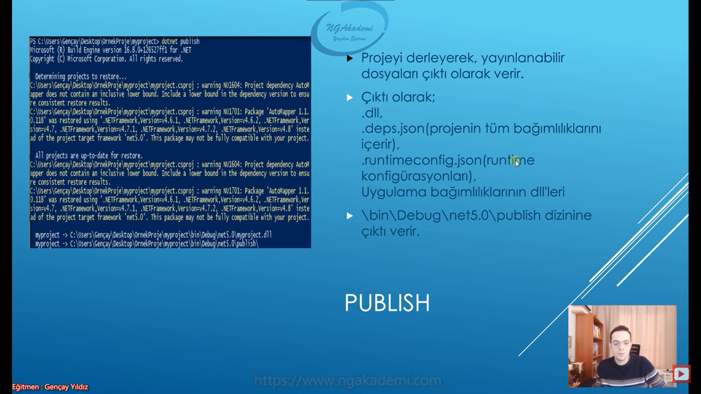

***
# 16) Dotnet CLI - Temel Komutlar - Run Komutu
- Uygulamayı derler, ayağa kaldırır ve çalıştırır.

- dotnet run dediğinizde ilgili dizindeki projeyi derleyecek ve ardından da çalıştıracaktır.

- dotnet run --no-build => Uygulamayı derlemeden direkt ayağa kaldırır. Mevcut en son derlenmiş hali neyse uygulamayı onun üzerinden ayağa kaldıracaktır.

***
# 17) Dotnet CLI - Paket ile Referans Arasındaki Fark Nedir?
- Proje seviyesinde işlemler yapmamızı sağlayan projeyle ilgili kütüphane ekleme/çıkarma referans ekleme/çıkarma işlemlerini yapmamızı sağlayan proje modifikasyon komutlarıdır.

- Paket/Kütüphane bunlar nuget dediğimiz bir havuzdan gelir.

- Referanslar ise önceden yazılmış .dll'lerdir. Yani fiziksel olarak elimizde bulunan .dll dosyalarıdır.

- Siz bir projeyi oluşturdunuz ve oluşturduğunuz projeyi build ettiğinizde o gelen .dll dosyası esasında şu anlama gelir : Bu .dll dosyası bir yazılım tarafından kullanılabilir bir dosya.

- Eğer ki siz yazdığınız bir kodu son kullanıcıya/insana kullandırtacaksanız çıktısı .exe'dir. Eğer ki senin yazılımını bir başka yazılım kullanacaksa onun da çıktısı .dll'dir. Yazılımın kullanacağı yazılımı .dll olarak gönderir.

- .dll dosyalarına referans ama nuget dediğimiz bir havuzdaki farklı kütüphanelere(uzaktan,internetten çektiklerimiz) ise paket diyoruz. Tabi bir yandan referans olanlar da bizim için bir paket mahiyetinde olabilirler ama genel anlamda teknik olarak bu ikisi bu şekilde ayrılmaktadır. 

- Bir fiziksel elinde dosya var ve uzantısı .dll ise bunu projene eklerken referans olarak eklersin yok eğer sen nuget dediğimiz havuzdan bir kütüphaneyi uygulamana çekeceksen eğer onu da paket olarak çekersin 

***
# 18) Dotnet CLI - Proje Modifikasyon Komutları - add package Komutu
- Uygulamaya Nuget'ten paket/kütüphane yüklememizi sağlar.

- Nuget havuzundan bir paketi uygulamaya yüklemeye biz paket yöntemi diyoruz.

- Kah sen Nuget'ten yüklemişsin kah .dll olarak eklemişsin her ikisi de kütüphanedir ama biz Nuget'ten gelene paket diyoruz.

- dotnet add package [package name] => o dizindeki projeye bu kütüphane yüklenmiş olacaktır.

***
# 19) Dotnet CLI - Proje Modifikasyon Komutları - add reference Komutu
- Uygulamaya fiziksel bir dll dosyasını referans etmemizi sağlar

- dotnet add [source project].csproj reference [target project].csproj

- Bir solution altından birden fazla proje kullanabiliriz. Diyelim ki uygulamamızda çok fazla proje var ve projeler birbirlerini referans etmek zorundalar. Örneğin veritabanı işlemlerinin sorumluluğunu sen bir projeye verirsin iş mantığını/algoritmaları başka bir projeye verirsin. Haliyle algoritmaların/stratejilerin/tüm mevzuların döndüğü bu proje de veritabanı işlemlerini yapmadan direkt elindeki veritabanı projesini kullanarak operasyonlarını gerçekleştirirsin. Burada ki veritabanı desteğini diğer proje verir. İşte bu desteği verebilmesi için bu proje de/iş mantığı projesinde veritabanı projesinin kullanılabilir olması yani referans edilebilir olması gerekir. İşte bu durumda Add Reference'ı kullanırız.

- dotnet add myproject.csproj reference ../ornekproje/ornekproje.csproj => myproject'te ornekproject'teki dll'i referans olarak alıyorum yani ornek projeyi sen myproject'te referans al onu kullan onun sen burada dll'ini çıktısını sen burada kullan demiş oluyoruz. Haliyle myproject ornekproject'teki tüm erişim belirleyicisi izin veren class'lara erişim sağlayıp kullanabilecek.

***
# 20) Dotnet CLI - Proje Modifikasyon Komutları - remove package Komutu
- Uygulamaya yüklenmiş olan paketlerin/kütüphanelerin silinmesini sağlar.

- dotnet remove package [package name]

***
# 21) Dotnet CLI - Proje Modifikasyon Komutları - remove reference Komutu
- Uygulamaya referans edilmiş dll'leri kaldırır.

- dotnet remove reference [reference name]

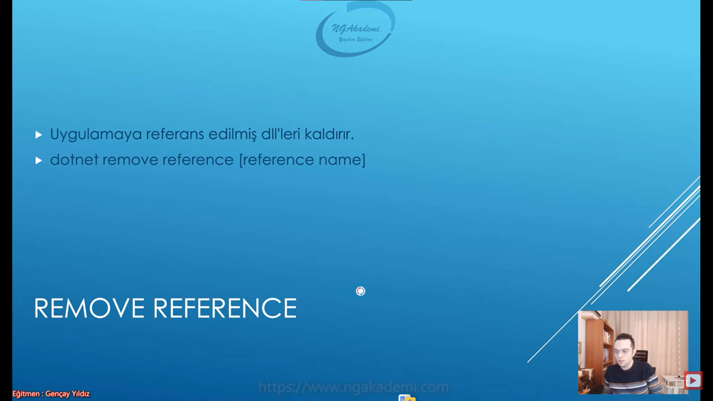

***
