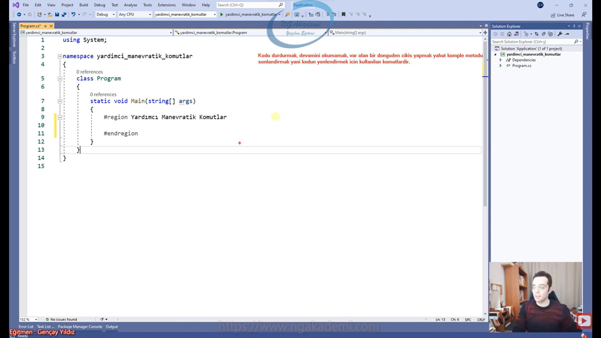
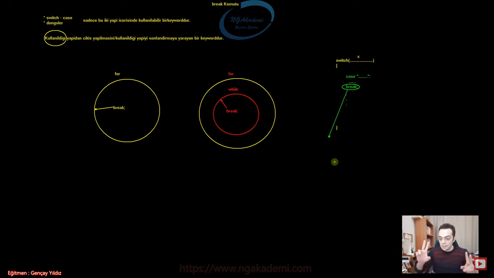

***
# 228) Algoritmada Manevra Yapmamızı Sağlayan Komutlarda Neyin Nesi
- Bir metodun içerisinde oluşturmuş olduğunu herhangi bir döngüde çalışıyorsunuz algoritmanızının akışı gayet güzel bir şekilde devam ediyor ama baktınız ki ihtiyaca binaen algoritma da örneğin orada ki döngüdeki kombinasyon sona ermeden senin döngüyü sonlandırman lazım. Ya da döngünün belirli turlarını es geçmen lazım. Ya da komple metodu sonlandırman lazım. Böyle durumlarda sürekli değişken tanımlama yaparak zıplama yapıyorum koşulu değişkenle takip ediyorum vs. İşte böyle durumlarda manevratik komutları kullanmalıyız.

- Manevratik komutlar sistemi/algoritmayı inşa ettiğiniz ve algoritama da normal gidişatta gidişata müdahale etmenizi sağlayan ve belirli manevralar yapmanızı sağlayan komutlardır. Örneğin kodu durdurmak istiyorsan mesela bir döngüdesindir ve döngüde belirli periyotları geçmek isteyebilirsin yani devamını okumamak isteyebilirsin. Döngüden komple çıkış yapmak isteyebilirsin yani kombinasyonun sonucunu beklemeksizin döngünün sonlanmasını isteyebilirsin. Yahut komple metodu sonlandırmak isteyebilirsin. Böyle durumlarda manevratik komutlardan inanılmaz derecede faydalanıyoruz.

- Kodu durdurmak, devamını okumamak, var olan bir döngüden çıkış yapmak, yahut komple metodu sonlandırmak yani kodu yönlendirmek için kullanılan komutlardır.



- `for (int i = 0; i < 100; i++){}` Şimdi bu döngü birgün sonlanacak i değişkeninin değeri 100'den büyük olduğu yada eşit olduğu zaman bu döngüden çıkılacaktır. Örneğin diyorum ki 23.adımda çık ya da hava bulutluysa çık Yani belirli bir şarta bağlayıp çıkarmak istiyorum. Bunu biz normalde manevratik komutları bilmeden de yapabiliyoruz. Biz şartımızı neye bağladıysak onun üzerinde içeride müdahale edip şartı değiştirdiğimizde şartı `false`a düşürdüğümüzde zaten ilgili döngüden çıkabiliyorduk. Ama bu kadar kompleks çalışmak zorunda mıyım? Örneğin `i == 22`yse çık demek için `i = 100` değerini mi atamalıyım? Evet bunu yapabilirsin ama döngüden çıkmak daha kolay olabilmeli döngüye manevra kazandırabilmek daha kolay olabilmeli. İşte böyle bir durumda döngüden çıkmak istiyorsan normalde `break` komutunu kullanacağım. Bunun dışında 0'dan 100'e kadar dönüyoruz ama `i == 22` durumuyla ilgili herhangi bir iş yapmak istemiyorum. Bu durumu es geçmek istiyorum yani `i == 22` durumunun olduğu algoritmayı çalıştırmak istemiyorum kod direkt `i == 23` durumuna geçsin istiyorum belirli bir condition yapacaksın. Mümkündür yapılabilir bir yöntemdir. Ama `continue` komutu sana daha çok yardımcı olacaktır. Daha hızlı daha efektif çözüm sunmanı sağlayacaktır. Ya da komple metodun sonlandırılmasını istiyorsun örneğin `i == 22` durumundayken komple metodun sonlandırılmasını istiyorsun bunun için gerekli operasyonu yaptın diyelim uzun uzun. Karman çorman bişey koydun ortaya halbuki `return` komutunu bilseydin eğer burada tek seferde komple bu metodun sonlandırabileceğini çok rahat anlardın ve çok rahat çözüm sunabilirdin.

- Manevratik komutlar aslında bizim yapamayacağımız şeyleri yapmamızı sağlayan komutlar değil yapabildiğimiz şeyleri daha efektif yapmamızı sağlayan yapılardır.

- Manevratik komutlar yapamayacağımız şeyleri yapmamızı sağlayan komutlar değildir! Yapabileceğimiz manevraları/kodun yönlendirmelerini daha efektif yapmamızı sağlarlar.

- 4 tane manevra komutumuz vardır;
    * `break`
    * `continue`
    * `return`
    * `goto`

```C#
#Yardımcı Manevratik Komutlar
for (int i = 0; i < 100; i++)
{
    if (i == 22)
    {
        i = 100;
    }
}
```

***
# 229) Manevratik Komutlar - break Komutu Nedir?
- Programlama da iki farklı yerde kullanılan komuttur.
    * `switch case`
    * döngüler
    - Sadece bu iki yapıda kullanılabilir bir keyworddür.

- Kullanıldığı yapıdan çıkış yapılmasını/kullanıldığı yapıyı sonlandırmaya yarayan bir keyworddür.

- Nerede kullanılıyorsa oradan çıkış yapacaktır.

- Senin kullandığın `break` komutu diyelim ki iki tane iç içe döngü olsun eğer sen `break` komutunu içteki döngüde kullanırsan eğer kullanıldığı döngüden çıkacaktır yani içteki döngüden çıkacaktır.

- `switch case` pattern matching kullanmıyorsanız en sade haliyle verilen değerin eşitlik durumunu incelediğimiz bir akış kontrol mekanizmasıydı. İşte bu mekanizmada `case` bloklarından sonra `break` komutunu kullanıyorduk. Çünkü `case` bloklarında yapılan işlem sonlanınca artık `switch` bloğundan çıkarak işlemimizi tamamlamamız gerekiyordu. Nihayetinde `break` komutunu kullanmazsan buradaki akış devam edecek ve devamındaki `case` bloklarına bakmaya devam edecek. Halbuki buradaki amacımız tek `case`in çalışması diğerlerine bakılmaması. İşte burada akış `break` komutunu gördüğü vakit direkt compiler buradan çıkacaktır. 



- `break` komutu döngülerde ve `switch case` yapılanmasında kullanılır.

- `break` komutu iterasyon yapılanmasında da kullanılan bir keyworddür. Aynı şekilde `foreach`i de sonlandırmamızı sağlar.

- Döngünün içinde kullandığın diğer tüm yapılanmalarda da kullanabilirsin tek şart döngünün içinde olması bu yapılanmaların.

- `break` komutu zaten şarta bağlı bir şekilde kullanılır bu keyword genellikle. Döngüde dönüyorsun dönerken eğer ki şu durum gerçekleştiyse `break` burada eğer ifadesini yani `if` yapılanmasını zaten kullanman gerekecek.

- Döngü içerisinde herhangi bir yapılanma varsa onun içinde de kullanabiliyoruz. 

- Döngü içerisinde `try catch` yapısının kullanımı çok tavsiye edilmez çünkü ucuz bir işlem değildir bayaa maliyetlidir.

- `break` komutuna döngülerde ve `switch` yapılanmalarında erişebilmekteyiz.

- Görev olarak bu akış `break` komutunu tetiklediğinde kesinlikle ilgili döngüden `switch case` yapılanmasından çıkacağını artık biliyoruz.

- `break` komutu kullanıldığı yerde ilk derece de çıkış yapacaktır. Sonraki derecelerde onları kendi içlerinde tetiklemeniz gerekecektir.

```C#
#region Break
switch (10)
{
    case 5:
        break;
    case 10:
        break;
    case 15:
        break;
}
while (true)
{
    break;
}
for (int i = 0; i < 10; i++)
{
    break;
}
do
{
    break;
} while (true);
foreach (var item in new[] { "" })
{
    break;
}
for (int i = 0; i < 10; i++)
{
    while (true)
    {
        break;
    }
}
do
{
    if (true)
    {
        break;
    }
} while (true);
while (true)
{
    try
    {
        break;
    }
    catch (System.Exception)
    {
        throw;
    }
}

while (true)
{
    if (DateTime.Now.Second == 45)
        break;
    System.Console.WriteLine(DateTime.Now);
}

for (int i = 0; i < 5; i++)
{
    for (int j = 0; j < 3; j++)
    {
        if (j == 1)
            break;
        System.Console.WriteLine("i : " + i + " j : " + j);
    }
}
#endregion
```

***
# 230) Manevratik Komutlar - break Komutunu Örneklendirelim 1
- Senaryo : Kullanıcıdan 't' harfi girene kadar alınan sınırsız sayıda sayıyı toplayan ve sonucu ekrana yazdıran uygulamayı yazalım.

- Bu senaryoda sonsuz döngüye gireriz. İşte bu senaryoda girilen değer `string` bir ifade olan `t` değeri olma ihtimali olduğu için kullanıcıdan gelen değeri `string` ile karşılarız. Daha sonrasında ise girilen değer `t` mi diye kontrol ederiz. Eğer `t` ise işlemi sonlandırır ekrana çıktıyı yazdırırız.

- `break` komutu sürekli ve her yerde kullanılıyor. Bir döngüden `switch case` den çıkman gerekir. Çıkman gerektiğinde `break`i kullanacaksın.

```C#
#Break Örnek
//Kullanıcıdan 't' harfi girene kadar alınan sınırsız sayıda sayıyı toplayan ve sonucu ekrana yazdıran uygulamayı yazalım.

#Çözümüm
int sayi, toplam = 0;
string deger;
while (true)
{
    System.Console.Write("Sayı Giriniz : ");
    deger = Console.ReadLine();
    if (deger == "t")
        break;
    sayi = int.Parse(deger);
    toplam += sayi;
}
System.Console.WriteLine("Toplam : " + toplam);

#Hocanın Çözümü
int toplamH = 0;
while (true)
{
    System.Console.WriteLine("Lütfen bir sayı giriniz.");
    string girilenDeger = Console.ReadLine();
    if (girilenDeger == "t")
    {
        System.Console.WriteLine("Toplam Sonuç : " + toplamH);
        break;
    }
    else
    {
        toplamH += int.Parse(girilenDeger);
    }
}
```

***
# 231) Manevratik Komutlar - break Komutunu Örneklendirelim 2
- Senaryo : Kullanıcıdan alınan sonsuz adet sayı değerlerinden 37'nin katı girildiğinde sonlanan uygulamayı yazalım.  

- Sayıları sınırsız isteyeceğiz yani burada sonsuz döngüsel bir işlem var. Ardından kullanıcıdan sayı isteyeceğiz. Sonra bu girilen sayıyı kontrol ediyoruz yani `sayi % 37 == 0` ise diyerek kontrolümü sağlayıp `break` keywordümü kullanıyorum.

- `break` komutu burada yapmış olduğunuz manevranın yerine kendisi zaten manevrayı sağlıyor. Onun için manevratik komutlar diyoruz bu komutlara.

- `break` komutu kullanıldığı yerler sadece döngüler ve `switch case` blokları. Sadece kullanıldığı döngüden ve `switch case` bloğundan çıkmamızı sağlayan bir manevratik komuttur.

```C#
#Break Örnek
//Kullanıcıdan alınan sonsuz adet sayı değerlerinden 37'nin katı girildiğinde sonlanan uygulamayı yazalım.    
bool durum = true;
while (durum)
{
    System.Console.WriteLine("Lütfen Bir Sayı Giriniz.");
    int sayi = int.Parse(Console.ReadLine());
    if (sayi % 37 == 0)
    {
        System.Console.WriteLine("Uygulama Sonlanmıştır");
        // durum = !durum;
        break;
    }
}
```