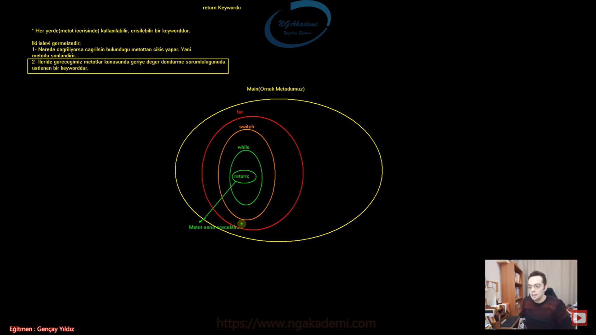
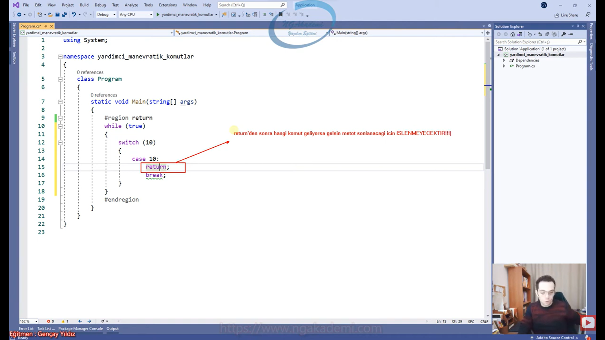
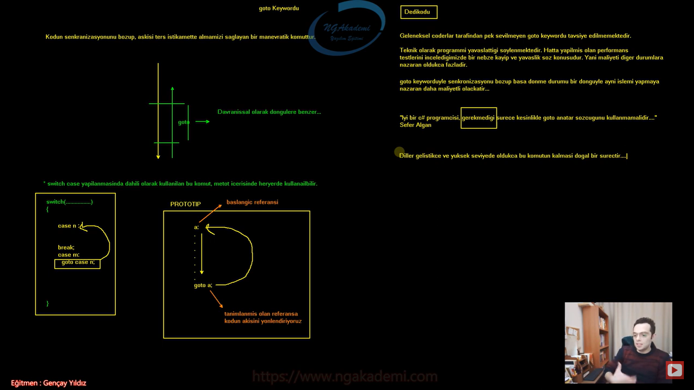
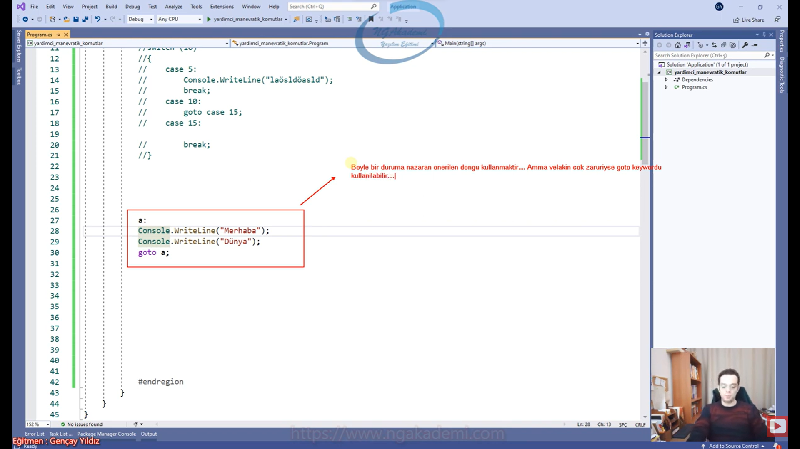

***
# 228) Algoritmada Manevra Yapmamızı Sağlayan Komutlarda Neyin Nesi
- Bir metodun içerisinde oluşturmuş olduğunu herhangi bir döngüde çalışıyorsunuz algoritmanızının akışı gayet güzel bir şekilde devam ediyor ama baktınız ki ihtiyaca binaen algoritma da örneğin orada ki döngüdeki kombinasyon sona ermeden senin döngüyü sonlandırman lazım. Ya da döngünün belirli turlarını es geçmen lazım. Ya da komple metodu sonlandırman lazım. Böyle durumlarda sürekli değişken tanımlama yaparak zıplama yapıyorum koşulu değişkenle takip ediyorum vs. İşte böyle durumlarda manevratik komutları kullanmalıyız.

- Manevratik komutlar sistemi/algoritmayı inşa ettiğiniz ve algoritama da normal gidişatta gidişata müdahale etmenizi sağlayan ve belirli manevralar yapmanızı sağlayan komutlardır. Örneğin kodu durdurmak istiyorsan mesela bir döngüdesindir ve döngüde belirli periyotları geçmek isteyebilirsin yani devamını okumamak isteyebilirsin. Döngüden komple çıkış yapmak isteyebilirsin yani kombinasyonun sonucunu beklemeksizin döngünün sonlanmasını isteyebilirsin. Yahut komple metodu sonlandırmak isteyebilirsin. Böyle durumlarda manevratik komutlardan inanılmaz derecede faydalanıyoruz.

- Kodu durdurmak, devamını okumamak, var olan bir döngüden çıkış yapmak, yahut komple metodu sonlandırmak yani kodu yönlendirmek için kullanılan komutlardır.


- `for (int i = 0; i < 100; i++){}` Şimdi bu döngü birgün sonlanacak i değişkeninin değeri 100'den büyük olduğu yada eşit olduğu zaman bu döngüden çıkılacaktır. Örneğin diyorum ki 23.adımda çık ya da hava bulutluysa çık Yani belirli bir şarta bağlayıp çıkarmak istiyorum. Bunu biz normalde manevratik komutları bilmeden de yapabiliyoruz. Biz şartımızı neye bağladıysak onun üzerinde içeride müdahale edip şartı değiştirdiğimizde şartı `false`a düşürdüğümüzde zaten ilgili döngüden çıkabiliyorduk. Ama bu kadar kompleks çalışmak zorunda mıyım? Örneğin `i == 22`yse çık demek için `i = 100` değerini mi atamalıyım? Evet bunu yapabilirsin ama döngüden çıkmak daha kolay olabilmeli döngüye manevra kazandırabilmek daha kolay olabilmeli. İşte böyle bir durumda döngüden çıkmak istiyorsan normalde `break` komutunu kullanacağım. Bunun dışında 0'dan 100'e kadar dönüyoruz ama `i == 22` durumuyla ilgili herhangi bir iş yapmak istemiyorum. Bu durumu es geçmek istiyorum yani `i == 22` durumunun olduğu algoritmayı çalıştırmak istemiyorum kod direkt `i == 23` durumuna geçsin istiyorum belirli bir condition yapacaksın. Mümkündür yapılabilir bir yöntemdir. Ama `continue` komutu sana daha çok yardımcı olacaktır. Daha hızlı daha efektif çözüm sunmanı sağlayacaktır. Ya da komple metodun sonlandırılmasını istiyorsun örneğin `i == 22` durumundayken komple metodun sonlandırılmasını istiyorsun bunun için gerekli operasyonu yaptın diyelim uzun uzun. Karman çorman bişey koydun ortaya halbuki `return` komutunu bilseydin eğer burada tek seferde komple bu metodun sonlandırabileceğini çok rahat anlardın ve çok rahat çözüm sunabilirdin.

- Manevratik komutlar aslında bizim yapamayacağımız şeyleri yapmamızı sağlayan komutlar değil yapabildiğimiz şeyleri daha efektif yapmamızı sağlayan yapılardır.

- Manevratik komutlar yapamayacağımız şeyleri yapmamızı sağlayan komutlar değildir! Yapabileceğimiz manevraları/kodun yönlendirmelerini daha efektif yapmamızı sağlarlar.

- 4 tane manevra komutumuz vardır;
    * `break`
    * `continue`
    * `return`
    * `goto`

```C#
#Yardımcı Manevratik Komutlar
for (int i = 0; i < 100; i++)
{
    if (i == 22)
    {
        i = 100;
    }
}
```

***
# 229) Manevratik Komutlar - break Komutu Nedir?
- Programlama da iki farklı yerde kullanılan komuttur.
    * `switch case`
    * döngüler
    - Sadece bu iki yapıda kullanılabilir bir keyworddür.

- Kullanıldığı yapıdan çıkış yapılmasını/kullanıldığı yapıyı sonlandırmaya yarayan bir keyworddür.

- Nerede kullanılıyorsa oradan çıkış yapacaktır.

- Senin kullandığın `break` komutu diyelim ki iki tane iç içe döngü olsun eğer sen `break` komutunu içteki döngüde kullanırsan eğer kullanıldığı döngüden çıkacaktır yani içteki döngüden çıkacaktır.

- `switch case` pattern matching kullanmıyorsanız en sade haliyle verilen değerin eşitlik durumunu incelediğimiz bir akış kontrol mekanizmasıydı. İşte bu mekanizmada `case` bloklarından sonra `break` komutunu kullanıyorduk. Çünkü `case` bloklarında yapılan işlem sonlanınca artık `switch` bloğundan çıkarak işlemimizi tamamlamamız gerekiyordu. Nihayetinde `break` komutunu kullanmazsan buradaki akış devam edecek ve devamındaki `case` bloklarına bakmaya devam edecek. Halbuki buradaki amacımız tek `case`in çalışması diğerlerine bakılmaması. İşte burada akış `break` komutunu gördüğü vakit direkt compiler buradan çıkacaktır. 


- `break` komutu döngülerde ve `switch case` yapılanmasında kullanılır.

- `break` komutu iterasyon yapılanmasında da kullanılan bir keyworddür. Aynı şekilde `foreach`i de sonlandırmamızı sağlar.

- Döngünün içinde kullandığın diğer tüm yapılanmalarda da kullanabilirsin tek şart döngünün içinde olması bu yapılanmaların.

- `break` komutu zaten şarta bağlı bir şekilde kullanılır bu keyword genellikle. Döngüde dönüyorsun dönerken eğer ki şu durum gerçekleştiyse `break` burada eğer ifadesini yani `if` yapılanmasını zaten kullanman gerekecek.

- Döngü içerisinde herhangi bir yapılanma varsa onun içinde de kullanabiliyoruz. 

- Döngü içerisinde `try catch` yapısının kullanımı çok tavsiye edilmez çünkü ucuz bir işlem değildir bayaa maliyetlidir.

- `break` komutuna döngülerde ve `switch` yapılanmalarında erişebilmekteyiz.

- Görev olarak bu akış `break` komutunu tetiklediğinde kesinlikle ilgili döngüden `switch case` yapılanmasından çıkacağını artık biliyoruz.

- `break` komutu kullanıldığı yerde ilk derece de çıkış yapacaktır. Sonraki derecelerde onları kendi içlerinde tetiklemeniz gerekecektir.

```C#
#region Break
switch (10)
{
    case 5:
        break;
    case 10:
        break;
    case 15:
        break;
}
while (true)
{
    break;
}
for (int i = 0; i < 10; i++)
{
    break;
}
do
{
    break;
} while (true);
foreach (var item in new[] { "" })
{
    break;
}
for (int i = 0; i < 10; i++)
{
    while (true)
    {
        break;
    }
}
do
{
    if (true)
    {
        break;
    }
} while (true);
while (true)
{
    try
    {
        break;
    }
    catch (System.Exception)
    {
        throw;
    }
}

while (true)
{
    if (DateTime.Now.Second == 45)
        break;
    System.Console.WriteLine(DateTime.Now);
}

for (int i = 0; i < 5; i++)
{
    for (int j = 0; j < 3; j++)
    {
        if (j == 1)
            break;
        System.Console.WriteLine("i : " + i + " j : " + j);
    }
}
#endregion
```

***
# 230) Manevratik Komutlar - break Komutunu Örneklendirelim 1
- Senaryo : Kullanıcıdan 't' harfi girene kadar alınan sınırsız sayıda sayıyı toplayan ve sonucu ekrana yazdıran uygulamayı yazalım.

- Bu senaryoda sonsuz döngüye gireriz. İşte bu senaryoda girilen değer `string` bir ifade olan `t` değeri olma ihtimali olduğu için kullanıcıdan gelen değeri `string` ile karşılarız. Daha sonrasında ise girilen değer `t` mi diye kontrol ederiz. Eğer `t` ise işlemi sonlandırır ekrana çıktıyı yazdırırız.

- `break` komutu sürekli ve her yerde kullanılıyor. Bir döngüden `switch case` den çıkman gerekir. Çıkman gerektiğinde `break`i kullanacaksın.

```C#
#Break Örnek
//Kullanıcıdan 't' harfi girene kadar alınan sınırsız sayıda sayıyı toplayan ve sonucu ekrana yazdıran uygulamayı yazalım.

#Çözümüm
int sayi, toplam = 0;
string deger;
while (true)
{
    System.Console.Write("Sayı Giriniz : ");
    deger = Console.ReadLine();
    if (deger == "t")
        break;
    sayi = int.Parse(deger);
    toplam += sayi;
}
System.Console.WriteLine("Toplam : " + toplam);

#Hocanın Çözümü
int toplamH = 0;
while (true)
{
    System.Console.WriteLine("Lütfen bir sayı giriniz.");
    string girilenDeger = Console.ReadLine();
    if (girilenDeger == "t")
    {
        System.Console.WriteLine("Toplam Sonuç : " + toplamH);
        break;
    }
    else
    {
        toplamH += int.Parse(girilenDeger);
    }
}
```

***
# 231) Manevratik Komutlar - break Komutunu Örneklendirelim 2
- Senaryo : Kullanıcıdan alınan sonsuz adet sayı değerlerinden 37'nin katı girildiğinde sonlanan uygulamayı yazalım.  

- Sayıları sınırsız isteyeceğiz yani burada sonsuz döngüsel bir işlem var. Ardından kullanıcıdan sayı isteyeceğiz. Sonra bu girilen sayıyı kontrol ediyoruz yani `sayi % 37 == 0` ise diyerek kontrolümü sağlayıp `break` keywordümü kullanıyorum.

- `break` komutu burada yapmış olduğunuz manevranın yerine kendisi zaten manevrayı sağlıyor. Onun için manevratik komutlar diyoruz bu komutlara.

- `break` komutu kullanıldığı yerler sadece döngüler ve `switch case` blokları. Sadece kullanıldığı döngüden ve `switch case` bloğundan çıkmamızı sağlayan bir manevratik komuttur.

```C#
#Break Örnek
//Kullanıcıdan alınan sonsuz adet sayı değerlerinden 37'nin katı girildiğinde sonlanan uygulamayı yazalım.    
bool durum = true;
while (durum)
{
    System.Console.WriteLine("Lütfen Bir Sayı Giriniz.");
    int sayi = int.Parse(Console.ReadLine());
    if (sayi % 37 == 0)
    {
        System.Console.WriteLine("Uygulama Sonlanmıştır");
        // durum = !durum;
        break;
    }
}
```

***
# 232) Manevratik Komutlar - continue Komutu Nedir?
- Sade ve sadece döngülerden erişilebilen ve döngülerde kullanılabilen bir keyworddür.

- Amaç olarak devam et'e yani döngülerde bazen biz yapmış olduğumuz kombinasyona göre elde ettiğimiz değerler olacak işte o değerlere göre o anki turda ben işlem yapmak istemeyebilirim. Yani ben bu değerlere göre bu turda işlem yapmamam lazım ya da bir sonraki değere geçmem lazım gibi ihtiyacım olabiliyor. İşte böyle durumlarda döngünün o anki turunu bırakıp bir sonraki tura geçiş yapabilmenizi sağlayan bir keyworddür. Ondan dolayı devam et gülüm diyor.

- Amaç : Döngüde bir sonraki tura geçilmesini sağlar. Yani bir sonraki periyoda direkt geçiş yaptırır.

- Diyelim ki senin bir döngün var ve bu döngünün içinde belirli işlemler var. Döngünde `i` diye bir değişkenin var ve bunun değeri 33. değerde ve dış algoritmadan/parametrelerden/değişkenlerden gelen değerleri içeride işlediğini varsayalım. Belirli değerlere göre diyosun ki ya kardeşim eğer `i` 33 değerindeyse sen `continue` yap yani 33'te bunu işleme buradaki turda dur işlem yapma derseniz eğer `continue` kendinden sonraki kodları/komutları tetiklemeyecek/çalıştırmıyacaktır. Döngünün başına gelecek ve bir sonraki tura yani i'nin değeri 34'ten devam edecek. `continue` döngünün içerisinde nereye denk geldiyse oradan sonra bırakacak bir sonraki turdan devam edecek. Senin döngünün başına dönüp kombinasyonel baştan bahsetmiyoruz. Kombinasyonel işlemini devam ettirmenden bahsediyoruz. 

- Kombinasyon devam etsin diyebilmen için kullandığımız bir keyworddür. Devam et kardeşim ben 33'te işlem yapmak istemiyorum 34'e sen devam et demenin yoludur.


- Senin bana getirmiş olduğun değerler algoritmada gelen bütün parametrik değerler benim işimi görmüyor ne gerek var bütün algoritmayı tekrar yapmaya geç kardeşim devam et sonraki değerleri getir. Hızlıca baktı işine yaramayan değer var bir sonraki tura geç demenin yoludur.

- Sadece döngülerde kullanılır ve bütün döngülerde kullanabilirsiniz. Döngülerin içerisinde herhangi bir yapılanma olabilir ve orada da kullanabilirsiniz. `continue` hangi döngüdeyse bir sonraki tura geç kardeşim diyecek.

- Yapısal olarak bir manevratik keyworddür. Nihayetinde sen döngüde dönerken bazen bir duruma göre dönmeyip bir sonraki işlemden devam edebiliyorsun.

```C#
#continue
for (int i = 0; i < 10; i++)
{
    if (i % 2 != 0)
        continue;
    System.Console.WriteLine(i);
}
while (true)
{
    if (true)
    {
        switch (1)
        {
            case 5:
                continue;
                break;
            default:
        }
    }
}
```

***
# 233) Manevratik Komutlar - continue Komutunu Örneklendirelim 1
- Senaryo : Kullanıcının girdiği sonsuz adet sayıdan pozitif olanlarını çarpan ve 't'(enter) yapıldığında sonucu ekrana yazdıran kodu yazalım.

- Kullanıcı sonsuz adet sayı giriyorsa `while` döngüsünden sonsuz döngüye giriyoruz. Sonrasında girilen değeri `t` mi diye kontrol ediyoruz ki ekrana çıktı alabilelim. İstersen 1. ihtimalde eğer girilen sayi > 0 ise çarpım işlemine dahil et diyebilirsin. 2. İhtimalde ise `continue` kullanabilirsin yani sayi < 0 işleminde `continue` dersin yani bunu atla eğer büyükse sen bunu çarpım işlemine dahil et diyebilirsin.

```C#
#region Continue - Örnek
//Kullanıcının girdiği sonsuz adet sayıdan pozitif olanlarını 
#region Çözümüm
string deger;
int sayi, carpim = 1;
while (true)
{
    System.Console.Write("Sayı Giriniz : ");
    deger = Console.ReadLine();
    if (deger == "t")
    {
        System.Console.WriteLine("Sonuç : " + carpim);
        break;
    }
    else
    {
        sayi = int.Parse(deger);
        if (sayi < 0)
            continue;
        carpim *= sayi;
    }
}
#endregion
#region Hocanın Çözümü
int carpimH = 1;
while (true)
{
    System.Console.WriteLine("Lütfen bir sayı giriniz.");
    string girilenDeger = Console.ReadLine();
    if (girilenDeger == "t")
    {
        System.Console.WriteLine(carpim);
    }
    else
    {
        int sayiH = int.Parse(girilenDeger);
        #region 1. İhtimal
        if (sayiH > 0)
            carpimH *= sayiH;
        #endregion
        #region 2. İhtimal
        if (sayiH < 0)
            continue;
        carpimH *= sayiH;
        #endregion
    }
}
```

***
# 234) Manevratik Komutlar - continue Komutunu Örneklendirelim 2
- Senaryo : 1 ile 1000 arasında 7'nin katı olmayan sayıları ekrana yazdıralım.

- 1'den 1000'e kadar gitmem gerekiyor benim için uygun döngü `for`.  Burada sayı eğer 7'nin katıysa `continue` komutuyla geçeceğiz.

- `continue` bir sonraki adıma bir sonraki periyoda geçecek olan bir keyworddür.

```C#
#Continue - Örnek
//1 ile 1000 arasında 7'nin katı olmayan sayıları ekrana yazdıralım.
for (int i = 1; i <= 1000; i++)
{
    if (i % 7 == 0)
        continue;
    System.Console.WriteLine(i);
}
```

***
# 235) Manevratik Komutlar - return Komutu Nedir?
- Her yerde(metot içerisinde) kullanılabilir, erişilebilir bir keyworddür. Diğerlerine(`break`, `continue`) nazaran metodun içerisinde her yerde kullanabiliyorsun.

- İki işlevi görmektedir;
    1. Nerede çağırılıyorsa çağrılsın bulunduğu metottan çıkış yapar. Yani metodu sonlandırır...
    2. İleride göreceğimiz metotlar konusunda geriye değer döndürme sorumluluğunuda üstlenen bir keyworddür.

- Nerede çağırırsan çağır farketmiyor eğer ki akış return komutunu gördüyse ilgili metodu kesecektir. Uygulama sona erecektir haliyle.

- Diyelim ki bir metodunuz var ve bu metotta istediğiniz yerde `return` keywordünü kullanın farketmiyor yeter ki metodun scope'ları içinde olsun. Compiler bu keywordü gördüğü zaman haydi selametle diyip metottan çıkacaktır.



- Metodun içerisinde her yerde kullanılırdan kastımız herhangi bir şeyin içerisinde tanımlanmış herhangi birşeylerin içerisinde de kullanılabilir.

- Uygulama `return`ü gördüğü yerde metottan çıkacağı için devamı falan gelmez dolayısıyla `return`den sonra hangi komut varsa hiçbiri işlenmeyecektir.

- `return`den sonra hangi komut geliyorsa gelsin metot sonlanacağı için İŞLENMEYECEKTİR!!!



***
# 236) Manevratik Komutlar - return Komutunu Örneklendirelim
- Senaryo : Kullanıcı 'c' tuşuna basana kadar sonsuz döngüde dönen uygulamayı yazınız.

- Burada `Console.ReadLine()` değerini almayacağız çünkü `Console.ReadLine()` komutu `enter` tuşuna basıldığında yazılan değeri gönderiyor. Ama burada direkt basan diyor tuşa bastığı anda denetlesin istiyorsak eğer `Console.ReadKey()` getirecektir.

- `Console.ReadKey().KeyChar` : Tıklanan karakteri bize `char` olarak getirecektir.

- `return` yazıldığı yerde tetiklendiği anda ilgili metottan çıkacak metodu sonlandıracaktır.

```C#
#return Örnek
//Kullanıcı 'c' tuşuna basana kadar sonsuz döngüde dönen uygulamayı yazınız.
while (true)
{
    if (Console.ReadKey().KeyChar == 'c')
    {
        System.Console.WriteLine();
        System.Console.WriteLine("Uygulama Sona Ermiştir.");
        return;
    }
    System.Console.WriteLine();
    System.Console.WriteLine("Uygulama Çalışıyor...");
}
```

***
# 237) Manevratik Komutlar - goto Komutu Nedir?
- Kodun senkronizasyonunu bozup akışı ters istikamette almamızı sağlayan bir manevratik komuttur.

- İstediğin herhangi bir yere kodu şimdi akış yukarıdan aşağıya ya akarken kod istediğin yere dönmeni sağlayabilen bir manevratik keyworddür.

- Kodun akışı normalde konsept konsept yukarıdan aşağıya diyoruz ama konsept konsepttir yani soldan sağa doğru gider ya da yukarıdaki ilk önce var olan konsept işlenir ardından sonraki konsept işlenir ve bu akış her daim yukarıdan aşağıya olacak şekildedir. Dolayısıyla siz kodun akışını yukarıdan aşağıya olan bu akışı aşağıdan yukarıya normalde alamazsınız `goto` keywordü ile buradaki akış yön değiştirebilmekte. İstediğiniz herhangi bir noktadan önceden var olan tanımlanmış olan bir başka noktaya geri dönüş yapabiliyorsunuz. Şimdi bu işlemi işte biz `goto` ile sağlayabilmekteyiz.

- Davranışsal olarak döngülere benzer... Döngü ne yapıyor dönüyor bir kodu bitiriyor bitirdikten sonra başa dönüyor her ne kadar belli bir kombinasyon olsa da yani önceden tanımlanmış komutları yeniden dönüyor ve onları tekrardan işliyor aslında döngülerde de senkronizasyon bozuluyor. Döngü bir kalıp olarak değerlendirilmediği sürece önceki komutlara geri dönüp işliyor. Senkronizasyon hani tek yönlüydü. Hani bir işlem bittikten sonra öbür işlem devam eder ve bu şekilde devam ederdi. Biten bir senkronizasyon tekrardan başa sarılıyor döngülerde. Döngü de problem yok döngü gayet tabii bir durum ama `goto` keywordüyle bu durumu yapmamız yazılımcılar açısından pek fazla önerilmiyor.

- `goto` akıştaki bir kodu önceki kodlardan herhangi birine geri dönmeni sağlayan bir keyworddür. Dolayısıyla bir döngü değildir ama davranışsal olarak bir döngüye benzeyen yapılanmadır.

- `switch case` yapılanmasında dahili olarak kullanılan bu komut, metot içerisinde her yerde kullanılabilir. Yani `switch case`de dahiliydi metodun içerisinde `switch`in dışında da her yerde kullanılabilir.

- `switch` te biz berlirli bir değeri kontrol ederken bu değeri kontrol esnasında `case`lerden herhangi biri tetikleniyorsa bir başka `case` de işlem yaparken `goto case n` şeklinde ifade kullanıyorduk. Bu `goto` önceden tanımlanmış olan `case`lerden birine dönüş yapmamızı önceden tanımlanmış olanlardan birinin komutunun tetiklenmesini sağlıyordu yani önceye dönüyordu.

- Yapısal olarak `goto` her yerde kullanılıyor. `goto` yapılanmasında 2 tane operasyon barındırmaktadır
    1. Döneceği yeri işaretleyen herhangi bir referans tanımlamalısınız. Örneğin `a:` bundan sonraki `goto` keywordünü geri dönebileceği yerdir. yani `goto a;` dediğiniz an `a:` tanımlandığı yere akışı getirecek ve buradaki süreç tekrardan işleyecek. D

- Davranışsal olarak döngüye çok benzer ama bir döngü değildir bir keyworddür bir manevra yapmanı sağlıyor yani bildiğin alenen bir manevra geriye dönme tekrardan devam et demeni sağlıyor. İşte böyle bir durumda biz `goto` yu aslında manevratik gayet efektif işlemler yapabiliyoruz ama altı doldurulamayan bazı sebeplerden dolayı `goto` keywordü ciddi manada piyasada ve kodlama süreçlerinde dışlanmış bir keyworddür.

- `a:` Bir başlangıç referansı tanımlıyoruz ve ardından `goto a;` tanımlanmış olan referansa kodun akışını yönlendiriyoruz. Yani senkronizosyonu bozup kodu yukarı çıkarıyorsun tekrardan devam ettiriyorsun yön değiştiriyor.

- Geleneksel coderlar tarafından pek sevilmeyen `goto` keywordü tavsiye edilmemektedir.

- Teknik olarak programı yavaşlattığı söylenmektedir. Hatta yapılmış olan performans testlerini incelediğimizde bir nebze kayıp ve yavaşlık söz konusudur. Yani maliyeti diğer durumlara nazaran oldukça fazladır.

- `goto` keywordüyle senkronizasyonu bozup başa dönme durumu bir döngüyle aynı işlemi yapmaya nazaran daha maliyetli olacaktır...

- "İyi bir C# programcısı gerekmediği sürece kesinlikle `goto` anahtar sözcüğünü kullanmamalıdır...." Sefer Algan

- Gerekmediği sürece kullanmamalısınız gerekiyorsa tabiki de kullanacaksın. Eğer ki yapmış olduğun operasyondaki manevra çok kritik bir manevraysa ve orada öyle döngüyle möngüyle ortalığı karıştıracağına `goto` ile çözüm getirebilirsin.

- Diller geliştikçe ve yüksek seviyede oldukça bu komutun kalkması doğal bir süreçtir...

- Aşağıya doğru referans tanımlanamamaktadır. Senkronizasyon aşağıya doğru zaten varsayılan olarak gideceğinden dolayı böyle bir kullanım yasaklanmıştır.

```C#
#goto
switch (10)
{
    case 5:
        System.Console.WriteLine("asdfgasgfasgfa");
        break;
    case 10:
        goto case 15;
    case 15:
        break;
}
a:
System.Console.WriteLine("Merhaba");
System.Console.WriteLine("Dünya");
goto a;
```




***
# 238) Manevratik Komutlar - goto Komutunu Örneklendirelim
- Senaryo : 1'den 100'e kadar sayalım.

- Herhangi bir döngüyle çok kolay yapabiliriz. Aslında `goto` ile daha kolay yapabiliriz. Aslıdna manevra açısından çok efektif bir çözüm getiriyor.

```C#
    #goto Örnek
    //1'den 100'e kadar sayalım
    int i = 1;
 x:
    System.Console.WriteLine(i++);
    if (i <= 100)
         goto x;
    for (int i = 0; i <= 100; i++)
        System.Console.WriteLine(i);
```

***
# 239) Manevratik Komutlar - goto Komutu Üzerine Kritik Yapalım
- `goto` keywordü tanımlanan referansa geri dönüş yaparken scope kavramını dinlememektedir.

- Bir keyword eğer ki scope yapılanmasını aşabiliyorsa orada artık hesaplamaları dahil ederken iyi kritik yapmanız gerekecektir. Senin buradaki `for` döngüsünde eğer ki referansa döndürebilme ihtimalin varsa bunu `for` döngüsünü sonsuz hale getirme ihtimali de vardır. Bu döngü sonsuzdur.

```C#
#goto Kritik
a:
    for (int i = 0; i < 190; i++)
    {
        System.Console.WriteLine(i);
        goto a;
    }
```