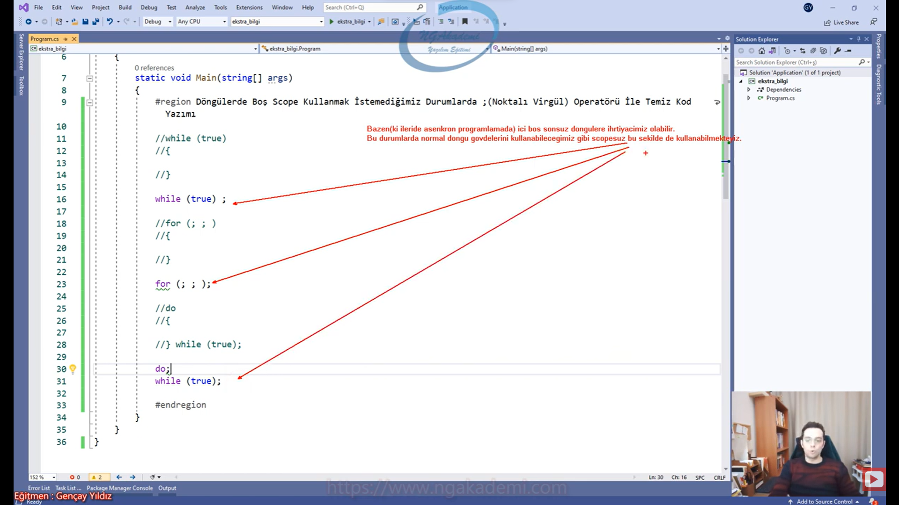

***
# 241) (Ekstra Bilgi) Döngülerde Noktalı Virgül Operatörü İle Salt İfade Tanımları
- Döngülerde boş scope kullanmak istemediğimiz durumlarda `;` operatörü ile temiz kod yazabiliyoruz ve bu durum sonsuz döngüye sebeb olmakta.

- Eğer ki bir sonsuz döngüye ihtiyacınız var ve içinde işlem yapmayacaksanız bunu uzun uzun içi boş scope ile tanımlamaktansa bu varyasyonla tanımlama işlemi yapabilirsiniz.

- Bazen (ki ileride asenkron programlamada) içi boş sonsuz döngülere ihtiyacımız olabilir. Bu durumlarda normal döngü gövdelerini kullanabileceğimiz gibi scope'suz bu şekilde de kullanabilmekteyiz.

- İleride asenkron programlama da asenkron süreçte içi boş döngülerde siz sonsuz işlemler yapmak isteyebilirsiniz yani yeter ki bir blok eden bloklayan bir işlem olsun onu nasıl asenkrona almak üzerine çalışmalar yaparsınız vs. işte bu tarz durumlarda ihtiyacınız olacaktır. Ya da farklı noktalarda olabilir. İçi boş sonsuz döngülere ihtiyacımız olabilir.

```C#
#Döngülerde Boş Scope Kullanmak İstemediğimiz Durumlarda ;(Noktalı Virgül Operatörü İle Temiz Kod Yazımı) 
while (true)
{
}
while (true) ;
for (; ; )
{
}
for (; ; );
do
{
} while (true);
do;
while (true);
```

