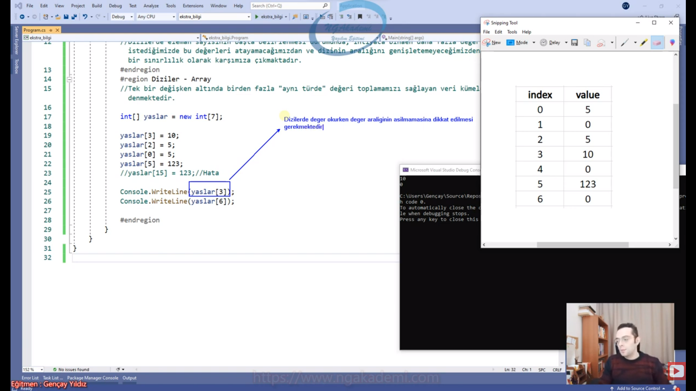
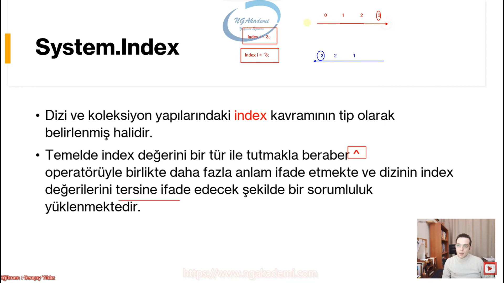

***
# 243) Dizi Nedir? Ne Amaca Hizmet Eder? Bir Programcı Açısından Neye Yarar?
- Diyelim ki bir sınıftayız ve sınıftaki bütün öğrencilerin yaşıyla ilgili işlem yapmak istiyorum. Normalde tek tek her bir öğrencinin yaşlarını tutmalıyım. n adet öğrencim olursa n adet değişken oluşturup bu öğrencilerin her birinin yaşını bu değişkenlerde tutup istediğim işlemi yapabilirim. Şimdi diyelim biz 40 45 kişilik sınıfta olsak yine bunları değişkenle mi tutacağız?

- Birden fazla veriyle çalışmam gerektiği durumlarda bunların herbirine bütün verileri değişkenlerde karşılarsam/tutarsam bu ne kadar efektif olabilir ki?

- Eğer ki programlamada aynı türde birden fazla değere ihtiyacınız varsa bunların her birini değişkenlerle de tutabilirsiniz ya da bunları tek bir değişken altında veri kümesi olarakta toplayabilirsiniz. Tek bir değişkenin altında veri kümesi oluşturmak programlama da dizidir.

- Tek bir değişken altında birden fazla 'aynı türde' değer toplamamızı sağlayan veri kümelerine dizi denmektedir.

- Bir tane değişken tanımlaması yapıyorsun ama bununla birden fazla değer toplayabiliyorsun. Bir sepet ama içerisinde birden fazla ürün koyabiliyorum tabiki de buradaki ürünlerim tek bir türden olan ürünler. İşte bu bir tane bir değişken ama içerisine koyduğum veriler birden fazla işte biz buna dizi diyoruz.

- Dizi bir sepet/veri kümesidir.

- Diziler içerisinde birden fazla aynı türde değer tutabilen yapılardır.

- Diziler içerisinde birden fazla farklı türde değerler tutabiliyorlar mı? Tutamıyorlar bir dizinin türü tek bir tür olabilir birden fazla türdeki veriyi karşılayamaz.

- Birden fazla türde veri tutacaksam üst bir türde tutman lazım `object` gibi ya da kalıtımsal bir üst tür olabilir.

- Prosedürel programlamanın temel veri kümeleridir. Yani yazılımsal boyutta, yazılım adına RAM'de birden fazla değeri tek bir değişken altında bir veri kümesi halinde tutabilirler....

- Diziler, veri kümeleri oldukları için, içlerindeki birden fazla veri üzerinde kümesel işlemler yapmamızı sağlayabilirler...

- Bütün bir toplu veri üzerinde istediğin herhangi bir istatiksel çalışma yapabilirsin. Tek tek verilere erişip herhangi bir çalışmayı yine yapabilirsin. Yani elinde birden fazla veri var ve bunların nerde olduğu belli.

- Diziler koleksiyon yapılarının da oluşturulmasını sağlayan yapılardır diziler.

- Diziler prosedürel programlamanın temel yapıları oldukları için daha gelişmiş yapılar olan koleksiyonlarında temelini teşkil etmektedirler ve gelişmelerine katkıda bulunmaktadırlar.

- Diziler Referans türlü değerlerdir. Yani nesnel yapıdırlar. Özlerinde `class`tırlar..

- Senin oluşturmuş olduğun dizi artık veriden daha büyük bir anlam ifade ediyor. Yani artık bir nesneye karşılık geliyor.  

- Yapısal olarak RAM'de Heap'te tutulurlar...

- Senin yaşını tutuyorsam Stack'te tutuyorum ama senin babanın kardeşinin annenin yaşlarını top yekün bir dizide tutuyorsam bu dizi nesnesi Heap'te tutuluyor tabi içindeki değerlerde uygun bir şekilde Stack'e yerleştirilmiş olacaktır.

- Dizinin kendisi sepet Heap'te tutulur.

- Dizi dediğimiz yapılanmada içerisine birden fazla değer koyabiliyoruz istediğin kadar değer koyabiliyorsun.

- Dizi içerisine her türlü değer koyulabilir. Değer türlü de olabilir Referans türlü de olabilir.

- Lakin her türlü değer koyulabilir ama diziye koyulan değerler topyekün aynı olmalıdır. Bir dizi sade ve sadece tek bir türde değer alabilir.
    * Örneğin senin dizin `int` türde bir dizi ise o zaman aldığı değerlerin hepsi `int` türde olmalıdır. Başka bir türde değer koymak mümkün değildir.

- Dizimizin her türü karşılamasını istersek eğer o zaman `Object` türünde bunları karşılarız öbür türlü gene mümkün değil `Object`te tek bir tür sağlayacağından dolayı gene buradaki prensip olması gereken kural geçerli olacaktır `Object` nihayetinde tek bir tür.

- Dizi içerisine koyulan değerler işlevsel olarak aynı mahiyette olmalıdır.
    * Örneğin yaş dizisine maaş bilgisi aynı türde olduğu halde verilmemelidir.

- Koyduğun bir dizin var içine değer koyuyorsun bu öğrencinin yaşı bir başka değer koyuyorsun müdürün almış olduğu maaş oldu mu yani şimdi? Tamam bir dizin var içinde sayısal değerler var eyvallah ama mahiyetleri farklı? tabiki de böyle olmamalı ya elinde sayısal olan öğrencilerin yaşları olan bir dizi olmalı ya da personellerin maaşlarını tutan bir başka dizi olmalı. Personel maaşlarının içerisinde ne öğrenciye ne de başka birşeye dair sayısal değer olmalı öğrencinin yaşı gibi ev numarası gibi vs. ne de öğrencinin yaşlarını tuttuğun dizinin içerisinde yaşın dışında başka bir değer olmalı tamam ikisi de `int` olabilir ama olmamalı.

- Bir veri kümesi niye vardır yazılımda?
    * Bir çalışma yapacaksın bir istatistik yapacaksın orada bir veri üreteceksin elindeki 3 tane değerden 4. bir türetilmiş değer oluşturacaksın dolayısıyla bu değerler birbirleriyle aynı olmalı sen günlük hayatta bile bir deftere birşey yazarken bir sayfada yazmış olduklarınla öbüründekiler fark yaratabiliyor. Aynı şekilde burada da dizilerde yaratacak.
    * Yazılım süreçlerinde bir destur olmalıdır yani senin yazılımında bir veritabanı bir tablo bir kullandığın sistem herşey tek birşeye odaklı olmalı. ileride biz buna Single Responsibility Principle var tek sorumluluk prensibi her şey tek bir sorumluluğu üstlenmeli tek bir taşın altına elini sokmalı. Yani bu mantık bu prensip hala işliyorsa dizide sadece tek bir mahiyette değer olması gerekiyor.

- Aynı mahiyette olmasına mümkün mertebe özen göstereceğiz eğer göstermiyorsanız kodunuz doğru olabilir ama yanlış bir tasarıma ya da mantığa sahipsiniz diyebiliriz.

- Dizinin içerisine yani sepetin içine biz değer gönderdiğimizde serseri bir düzenle/şekilde dizilmezler. Dizi dediğimiz konu yazılım dünyasına index dediğimiz kavramı kazandırdı.

- Diziler içerisine eleman/değer eklendikçe bunları serseri bir şekilde depolamaz düzenli bir şekilde sıralı depolayacaktır.

- Bunları RAM'e sıralı bir şekilde düzenli depolayacaktır. Şimdi bu depolama sürecinde RAM'ler alan tahsisinde bulunurken ilgili değerleri yerleştirirken bu değerleri daha hızlı erişebilmemiz için index kavramını oluşturur.

- Dizilerde eklenen elemanlar index ismini veridiğimiz numaralarla ardışık bir şekilde numaralandırılırlar...

- Diziler serseri bir düzende değil normal bildiğiniz olması gereken bir düzende dizideki veriler tutulmakta tutulurkende bu veriler numaralandırılmaktadır. Bu numaraya biz index numarası diyoruz.

- index no : Her bir elemena verilen ardışık sayı. 0'dan başlar n-1'e kadar gider. Yani 10 elemanlı bir dizin var sen bu elemanları koydun işte ilk koyduğun 0. index sonuncu koyduğun n-1 yani 9.index'e sahip olacaktır.

- 0'dan n-1'e kadar gitmesi bilgisi biz dizi içerisindeki elemanlara erişirken kombinasyonlarımızı bu mantığa göre oluşturuyoruz.

- index kavramı compiler tarafından kendiliğinden veriliyor yani durduk yere sen gidip vermiyorsun bir eleman ekledin diyelim 10 elemanlık bir diziye 11. elemanı eklediysen zaten o otomatik 10. index ona atanacaktır.

- Dizilerde değer versenizde vermesenizde eleman alanları tahsis edileceğinden dolayı indexler çoktan atanmış olacaktır.

- İndex kendisi otomatik sistem tarafından veriliyor sen vermiyorsun.

- Elemanlar yerleştirilirken alan tahsisinde bulunulurken sıralı bir alan tahsisinde bulunulmakta ve bu alanlar index numarasıyla numaralandırılmaktadırlar.

- Siz dizi için başta tanımlama yaparken bir alan tahsisinde bulunacaksınız bulunduğunuz alan tahsisinde zaten kendisi sıralı bir alan oluşturacaktır. Atıyorum 10 elemanlı bir dizi tanımladın o 10 elemanlı dizi anlık olarak sana oluşturulacak ve sana 0'dan 9'a kadar bürün elemanlara hazır alanlar tahsis edilmiş olacak.

- Dizi tanımlaması yaparken;
    * Hangi türde veri tutacaksan türü bildirmelisin. `type` => `int` olur, ahmet olur, mehmet olur, `char` olur.
    * `type a` Değişken tanımı
    * `type[] a` Dizi tanımı
    * `type[] name = new type[...]` 
        + `type` türünde indexer operatörü(`[]`) ile bir tane dizi istedik. Ardından bir isim verdim. Şimdi burada bir dizi değişkeni oluşturmuş oldum `type` türünde. Devamında ise `new`operatörü daha sonrasında ise yine aynı `type` ve indexer operatörünün bu sefer içine bu dizinin alacağı eleman sayısını bildiriyoruz.
        + `new`operatörü => Bir dizi nesnesi oluşturmamızı sağlar. OOP'de detaylarıyla inceleyeceğiz.
        + Eşitliğin iki tarafında bulunan `type` türü aynı olmalıdır. Yada kalıtımsal ilişkisi olmalıdır.

- Bir değişken tanımlanırken türünün yanına `[]` indexer operatörünü koyarsanız o değişken o türde bir dizi değişkeni olacaktır. Bu operatöre INDEXER operatörü ismi verilmektedir. 

- Indexer operatörü bir türün yanına verildiği zaman o türden bir değişken talebinde bulunur dizi değişkeni oluşturur. O türden bir dizi talebi oluşturmanın yöntemi türün yanına INDEXER operatörünü koymaktır.

- Dizinin eleman sayısını bildirmesi bir sınırlılıktır.

- Diziler sınırlı yapılardır. Sınırlılıklarını aşmak için koleksiyonlar ortaya çıkmıştır. Koleksiyon dediğimiz yapılar dizilerdeki sınırlılıkların aşılmış halidir.

- Bir dizi tanımlama aşamasında kaç elemanlı olacağını başta bildirmemiz bizim çalışmamız açısından birazcık kısır bir durumdur. Çünkü ben her daim kaç elemanla çalışacağımı bilemeyebilirim.

- Dizi tanımlaması Indexer operatörü(`[]`) ile gerçekleştirilir.

- Index, Indexer kavramı dizilerden gelir.... Aklımıza dizileri getirecektir....


***
# 244) Dizi Nasıl Tanımlanır? - 1
- Dizi dediğimiz yapılanma başlı başına sınırlılıklardan oluşan bir yapılanmadır.

- Dizi semantik açıdan seni belirli kurallara tabii tutuyor. Kurallı olması sınırlılık değildir ama yapmış olduğu o kuralın bir mantıksızlık durumu doğurabilme ihtimali bir sınırlılıktır işte. Örneğin diziyi tanımlarken o dizide kaç tane elemanın tutulacağını senin önceden bildirmen gerekiyor. Bildirmen gerekiyor ki orada çalışacağın eleman sayısına göre bir alan tahsisinde bulunsun. Her seferinde bizler çalışacağımız eleman sayısını bilemeyebiliriz. Yapacağım satışları tutacak bir dizi bugün şu anda tanımlama yaparken daha gün sona ermeden kaç tane satış yapacağımı bilme ihtimalim yok ya 1000 desem 1001 satış yaparsam ya da 1000 tane satış yaparım diyip 3 tane satış yaparsam geriye kalan 997 tanesi boşuna alan tahsis edilmiş olmayacak mı?

- Dizi diyor ki hem bana çalışacağın eleman sayısını baştan peşinen vermelisin hem de bunu bilmiyorsan benim yapacağım bişey yok.

- Yazılımda amaç bir veriyi doğru bir şekilde işleyebilmek ve sonucunu elde etmektir. Bazen bu bir veri bazen değil hatta normal hayatta bir veri değil milyon/milyar veri olacak ve bunları işlememiz gerekecek işte böyle durumlarda sen o bir veriyi bir değişkende tutarken milyarlık verileri daha gelişmiş yapılarda tutman gerekecek. Çünkü organizasyon bir yerden sonra zorlaşacak.Milyarlık verilerin olduğu bir yazılımda onlara muadil olan değişken tanımlaman ne kadar doğru olabilir? Yani hangi bilgisayar o kadar satırlık kod dosyasını açabilir? Sizin belirli bir sayıdan sonarki değerlerinizi daha gelişmiş bir değişken yapılanmasında tutmanız lazım. Bu değişken yapılanması dizi yapılanması olabilir, Koleksiyonlar olabilir, Nesneler olabilir. Object Oriented Programming'teki obje mantığı kompleks değerlere karşılık gelen kompleksleşmiş verileri daha profesyonelce tutup işleyebilmemizi sağlayan bir yaklaşımdan ibaret. Dolayısıyla seni verin ne kadar kompleksleşiyorsa yaklaşımlarında ona göre kompleksleşmeye başlıyor.

- Hem değişkenler birden fazla hemde bunların türleri aynıysa bunları tek bir dizi dediğimiz değişkenin altında toplayıp üzerinde tek tek değişken üzerinden işlem yapabiliyorum. Topyekün bunların üzerinde işlem gerçekleştirebiliyorum.

- Dolayısıyla bir kümesel işlem yapmamı sağlayan bu yapılanma ve bunun gibi kompleks yapılanmaları destekleyen diğer yapılanmalar bizim için programlama dünyasında çok ama çok önemli. Zaten bir yazılımcı diziyi bilmiyorsa/önemsemiyorsa çöp. İleride koleksiyonları daha çok kullanacağız. Diziyi adı soyadı gibi bilmeyen bir adam koleksiyonu kullansa da kullanmasa da yazılımcı değildir.

- Doğru bir tanedir doğru 2 tane olamaz. Yanlış n tane olabilir çok fazla yanlış koyabilirsiniz ortaya ama doğru bir tanedir. 

- `type[] isim = new type[......];`
    * Öncelikle bir dizinin içine alacağı elemanların türünü bildirmeniz lazım. `type` herhangi bir tür olabilir.
    * Daha sonrasında türün yanına `[]` indexer operatörü koyarız. 
    * Sonrasında eşitliğin bu tarafında ise `new type[eleman sayısı]` bildirip dizi tanımlamamızı ve değer atamamızı bitirmiş oluyoruz.
- Diyelim ki sınıftaki bütün öğrencilerin yaşlarını tutacak bir dizi tanımlayacaksam eğer 
    * `int[] yaslar = new int[5];` anlamlı bir isim veriyorum dikkat artık çoğul eki koyuyorum eğer dizi tanımlıyorsan elindeki veri birden fazla ondan dolayı çoğul eki koyuyorum anlamlı isim için.
    * `bool[] x = new bool[7];`
    * `byte[] sayilar = new byte[n];`


- Dizinin değer kısmıyla değişken kısmı aynı türde olmalıdır.

- Eleman sayısı kesinlikle belirtilmelidir boş geçemezsiniz. Eleman sayısı negatif olamaz mantıksız olur ama 0 olabilir.

- Eleman sayısını mecburi girmek zorundayız. Eleman sayısını mecburi girmek bir sınırlılıktır.

- Dizi tanımlama sürecinde eleman sayısı mecburi girilmek zorundadır. Yani dizide çalışacak değer adedi başta bildirilmelidir... Bu durum bir sınırlılıktır. Bu sınırlılığı bizim doğru bir şekilde yönetebilmemiz lazım.

- Başta bilemeyeceğimiz öngöremeyeceğimiz bir duruma karar vermek bir sınırlılıktır.


- Değer türlü bir değişken hem değişkenin kendisi/ismi/referansı Stackte hem de değeri stacktedir.

- Referans türlü bir değişken ise değişkenin ismi stack'te değeri Heap'tedir ve değer öyle 7 gibi, 3 gibi, 5 gibi, ahmet gibi bir değer değildir bir nesnedir/objecdir.

- Referans türlü değişkenlerin özelliği Stack'te değişkeni tutulurken bu değişkenin Heap'teki değeri/nesneyi referans etmesidir.

- Referanslar yine Stack'te tutuluyorda Heap'e direkt değerleri tutulacak.

- Stack kısmında referans türlü değişkelerin de referansları tutulur normal değer türlü değişkenler de tutulur Değer türlü değişkenlerin değerleri de tutulur. Referans türlü değişkenlerin değerleri Heap'te tutulur.

- Referanslar yine Stack'te tutuluyorda heap'te değerleri tutulacak.

- `int[] yaslar = new int[7];` 
    * Nesnemiz Heap'te tutulur. 
    * Heap'te tutulan bu dizi değeri kendi içinde 7 tane bir `int` alana sahip olduğunu düşünebilirsiniz.
    * Bu alanlar `int` tutuluyorsa bu alanlar Stack'te tutulmuyor mu? Aslında bu değerler Stack'te tutuluyor ama Heap'teki referanslandırılıyor yani işaret ediliyor.
    * Dizilerdeki tür yine bir değer türlü olduğu için bu değer türlüler gene Stack'te tutulacak ama sen bunlara topyekün erişirken Heap'teki nesne üzerinden erişebileceksin.

- Bir dizi tanımlaması yapıldığı an bellekte o diziyi kullansakta kullanmasakta verilen eleman sayısı kadar alan tahsisinde bulunulur...

- Dizilerde tanımlama yapıldığı an alan tahsisinde bulunulması bizim için pekte doğru bir durum değildir.

- Sen diyorsun ki ya kardeşim bana 10 alanlık bir `int` tanımla hop tanımlıyor gidiyor 10 alanlık arsa oradan sana tahsis ediyor. İyi de sen daha bunu ne kullandın ne bir değer verdin. ne herhangi bir şey yaptın ama bellekten 10 alanlık yer alındı. Tanımlar tanımlamaz geldi 10 tane alanlık yeri kapladı bu durum tabiki sınırlılıktır. 

- Kullanılmadığı halde diziler direkt olarak bellekten belirtilen eleman sayısı kadar alan tahsisinde bulunması bir sınırlılıktır.

- Kullanmadığın bir yerin direkt alan tahsisi olur mu ya? En azından şunu dese bana 7 alanlık bir alan ayırma ben kullandıkça 7 tane alan ayır dese eyvallah zaten koleksiyonda biz onu yapacağız. Sen kullanmadığın halde dizi sana alan tahsisinde bulunuyor bu bir maliyet.

- Diziler alan tahsisi yapıldığında ilgili alanlara türüne uygun default değerleri atarlar.
    * `int` -> 0
    * `string` -> `null`
    * `char` -> /0
    * `bool` -> `false`

- İllaki bir varsayılan değer verecektir.

- Bir diziyi siz tanımlar tanımlamaz alan tahsisinde bulunuyor ve direkt varsayılan değerleri ilgili alana atıyor. Yani sen kullanmasanda varsayılan değerleri atadığı için aslında bilgisayar boyutunda kullanmış oluyor.


- Diziler tanımlandığında kullansakta kullanmasakta bellekte belirtilen eleman sayısı kadar alan tahsisinde bulunurlar. Bu durumda bellek boyutunda ekstradan maliyete sebep olacağı için bir sınırlılıktır.Bizim için ideal olan kardeşim bir sepet koy koyduğu kadar verdiğim eleman kadar değer kadar alan tahsisinde bulun. Hani bir artış miktarın olsun alanda senin bir dizi olduğun verisel bir küme olduğun belli olsun sana değer verdikçe git bellekten alan tahsis et. Bak bu idealdir.

- Uygulama sona erdikten sonra ilgili tahsisler Garbage Collector dediğimiz mekanizma sayesinde geri alınacaktır bunlar imha edilecekte çalışma zamanı için bu tahsis süreci çok maliyetli.

```C#
#Sınırlılıklar
//Dizilerde tanımlama yaparken eleman sayısının bildirilmesi zorunluluğu bir sınırlılıktır.
//Diziler tanımlandığında kullansakta kullanmasakta bellekte belirtilen eleman sayısı kadar alan tahsisinde bulunurlar. Bu durumda bellek boyutunda ekstradan maliyete sebep olacağı için bir sınırlılıktır.

#Diziler - Array
//Tek bir değişken altında birden fazla "aynı türde" değeri toplamamızı sağlayan veri kümelerine dizi denmektedir.
int[] yaslar = new int[5];
string[] adsadsa = new string[999999];
```

***
# 245) Dizi Nasıl Tanımlanır? - 2
- Tanımlanan diziler bellekte alan tahsisinde bulunduktan sonra sistem tarafından otomatik indexlenirler/index numarası atanır.

- Index numarası atamak bunları 0'dan n-1'e kadar ardışık sıralarla işaretlemekti. 

- Normalde direkt varsayılan değerleri atama yapar. Birde bunun yanında index numarası/index no'yu atar. 0'dan n-1'e kadar.

- Bir dizi değeri tanımladığınızda tanımlanır tanımlanmaz bellekte bir alan tahsisi gerçekleştiriliyor ardından bu alana default değerler atanıyor ve 2. durum bu her bir alan index numarasıyla işaretleniyor.


***
# 246) Tanımlanmış Diziye Değer Atama
- `int[] yaslar = new int[7];` Görüldüğü üzere 7 tane alan tahsis edilmiştir her bir alan ilk oluşturma esnasında varsayılan değerler atanmış ve bunlar index numarasıyla işaretlenmiştir.

- Dizilere değer atarken index numaralarından yararlanıyoruz.

- Index numarası dizilere sistem tarafından otomatik verilen ve kimlik mahiyetinde kullanabileceğimiz bir numaradır.

- Her bir elemana karşılık gelen unique değerlerdir. Haliyle böyle olması demek her bir elemana istediğimiz zaman erişip değer atama yapabilmemizi yahut var olan değeri okuyabilmemizi sağlamaktadır.

- Biz burada dizilerde çalışıyorsak diziye bir değer atayacaksak index numarasından ilgili elemanı bildireceğiz ona göre değerimizi atayacağız. Nihayetinde senin dizinin elemanlarını tarif edebilmen için bunları ayıran özel kimliksel değerlere ihtiyacın var işte index burada bu görevi görüyor. 

- Dolayısıyla dizilerde tanımlanmış alanlara/elemanlara değer atama yahut değer okuma operasyonlarını index numaraları eşliğinde gerçekleştirmekteyiz.


- Dizide tanımalama neticesinde her bir elemanı türüne uygun bir tane değişken gibi düşünün. `int` türünde 7 elemanlı dizi oluşturduysan dizide 7 tane farklı değişken tanımlamıyormuş gibi düşünün ve bu değişkenlerin her biri indexlerle ayrılıyor.

- Değişken tanımladığımızda değişkenin ismini çağrırıyorduk ve ilgili ismi çağırdığımızda assign ona bişey atarken değişkenin kendisi geliyordu. Dizi üzerinden ben herhangi bir alana bir değer vermek istiyorsam bunu verirken biz index numarasını kullanıyoruz. `yaslar[3] = ...` yazarsan yani sen bunu assign operatörünün(`=`) soluna yazıp sağında herhangi bir değeri kullanırsan buradaki değer dizinin 3.indexteki değişkenine atanmış olacaktır.

- Dizilerde tanımlanan dizinin içerisine bir eleman bir değer koyabilmek istiyorsanız dizinin isminin üzerinden indexer operatörü(`[]`) ile hangi indexe eleman koyacaksanız onu bildirmeniz gerekiyor.


- Diziye eleman atarken/değer koyarken hangi index'e karşılık değer koyacaksak yine indexer operatörü(`[]`) ile bunu bildirmeli ve ilgili değeri atamalıyız... Normal değişkene değer atar gibi.


- Her ne kadar dizi de olsa içindeki elemanlar değişken gibi davranış sergiliyor. Dizinin içerisinde elemanlara değer atarken değişken davranışı gösterir. Dolayısıyla herhangi bir elemana atanan ennn sonuncu değer geçerlidir.

- Yani sen buradaki değerleri değiştirebiliyorsun burası değişken davranışı gösterir.


- Dizinin sınırı bellidir. Dizilerde eleman sınırını aşamazsınız. Eğer ki atama yaptığınız index dizide yoksa çalışma zamanı hatası alırsınız. Semantikte herhangi bir problem yok çalışma zamanında patlar. Dizide sen aralık dışında yani olmayan değer aralığını aşıyorsan orada işlem yapmaya çalışıyorsan uygulama `IndexOutOfRangeException` hatasını fırlatacaktır.

- Dizilerde değer atama ve hatta değer okuma işlemlerinde eğer ki dizinin sınırını aşarsak hata verecektir... 

- Dizinin sınırı neyse orada çalışmanız gerekiyor.

- Dizideki çalıştığımız index numarası dizinin olan indexlerinden birisi olması lazım.


- Dizilerde değer atarken illa index numarasının sıralamasına riayet etmek zorunda değiliz. Sıralı bir şekilde doldurmak zorunda değiliz. Alan önceden tahsis edildiği için önceden tahsis edilen bir alana sen zaten burada gelipte sıralı birşey atamana gerek yok zaten onlar vardı var olan default değerleriyle tanımlanmıştı onları istediğin gibi sırada serseri düzende değiştirebiliyorsun.

- Dizilerde değer ataması yaparken sıralamayı göz önünde tutmak zorunda değiliz...


- Dizilerde elaman sayısının aşılamaması durumu bir sınırlılıktır. Diyelim ki burada benim 7 elemanlık bir dizim var ama benim çalışacağım veri sayısı 8 oldu diyelim 9 oldu diyelim 10 oldu Şimdi ben elimdeki fazlalık değerleri elimdeki diziye veremiyorum. Dizinin boyutu bir kere tanımlandığı için büyütemiyoruz. O ilk başta nasıl tanımlandıysa ebediyen o şekilde kalır. Başk birşey yapamazsın dizinin boyutunu büyütemezsin. Böyle bir durumda senin ihtiyacın olduğu sürece dizinin aralığını dizinin eleman sayısını arttıramıyacağından dolayı bu bir sınırlılık olarak karşımıza çıkmaktadır.

- Dizilerde eleman sayısının başta belirlenmesi durumunda, ihtiyaca binaen daha fazla değer atamak istediğimizde bu değerleri atayamayacağımızdan ve dizinin aralığını genişletemeyeceğimizden dolayı bu durum bir sınırlılık olarak karşımıza çıkmaktadır.

- Yani benim elimde ne kadar veri olacağını ben bilmiyorum kardeşim madem sen bir veri kümesisin elime veri geldikçe sen ona göre kendi elemanını belirlesen de beni de yormasan desek daha iyi olur. Ama burada diyemiyoruz. Elinde kaç tane eleman olduğu önemli değil dizinin kaç tane eleman aldığı önemlidir. İleride koleksiyona geçtiğimizde ne kadar eleman geliyorsa koleksiyonun boyutu kendine göre o kadar ayarlanacaktır. Koleksiyonlar daha efektif bir kullanım sağlayacaklar. Ama dizilerde bu yok. Dizilerde başta ne verdiysen onu aşamıyorsun. Dolayısıyla dizilerdeki bu durum bir sınırlılıktır.

- Atayacağımız değer dizinin türüne uygun olmalı. Çünkü dizi kendi içerisinde vermiş olduğu türde değişkenler/alanlar oluşturuyor işte oluşturduğu alanlarda türü neyse ona uygun bir şekilde değer atamanız lazım.

```C#
#Sınırlılıklar
//Dizilerde eleman sayısının başta belirlenmesi durumunda, ihtiyaca binaen daha fazla değer atamak istediğimizde bu değerleri atayamayacağımızdan ve dizinin aralığını genişletemeyeceğimizden dolayı bu 
durum bir sınırlılık olarak karşımıza çıkmaktadır.

#Diziler - Array
int[] yaslar = new int[7];
yaslar[3] = 10;
yaslar[2] = 5;
yaslar[0] = 5;
// yaslar[15] = 123;//Hata
```

***
# 247) Tanımlanmış Diziden Değer Okuma
- Yine indexer operatörü(`[]`) üzerinden indexi belirterek ilgili değişkenin/elemanın değerini okuyabiliyoruz.

- Normal bir değişken assign'ın solunda çağırılıyorsa kendisi geliyordu. Assign'ın sağında ya da bir fonksiyonun parametresinde çağırılırsa değişkenin değeri gönderilir. Burada aynı mantık eğer ki bir dizinin herhangi bir elemanı assign'ın solunda çağırılıyorsa değişkenin/elemanın kendisi gidecektir ve ilgili değeri alacak ilgili yere götürecektir yok eğer assign'ın sağında ya da herhangi bir fonksiyonun parametresinde çağırılıyorsa direkt değerini gönderecektir.

- Bir dizinin değerini okumak istiyorsanız indexer operatörü(`[]`) ile ilgili elemanın index numarasını veriyorsunuz size değerini döndürüyor.

- Birden fazla aynı mahiyetteki ve aynı türdeki değerlerimi tek bir değişken ismi üzerinden organize bir şekilde yönetebiliyorum. Şimdi bu organizasyon bana çok şey getirecek. Ben karışık kompleks değişken tanımlamalarından kurtuldum isimlendirme derdinden kurtuldum.

- Dizilerde değer okurken dikkat edilmesi gereken tek mesele şudur; değer aralığını aşmamak. Bu her durumda bizim için önemli Dizilerde değer okurken değer aralığının aşılmamasına dikkat edilmesi gerekmektedir.

- Değer aralığını aşarsanız size hata verir. İlgili aralığı aştığınıza dair bir hata alırsınız.

```C#
#Diziler - Array
        
int[] yaslar = new int[7];
yaslar[3] = 10; 
yaslar[2] = 5; 
yaslar[0] = 5; 
yaslar[5] = 123; 
System.Console.WriteLine(yaslar[3]);
System.Console.WriteLine(yaslar[6]);
System.Console.WriteLine(yaslar[7]);
```



***
# 248) Dizi İçerisinde Döngüyle Dönme
- Bir dizinin içerisinde illa dönmemize gerek yoktur.

- Normalde sen bir diziyi kullanırken bildiğin kurallar doğrultusunda kullanbilirsin.

- Yazılımcı olarak şiar'ın şudur senin üslubun bu olacak bildiklerinle yeni gelenler arasında bir bağıntı kurmadan gece yatmayacaksın. Bu hayatın her daim her köşesinde her noktasında olan birşey. Yeni gelen bir yapılanma öncekilerden bağımsız olamaz bir kombinasyon bir bağıntı bir ilişki kurulması lazım. Dizideki elemanları ekrana yazdırmak için ameleus yöntemiyle damarlarındaki asil kanda mevcuttur diyerek yazarsın bu yöntemle. Bir yazılımcı açısından doğru bir yöntem mi? Bir bakarsın koda değil yani dizi var şimdi diziyi ben bu şekilde kullanıyorsam birşey eksik ya ben yapıyı anlamamışım ya da bu yapı lüzumsuz dersin daha efektifliği olması lazım. Yazacağın kodu öncekilerle ilişkilendirmen lazım. Şimdi diceksin ki ya kardeşim ben döngüyü biliyorum elime gelen diziyi nasıl öncekilerle daha güzel işleyebilirim? Bir düşün.. Döngü olur değil mi?

- Bundan sonraki öğreneceklerinizde sen o düşünceye zaten varabilmek için çalışacaksın. Çalışmak demek emek harcamak demek artık işin tefekkürünü yapmak yani eldeki verileri doğru bir şekilde derinlemesine değerlendirip düşünmek.

- Diziler genellikle döngülerle kullanılırlar. Dizi elinde birden fazla veriye hakim olan bir değişken var. Bunun içerisinde verilerde sen çalışırken tek tek çalışılır mı bunda?

- Döngü yapılanmasıyla diziler genellikle bir bütün olarak işlenmekte ve çalıştırılmaktadır.

- Diziler genellikle döngülerle birlikte algoritmalarda kullanılmaktadırlar/işlenmektedirler....

- Diziler genellikle döngüler üzerinden döngülerle beraber operasyona katılırlar. Ama bu demek değildir ki %100 öyle hayır öyle değil yeri geldiğinde manuel indexer'lada çalışabilirsin. Ama döngü buradaki yapıyı daha efektif bir şekilde sağlayacaktır. Yani döngü bir yandan dönerken düşünsene 0'dan n-1'e kadar döndürebiliyorsun. Bütün sayılara karşılık gelebiliyor Haliyle bütün değerleri elde edebilirsin. Bu mantıkla düşündüğünde diziler genellikle döngülerle birlikte algoritmalarla görülecektir.

- Döngülerde genellikle dizilerle ya da ileride göreceğimiz koleksiyonlarla birlikte de kullanılmaktadırlar. Ama buradaki genelleme istisnai durumları göz ardı edin anlamına gelmiyor kesin dizi deyince aklına döngü döngü diyince aklına dizi gelmeyecek. Bu ikisi birbirine kombinasyonel olarak çok uyumlu çünkü sen birden fazla veri kümesindeki elemanlara tek tek erişmektense senin yerine bunu yapabilecek döngülerin varken bunları kullanman inanılmaz güzel efektif çözümler getirmeni sağlıyor.


- Bir döngüde diziyle dönmeden kastımız herhangi bir döngü `for` ,`while`, `do while` bunların hepsi bir kombinasyona göre çalışıyor sen kombinasyonla istediğin şekilde bir dizinin içerisindeki elemanlara çok rahat ulaşıp istediğin işlemi yapabilirsin. Elemanları çok rahat elde edebilirsin ve istediğin işleme tabi tutabilirsin. 

- Bir dizide elemanların her birini döngüyle dönüp işlem yaptıracaksak eğer gerekli kombinasyonu ayarladıktan sonra döngü içinde dizinin elemanları üstünde istediğim her şeyi yapabilirim. Yani her seferinde buradaki dizinin indexlerine indexer operatörü(`[]`) ile teker teker erişip yani elemanlarını elde edip gerekli işlemleri gerçekleştirebilirim. 

- Dizi içerisinde döngüyle dönmekten kasıt onu bir bağıntı kombinasyon olarak birlikte kullanmaktır.

- Algoritma ondan sonra artık senin konuştuğun belagatına bağlı senin yapacağın edebiyatına bağlı.

- Diziyi genellikle döngülerle beraber kullanır döngülerin kombinasyonuna göre işlemler yaparız.

```C#
#Tanımlanmış Dizi İçerisinde Döngüyle Dönme
string[] personeller = new string[10];
personeller[0] = "Hilmi";
personeller[1] = "Hüseyin";
personeller[2] = "Rıfkı";
personeller[3] = "Şuayip";
personeller[4] = "Muiddin";
personeller[5] = "Naci";
personeller[6] = "Hüsnü";
personeller[7] = "Nurullah";
personeller[8] = "Cabbar";
personeller[9] = "Akif";

#Ameleus 
System.Console.WriteLine(personeller[0]);
System.Console.WriteLine(personeller[1]);
System.Console.WriteLine(personeller[2]);
System.Console.WriteLine(personeller[3]);
System.Console.WriteLine(personeller[4]);
System.Console.WriteLine(personeller[5]);
System.Console.WriteLine(personeller[6]);
System.Console.WriteLine(personeller[7]);
System.Console.WriteLine(personeller[8]);
System.Console.WriteLine(personeller[9]);

for (int i = 0; i < 10; i++)
{
    System.Console.WriteLine(personeller[i]);
}
int i = 0;
do
{
    System.Console.WriteLine(personeller[i++]);
} while (i < 10);
```
***
# 249.1) Dizi İçerisinde Döngüyle Dönme Kritik
- Bir dizinin içerisinde döngüyle dönerken döngünün kombinasyonundaki eleman sayısını statik belirlememeniz gerekiyor. Çünkü bir gün bu kod değişebilir bu dizideki eleman sayıları hem artabilir hem de azalabilir. İşte böyle bir durumda gidip yazılan döngüyü de değiştirmen gerekecektir. İşte burada artık dizi değiştikçe kodun devamındaki o diziyle alakalı yapılan tüm kombinasyonlardaki değerleri katsayıları değiştirmek zorunda kalırız. İşte böyle bir durumda buradaki yapılanma/algoritma döngüdeki şartı dizinin eleman sayısına bağlayacak ama bunu pratikte yapacak yani bunu kodla yapman gerekiyor.

- Dizi içerisinde dönecek olan döngü kombinasyonunda dizinin eleman sayısını manuel bir şekilde kullanmamalı, bu sayısal değeri dizinin kendisinden almalıyız. Dizi ya kardeşim benim eleman sayım bu demeli. Aksi taktirde dizinin eleman sayısının artması durumunda veri kaybı söz konusu azalması durumunda unutursak eğer patlama/hata alma söz konusu olabilir.

- İşte bu tarz durumlarda dizinin eleman sayısı değiştikçe diziye uygun bir şekilde operasyon gerçekleştiren döngüye de diziden gelecek eleman sayısını kullanmamız lazım. Biz manuel yazmamalıyız.


- Bu işi yapabilmemiz için dizilerin içerisinde `Length` dediğimiz bir özellik var.

- `Length` : Dizinin kaç elemanlı olduğunu `int` olarak geriye döndürür...


- Bu durumda döngünün şart kısmına statik değer yazmaktansa dizinin `Length` özelliğini kullanarak artık dizinin eleman sayısı istediği kadar değişebilir eleman sayısı kaçsa o kadar şart kısmına direkt yansıyacaktır.Aslında buradaki manuel bağlılığı programatik bağlılığa çevirdik. Artık döngünün şart kısmındaki değerim direkt dizinin eleman sayısından geleceği için eleman sayısında hangi değişiklik olursa olsun ben kodun devamında bir düzenleme/değişiklik yapmak zorunda değilim.

- Döngülerde dönerken kombinasyon genellikle dizinin eleman sayısı üzerinden yapıldığı için eleman sayısını `Length` özelliği üzerinden alıyoruz.

```C#
#Tanımlanmış Dizi İçerisinde Döngüyle Dönme - Kritik 1
string[] personeller = new string[13];
personeller[0] = "Hilmi";
personeller[1] = "Hüseyin";
personeller[2] = "Rıfkı";
personeller[3] = "Şuayip";
personeller[4] = "Muiddin";
personeller[5] = "Naci";
personeller[6] = "Hüsnü";
// personeller[7] = "Nurullah";
// personeller[8] = "Cabbar";
// personeller[9] = "Akif";
// personeller[10] = "Ayşe";
// personeller[11] = "Fatma";
// personeller[12] = "Nuriye";
for (int i = 0; i < personeller.Length; i++)
{
    System.Console.WriteLine(personeller[i]);
}
```

***
# 249.2) Dizi İçerisinde Döngüyle Dönme Kritik
- Tabikide değerleri silerken dizinin eleman sayısını da düzeltmeyi unutmuyoruz:)

```C#
#Tanımlanmış Dizi İçerisinde Döngüyle Dönme - Kritik 1
string[] personeller = new string[7];
personeller[0] = "Hilmi";
personeller[1] = "Hüseyin";
personeller[2] = "Rıfkı";
personeller[3] = "Şuayip";
personeller[4] = "Muiddin";
personeller[5] = "Naci";
personeller[6] = "Hüsnü";

for (int i = 0; i < personeller.Length; i++)
{
    System.Console.WriteLine(personeller[i]);
}
```

***
# 250) Dizilerin Sınırlılıkları ve Koleksiyon Yapılarının Doğuşu
- Kullanmadığın bir alanı tahsis etmek bir sınırlılıktır.

- Tanımlanmış bir diziye değer verirken indexer operatörü üzerinden değer vermek zorundayız. Nihayetinde hangi index'te çalıştığını bilmen gerekiyor. Hangi alana atayacağını ve hangi elemanı atayacağını da bilmek bir sınırlılıktır.

- Dizilerde elemanlara değer atarken indexer operatörüyle çok haşır neşir olunmaktadır. Bu durumda bir sınırlılıktır. İleride koleksiyon yapısını göreceğiz. Koleksiyonlarda indexer ile atama olmayacak direkt fonksiyonel bir atama söz konusu olacak daha programatik bir atama söz konusu olacak. Buradaki sınırlılıkta ortadan kaldırılmış olacak.

- Diziler çok hızlı veri yapılarıdır. Yani bilgisayarda programlama dili seviyesinde olduklarından dolayı koleksiyonlara nazaran gayet hızlıdırlar.

- Koleksiyonlar bizim oluşturduğumuz türetilmiş nesnel yapılanmalar. Tabikide diziye nazaran daha yavaş çalışan yapılanmalardır. Amma velakin biz dizilerde dizinin programlama seviyesinde olan bir yapılanma olduğunu bildiğimizden dolayı daha hızlı çalışabiliyoruz. daha efektif maliyeti düşük performanslı bir çalışma sergileyebiliyoruz. Gelin görün ki sınırlılıkları var.

- Bu sınırlılıklar belirli algoritmalarla belirli tekniklerle yol ve yordamlarla rahatça aşılabiliyor. Ya da OOP bilen birisi bir diziyi yönetebilecek bir sınıf oluşturup o sınıf üzerinden dizideki bu sınırlılıklarıda ortadan kaldırabilir. İşte sen bunu yapmıyorsun mimaride gelen koleksiyonlar birileri tarafından yapılmış yapılanmalar oluyor.

- Dizi ne kadar iyi hoş güzel bir şey olsa da bizler için sınırlılıkları olan bir yapılanmadır. Haliyle biz yazılımcılar bu sınırlılıklardan arınabilemek için koleksiyon dediğimiz adı üzerinde birden fazla veriyi kapsayabilen yapılar üretilmiştir. Üretilen bu koleksiyonlar davranışa göre de şekilleneceklerdir. Key Value tarzında çalışan koleksiyonlar `dictionary` dediğimiz ya da belirli generic yapılanmalara sahip koleksiyonlar türetilmiştir. Ya da FIFO(First In First Out), LIFO(Last In First Out) tarzında çalışan işte davranışsal olarak ilk giren son çıkar ilk giren ilk çıkar tarzında çalışan koleksiyonlar geliştirilmiştir. Ama hepsinin temelinde bu sınırlılıklardan arındırılmış gene birden fazla veriyi tutabilen yapılar vardır.

- Koleksiyon dediğimiz yapılar dizilerdeki bu sınırlılıklardan arındırılarak yani bunlardan dolayı doğmuş çıkarılmış üretilmiş yapılardır.

```C#
#Sınırlılıklar
//Dizilerde tanımlama yaparken eleman sayısının bildirilmesi zorunluluğu bir sınırlılıktır.
//Diziler tanımlandığında kullansakta kullanmasakta bellekte belirtilen eleman sayısı kadar alan tahsisinde bulunurlar. Bu durumda bellek boyutunda ekstradan maliyete sebep olacağı için bir  sınırlılıktır.
//Dizilerde eleman sayısının başta belirlenmesi durumunda, ihtiyaca binaen daha fazla değer atamak istediğimizde bu değerleri atayamayacağımızdan ve dizinin aralığını genişletemeyeceğimizden  dolayı bu durum bir sınırlılık olarak karşımıza çıkmaktadır.
//Dizilerde elemanlara değer atarken indexer operatörüyle çok haşır neşir olunmaktadır. Bu durumda bir sınırlılıktır.
```

***
# 251) Dizi Tanımlama Varyasyonları - Varyasyon 1
- Dizi tanımlama yapılırken farklı varyasyonlarla da tanımlanabilmektedir.

- Dizinin ilk önce değişkenini tanımlıyorduk daha sonra diziye `new` operatörüyle dizinin gerçek değerini tanımlıyorduk.
    1. İlk önce dizinin ismini çoğul veriyoruz çünkü birden fazla veri tutacağız.
    2. Daha sonra türü indexer operatörü(`[]`) ile işaretlersen compiler'a şunun bilgisini vermiş oluyordun. Kardeşim sen bana bu türde dizi değişkeni oluştur demiş oluyorsun.
    3. Ardından assign operatörünü(`=`) kullanarak `new` keywordüyle birlikte türün eleman sayısını bildiriyoruz. `int[] yaslar = new int[3];`

- Bu tanımlama esasında dizinin en temel/ilkel tanımlamasıdır.

- Değer atarken Indexer operatörü(`[]`) üzerinden ilgili indexi/alanımızı çağırıyorduk elemanımızı/değerimizi atıyoruz. Okurkende Indexer operatörü(`[]`) üzerinden ilgili indexle ilgili alandaki değeri talep ediyorduk.

```C#
#Dizi Tanımlama Varyasyonları
#1. Varyasyon
int[] yaslar = new int[3];
yaslar[2] = 123;
System.Console.WriteLine(yaslar[2]);
```

***
# 252) Dizi Tanımlama Varyasyonları - Varyasyon 2
- Her daim sol taraf aynı yani biz bir referans tanımlayacağız öncelikle bir değişkeni tanımlayacağız ardından değerini tanımlamamız gerekiyor. Yani değişkeni tanımlayıp assign operatöründen(`=`) sonra `{}` eşliğinde direkt değerlerimizi verebiliriz. 
    * `int[] yaslar = {30, 25, 41, 52};` Sen bunu çalıştırdığın zaman compiler arka planda şu şekilde bir oluşum sağlıyor `int[] yaslar = new int[4];` Ardından ilgili değerleri de algılayıp arka planda kendisi yerleştiriyor. Burada yapmış olduğu işlem tek satırlık bir dizi tanımlama ve eleman sayılarını atadığın değerlerden alan bir varyasyon

- Kaç tane değer verirsek ilgili dizinin eleman sayısı/`Length`i ona göre ayarlanacaktır.

- Ne kadar değer veriyorsan bu varyasyonda compiler otomatik ilgili diziyi kendisi oluşturacaktır. ve 0'dan başlayıp n-1'e kadar ilgili değerleri uygun karşılıklarına gelen indexlerine yerleştirecektir. Burada Random rastgele bir yerleştirme söz konusu olmayacak soldan sağa doğru 0'dan n-1'e doğru sıralama söz konusu olacaktır. Sık kullanılan bir varyasyondur.

```C#
#Dizi Tanımlama Varyasyonları
#2. Varyasyon
int[] yaslar = { 30, 25, 41, 52 };
string[] isimler = { "Rıfkı", "Şuayip", "Hüseyin", "Hilmi", "Mehmet" };
```

***
# 253) Dizi Tanımlama Varyasyonları - Varyasyon 3
- 2 Varyasyona çok benzer.

- `string[] isimler = new string[] { "Rıfkı", "Şuayip", "Hüseyin", "Hilmi", "Mehmet" };`
    * Normalde eleman sayısını vermen gerekirken eleman sayısını vermeden süslü parantezleri yanında açtığın zaman vermiş olduğun değer kadarını kendisi yine otomatik alacaktır. İşte bu da bir varyasyondur.

- İstediğiniz varyasyonu kullanın hepsi arka planda hem yapısal hem davranış hem fıtrat olarak aynı şey hepsi bir dizi.

```C#
#Dizi tanımlama Varyasyonları
#3. Varyasyon
string[] isimler = new string[] { "Rıfkı", "Şuayip", "Hüseyin", "Hilmi", "Mehmet" };
```

***
# 254) Dizi Tanımlama Varyasyonları - Varyasyon 4
- Önceki varyasyonlara benzemektedir arada küçük bir fark vardır.

- `string[] isimler = new string[3]{"sfsafsafasf","asfasfsafsaf","fasfsafsaf"};` sabit bir eleman sayısı belirleyebiliyorsunuz.
    * Eğer ki süslü parantezle devam edeceksen ve indexer operatörü(`[]`) içerisine sayı yazdıysan buradaki sayı kadar değeri burada ataman lazım. Çünkü sayı değerin artık sabit eleman sayın ne 'ten küçük olabilir ne de büyük olabilir.
    * Fazla ya da eksik girersen hata alacaksın.

```C#
#Dizi Tanımlama Varyasyonları
#4. Varyasyon
string[] isimler = new string[3]{"safasfsafsaf","asfasdsafas","asfasfsaf"};
```

***
# 255) Dizi Tanımlama Varyasyonları - Varyasyon 5
- Bakınca direkt diziye benzer bir yapılanması yok.

- `int[] sayilar = new[]{}`
    * Burada önemli olan illa bir değer girmeniz gerekiyor.
- `var sayilar2 = new[] { 3, 4, 2, 7 };`
    * Editöre geldiğiniz zaman editör bunun hem türünü hem de dizi olduğunu anlıyor.
    * Tür bildirimini içindeki değerlerden alır.
    * Dizi içinde sade ve sadece tek bir türde değer barındırabiliyor.

- indexer operatörünü(`[]`) gördüğün yerde bunun bir dizi olduğunu söyleyebilirsin. `[]` operatörü yazılımda dizinin olduğu yerde ya da bir koleksiyonel yapının olduğu yerde kullanılıyor. Başka da bir yerde kullanıyor. Attribute yapılanmalarında. Metodun içinde çalışırken kullanılırsa bunun bir dizi olduğunu yakalayabilirsiniz

```C#
#Dizi Tanımlama Varyasyonları
#5. Varyasyon
int[] sayilar = new[] { 3, 5, 7 };
var sayilar2 = new[] { "3", "4", "2", "7", "asfasfasfsa" };
```

***
# 256) Array Sınıfı Nedir? Ne Amaçla Kullanılır?
- Dizi diyince aklınıza `Array` sınıfı `Array` sınıfı diyince aklınıza dizi gelecek.

- Referans türlü değişkenler sınıflardan türeyen nesnelerdir. 

- Heap'te çalışacaksan yani elindeki bir değer komplekse veriden daha fazlası varsa ve bunu heap'te tutuyorsan bu bir referans türlü değişken oluyor. 

- `Array` sınıfı bir referans türdür. Diziler esasında bir `Array` sınıfıdır. Ondan dolayı bunlar referans türlü yapılanmalardır.

- Bir dizi tanımladığımızda o diziyi ben kendi türündeki bir değişkenle tutabiliyorum.

- Normalde sol sağ kuralımız vardı. Solda ne varsa hangi tür varsa sağdan gelecek değer uygun olmalı ya da sağdan gelecek değer neyse soldaki türü ona uygun bir tür seçmeliydik.

- Dizi olarak tanımlanan değişkenler Array sınıfından türetilmektedirler.

- Bir şey bir başka şeyden türüyorsa onu karşılayabilir onu referans edebilir. `object` bütün değerleri karşılayabilir çünkü bütün değerler `object`ten türerler.

- `Array` sınıfından da diziler türüyorsa o zaman `Array` değişkeniyle sen bir diziyi karşılayabiliyorsun. Bu kalıtımın sonucudur. Hatta ileride biz buna Polimorfizm diyeceğiz çok biçimlilik.

- Dizi olarak tanımlanan değişkenler `Array` sınıfından türetilen yapılanmalardır. Dolayısıyla `Array`den gelen belirli metotlar ve özelliklerle dizileri nitelendirirler.

- Şimdi bir atom diye bir yapı var. Atom yapısının içerisinde en küçük parçalar Atom şimdi tek başına bir bütün içinde daha küçük atomik parçalar var. Şimdi sınıf dediğimiz yapı bir atom bir hücre metotlarla özellikler bunun atomik parçaları. Bir hücrenin içiresindeki küçük yapılanmalar. Belirli iş yapan zımbırtılar organizmalar. Metot dediğimiz bir sınıfın içinde iş yapan operasyon yapmamızı sağlayan temel yapıtaşıdır. Özellik ise metotlara çok benzerler ama genellikle kapsülleme dediğimiz encapsulation belirli değer alışverişlerinde kullandığımız yapılardır.

- Biz bir dizinin üzerinde belirli operasyonları yapmak istiyorsak örneğin diziyi sıralamak istiyorsam verilerine göre ya da dizinin içerisinden bir eleman almak arama yapmak vs. istiyorsam metotları kullanabilirim.
    * `Clear`
    * `Copy`
    * `IndexOf`
    * `Reverse`
    * `Sort`

- Diziyle ilgili bir bilgi edinmek istiyorsam dizinin boyutuyla ilgili, elemans sayısıyla ilgili, dizinin okunabilir olup olmadığına vs. özellikleri bilgi verecektir.
    * `IsReadOnly`
    * `IsFixedSize`
    * `Length`
    * `Rank`

- Fıtraten bir dizi direkt `Array` sınıfından türetildiği için senin herhangi birşey yapmana gerek yok direkt bu özellikler metotlar hangi dizi/array olursa olsun onların hepsinde mevcuttur.

```C#
#Array Sınıfı
//Dizi olarak tanımlanan değişkenler Array sınıfından türetilmektedirler.
//Dolayısıyla dizilerde Array sınıfından geleen belirli metolar ve özellikler mevcuttur.
Array yaslar = new int[3];
#Metotlar
#Clear
#Copy
#IndexOf
#Reverse
#Sort
        
#Özellikler
#IsReadOnly
#IsFixedSize
#Length
#Rank
```

***
# 257) Bir Dizinin Kendi Türünde Tanımlanmasıyla Array Türünde Tanımlanması Arasındaki Fark Nedir?
- Eğer ki bir diziyi kendi türünde bir referansla tutuyorsanız Indexer operatörünü kullanabilirsiniz. Array türünde tutuyorsanız indexer operatörü kullanılmaz.

| Dizi ---> `int[] a = new int[5];`| Array ---> `Array a = new int[5];`|
| ----------- | ----------- |
| Dizi eğer ki kendi türünde referans ediliyorsa indexer operatörü kullanılabilir.|Yok eğer Array türünde referans ediliyorsa indexer operatörü kullanılamaz!|
| Burada indexer operatörünü(`[]`) kullanarak anlık işlemler yapabilirsin.||
| Burada indexer operatörünü(`[]`) kullanarak diziye veri ekleme ya da dizide var olan veriyi değiştirebilirsin.|Burada ise veri ekleme ya da dizide var olan veriyi değiştirmek için indexer operatörü(`[]`) ile değil fonksiyonel çalışma sergiliyorsunuz. |
|Burada operatik çalışırsınız| Burada fonksiyonel çalışırsınız.|
|Bu şekilde çalışıldığında ilgili diziye verisel müdahaleler operatif gerçekleştirilir.|Bu şekilde çalışıldığında ilgili diziye verisel müdahaleler fonksiyonel gerçekleştirilir.|
|Veri ekleyeceksen/çağıracaksan Indexer Operatörü(`[]`) üzerinden ekliyorsun|Veri ekleyeceksen/çağıracaksan fonksiyon üzerinden ekliyorsun.|
|Bu tür dizileri genellikle operasyonel kullanırız. Yani sen bir algoritma ya bu diziyi göndereceksen o algoritmada indexer falan ihtiyacın olabilir direkt kendi referansında gönderebilirsin.| Array türünde çalışıyorsak genellikle ilgili dizi üstünde işlem yaparız. Diziyi sıralarız dizinin boyutunu ölçeriz. Okunabilir midir değil midir bununla ilgili bilgi alırız vs. Diziyle ilgili işlem yapıyorsan sadece dizinin üstünde diziye dair bilgisel bir çalışma yapıyorsan Array formatında çalışırız.|
|Gerçek algoritmalarda ilgili diziyi kullanıyorsan bu formatta çalışırız.||
|Genellikle bu format algoritmalarda tercih edilir. Çünkü indexer algoritmalarda çok kullanılır.|Genellikle elimizdeki dizinin üzerinde tercih edilen formattır. Algoritmaya değilde diziye dair işlemler. Dizi hakkında bilgi edinirken vs. kullanılır...|

```C#
#Array Sınıfı
        
int[] a = new int[5];
        
Array a2 = new int[5];
```


***
# 258) Array Türünden Dizilere Değer Atama Okuma
- Bir dizinin türü eğer ki `Array` türünden bir referansa verildiyse biz bunun üstünde indexer operatörünü(`[]`) kullanamamaktayız. 

- `Array` türünden referans edilmiş bir diziye değer atarken 3 tane farklı yöntem deneyebiliriz.
    * İlgili dizinin kendi türünden bir referansla karşılanıp değerleri doldurulup ardından ilgili referansın `Array` referansa verilmesi. Çok pratik bir yöntem değildir.
        + Parametrik operatörsel bir yöntemdir.
        + `int[] dizi = new int[3];` İlk önce bir normal dizi tanımı yapıyoruz indexer operatörünü(`[]`) kullanabileceğimiz. 
            - Bu operatik bir dizidir.
        + `dizi[0] = 30;` Daha sonrasında gerekli değer atamalarını yapıyorum.
        + `Array dizi2 = dizi;` Ve daha sonra bu diziyi `Array` referansıyla işaretliyorum
            - Diziye özel işlemler yapılabilecek farklı referansta tutabildiğim bir yöntem.
    * İlgili dizide direkt varyasyonlar üzerinden değer ataması yapabiliriz.
        + `Array dizi = new int[] { 3, 5, 7, 9 };`
        + `Array dizi = new int[4] { 3, 5, 7, 9 };`
        + `Array dizi = new[] { 3, 5, 7, 9 };`
        + `Array dizi = { 3, 5, 7, 9 };`KULLANILAMAZ Ama bu varyasyon maalesef kullanılamaz. Türünü belirleyen bir varyasyon değildir. Direkt karşılığında dizinin kendi türünde bir tanımlama ister bu varyasyon özeldir. `Array`de de `var` da da kullanamayız.
    * İlgili diziyi direkt `Array` dizisi üzerinden fonksiyonlarla işlem yapabiliriz.
        + Fonksiyonel yöntemdir.
        + `Array dizi = new int[3];`
        + `dizi.SetValue(30,0);` Bu fonksiyon üzerinden ilgili dizinin ilgili indexine bir değer ataması yapabiliyoruz.
        + `dizi.SetValue(31,1);`
        + `dizi.SetValue(32,2);`

- Bir dizinin değerini okurken indexer üzerinden ilgili indexi vererek değeri okuyabiliyorduk Burada ise `GetValue(index)` fonksiyonunu kullanarak okuma yapabiliriz.

- `GetValue(index)` fonksiyonu değeri object olarak getirir. `GetValue(index)` fonksiyonu Arrayin içerisinde hangi türden dizi olduğuyla ilgilenmez o yüzden ilgili değer neyse `object`e boxing eder o şekilde gönderecektir bize. Bizde gerektirdiği taktirde onu unboxing yapıp ilgili knedi türünde değerinde kullanacağız.

```C#
#Array Türünden Dizilere Değer Atama / Okuma
Array dizi = new int[3];
#1. Yöntem
int[] dizi = new int[3];
dizi[0] = 30;
dizi[1] = 31;
dizi[2] = 32;
Array dizi2 = dizi;

#2. Yöntem
Array dizi = new int[] { 3, 5, 7, 9 };
Array dizi = new int[4] { 3, 5, 7, 9 };
Array dizi = new[] { 3, 5, 7, 9 };
Array dizi = { 3, 5, 7, 9 };//KULLANILAMAZ //Bu varyasyon maalesef ki kullanılamaz.

#3. Yöntem
Array dizi = new int[3];
dizi.SetValue(30,0);
dizi.SetValue(31,1);
dizi.SetValue(32,2);
object value = dizi.GetValue(1);
Console.WriteLine(value);
```

***
# 259) Array Sınıfı Clear Metodu
- `Clear` fonksiyonu genellikle dizi içerisindeki tüm elemanları siliyor diye bilinir. Halbuki bu yanlıştır. Dizi içindeki tüm elemanları silmez dizinin türüne uygun tüm elemanlara varsayılan değerleri atama işlemi yapacaktır. Bu görevi görmektedir.

- `Array isimler = new[] { "Hilmi", "Hüseyin", "Şuayip", "Rıfkı", "Hamdullah" };` Bu dizide eğer biz `Clear` fonksiyonunu kullanırsak varsayılan default değerleri yani `null` değerini ilgili diziye atayacaktır.

- `Array.Clear(isimler, 0, isimler.Length);`
    * Burada ilk olarak diziyi parametre olarak ister.`Array array`
    * İkinci parametrede index numarasını ister. `int index` Burası başlangıç indexini belirtir.
    * Üçüncü parametrede kaç elaman sileceğini ister. `int length` Bu ise kaç adet olacağını bildirir.
    
- `string`in defaultu `null` olduğundan dolayı elemanlar hala duruyor.

- `Clear` fonksiyonu ile ilgili dizinin içerisindeki elemaları default değere çekebiliyoruz.

```C#
#Array Sınıfı
Array isimler = new[] { "Hilmi", "Hüseyin", "Şuayip", "Rıfkı", "Hamdullah" };
#Metotlar
#Clear
//Dizi içerisindeki tüm elemanları siliyor diye bilinir. Halbuki bu yanlıştır. Dizi içerisindeki tüm elemanlara, dizinin türüne uygun default/varsayılan değerleri atayan bir fonksiyondur.
for (int i = 0; i < isimler.Length; i++)
    System.Console.WriteLine(isimler.GetValue(i));
Array.Clear(isimler, 0, isimler.Length);
System.Console.WriteLine("*********************");
for (int i = 0; i < isimler.Length; i++)
    System.Console.WriteLine(isimler.GetValue(i));
System.Console.WriteLine("Test");
```

***
# 260) Array Sınıfı Copy Metodu
- Yapısal olarak bir dizinin değerlerini bir başka diziye kopyalamızı sağlayan bir fonksiyondur.

- Buradaki fonksiyonda bir klonlama varmış gibi düşünebilirsiniz ama klonlama daha farklı bir yapılanma. Şimdi elindeki bir dizi olacak bir başka daha dizi olacak. Sen elindeki diziyi klonlamıyorsun. Var olan bir başka diziye bunun verilerini aktarıyorsun. Bu ayrı birşeydir bu kopyalamadır. Klonlamak dediğimiz var olan bir şeyi aynısından bir tane daha oluşturmak. Bütün özellikleriyle bir tane oluşturmak ayrıdır o klonlamaktır.

- Bir kolonya düşünün bu kolonyayı bir bardağa dökersem bu kopyalamaktır diye düşünün elimdeki var olan kolonya 1 iken 2 olmadı. Ama klonlamak şudur Elimdeki kolonyanın aynısından bir tane daha ürettiğimizi varsayın.

- Koyun doly vardı o klonlanan birşeydir. Varolan bütün değerleriyle beraber şak bir tane daha ondan oluşturuluyor. Bu klonlamaktır. Ama doly'nin tüylerini alıp yastık yaparsanız tüylerini kopyalamış oluyorsunuz oraya.

- Kopyalama dediğimiz iki tane dizi olacak bir tane kaynak dizi olacak bir de hedef dizi olacak. Kaynak dizideki belirli verileri hedef dizide bunlara işte kopyalamayı yapabildiğimiz bir fonksiyon.

- Elimizdeki bir dizinin verilerini bir başka diziye kopyalamamızı sağlayan bir fonksiyondur.

- `Array` de kendi türündeki dizi tanımlaması da `type[]` ikisi de aynı yapılanmadır. İkisi de bir `Array`dir.

- `Array.Copy(isimler, isimler2, 5);`
    * Birinci parametre de kaynak dizi `Array sourceArray`
    * İkinci parametre de hedef dizi `Array destinationArray`
    * Üçüncü parametre de eleman sayısı `int length`

```C#
#Array Sınıfı
Array isimler = new[] { "Hilmi", "Hüseyin", "Şuayip", "Rıfkı", "Hamdullah" };
#Metotlar
#Copy
//Elimizdeki bir dizinin verilerini bir başka diziye kopyalamamızı sağlayan bir fonksiyondur.
string[] isimler2 = new string[isimler.Length];
Array.Copy(isimler, isimler2, 5);
for (int i = 0; i < isimler2.Length; i++)
    System.Console.WriteLine(isimler2[i]);
Array.Copy(isimler, 2, isimler2, 3, 2);
for (int i = 0; i < isimler2.Length; i++)
    System.Console.WriteLine(isimler2[i]);
```

***
# 261) Array Sınıfı IndexOf Metodu
- `IndexOf` fonksiyonu dizi içerisinde veri aramamızı sağlayan bir fonksiyondur. Arama işlemlerinde çok fazla kullanırız. Hatta bu fonksiyon dizisel operasyonlarda evrensel fonksiyondur diyebiliriz. Neredeyse diğer tüm programlama dillerinde bulunur. `IndexOf` fonksiyonu ile elimizdeki dizinin içerisinde bir elemanın olup olmadığını check edebiliyoruz. Hepsinde de aynı mantıkta çalışır.

- Bir eleman varsa eğer bunu sorgulamamızı sağlıyor. Belirtilen değer dizi içerisinde bulunuyorsa eğer bize `int` olarak değerin index numarasını döndürecektir.

- Dizi içerisinde bir elemanın var olup olmadığını sorgulayabildiğimiz fonksiyondur.

- Arama neticesinde ilgili değer varsa int olarak o değerin index numarasını döndürecektir. Yoksa -1 değerini döndürür.

```C#
#Array Sınıfı
Array isimler = new[] { "Hilmi", "Hüseyin", "Şuayip", "Rıfkı", "Hamdullah" };
#Metotlar
#IndexOf
//Dizi içerisinde bir elemanın var olup olmadığını sorgulayabildiğimiz fonksiyondur.
//Arama neticesinde ilgili değer varsa int olarak o değerin index numarasını döndürecektir. Yoksa -1 değerini döndürür.
int index = Array.IndexOf(isimler, "Rıfkı");
if (index != -1)
{
    //Demek ki aranana değer ilgili dizide bulunmaktadır...
    System.Console.WriteLine("Var");
}
int index = Array.IndexOf(isimler, "Rıfkı", 0, 3);
```

***
# 262) Array Sınıfı Reverse Metodu
- `Reverse` fonksiyonu elimizdeki dizinin elemanlarını tersine sıralayan bir fonksiyon. Yani tersini alıyor.

- İlgili diziyi takla attırır.

```C#
#Array Sınıfı
Array isimler = new[] { "Hilmi", "Hüseyin", "Şuayip", "Rıfkı", "Hamdullah" };
#Metotlar
#Reverse
//Elimizdeki dizinin elemanlarını tersine sıralayan bir fonksiyondur.
for (int i = 0; i < isimler.Length; i++)
    System.Console.WriteLine(isimler.GetValue(i));
Array.Reverse(isimler);
System.Console.WriteLine("*************************");
for (int i = 0; i < isimler.Length; i++)
    System.Console.WriteLine(isimler.GetValue(i));
System.Console.WriteLine("*************************");
Array.Reverse(isimler, 0, 3);
for (int i = 0; i < isimler.Length; i++)
    System.Console.WriteLine(isimler.GetValue(i));
```

***
# 263) Array Sınıfı Sort Metodu
- `Sort` fonksiyonu elimizdeki dizinin sıralanmasını sağlayan bir fonksiyondur. Küçükten büyüğe doğru sıralama işlemini gerçekleştirecek. Alfa numerikte ise A'dan Z'ye bir sıralama söz konusu olacaktır.

```C#
#Array Sınıfı
Array isimler = new[] { "Hilmi", "Hüseyin", "Şuayip", "Rıfkı", "Hamdullah" };
#Metotlar
#Sort
for (int i = 0; i < isimler.Length; i++)
    System.Console.WriteLine(isimler.GetValue(i));
Array.Sort(isimler);
System.Console.WriteLine("****************************");
for (int i = 0; i < isimler.Length; i++)
    System.Console.WriteLine(isimler.GetValue(i));
```

***
# 264) Array Sınıfı IsReadOnly Propertysi
- `IsReadOnly` bir dizinin readonly olup olmamasını kontrol eden ve sonuç olarak geriye `bool` döndüren bir property'dir.

- Readonly'den kastımız salt okunabilirlik. Bir dizi sadece okunabilir ya da hem okunabilir hem de yazılabilir olup olmama durumudur. 

- Bir dizinin okunabilir olup olmama durumunu `IsReadOnly` property'si ile öğrenebiliyoruz.

- `IsReadOnly` property'si dizinin sadece okunabilir olup olmamasını kontrol eder. Hem okunabilir hem yazılabilir dizide `false` dönecektir.

- Biz oluşturmuş olduğumuz bazı dizileri sadece okunabilir yani sadece içinde başlangıçta atanan değerleri daha sonraki süreçte okuyabilir ama bir daha yeni bir değer atılamaz şekilde geliştirmek isteyebiliriz. Süreçte bazen böyle değişimler böyle geliştirmeler yaptığımız için dizinin özelliği fıtratı sadece okunabilir oluyor.

- OOP 2 dersleri altında generic koleksiyonlar başlığı altında `List` koleksiyonunu incelerken ReadOnly Collection diye bir tür inceleyeceğiz. İşte bu collection türü yapısal olarak ReadOnly olan koleksiyonları yani dizileri oluşturmamızı sağlıyor.

- Bir dizinin sadece okunabilir olup olmadığını `bool` türde bildiren bir özelliktir.

```C#
#Array Sınıfı
Array isimler = new[] { "Hilmi", "Hüseyin", "Şuayip", "Rıfkı", "Hamdullah" };
#Özellikler
#IsReadOnly
//Bir dizinin sadece okunabilir olup olmadığını `bool` türde bildiren bir özelliktir.
System.Console.WriteLine(isimler.IsReadOnly);
```

***
# 265) Array Sınıfı IsFixedSize Propertysi
- Bir dizinin boyutunun eleman sayısının sabit olup olmama durumunu bizlere vermektedir. 

- Tüm diziler için `IsFixedSize` property'si `true` değerini döndürecektir. Çünkü dizilerde eleman sayısı sabittir.

- İleride göreceğimiz `ArrayList` koleksiyonu vardır. Bu da bir yapısal koleksiyondur bir veri kümesidir. Ama bunun eleman sayısı sabit olmayacağından dolayı eklediğimiz sürece değişeceğinden dolayı bunun `IsFixedSize` özelliği `false` gelecektir. 

- Bir dizinin ya da veri kümesinin eleman sayısının sabit olup olmamasını bu özellik üzerinden öğrenebiliriz.

- Bir veri kümesinin eleman sayısının sabit olup olmama durumunu `IsFixedSize` ile öğrenebiliriz

- Tümmmm dizilerde eleman sayısı sabit olduğu için sürekli `true` dönecektir. Örneğin `ArrayList` koleksiyonunda `false` dönmektedir. Çünkü orada eleman sayısı sabit değildir.

```C#
#Array Sınıfı
Array isimler = new[] { "Hilmi", "Hüseyin", "Şuayip", "Rıfkı", "Hamdullah" };
#Özellikler
#IsFixedSize
//Bir veri kümesinin eleman sayısının sabit olup olmama durumunu `IsFixedSize` ile öğrenebiliriz.
//Tümmmm dizilerde eleman sayısı sabit olduğu için sürekli `true` dönecektir. Örneğin `ArrayList` koleksiyonunda `false` dönmektedir. Çünkü orada eleman sayısı sabit değildir.
System.Console.WriteLine(isimler.IsFixedSize);
```

***
# 266) Array Sınıfı Length Propertysi
- Birçok kez çağırdığımız ve çağıracağımız olan `Length` özelliğidir.

- Özellikle dizileri döngülerle birlikte kullanırken oradaki kombinasyonu dizinin eleman sayısını ihtiyacımız olurken kullanırız.

- Dizinin eleman sayısını döndüren özelliktir.

- Bir dizinin üzerinde `Length` özelliğini çağırırsanız size ilgili dizinin toplam eleman sayısını verecektir.

```C#
#Array Sınıfı
Array isimler = new[] { "Hilmi", "Hüseyin", "Şuayip", "Rıfkı", "Hamdullah" };
#Özellikler
#Length
//Bir dizinin eleman sayısını verir.
System.Console.WriteLine(isimler.Length);
```

***
#267) Array Sınıfı Rank Propertysi
- Bir dizinin bizlere derecesini döndürür.

- Bir dizi birden fazla dereceye sahip olabilir.

- `Rank` özelliği ilgili dizinin derece sayısını sana döndürecek.

```C#
#Array Sınıfı
Array isimler = new[] { "Hilmi", "Hüseyin", "Şuayip", "Rıfkı", "Hamdullah" };
#Özellikler
#Rank
int[,,] x = new int[3, 4, 5];
System.Console.WriteLine(isimler.Rank);
System.Console.WriteLine(x.Rank);
```

***
# 268) Array Sınıfı - CreateInstance Metodu İle Dizi Tanımlama
- Bu metot üzerinden programatik olarak dizi tanımlayabiliyoruz.

- Normalde bizim şu ana kadar yapmış olduğumuz dizi tanımlama operasyonlarında arka planda `Array` sınıfının `CreateInstance` metodu zaten kullanılıyordu.

- `int[] yaslar = new int[3];` 3 elemanlı diziyi bu şekilde tanımlıyoruz. Benzer mantıkla bu tanımlamayı `CreateInstance` metodu ile de sağlayabiliyoruz.

- `Array.CreateInstance(typeof(int),3);` `Array` sınıfının `CreateInstance` metodu var bu metot üzerinden yapabiliriz. 
    * İlk parametrede bizden type istiyor. Bişeyde `Type` gördüyseniz oraya bir tür bildirmeniz gerekiyor. Bildireceğiniz tür `typeof` keywordüyle bildirilir.
    * `typeof` keywordü ilgili türün reflection'ına girmemizi sağlayan o türle ilgili bilgi vermemizi sağlayan bir operatör.
    * Bu operasyon bize `Array` türünde bir dizi gönderecektir.

- Nihayetinde bazen programatik dizi oluşturmanız gerekebilir. Syntax'a dayalı değil sadece fonksiyonel oluşturmanız gerekebilir işte bu fonksiyon sizin imdadınıza yetişecek fonksiyondur.

```C#
int[] yaslar = new int[3];
//Normalde yukarıdaki gibi yapılan dizi tanımlası esasında arka planda `Array` sınıfının `CreateInstance` metodunu kullanmaktadır. Bizler de bu metodu kullanarak fonksiyonel diziler oluşturabilmekteyiz.
Array yaslar2 = Array.CreateInstance(typeof(int),3);
```

***
# 269) Array Sınıfı - CreateInstance Metodu İle Çok Boyutlu Dizi Tanımlama
- `CreateInstance` metoduyla dizi oluştururken çok boyutlu diziler oluşturabiliyoruz.

- `params` sınırsız gidebiliyorsunuz. Params parametrelere karşılık geliyor. Sınırsız girilebilir parametreler anlamına geliyor.

```C#
Array dizi = Array.CreateInstance(typeof(int), 5, 3, 5, 6, 32, 2, 23, 23, 2);
System.Console.WriteLine(dizi.Rank);
```

***
# 270) (C# 8.0)Ranges and Indices Özelliği
- Temelde iki tane tür iki tane de operatör kazandıran özelliktir.

- `Index` ve `Range` türlerini dile kazandırmıştır. 

- `..` , `^` operatörlerini dile kazandırmıştır.


- C# 8.0 ile veri kaynakları üzerinde gerekli manipülasyonu sağlayabilmek ve bunun yanında kaynak içerisindeki tüm veriler üzerinde yapılan genel sorgulamalar ve algoritmalardan kaçınmak, yani direkt olarak hedef veri/veriler odaklı çalışabilmek için yeni tipler ile operatörler geliştirilmiş bulunmaktadır.

- Veri kaynakları üzerinde operasyonları sağlarken genel sorgulamalar yahut algoritmalardan kaçınarak direkt hedef verilere odaklanmamızı sağlayan bir özelliktir. Yani elinizdeki veri kaynağının üzerinde işlem yaparken ağır algoritmalarla siz elinizde istediğiniz verilere erişmek istiyorsanız eğer bunları algoritmalarla gerçekleştirebiliyorsunuz gerçi çok ağır olmasa da uzun uzun algoritma kullanarak işlem yapmanız gerekiyor. Ranges and Indices özelliği sayesinde hem belirli bir aralık belirleyebiliyorsunuz hemde index operasyonu gerçekleştirebiliyorsunuz.

- Bu özellik veri kümeleri olan dizi gibi koleksiyon gibi yapılar üzerinde şu ana kadar yapabildiğimiz işlemleri daha spesifik daha efektif bir şekilde gerçekleştirmemizi sağlayan güzel bir özelliktir.


***
# 271) (C# 8.0)Ranges and Indices - System.Index Türü
- Dizi ve koleksiyon yapılarındaki index kavramının bir tip olarak belirlenmiş/karşılanmış halidir.

- Sen diziyi tanımladığında sistem tarafından kaç elemanlıysa her bir elemanı otomatik 0'dan n-1'e kadar bir sayı atanıyordu biz buna index diyorduk. Bu index normalde sayısal bir kavram. Bunu biz artık yazılımda bir tür olarak karşılayabiliyoruz onu da System.Index türüyle. 

- `Index` türü indexlere/index numaralarına karşılık gelir.

- Temelde index değerini bir tür ile tutmakla beraber `^` operatörüyle birlikte daha fazla anlam ifade etmekte ve dizinin index değerlerini tersine ifade edecek şekilde bir sorumluluk yüklenmektedir.

- `Index i = 3;` bu 3 değerine sahip olan bir indexe karşılık gelecektir. 
    * Bu ifade 0 1 2 3' e karşılık gelir
    * soldan karşılık gelir.

- `Index i = ^3;` tersini ifade edecek şekilde index'i çevirir. 3 2 1
    * Tersinden alır.
    * Tersine ifadesini kullanırken `^` index'i tersinden almaya çalıştığımızda 0'dan değil 1'den başlarız. 
    * Bu ifade 3 2 1' e karşılık gelir
    * sağdan karşılık gelir.
    
- `Index` normal gidişatta 0'dan başlar n-1'e doğru. Tersini aldığımızda 1'den başlar n'e doğru.

- Normalde `Index` türü soldan sağa bildiğiniz 0'dan başlayan index'i baz alırken `^` bu operatör ile sağdan sola yani tersinden baz alıyor ve 1'den başlatıyor.



- `Index` türü normal index sayılarını ifade eden bir türdür. `Index` türünü direkt verdiğinizde karşılık olarak soldan alır 0'dan başlar. Eğer ki `^` bu operatör ile verirseniz sağdan alır 1'den başlar.

- `^` operatörü ile tersine ibdex durumları kullanırken index değerinin 0'dan değil 1'den başladığına dikkat ediniz.


- Indexer Operatörü(`[]`) içerisine tan sayı verilebildiği gibi `Index` türüde verilebilir. 


***
# 272) (C# 8.0)Ranges and Indices - System.Index Türü İnceleme
- `Index` türü bizim için index sayısını değerini tutmamızı sağlıyor ve `^` bu operatörü kullanmamızı sağlıyor. 

- `^` bu operatör `Index` türüne özel bir operatördür.

- Tersinden geleceksen index numarasında işte tersinden gelme mantığını yaparken bu `Index` türünü kullanman gerekecektir.

- İlgili veri kümesinin solundan ya da sağından gitmeni sağlayan ve `^` operatörü kullanmamızı sağlayan bir türdür.

```C#
#Ranges and Indices
int[] sayilar = { 3, 5, 7, 9, 1, 2, 31, 321, 534, 5643, 457, 56, 78 };
// Index index = 5; //--> Soldan 0 - (n - 1)
Index index = ^8; //--> Sağdan n - 1
System.Console.WriteLine(sayilar[index]);s
```

***
# 273) (C# 8.0)Ranges and Indices - System.Range Türü
- Veri kümelerinde hangi değerler ile çalışacağımızı belirleyebilmek için index üzerinden aralık vermemizi ve bunu `..` operatörü ile gerçekleştirmemizi sağlayan yapılanmadır.

- Veri kümelerinde yani dizide ileride de göreceğimiz koleksiyonlarda hangi değerlerle çalışacağımız yani ilgili dizi de hangi değer aralığında çalışacağımızı belirleyebilmek için index üzerinden aralık vermemizi ve bunu `..` operatörü ile gerçekleştirmemizi sağlayan bir yapılanmadır/Türdür.

- Benim bir tane dizim var ve ben bu dizinin belirli bir aralığında çalışmak istiyorsam yani ne ötesi ne berisi benim bir işime yaramayacaksa sadece bana bu aralığı getir diyeceksem `..` operatörü ile bunu çok rahat bir şekilde bildirebilirsin.


- `Range range = 3..7;` 
    * İlk parametre index numarasıdır. 0 1 2 3
    * ikinci parametre ise sıra numarasıdır. 1 2 3 4 5 6 7
    * İlgili aralığı bize Range türünde verir.

- `..` operatörü hedeflenen aralığı bizlere `Range` türünde geri getirecektir. Böylece biz ilgili aralığı bir diziymiş gibi kullanabileceğiz.

- Yani `..` operatörü geriye bir `Range` döner. Dönmüş olduğu `Range` üzerinde biz dizi mantığında çalışmalar yapabiliyoruz.


- `..` operatörünün solundaki değer index değerini sağındakli değer ise sıra numarasını ifade etmektedir.

- `Range range = 3..^6;` Bu durumda 6. eleman aralığa dahil edilmeyecek sonraki eleman dahil edilecektir. Sağdaki bildirilen sayıya tersinden gelirken özellikle denk gelen ifade aralığa dahil edilmez. Ondan bir sonraki alınır.

- `Range range = ^6..^3;` Bu durumda 6.eleman aralığa dahil edilecektir. Çünkü `..` operatörünün solunda yazılmıştır. Amma velakin 3. eleman aralık dışında kalacaktır çünkü `..` operatörünün sağında yazılmıştır


- Indexer operatörü(`[]`) içerisinde tam sayı veya Index türü verilebildiği gibi Range türüde verilebilir. Sana bu durumda belirttiğin alanı dizi üzerinden sana verecektir.


***
# 274) (C# 8.0)Ranges and Indices - System.Range İnceleme 1
- `..` operatörü soluna ve sağına almış olduğu ifadelerle ilgili dizideki hangi aralıkta çalışacağını bildirebilmektedir. Sol tarafına index numarası sağ tarafına sıra numarasını alır. Bu operatör bize geriye `Range` türünden bir değer döner.

- Kombinasyonel olarak buradaki değerler tutacaktır. İlgili değer aralığına ilgili indexteki o dizinin belirli alanını elde etmeni sağlayan bir yapılanma.

- `Range range = 5..10;` `Range` sana değer aralığını taşıyan bir değerken `Range`i kullandığın zaman dizide sana ilgili dizinin o alanını ayrı bir dizi olarak tekrardan getirecek. Sende orada istediğin gibi gönül rahatlığıyla çalışabilirsin.

- `var sayilar2 = sayilar[range];` Yeni bir dizi olarak getirir.

- `Range range = ..;` `Range` türünde oluşturduğumuz değerde `..` operatörünün soluna ve sağına herhangi bir değer vermeden oluşturursak bu tüm diziye karşılık gelmektedir.
    * Bir diziyi kopyalamak istiyorsanız bu özelliği kullanabilirsiniz.

- `var sayilar2 = sayilar[range];` İlgili diziyi size kopyalayacaktır. Yani ilgili diziyi farklı bir dizi olarak tekrardan size getirecektir.

- `..` operatörünü sayısal değerler olmadan kullanırsanız ilgili diziyi topyekün kopyalar ve geriye döndürür. Tabi kopyalayıp geriye döndürdüğü için bir dizin varken bir tane daha dizin olmuş olacaktır. Birbirinden farklı değerler olacaktır bunlar.

```C#
#Ranges and Indices
int[] sayilar = { 3, 5, 7, 9, 1, 2, 31, 321, 534, 5643, 457, 56, 78 };
Range range = 5..10;
var sayilar2 = sayilar[range];
sayilar2[0] = 100;
Range range = ..; //--> Tüm diziye karşılık gelir.
var sayilar2 = sayilar[range];
sayilar2[0] = 100;
```


***
# 275) (C# 8.0)Ranges and Indices - System.Range İnceleme 2
- `Range` türünde biz tersine index'i de alabilmekteyiz. 

- Sağdan gelirken yani tersine sıra numarasını alırken 1'den başlıyor ve `Range` ile kullanırken de vermiş olduğunuz değerden bir sonrakini alacaktır.

- Index yapılanmasından tersine gelirseniz sıra numarası gibi davranış sergilemez. Index'teki tersine durumu hangi hedefi hangi değeri verdiyseniz direkt ona gelecektir.

- Senin yazmış olduğun kodda elindeki veri kümelerinde belirli aralıklardaki değerleri çekmen gerekecek. Eskiden bu özellik yoktu bunu algoritmalarla gerçekleştiriyorduk. Belirli bir mantığa göre o değer aralığının arasını çekene kadar bir sürü kod yazıyorduk. Bu operatörü bilerek artık çok kolay bir şekilde yapabilirsin.

- Sakın kolaya Kaçma.

- Bir operatörü öğrenmek demek kolaya kaçmak demekte değildir. Nihayetinde o operatörün mahiyetini bilmek aslında onun kahrını çeken bir kişinin bilebileceği bir durumdur. 

```C#
#Range and Indices
int[] sayilar = { 3, 5, 7, 9, 1, 2, 31, 321, 534, 5643, 457, 56, 78 };
Range range = 5..^3;
var sayilar2 = sayilar[range];
Range range = ^8..^3;
var sayilar2 = sayilar[range];
```

***
# 276) (C# 8.0)Ranges and Indices .. Operatörü
- Veri kümelerinde belirli bir aralığı temsil eden operatördür.

- `..` operatörü ile sağına ve soluna vermiş olduğumuz değerlerle ona göre belirli bir index'i ve o index'e karşılık sıra numarasını ifade edebiliyorduk. Yani elimizdeki dizinin belirli bir aralığındaki değerler üstünde çalışmak istiyorsam `..` operatörü bu aralığı çok rahat bir şekilde tarif etmemi sağlayabiliyordu.

- Aralık operatörü diye de isimlendirilebilir.

- `Index .. Sıra Numarası` 
    * `..` operatörünün Fıtratı bu şekildedir.
    * `..` operatörünün soluna bir index sağına da bir indexel değer alıyor. 
    * `System.Index` türünde tutulan değerleri de alabilir. Yani sen `System.Index` te tuttuğun bir değişkeni direkt buralara verebilirsin. Vermiş olduğun değerlere göre de işlemi kendisi otomatik yapacaktır.

- `..` operatörü sağına ve soluna sayısal bir değer alabildiği gibi özü itibariyle `System.Index` türünden de değerler alabilir.


- Geriye `System.Range` türünden yapı döndürür.

- Sen `..` operatörüyle belirli bir aralığını tarif edeceksen o aralık `Range` türünde ifade edilen bir türdür.


***
# 277) (C# 8.0)Ranges and Indices .. Operatörü İnceleme
- `Index` türüyle sayısal türler birebir aynı olacaktır sadece `Index` türü index'e karşılık gelen türler yani `Index` olan bir türle `int` arasındaki temel fark aritmetik işlemler. Sen `Index`leri aritmetik işleme tabi tutamazsın. 

- Yani tuttukları değer `Index` sayısal bir tür ama `Index` türü için bu sayısaldan öte bir `Index` hani aritmetik işleme tabi tutulan bişey değilde sadece türsel olarak `Index`e karşılık gelen bir değer. 

```C#
#Ranges and Indices
int[] sayilar = { 3, 5, 7, 9, 1, 2, 31, 321, 534, 5643, 457, 56, 78 };
// Index i1 = 5, i2 = 10;
int i1 = 5, i2 = 10;
Range range = i1..i2;
var sayilar2 = sayilar[range];
var sayilar2 = sayilar[i1..i2];
```

***
# 278) (C# 8.0)Ranges and Indices ^ Operatörü
- Veri kümelerinde index değerinin tersini ifade eder.

- Normal index yapılanmasına nazaran ters index durumu 0'dan değil 1'den başlamaktadır.

- Genellikle bir dizinin son elemanına erişmek için kullandığımız karışık manevrasal algoritmalardan bizleri kurtarmaktadır.


***
# 279) (C# 8.0)Ranges and Indices ^ Operatörü İnceleme
- `^` operatörü kullanman için `Index` türünü kullanman gerekiyor. Çünkü bu operatör geriye `Index` türü döndürür.


- ` Range range = ^3..^5; `Eğer ki `^` operatörü index kısmında kullanırsan sağdan alır neyse oradakine denk getirir. Ama Sıra numarasında kullanırsan sağdan alır ve denk gelen değerden bir sonraki değeri alır.

```C#
#Range and Indices
int[] sayilar = { 3, 5, 7, 9, 1, 2, 31, 321, 534, 5643, 457, 56, 78 };
// Index i = ^3;
// System.Console.WriteLine(sayilar[i]);
Range range = ^7..^3;
var sayilar2 = sayilar[range];
```

***
# 280) Çok Boyutlu Diziler
- Çok boyutlu diziler oyun programlama da derinlemesine istatistiksel çalışmada olsun programcının işine yaradığı kanaatindeyim.

- Bizim şu ana kadar kullandığımız dizilerden daha fazla boyuta sahip olan dizilerdir. Şu ana kadar bizim kullandığımız diziler tek boyutludur.

- Tek boyutlu diziyi siz sadece X eğrisi olarak düşünebilirsiniz. Çok boyutlu dizide örneğin iki dereceli bir diziyi ele alırsak X ve Y koordinatlarına hakim olan bir dizi olarak tabir edebilirsiniz.

```C#
#Çok Boyutlu/Biçimli/Dereceli Diziler
//Çok boyutlu diziler oyun programlamada yahut yüksek istatistiksel çalışmalarda kullanılan bir yapıdır.
int[] sayilar = new int[3];
```

***
# 281) Çok Boyutlu Dizi Tanımlama
- `type[]` -> Normalde bizim kullandığımız tipe göre bir indexer belirlediğimizde bu tek boyutlu bir dizi tanımlamasıydı. 

- `type[,]` -> Eğer ki kullandığın tipin index'erı içine `,` koyarsan komuş olduğun her bir `,` derecesinin bir alt kademesini belirler. Yani bir `,` iki derecelik bir diziye karşılık gelecektir. 

- `type[,,,]` -> Virgülün her bir koyulduğu sağı solu o şekilde her bir boşluğu bir derece olarak nitelendirebilirsiniz.

- Çok boyutlu dizilerde Indexer operatörü(`[]`) içerisinde virgül(`,`) ile tanımlama yapılmaktadır.

- Virgül(`,`) sayısının +1 fazlası dizinin derecesini verecektir.


- `int[,] sayilar = new int[3, 5];` Çok boyutlu dizi tanımlayıp atama yaparken her bir boyuta elaman sayısını `,` ile eleman sayısını karşılığında bildirmen lazım.

- 2 Boyutlu diziler x ve y koordinatları üzerinde tahayyül edebileceğimiz dizilerdir.


- 2 Boyutlu diziler kolay ama 2'den fazlasını artık tahayyül etmek günlük hayatta onlara yer bulmak pek fazla kolay değildir.

- 2 dereceliden fazla olan dizileri günlük hayatta tahayyül etmek pek mümkün olmasa da programatik olarak inşa edebilmekteyiz.

- Belki bir grafiği falan çizemeyebilirsiniz ama 4 boyutlu da 44 boyutlu da dizi tanımlaması yapabilirsiniz.


- Çok boyutlu dizi tanımlanamın usulü tanımlarken `,`lerle bildiriyorsun daha sonrasında dizi ataması yaparken her bir dereceye karşılık eleman sayısını bildiriyorsun.

```C#
#Çok Boyutlu/Biçimli/Dereceli Diziler
#Çok Boyutlu Dizi Tanımlama
#Çift/2 Boyutlu Dizi Tanımlaması 
int[,] sayilar = new int[3, 5];
#2 Boyutludan Fazla Dizi Tanımlaması
int[,,,] sayilar = new int[3, 4, 5, 6];
```

***
# 282) Tanımlanmış Çok Boyutlu Diziye Değer Atama
- İki boyutlu diziler matrislere benzemektedir. İki boyulu dizilerde değer atarken kesişen yere değer atanır.

- Değer atarken Indexer operatörünün(`[]`) içine yine `,` ile ilgili derecelerin index numaralarını biz burada bildiriyoruz ve derece kaç olursa olsun index burada 0'dan başlıyor.

- Ne kadar derecen varsa Indexer operatörü(`[]`) içerisinde o kadar derece artacaktır.

- Çok boyutlu dizilerde diziye değer atarken yine biz `,`le Indexer operatörü(`[]`) içerisine hangi hücreye değer atayacağımızı indexler üzerinden elde ettiğimiz koordinatlarla belirleyebiliyoruz. Ve türe uygun diziye değerimizi gönderebiliyoruz.

```C#
#Çok Boyutlu/Biçimli/Dereceli Diziler 
#Tanımlanmış Çok Boyutlu Diziye Değer Atama
#2 Dereceli Dizi Örneklendirme
int[,] sayilar = new int[3, 4];
sayilar[1, 2] = 5;
sayilar[2, 0] = 15;

#Çok Dereceli Dizi Örneklendirme
#Örnek 1 
int[,,,] sayilar = new int[2, 3, 4, 5];
sayilar[0, 0, 0, 0] = 15;
sayilar[0, 0, 0, 1] = 16;
sayilar[0, 0, 0, 2] = 17;
sayilar[0, 0, 0, 3] = 18;
sayilar[0, 0, 0, 4] = 119;
sayilar[1, 0, 0, 0] = 119;

#Örnek 2
int[,,] sayilar = new int[2, 3, 4];
sayilar[0, 0, 1] = 15;
```

***
# 283) Çok Boyutlu Dizilerde Değer Atama Farklı Varyasyon
- `int[,] sayilar = {};` Normalde tek boyutlu dizilerde bu varyasyonla biz `,`le değerlerimizi verebiliyorduk ama eğer elimizdeki dizi çok boyutluysa süslü parantezlerle gene çok boyutlu diziye değer verebiliyoruz. Buradaki süslü parantezin ilkinde kaç kolonluk bir x olduğunu belirliyoruz. İkinci derecenin ise artık kaç satır olduğunu bildireceğiz.
    * İlk derece de kaç tane tanımlamışsam bundan sonrakilerde o kadar olabilir ne fazla ne de eksik.

```C#
#Çok Boyutlu/Biçimli/Dereceli Diziler
#Tanımlanmış Çok Boyulu Diziye Değer Atama
#Varyasyonla Atama
int[,] sayilar = {
    {3,5,7},
    {5,6,7},
    {15,36,57},
    {25,46,67},
};
int[,,,] sayilar2 = {
    {
        {
            {0,1,2}
        }
    },
    {
        {
            {10,21,32}
        }
    },
    {
        {
            {40,51,62}
        }
    }
};
``` 

***
# 284) Çok Boyutlu Dizilerden Değer Okuma
- Diğer dizilerde nasıl değer okuyorsak bu dizilerde de Indexer operatörü(`[]`) ile değerimizi okuruz.

- Değer okumak bildiğiniz birebir dizilerdeki operasyonla aynı sonucu verecektir Yine Indexer operatörü(`[]`) ile değerlerimizi okuyabiliyoruz. Sadece değerlerimizi okurken `,`le hangi koordinattan değer talep ettiğinizi bildirmeniz gerekiyor.

```C#
#Çok Boyutlu/Biçimli/Dereceli Diziler
int[,] sayilar = new int[4, 3];
sayilar[0,0] = 3;
sayilar[0,1] = 5;
sayilar[0,2] = 7;
sayilar[1,0] = 5;
sayilar[1,1] = 6;
sayilar[1,2] = 7;
sayilar[3,2] = 67;
System.Console.WriteLine(sayilar[3,2]);
System.Console.WriteLine(sayilar[0,0]);
```

***
# 285) Dizinin Derecesini Öğrenme(Rank Özelliği)
- Bazen bir dizinin kaç dereceli olduğunu programatik olarak öğrenmek isteyebiliriz. Bunun için `Rank` özelliğini kullanabiliriz.

- `Rank` özelliği ilgili dizinin kaç dereceli/boyutlu olduğunu bize getirecektir.

```C#
#Çok Boyutlu/Biçimli/Dereceli Diziler
int[,] sayilar = new int[4, 3];
sayilar[0, 0] = 3;
sayilar[0, 1] = 5;
sayilar[0, 2] = 7;
sayilar[1, 0] = 5;
sayilar[1, 1] = 6;
sayilar[1, 2] = 7;
sayilar[3, 2] = 67;
System.Console.WriteLine(sayilar.Rank);
```

***
# 286) Çok Boyutlu Dizilerin Eleman Sayısını Hesaplama
- Çok boyutlu dizilerde dizinin eleman sayısını hesaplamak istiyorsanız bunu size yine `Length` özelliği getirecektir.

- Çok boyutlu dizideki total hücre sayısına göre eleman sayısını getirecektir. Total hücre sayısını hesaplayabilmek için tüm boyutların eleman sayılarını çarpmanız yeterli olacaktır.

- İlgili dizinin totaldeki eleman sayısı tüm boyutların eleman sayılarının çarpımıyla elde edilir.


```C#
#Çok Boyutlu/Biçimli/Dereceli Diziler
int[,,] sayilar = new int[2, 2, 4];
sayilar[0,0,0] = 1;
sayilar[0,0,1] = 2;
sayilar[0,0,2] = 3;
sayilar[0,0,3] = 4;
sayilar[0,1,0] = 5;
sayilar[0,1,1] = 6;
sayilar[0,1,2] = 7;
sayilar[0,1,3] = 8;
sayilar[1,0,0] = 9;
sayilar[1,0,1] = 10;
sayilar[1,0,2] = 11;
sayilar[1,0,3] = 12;
sayilar[1,1,0] = 13;
sayilar[1,1,1] = 14;
sayilar[1,1,2] = 15;
sayilar[1,1,3] = 16;
System.Console.WriteLine(sayilar.Length);
```

***
# 287) Çok Boyutlu Dizilerin Belirli Bir Derecesinin Eleman Sayısını Hesaplama
- `sayilar.GetLength(2)` Eğer ki çok boyutlu dizinin total eleman sayısından ziyade sadece belirli bir derecesinin eleman sayısını istiyorsanız burada ise `GetLength(dimension)` metodunu kullanmanız gerecektir. Burada parametre olarak ilgili dereceyi bildireceksiniz.

- Ayrı ayrı eleman sayılarını istiyorsanız `GetLength` fonksiyonunu kullanmanız gerekiyor yok eğer total'i istiyorsanız `Length` özelliğini kullanmanız gerekiyor. `Length` derecelerin hepsinin çarpımını size döndürür.

```C#
#Çok Boyutlu/Biçimli/Dereceli Diziler
int[,,] sayilar = new int[2, 2, 4];
sayilar[0, 0, 0] = 1;
sayilar[0, 0, 1] = 2;
sayilar[0, 0, 2] = 3;
sayilar[0, 0, 3] = 4;
sayilar[0, 1, 0] = 5;
sayilar[0, 1, 1] = 6;
sayilar[0, 1, 2] = 7;
sayilar[0, 1, 3] = 8;
sayilar[1, 0, 0] = 9;
sayilar[1, 0, 1] = 10;
sayilar[1, 0, 2] = 11;
sayilar[1, 0, 3] = 12;
sayilar[1, 1, 0] = 13;
sayilar[1, 1, 1] = 14;
sayilar[1, 1, 2] = 15;
sayilar[1, 1, 3] = 16;
System.Console.WriteLine(sayilar.GetLength(0));
System.Console.WriteLine(sayilar.GetLength(1));
System.Console.WriteLine(sayilar.GetLength(2));
```

***
# 288) Çok Boyutlu Dizilerdeki Verileri İç İçe Döngülerle Ekrana Yazdırma
- Çok boyutlu dizilerimizin değerlerine döngülerle erişmek isteyebiliriz. Döngülerle erişme esnasında iç içe döngülere ihtiyacımız olacak çünkü çok boyutlu olduğundan dolayı ilk boyuta girdikten sonra alt boyutları da tek tek taramamız gerekecek. Bunun için iç içe döngüleri kullanıyoruz.

- Kaç boyutluysa o kadar döngüyle içini tarayabiliyorsunuz.

- Çok boyutlu diziler ekrana yazdırılmak amacı ile kullanılmaz çok boyutlu diziler elinizdeki verileri olması gereken istatistiksel boyutta tutmak için kullanılır. Ama biz çok boyutlu diziler üzerinde genellikle döngülerle dönerek işlemler gerçekleştirir belirli algoritmalar yapabilir belirli istatistiksel çalışmalar yapma gereği duyabiliriz onun için çok boyutlu dizilerde döngülerle nasıl dönüldüğünü bilmemiz gerekir.

- En derindeki boyutta her daim tam tur atarız. Her birinde en çok çalışma yaptığımız en sonuncu boyut olmuş oluyor. Matematiksel olarak ben en sonuncu boyuttayken çalışıyorum. Diğerleri sadece en sonuncu boyuta gitmemi sağlayan adımsal döngüler.

```C#
#Çok Boyutlu/Biçimli/Dereceli Diziler
int[,,] sayilar = new int[2, 2, 4];
sayilar[0, 0, 0] = 1;
sayilar[0, 0, 1] = 2;
sayilar[0, 0, 2] = 3;
sayilar[0, 0, 3] = 4;
sayilar[0, 1, 0] = 5;
sayilar[0, 1, 1] = 6;
sayilar[0, 1, 2] = 7;
sayilar[0, 1, 3] = 8;
sayilar[1, 0, 0] = 9;
sayilar[1, 0, 1] = 10;
sayilar[1, 0, 2] = 11;
sayilar[1, 0, 3] = 12;
sayilar[1, 1, 0] = 13;
sayilar[1, 1, 1] = 14;
sayilar[1, 1, 2] = 15;
sayilar[1, 1, 3] = 16;
for (int i = 0; i < sayilar.GetLength(0); i++)
{
    for (int j = 0; j < sayilar.GetLength(1); j++)
    {
        for (int h = 0; h < sayilar.GetLength(2); h++)
        {
            System.Console.Write(sayilar[i, h, j] + "      ");
        }
        System.Console.WriteLine("");
    }
    System.Console.WriteLine("");
}
```

***
# 289) Düzensiz Diziler Nedir?
- Dizi içerisinde dizi tanımlama ya da dizi dizileri diye de nitelendirilir.

- Örneğin tek dereceli ya da çok dereceli dizi ele alalım. Almış olduğumuz bu dizi her bir hücresinde ayrı bir diziyi barındırıyorsa biz buna düzensiz diziler diyoruz.

- Örnek vermek gerekirse 3 elemanlık bir dizi tanımladığımızı varsayalım. Bu elemanlar her biri kendi içlerinde farklı bir dizi tanımlıyorlarsa bunlara biz düzensiz dizi diyoruz.

- Düzensiz diziler; her bir elemanı ekndi içerisinde farklı bir dizi barındıran dizilerdir.

- Teoride çok boyutlu dizilere benzerler ama aralarında ufak bir fark vardır. Çok boyutlu dizilerde sütun sayısı sabittir. 3'e 3 çok boyutlu dizi oluşturduysan eğer sütun sayısı sabittir. Bundan sonraki her bir alt gelecek veri 3 sütununda gelmek zorundadır. Amma velakin dizi içerisinde dizi tanımlama operasyonlarında yani düzensiz dizilerde her bir elemanın içindeki dizinin sütun sayısı sabit olmak zorunda değildir.

- Hücresel bazda eleman sayıları değişebilir.

- Dizi içerisinde dizi tanımlama sürecinde matrislerden yani çok boyutlu dizilerden tek farkı sütun sayılarının sabit olmamasıdır.

- Çok boyutlu dizilerden tek farkı, çok boyutlu dizilerin sütun sayılarının sabit, halbuki düzensiz dizilerin ise sütun sayılarının değişken olmasıdır.

- Eğer ki bir dizi içerisinde dizi tanımlanıyorsa biz buna düzensiz diziler diyeceğiz. Düzensiz dizilerin çok boyutlu dizilerden temel farkını ise çok boyutlu dizilerde sütun sayısının aynı düzensiz dizilerde ise farklı olduğundan ortaya koyabileceğiz bu farkı.

```C#
#Dizi İçerisinde Dizi Tanımlama/Düzensiz Diziler/Dizi Dizileri
//Düzensiz diziler; her bir elemanı ekndi içerisinde farklı bir dizi barındıran dizilerdir.
//Çok boyutlu dizilerden tek farkı, çok boyutlu dizilerin sütun sayılarının sabit, halbuki düzensiz dizilerin ise sütun sayılarının değişken olmasıdır.
```

***
# 290) Düzensiz Dizi Tanımlama
- Düzensiz dizi tanımlayabilmek için normal dizi tanımlama kuralını bilmek yeterli olacaktır.

- `type[]` Normal bir diziyi tanımlarken hangi türde dizi tanımlayacaksak onu bildirip yanına Indexer operatörüyle(`[]`) diyorduk ki ben bu türde dizi tanımlayacağım.

- `type[][]` Eğer ki dizi içerisinde dizi tanımlayacaksam bu şekilde tanımlama yapıyorum. `type` dizisi türünde değerler tutacak bir dizi tanımlamış oluyoruz.


- Düzensiz diziler yapısal olarak hiçbir yerde kullanılmıyor desem yeridir çünkü çalıştığınız marjinal bir operasyon olmalı örneğin Image Processing dediğimiz yapılanmada çalışıyorsan eğer belki çok boyutlu dizileri kullanırsın ama düzensiz diziler artık işin ilkel algoritmasına kaçmak gibi birşey olacaktır.

```C#
#rDizi İçerisinde Dizi Tanımlama/Düzensiz Diziler/Dizi Dizileri
int[][] sayilar = new int[3][];
sayilar[0] = new int[3] { 3, 5, 7 };
sayilar[1] = new int[5] { 3, 5, 7, 523, 01 };
sayilar[2] = new int[10] { 3, 5, 7, 234, 234, 23, 4, 234, 234, 123 };
```

***
# 291) Düzensiz Diziler - Değer Atama/Değer Okuma
- `sayilar[0][]` Bir değer okurken yeni bir index'erla devam ediyorum. `,` ile ayırmıyorum.  `,` ile ayırdığımız çok biçimli/dereceli dizi. Bu yöntem bize bir dizi getirecek ve getirdiği dizinin üzerinden devam ediyoruz işte iç içe olan dizilerde yapmış olduğumuz manevratik yapılanma bu.

- Çok boyutlu dizilerde çalışıyorsak `,` ile çalışıyoruz. Ama düzensiz dizilerde çalışıyorsak Indexer operatörü(`[]`) üzerine Indexer operatörü(`[]`) getirmek zorundayız.

```C#
#Dizi İçerisinde Dizi Tanımlama/Düzensiz Diziler/Dizi Dizileri
int[][] sayilar = new int[3][];
sayilar[0] = new int[3] { 3, 5, 7 };
sayilar[1] = new int[5] { 3, 5, 7, 523, 01 };
sayilar[2] = new int[10] { 3, 5, 7, 234, 234, 23, 4, 234, 234, 123 };
System.Console.WriteLine(sayilar[0][0]);
sayilar[0][0] = 13;
System.Console.WriteLine(sayilar[0][0]);
```

***
# 292) Düzensiz Diziler - Eleman Sayısını Öğrenme
- Düzensiz dizilerde total eleman sayısını hesaplamak çok boyutlu dizilerdeki mantıktan çok farklı. Çünkü çok boyutlu diziler kendi başlı başına bir yapılanma olduğu için orada çok boyutlu dizi üzerinden `Length` dediğinizde total/bütün elemanları sana döndürüyordu ama düzensiz dizi dediğimiz yapı programlama dilinde var olan hali hazırda bir yapılanma değil normal bildiğiniz bir dizi ama biz bunu düzensiz dizi mantığında kullanıyoruz. Yani benim stratejik bir düzenlememe bağlı bu. Birisi fiziksel bir yapılanma çok boyutlu dizi birisi fiziksel olmayan temeldeki dizi mantığında çalıştığımız bir mantığa dayalı bir stratejik yapılanma yani düzensiz diziler dediğimizde stratejiye dayanmakta. Biri sana total veriyi getirirken öbürü sana total veriyi falan getirmez.

- Siz düzensiz dizi üzerinde `Length` özelliğini çağırırsanız dizinin toplam eleman sayısı gelecektir. Çünkü bu normal bir dizidir. İçindeki dizilerin eleman sayılarını toplayarak getirmez. Ama bundan sonra sen içindeki dizilerin eleman sayısını hesaplamak istiyorsan buradaki formülasyon bunların eleman sayılarının toplamına bağlı yani sen total hesabı elde edeceksen `Length` ile elde edemezsin.

- Düzensiz dizinin eleman sayısını getirir. Bu bize total eleman sayısını vermez. Çok boyutlu dizilerde olduğu gibi düzensiz diziler başlı başına farklı bir dizi yapısı değildir.. Normal bir dizi yapılanmasıdır. Lakin içerisinde dizi barındıran bir dizidir. Haliyle eleman sayısını döndürür.

- `Length` sana normal bir dizi olduğu için eleman sayısını döndürecek ama içindeki dizilerin eleman sayılarını totalde elde etmek istiyorsan her birini toplaman gerekecektir.

- İçteki dizilerin eleman sayılarını totalde elde edebilmek için her birini toplamamız gerekmektedir.

- Burada da topluyoruz buranın bir matrisi yok buradaki mantık bir dış ana bir dizi var her bir hücresinde senin koymuş olduğun diziler var. Toplam eleman sayısı hücrelere koyduğun dizilerin eleman sayılarının toplanmasıyla elde edilir.

- Hesaplamaları döngüyle yapabilirsin farklı şekilde yapabilirsin algoritması sana kalmış.

```C#
#Dizi İçerisinde Dizi Tanımlama/Düzensiz Diziler/Dizi Dizileri
int[][] sayilar = new int[3][];
sayilar[0] = new int[3] { 3, 5, 7 };
sayilar[1] = new int[5] { 3, 5, 7, 523, 01 };
sayilar[2] = new int[10] { 3, 5, 7, 234, 234, 23, 4, 234, 234, 123 };
        
System.Console.WriteLine(sayilar.Length);//Ana Dizinin eleman sayısı
//Düzensiz dizinin eleman sayısını getirir. Bu bize total eleman sayısını vermez. Çok boyutlu dizilerde olduğu gibi düzensiz diziler başlı başına farklı bir dizi yapısı değildir.. Normal bir dizi 
yapılanmasıdır. Lakin içerisinde dizi barındıran bir dizidir. Haliyle eleman sayısını döndürür.
//İçteki dizilerin eleman sayılarını totalde elde edebilmek için her birini toplamamız gerekmektedir.
        
System.Console.WriteLine(sayilar[0].Length + sayilar[1].Length + sayilar[2].Length);//Toplam Eleman sayısı : İçteki dizilerin `Length`lerinin eleman sayısı.
```

***
# 293) Düzensiz Dizilerde İç İçe Döngülerle Çalışma
- Yeri gelecek bu dizinin içindeki bütün elemanlara erişmemiz gerekecek. Yeri gelecek dizinin içerisinde istatistiksel çalışma yapacağım vs. vs. Yani bir şekilde bunda çalışma sergilemen gerekiyor.

- Çok boyutlu dizilerdeki çalışma mantığıyla buradaki bir değil ama birbirine benzeyen yapılanmalar. Çok boyutlu dizilerde davranışsal olarak ve kodsal olarak çalışma yapılanmamızla düzensiz dizilerdeki farklı. Çok boyutlu dizilerde sen boyuta göre hareket ederken düzensiz dizilerde ana diziye göre hareket eder altındaki hücrelerin her birini bir değermiş gibi değerlendirir o şekilde operasyonu gerçekleştirirsin.

```C#
#Dizi İçerisinde Dizi Tanımlama/Düzensiz Diziler/Dizi Dizileri
int[][] sayilar = new int[3][];
sayilar[0] = new int[3] { 3, 5, 7 };
sayilar[1] = new int[5] { 3, 5, 7, 523, 01 };
sayilar[2] = new int[10] { 3, 5, 7, 234, 234, 23, 4, 234, 234, 123 };
for (int i = 0; i < sayilar.Length; i++)
{
    for (int j = 0; j < sayilar[i].Length; j++)
    {
        System.Console.Write(sayilar[i][j] + "   -   ");
    }
    System.Console.WriteLine("");
}
```

***
# 294) Diziler Konusunda Neler İnceledik Gelin Özetleyelim
- Dizi Nedir?
- Dizi Tanımlama
- Tanımlanmış Diziye Değer Atama
- Tanımlanmış Diziden Değer Okuma
- Tanımlanmış Dizi İçerisinde Döngüyle Dönme
    * Kritik 1
- Dizilerin Sınırlılıkları ve Koleksiyon Yapılarının Doğuşu
- Dizi Tanımlama Varyasyonları
    * Varyasyon 1
    * Varyasyon 2
    * Varyasyon 3
    * Varyasyon 4
    * Varyasyon 5
- Array Sınıfı
    * Bir Dizinin Kendi Türünde Tanımlanmasıyla Array Türünde Tanımlanması Arasındaki Fark Nedir?
    * Array Türünden Dizilere Değer Atama/Okuma
    * Metotlar
        + Clear
        + Copy
        + IndexOf
        + Reverse
        + Sort
    * Özellikler
        + IsReadOnly
        + IsFixedSize
        + Length
        + Rank
        + CreateInstance Metodu İle Dizi Tanımlama
            - Çok Boyutlu Dizi Tanımlama
- Ranges and Indices (C# 8.0)
    * System.Index
        + İnceleme
    * System.Range
        + İnceleme 1
        + İnceleme 2
    * .. Operatörü
        + İnceleme
    * ^ Operatörü
        + İnceleme
- Çok Boyutlu Diziler
    * Çok Boyutlu Dizi Tanımlama
    * Tanımlanmış Çok Boyutlu Diziye Değer Atama
        + Çok Boyutlu Dizilerde Değer Atama Farklı Varyasyonu
    * Çok Boyutlu Dizilerden Değer Okuma
    * Dizinin Derecesini Öğrenme(Rank Özelliği)
    * Çok Boyutlu Dizilerin Eleman Sayısını Hesaplama
    * Çok Boyutlu Dizilerin Belirli Bir Derecesinin Eleman Sayısını Hesaplama
    * Çok Boyutlu Dizilerdeki Verileri İç İçe Döngülerle Ekrana Yazdırma
- Düzensiz Diziler
    * Düzensiz Dizi Tanımlama
    * Değer Atama/Değer Okuma
    * Eleman Sayısını Öğrenme
    * Düzensiz Dizilerde İç İçe Döngülerle Çalışma
- Özet