***
# 295) String Türü ve String Gerçeği
- `string` özel bir türdür. Metinsel ifadeleri tutabildiğimiz özel bir türdür.

- `string` referans türlü bir değişkendir.

- Referans türlü binlerce milyonlarca değişken olabilir ama referans türlü olupta programlama dilinde bir keywordle karşılanabilen tek tür `string`tir.

- Normalde değer türlü değişkenlerin her birini programlama dilinde karşılığı olan bir keywordle tutuyoruz.
    * bu keywordler programlama dili tarafından önceden tanımlanmış keywordlerdir.
    * `int` 
    * `short`
    * `bool`
    * `char`

- Değer türlü değişkenlerin hepsi için programlama dilinde tanımlanmış bir keyword vardır. Amma velakin referans türlü değişkenleri OOP'yi özellikle gördüğünüzde programlama dilinde bunların genelinin yani %99.9'unun keywordü yoktur. O zaten %0.1'lik kısım `string`tir. `string` bir referans türlü olduğu halde programlama dilinde tanımlanmış olan keyworde sahip tek referans türlü değerdir.

- `string` referans türlü olduğu halde programlama dilinde bir keyword barındıran tek değerdir.

- Referans türlerin arasında bir keyworde karşılık gelen referans türlü değer `string`tir.

- Referans türlü değerler herşey olabilir. Örneğin ben Ahmet diye referans türlü değişken oluşturabilirim. Ahmet keyword mü oluyor tür mü oluyor. Şimdi tür oluyor ama bunu programalama dilinin parçası olan bir keyword olarak kullanamayiz. ve bu bütün referans türleri için geçerlidir. Sadece `string` programlama dili tarafından tanımlanabilir bir keyworde sahiptir.

- `string` yapısal olarak her ne kadar değer türlü değişkenmiş gibi kullansakta esasında referans türlü bir değişken.

- Bir değişken eğer değer türlüyse bu belleğin Stack kısmında tutulur.

- Bir değer türlü değişken varsa eğer bu belleğin Stack kısmında kendi değişkeniyle değeriyle beraber tutulacaktır. Hem değişken tutuluyor hem de değeri Stack'te tutuluyor. Amma velakin bir değer/değişken referans türlüyse değişken kısmı Stack'te tutulur. Değeri Heap'te tutulur. Referans türlü denmesinin sebebi bu değişkenin değeri referans etmesidir. Uzaktaki birşey referans edilir. Uzakta olan bir şeyi referans etmem onu işaretlemem işaret etmem anlamına gelir. `string` dediğimiz ifadeler referans türlü değişkenler/değerler oldukları için Heap'te tutulurlar. Heap'te tutulan bu değer esasında bizim için bir nesnedir.

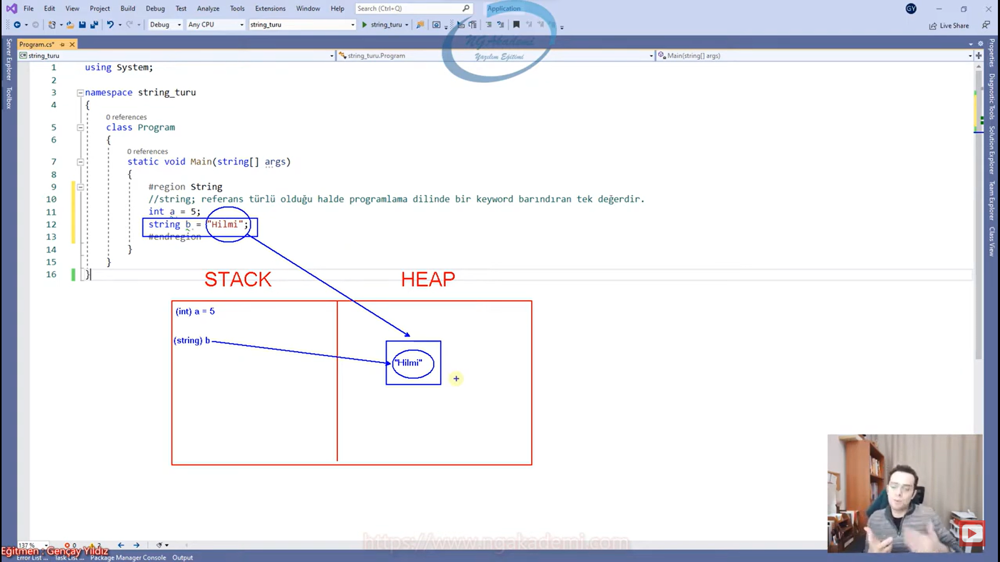

- Her ne kadar değer türlü değişken gibi kullansakta `string` bir referans türlü değişkendir. Heap'te tutulur aslında bir nesnedir. Amma velakin referans türlü değişkenlerin arasında sanki değer türlüymüş gibi tek keywordü olan değişkendir/türdür/değerdir.

```C#
#String
//`string` referans türlü olduğu halde programlama dilinde bir keyword barındıran tek değerdir.
int a = 5;
string b = "Hilmi";
```

***
# 296.1) Null - Empty Durumları, Farkları
- `string` referans türlüdür dedik. Referans türlü değişkenler `null` değer alabilir. Değer türlü değişkenler `null` değer alamaz. Değer türlülerin `null` alabilmesi için nullable yapılması gerekir.

- `string` hem `null` değer alabiliyor hem de empty olabiliyor. 

- Bir referans türlü, nullable değişken eğer ki `null` ise onun bellekte karşılığı yok demektir. Bu bir alan tahsisi bile yapmamış anlamına geliyor.

- Bir değişken/nullable/referans eğer ki `null` alıyorsa bu durum ilgili değişkenin herhangi bir alanı tahsis etmediği anlamına gelir.

- Bellekte 2 tane alan vardır biri Stack biri Heap sen bir değişken tanımlıyorsun şimdi bu değişken stack'te bir isim/değişken/referans olarak tanımlanabilir ama eğer ki bu `null` ise bunun bir karşılığı yok anlamına geliyor. Herhangi bir şeyi referans etmiyor anlamına gelecek. Evet bir değişken var ama tuttuğu herhangi bir değer yok. Değer olmadığından dolayı bu `null` anlamına geliyor.  karşıda bir anlamı tahsisi olmadığı durumda `null` söz konusudur.

- Bir değişken/nullable/referans eğer ki empty ise bu değişkenin değeri yok anlamına gelir. Lakin alan tahsisinde bulunulmuştur.

- Şimdi `null` ben bir değişkenim ama bir alan tahsisinde bulunmadım havada bir değişkenim. Ben eğer ki empty olan bir değişkensem alan tahsisinde bulundum arsa boş.

- `null` arsa yok ama bir değişken var bir vatandaş var ama arsası bile yok. Empty vatandaş var arsası da var ama ev yok arsa boş. Yani empty'de alan tahsisi yapılıyor ama değer koymuyoruz yani içi boş olan ama bir alan tahsisi yapılmış bir değişkenden bahsediyoruz.

- Sen bir değişkeni `null` olarak atıyorsan `null` veriyorsan buna o değişken tanımlanır ama o değişkenin karşılığında alan tahsisinde bulunulmaz. Yani senin belleğin 100 birimlik bir bellekse hala 100 olarak kalmaya devam eder. Amma velakin empty değerini atıyorsan empty olan değişkende bir alan tahsisinde bulunulur yani 100 birimlik alan 99'a düşer amma velakin ilgili alana bir değer koymazsın içi boş olur.

- Değişkende alan tahsisinde bulunup ilgili alana bir değer koymuyorsan biz buna empty durum diyoruz.

- Değer türlü değişkenler `null` alamazlar!

- `null` alabilen türler sadece referans türlerdir.

- Değer türlü değişkenlerin `null` alabilmesi için nullable(`?`) olmaları gerekmektedir.

- Eğer ki bir değer türlü değişkeni `null` alabilir yani değişkeni tanımlayacağım ama bunun karşılığında herhangi bir değer tanımlamayacağım bir alan tahsisinde bulunmak istemiyorum diyorsanız bunu nullable(`?`) yapmanız gerekmektedir. Yani değer türlü bir değişkeni `null` almasını istiyorsanız nullable(`?`) yapmanız gerekiyor.

- `string b = null;` `string` değişken tanımlanmıştır amma velakin buna bir alan tahsisinde bulunulmamıştır.

- Tüm değerler empty atanabilir.

- Alan tahsisinde bulunduktan sonra ilgili alana bir değer koymamak empty durumudur.

- Default değerlerin olduğu durumlar empty olarak geçerler.

- Bir değer türlü değişkene sen varsayılan default değerini atarsan ilgili değişken empty olarak nitelendirilir.

- Bir dizi tanımladın ve tanımlamış olduğun array'de boş bir dizi veriyorsan o da bir empty'lik durumudur. Alan tahsisi vardır ama kullanmıyorsundur.

- Empty dendiğinde aklına hiçbir tür gelmesin Empty dendiğinde aklınıza `string` bir değişkene "" değerinin verilmesi gelsin yeter.

- Eğer ki bir `string` içerisine boş `string` verirseniz bu empty'dir. Empty değer yok anlamına gelmez. Bellekte yer kaplar.

- `null` bellekte yer kaplamaz! lakin empty her ne kadar değer almasa da bellekte yer kaplayacak ve bir alan tahsisinde bulunmuş olacaktır...

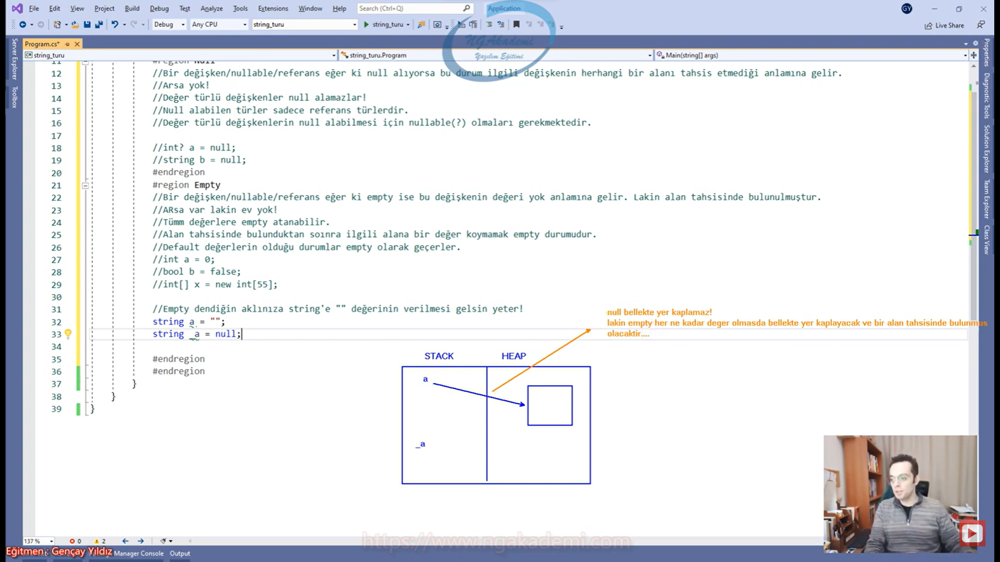

- bir `string` değişkeni empty yapmak için;
    * `string a = "";`
    * `string a2 = string.Empty;`
    * iki varyasyonla da çalışabilirsiniz.

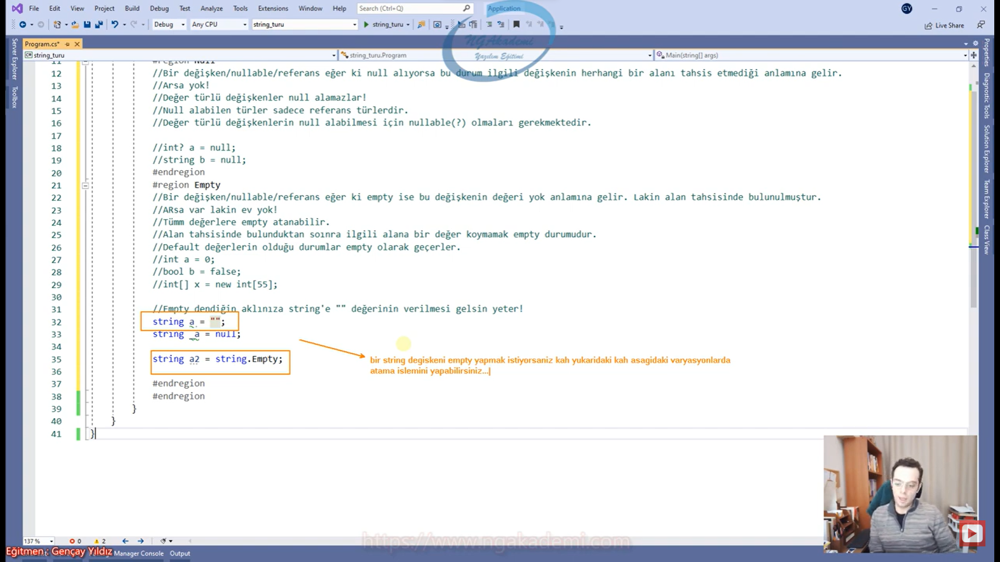

- Bizim için empty kavramı genellikle `string`te hani empty adı üzerinde zaten boş var olan alan boş. `null` yok öyle bir alan. `null` alan tahsisi bile yok empty var ama içi boş. Boş olan şey var olupta içi boş olan bişeyden bahseder. `null` o da yok hani içi boş olacak bir alan bile yok.

```C#
#Null - Empty Durumları, Farkları
        
#Null
//Bir değişken/nullable/referans eğer ki `null` alıyorsa bu durum ilgili değişkenin herhangi bir alanı tahsis etmediği anlamına gelir.
//Arsa Yok!
//Değer türlü değişkenler `null` alamazlar!
//`null` alabilen türler sadece referans türlerdir.
//Değer türlü değişkenlerin `null` alabilmesi için nullable(`?`) olmaları gerekmektedir.

int? a = null;
string b = null;

#Empty
//Bir değişken/nullable/referans eğer ki empty ise bu değişkenin değeri yok anlamına gelir. Lakin alan tahsisinde bulunulmuştur.
//Arsa var lakin ev Yok arsa Boş!
//Tüm değerler empty atanabilir.
//Alan tahsisinde bulunduktan sonra ilgili alana bir değer koymamak empty durumudur.
//Default değerlerin olduğu durumlar empty olarak geçer.
//Empty dendiğinde aklınıza `string` bir değişkene "" değerinin verilmesi gelsin yeter.

int a = 0;
bool b = false;
int[] x = new int[55];
string a = "";
string _a = null;
string a2 = string.Empty;
```

***
# 296.2) Null - Empty Durumları, Farkları
- `null` olan bir durum `null` olan bir değer üzerinde işlem yapmaya çalıştığımızda hataya meydan verecekken empty olan bir değer üzerinde işlem yapabiliriz.

- `null` olan bir değer üzerinde işlem yapmaya çalıştığımızda run time hatası meydana gelir. Amma velakin empty olan bir değer üzerinde işlem gerçekleştirilebilir.

- Nihayetinde olmayan bir değer üzerinde işlem yapmaya çalıştığımızda bu bir hatadır. Ama empty olan yani var bir alan tahsisinde bulunulmuş ama içinde değer olmayabilir sıkıntı yok empty olan bir değer üzerinde işlem yapmak doğrudur/işlem yapılabilmektedir. 

- `null` olan bir şeyin üzerinde işlem yapmak hataya sebep olacaktır.

```C#
#Null - Empty Durumları, Farkları
#Null
//Bir değişken/nullable/referans eğer ki `null` alıyorsa bu durum ilgili değişkenin herhangi bir alanı tahsis etmediği anlamına gelir.
//Arsa Yok!
//Değer türlü değişkenler `null` alamazlar!
//`null` alabilen türler sadece referans türlerdir.
//Değer türlü değişkenlerin `null` alabilmesi için nullable(`?`) olmaları gerekmektedir.
//`null` olan bir değer üzerinde işlem yapmaya çalıştığımızda run time hatası meydana gelir. Amma velakin empty olan bir değer üzerinde işlem gerçekleştirilebilir.

int? a = null;
string b = null;

#Empty
//Bir değişken/nullable/referans eğer ki empty ise bu değişkenin değeri yok anlamına gelir. Lakin alan tahsisinde bulunulmuştur.
//Arsa var lakin ev Yok arsa Boş!
//Tüm değerler empty atanabilir.
//Alan tahsisinde bulunduktan sonra ilgili alana bir değer koymamak empty durumudur.
//Default değerlerin olduğu durumlar empty olarak geçer.
//Empty dendiğinde aklınıza `string` bir değişkene "" değerinin verilmesi gelsin yeter.

int a = 0;
bool b = false;
int[] x = new int[55];
string a = "";
string _a = null;
string a2 = string.Empty;
```

***
# 297) String İfadelerde IsNullOrEmpty Kontrolü,
- `null` olan bir değerle empty olan bir değer arasında işlem farkı vardır. Empty olan bir değerin üzerinde işlem yapmaya çalıştığımızda her ne kadar beklediğimiz sonucu vermese de hata meydana gelmez çünkü bir alan tahsisinde bulunulmuş yazılım mimari ilgili alanın üzerinde çalışmasını yapabilecektir. Amma velakin `null` olan bir değişkenin üzerinde işlem yapmaya çalışırsanız yani o değişkenin bir karşılığı yok. Bir alan tahsisi yapılmadığından dolayı patlayacaktır. Dolayısıyla patlayacak uygulama sona erecektir.

- Elimizdeki `string` ifadelerin işleme tabi tutulmadan önce kesinlikle kontrol edilmesi gerekmektedir.

- Bazen biz yaptığımız operasyonlar neticesinde elde edilen `string` ifadeleri yeniden bir operasyona tabi tutmadan önce hem `null` hem de empty olup olmama durumunu kontrol ediyoruz. Empty'lik varsa sıkıntı yoktur ama biz empty olmasını da istemeyiz. Eğer ki elimizdeki `string` ifade empty ise yani demek ki boş yani demekki önceden bu değeri üretecek operasyonda bir eksiklik var o zaman başka birşey yapman lazım.

- Authorazation Authentication dediğimiz noktalar vardır. Şimdi kimlik yetkilendirme durumunda kimliği yetkilendirirken kişinin eğer ki adı `null` ya da empty ise yani bana beklediğim değerler gelmiyorsa demek ki kişi `null` da olsa empty'de olsa kişi giriş yapmamıştır o zaman önce giriş yap diyeceğim ondan sonra kişiyi authorazation yapacağım. Yani yetkilendireceğim.

- `null` olma durumu empty olma durumu davranışsal olarak yazılımda biri hata veriyor diğeri vermiyor ama biz elimizdeki `string`i işleme tabi tutacaksak elimizde bir değer olmasını isteriz.

- Bir `string` ifadenin `null` olup olmamasını empty olup olmamasını daha hızlı kontrol edebilmemiz için `IsNullOrEmpty` diye bir fonksiyonumuz var. Bu fonksiyon elimizdeki `string` ifadenin hızlı bir şekilde kontrolünü yapmamızı sağlar.

- `IsNullOrEmpty` fonksiyonu; elimizdeki `string` ifadenin `null` yahut empty olup olmama durumları hakkında bir check yapar ve geriye `bool` türde sonuç döner.

- Uzun uzun operatörlerle çalışacağına burada direkt `IsNullOrEmpty` fonksiyonunu kullanabilirsin. Elindeki `string` ifadenin `null` olup olmama durumunu empty olup olmama durumunu her ikisini de kontrol edecek ve geriye sana sonuç dönecektir.

- `string.IsNullOrEmpty(value)` 
    * parametre eğer ki `null` ya da empty ise bu ifade `true` dönecektir.
    * parametre olarak `string` değeri ister.

- Eğer ki `null` ya da empty ise geriye `true` değilse `false` dönecektir.

- Sen elindeki bir `string` ifadenin `null` ya da empty olmadığı durumlarda operasyon yapaacaksan `if(!string.IsNullOrEmpty(value))` şekilde kontrol edebilirsin.

```C#
#IsNullOrEmpty
//Elimizdeki `string` ifadelerin işleme tabi tutulmadan önce kesinlikle kontrol edilmesi gerekmektedir.
string x = "";//Empty
// string x = string.Empty;//Empty
// if (x != "")
// if (x != string.Empty && x != null)
if (x != string.Empty && x is not null)
{
    //Operasyon...
}
//IsNullOrEmpty fonksiyonu; elimizdeki `string` ifadenin `null` yahut empty olup olmama durumları hakkında bir check yapar ve geriye `bool` türde sonuç döner.
//Eğer ki `null` ya da empty ise geriye `true` değilse `false` dönecektir.
if (!string.IsNullOrEmpty(x))
{
    //Operasyon...
}
```

***
# 298) String İfadelerde IsNullOrWhiteSpace Kontrolü
- Bazen de yapılan operasyonlar neticesinde elde edilen değerler `null` da gelebilir bazen empty gelmez boşluk olarakta gelebilir.

- Elimizdeki `string` ifade empty değil içinde bir belirli karakterler barındıran yani bir metin barındıran bu metin yine space yani boşluk olan bir değer olduğunu düşünelim. Bu da bazen bizim için yeterli değildir. Bazı fonksiyonlar ya da uzaktan veri gönderen servisler `string` ifadeyi bazen boş olarak gönderebiliyor. Şimdi biz `IsNullOrEmpty` ile bunu denetlerken ne `null` ne de empty olmadığından dolayı sanki veri gelmiş gibi algılanıyor. Algoritma esnasında patlıyoruz. Ya mantık hatası ya da çalışma zamanı hatalarına sebep olabiliyor.

- Elimizdeki ifadenin `null`, empty ya da whitespace buradaki boşluklardan ibaret olmadığı durumu hızlıca kontrol edebilmek için `IsNullOrWhiteSpace` fonksiyonunu kullanabiliriz.

- `IsNullOrWhiteSpace` fonksiyonu: Elimizdeki `string` ifadenin `null`, empty yahut boşluk karakterlerinden ibaret olma durumunda geriye `bool` `true` değerini döndüren bir fonksiyondur.

- `IsNullOrEmpty` kullanıyorsanız boşluklu/space olma durumunda empty olarak görmeyecek kod akışına devam edecektir `IsNullOrWhiteSpace` ile kontrol ederseniz boşluklu/space da olsa empty'de olsa `null` da olsa görecek ve kodun akışını etkileyecektir.

```C#
#IsNullOrWhiteSpace
// `IsNullOrWhiteSpace` fonksiyonu: Elimizdeki `string` ifadenin `null`, empty yahut boşluk karakterlerinden ibaret olma durumunda geriye `bool` `true` değerini döndüren bir fonksiyondur.
string x = "sebepsiz boş yere ayrılacaksan";
// string x = "   ";
// string x = "";
// string x = string.Empty;
// string x = null;
if (!string.IsNullOrWhiteSpace(x))
{
    //Operasyon...
}
```

***
# 299) String RAM(Heap) İlişkisini İnceleyelim
- `string` referans türlü bir değişkendir ve Heap'te tutulur.

- Bir `string` ifade belleğin heap bölgesinde tutulduğunu artık biliyoruz.

- Referans türlü değişkenleri ikiye ayıracağız;
    * bir değer kısmı -> değişkenin değeri
        + Heap'te tutulur.
    * bir referans kısmı -> değişkenin kendisi olacak 
        + Stack'te tutulur

- Referans türlü değişkenlerin referansı Stack'te değerleri ise Heap'te bir nesne olarak tutulur.

- Bir değişkenin referans türlü olması demek Stack'teki bir referansın Heap'teki bir nesneyi referans etmesi/göstermesi/işaretlemesi demektir.

- `string` ifadeler belleğin Heap kısmında tutulurlar. `string` ifadelerin değerleri referans türlü olduklarında dolayı bir nesnedir. Nesne dediğinde Heap'te tutulur. Dolayısıyla `string` değerler belleğin Heap'inde tutulurken `string` değişkenler referans olduklarından dolayı Stack'te tutulacaktırlar.

```C#
#String Ram(Heap) İlişkisi
string x = "asfsafsafasdfas";
```

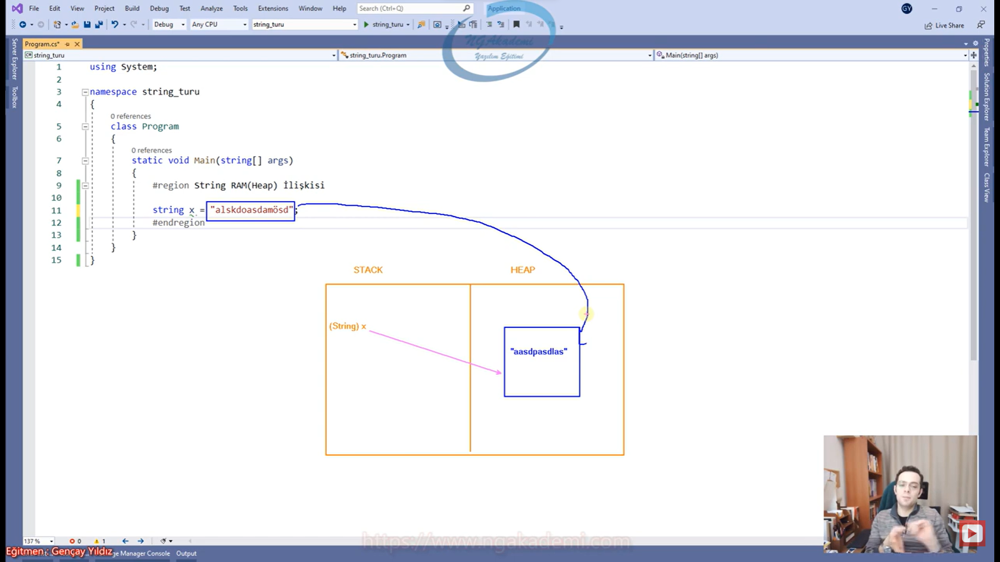

***
# 300) String Özünde Bir char Dizisidir!
- Karakterlerin bir araya gelmiş haline biz metin diyoruz. Karakterlerin tekil olarak elde edilmiş haline de `char` yani karakter diyoruz. 

- `string` referans türlü demiştik. Çünkü referans türlü olmaktan başka şansı yok. Çünkü `string` ifadeler esasında bir `char` dizisidir.

- `string` ifadeler esasında bir `char` dizisidir. Yani elimizdeki `string` ifadeler bilgisayarda `char` dizisi olarak tutulurlar başka şansı yok.

- `string` ifadeler esasında bir `char` dizisidir. Yani yazılım açısından `string` ifade yoktur! Esasında karakterlerin bir araya gelmiş hali vardır. Dolayısıyla karakterleri bir araya getirebilecek yegane şey bir dizidir. `string` ifadeler yazılımsal açıdan bilgisayarda bir `char` dizisi olarak tarif edilmekte ve o şekilde tutulmaktadırlar.

- `string`ler `char` dizisiyse diziler referans türlü olduklarından `string`lerde referans türlüdür.

- `string` ifadeler özünde bir `char` dizisi/yani dizi olmasından dolayı referans türlü değişkenlerdir. Çünkü diziler referans türlüdürler. Yani nesnedirler. yani Heap'te tutulurlar. Dolayısıyla kendisi bir referans türlü olan bir diziyse demekki `string`te dolaylı bile değil doğrudan referans türlü değer olarak karşımıza çıkıyor. Ondan dolayı referans türlü yoksa adamlarda bilirdi `string`i değer türlü yapmayı ama referans türlü olmak zorunda kaldıkları için referans türlü olarak dizi olarak yapmak zorunda kaldıklarından dolayı referans türlü bir değer olduğu ortadadır.

- `string` ifadeler `char` dizisi olduklarından dolayı yapısal olarak her bir karakter baştan sona otomatik indexlenmektedir. Dolayısıyla `string` bir ifade üzerinde bizler indexer operatörünüde(`[]`) kullanabilmekteyiz... Yani 0'dan başlar en sonuncu karaktere kadar n-1 olarak gidecektir.

- indexer operatörü(`[]`) sade ve sadece dizilerde ve koleksiyonel yapılanmalarda kullanılır. Haliyle `string`te bir `char` dizisi olduğundan dolayı `string`te de kullanabiliyoruz.

- Bir `string` değerin karakter sayısını `Length` özelliği ile elde edilebilir.

- Aynı şekilde `string` ifadelerde yine döngülerde kombinasyonel olarak dönebilir iterasyonlarla kullanbilirsin.

- Yapısal olarak `string` bir `char` dizisi olabilir amma velakin yapısal olarak `string` olduğu için direkt `Array`e atanamaz.

- `Array array = metin;`//`string` özünde bir `char` dizisi olabilir amma velakin yapısal olarak yine de `string` olduğu için `Array` referansına atılamaz `Array` ile karşılanamaz!!!

- Özünde bir `char` dizisidir ama yine de bir `string` bunu da atlamamak lazım Dizilerdeki tüm özellikler burada kullanılabilir değildir tabiki de. Gidipte `int` dizisinde yapabildiklerinizin hepsini bir `string`ten beklemeyin. Çünkü `string` kendine has şahsına münhasır bir tür özünde `char` dizisidir ama yine de bir `string`tir

```C#
#String - char Dizisi
//`string` ifadeler esasında bir `char` dizisidir. Yani yazılım açısından `string` ifade yoktur! Esasında karakterlerin bir araya gelmiş hali vardır. Dolayısıyla karakterleri bir araya getirebilecek yegane 
şey bir dizidir. `string` ifadeler yazılımsal açıdan bilgisayarda bir `char` dizisi olarak tarif edilmekte ve o şekilde tutulmaktadırlar.
//`string` ifadeler özünde bir `char` dizisi/yani dizi olmasından dolayı referans türlü değişkenlerdir. Çünkü diziler referans türlüdürler. Yani nesnedirler. yani Heap'te tutulurlar.
//`string` ifadeler `char` dizisi olduklarından dolayı yapısal olarak her bir karakter baştan sona otomatik indexlenmektedir. Dolayısıyla `string` bir ifade üzerinde bizler indexer operatörünüde(`[]`) 
kullanabilmekteyiz...
string metin = "sebepsiz boş yere ayrılacaksan..";
System.Console.WriteLine(metin[3]);
System.Console.WriteLine(metin.Length);
Array array = metin;//`string` özünde bir `char` dizisi olabilir amma velakin yapısal olarak yine de `string` olduğu için `Array` referansına atılamaz `Array` ile karşılanamaz!!!
```

***
# 301) Döngülerle String Metin İçerisindeki Her Bir Karaktere Ulaşma
- Madem ki `string` bir nesne ve madem ki bir dizi o zaman biz bunun üzerinde belirli bir kombinasyon eşliğinde döngülerle rahatça dönüp tek tek bütün karakterlerini elde edebilir ona göre işlemler yapabiliriz.

- Herhangi bir dizi üzerinde belirli bir kombinasyon eşliğinde döngüyle nasıl işlem yapabiliyorsam `char` dizisi olan `string` üzerinde de birebir döngülerle işlem gerçekleştirebilmekteyim.

```C#
#String - char Dizisi
string metin = "sebepsiz boş yere ayrılacaksan...";
for (int i = 0; i < metin.Length; i++)
{
    if (metin[i] == 'e')
        System.Console.WriteLine(i);
}
int i = 0;
do
{
    if (metin[i] == 'e')
        System.Console.WriteLine(i);
    i++;
    
} while (i < metin.Length);
```

***
# 302) String İfadelerde + Operatörü Kullanımı
- `string` ifadelerde `+` operatörü her daim birleştirme işlemi yapar.

- `string` ifadelerde `+` operatörü kullanılabilmektedir.

- İki `string` ifade arasında birleştirme görevi görür. Yani burada aritmetik bir toplama işlemi değilde yan yana birleştirme söz konusu olacaktır.

- İki `string` toplanırsa yan yana birleştirilmiş olur.

- Bir `string` ifade ile herahngi bir tür `+` operatörüyle işleme tabi tutulabilir.

- `+` operatörü `string` bir ifadeyle  herhangi bir türdeki ifadeleri işleme tabi tutarken `object` + `string` olarak davranış sergileyecek ve sonuç olarak geriye `string` değer döndürecektir.

- Demek ki `string` bir ifadeyle herhangi bir ifadeyi `+` operatörü ile işleme tabi tutarsam ilgili işlemin sonucu `string`e convert edilir.

- Dolayısıyla herhangi bir ifadeyi `string`e dönüştürebilmek için o ifadeyi `+ ""` işleme tutmak yeterli olabilir.

- Bir ifadeyi `string`e dönüştürebilmek için `ToString()` fonksiyonunu, `Convert.ToString()` fonksiyonunu ve `+ ""` bu operasyonu kullanabiliriz. Ama `+ ""` bu biraz maliyetlidir operatör kullandığı için.

- `System.Console.WriteLine(5 + 7 + 20 + "ahmet");` bu işlem neticesinde ilk önce aritmetik işlemi yaparak 32'yi elde edecek daha sonra `string`le topladığı için `32ahmet` yazacaktır.

```C#
#String İfadelerde + Operatörü
//`string` ifadelerde `+` operatörü kullanılabilmektedir.
//İki `string` ifade arasında birleştirme görevi görür.
//Bir `string` ifade ile herahngi bir tür `+` operatörüyle işleme tabi tutulabilir.
//`+` operatörü `string` bir ifadeyle  herhangi bir türdeki ifadeleri işleme tabi tutarken `object` + `string` olarak davranış sergileyecek ve sonuç olarak geriye `string` değer döndürecektir.
//Dolayısıyla herhangi bir ifadeyi `string`e dönüştürebilmek için o ifadeyi `+ ""` işleme tutmak yeterli olabilir.

string a = "merhaba", b = "dünya";
System.Console.WriteLine(a + b);
int a2 = 5;
var c = a + a2;
System.Console.WriteLine(5 + 7 + 20 + "ahmet");
System.Console.WriteLine(5 + 7 + 20 + "ahmet" + 84 + 78 + 95);
```

***
# 303) String Formatlandırma
- İş hayatında sürekli bir `string` değer üzerinde formatlandırma işlemi yapmak neredeyse bütün yazılımcıların görevidir. Nihayetinde uzaktan bir servisten gelen bir sonucu uygun bir formatta yazdırmak isteyebilirsiniz. Ya da internetten yapmış olduğunuz bir satış neticesinde faturalandırma durumlarında elinizdeki `string`i formata uygun bir şekilde faturanın değerlerini uygun parametlerle uygun yerlere yerleştirmekte isteyebilirsiniz. Bunun gibi birçok senaryoda `string` kalıpları belirli formatlandırmalarla işlemlere tabi tutmak isteyebilirsiniz.

- 3 Çeşit `string` formatlandırma operasyonu var.
    * `+` operatörü ile gerçekleştirdiğimiz `string` formatlandırma operasyonu.
    * `string.Format()` fonksiyonla gerçekleştirdiğimiz `string` formatlandırma operasyonu.
    * C# 6.0 ile gelen String Interpolation dediğimiz bir operatör ile daha kolay ve efektif bir şekilde gerçekleştirebilmekteyiz.

- `string` formatlandırma elimizdeki değerleri uygun yerlere yerleştirmemizi sağlayan programatik bir rapor ya da bir kalıpsal çıktı verme tekniğidir.

```C#
#String Formatlandırma
string isim = "Musa", soyisim="Uyumaz", tcNo = "12345678910";
int yas = 24;
bool medeniHal = false;
System.Console.WriteLine("TC No : .............. olan ..... ...... şahsın bilgileri | Yaş : .. | Medeni Hal : ..");
```

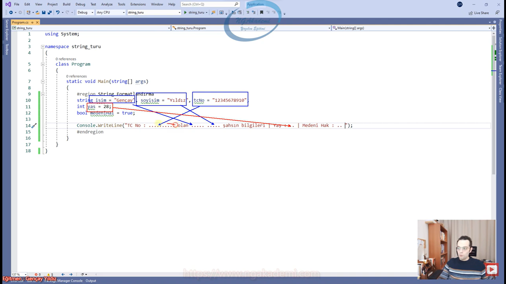

***
# 304) String Değeri + Operatörü İle Formatlandırma
- `string` ile herhangi bir ifadeyi `+` operatörü ile işleme tabi tuttuğumuzda yan yana birleştirme yapar ve sonuç olarak geriye `string` ifade döndürür.

- `+` operatörü ile `string` birleştirme de ternary operatörü kullanılıyorsa bunu parantez içerisine almanız gerekmektedir....

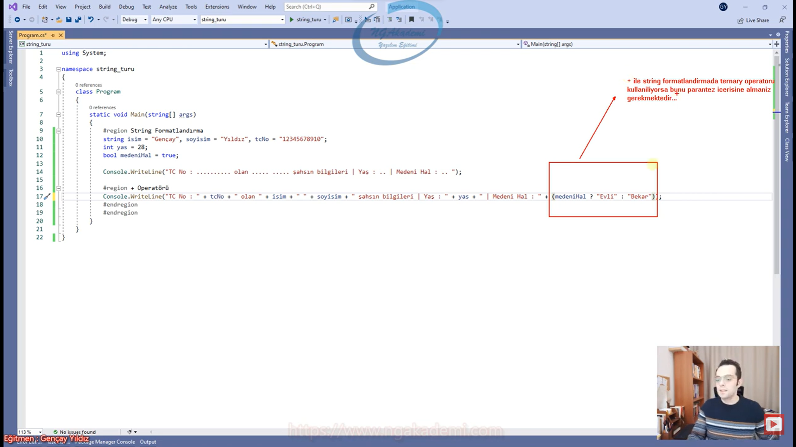

- `+` operatörü ile `string` formatlandırma operasyonu hem kod hem de performans açısından oldukça maliyetlidir... O yüzden tercih etmeyeceğiz.

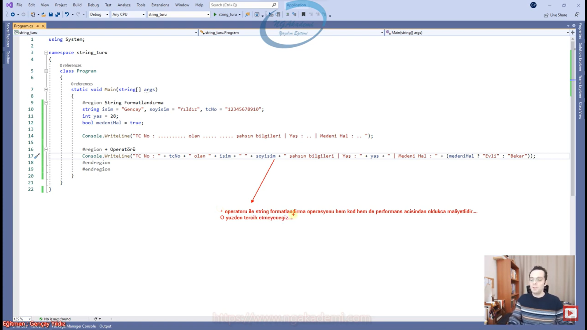

- Kullandığımız durumlardan bir diğeri de eskiden veritabanında birden fazla sorgu gönderirken bu sorguları düzenli bir şekilde yazabilmek için ya da sorgu parametrelerini girebilmek için biz `string` formatlandırma operasyonu yapıyorduk. Bir `INSERT` sorgusu yazıyorsan `INSERT` sorgunusun ilgili parametrelerine/ value kısmındaki değerler sen `string` olarak oluşturduğun o sorguda uygun değerleri bu şekilde girebiliyordun. 

```C#
#String Formatlandırma
string isim = "Musa", soyisim = "Uyumaz", tcNo = "12345678910";
int yas = 24;
bool medeniHal = false;
        
System.Console.WriteLine("TC No : .............. olan ..... ...... şahsın bilgileri | Yaş : .. | Medeni Hal : ..");

#+ Operatörü
System.Console.WriteLine("TC No : " + tcNo + "olan " + isim + " " + soyisim + " şahsın bilgileri | Yaş : " + yas + "| Medeni Hal : " + (medeniHal ? "Evli" : "Bekar"));
```

***
# 305) String Değeri string.Format Metodu İle Formatlandırma
- `string.Format` fonksiyonu yıllarca kullanılan birçok makale de yer alan ta ki String Interpolation çıkana kadar çok kullanılmıştır.

- `string` formatlandırma operasyonlarında `+` operatörü de kullanılıyor ama `+` operatörünün kullanıldığı koda bakan bir coder ya kodu yazan arkadaşın üşendiğini düşünür bir niyet okur ya da bilgisizliğini görür. Güncel olmadığını görür. String Interpolation'ı bilmemek hiç yoktan `string.Format`ı bilmemek bir bilgisizliğin kaynağı olarak yorumlanabilir. Dilde her zaman en güncel noktaya odaklanalım.

- Elimizdeki `string` ifadeye belirli indexler atıyoruz ve atadığımız indexler üzerinden ilgili formata uygun değerleri gönderiyoruz. Index dediğimize göre 0'dan başlayacaktır. süslü parantezler({}) üzerinden index atamasını yaparız. Şimdi süslü parantezlerde atadığımız index numaralarına `,` dedikten sonra ilk göndereceğin değer 0'a  ikinci `,`den sonra göndereceğin değer 1'e şeklinde ve bu şekilde sıralı bir şekilde ilgili indexlere değerleri gönderebiliyorsun. 

- `string.Format` fonksiyonu metinsel kalıbın içerisindeki indexel belirlenen noktalara sırasıyla değer göndermemizi sağlayan bir fonksiyondur.


- `params`'ta sınırsız parametre girebilirsin.

```C#
#String Formatlandırma
string isim = "Musa", soyisim = "Uyumaz", tcNo = "12345678910";
int yas = 24;
bool medeniHal = false;
System.Console.WriteLine("TC No : .............. olan ..... ...... şahsın bilgileri | Yaş : .. | Medeni Hal : ..");
#string.Format
string sonuc = string.Format("TC No : {0} olan {1} {2} şahsın bilgileri | Yaş : {3} | Medeni Hal : {4}", tcNo, isim, soyisim, yas, medeniHal ? "Evli" : "Bekar");
System.Console.WriteLine(sonuc);
```

***
# 306) String Değeri $(String Interpolation) Operatörü İle Formatlandırma
- `string` formatlandırma operasyonlarında günümüzde olmazsa olmaz String Interpolation yani `string` ifadenin arasına bir değer girmemizi sağlayan özelliktir. C# 6.0 ile yazılım dünyasına gelmiştir.

- Aslınada amaç önceki operatörlerde yaptığımızı birebir aynısını yapmak ama bunu daha efektif yapabiliyoruz.

- `string` ifadenin içerisinde süslü parantezi(`{}`) programatik etkileşimli hale getirdiler.

- String Interpolation `string` ifadenin içerisinde süslü parantez(`{}`) ile araya girerek programatik bir değişkenin değerini bırakmamızı/eklememizi sağlayan bir operatördür.

- Yani senin `string.Format`tan daha gelişmiş bir yapılanma olduğunu düşünürsen eğer senin değerlerini direkt `string.Format`taki gibi index mantığıyla değilde direkt ilgili süslü parantezlerin(`{}`) içine vermeni sağlayan bir operatördür.

- Eğer ki `string` ifadenin başına `$` işaretini koyarsanız bu ilgili `string`e String Interpolation özelliğini kazandırıyor olacaktır.

- Bir `string` değerin başına `$` operatörü koyulursa --> `$"..."` bu ifadenin içerisinde string interpolation operasyonunun/operatörünün kullanılabilirliği sağlanır. Yani ilgili `string` içerisindeki süslü parantezler(`{}`) bir interpolation özelliği sergilerler.

- İlgili `string`in başında `$` işareti olmazsa normal bir metin olur Ama ilgili `string`in başına `$` işaretini koyarsan artık `string` içerisindeki süslü parantezler(`{}`) programatik anlam ifade edecek ve orada ilgili `string`in arasına bir değer koyabileceğin bir mekanizma bir operatör görevi görecektir.

- `$"..............{}................."` String Interpolation ilk önce `$` ile `string` ifadenin başına koyulur ardından süslü parantezlerle(`{}`) de programatik ifadeler gerçekleştirilir.

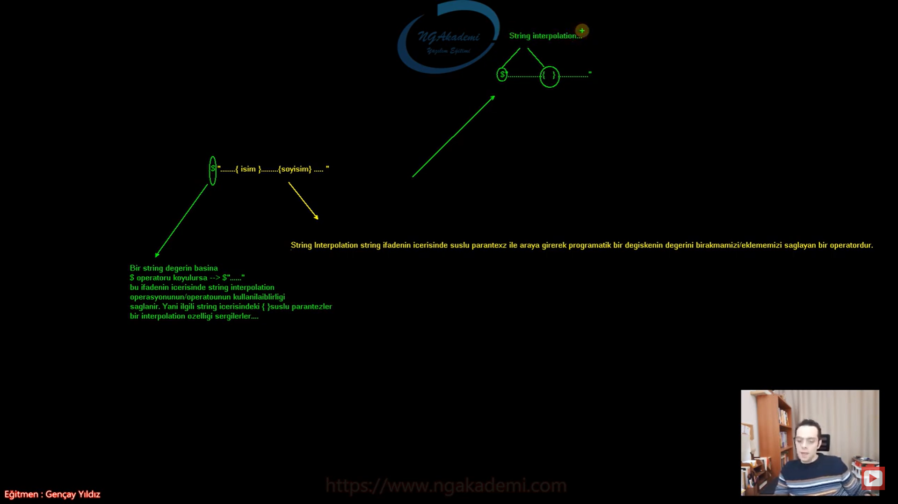

- Ne `+` operatörüyle çinceye benzer bir çıktı vermem gerekiyor/çalışma yapmam gerekiyor ne de `string.Format` ile uzun uzun index index uğraşıpta ondan sonra 3 5 tane index oldumu sıkıntı yok ama yeri geliyor 50 55 tane indexin olacak ne yapacaksın yeri geliyor bir mail göndermen lazım oradaki format 50 tane parametre gerektiriyor. String interpolation'da herhangi bir sayma yok herhangi bir `+` operatörü yok herhangi bir metini bölme yok. `string` ifadenin başına `$` operatörünü koyarsan bu String Interpolation özelliği aktifleştirilmiş bir `string` olacaktır ve bu `string`in içerisinde araya Interpolationları dahil edebiliyoruz. Yani metinleri dahil edebiliyoruz.

- `"Medeni Hal : {(medeniHal ? "Evli" : "Bekar" )}"` String Interpolation içinde Ternary kullanıyorsanız parantez(`()`) koymaya özen gösteriyorsunuz.

- String interpolation yapısal olarak `string.Format` fonksiyonuyla şekillenene bir operatördür...

- Ternary vs. kullanılıyorsa parantez içerisine alınız...

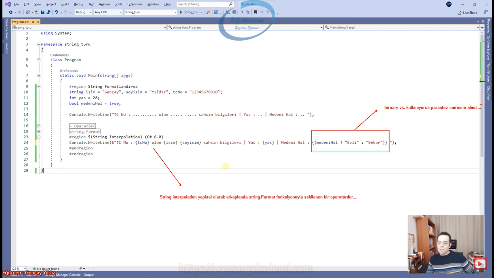

- String Interpolation kullanırken süslü parantezi(`{}`) oradaki kalıpta kullanmam gerekiyor String Interpolation değilde süslü parantezin(`{}`) olması lazım değersel olarak programatik olarak değil derseniz iki süslü parantez(`{}`) olarak kullanabilirsiniz. --> `$"......{{}}........"` İki String Polation birbirini programatik ezecektir.

- String interpolation kullanılan `string` ifadelerde metinsel olarak süslü parantez(`{}`) kullanmak ihtiyacı durumunda operatif olan süslü parantezleri yine aynı operatörle ezerek metinsel hale getirebiliriz...

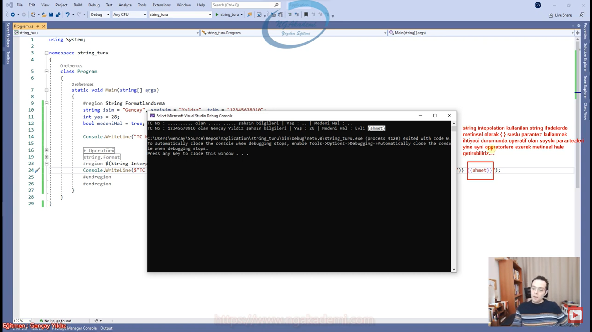

```C#
#String Formatlandırma
string isim = "Musa", soyisim = "Uyumaz", tcNo = "12345678910";
int yas = 24;
bool medeniHal = false;
System.Console.WriteLine("TC No : .............. olan ..... ...... şahsın bilgileri | Yaş : .. | Medeni Hal : ..");

#$(String Interpolation) (C# 6.0)
System.Console.WriteLine($"TC No : {tcNo} olan {isim} {soyisim} şahsın bilgileri | Yaş : {yas} | Medeni Hal : {(medeniHal ? "Evli" : "Bekar" )} {{ahmet}}");
```

***
# 307) String Değerlerde (Escape)Kaçış Karakterleri
- Yapısal olarak bu kompleks olan `string` yani metinsel değerlerin içerisinde bazen eylemsel karakterleri bir metinsel değer olarak kullanmak isteyebiliriz.

- `string` ifadeler `"............"` ile biter. `"` eylemsel bir karakterdir. `string` açısından belirli bir operasyonu/eylemi/sorumluluğu üstlenen bir karakterdir. Dolayısıyla böyle bir karakteri metinin içerisinde salt bir şekilde kullanmamız mümkün değildir.

- `".........."............."` Eğer ki bu şekilde `string` için özel eylemsel mahiyet ifade eden bir karakteri metinsel olarak kullanacaksam bu karakterin o anlık özel karakter olmadığını ifade etmem gerekmektedir.

- Bir özel eylemsel karakteri metinsel ifadenin içerisinde kullanabilmen için o karakterin özel karakter olmadığını ifade etmeni Escape yani kaçış karakterleri sağlamaktadır.   

- Bunun için Escağe/kaçış karakterleri kullanılmalıdır.

- Kaçış karakteri dediğimiz aslında bir tanedir. Backslash(`\`)

- `string` içerisinde kaçış karakteri olarak Backslash(`\`) kullanılmaktadır.

- `string`in içerisinde Backslash(`\`) kullanıyorsan eğer özel karakterden ziyade özel karakterin özel karakter olmadığını ifade eden bir yapılanmadır.

- `string` içerisinde özel/operatif karakterleri ezen ve bunları metinsel hale getirmemizi sağlayan bir karakterdir.

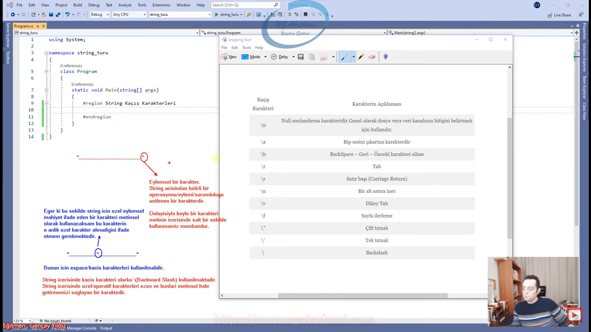

- Backslash(`\`) kendisinden sonra gelen karakterin bir özel/eylemsel/operatif karakter olmadığını, metinsel bir değer olduğunu ifade eder.

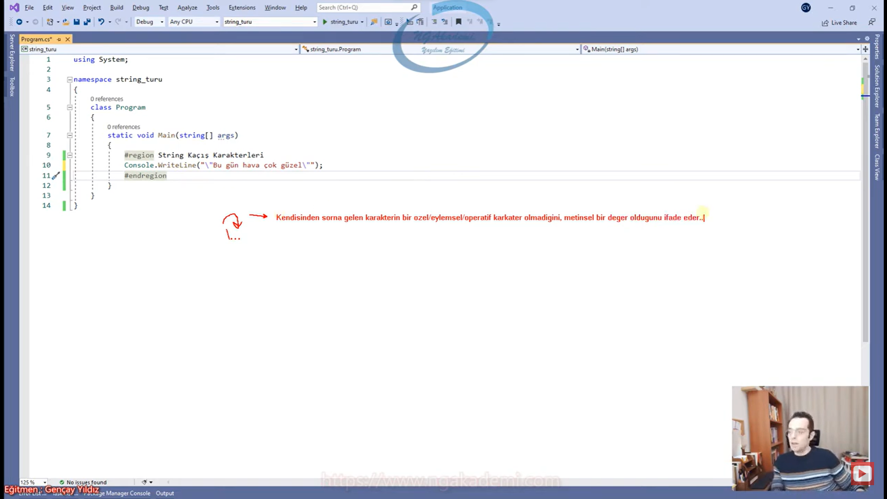

- `"\"Bugün Hava Çok Güzel\""` kardeşim benim `string`im bu içteki tırnaklar ise özel `string` eylemsel karakter değil normal metinsel karakterlerdir ve çıktı olarak Backslash'ı(`\`) yazdırmayacak direkt ilgili tırnakları yazdıracaktır. Bakın kaçış karakteri oradaki eylemsel özellikten biz ilgili karakteri kaçırdık normal bir metinsel değer haline getirdik.

- `string` ifadenin içinde kaçış karakterini/Backslash'ı(`\`) direkt lalettayin kullanamazsınız. Kaçış karakterini ezmeniz lazım. Backslash(`\`)  yanına illaki özel bir karakter/eylemsel bir karakter bekler. Aksi taktirde hata verir. Metinsel olarak Backslash'ı(`\`) kullanmak istiyorsak eğer ilgili operatörü yine kendisiyle ezmeliyiz. `\\`

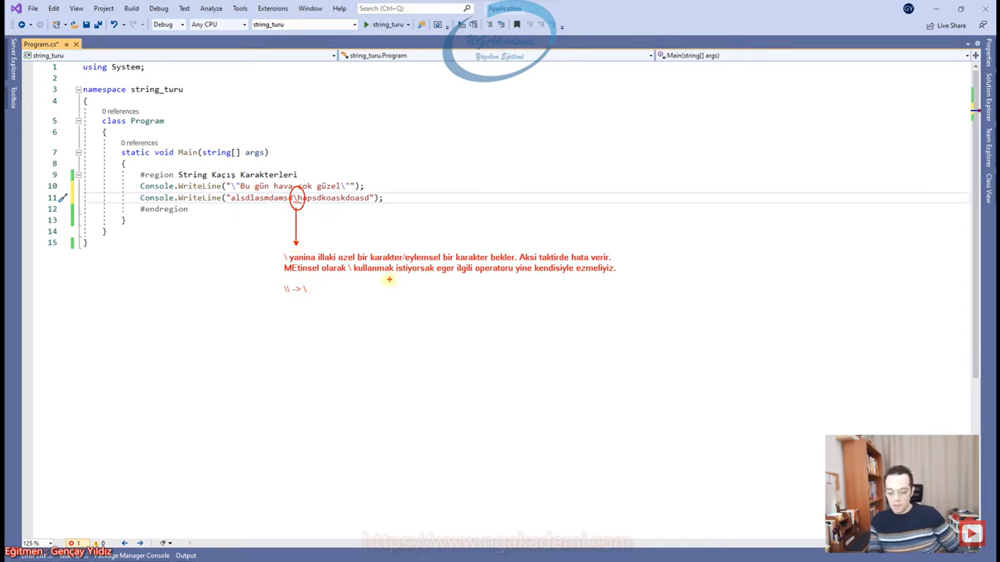

- Görüldüğü üzere tab, enter, satır sonu vs gibi doğrudan klavye tarafından girilemeyen bazı tuşları oluşturmak için kullanıladabilir...

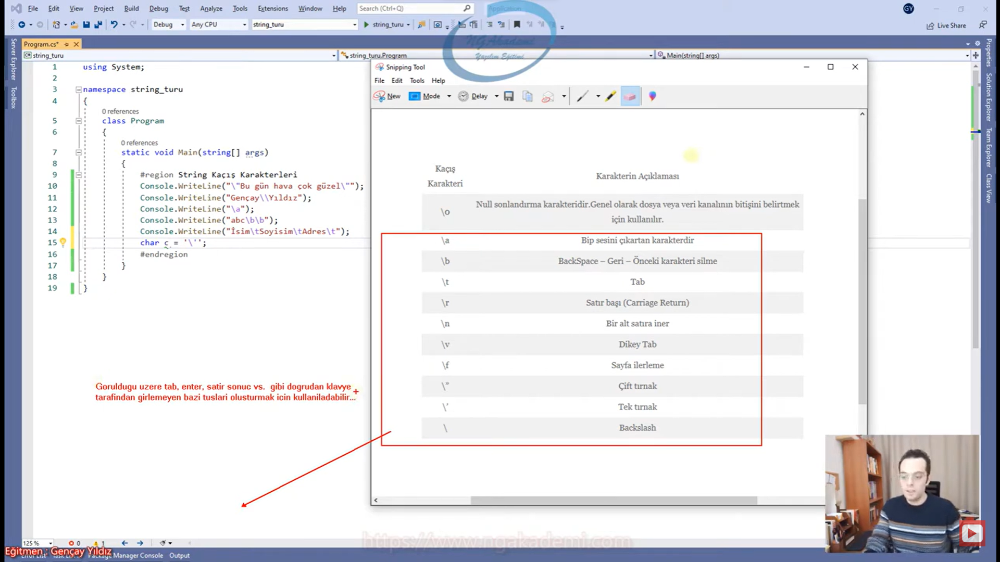

```C#
#String Kaçış Karakterleri
System.Console.WriteLine("\"Bugün Hava Çok Güzel\"");
System.Console.WriteLine("Musa\\Uyumaz");
System.Console.WriteLine("\a");
System.Console.WriteLine("abc \b");
System.Console.WriteLine("İsim\tSoyisim\tAdres\t");
char c = '\'';
```

***
# 308) String Türlerde @(Verbatim Strings) Operatörü
- Verbatim Strings(`@`) operatörü 3 farklı amaca hizmet eden operatördür.
    * Keyword isimlerine karşılık tanımlamalar yapma durumu.

- Belirli keywordlere karşılık gelen tanımlamalar yapmak istiyorsanız bu mümkün değildir. Ama illa yapacağım diyorsanız da `@` operatörü ile bu operasyonu gerçekleştirebiliyorduk.

```C#
#@(Verbatim Strings) Operatörü
#1. Kullanım
```

***
# 309) String Türlerde @(Verbatim Strings) Operatörü Kullanım Durumu 1
- Herhangi bir değişken tanımlarken ya da ileride göreceğimiz metotları tanımlarken bunların isimlerini programatik bir keyword veremiyoruz. İllaki vereceğim diyorsanız Verbatim Strings Operatörünü(`@`) kullanmanız gerekiyor.

- Kullananlar var ama çokta geçerli bir yapı değildir.

```C#
#@(Verbatim Strings) Operatörü
#1. Kullanım
//Bir değişken yahut metot vs. ibi yapılanma isimlerinin programatik bir keyworde karşılık gelmesi mümkün değildir. Derleyici hatası verilir.
//Eğer ki illa ben bir keyword ismi kullanacağım diyorsan eğer @(Verbatim Strings) Operatörünü kullanabilirsin.
int @void = 5;
int @class = 5;
int @namespace = 5;

void @void(){}
```

***
# 310) String Türlerde @(Verbatim Strings) Operatörü Kullanım Durumu 2
- Verbatim Strings(`@`) Operatörünün bir diğer kullanıldığı senaryo ise kaçış karakterlerinin kullanılması gereken durumlardır.

- İlgili özel karakterlerin eylemsel karakterlerin metin içerisinde ezilmesini istiyorsanız ilgili metinin `string` ifadenin en başına gelip Verbatim Strings(`@`) Operatörünü koyabilirsiniz. Verbatim Strings(`@`) Operatörünü koyduğunuz taktirde operasyonel olarak ilgili eylemsel operatörü/keywordü/karakteri kendisiyle tekrardan ezebiliyorsunuz.

- Escape karakterlerinin kullanılması icap eden durumlarda Verbatim Strings(`@`) Operatörünü kullanarak metinsel ifadeye/ `string` ifadeye eylemsel karakterleri kendileriyle ezebilecek özellik kazandırabiliyoruz...

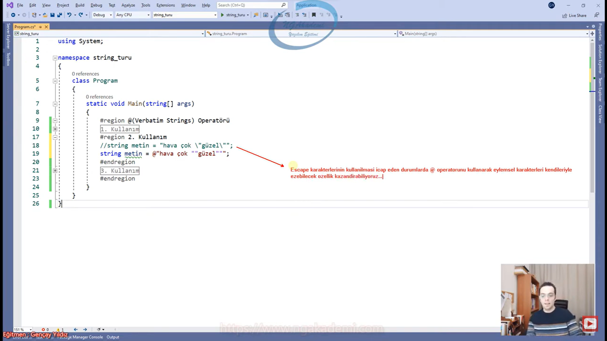

```C#
#@(Verbatim Strings) Operatörü
#r1. Kullanım
string metin = "hava çok \"güzel\"";
string metin = @"hava çok ""güzel""";
```

***
# 311) String Türlerde @(Verbatim Strings) Operatörü Kullanım Durumu 3
- Verbatim Strings(`@`) Operatörünün kullanıldığı 3. durum ise `string` ifadelerdeki satırlı metinler için geçerlidir.

- Metinsel ifadelerde çift tırnaklar(`""`) arasındaki ifadeler tek satırda yazılmak zorundadır. Siz bunları aşağı atlatamazsınız. Yani compiler seviyesinde hata verecektir.

- Biz bazen yazmış olduğumuz metinsel ifadeleri belirli bir taslak/format halide yazmak istediğimiz için Kodda da onların alt alta olmasını isteriz ama `+` operatörleriyle değil sanki düzgün bir metinmiş gibi olmasını isteriz.

- Normalde böyle satır satır `string` ifadeye izin vermeyen derleyici ilgili `string` ifadenin çift tırnaından(`""`) önce Verbatim Strings(`@`) Operatörü varsa compiler bunu algılayabiliyor.

- C#'ta `string` ifade birleştirilmeden satır satır yazılamaz. Yazabilmek için Verbatim Strings(`@`) Operatörünü kullanabiliriz. Ya da metinsel birleştirme yapılabilir...

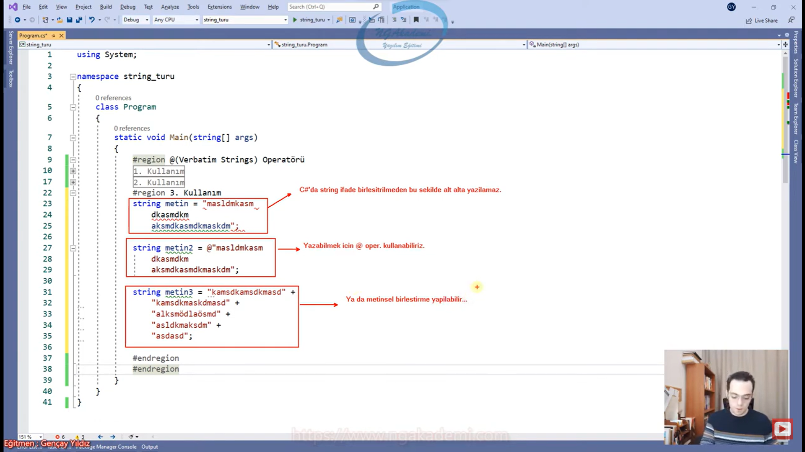

```C#
#@(Verbatim Strings) Operatörü
 string metin = "asfasfsamfasfasf
 qfpk
  agiaeşgfk 
  awğfg
   awkgl 
  aweşf";
string metin2 = @"asfasfsamfasfasf
 qfpk
  agiaeşgfk 
  awğfg
   awkgl 
  aweşf";
string metin3 = "asfasgagasgfassadasfasf " +
"asdfasgasasfafasfasfasf" +
"agfasgasdasdasfafga" +
"asdfafasfas";
```

***
# 312.1) String Interpolation İle Verbatim String Birlikteliği (C# 8.0)
- `string` ifadeler tek satırda yazılmazsa hata alınır Compiler izin vermez.

- C# 8.0'da String Interpolation operatörünü(`$`) ve Verbatim Strings(`@`) Operatörünü beraber kullanabileceğimiz şekle getirilmiştir.

- Verbatim Strings(`@`) Operatörü ve String Interpolation operatörü(`$`) aynı `string` ifade de kullanılıyorsa Verbatim Strings(`@`) Operatöründen sonra String Interpolation operatörü(`$`) bildirilmelidir.

- `@` operatörü ile `$` operatörü birlikte kullanılıyorsa önce `@` sonra `$` bilidirilmelidir.

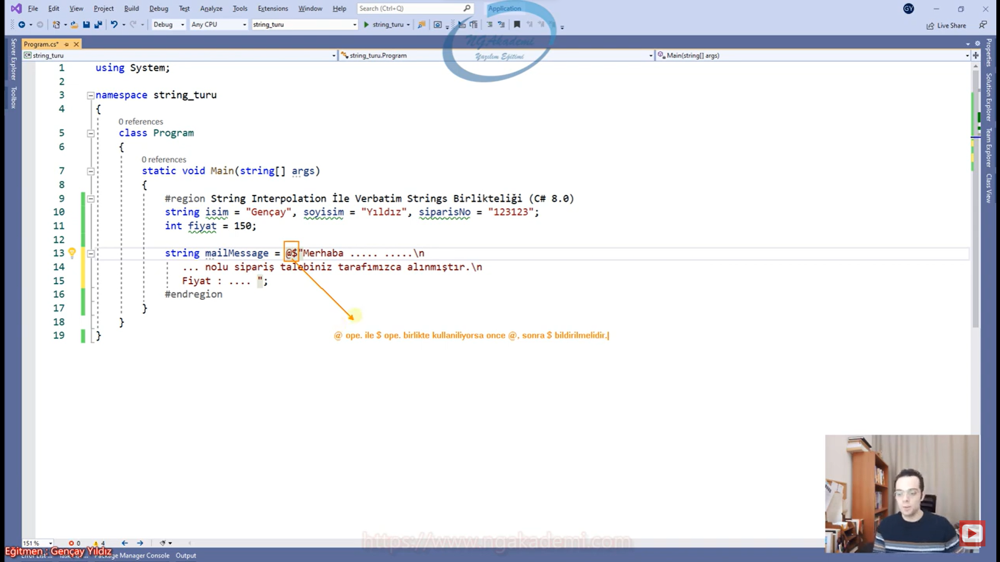

- Bazen kod ne kadar analitik olsa da gözün de gördüğünü direkt algılayabilmeli haliyle yazılan metini dümdüz yanına doğru yazarsak çıktı yine aynı olacaktır ama biz kodu daha rahat inşa edebilmek için editörden destekler bekliyoruz. Belirli operatörler eşliğinde bu şekilde çalışmalar gerçekleştirebiliyoruz.

```C#
#String Interpolation İle Verbatim String Birlikteliği (C# 8.0)
string isim = "Musa", soyisim="Uyumaz",siparisNo="123123";
int fiyat = 150;
string mailMessage = @$"Merhaba {isim} {soyisim}\n 
{siparisNo} nolu sipariş talebiliniz tarafımızca alınmıştır.\n
Fiyat : {fiyat}";
```

***
# 312.2) String Interpolation İle Verbatim String Birlikteliği (C# 8.0)
- Verbatim Strings(`@`) Operatörünün kullanıldığı yerlerde Escape kaçış karakterleri bir anlam ifade etmez.

- Sol kolona sıfırladığın zaman ondan sonra yazarsan en azından ürettiğin metinsel değerin formatını daha iyi bir şekilde görebilirsin.

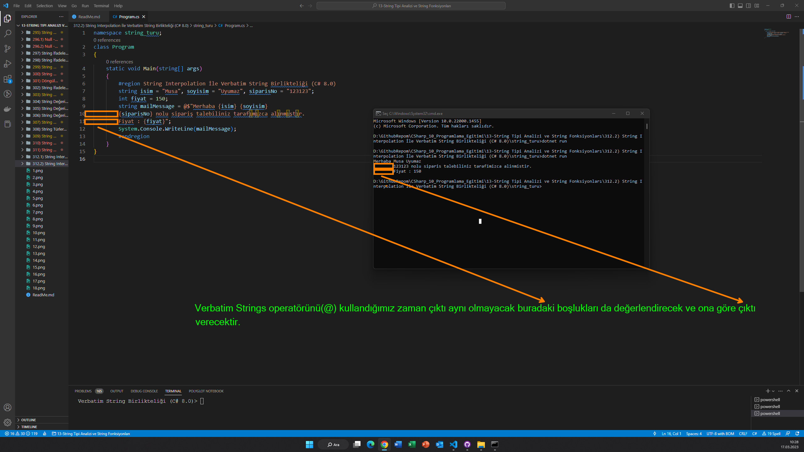

```C#
        #String Interpolation İle Verbatim String Birlikteliği (C# 8.0)
        string isim = "Musa", soyisim = "Uyumaz", siparisNo = "123123";
        int fiyat = 150;
        string mailMessage = 
@$"Merhaba {isim} {soyisim} 
{siparisNo} nolu sipariş talebiliniz tarafımızca alınmıştır.
Fiyat : {fiyat}";
        System.Console.WriteLine(mailMessage);
        
```

***
# 313) String Fonksiyonları Nelerdir?
- `string`/metinsel değerler sadece metinsel olacak değerler değillerdir. İşlem yapılması gereken değerlerde olabilir. Örneğin diyelim ki senin metinsel değerinde şiir var. Şimdi istatistiksel çalışma yapman gerekebilir örneğin kaç tane kelime var kaç tane 'a' harfi var ya da içinde 'keza' kelimesi geçiyor mu diye araman gerekebilir. Velhasıl kelam başı şöyle başlıyor mu sonu şöyle bitiyor mu diye sorular sorman gerekebilir. Bütün harflerini büyültmen/küçültmen gerekebilir. Belirli bir değer aralığını elde etmen değer aralığındaki değeri çıkarıp üzerinde işlem yapman gerekebilir. Silmen gerekebilir eklemen gereken noktalar olması gerekebilir vs.

- `string` dediğin değer salt değerden öte üzerinde neredeyse veri bilimine dayanacak işlemler yapabileceğin onlarca operasyon barındırabilecek bir değerdir. Dolayısıyla bu olayları yapmamızı sağlayacak fonksiyonlara `string` fonksiyonları diyoruz.

- `string` fonksiyonları `string` üzerinde işlemler yapmamızı sağlayan fonksiyonlardır.

```C#
#String Fonksiyonları
    #Contains
    #StartsWith
    #EndsWith
    #Equals
    #Compare
    #CompareTo
    #IndexOf
    #Insert
    #Remove
    #Replace
    #Split
    #Substring
    #ToLower
    #ToUpper
    #Trim
    #TrimEnd
    #TrimStart

```

***
# 314) String Fonksiyonları - Contains Metodu
- Bir metinsel ifadenin içinde herhangi bir değerin olup olmadığını check eden ve sonuç olarak `bool` değer döndüren bir fonksiyondur.

- C# büyük küçük harf duyarlılığına sahip bir dildir bu yüzden aramada da fark olacaktır.

- `string` formatta karakter araması da yapabilirsiniz.

- `Contains` ilgili metin içerisinde aradığın herhangi bir ifadenin/karakterin geçip geçmediğini denetleyen bir fonksiyondur.

```C#
#String Fonksiyonları
string metin = "laylaylom galiba sana göre sevmeler...";

#Contains
bool sonuc = metin.Contains("Sana");
System.Console.WriteLine(sonuc);
```

***
# 315) String Fonksiyonları - StartsWith Metodu
- İlgili metinin verilen değerle/karakterle başlayıp başlamama durumunu kontrol edip sonuç olarak `bool` değer döndüren bir fonksiyondur.

- Büyük küçük harf duyarlılığına dikkat etmelisiniz.

```C#
#String Fonksiyonları
string metin = "laylaylom galiba sana göre sevmeler...";

#StartsWith
System.Console.WriteLine(metin.StartsWith("laylay"));
```

***
# 316) String Fonksiyonları - EndsWith Metodu
-  İlgili metinin verilen değerle/karakterle sonlanıp sonlanmama durumunu kontrol edip sonuç olarak `bool` değer döndüren bir fonksiyondur. 

- Check ederken sonu şununla bitiyor mu diye sormanızı sağlayan bir fonksiyondur.

```C#
#String Fonksiyonları
string metin = "laylaylom galiba sana göre sevmeler...";

#EndsWith
System.Console.WriteLine(metin.EndsWith("r..."));
```

***
# 317) String Fonksiyonları - Equals Metodu
- Elimizdeki metinsel ifadeyle herhangi bir ifadenin değersel olarak eşit olup olmamasını check eden/denetleyen  ve geriye `bool` sonuç dönen bir fonksiyon.

```C#
#String Fonksiyonları
string metin = "laylaylom galiba sana göre sevmeler...";
#Equals
//Elimizdeki metinsel ifadeyle herhangi bir ifadenin değersel olarak eşit olup olmamasını check eden/denetleyen ve geriye `bool` sonuç dönen bir fonksiyon.
System.Console.WriteLine(metin.Equals("laylaylom galiba sana göre sevmeler..."));
```

***
# 318) String Fonksiyonları - Compare Metodu
- Metinsel değerleri kendi aralarında karşılaştırma yapabiliyoruz. Bu karşılaştırma neticesinde sonuç olarak `int` dönüyor.

- Bazen biz fonksiyonel yapılanmalarda sonuç olarak anlamlı bir metinsel bir sonuç dönmektense sembolik yani o metinsel karşılıklarını tam sayılarla ifade eden sonuçlar dönmek isteyebiliriz.

- Dolayısıyla `Compare` fonksiyonu yapmış olduğu karşılaştırma neticesinde sana sonucu bir durumsal olarak yani sayısal olarak döndürüyor sen o sayılardan anlam çıkarıyorsun.

- 0, 1 ya da -1 değerlerini dönecektir.
    - 0: Her iki değer birbirine eşittir.
    - 1: Karşılaştırma neticesinde metinsel ifadelerde soldaki yani ilk karşılaştırdığımız sağdakinden alfa numerik olarak büyükse yani soldaki Z ile başlıyordur sağdaki A ile başlıyordur. ya da sağdaki 1 ile başlıyordur soldaki 9 ile başlıyordur örneğin alfa numerik olarak büyük olduğu durumda 1 değerini döndürecektir. Aksi taktirde de -1 değerini döndürecektir.
    - 2: Soldaki sağdakinden alfa numerik olarak küçük

- Fonksiyonel yapılanmalarda sonuç olarak döndürülen bu tam sayılar bizim için bir anlam ifade ediyor. Eğer 0 dönerse birbirine eşitlik durumu eğer -1 dönerse soldakinin sağdakinden alfa numerik olarak küçük olduğu durumu yani dikkat ederseniz yazılımsal mantıkta her daim düz mantık değil Bazen de daha esnek mantıklar kullanılabiliyor. Yani ilişkisel sembolik değerler vs bunun gibi yapılanmaları düşünün ve kullanın.

- OOP'de enumeration konusu bunun için oluşturulmuştur. enumeration dediğimiz yapılanma belirli ifadeleri tam sayılarla ifade edebilmemizi sağlayan yapılanmalardır. Örneğin sen Erkek Kadın diye cinsiyeti tarif ederken bunu yazılımsal seviyede 0 - 1 olarak tutabilirsin. Ya da evli bekar 0 - 1 yahut `true` `false` bu şekilde sembolik ifadelerle biz elimizdeki anlamsal değerleri karşılıklarını yazılımda kullanabiliyoruz.

- Birden fazla parametreyle kıyaslama yapacağınız değerler üzerinde detaylı belirleme yapabiliyorsunuz işte elimdeki değerin şu kısmıyla elimdeki şu değerin şu kısmını kıyasla vs diyebiliyorsunuz.

```C#
#String Fonksiyonları
string metin = "laylaylom galiba sana göre sevmeler...";
#Compare
//Metinsel ifadeleri karşılaştırmamızı ve sonuç olarak `int` türde değer elde etmemizi salar.
//0 : Her iki değer birbirine eşittir.
//1 : Soldaki sağdakinden alfa numerik olarak büyük
//-1 : Soldaki sağdakinden alfa numerik olarak küçük
System.Console.WriteLine(string.Compare(metin, "Z"));
System.Console.WriteLine(string.Compare(metin, "a"));
System.Console.WriteLine(string.Compare(metin, metin));
System.Console.WriteLine(string.Compare(metin, 9, metin, 8, 5));
```