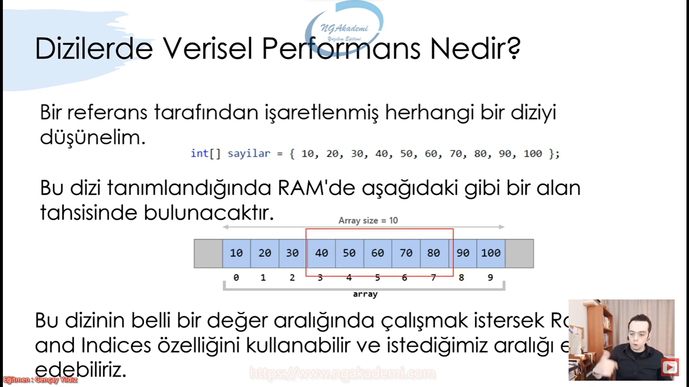
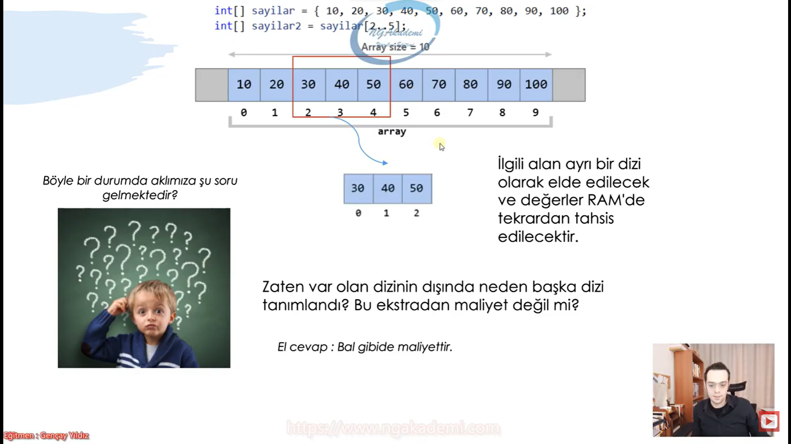
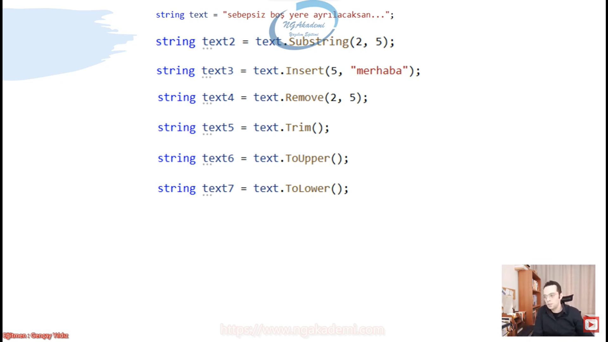
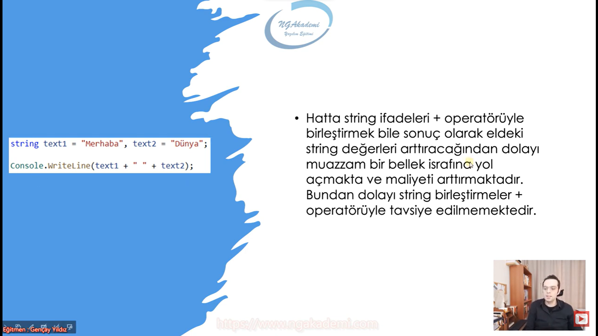
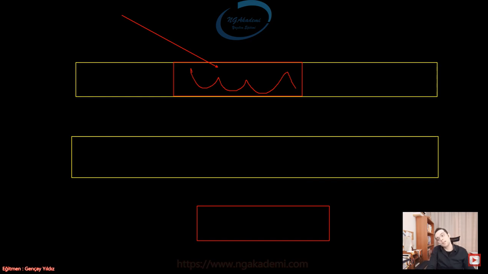
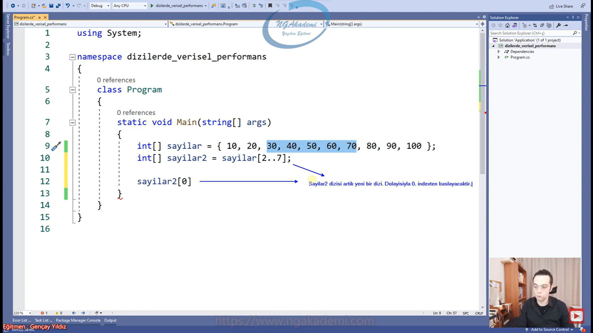
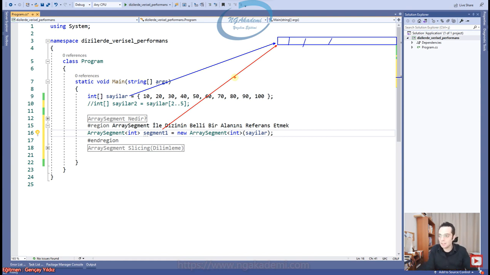
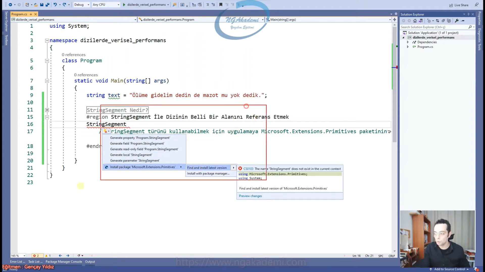

# 335) Dizilerde Verisel Performans Nedir?
- Dizilerin getirisi olduğu kadar götürüsü de olacaktır.

- Dizi dediğimiz yapılanmalar ne kadar efektif ne kadar birden fazla veriyi yönetmemizi sağlayan yapılar olsa da davranışsal olarak maliyetli yapılanmalardır.

- Bir yazılımcının bir işi de var olan maliyetleri minimize etmek onları ortadan kaldırmaktır. Elimizdeki dizileri daha hızlı daha kaynakları az tüketecek şekilde modifiye etmek bizim içinde yazılım içinde tercih edilir durum olacaktır.

- Bir referans tarafından işaretlenmiş herhangi bir diziyi düşünelim. Bu dizi tanımlandığında RAM'de bir alan tahsisinde bulunacaktır. Bu dizinin belli bir değer aralığında çalışmak istersek eğer Range and Indices özelliğini kullanabilir ve istediğimiz aralığı elde edebiliriz. İlgili alan ayrı bir dizi olarak elde edilecek ve değerler RAM'de tekrardan tahsis edilecektir.



- Öncelikle bir dizi hayal edelim diyelim ki elimizde sayılar diye dizimiz olsun. 
    * `int[] sayilar = {10,20,30,40,50,60,70,80,90,100}` Böyle bir diziyi biz tahayyül edersek bunun belleğe yansıması 0'dan 9'a kadar bütün elemanları sıralı bir şekilde bellekte tutacaktır.
    * `int[] sayilar2 = sayilar[2..5]` Eğer ki bu dizinin belirli bir değer aralığında çalışmak istersek eğer Range and Indices özelliğini kullandığımızı varsayarsak örneğin elimdeki sayilar dizisini Range and Indices özelliği ile 2. indexten 5 eleman alırsam eğer benim bu operatörü kullanmam yeterli.
    * Bu operatörü kullandığımda o alandakir değerleri alacak farklı bir dizi olarak RAM'de bunu tutacaktır. İlgili alan ayrı bir dizi olarak elde edilecek ve değerler RAM'de tekrardan tahsis edilecektir.
    * Nihayetinde burada varolan değerler tekrardan mükerrer bir şekilde RAM'de tutulacak yani varken biri daha var olacak yani bu klonlanacakda diyebilirsiniz kopyalanacakta diyebilirsiniz. Uzun lafın kısası varolan değer bir daha fazladan olmuş olacak. Yani bir maliyet söz konusu.
    * Zaten var olan dizinin dışında neden başka dizi tanımlandı? Bu ekstradan maliyet değil mi?
    * Dizilerde çalışırken dizinin belirli bir aralığını tarif etmek istediğinizde bu alan RAM'de yeniden tahsis edilir. ve ilgili değerler oraya kopyalanacaktır. Dolayısıyla bu bal gibi de maliyettir.
 


- Esasında diziler üzerinde işlem yapmak oldukça maliyetli olabilmektedir.

- Nihayetinde dizi dediğiniz yapılanma herhangi bir işlemde tekrar edebilen bir yapılanma olabiliyor.


- Çünkü dizi üzerinde bir alanı temsil etmek, esasında o alandaki verileri yeni bir diziye koyarak tekrar etmek demektir.

- Örneğin bir merdiven düşünün sadece belirli basamaklarında çalışmak istiyorsam ve orayı boyayacaksam şimdi ben gelip tekrardan bu basamaklardan yaparsam aynı mermerden/malzemeden alıp bir daha dizersem orayı boyarsam ne gerçeği boyanmış olacaktır ne de bu çok mantıklı hareket olacaktır. Bazen benim dizinin üzerindeki belirli elemanları çalışmam gerekirken onları kopyalamaktansa onları temsil etmem daha doğru olacaktır. Temsil ile kopylama arasında fark var. Kopyalama dediğin var olan bişeyi çoğaltmaktır. Ama temsil etmek demek aynı şeyi işaretlemek/göstermek demektir. Hangisi değişiklik yaparsa yapsın ikisi de o değişikliği görür/orjinale yansır anlamına gelir. O yüzden bizim amacımız dizileri kopyalamaktan ziyade diziler üzerinde işlem yaparken dizinin belirli alanını/aralığını temsil etmek yani varolan orjinal değerin üzerinde o aralığı temsil edebilirsek hem maliyetten kaçınmış oluruz hemde amacımıza daha net hizmet etmiş oluruz. Dolayısıyla bu maliyetin farkında olalım.


- Özellikle bu maliyetli durumlar `string` değerler için fazlasıyla geçerlidir.

- Çünkü `string` değerler için kullanılan `string` fonksiyonları arkaplanda sürekli yeni diziler oluşturmakta ve yüksek maliyetli olmaktadırlar.


- Hatta biz bunu `string` fonksiyonlarda ciddi manada kullanıyorduk. 

- Elimizde bir `string` değer olsun bu `string` değer üzerinde yapmış olduğumuz herhangi bir fonksiyonel işlem sonuç olarak geriye bir `string` döndürüyor. Şimdi `string` bir `char` dizisi değil mi? Özünde `char` dizisi olan değerin üzerinde bir işlem yaptığında sana orjinal veriyi değil yeni bir ürettiği veriyi gönderiyor yani o `char` dizisini yeniden klonluyor sana yapmış olduğu çalışmalarla beraber yenisini gönderiyor. Eskisi ne oldu eskisi duruyor yenisi ne oldu yenisi de duruyor. Eskiden 5 dönümlük arsamız varken şimdi 10 dönümlük arsamız var ama 5'i ekili. Baktığında çok maliyetli bir durum. İşte böyle maliyetler söz konusu olabilmekte dizilerle çalışırken



- Hatta `string` ifadeleri `+` operatörüyle birleştirmek bile sonuç olarak eldeki `string` değerleri arttıracağından dolayı muazzam bir bellek israfına yol açmakta ve maliyeti arttırmaktadır. Bundan dolayı `string` birleştirmeler `+` operatörüyle tavsiye edilmemektedir.

- Hatta dizilerde çalışmayı yaparken `+` operatörünü kullanmak arka planda durmadan mevcut diziyi daha doğrusu `string`i durmadan türetmek anlamına geliyor.



- İşte diziler üzerinde yapılan çalışmalarda bu maliyeti ortadan kaldırabilmek ve daha performanslı çalışabilmek için `ArraySegment` ve `StringSegment` türleri geliştirilmiştir.

- Bu maliyetler dizisel yapılanmalarda gayet normal/doğal/tabi. Çünkü elimizdeki dizinin çalıştığımız değer aralığını temsil değil çoğaltma stratejisini uygulamamız. Çoğalttığınız zaman elinizdekini orjinali değişmez orjinali yine aynı kalır ama çoğalttığınız üzerinde işlem yapmış olursunuz ya bu belki bir yöntemdir yeri geldiğinde doğrudur da ama genel anlamda bu şekilde çalışmak %100 maliyettir biz belirli noktalarda dizinin belirli noktasında belirli bir değer aralığında çalışmak istiyorsak o değer aralığını bizim temsil edebilmemiz klonlamadan/çoğaltmadan sadece o alanda çalışmamız gerekiyor.
    * Örneğin elinizde kumanda var kumandanın belirli tuşlarını üzerinde işlem yapacağım ben boyayacağım diyorsunuz. Şimdi şurada siz şunu yapmazsınız değil mi Bu kumandanın aynısından bir tane daha yeni bir kumanda klonlayıp/çoğaltıp/üretip o alanı boyayıp bu ürettiğin boyalı kumandayı al boyadım demezsin. Naparsın böyle bir talep geldiğinde alırsın normal kumandayı sadece o alanı boyanacak alanı referans edersin o alanı boyarsın orjinal veriyi geri gönderirsin. Bu daha az maliyetlidir ama bu ihtiyaca binaen böyle daha az maliyetlidir. Eğer ki adam derse modelimiz bu kumanda bunun belirli tuşlarını boyalı olan başka bir tane istiyorum derse türetmen lazım orada sıkıntı yok. Ama genellikle senaryotik olarak türetmemen gereken durumlarda da türettiğin için maliyet söz konusu oluyor. Türetmemen gereken durumda sadece referans etmek istiyorsan o alanı işte kullanman gereken türler `ArraySegment` ve `StringSegment` türleridir.

- `ArraySegment` ve `StringSegment` türleri bir dizinin üzerinde belirli alanları referans etmemizi birden fazla değişkenle referans etmemizi sağlayan özel türlerdir. Yapısal olarak bunlar `struct`tır.

- Dizilerdeki varolan tabiatında varolan maliyeti ortadan kaldırabilmek için `ArraySegment` ve `StringSegment` kullanılır. `ArraySegment` tüm dizilerde kullanılırken `StringSegment` bunu sadece `string` türdeki değerlerdeki olan karşılığı/muadilidir. Yani sen `string` üzerinde operasyon yaparken `StringSegment`i kullanacaksın diğer dizilerde operasyon yaparken `ArraySegment`i kullanacaksın. 


- Elimizdeki dizide belirli bir alan üzerinde çalışacaksak biz burayı referans edip çalışıyorsak orjinal veri üzerinde amaç bu. `ArraySegment` ya da `StringSegment` bunu yapmamızı sağlar. Eğer bunları kullanmıyorsanız elinizdeki dizi üzerinde belirli bir alanda çalışacaksanız bu elinizdeki diziyi bozmaksızın bunu o alanda çalışılmış halini ya da sadece o alanı sizlere getirecektir. Dolayısıyla bu da bahsettiğimiz maliyettir.



- Bu türler yapısal olarak dizi yahut `string` ifadelerdeki bir bölümü temsil etmemizi sağlayan ve bütünsel açıdan ilgili veri kümesini parça parça birden fazla referans eşliğinde yönetmemize imkan veren türlerdir.

- Elinde tek bir dizi var parça parça bunu parçalayabiliyorsun birden fazla referansla bunu bütün parçalarına referans edebiliyorsun ama tek bir dizi üzerinde bu şekilde çalışabiliyorsun. Amaçta budur.

- `ArraySegment` ve `StringSegment` türleri ile belirli alanı temsil edersiniz ama çoğaltmazsınız.

- Elimizde bir tane dizi var `ArraySegment` ile bu dizi üzerindeki belirli bir alanı temsil ettiğimizi varsayalım. Bu tür sayesinde bu türden değişkende yaptığım işlemler orjinal `Array`in üzeride gerçekleştirilmekte ekstradan bir türetme ekstradan bir alan tahsisi yapılmadığından dolayı gayet performanslı bir çalışma sergilenmektedir.


***
# 336) Dizilerde Verisel Açıdan Maliyetleri İnceleyelim
- `int[] sayilar = { 10, 20, 30, 40, 50, 60, 70, 80, 90, 100 };`
- `int[] sayilar2 = sayilar[2..7];`
    * Elimde bir dizi var o dizinin belirli bir değer aralığını temsil etmeyi istediğim bir başka dizi var. Ama dikkat bir başka dizi var çünkü bu operasyon ilgili diziden o aralığı istediğin aralığı sana bir başka dizi olarak bellekte farklı bir şekilde tahsiste bulunulmuş bir dizi olarak döndürecektir. Dolayısıyla bu bir verisel maliyettir. Çünkü buradaki maliyet bize yapısal olarak durum getiriyor
        + elimizdeki veriler bir iken çok oldu yani mükerrer olmaya başladı RAM'de alan tahsisi fazla olmaya başladı.
        + ikinci dizide yani çoğaltılan dizide tutulan değerler üzerinde yapılacak olan işlemler orjinal diziye yansımayacaktır. Bazen işlem yapmak isteyebiliriz ama orjinal dizide bu işlemler yansımayacağından dolayı bazen elimizdeki değerler ya da kullandığımız elimimizdeki diziler karışabilmekte.
        + Bu yeni dizi artık diğerinden bağımsızdır.
        + sayilar2 dizisi artık yeni bir dizi dolayısıyla 0. index'ten başlayacaktır.
        + Eğer ki bu sayilar2 dizisi klonlanmamış kopyalanmamış RAM'de yeni alan açılmamış olsaydı sayilar2 üzerinde yaptığım işlemler sayilar dizisinde de görünebilecekti.
        + Ya kardeşim sen temsil ettiğin alanda çalış temsil ettiğin alanı farklı bir şekilde RAM'de alan tahsisinde bulunmaksızın ilgili dizi üzerinde işlem yap Hani maliyete gerek yok biz sadece o alanda gerçekten şu verilerde çalışmak istiyoruz bunların kopyalarında türevlerinde değil demek istiyorsanız eğer `ArraySegment` kullanman gerekecektir. Benzer mantıkta bunu `string` varyasyonu da vardır.



- `string text = "laylaylom galiba sana göre sevmeler";`
    * Burada belirli bir değer aralığında çalışmak istiyorsan örneğin 'galiba' üzerinde işlem yapacaksan bu normalde text türetilecek ve üzerinde işlem yapılmış hali sana döndürelecektir. Amma velakin sen `string` olduğu için `StringSegment`te çalışırsan direkt bu dizinin bu nesnenin üzerindeki 'galiba'da ilgili işlemi yapabilirsin ve başka bir mükerrer kayda gerek duymadan bu işlemi yapabilirsin. Dolayısıyla biz `ArraySegment` ve `StringSegment` yapacağımız operasyonlarda temsil ettiğimiz alanda yapmış olduğumuz işlem direkt orjinal verilere yansıyacaktır.

```C#
int[] sayilar = { 10, 20, 30, 40, 50, 60, 70, 80, 90, 100 };
int[] sayilar2 = sayilar[2..7];

sayilar2[0] *= 10;
sayilar2[1] *= 10;
sayilar2[2] *= 10;
sayilar2[3] *= 10;
sayilar2[4] *= 10;

string text = "laylaylom galiba sana göre sevmeler";
```

***
# 337) ArraySegment Türü Nedir?
- Dizilerdeki maliyetli durumların kullanıldıklarında yeniden alan tahsisi yapmalarının ya da belirli alanları temsil ederken ilgili verilerin tekrar etmesinin mükerrer olmasının getirdiği maliyetleri ortadan kaldırabilmek ve bir dizinin sadece belirli bir alanını referans etmek kopyalamadan çalışabilmek için `ArraySegment` struct'ı kullanılabilmektedir.

- Bir dizinin bütününden ziyade belirli bir kısmına yahut parçasına ihtiyaç dahilinde ilgili diziyi kopyalamak yerine(ki görece oldukça maliyetli bir operasyondur) bağımsız bir referans ile erişmemizi ve böylece salt bir şekilde temsil etmemizi sağlayan bir yapıdır.`ArraySegment` dediğimiz yapılanma. Bunun muadili `StringSegment`tir.

- Dizilerde belirli bir alan temsil ederken onu kopyalamak ekstradan alan tahsisi ekstradan verilerin mükerrer etmesi vs. bir maliyet söz konusudur. Dolayısıyla kopyalamak yerine o alanı referans göstererek kullanmak daha iyi olacaktır.

- Bir dizinin bütününden ziyade belirli bir kısmına yahut belirli bir parçasına ihtiyaç dahilinde ulaşmamız gerekirse orayı biz normal davranış hani hiçbişey kullanmazsan `ArraySegment` falan kullanmazsan ve dilin getirdiği yapılanmaları ve fonksiyonları kullanırsan davranışsal olarak varsayılan orasını kopyalayacak, mükerrer kayıtlar oluşturacak ilgili RAM'de alan tahsisinde bulunacak ve maliyetli bir şekilde bizim çalışmamızı sağlayacaktır. Ama `ArraySegment` sana ilgili alanı ilgili dizinin üzerinde temsil edecek sen ilgili dizinin üzerinde işlem yapmanı sağlayabilecek bir türdür. İşte bu da bu şekilde maliyeti ortadan kaldırabilecek bir fıtrata sahiptir.

- Dizilerde belirli bir alanda çalışmak istediğimde bu değerleri tekrardan mükerrer bir şekilde RAM'de oluşturuyor. varsayılan davranış budur.

- `ArraySegment` sen elindeki dizi üzerinde belirli bir alanı o dizi üzerinden referans edebiliyorsun ve bunu yaptığında yapmış olduğun her işlem direkt o diziye yansımaktadır. Daha hızlı daha performanslı bir çalışma ortaya koyabilmektesin. Böyle bir çalışma elindeki RAM'ide elindeki işlemciyi de yani kaynakları daha az tüketeceğinden dolayı verilerinizi türetmemeniz gereken durumlarda kesinlikle göstermeniz gereken bir yaklaşımdır.

```C#
#ArraySegment Nedir?
//Bir dizinin bütününden ziyade belirli bir kısmına yahut parçasına ihtiyaç dahilinde ilgili diziyi kopyalamak yerine(ki görece oldukça maliyetli bir operasyondur) bağımsız bir referans ile erişmemizi ve 
böylece salt bir şekilde temsil etmemizi sağlayan bir yapıdır.
```

***
# 338) ArraySegment Türü İle Dizinin Belli Bir Alanını Referans Etmek
- `struct` bir nesne değil değer üretimi söz konusu olduğu için ilk önce değer üretmemiz gerekiyor. 

- `int[] sayilar = { 10, 20, 30, 40, 50, 60, 70, 80, 90, 100 };`
- `ArraySegment<int> segment1 = new ArraySegment<int>(sayilar); `
    * Burada sayilar dizisi var ve sayilar dizisini buradaki `ArraySegment`'in segment1 isimli referansıyla da referans etmiş oldum. Şu anda sayıları komple bu referansta segment1'de referans ediyor.
    * Şimdi bu diziye erişebilmem için sayilar var birde segment1 isimli bir referansım daha var. Sen bu dizinin üzerinde herhangi bir işlem yaptığında nasıl ki sayılardan o ilgili diziye eriştiğinde o değişiklikleri görebiliyorsan segment1'de de aynı şekilde aynı değişiklikleri görebileceksin. Çünkü ikisi de bellekte aynı diziyi tutmaktadırlar. Yani `ArraySegment` ilgili diziyi türetmez mükerrer bir şekilde verilerini çoğaltmaz
    * Burada herkes birbirini etkiler çünkü hepsi aynı merkez bir veriyi merkez bir diziyi kullanmaktadır. Bunlar sayesinde bir mükerrerlik yok. İşte daha maliyetsiz çalışmamızı sağlayan yapılanma bu yapılanmadır.



- Burada kaynaklar daha hafif düzeyde tüketilir. Bir yazılımcının yapması gerekeni yapıyoruz aslında çünkü benim burada ilgili değer aralıklarında çalışıken türetmeme mükerrer kayıt oluşturmama yeni alan tahsisinde bulunamama ne gerek var. Gerek varsa yap bunu kullanma ama gerek yoksa bunu kullan.

- `ArraySegment` elimizdeki dizisel veriler üzerinde ilgili dizinin belirli parçalarını farklı referanslarda temsil etmeni sağlayıp her bir parçada ayrı ayrı çalışmanı sağlayan ama bütünsel olarak tek bir dizide operasyonları gerçekleştirmeni sağlayan mümkün mertebe maliyeti azaltmış olan bir `struct`tır/yapıdır.

```C#
#ArraySegment İle Dizinin Belli Bir Alanını Referans Etmek
int[] sayilar = { 10, 20, 30, 40, 50, 60, 70, 80, 90, 100 };

ArraySegment<int> segment1 = new ArraySegment<int>(sayilar);//Dizinin tüm elemanlarını temsil eder.
ArraySegment<int> segment2 = new ArraySegment<int>(sayilar, 2, 5);

segment1[0] *= 10;
segment2[0] *= 10;
```

***
# 339) ArraySegment Slicing(Dilimleme) Özelliği
- `ArraySegment` her ne kadar dizilerdeki mükerrer kayıtların mükerrer tahsislerin maliyetini düşüren bir tür olsada kendi içerisinde ekstradan bizlere efektiflik sağlayan belirli işlemleri daha hızlı yapmamızı sağlayan bir türdür bir yapıdır.

- `ArraySegment` kendi içerisinde slicing/dilimleme desteğini getiren bir özelliktir. Elinizdeki herhangi bir diziyi siz belirli noktalarını farklı farklı türlerdeki `ArraySegment`lerle temsil etmek isteyebilirsiniz. Bunlar için farklı farklı segmentler oluşturup temsilinizi manuel bir şekilde yapabiliyorsunuz. Ya da ilgili diziyi tek bir `ArraySegment` ile temsil edip üzerine dilimlemeyi o `ArraySegment` üzerinden talep edebiliyorsunuz bu daha da hızlı çalışmanızı sağlıyor.

- Bir dizi üzerinde birden fazla parçada çalışılacaksa eğer her bir parçayı ayrı bir ArraySegment olarak tanımlayabiliriz. Bu tanımlamaların dışında diziyi tek bir ArraySegment ile referans edip ilgili parçaları o segment üzerinden talep edebiliriz . Yani ilgili diziyi tek bir segment üzerinden daha rahat bir şekilde parçalayabiliriz. Bu durumda bize yazılımsal açıdan yani kodun gelişimi açısından efektiflik kazandırmış olacaktır.

- Fonksiyonlarda geriye dönecek değeri biz kendimiz tanımlıyoruz.

- Bu şekilde yapılan çalışmalarda belirli değer aralıklarını elimizdeki ana diziyi tutan ana diziyi referans eden `ArraySegment` üzerinden dilimleyerek gerçekleştirebiliyorsunuz. `Slice` fonksiyonunu kullanmak kod maliyeti açısından da daha kolay olmuş olacaktır.

```C#
#ArraySegment Slicing(Dilimleme)
int[] sayilar = { 10, 20, 30, 40, 50, 60, 70, 80, 90, 100 };

//Bir dizi üzerinde birden fazla parçada çalışılacaksa eğer her bir parçayı ayrı bir ArraySegment olarak tanımlayabiliriz. Bu tanımlamaların dışında diziyi tek bir ArraySegment ile 
referans edip ilgili parçaları o segment üzerinden talep edebiliriz . Yani ilgili diziyi tek bir segment üzerinden daha rahat bir şekilde parçalayabiliriz. Bu durumda bize yazılımsal 
açıdan yani kodun gelişimi açısından efektiflik kazandırmış olacaktır.

ArraySegment<int> segment = new ArraySegment<int>(sayilar);
ArraySegment<int> segment1 = segment.Slice(0, 3);
ArraySegment<int> segment2 = segment.Slice(4, 7);
ArraySegment<int> segment3 = segment.Slice(5, 10);
```

***
# 340) StringSegment Türü Nedir?
- Dizisel işlemlerde performansı arttırabilmek için bir diğer türümüz `StringSegment` türüdür.

- `StringSegment` `ArraySegment`in `string` değerler nezdindeki bir muadilidir.

- Yapısal olarak `string` `char` dizisi kökenli olan `string` türleri üzerinde performans odaklı çalışmalar yapmak istiyorsak `StringSegment`i kullanacağız.

- `string` bir `char` dizisidir kökende ama `char` dizisinde olmayan fonksiyonlara sahiptir. Örneğin `Substring`, `Index` diyip araya bir değer sokabiliyorsunuz. Her ne kadar fıtrat olarak bir dizi olsa da yapısal olarak kendisine ait fonksiyonlar barındırdığı için ve bu fonksiyonlar arkada davranışsal olarak yine maliyetli çalıştığı için biz `ArraySegment`le bu fonksiyonlara karşılık maliyeti absorve edemiyoruz. O zaman adamlar demişlerki ya kardeşim `string` kendine özel bir tür o zaman biz arkada ne kadar `char` dizisi kullansa da oradaki maliyeti düşürmek için `string`e özel bir `StringSegment` oluşturalım oradaki maliyeti oradan yönetsinler demişler.

- `StringSegment` dediğimiz yapı `ArraySegment`in sadece `string` değerler üzerindki muadili. Esasındaki metinsel değerlerdeki birçok analitik operasyondan bizleri kurtaran `Substring` gibi vs bunun gibi fonksiyonlar yerine  `string` değerlerde hedef kesit olan nokta üzerinde maliyetsiz işlem yapmamızı sağlayan bir türdür.

- Esasında metinsel değerlerdeki birçok analitik operasyonlardan bizleri kurtarmakta ve `Substring` vs. gibi fonksiyonlar yerine `string` değerde hedef kesit üzerinde işlem yapmamızı sağlayan bir türdür.

- Şimdi bir cümlede belirli bir noktada çalışmak istiyorsam ben bunu `Substring` ile aldığımda `Substring` bunu alıyor klonluyor/çoğaltıyor yeniden bellekte bir değer haline getiriyor bunu mükerrer hale getirip bana getiriyor. Dolayısıyla ben bu cümlenin üzerinde `Substring`le ya da `string` fonksiyonlarının herhangi biriyle işlem yaptığımda bana dönen sonuç orjinal verideki sonuç olmuyor. Çünkü bu veri başka bir veri oluyor. orjinal veri bambaşka bir veri olarak bellekte bambaşka bir şekilde alan tahsisi yapılmış veri olarak geliyor. Normal dizilerdeki davranışı sergiliyor.

- Bu davranışta belirli bir noktaya sadece o noktaya çalışmak o noktayı referans etmek istiyorsam bunu `StringSegment` ile çok rahat bir şekilde gerçekleştirebilirim.

- `StringSegment` `Substring`in yerine daha hızlı daha az maliyetli çalışma sergileyen ve diğer `string` fonksiyonlarına nazaranda performansı arttıran bir türdür.

```C#
string text = "Ölüme gidelim dedin de mazot mu yok dedik.";

#StringSegment Nedir?
//`StringSegment` `ArraySegment`in `string` değerler nezdindeki bir muadilidir.
//Esasında metinsel değerlerdeki birçok analitik operasyonlardan bizleri kurtarmakta ve `Substring` vs. gibi fonksiyonlar yerine `string` değerde hedef kesit üzerinde işlem yapmamızı 
sağlayan bir türdür.
```

***
# 341) StringSegment Türü İle Dizinin Belli Bir Alanını Referans Etmek
- `StringSegmet`i direkt kullanmaya çalıştığımızda kullanamamaktayız. Biz `StringSegment`i kullanabilmek için uygulamada Microsoft.Extensions.Primitives isimli bir paketi yüklememiz gerekiyor.

- `StringSegment` türünü kullanabilmek için uygulamaya Microsoft.Extensions.Primitives paketinin yüklenmesi gerekmektedir.

- Paket belirli bir işe odaklanmış kodlar bütünüdür.

- `using`te hangi paket varsa onun içerisindeki kodları kullanmanı sağlıyor.



- Yine konseptimiz `struct` olduğundan dolayı değer üretme üstüne kurulu.

- `StringSegment`te aynı şekilde verilen `string` değerle aynı yeri işaret eder/gösterir.

- Belirli bir aralığın üzerinde de çalışabilirsin.

- `string` ifadelerin üzerinde belirli bir aralığın üstünde çalışmak istiyorsak `Substring` ile çekerek çalışıyorduk. Gelişmiş performansa odaklı bellek optimizasyonu yapılan kodlarda `Substring` olsun ve diğer fonksiyonlar olsun bunlar kullanılmaz `StringSegment` gibi noktalara temas edebilen hani performans açısından bellek optimizasyonu açısından o noktalara temas edebilen fonksiyonlar/yapılar kullanılır. 

- Dolayısıyla biz burada `Substring` yerine `StringSegment` kullanıyorsam yeni bir değer üretilmeyecek var olan değerin üzerinde ilgili alanı temsil edilecektir. İşte bu da bana yüksek bir performans kazandıracaktır.

- `StringSegment` ileri düzey programlama da göreceğimiz implicit dediğimiz bir tür dönüşümü var yani derinlemesine ileri düzey bir tür dönüşüm yapılanması. Dolayısıyla burada `StringSegment` esasında direkt `string`e dönüştürülebiliyor. Bu yüzden istediğim yerde çağırıp kullanabilirim.

- Maliyeti düşürmekte performansı arttırmış olmaktayız.

```C#
string text = "Ölüme gidelim dedin de mazot mu yok dedik.";

#StringSegment İle Dizinin Belli Bir Alanını Referans Etmek 
//`StringSegment` türünü kullanabilmek için uygulamaya Microsoft.Extensions.Primitives paketinin yüklenmesi gerekmektedir.
StringSegment segment = new StringSegment(text);
StringSegment segment1 = new StringSegment(text, 2, 5);
System.Console.WriteLine(segment1);
```

***
# 342) StringBuilder Sınıfı Nedir? Ne Amaçla Kullanılır?
- Dizilerde çalışma yaptığımız operasyonlar bizler için maliyetli olabiliyor. Aynı şekilde `string`te bir dizi olduğundan dolayı `string`in üzerinde yapılan bütün işlemler ekstradan da maliyetli olmakta. Dolayısıyla biz genellikle yazmış olduğumuz yazılımlarda `string` operasyonlarında `+` operatörünü kullanarak `string` birleştirmeyi çok fazla yaparız ve buradaki maliyeti göz ardı ederiz.

- Elimizde makul sayıda değişken varsa bunları `string` olarak birleştirmek istiyorsanız String Interpolation ya da `string.Format`ı kullanabilirsiniz ya da daha da kolayca hızlı bir şekilde `+` operatörünü kullanabilirsiniz. Ama buradaki değişken/değer/parametre sayısı yani `string` birleştirilecek ifadelerin sayısı adedi artıyorsa artık makul değilse haddinden fazlaysa buna bir sınır koyamayız belki ama 5'i buluyorsa örneğin artık buradaki maliyeti göz ardı etmeniz sizin için kazançlı olmayacaktır. Çünkü hadi 5 değeri 15 olsun ciddi bir maliyet söz konusu olacaktır. Kaynakları ciddi bir şekilde tüketeceksiniz. Böyle bir durumda biz kaynakları ciddi manada tüketmemek için `StringSegment`le bu operasyonları gerçekleştirmek isteriz. İşte `StringBuilder` diyor ki bana kardeşim ben arka planda `StringSegment` algoritmasını kullanıyorum yani `StringSegment`i kullanıyorum ve kullandığım bu operasyon bu türle senin istediğin operasyonu hızlı bir şekilde maliyeti düşürülmüş ve performansı arttıracak bir şekilde gerçekleştiriyorum. Dolayısıyla sen gel bunu kullan `+` operatörünü kullanacağına birkaç satır fazla kod yaz ama `StringBuilder`ı kullan demiş oluyor.

- `StringBuilder` `string` birleştirme operasyonlarında `+` operatörüne nazaran yüksek maliyeti absorbe edebilmek için arka planda `StringSegment` algoritmasını kullanan ve bu algoritma ile bizlere ilgili değerleri olabilecek ennn az maliyetle birleştirip döndüren bir sınıftır.

- Makul bir sayıyı geçtikten sonra `StringBuilder`ı kullanmamız yazılımımız açısından daha performanslı daha tercih edilir olacaktır. Bunun sebebi de `StringBuilder`ın arka planda `StringSegment`i kullanmasıdır.

- `Append` diye fonksiyonumuz var. Birleştirme yapılacak tüm `+` operatörü yerine `Append`la birleştirme yapılacak değerleri kattığımız/işleme tabi tuttuğumuz bir fonksiyon. Her bir `+` operatörü yerine bu fonksiyonu kullanmanız buradaki maliyeti minimize edecektir.

- `StringBuilder` `string` formatlandırma operasyonlarında olabilecek maliyeti minimize etmek için kullandığımız hazır bir sınıftır/türdür.

```C#
#StringBuilder Sınıfı
//`StringBuilder` `string` birleştirme operasyonlarında `+` operatörüne nazaran yüksek maliyeti absorbe edebilmek için arka planda `StringSegment` algoritmasını 
kullanan ve bu algoritma ile bizlere ilgili değerleri olabilecek ennn az maliyetle birleştirip döndüren bir sınıftır.
string isim = "Musa";
string soyisim = "Uyumaz";
System.Console.WriteLine(isim + soyisim);

StringBuilder builder = new StringBuilder();
builder.Append(isim);
builder.Append(" ");
builder.Append(soyisim);
System.Console.WriteLine(builder.ToString());
```