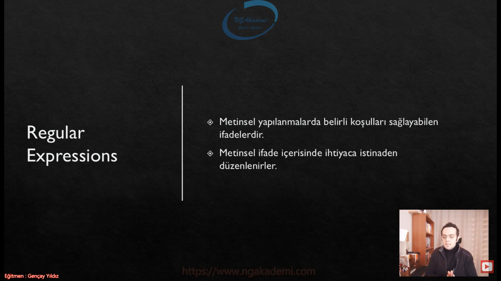
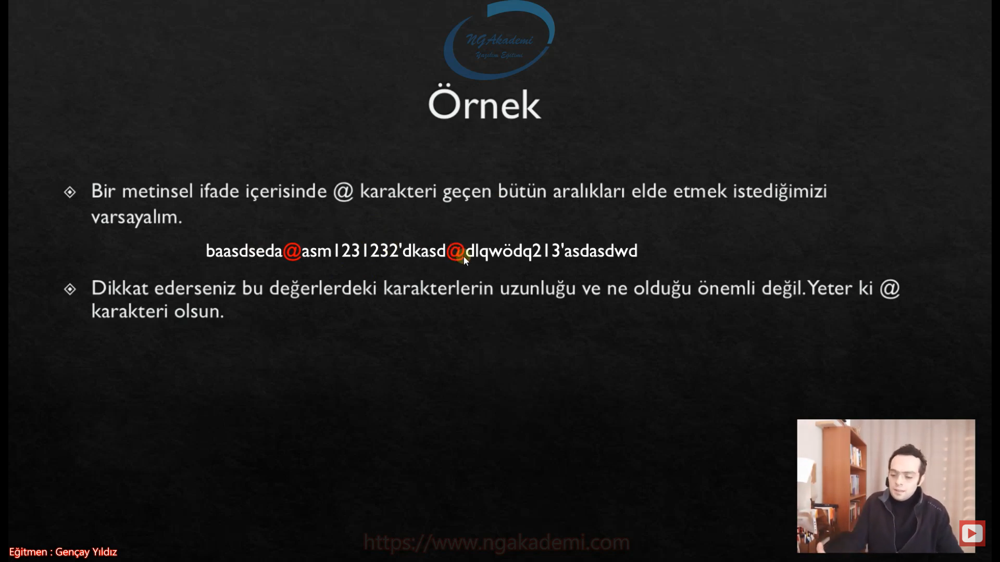
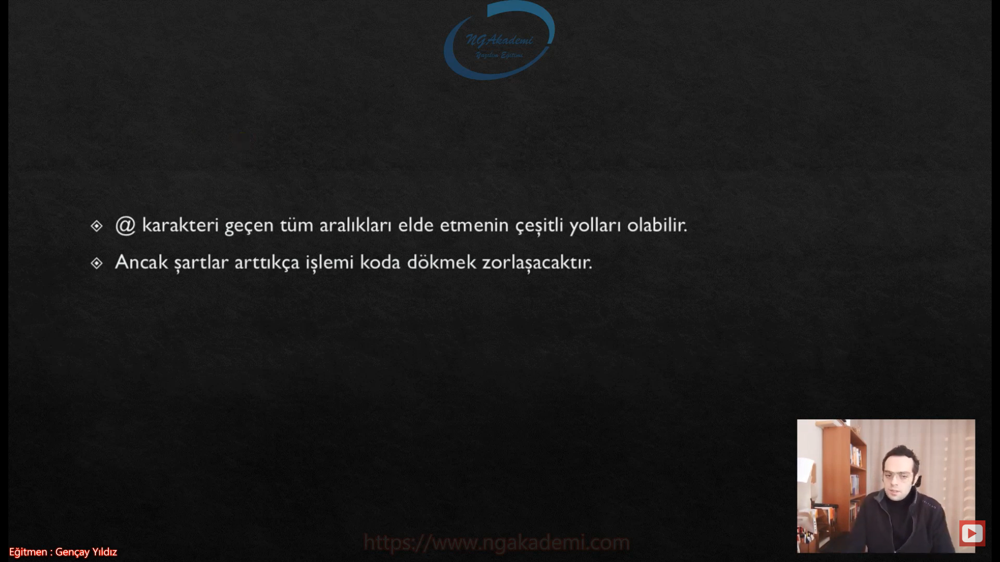
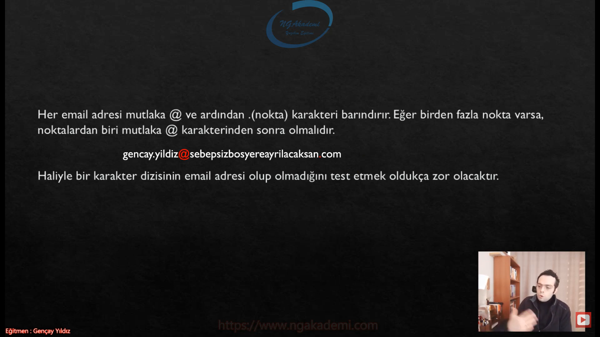
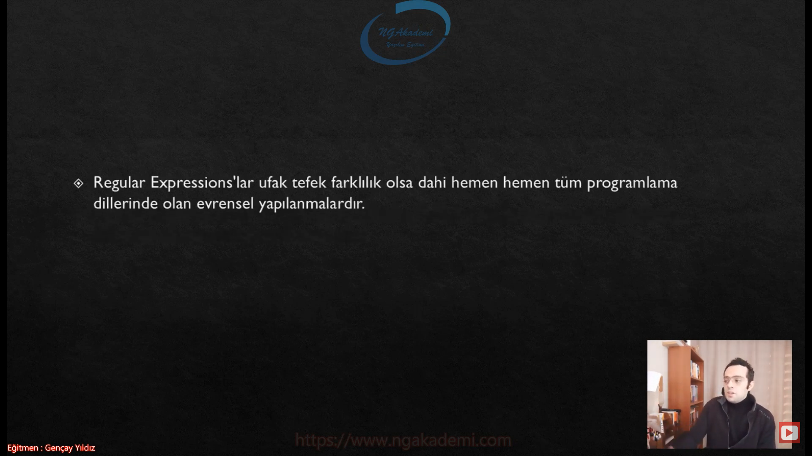
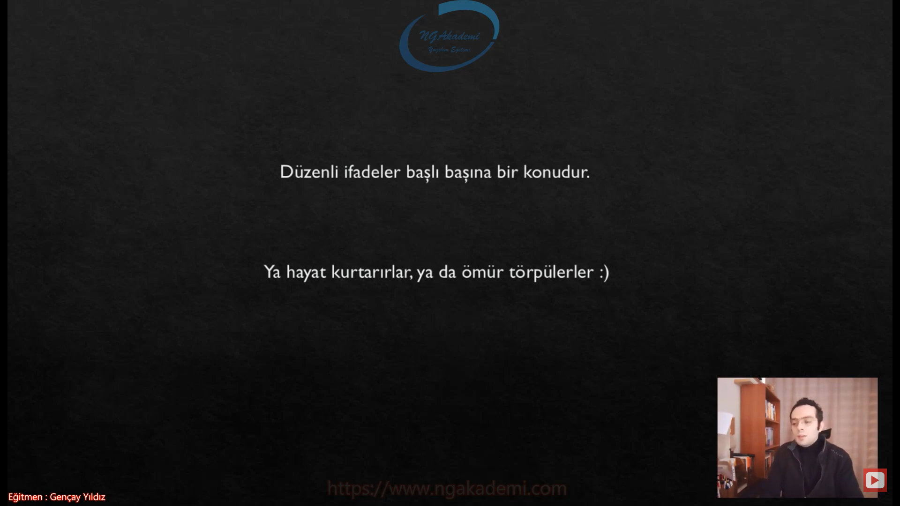

***
# 345) Regular Expressions(Düzenli İfadelerde) Neyin Nesi?
- Metinsel ifadeler üzerinde periyodik ve düzenli operasyonlar gerçekleştirmemizi sağlayan Regular Expression'ı inceleyeceğiz.

- Metinsel ifadeler içerisinde belirli pattern'lar uygulamamızı sağlayan bir yapılanma kazandırıyor bizlere.

- Biz metinsel ifadelerin içerisinde Regular Expression'ları kullanmadan operasyonlar algoritmalar yaptık bunlara tecrübelerimizle vakıf olabildik bunun zahmetinin ne olduğunu bildiysek artık Regular Expression'ları daha rahat anlayabiliriz.


- Metinsel yapılanmalarda belirli koşulları sağlayabilen ifadelerdir. Yani senin elinde bir metin var bu metinin içinde bir pattern uygulayacaksan bir metinsel koşul sağlayacaksan bir koşullu yapılanma oluşacaksa bunu Regular Expression ile çok rahat bir şekilde ifade edebilmektesin.

- Metinsel ifadenin içerisinde ihtiyaca istinaden düzenlenirler.



- Bir metinsel ifade içerisinde @ karakteri geçen bütün aralıkları elde etmek istediğimizi varsayalım. Elime bir metinsel ifade gelecek gelecek olan bu ifadenin içerisinde bana gönderen adam dedi ki ya kardeşim sen @ karakteri geçen bütün ifadelerin aralıklarını bana ayrı ayrı ayır. Bu karakterlerin aralığına düşen karakterleri ben dizi olarak yollayabilirim. Farketmiyor benim burada @ karakterini ayraç olarak görmem gerekiyor. İşte böyle bir durumda buradaki düzenimiz ne bizim metinsel ifadenin içerisindeki @ karakterleri bizim için bir düzen oluyor.

- Dikkat ederseniz bu değerlerdeki karakterlerin uzunluğu ne ve ne olduğu önemli değil Yeter ki @ karakteri olsun. Bu tarz yapılanmalar metinsel ifadelerde formatlandırma operasyonlarında kullanılıyor.




- @ karakteri geçen tüm aralıkları elde etmenin çeşitli yolları olabilir.

- Döngüye girersin girdikten sonra tek tek bütün karakterleri incelersin @ karakterimi değilse aralığa kadar alırsın @ karakteri olduğu anda da o aralığa kadar bütün değerleri tek bir birim olarak alır bir yerde depolarsın.

- Ancak şartlar arttıkça işlemi koda dökmek zorlaşacaktır.



- Buradaki örnek olay çok basit. ya daha kompleks bişey olursa...

- Milyonlarca email adresinin olduğunu düşünelim Biliyoruz ki tek bir email formatı vardır. `---@---.---`

- Burada bizim için önemli olan tek bir format üzerinden elimizdeki verilerin Email olup olmadığını değerlendirmek.

- Şimdi ben elimdeki verilerin email formatında olup olmadığını değerlendirmek istiyorsam ve bunu geleneksel programlama anlayışıyla yapıyorsam döngülerle vs. biz bu işin içerisinden çıkamayız. Biz bu işin içinden çıksakta işlemcimiz çıkamaz. Bu kadar yüksek bir veriyi milyonlarca veriyi kod seviyesinde değerlendirmek inanılmaz maliyetli olacaktır.


- Her email adresi mutlaka @ ve ardından .(nokta) karakteri barındırır. Eğer birden fazla nokta varsa, noktalardan biri mutlaka @ karakterinden sonra olmalıdır.

- Her bir email'de `string` bir veri olsa dahi bir iskelet var bir düzen var işte bu düzen bizim tarafımızdan bellidir ama elimize gelecek olan değerde kesin değildir. İşte bu kesinliği sağlayabilmek için biz bunu normal programlama yaklaşımlarıyla döngülerle sağlamaya çalışırsak inanılmaz derece de maliyetli olacak.

- Haliyle bir karakter dizisinin email adresi olup olmadığını test etmek oldukça zor olacaktır.

- Bu tarz algoritmalarla zorluk seviyesi yüksek olan metinsel ifadelerdeki füzeni kavrayabilme operasyonlarını biz normal algoritmalarla değil Regular Expression'larla sağlıyoruz.



## Regex
- Bu yüzden C#'ta bu tür düzenli ifadeleri temsil edebilmek için Regular Expressions operatörleri geliştirilmiştir.

- Sen normal döngülerle kendi algoritmalarınla özel yapmış olduğun matematiğinle vs. bir şekilde hesaplarsın onda şüphe yok ama bunda hem senin vermiş olduğun zahmet hemde bir yandan programlama dilinde kod seviyesinde yapmış olduğun operasyonun getireceği teknik maliyet inanılmaz derecede ortada bir sıkıntı yaratacak bir maliyet performans kaybı yaşatacaktır. Durduk yere maliyet oluşturacak ne gerek var. İşte bu tarz durumlarda biz elimizdeki metinsel ifadenin aralıklarıyla değerleriyle hiç uğraşmaksızın oradaki pattern'ı Regular Expression dediğimiz yapılarla çok rahat temsil edebilmekteyiz.

- Bu operatörler eşliğinde elde edilen verinin tasarlanan metinsel düzene uyup uymadığı değerlendirilebilmektedir.

- Regular ifadeler System.Text.RegularExpressions namespace'i altındaki `Regex` sınıfı tarafından temsil edilmektedir.

- Yani sen bir metinsel ifadenin herhangi bir düzene/patterna/düzenli ifadeye oradaki şablona uyup uymadığını temsil etmek istiyorsan buradaki temsiliyeti yapacak olan sınıf `Regex` sınıfıdır.


- Bu sınıf üzerinden biz gerekli temsiliyeti sağlar elimizdeki değer buradaki formata uyuyor mu uymuyor mu check edebiliriz.

- Regular Expressions'lar ufak tefek farklılık olsa dahi hemen hemen tüm programlama dillerinde olan evrensel yapılanmalardır. 



- Düzenli ifadeler başlı başına bir konudur. Ya hayat kurtarırlar, ya da ömür törpülerler :)

- Nihayetinde sen bir düzen sağlayacağım derken aslında işin detayına girdiğinde bayaa kompleks operatörlerle bir format oluşturmaya çalışacaksın eğer başarabiliyorsan ne ala ama başaramıyorsanda birazcık dirsek çürütmene saç dökmene sebep olabilir.

- Piyasada birçok yazılımcı Regular Expressions'ları kullanmamış olabilir metinsel ifadeleri içlerindeki belirli tekrarları ya da patternları yakalayabilmek için kod seviyesinde çalışmayı tercih edebilir ama bununla tanışan yazılımcı bundan da vazgeçemez



***
# 346) Regular Expressions Operatörleri ^ Operatörü, Regex Sınıfının Kullanımı
- Elimizde bir metin var ve bu metin üzerinde belirli formatlandırma yani bir pattern uygulamamız gerekiyorsa bunu da Regular Expressions'larla sağlayacaksak bizlere ilgili konunun getirmiş olduğu operatörlerden istifade etmemiz gerekmektedir.

- Eğer ki bir kurallı metinsel ifade oluşturmak istiyorsanız ve o ifadenin satır başında herhangi bir değerle ifadeyle başlanmasını istiyorsanız `^` operatörünü kullanabilirsiniz.

- `^` Operatörü : Satır başının istenilen ifadeyle başlamasını sağlar.

- `^9`: Bu şekilde bir ifade de bulunuyorsanız eğer yazı 9 ile başlamalı. Yazı ne olursa olsun 9 ile başlamalı. 9 ile başlamıyorsa buradaki Regular Expressions'larda check etme durumu başarısızlıkla sonuçlanacaktır.
    * Sana verilecek metin kesinlikle 9 ile başlamalı eğer 9 ile başlamıyorsa sen ona onay verme.
    * Uygun : 9asfafdas, 9414156, 9''!3123
    * Uygun Değil : asfasfsaf, 123, 1239, 0912312

- biz bir değeri check etmek için `Match` fonksiyonunu kullanırız. `Match` fonksiyonuna verdiğiniz değeri Regex'in içindeki pattern ne ise sen bu pattern üzerinden pattern'ı .çağırdığında vermiş olduğun metinsel değer her ne ise check edilecek ve diyecek ki pattern'a bu değer uygundur ya da değildir. Sonuç olarak'ta `Match` isimli bir sınıfı döndürür.

- `Match.Success` property'si eğer ki vermiş olduğun değer uygun ise `true` değilse `false` dönecektir.

- `Regex regex = new Regex("^91");`//Burada değer 91 ile başlamalı eğer başlamıyorsa `false` dönecektir.
    * Regex'e yazılan karakterlerde kompozitlik vardır bütün karakterleri bir bütün olarak alır.

```C#
#Regular Expressions Operators
//`^` Operatörü : Satır başının istenilen ifadeyle başlamasını sağlar.

//^9 : 
//Uygun : 9asfafdas, 9414156, 9''!3123, 
//Uygun değil : asfasfsaf, 123, 1239, 0912312

string text = "9212347123asadgagfakmgag";
Regex regex = new Regex("^91");//Burada değer 91 ile başlamalı eğer başlamıyorsa `false` dönecektir.
Match match = regex.Match(text);
System.Console.WriteLine(match.Success);
```

***
# 347) Regular Expressions Operatörleri \ Operatörü
- Bu operatör mahiyet açısından kullanıldığı noktada yani ilgili metinsel ifade de kullanıldığı noktada belirtilen karakter gruplarını içermesini istiyorsak kullanılan bir operatördür.

- Elimizde bir metinsel ifade olduğunu düşünelim ve bu metinsel ifadenin belirli bir noktasında alfanümerik olan ya da olmayan değerlerin kullanılmasını istiyorsam veyahut sadece rakamların kullanılmasını istiyorsam ya da rakamın dışında farklı değerlerin alfanümerik ya da değil kullanılmasını istiyorsam bunun gibi patternlar uygulamabilmek için kullandığımız bir operatördür.

- `\` : Belirli karakter gruplarını içermesini istiyorsak kullanırız.

- `\` tek başına kullanılmaz yanına aldığı parametrelerle asıl davranışını şekillendirir.

- `\`  : Belirli karakter gruplarını içermesini istiyorsak kullanırız.

- `\D` : Metinsel değerlerin ilgili yerinde rakam olmayan tek bir karakterin bulunması gerektiği belirtilir
    * Elindeki metinsel ifadede bildirdiğin noktada rakam olmayan tek bir karakterin bulunmasını istiyorsan kullanılır.
- `\d` : Metinsel değerlerin ilgili yerinde 0 - 9 arasında tek bir sayı olacağı ifade edilir.
    * Yok eğer elindeki metinsel ifadenin belirtilen noktasında sadece rakam olan tek bir değerin olmasını istiyorsan kullanılır.

- `\W` : Metinsel değerin ilgili yerinde alfanümerik olmayan karakterin olması gerektiğini bildirir. Alfanümerik karakterler :  a-z A-Z 0-9
    * `!`,` `, `?` gibi karakterlerin kullanılmasını istiyorsanız ilgili yerde kullanabilirsiniz.
- `\w` : Metinsel değerin ilgili yerinde alfanümerik olan karakterin olacağı ifade edilir.
    * `!`,` `, `?` gibi karakterlerin kullanılmasını istemiyorsanız ilgili yerde kullanabilirsiniz.

- `\S` : Metinsel değerin ilgili yerinde boşluk karakterleri(tab/space) dışında herhangi bir karakterin olamayacağı belirtilir.
    * Metinsel değerin ilgili alanında boşluk karakteri olmayacak diyorsanız kullanabilirsiniz.
- `\s` : Metinsel değerin ilgili yerinde sadece boşluk karakterinin olacağı ifade edilir.
    * Metinsel değerin ilgili alanında sadece boşluk karakteri olacak diyorsanız kullanabilirsiniz.

```C#
#Regular Expressions Operators
#\ Operatörü
// \  : Belirli karakter gruplarını içermesini istiyorsak kullanırız.
// \D : Metinsel değerlerin ilgili yerinde rakam olmayan tek bir karakterin bulunması gerektiği belirtilir
// \d : Metinsel değerlerin ilgili yerinde 0 - 9 arasında tek bir sayı olacağı ifade edilir.
// \W : Metinsel değerin ilgili yerinde alfanümerik olmayan karakterin olması gerektiğini bildirir. Alfanümerik karakterler :  a-z A-Z 0-9
// \w : Metinsel değerin ilgili yerinde alfanümerik olan karakterin olacağı ifade edilir.
// \S : Metinsel değerin ilgili yerinde boşluk karakterleri(tab/space) dışında herhangi bir karakterin olabileceği belirtilir.
// \s : Metinsel değerin ilgili yerinde sadece boşluk karakterinin olacağı ifade edilir.
//Örn;
//9 ile başlayan 2. karakteri herhangi bir sayı olan ve son karakteri de boşluk olmayan bir düzenli ifade oluşturalım.
//^9\d\S
string text = "94 54131563415sfasfasdfasfsafasf";
Regex regex = new Regex(@"^9\d\S");
Match match = regex.Match(text);
System.Console.WriteLine(match.Success);
```

***
# 348) Regular Expressions Operatörleri + Operatörü
- `+` operatörü kesinlikle aritmetik operatör olarak algılanmamalı bu operatör Regular Expressions operasyonlarında belirtilen gruptaki karakterlerden 1 ya da daha fazlasının olmasını istediğimiz durumda kullanılan bir operatördür.

- Belirtilen gruptaki o grubun kullanıldığı alanda bir ya da daha fazla birden fazla olmasını istediğimiz durumlarda `+` operatörünü kullanıyoruz.

- 9 ile başlayan 2. karakteri herhangi bir sayı olan ve son karakteri de boşluk olmayan bir düzenli ifade oluşturalım.
- `^9\d\S` Burada sıra önemliydi çünkü direkt sıraya atıfta bulunuyordu. Haliyle ben burada normal şartlarda grupları kullanıyorsam eğer karakter bazlı yani hane bazlı kullanmış oluyorum.

- `+` operatörü ilgili grubun birden fazla kullanılabilme ihtimalinde kullandığımız bir operatördür.

```C#
#Regular Expressions Operators
#+ Operatörü
//Belirtilen gruptaki karakterlerden bir ya da daha fazlasının olmasını istiyorsak kullanılan operatördür.
//9 ile başlayan arada herhangi bir sayısal değerleri olan ve son karakteri de boşluk olmayan bir düzenli ifade oluşturalım.
//^9\d+\S

// string text = "1987454511d";false
// string text = "9a7454511d";false
// string text = "9874a54511d";true
// string text = "9874 54511d";true
// string text = "98 54511d";false
string text = "98 54511d";
Regex regex = new Regex(@"^9\d+\S");
Match match = regex.Match(text);
System.Console.WriteLine(match.Success);
```

***
# 349) Regular Expressions Operatörleri |(veya) Operatörü
- Birden fazla karakter grubundan bir ya da birkaçının ilgili yerde olabileceğini belirtmek istiyorsak mantıksal veya operatörü kullanılır.

- Elimizdeki metinsel ifadenin belirli noktasında birden fazla karakterin kullanılabilme durumu söz konusuysa eğer bunu `|` operatörü ile izah edebilmekteyiz.

```C#
#| Operatörü
//Birden fazla karakter grubundan bir ya da birkaçının ilgili yerde olabileceğini belirtmek istiyorsak mantıksal veya operatörü kullanılır.
//Baş harfi a ya da b ya da c olan metinsel ifadeyi girelim
//a|b|c
string text = "ahmet";
Regex regex = new Regex(@"^a|^b|^c");
Match match = regex.Match(text);
System.Console.WriteLine(match.Success);
```

***
# 350) Regular Expressions Operatörleri {n} Operatörü
- Elimizdeki metinsel ifadelerin belirli noktalarında sabit sayıda karakterin olmasını garanti altına alabilmekteyiz. bunun için `{}` operatörünü kullanmaktayız.

- Sabit sayıda karakterin olması isteniyorsa {adet} şeklinde belirtilmeli.

```C#
#Regular Expressions Operators
#{n} Operatörü
//Sabit sayıda karakterin olması isteniyorsa {adet} şeklinde belirtilmeli.

//555-5555555
//\d{3}-\d{6}

string text = "555-5555555";
Regex regex = new Regex(@"\d{3}-\d{7}$");
Match match = regex.Match(text);
System.Console.WriteLine(match.Success);
```

***
# 351) Regular Expressions Operatörleri ? Operatörü
- Bazen bizler metinsel ifadelerin içerisinde belirli karakterlerin yalnızca bir kere yahut hiç kullanılmamasını tercih edebilmekteyiz. İşte böyle bir durumu izah edebilmek için `?` operatörünü kullanmaktayız. `?` operatörü işlevsel açıdan önüne gelen karakterin en fazla 1 en az 0 defa olabileceğini ifade etmektedir.

- Bu karakterin önüne gelen karakter en fazla bir en az sıfır defa olabilmektedir.

```C#
#Regular Expressions Operators
#? Operatörü
//Bu karakterin önüne gelen karakter en fazla bir en az sıfır defa olabilmektedir.

//\d{3}B?A
//234BA, true
//543BA, true
//543A,  true 
//123BBA false

string text = "234BA";//true
string text = "123BBA";//false
Regex regex = new Regex(@"\d{3}B?A");
Match match = regex.Match(text);
System.Console.WriteLine(match.Success);
```

***
# 352) Regular Expressions Operatörleri . Operatörü
- İlgili yerde alfanümerik olan ya da olmayan herhangi bir karakterin kullanılabileceğini ifade edebilmekteyiz.

- `\n` karakteri dışında herhangi bir karakteri ifade etmek istiyorsanız `.` operatörünü kullanabilirsiniz.

- `\n` : Kullanıldığı yerde `\n` karakteri dışında herhangi bir karakter bulunabilir

```C#
#Regular Expressions Operators
#. Operatörü
//`\n` : Kullanıldığı yerde `\n` karakteri dışında herhangi bir karakter bulunabilir

//\d{3}.A

string text = "123'A";
string text = @"123\nA";
Regex regex = new Regex(@"\d{3}.A");
Match match = regex.Match(text);
System.Console.WriteLine(match.Success);
```

***
# 353) Regular Expressions Operatörleri \b - \B Operatörleri
- `\` operatöründe hep böyle gruplamalar bir büyük bir küçük harf olacak şekilde belirtiliyor. Büyük harfler olumsuzluğu ifade ederken küçük harfler tam tersi olumlu aralığı ifade eder.

- `\B` ya da `\b` sonunda ya da başlangıcında ilgili ifadenin ne şekilde ifade/değer barındıracağını bildiren bir operatördür.

- \B: Bu ifade ile kelimenin başında ya da sonunda olmaması gereken karakterler bildirilir.

- \b: Bu ifade ile ilgili kelimenin belirtilen karakter dizisi ile sonlanmasını sağlar

```C#
#Regular Expressions Operators
#\b \B Operatörleri
//\B: Bu ifade ile kelimenin başında ya da sonunda olmaması gereken karakterler bildirilir.
//\b: Bu ifade ile ilgili kelimenin belirtilen karakter dizisi ile sonlanmasını sağlar

//\d{3}dır\B 
//123dır  false
//dır123  false
//123dır2 true

string text = "123dır";
string text = "123dır2";
Regex regex = new Regex(@"\d{3}dır\B ");
Match match = regex.match(text);
System.Console.WriteLine(match.Success);
```

***
# 354) Regular Expressions Operatörleri [n] Operatörleri
- Metinsel ifade de belirli bir noktada belirli karakter aralığındaki değerlerin olmasını istiyorsak eğer `[]` operatörünü kullanabilmekteyiz.

- `[n]` : Karakter aralığı belirtilebilir.

- Ayrıca özel karakterlerin yerinde yazılmasınıda ifade eder. 

- Regılar expressions'lar sayesinde biz kompleks metinsel değerleri rahat bir şekilde doğrulayabilmekteyiz.

```C#
#Regular Expressions Operators
#[n] Operatörü
//`[n]` : Karakter aralığı belirtilebilir.
//Ayrıca özel karakterlerin yerinde yazılmasınıda ifade eder. 
        
//\d{3}[A-E]
string text = "123A";
string text = "123C";
string text = "123F";
//(555) 555 55 55  
//[(]\d{3}[)]\s\d{3}\s\d{2}\s\d{2}
string text = "(555) 555 55 55";
Regex regex = new Regex(@"[(]\d{3}[)]\s\d{3}\s\d{2}\s\d{2}");
Match match = regex.Match(text);
System.Console.WriteLine(match.Success);
```