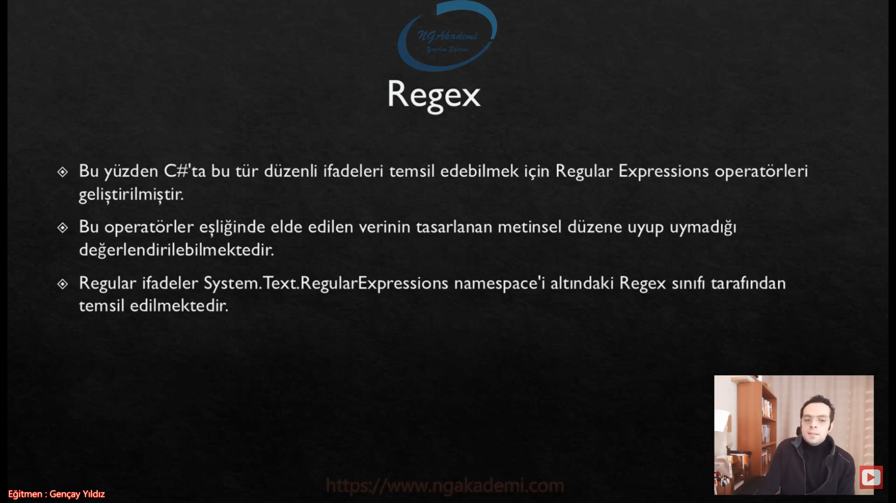

***
# 345) Regular Expressions(Düzenli İfadelerde) Neyin Nesi?
- Metinsel ifadeler üzerinde periyodik ve düzenli operasyonlar gerçekleştirmemizi sağlayan Regular Expression'ı inceleyeceğiz.

- Metinsel ifadeler içerisinde belirli pattern'lar uygulamamızı sağlayan bir yapılanma kazandırıyor bizlere.

- Biz metinsel ifadelerin içerisinde Regular Expression'ları kullanmadan operasyonlar algoritmalar yaptık bunlara tecrübelerimizle vakıf olabildik bunun zahmetinin ne olduğunu bildiysek artık Regular Expression'ları daha rahat anlayabiliriz.

- Metinsel yapılanmalarda belirli koşulları sağlayabilen ifadelerdir. Yani senin elinde bir metin var bu metinin içinde bir pattern uygulayacaksan bir metinsel koşul sağlayacaksan bir koşullu yapılanma oluşacaksa bunu Regular Expression ile çok rahat bir şekilde ifade edebilmektesin.

- Metinsel ifadenin içerisinde ihtiyaca istinaden düzenlenirler.

- Bir metinsel ifade içerisinde @ karakteri geçen bütün aralıkları elde etmek istediğimizi varsayalım. Elime bir metinsel ifade gelecek gelecek olan bu ifadenin içerisinde bana gönderen adam dedi ki ya kardeşim sen @ karakteri geçen bütün ifadelerin aralıklarını bana ayrı ayrı ayır. Bu karakterlerin aralığına düşen karakterleri ben dizi olarak yollayabilirim. Farketmiyor benim burada @ karakterini ayraç olarak görmem gerekiyor. İşte böyle bir durumda buradaki düzenimiz ne bizim metinsel ifadenin içerisindeki @ karakterleri bizim için bir düzen oluyor.

- Dikkat ederseniz bu değerlerdeki karakterlerin uzunluğu ne ve ne olduğu önemli değil Yeter ki @ karakteri olsun. Bu tarz yapılanmalar metinsel ifadelerde formatlandırma operasyonlarında kullanılıyor.

- @ karakteri geçen tüm aralıkları elde etmenin çeşitli yolları olabilir.

- Döngüye girersin girdikten sonra tek tek bütün karakterleri incelersin @ karakterimi değilse aralığa kadar alırsın @ karakteri olduğu anda da o aralığa kadar bütün değerleri tek bir birim olarak alır bir yerde depolarsın.

- Ancak şartlar arttıkça işlemi koda dökmek zorlaşacaktır.

- Buradaki örnek olay çok basit. ya daha kompleks bişey olursa...

- Milyonlarca email adresinin olduğunu düşünelim Biliyoruz ki tek bir email formatı vardır. `---@---.---`

- Burada bizim için önemli olan tek bir format üzerinden elimizdeki verilerin Email olup olmadığını değerlendirmek.

- Şimdi ben elimdeki verilerin email formatında olup olmadığını değerlendirmek istiyorsam ve bunu geleneksel programlama anlayışıyla yapıyorsam döngülerle vs. biz bu işin içerisinden çıkamayız. Biz bu işin içinden çıksakta işlemcimiz çıkamaz. Bu kadar yüksek bir veriyi milyonlarca veriyi kod seviyesinde değerlendirmek inanılmaz maliyetli olacaktır.

- Her email adresi mutlaka @ ve ardından .(nokta) karakteri barındırır. Eğer birden fazla nokta varsa, noktalardan biri mutlaka @ karakterinden sonra olmalıdır.

- Her bir email'de `string` bir veri olsa dahi bir iskelet var bir düzen var işte bu düzen bizim tarafımızdan bellidir ama elimize gelecek olan değerde kesin değildir. İşte bu kesinliği sağlayabilmek için biz bunu normal programlama yaklaşımlarıyla döngülerle sağlamaya çalışırsak inanılmaz derece de maliyetli olacak.

- Haliyle bir karakter dizisinin email adresi olup olmadığını test etmek oldukça zor olacaktır.

- Bu tarz algoritmalarla zorluk seviyesi yüksek olan metinsel ifadelerdeki füzeni kavrayabilme operasyonlarını biz normal algoritmalarla değil Regular Expression'larla sağlıyoruz.

## Regex
- Bu yüzden C#'ta bu tür düzenli ifadeleri temsil edebilmek için Regular Expressions operatörleri geliştirilmiştir.

- Sen normal döngülerle kendi algoritmalarınla özel yapmış olduğun matematiğinle vs. bir şekilde hesaplarsın onda şüphe yok ama bunda hem senin vermiş olduğun zahmet hemde bir yandan programlama dilinde kod seviyesinde yapmış olduğun operasyonun getireceği teknik maliyet inanılmaz derecede ortada bir sıkıntı yaratacak bir maliyet performans kaybı yaşatacaktır. Durduk yere maliyet oluşturacak ne gerek var. İşte bu tarz durumlarda biz elimizdeki metinsel ifadenin aralıklarıyla değerleriyle hiç uğraşmaksızın oradaki pattern'ı Regular Expression dediğimiz yapılarla çok rahat temsil edebilmekteyiz.

- Bu operatörler eşliğinde elde edilen verinin tasarlanan metinsel düzene uyup uymadığı değerlendirilebilmektedir.

- Regular ifadeler System.Text.RegularExpressions namespace'i altındaki `Regex` sınıfı tarafından temsil edilmektedir.

- Yani sen bir metinsel ifadenin herhangi bir düzene/patterna/düzenli ifadeye oradaki şablona uyup uymadığını temsil etmek istiyorsan buradaki temsiliyeti yapacak olan sınıf `Regex` sınıfıdır.

- Bu sınıf üzerinden biz gerekli temsiliyeti sağlar elimizdeki değer buradaki formata uyuyor mu uymuyor mu check edebiliriz.

- Regular Expressions'lar ufak tefek farklılık olsa dahi hemen hemen tüm programlama dillerinde olan evrensel yapılanmalardır. 

- Düzenli ifadeler başlı başına bir konudur. Ya hayat kurtarırlar, ya da ömür törpülerler :)

- Nihayetinde sen bir düzen sağlayacağım derken aslında işin detayına girdiğinde bayaa kompleks operatörlerle bir format oluşturmaya çalışacaksın eğer başarabiliyorsan ne ala ama başaramıyorsanda birazcık dirsek çürütmene saç dökmene sebep olabilir.

- Piyasada birçok yazılımcı Regular Expressions'ları kullanmamış olabilir metinsel ifadeleri içlerindeki belirli tekrarları ya da patternları yakalayabilmek için kod seviyesinde çalışmayı tercih edebilir ama bununla tanışan yazılımcı bundan da vazgeçemez

