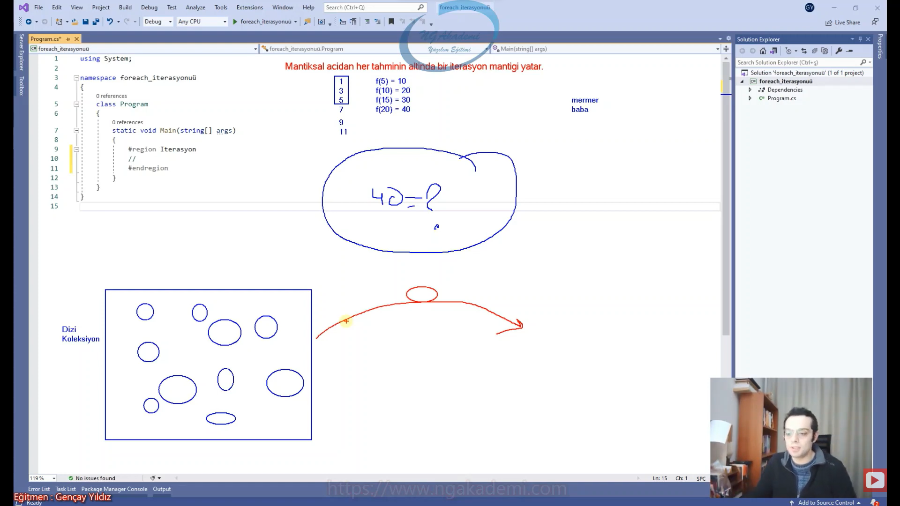
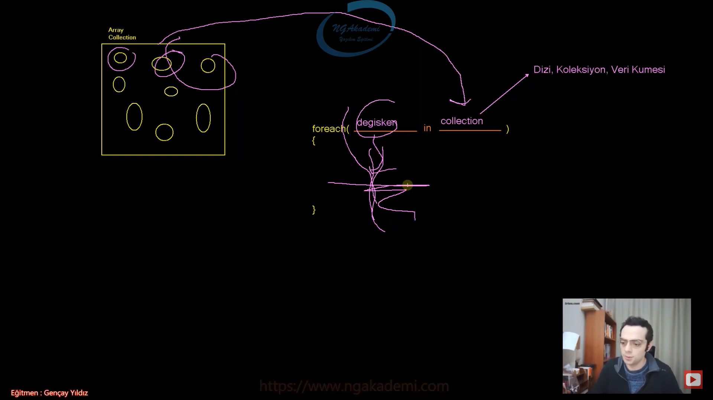

***
# 363) İterasyon Nedir?
- Elimizde dizi ya da koleksiyon olduğunu varsayalım. Şimdi veri kümelerinin üzerinde çalışırken bizler genellikle döngüleri kullanırız. Döngüyle giriyorsun belirli bir kombinasyona göre elindeki veri kümesi üzerinde işlmeler yapıyorsun oradaki verileri tek tek yakalayıp ona göre işlemler yapıyorsun. Buradaki operasyonları daha efektif hale getiren iterasyonel mantıkta çalışan `foreach` yapılanması var.

- İterasyon dediğimiz kavram bir tek yazılımın terminolojisinde olan bir kavram değildir. Yani farklı disiplinlerde olan kullanılan bir kavramdır. Matematikte görülebilir dil biliminde kullanılır. Bilgisayar biliminde de kullanılır.

- Günlük hayatta itere etmek diye bir fiil vardır. Bu fiilin temeli iterasyona dayanıyor. İtere etmek bir sonrasını yani devamını getirmek yani sürekliliği sağlamak ta ki sonuna kadar anlamını çıkarabiliriz.

- Mantıksal açıdan her tahminin altında iterasyon mantığı yatar.

- 1 3 5 `7` Ben size belirli bir değer verdin vermiş olduğum değerden sonrasını sen getirebildin. İterasyon yaparak getirebildin. İtere ede ede devamını getirebiliyorsun. Ben sana ilk 3 tane sayıyı verdiğimde sen 4.'ünün 7 olduğunu nerden bildin sorusunun altında yatan cevap iterasyonel mantıktır. 1 geldi 3 geldi 5 geldi e sonrası 7'dir E devamını getiriyor itere ediyor sonuna kadar gitmek istiyor. 7'den sonra itere ettik 9 oldu itere ettik 11 oldu itere ettik 13 oldu öyle gider. Mantıksal açıdan tahminin seni burada iterasyon mantığının üzerine kuruludur.

- f(5) = 10
- f(10) = 20
- f(15) = 30
- f(20) = 40
    * 5 10'sa 10 20'yse 15 30'sa 20'de 40'tır. İtere ederek devam ettin  burada 40 kaçtır diye sorduğumuzda sen iterasyon mantığıyla sorunun cevabını verebilirsin.

- Dil biliminde iterasyon dediğimiz kavram çok ilginç noktada tanımlama yapar. Bir kelime eğer ki içerisinde tekrar eden hece barındırıyorsa bu iterasyonel kelime olarak geçer. Örneğin mermer, baba bunlar içerisinde tekrar eden kelimeler barındırdıkları için iterasyonel kelimeler olarak isimlendiriliyor. Hatta ve hatta adamlar demişler ki bir cümlenin içerisinde tekrar eden kelimeler varsa bu cümle de iterasyonel cümle oluyor diyor. Bu şekilde kullanılan bir terimdir iterasyon dediğimiz terim.

- Bilgisayar bilimlerinde ise şu noktada kullanılır. Bizim veri kaynaklarımız var bu veri kaynaklarımızı dizi ya da koleksiyon olarak düşünebilirsiniz. Yani birden fazla verinin tek bir sepette olduğunu düşünün işte bu ya dizidir ya koleksiyondur. İşte bunun gibi veri türlerinde birden fazla verinin temsil edildiği bu koleksiyonlar/dizi/veri kaynağı üzerinde işlem yaparken iterasyon mantığı kullanılabilmektedir.

- Sen bir veri kaynağını iterasyona verdiğin zaman tek tek buradaki değerler itere edilir. Ta ki hiç değer kalmayana kadar. Bak itere eder der ki veri var mı var. Alırsın veriyi iterasyonda her bir adımda bir tane veri gönderilir Her bir adımda o veri işlenir ondan sonra bir başka veri gönderilir ondan sonra bir başka veri gönderilir ta ki hiç veri kalmayana kadar. Buradaki iterasyon mantık şöyle soru soracaktır. Diyelim ki ben iterasyon mantığa göre çalışan bir yapıyım bir veri kümesi var diyelim bu veri kümesi üzerinde işlem yaparken elimi atıyorum diyelim ki bunun üzerinde bir sepet olsun içinde de elmalar olsun. Bakmadan diyorum ki elma var mı var o zaman gittim aldım 1 tane işlemimi yaptım daha sonra diyorum ki içinde elma var mı var gittim 1 tane daha elma aldım var mı var gittim aldım var mı var gittim aldım var mı yok tamam bitmiştir. Şu anda bütün değerleri itere etmiş olduk.

- Bilgisayar bilimlerinde elimizdeki veri kümeleri üzerinde işlem yapmamızı sağlayan bir mantıktır iterasyon mantığı. Elimizdeki verileri tek tek elde ederek bunların üzerinde işlem yapmamızı sağlayan bir yapılanmadır. Şimdi iterayonun can alıcı noktası şudur. Eğer ki Veri kümeleri üzerinde iterasyonel operasyonlar sağlıyorsak bu kümenin üzerindeki içerisindeki bütün değerleri tek tek elde etmek zorundayız. Haliyle %50'lik bir işlem mi yapacaksın iterasyonel mantık %lik işlemlere çok uygun değildir. Belirli bir kısmını alayım şunu yapayım ya da işte örneğin öğrenci nesnelerim vardır. Öğrenci değerlerim vardır ya da yaş değerlerim vardır. Belirli bir scala'nın altındaki değerleri toplamak istiyorumdur. Bunu yaparken biz iterasyon mantığını kullanıyorsak tüm değerler gelecektir bunun gelmesini engelleyemeyiz. Ama operasyonel anda gelen bu değeri belirli bir condition'a tutup bir şartla kıyaslayıp ona göre işlemimizi sağlayabiliriz.

- İterasyonel mantıkta çalışıyorsanız döngülerdeki gibi algoritmaya sürece hangi verinin çekileceğine hangi veri üzerinde çalışılacağına karar veremezsiniz. İterasyon illa ki her veriyi tek tek alacaktır aldıktan sonra sen işlem anında o veriyi tanıyıp işlem yapacak mısın yapmayacak mısın orada kararını vereceksin.

- İterasyon yapılanmasının itere eden ya da yazılımsal açıdan baktığınızda elinizdeki herhangi bir koleksiyonun içerisindeki bütün değerleri tek tek elde etmenizi sağlayan bir yapı olduğunu bilelim.



***
# 364) İterasyon ile Döngü Arasındaki Fark Nedir?
- Elimizde bir veri kümesi var ve bu veri kümesi üzerinde tek tek bütün verilere ulaşıp işlem yapmak istiyorsak burada 2 tane farklı yapılanmayı kullanabiliriz.
    1. Döngüler
    2. Mantığını bildiğimiz `foreach` yani iterasyon.

- Foreach(İterasyon) BİR DÖNGÜ DEĞİLDİR!!!!

- Özünde iterasyon başka birşeydir döngü başka birşeydir.

- Döngüyle işlem yaparken esasında bir sonraki işlem önemli değildir. Kombinasyon önemlidir. Döngü dediğimiz yapılanmalar belirli bir matematiğe göre mantığa göre işleyen kombinasyonla çalışan yapılanmalardır. Döngülerin her biri illaki bir mantıksal kombinasyon üzerinden işlem yapmak zorunda. Yani bir döngüyü sen sonsuza kadar çalıştırabilirsin buradaki kombinasyonu sonsuza kadar doğruladığın sürece. Ama iterasyonda böyle bişey yok iterasyon sonsuza kadar çalışmaz. İterasyon dediğin yapılanma belirli kombinasyona göre işlem yapmaz. İterasyon elindeki veri kümesindeki eleman sayısı kadar işlem yapar. Ama döngü bir kombinasyona göre işlem yapar. O kombinasyonu biz elimizdeki veri kümesiyle eş zamanlı bir şekilde tutturacak bir şekilde ilgili verileri tek tek elde ederiz öyle düşünün. Bir matematik yapıyorsub oradaki matematikte her bir işlem esnasında üretilen bir değer elindeki veri kümesindeki her bir elemana karşılık geliyor. Bunu sen matematikle kurarsın bu ayrıdır bu döngüdür. İterasyonu kullanırsın iterasyonda bir mantık yok direkt sana zaten ilgili veri kümesini getirecektir.

- Döngüler illa ki bir veri kaynağıyla çalışmak zorunda değil elindeki herhangi bir koleksiyon ya da dizi üzerinde çalışmak zorunda değilsin döngülerde kombinasyonla çalışabilirsin. Ekstradan işlemler yapabilirsin yapmayadabilirsin. Ama iterasyonla çalışmak istiyorsan elinde kesinlikle bir veri kaynağının olması gerekiyor. Elinde veri kaynağı olmadığı sürece `foreach`in hiçbir anlamı yok. Dolayısıyla döngüyle iterasyon yapılanması esasında çok farklı şeyler. Sadece operasyonel işlemsel açıdan bunlar benzer şeyler. İkisi de adım adım belirli kombinasyonlar sağlıyor belirli işlemler yapabileceğimiz adımlar sağlıyor biz bunlara döngü diyoruz haliyle. Ama teknik olarak hem teoride esasında pratikte de farklı yapılanmalardır.

- Döngü dediğiniz yapılanmada kombinasyon değişince döngünün herhangi bir akışında bozukluk olur mu olmaz. Tabiki de senin yapmış olduğun oradaki operasyon algoritma her neyse orada değerler değişince belki akışta fark olabilir ama bu döngünün genel akışında yani dinamiziminde bir sıkıntı yaratmayacaktır. Ama `foreach`te öyle değil `foreach` zaten çalışabilmek için bir koleksiyona/diziye/veri kümesine muhtaç. Haliyle çalışma esnasında elindeki veri kümesi değişirse patlar hata alırsınız.

- `foreach` dediğimiz yapılanma veri kümesi olmadan çalışmadığından dolayı ilgili veri kaynağı yani üzerinde iterasyona başladığı veri kaynağının değişmemesi gerekiyor. Değiştiği taktirde patlayacaktır. Ama döngülerde herhangi bir bağımlılık yoktur sadece orada kombinasyon var bir matematik var o matematiğe uygun bir şekilde döngü şart sağlandığı sürece tetiklenecektir.

- İterasyonel yapılanmalarda elindeki veri kümesini değiştirdiğin zaman iterasyonun patlamasının altında yatan sebepte esasında iterasyonun bir sonraki değeri takip edebilme mekanizmasıdır. Şimdi düşünsene ben elimde bir kese var bu kesede altınlarımız var ben şimdi tek tek itere ediyorum hani bir filmde vardı ya Kemal Sunal'ın tek tek adam altınları sayıyor napıyor itere ederek sayıyor. Bir yerden sonra kafa karışınca ya da kaynak değişince ya da senin saydıklarınla saymadıkların aynı havuza atıldığında iterasyon devam etmez nerde olduğunu bilemez iterasyonda nerede olduğunu bilmen lazım. İterasyon mantık bu şekilde işler. Dolayısıyla veri kümesi değişmez.

- Iterator design pattern var. Iterator design pattern bizzat burada bahsi geçen işlemleri uyguladığımız tasarım desenidir. İleri de biz Iterator design pattern'ı uygulayıp kendi `foreach`ımızı yapacağız. Ama kendi döngümüzü yapabilmemiz için design pattern'dan ziyade daha fonksiyonel çalışmamız gerekecek yani recursive fonksiyonlar gibi düşünebilirsiniz.

- İterasyon yani `foreach` bir döngü değildir. Halk arasında döngü diyoruz ama özünde değildir.

```C#
#Iterasyon vs Döngü
//Foreach(İterasyon) BİR DÖNGÜ DEĞİLDİR!!!!
int[] sayilar = { 3, 213, 423, 42, 34, 234, 234, 234 };
for (int i = 0; i < sayilar.Length; i++)
{
    
}
```

***
# 365) Foreach İterasyonu Nasıl Kullanılır?
- İterasyonu kullanabilmek için ya iterator design pattern'ı uygulamamız gerekecektir. Ya da dilin semantik açıdan syntax'ında bize getirmiş olduğu bir yapılanma var. `foreach` dediğimiz iterasyon. `foreach` kalıbı. Yani bir döngü `for` nasıl bir kalıp `while` nasıl bir kalıpsa `foreach` kalıbı da iterasyonel mantıkta çalışan bir kalıptır.

- `foreach`in çalışabilmesi için elimizde bir tane veri kümesi olması gerekiyor. Ya bu dizi olacak ya da koleksiyon olacak. Elindeki veri kümesi üzerinde tüm verilerde adım adım sıralı bir şekilde çalışmak istiyorsan döngüyü kullanabilirsin amenna ama `foreach`'ide kullanabilirsin. İterasyon mantığında çalışan `foreach` yapılanması sadece koleksiyonlarda ya da dizilerde kullanılır. Yani lalettayin herhangi bir noktada kullanamazsınız. Elinizde bir veri kümesinin olması gerekiyor. Başka bir şekilde kullanamazsın. `for` ve `while` ile sen 1000 kere tetikleme yaparsın ama `foreach` kullanarak bir tetikleme de bulunabilmen için onu tetikleyecek bir veri kümesine ihtiyacın var. İterasyonla çalıştığı için adım adım sayabileceği verilerin bulunduğu bir kümeye ihtiyacı var.

- `foreach( değişken  in collection ){}`
    * `in` keywordünün bir sağı var birde solu var.
    * sağına geliyorsun diyorsun ki kardeşim iterasyona tabi tutulacak olan koleksiyon hangisiyse onu yazıyorsun. Dizi, Koleksiyon, Veri kümesi
    * sol tarafta da bu elindeki koleksiyonun içinde sen her bir elemanı tek tek elde etmeyecek misin iterasyonla elde edeceksin işte her bir elemanı elde ederken sen bu elemanları temsil edeceğin bir değişken tanımlamalısın.
    * Veri kaynağında her bir iterasyonda sana gelecek elde edilecek o anki değer nesne hangisiyse onu sen buradaki değişkenle temsil edebileceksin.
    * Diyelim bir koleksiyonu sen `foreach` iterasyonuyla itere ediyorsun verdikten sonra her bir iterasyon adımında her bir nesneyi tek tek buradaki değişken temsil edecek ve işlemini yapacaktır. Bu işlem iterasyon sonlanana kadar devam edecektir. Yani ta ki elimizdeki veri kümesinin değerleri içindeki veriler bitene kadar buradaki işlem gerçekleştirilecektir.
    * Tabikide elindeki veri kümesinein sana vereceği içindeki elemanlara uygun o elemanları karşılayabilecek bir değişken tanımlaman gerekiyor.

- C#'ta bir kalıp vardır o kalıbın yanında parantezle içerisine belirli parametreler aktarılır. `while`da, `for`da,`do while`'da, `foreach`de böyle yani birçok semantikte barındırılan yapıyla ilgili çalışmamız bu şekilde olacaktır. Haliyle compiler gelirken bakacak burada `foreach` mi var. Bu `foreach` ile ilgili işlem yapılacaksa parantez içindeki parametrelere göre yapayacağını anlayacaktır.



- Dizilerde yapılan çalışmada dizinin kombinasyonu değiştiğinde dizi devam edebiliyor çalışmasına ama `foreach`in çalışmasını sağlayan yapılanma neydi ilgili koleksiyondu/veri kümesiydi/diziydi. İşte bu koleksiyonda/veri kümesinde/dizide bir değişiklik olduğu zaman bizim `foreach` yapılanmamız patlıyor yani çalışmasına devam edemiyor.

- Biz `foreach` yapılanmasını kullanıyorsak mümkün mertebe kaynağı/veri kümesini değiştirmemeliyiz. Kayna değişecekse veri kümesindeki eleman sayısı oynayacaksa bu şekildeki operasyonlarda döngü kullanmalıyız.

```C#
#Foreach İterasyonu
ArrayList sayilar = new ArrayList { 123, 123, 325, 2, 534, 5, 345, 345 };

foreach (object item in sayilar)
{
    System.Console.WriteLine(item);
}

foreach (object item in sayilar)
{
    sayilar.Add(123123123);
    System.Console.WriteLine(item);
}
```
