***
# 381) Metot Nedir? Bir Programcı Gözünden Ne İşe Yarar?
- Prosedürel programlamanın artık Object Oriented'a geçişini zorlayacak olan konudur metotlar.

- Nihayetinde metot sınıfın bir member'ıdır.

- Günlük hayatta biz metoda terminolojik açıdan yöntem/yordam/function diyebilmekteyiz. Yani bir fiili/eylemi/fiiliyatı temsil eden kelimelerdir.

- Örneğin ben günlük hayatta ben bir aşçıyım yemek yapıyorum yapmış olduğum yemekte kullandığım uyguladığım yöntem benim metodolojimi temsil eder. Yani metot dediğin kavram fiiliyatın ta kendisidir. onun terminolojik karşılığıdır/izahıdır.

- Diyelim ki ben bir akademisyenim araştırma yapıyorum yapmış olduğum araştırmalarda hatta akademik kaynağı elinize aldığınızda oradaki yapılan araştırmayla ilgili ya da yöntemle ilgili bilgi verilir size der ki buradaki araştırma şu metodoloji kullanılarak yapılmıştır. Bunu şöyle düşünebilirsiniz bir veri üretilmesi gerekiyor akademik dalda hangi yöntemle hangi terminolojiyle üretildiği ilgili kaynakta yazar. Biz buradaki istatistiksel verileri anket metodolojisini uygulayarak gerçekleştirdik. Yok efendime söyleyeyim gözlem metodolojisini uygulayarak gerçekleştirdik. 

- Metot dediğimiz yapılanma fiiliyattır/yöntemdir. Sen nasıl ki bir yemeği yaparken bu yöntemi kullanıyorsun yani oradaki metodu uygulamış oluyorsun. 
 
- Yazılımda gerçekleştirdiğimiz, fiili olarak gerçekleştirdiğimiz tümmmmmm operasyonlar bir metottur. Yazılıma geldiğimizde senin fiili açıdan gerçekleştirdiğin tüm operasyonlar bir metodolojidir haliyle bunların hepsi metot içerisinde olması gerekmektedir.

- Matematiğe gidersek eğer matematikte fonksiyonlar dediğimiz konular vardı fonksiyon yazılımdaki metodun ta karşılığıdır. Matematikteki fonksiyon ne yapıyorsa yazılımda da metotlar aynısını yapıyor. Metotlara bir diğer ismi fonksiyonda diyebiliyoruz birebir aynı isimle kullanılabilmekte. Şimdi sen matematikte diyorsun ki ya kardeşim benim elimde bir f(x) fonksiyonu var burada x'e verilen değer içeride bir bağıntıya/fiiliyata tabi tutulur. İşte metotta da böyle olacak yazılım açısından olayı değerlendirdiğinde sen diyeceksin ki benim elimde X diye bir metodum olacak bu metot şu operasyonları gerçekleştirecek diyeceksin yani yazılımda sen bir fiiliyat/operasyon gerçekleştireceksen bir algoritma yapacaksan `for` döngüsü `while` döngüsü `try - catch` mekanizması vs. yani kodu yazmak istiyorsan bunu metot içerisinde yapman gerekiyor.

- Sen bir operasyon gerçekleştirecen bir kod yazacaksın bunu metotlarda yapman gerekiyor.

- Metot prosedürel programlamanın temel elemanıdır. Bir iş/fiiliyat/operasyon yapan en küçük program parçacıklarıdır. 

- Metotlar bir yandan da Object Oriented'da object dediğimiz yapılanmanın temel member'ıdır. Dolayısıyla çok kritik bir konudur

- Seni bir yazılımın var bu yazılım istediğin gibi basitte olabilir çok devasa ağır yüksek bir yazılımda olabilir farketmiyor. Basit bir hesap makinesi eline al bu hesap makinasında operasyon/fiiliyat/işlem mi gerçekleştireceksin bunları kesinlikle metotla yapmak zorundasın. Aynı şekilde uzaya gönderdiğin bir füzen olsun orada devasa işlemler yapıyorsun buradaki işlemlerde metotta olmak zorunda. Yani metot yazılımın içerisinde fiiliyatı/operasyonu/algoritmayı çalıştırabileceğin tek yer başka bir yer yok. Metodun içerisinde kod yazabilirsin. Metodun dışındaki yerler tanımlama yerleridir. `class`/`struct`/`interface` tanımlarsın mimariyi oluşturursun ama kodu yazmazsın kodu yazdığın operasyonu/algoritmayı gerçekleştirdiğin yer metottur.

- Programlama açısından bir işi yapan en küçük programlama parçacığı metottur. 

- Örneğin yazmış olduğumuz kod otomasyonel bir kod olsun ve makinalara hitap eden ve hükmeden bir kod olduğunu düşünelim. Şimdi makinalara hitap eden hükmeden kod fiiliyat açısından hangi işi yapıyorsa orada bir metot tetikleniyor diye düşünebilirsiniz. Şöyle bir kod yoktur. Makinaya şunu diyemezsiniz ya hadi kapıyı aç kodunu çalıştır diyemezsiniz. Çünkü öyle bir kod yoktur. Makinaya kapıyı aç metodunu yazarsınız o metotla makinanın kapısı bir şekilde açılır. Metot işlem yapmanı sağlayan bir program parçacığıdır. Yani senin kapıyı açabilmen için oradaki motorları çalıştırman lazım belirli bir açıya kadar kapı dönecek işte döndüğü zaman durdurman lazım burada aslında çok fazla parametre var ve buradaki operasyonların hepsini bir bütün olarak program parçacığı olarak değerlendirirsek işte biz bunu metot olarak yazılımda tasarlıyoruz. Dolayısıyla sen otomasyonel bir sistemde kapıyı açan kodlarını/operasyonlarını yazdığın yapılanma kesinlikle metot olmak zorunda. Facebook'ta beğen butonu var değil mi? Beğen butonuna tıklandığında oradaki içeriği beğeniyor. İşte oradaki beğenme aktivetisinde bulunan yapılanma kesinlikle bir metot olmak zorunda. Youtube'a girdin Youtube'da gittin yorum yazdın değil mi? Yorumu yazdın dedin ki senin yapacağın videonun falan diye orada bir güzel yazdın yorumunu ardından enter'a bastın ya da yorum yap dedin oradaki yorumu alıp ilgili videoya yerleştiren o operasyonun sorumluluğunu üstlenen yapılanma kesinlikle bir metot olmak zorunda.

- `class` dediğimiz yapılanma var `interface` dediğimiz yapılanmalar var. Bilmediğin onlarca yapılanma var. Bunların hiçbirinde kod yazamazsın. Bunlarda en fazla yapabileceğin şey yapı tasarlamak. Yani ilgili örneğin `struct`. `struct` değer türlü nesneler oluşturmanı sağlayan bir yapılanma. E peki bu değer türlü nesne oluşturmanı sağlayan yapılanma bir operasyon yapar mı yapmaz.`struct` belki devas bişeymiş gibi gözükebilir sana ama operasyon yapmana müsaade etmez. Senin operasyon yapabilmen için nerede çalışıyorsan çalış bir tane metoda ihtiyacın var.

- Bir programcının yazılım içerisinde genel mimarisel tasarım genel böyle algoritmik yapılanmadan bahsetmiyoruz. Mimarisel tasarım ileride design pattern'ları göreceğiz. Hani belirli mimarisel kod tasarımlarımız vard. Bunların dışında özel spesifik algoritmalar/programlar/program parçacıkları/fiiliyatları yazarken bir yazılımcının kesinlikle metoda ihtiyacı vardır. Yani biz metotlar sayesinde kodlarımızı yazabiliyoruz algoritmalarımızı oluşturabiliyoruz.

- İleride property dediğimiz yapılanmalar olacak Object Oriented'da `class` memberlarında bunu göreceksiniz. Şimdi property dediğimiz yapılanmanın içerisinde de kod yazabiliriz orada herhangi bir algoritma yapabiliriz. Property özünde compiler seviyesinde bir metot olduğunu bilmeliyiz.

- Sen kod yazabiliyorsan algoritma operasyon yapabiliyorsan %1000 metodun dışında başka bir yerde çalışamazsın. Daha da ileride şey göreceğiz Nesnelerde kod yazabildiğimiz algoritmalarımızı oluşturabildiğimiz `constructor` yapılanmasını göreceğiz. `constructor`da bir metottur. Yani sen kod yazıcan,`if` yazıcan döngüler oluşturacaksın yok efendime söyleyeyim `try - catch`ler `switch - case`ler bilmemneler bunları yazabilecek kodun içerisinde bir yer arıyorsan kesinlikle bunun bir metot olması lazım.

- Biz bugüne kadar programlamayı öğrendiğimiz programlamayı öğrenirken yapmış olduğumuz işleri fiiliyatları operasyonları yazdığımız yer Main metoduydu. Main'de bir metottur. Çünkü şu ana kadar öğrendiklerimizi metodun dışında yazamazdık. Haliyle main bir ana metottur.

- Bir yazılımın var bu yazılımın içerisinde fiiliyat yapan en küçük bir kod parçacığıdır diyebiliriz. Yani burada bir algoritma/operasyon/fiiliyat mı yapacaksın işte bunları yapmanı sağlayan yapılanma metottur. Kodun diğer yapılanmaları işte Object Oriented'da öğreneceğimiz diğer yapılanmalar hep mimarisel açıdan tasarımla alakalıdır.

- Kodun içinde uzaya da füze göndersen hesap makinesi de yapsan hangi yazılım olduğu önemli değil herhangi bir kodun içerisinde 2 ile 2'yi toplamak istiyorsan yani bir fiiliyat/operasyon/iş değil mi bu. Bu işi yapabilmem için benim metoda ihtiyacım var. Metot koymadan yapamayız. Al yazılımı çöpe at bu vakit.

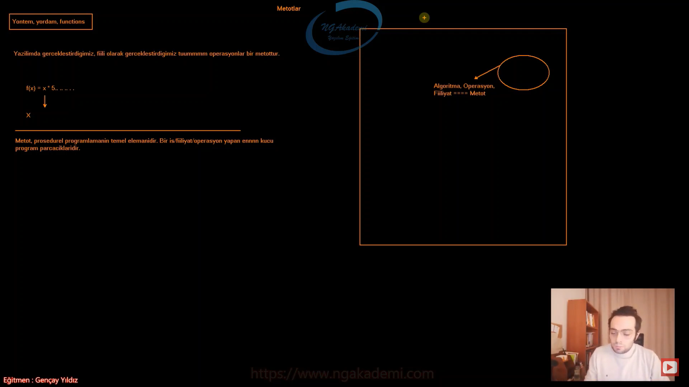

***
# 382) İşlevsel Açıdan Metot Bize Ne Kazandırır?
- Metot prosedürel programlamanın temel elemanıdır yani olmazsa olmaz yapılanmadır.

- Bir iş yapan en küçük iş parçacıklarına biz metot diyoruz. Buradaki işten kastımız algoritma/operasyon bir başka deyişle kodun içinde fiiliyat yani eylemde bulunmak istiyorsanız sen kesinlikle bir metotla çalışman gerekmektedir.

- Biz şu ana kadar bütün operasyonlarımızı Main metodunun içinde gerçekleştirmiştik.

- Biz yapacağımız fiiliyatlar algoritmalar operasyonlar her neyse bunların hepsi aynı kapıya çıkacak yani sen kodun içerisinde bir iş yapmak istiyorsan bu iş kesinlikle bir metodun içerisinde olmalıdır. Geri kalanı tasarımsal kısmıdır. Yani senin kodun içinde algoritmayı yazabilmen için gerekli tasarımı uygulaman lazım. İşte burada yeri gelecek `namespace` oluşturman lazım yeri gelecek bir `class` oluşturman lazım ki artık ilgili `class`ın içerisinde bir metod oluşturup kodunu yazabilesin.

- Metot dediğimiz yapılanmalar sınıfların elemanlarıdır. Birde ileride `struct` denilen yapılanmalar göreceğiz. Metotlar hem `struct`larda hem de `class`larda eleman olarak tanımlanabilmektedir. Yani kodun içerisine senin bir metot oluşturabilmen için ya bir `class` dediğimiz yapılanma içerisinde bu metodu tanımlaman lazım ya da ileride göreceğin `struct` dediğimiz yapılanma içerisinde tanımlaman gerekecektir. C# 9.0'da `record` dediğimiz yapılanmalar geldi bunlar fıtrat olarak `class`lar. Ama davranışsal olarak farklı `class`lar. Dolayısıyla bu `class`ların içerisinde de metotlar tanımlayabiliyoruz.

- Yani sen bir metot tanımlamak istiyorsan ya `class`ın içerisinde tanımlayacaksın ya da `struct`ın içinde tanımlayacaksın. Bunun dışında dediğim gibi metot operasyonu/eylemi gerçekleştirmek için çalıştığın alanı sana veriyor bu geri kalan yapılanmalar tanımlama aşamaları yani kodu inşa etmeni sağlayan yapılanmalar. Kodu operasyonu gerçekleştirdiğin fiiliyatı uyguladığın yer metodun ta kendisi.

- Basit bir hesap makinesinde 2 ile 2'yi toplamaya çalıştığınızda buradaki iş/fiiliyatta bir metodun içinde olduğunu söyleceksiniz. Benzer mantıkla devasa bir yazılım uzaya füze gönderdin giden füzenin işte veri alıyor değil mi bu verileri alıp işleyip sana bu verileri gönderen kodun içindeki alanında bir metot olduğunu bileceksin. Çünkü bu da bir eylem 2 ile 2'yi toplamakta bir eylem. Eylem mi var kodun içerisinde kesinlikle metodun içerisinde çalışmamız gerektiğini artık biliyoruz. 

- Hangi dile giderseniz gidin bu dillerin hepsinde operasyonlarınız kesinlikle metotlarda gerçekleştirilmekte. Hatta biz bu metotlar sınıf ve `struct` elemanları dedik. İleride bu sınıf ve `struct` elemanlarının altında bir de property dediğimiz diğer elemanları da inceleyeceğiz. Property'lerde özlerinde bir metot olduğunu konuşacağız. Nihayetinde property'lerde yapısal olarak içerisinde algoritmalar yani fiiliyatlar yapmamızı sağlayan yapılardır. Dolayısıyla bunu yapmanı sağlayan yapı kesinlikle metottur dediğim halde property bununla denk geldiğinde şunu bilmen gerekir. Property özünde yani compiler seviyesinde bir metottur.

- Metot bir kodun içerisinde operasyonel anlamda iş gerçekleştiren en küçük program parçası.

- Bir kodun var bu kodun içerisinde bir fiiliyatta/algoritma da bulunacaksan işte bunu yapmanı sağlayan metodundur.

- Metot dediğimiz yapılanma kodun içerisindeki tekrarları ortadan kaldırmamıza yaramaktadır. En önemli unsurlarından birisi de budur. Hem operasyon yapmanı sağlıyor hem de kodun içerisinde tekrar eden kodları tek seferlik tanımlayıp inşa edip ondan sonra her seferinde metot üzerinden bir daha inşa etmeye gerek kalmaksızın çağırmanı sağlayan bir yapılanmadır metot dediğin yapılanma.

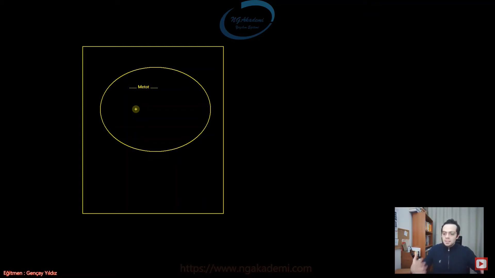

- Şimdi bir operasyonunuz var. Diyelim ki bir sayılar dizisi oluşturdunuz ve buna da elemanlarını rastgele olarak döngüyle beraber atadınız ve sonra bu dizideki elemanları teker teker ekrana yazdırdığınızı varsayalım Peki bu operasyonu 3 defa art arda yapmak istersek ne yapacağız. Şimdi bu operasyonu 3 kere art arda yapabilmenin yolları birden fazla. Örneğin bu yapılanmayı döngüye alabiliriz. Ama diyelim ki biz arada farklı işlemler yapıyoruz. Yapmış olduğumuz bu farklı işlemler neticesinde ben aynı kodu bir daha tetikleyecem. Yani döngüyle hep belirli bir konsepti tetiklemeyecem. Belirli noktalarda hani sabit bir konsept üzerinde olmayan tekrarları yapmam gerektiği durumlarda benim buradaki tekrarlara ya manuel şekilde gerçekleştireceğim. yani tekrar sayısı kadar yazacağım. Kodu tekrar etmek çokta tercih edilir bir durum değildir. Nihayetinde siz burada yönetilebilirliği düşürmüş oluyorsunuz. Burada çıktıyı alırsınız sıkıntı yok ama bu kodun yönetilebilirliğine baktığınızda çıktıdan ziyade kaynağa baktığınızda yönetilebilirlik oldukça zayıf çünkü tekrarlarımız var. Eğer ki bir kodun içinde tekrarlar varsa bu kod bir sorgulanmalı. Evet kodun içinde tekrarlar var ve ben bunu döngüye alamıyorum çünkü arada farklı işlemler var ve bu farklı işlemler neticesinde benim bu kodu tekrarlı bir şekilde çağırmam lazım. İşte böyle bir durumda ben bu kodu yani tekrar eden kodu metoda alırız. Bir metot haline getiririz ve bu kodları lazım olduğu taktirde bu metodu ilgili yerlerde çağırırız. Bu şekilde tek seferde yazdığım kaynağı lazım olduğu taktirde tekrara düşmeden tekrar tekrar tetikleyebileceğim. Çağırmakla kodu tekrar yazmak arasında fark var. Tekrar tetiklemek bizim zaten amacımız bu ama tekrar tekrar kodu inşa etmek bu maliyetli ve kaçtığımız bir durum. Yani kesinlikle bir kodu tekrar tekrar yazmamanız lazım. Bir kere yazmanız lazım. Lazım olduğunda ilgili yerden yazmış olduğunuz yerden çağırmanız lazım. İstenmeyen hal burada kodun tekrar etmesidir. Ben bu kodu bir metod haline getirip buralardaki tekrarları bu metot üzerinden çağırırsam işte ideal koda bu şekilde erişmiş olurum.

- Metotlar içerisine yazılan kodun tekrarlı bir şekilde kullanılmasını sağlarlar.... ve bunu yaparken kaynak kodun tekrar etmesini de engellemiş olurlar.... Böylece ideal koda erişmiz oluruz.... 

- İdeal kod mümkün mertebe tekrar etmeyen koddur. Bir başka deyişle de ideal kodlamada tekrar etmeyen tekrarı engelleyen lazım olduğu taktirde bir kere tanımlayıp ondan sonraki her lazım olan noktada bu çağırabilen kodu inşa etmektir bizim amacımız. Örneğin ben bir aşçı olarak bir metodoloji uyguluyorum. Uyguladığım metodoloji sayesinde yemeğimi icra edebiliyorum. Yemek oluşturabiliyorum yani yemeğim ortaya çıkıyor. Şimdi aynı metodu başka bir aşçıya söylediğim zaman metodu birebir uyguladığında aynı lezzet birebir aynı şekilde aynı görüntüde aynı tadında yemek ortaya çıkacaktır. Dolayısıyla bir metot nerede çağırırsan çağır aynı işlemi yapacaktır ve senin yapmış olduğun bu metot bu metodun işlevini bir daha tekrar etmeni engelleyecektir. İşte çağırdığın yerde bu metot işlevsel olarak orayı işleyecek ama kodun tekrarını engelleyecek.

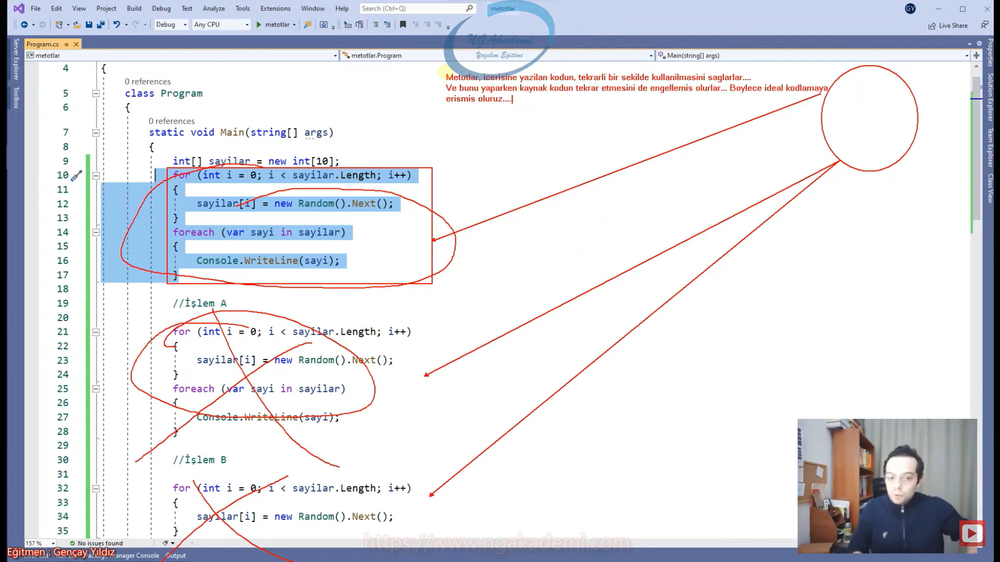

- Yazılmış olan bir kodu tekrar çağırmakla, tekrar yazmak arasında fark vardır!

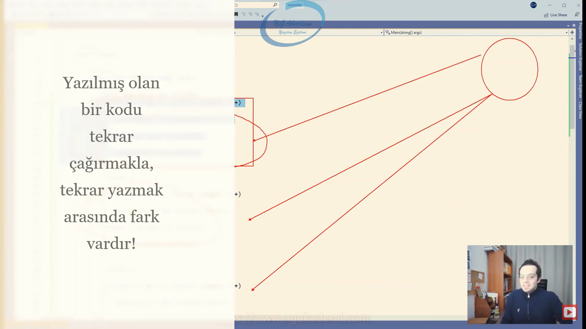

***
# 383) Metot Anatomisi Nasıldır? Gelin Metot İmzasını İnceleyelim
- C# programlama dilinde bir metot oluşturabilmek için `class` içinde çalışmanız gerekmektedir.

- Kod dosyasına baktığınızda kodun içinde `class` yapılanmasının scope'unun içinde metodunuzu tanımlayabilirsiniz.

- Metot içinde metot tanımlayamıyoruz ta ki local function'ları öğrenene kadar. Diğer alternatifleri boşvereceğiz ve `class` elemanlarıdır diyeceğiz. Sadece `class` içinde tanımlanabilir diye kabul edeceğiz.

- Bir metot oluşturabilmek için yapmamız gereken bildiriler bulunmaktadır. 

- [erişim belirleyici] [geri dönüş değeri] [metot adı] () {}
    * Bir metot tanımlama sürecinde öncelikle metodun dışarıdan erişilebilirliğini ayarlayan erişim belirleyicisi(access modifiers) dediğimiz yapılanma bildirilir.
    * İkinci olarak tanımlamız gereken geri dönüş değeri vardır. 
    * Sonuncu olarak ise metodun adını bildirmemiz gerekecektir. 
    * Ardından bir metot tanımlaması yaptığımızdan dolayı parantez açıp kapatacağız. Parantezin içerisinde parametre dediğimiz yapılanmalar olacak. 
    * Nihai olarak ilgili metoda dair operasyonel kodlarımızı barındıracak olan kısmı yani scope'larımızı açıp kapatacağız.

- Erişim belirleyicisi dediğimiz keyword ile ilgili metodu işaretleyeceğiz. Ardından bu metot geri dönüş değeri ne olabilir bunu bildireceğiz ve ardından bu metoda her şeye verdiğimiz gibi bir isim vereceğiz nasıl ki değişkenlere veriyoruz `class`lara veriyoruz aynı şekilde metoda da bir isim vereceğiz. Bir metodun olmazsa olmazı parantezi açıp kapatacaksınız ve son olarak scope yani yapılacak operasyonları barındıracak kodları yazılacağı yer olan scopelarımızı açacağız. 

- Erişim belirleyicileri(access modifiers) ileride göreceğimiz yapılardır. Oluşturulmuş olan bir yapının dışarıdan erişilip erişilmeyeceğini belirlemizi sağlayan komutlardır. Sen bir kod yazdın metot yazdın yazdığın metoda dışarıdan erişilsin mi erişilmesin mi bu dışarıdan kastımız bilgisayarın dışı ya da farklı bir aygıt değil bu bizzat bu kodun içerisinde bu metodun yazıldığı sınıfın nesnesi üzerinden erişilsin mi erişilmesin mi? 

- Dışarıdan erişilmesini istiyorsan yani yazılmış bu fonksiyona metoda erişilsin birisi kullanabilsin istiyorsan bunu `public` ile işaretlemen lazım. Yok eğer erişilmesin kardeşim benim yazdığım metoda bir tek ben erişebilirim başkası erişemez diyorsan `private` ile işaretlemen lazım.

- Metotlar yaptıkları operasyonlar/algoritmalar/işlemler neticesinde geriye değerler dönebilmektedirler. Bu değer programatik olarak yakalanabilir ve programatik olarak işlemlere tabi tutulabilir. Geri dönüş değerini ekranın çıktısıyla karıştırmamak gerekmektedir... Metodun geriye dönmüş olduğu bu değer programatik olarak kullanılabilir. Yani bu metotta yapılan işlem neticesinde Console'a ekrana bir çıktı veriyorsun ya o geri dönüş değeri değildir KARIŞTIRILMAMALIDIR! Geri dönüş değeri dediğin kavram programatik olarak tetiklenen metodun yapmış olduğu işlem neticesinde döndüğü değeri kodun içerisinde devam edebilmek yani o değeri alıp kodun içinde farklı yerlerde kullanabilmektir. Geri dönüş değeri programatik olarak kodun içinde kullanılabilen bir değerdir.

- Sen şimdi ekrana Merhaba Dünya diye bir çıktı verdin. Sen fonksiyon üzerinden vermiş olabilirsin ama bu fonksiyonun geri dönüş değeri değildir. Bu operasyonun gereğinden birisidir. Ekrana bişey yazması mı lazım yapılan algoritma da yani ilgili metodun içerisindeki operasyon ekrana bunu yazması gerekiyorsa bunu yazmıştır. Bu çıktı geri dönüş değeri olmuyor ama geri dönüş değeri dediğimiz kavram programatik olarak yani senin ekrana yazmış olduğun Merhaba Dünya programatik olarak yakalnıp içeride işleme tabi tutulmaz. Amma velakin senin metodun geriye 1/3/5/"Hilmi" dönebilir. Dönen bu değerleri biz programatik olarak yakalayıp işleme tabi tutabiliriz. `if`le `switch`le vs. böyle akış kontrol mekanizmalarıyla kontrol edip farklı algoritmaları tetikleyebiliriz. 

- Programın içerisinde bu metodun yapmış olduğu sonuç neticesinde ben daha farklı işlemler yapacaksam geri dönüş değerini kullanmam gerekecek. Örneğin diyelim ki bir öğrencinin geçip kalma durumunu hesaplayan bir fonksiyon geliştirdiğimi düşünün. Şimdi bu fonksiyon içinde yapmış olduğu işlem neticesinde geriye `true` ya da `false` dönüyor. Bu `true` ya da `false`a göre bu metodun dönmüş olduğu değere göre ben ilgili fonksiyonun değerini yakalayıp gerçek çıktıyı verebiliyorum. Diyorum ki kaldın ya da geçtin kardeşim. İşte bunu yapabilmem için ilgili fonksiyon içerideki işlem neticesinde bu öğrencinin kalıp geçtiğini programatik olarak geri döndürmeli ki ben bunu tekrardan check edip ona göre çıktılar verebileyim.

- Programlama geleneğinde her yapılanmanın bir ismi vardır. Dolayısıyla metodunda bir ismi olması gerekmektedir.

- Metotlarda da diğer yapılarda olguğu gibi bir isim almaktadırlar. Temel isimlendirme kuralları geçerlidir.

- Metot dediğimiz bu yapılanmalar dış dünyadan parametreler alabilmekte ve bu parametlerdeki değerler üzerinde işlemler gerçekleştirebilmektedir... İşte bu parametreleri parantez içerisinden alabilmekteyiz..... Bir metot illaki parametre almak zorunda değildir. Eğer ki parametre alıyorsa burada alınacak parametrenin türü cinsi belirtilmelidir.  Birden fazla parametre alabilir.
    * Örneğin `(int sayi1)` `(int sayi1, int sayi2)` ,`()`

- Metot dediğimiz yapılanma dışarıdan değerler alıp ki biz bu değerlere parametreler diyoruz. bu parametrelerden gelen değerler üzerinde kendi içinde işlemler gerçekleştirebiliyor. Haliyle bunu yaparken bu parametreleri tanımlayabildiğimiz yegane yer parantezin içidir. Parantez içerisinden biz parametreleri alabilmekteyiz. 


- Scope'lar Metodun gerçekleştireceği operasyonu/fiiliyatı/eylemi/algoritmayı oluşturduğumuz kodladığımız faaliyet alanıdır...

- `[erişim belirleyici] [geri dönüş değeri] [metot adı] ()` => Sen bir metodu ele aldığında hangi dilde olursan ol bu kısım metodun imzası diye geçer.
- `{}` => Metodun gövdesi diye geçer.
    * Bu çok önemlidir. Çünkü ileride `interface`leri ele alırken `interface`lerde metotların sadece imzaları tasarlanır gövdeleri oluşturulmaz. Gövdeleri concrete'lere bırakılır.

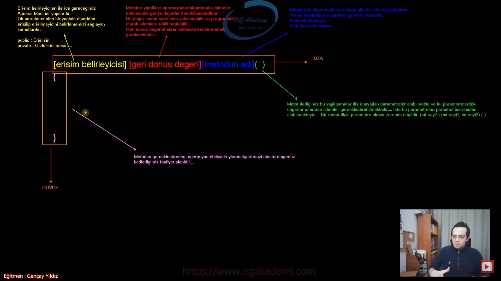

```C#
static void Main(string[] args)
{
    
}
```

- Main bir metottur. Eğer ki bir metodu hiçbirşeyle işaretlemiyorsan default olarak `private`tır. Ama yine de istersen `private` ile işaretleyebilirsin.
    * `void` geri dönüş değeridir.
    * `string[] args` parametresi vardır. Metot gövdesinden `args`a erişim sağlayabilirsin.

***
# 384) İşlevine Göre Metot Türleri Nelerdir?
- Metodu oluşturabilmek için metot imzasını bilmek gerekiyor. Ama sadece iş bilmekle yetmiyor Bu imza üzerinden yapacağınız işleme göre yapacağınız faaliyete göre metodun türünü varyasyonunu da belirlemeniz gerekiyor.

- Bir operasyon yapmanız lazım ve yapacağınız operasyonu artık bir metotta yapmanız gerektiğinin farkındasınız. Çünkü yapacağınız bu operasyon farklı yerlerde çağırılması temas edilmesi gereken bir operasyon olabilir. Şimdi farklı yerlerin her birinde sen bu kodları tekrar yazmaktansa bunu metot içerisinde yazacaksın. Yazdıktan sonra ilgili metodu lazım olan noktalarda çağıracaksın. Metodun en önemli noktası zaten bu. Yani bir program parçacığı haline gelen bu yapılanmayı sen istediğin yerde tetikleyebiliyorsun.

- Yapacağınız işe göre işin niteliğine göre ya da sonuca göre yazacağınız metot bu imza fıtratında değişkenlik yani varyasyon gösterebilir. İmza değişmez imza aynı olacak sadece farklı varyasyonlarda metot oluşturmanız gerekecektir.
 * Örneğin yapacağın işleme göre bir metot oluşturulacaksa bu işlem dışarıdan parametre alıyorsa oluşturduğun metot parametre alan bir metot olmalı. Ya da ilgili işlemi yaptıktan sonra geriye programatik bir değer döndüreceksen geriye değer döndüren bir fonksiyon olmalıdır.

- Yapılacak işleme göre 4 farklı türde/varyasyonda fonksiyon/metot oluşturulabilmektedir. Bu tüm programalama dilleri için geçerlidir. Tüm türlerin yani varyasyonların imzası yani imza fıtratı gövdesi vs. hepsi aynı. Sadece buradaki yapı değişiyor.
    1. Geriye Değer Döndürmeyen. Parametre Almayan. => Yapacağın işleme göre ilgili metot geriye değer döndürmeyebilir. Aynı zamanda parametre almayanda bir metot olabilir. Yani oluşturacağın metot hem dışarıdan bir değer almıyor hem de geriye bir değer döndürmüyor.
    2. Geriye Değer Döndürmeyen Parametre Alan.
    3. Geriye Değer Döndüren Parametre Almayan => Yapacağın fonksiyon geriye bir değer döndürüyor programatik ama dışarıdan bir değer almıyor.
    4. Geriye Değer Döndüren Parametre Alan 

- Programlamada hangi dilde çalışırsanız çalışın bir fonksiyonu oluşturabilmeniz için yapacağınız işleme göre işlemin niteliğine göre işlemdeki amacınıza göre bu 4 farklı varyasyon üzerinden fonksiyon oluşturmanız gerekecektir.


- `[erişim belirleyici] [geriye dönüş türü] [Metot Adı](......){}` => Tüm varyasyonlarda imzamız yine birebir olacaktır. Bu kalıp üzerinde 4 farklı şekilde fonksiyon yaklaşımı oluşturabilmekteyim


***
# 385) Metot Tanımlama/Oluşturma Varyasyonları - Geriye Değer Döndürmeyen Parametre Almayan Metot Türü
- Metotlar `class` elemanıdır. İleride Object Oriented'da da `struct` dediğimiz yapılanmada eleman olarak kullanacağız.

- Local Function'lara gelene kadar metot içinde metot oluşturmuyoruz.

- Bir metot oluşturmam lazım yapacağım bir algoritma var. Eğer ki bu algoritma dışarıdan herhangi bir parametre almayacaksa ve yapılan işlem neticesinde programatik olarak geriye bir değer döndürmeyecekse geriye değer döndürmeyen parametre almayan metotun içerisinde yapılabilmektedir.

- `[erişim belirleyici] [geri dönüş değeri] [metot adi](...........)`
    * [Erişim Belirleyici] => Metot tanımlarken ilk olarak erişim belirleyicisi dediğimiz keywordü yazıyoruz.
        + Bu oluşturacağım yapının erişilip erişilmemesinin kararını veriyordu.
    * Ardından geri dönüş değerini bildiririz.
    * Ardından metoda bir isim veriyorduk.
    * Ardından parantezlerimizi açarak parametreleri tanımlıyorduk ve scope'umuzu açarak gerekli işlemlerimizi gerçekleştiriyoruz.
    
- Bir metot geriye değer döndürmüyorsa geriye dönüş değerini boş bırakamazsınız. C#'ta bir metodun geriye değer döndürmeyeceğini ifade edebilmeniz için `void` Keywordünü kullanmanız lazım 

- Bir metot geriye değer döndürmüyorsa bunun `void` ile bildirilmesi ZORUNLUDUR!!

- Sen `void`i gördüğün zaman diyeceksin ki bu metot geriye herhangi bir değer döndürmüyor. `void` yerine başka bişey olsaydı örneğin `int`,`string`, `ahmet` diye bir tür işte o zamanda ne yazıyorsa onu geriye döndürmen gerekiyordu.

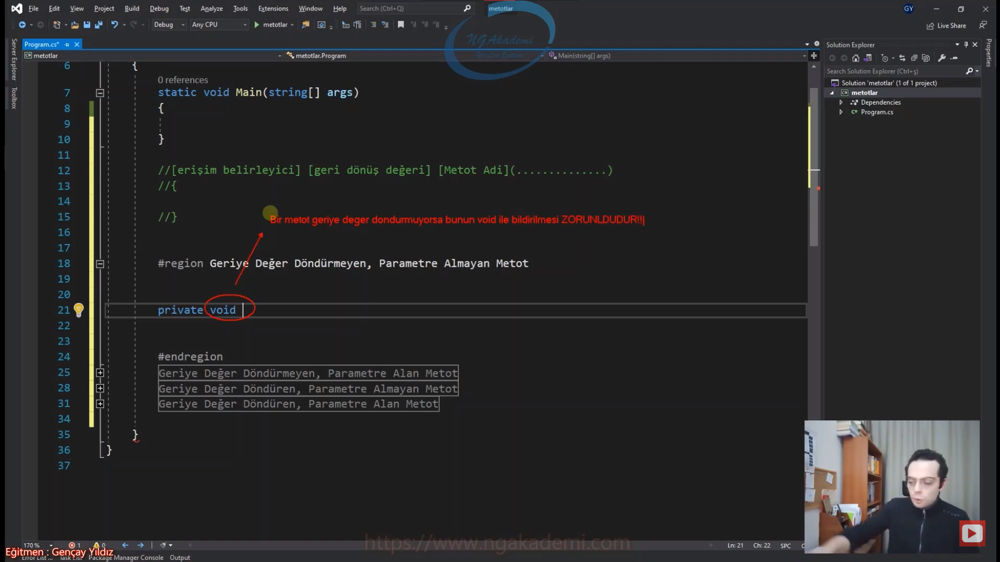

- Eğer ki bir metot dışarıdan değer almayacaksa yani parametre almaycaksa parantez'i açıyorsun kapatıyorsun. İçeriye herhangi parametre bildirisinde bulunmana gerek yok.

- Geriye değer döndürmek demek ekrana çıktı vermek demek değildir bunu unutmayın!!!

```C#
#Geriye Değer Döndürmeyen, Parametre Almayan Metot
private void Metot1()//=> Metot1 isminde bir metot oluşturduk dışarıdan erişilemeyen Metot1 ismindeki bu metot geriye herhangi bir değer dönmüyor ve parametre 
almıyor. Bu metotla istediğinizi yapabilirsiniz. İçeride istersen `for` döngüsüyle milyonlarca dön `switch - case`ler `try catch`ler artık aklına ne geliyorsa 
ihtiyacın neyse onu yap. Sadece geriye bir değer döndürmüyor dışarıdan da değer almıyor. 
{
    System.Console.WriteLine("Geriye Değer Döndürmeyen, Parametre Almayan Metot oluşturuldu");
}
```

***
# 386) Metot Tanımlama/Oluşturma Varyasyonları - Geriye Değer Döndürmeyen Parametre Alan Metot Türü
- Eğer ki yapacağınız operasyon geriye herhangi bir değer döndürmeyecek ama dış dünyadan herhangi bir değer alacaksa bu şekilde bir imzada fonksiyon oluşturmamız gerekecektir.

- Yine fonksiyon oluştururken erişim belirleyicisi ile başlayacağız. Geriye değer döndürmediği için `void` keywordünü kullanırız. Daha sonra bir isim veririz. Şimdi bunun parametre alabilmesi için parametre alan bir fonksiyon olabilmesi için burada benim herhangi bir türde parametre tanımlamam gerekiyor.

- `void` keywordünü gördüğünde aklına ne gelecek? bu metot geriye herhangi bir değer göndermiyor/döndürmüyor.

- Metotlardaki parametrelerde normal bildiğiniz değişkenlerin ta kendileridir.

- Metotlarda sınırsız sayıda parametre değeri girebilirsiniz. 

- Parametreler bizim için normal bildiğiniz değişkenlerdir.

- Oluşturmuş olduğunuz metotlardaki parametre değerlerine metodun gövdesinden yani scope'undan yani bir başka deyişle faaliyet alanında erişebilmekteyiz. Ve bu değerleri içeride kullanabilmekteyiz.

- Eğer ki bir değişken metodun parametre kısmında tanımlanıyorsa biz buna terminolojik olarak parametre diyeceğiz. Yok eğer bu değişken metodun içerisinde ya da `class`ın içerisinde tanımlanıyorsa biz buna değişken diyeceğiz. Hatta OOP'ye geçtiğimizde orada göreceksiniz ki bir değişken `class`ın içerisinde tanımlanıyorsa buna biz field diyeceğiz. Yani tanımlandığı yere göre ismi değişiyor. Çünkü sorumluluğu değişiyor. Davranışı değişiyor.

- Geriye değer döndürmeyen parametre kaç tane olursa olsun en az bir tane aldığı sürece parametre alan bir fonksiyon oluşturduk.

- Bir iş yaparken oluşturacağınız fonksiyonun ulan Updageriye değer döndüren parametre alan diye düşünmenize gerek yok. Yapacağınız iş hangi türde fonksiyon oluşturmanız gerektiğini size söyleyecektir.

- Bir fonksiyonun geriye değer dönüp dönmemesi bir parametre alıp almaması senin yapacağın işle/senle alakalıdır. Bunu belirleyecek olan iş ve sensin.

```C#
#Geriye Değer Döndürmeyen, Parametre Alan Metot
public void Metot2(int a)//Burada `int` türünde a isminde bir değişken tanımladım artık oldu mu sana geriye değer döndürmeyen parametre alan bir fonksiyon.
{
} 
public void Metot3(int a, bool b)
{
}
public void Metot2(int a, bool b, char c)
{
    
}
```

***
# 387) Metot Tanımlama/Oluşturma Varyasyonları - Geriye Değer Döndüren Parametre Almayan Metot Türü
- Bu fonksiyonlarda geriye programatik kesinlikle bir değer döndüreceğiz. Bu değerden kastımız herhangi bir türdeki değer olabilir. `int`/`ahmet`/`mehmet`/`char` olabilir. `string`/`boolean` aklına ne geliyorsa olabilir. Amma velakin dışarıdan parametre alıyor mu almıyor mu ona göre zaten varyasyonlarımızı değerlendireceğiz.

- ` [erişim belirleyici] [geri dönüş değeri] [Metot Adi](........){}`  Yine aynı imzaya sahip olmalı.
    * İlk olarak erişim belirleyiciyi yazarız. 
    * Ardından geriye değer döndüren fonksiyon oluşturacaksak eğer `void` diyemeyiz. Onun yerine döndüreceğimiz türü bildirmeliyiz. 
    * Ardından ismini bildirmeliyiz.

- geriye değer döndüren fonksiyon oluşturacaksak eğer buna `void` diyemeyiz. `void`de geriye bir değer döndürmediğinizi ifade ediyordunuz. Artık geriye bir değer döndüreceğinizi bildirmeniz gerekiyor. `int` gibi `bool` gibi `char` gibi geriye değer döndüreceğiniz değerin türünü bildirmeniz gerekiyor. Bunu bildirerek benim fonksiyonum geriye bildirdiğim türde değer döndürecek demiş oluyoruz.

- Eğer ki bir metot geriye herhangi bir türde değer döndüreceğini ifade ediyorsa yani herhangi bir türde ben geriye değer döndüreceğim diyorsa kesinlikle o türde bir değer DÖNDÜRMELİDİR!!! Aksi taktirde HATA VERİR.

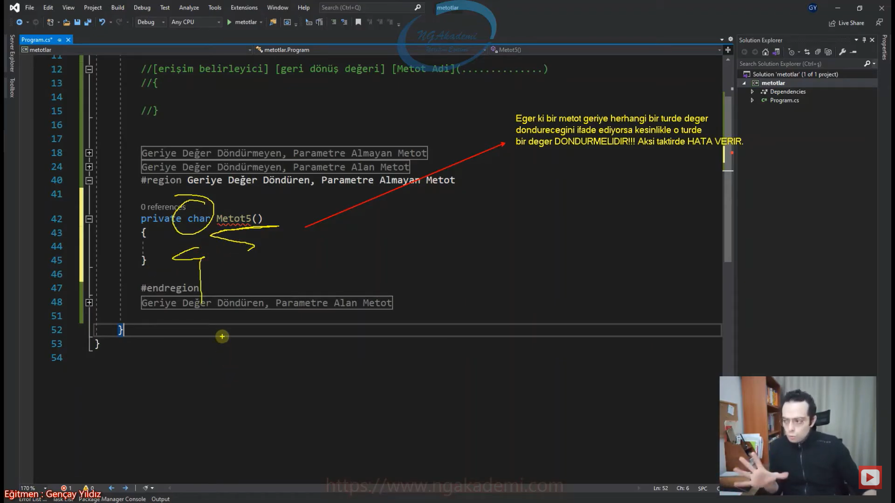

- Bir metot geriye değer döndüreceğim diyorsa ve biz eğer ki içeride/metot gövdesinde belirtilen türde değer döndürme yapmazsak eğer hata verir. Geriye değer döndüren fonksiyonlarda geriye bir değer döndürmek zorunludur. 

- Geriye değer döndüren fonksiyonlarda ilgili türde geriye bir değer döndürebilmemiz için `return` keywordünü kullanmaktayız. `return` geriye değer döndüren fonksiyonlarda değeri döndürmemizi sağlayan bir keyworddür. Kodun içerisinde herhangi bir yerde `return` diyip geri dönüş türüm neyse o türde bir değer döndürürüz.

- Geriye değer döndüren fonksiyonlarda bildirilen türde bir değer döndürebilmek için `return` keywordünü kullanmamız gerekmektedir. `return` keywordü ilgili fonksiyonda geriye değer döndürmemizi sağlıyor. 

- `return`; nerede işlenirse orada ilgili fonksiyondan/metottan çıkılır. Yani bir fonksiyon içerisinde herhangi bir yerde `return` komutunu tetiklettiysem o fonksiyon komple sona erecektir. Dolayısıyla bunun ikinci sorumluluğuda burada devreye giriyor. `return` tetiklendiği yerde ilgili fonksiyondan çıkış yaparken bir yandan da eğer ki o fonksiyon geriye değer döndürüyorsa değer de döndürmeni sağlayan bir keyworddür.

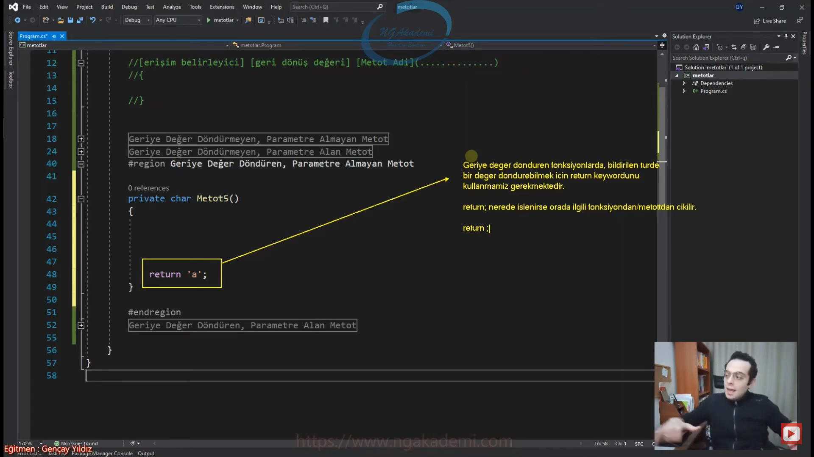

- Biz belirli şartlara göre geriye değer döndürebiliriz.

- Belirli bir şarta göre değer döndüreceğiniz durumlar varsa şunu sakın demeyin. Ben `return`ü kullandığım halde hala bu hata veriyor. Niye veriyor. Şimdi compiler az buçuk bunu da bir yapay zeka olarak düşünün. Nihayetinde diyor ki adam sana şartın `false` olduğu durumlarda da bu fonksiyonu çağırdığında ilgili fonksiyon geriye yine bir değer döndürebilmelidir. Yani şartın her iki durumunda da değer döndürmen gerekir. Bunu unutmayacaksın aksi taktirde yine hata verecektir.

- İçeride bir condition kullanıyorsan eğer tüm durumlara göre `return` değeri döndürmen gerekiyor. 

- Bir metot geriye değer döndürecekse döndüreceği değerin türü neyse bildirilmelidir. 

- Aynı şekilde eğer ki bir metot geriye değer döndürecekse yani bildirim yapıldıysa kesinlikle geriye bir değer döndürmelidir.

- Bildirilen tür ne ise o türe uygun değerler döndürülmelidir. Eğer ki sen `char` dediğin halde `bool` bir değer döndürmeye çalışırsan derleyici hatası alırsın. Zaten bu programlamada da geçerli olan bir ahlak. Elimdeki herhangi bir değişkene o değişken türünden değer nasıl atıyorsam elinde bir türü yani geri dönüş türü her neyse o türden bir değeri geriye döndürebiliyorum. Hep tür neyse o türdeki değerlerle çalışabiliyorum. Zaten programlamanın temel mantığı buradan gelir.

- Bir fonksiyonu oluştururken eğer ki `private` olacaksa yani dışarıdan erişilmesini istemiyorsanız `private` keywordünü kullanmanıza gerek yok. Yazsan da `private` `private`tır. Yazmadığın taktirde de C# programlama dilinde default olarak tanımlanan erişim belirleyicisi yine `private` olacaktır. Eğer ki `public` olmasını istiyorsan o zaman gidip iradenle bunu yazman gerekecektir.

- Fonksiyonda geriye değer döndürme sürecinde artık değeri nerede döndürüyorsanız ilgili yerde `return` keywordünü zaten kullanmak zorundasınız. Koca programlamada `return`den başka geriye değer döndüren bir keyword yok. 

- `return`ü kodun içinde görüyorsanız bilin ki ilgili fonksiyonun değerini sonlandırıyor ve varsa yanında bir değer o değeri de geri döndürüyor. Haliyle yazmış olduğunuz algoritmanın içinde `return`le herhangi bir değeri döndürüyorsanız orada fonksiyon sona erecek ve oradaki değeri geriye döndürecektir. Sonraki `return`lerin hiçbirini tetiklemeyecektir. Bu `return`ün normal davranışı olarak bizlere yansımaktadır.

```C#
#Geriye Değer Döndüren, Dışarıdan Parametre Almayan Metot
private char Metot5()//Metot5 isminde dışarıdan erişilemeyen geriye de `char` türünden bir değer döndüren fonksiyon oluşturmuş olduk. Eğer ki bu fonksiyon geriye değer döndüreceğini bildirdiği halde değer döndürmezse hata verir. Aynı şekilde geriye değeri `return` ile döndürdüğümde hata da gidiyor.
{
    return 'a';
}
private int Metot6()
{
    if (DateTime.Now.Second > 10)
        return 5;
    return 123;
}
```

***
# 388) Metot Tanımlama/Oluşturma Varyasyonları - Geriye Değer Döndüren Parametre Alan Metot Türü
- Yine aynı şekil metot imzası geçerlidir.

- ` [erişim belirleyici] [geri dönüş değeri] [Metot Adi](........){}`  Yine aynı imzaya sahip olmalı.
    * İlk olarak erişim belirleyiciyi yazarız. 
    * Ardından geriye değer döndüren fonksiyon oluşturacaksak eğer `void` diyemeyiz. Onun yerine döndüreceğimiz türü bildirmeliyiz. 
    * Ardından ismini bildirmeliyiz.

- Bir metot geriye değer döndürüyorsa kesinlikle `return`le bildirilen türde bir değeri geriye döndürmemiz gerekiyordu. Geriye döndürdüğümüz tür bildirdiğimiz türle uyumlu olmalıdır.

- `return [işlem yapılabilir]` keywordü devamında işlem yapmaya müsaade eder. Yani şöyle bir işlem örneğin ternary operatörü ile gelip burada bir değer dönebilirsiniz. Ya da belirli karşılaştırma ya da mantıksal sonuçlar dönebilirsiniz. Eğer ki `bool` türde birşey dönüyorsak. Yani sen ilgili türde değer dönde nasıl işlem yaparsan yap önemli değildir.

- Basit bir hesap makinesi de yapsanız uzaya füzede gönderseniz farketmiyor yapacağınız tüm işlerde kesinlikle bu 4 varyasyondan birini oluşturmanız gerekecek. Bunun dışında başka bir varyasyon yok. 

- Siz bir operasyon yaparken bir metot oluşturacaksanız eğer ulan ben geriye değer döndüren mi oluşturacam parametre alacak mı vs. diye düşünmene gerek yok. Bunları düşünerek kod yazamazsın. Yapacağın işlemi düşün yapacağın işlem zaten olması gereken fonksiyonu sana koyacaktır/yaptıracaktır. Sen buradan yola çıkarak yapacağın işlemi uygun bir fonksiyon koyamazsın. İşten yola çıkarak o işe uygun fonksiyonu ortaya koyabilirsin.

- Metodu kullanmak demek çağırmak ya da ilgili metodu tetiklemek demektir.

```C#
#Geriye Değer Döndüren, Parametre Alan Metot
public bool Metot7(int x)
{
    return true || false;
}
public int Metot8(int x)
{
    return DateTime.Now.Year > 2000 ? 1 : 0;
}
```

***
# 389) Metodun Geriye Değer Döndürmesi Ne Demektir?
- Metot kod yazma sürecinde bir işlemi bir faaliyeti yani bir fiiliyatı bir operasyonu bir algoritmayı yapıyorsa bunu yapmanı sağlayan ortamı sağlayacak olan yapıdır. Yani bir başka deyişle metot bir işlem/operasyon/algoritma artık bunun gibi bir fiiliyatı yaptığın yegane yerdir. Bir işlem yapacaksan programlamada metodun içerisinde yaparsın. Başka hiçbir yerde yapamazsın.
    * Veritabanına veri göndermek bir işlem midir? işlemdir. Bir fiiliyat var. Veritabanına veri ekliyorsun. Bir fiiliyatın olduğu bu işlem metodun içinden başka bir yerde yapılamaz. 1 + 1 bir işlem midir? işlemdir. Metodun dışında başka bir yerde yapamazsın. Yani sen dünyanın en iyi programcısı ol metodun dışında 1 ile 1'i toplayamazsın. Onun dışında uzaya da füze gönder. Uzaya füze gönderirken bunu da metodun içinde yapman lazım. Bu da bir işlem yani algoritma gerektiren her türlü süreç metotların içerisinde yapılması gerekir.

- 1 ile 1'i toplayabilmen için kod dosyasının içerisinde illaki bir metodun olması gerekiyor. 1 ile 1'i toplamak bir işlemse bir fiiliyatsa ki fiiliyat bunu metodun dışında yapamazsın.

- Metot en küçük program/algoritma/operasyon/işlem/fiiliyat parçacığıdır... 
    * Yani sen veritabanına kayıt örneğinden yola çıkarsak bu algoritmayı gerçekleştireceksen bir metodun içinden başka şansın yoktur.
    * Neden En küçük program parçacığıdır diyorsun da program parçacığıdır demiyorsun?
        + Diyelim ki ben bir evi temizleyeceğim ben temizlik metoduyum bir yandan da perdeleri asacağım şimdi ben temizlik ve perde asma işleri ayrı işler ayrı fiiliyatlar olduğundan dolayı her ikisini yapabilirim ama ileride SOLID prensiplerini göreceksin. SOLID prensibi der ki bir metot iş yapsa dahi bir metot sadece bir iş yapmalı prensip olarak bunu prensip edin gardaşım der. Dolayısıyla bir metot sadece bir işlem yapacaksa iki tane işlemi yapabilir ama bir tanesine odaklı yap haliyle en küçük işlem yapan program parçacığı olsun mantığında hareket edilir. Bir metot birden fazla işlemi hem temizliği hem perde asmayı yapabilir. Ama ben diyorum ki perdeyi ben asayım temizliği sen yap. Ya da temizliği ben yapayım perdeyi sen as. Yani herkes bir tane iş yapsın. Dolayısıyla ondan dolayı en küçük program parçacığıdır denir. Ama bu en küçük program parçacığında birden fazla sorumluluk iş yaparak küçüklüğünden ziyade daha rezil hani tavsiye edilmeyen birden fazla sorumluluğu olan metotlar oluşturabilirsiniz. Bir yandan toplama işi yapıp bir yandan da veri tabanına kaydetme işlemini de bir metot yapabilir mi yapabilir ama prensip açısından bu doğru değildir. Yapabilirsin ama ilkelere aykırıdır. Dolayısıyla tanım açısından da buraya en küçük kelimesini getiriyoruz.

- Metot program parçacığıdır. Yani iş yapar. En küçük program parçacığı olmasının sebebi bu bizim ilkelerimiz doğrultusunda arzuladığımız halidir.

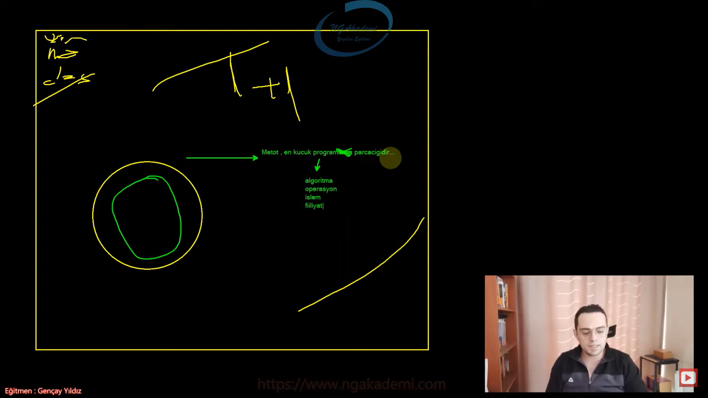

- Metot oluştururken access modifiers'larımızla başlarız.
    * public => Bu metodun dışarıdan erişilebilir olmasını sağlar.

- Metotlar geriye değer döndürebilen yapılardır. Eğer ki sayısal döndüreceksem `int` diyebilirim. mantıksal döndüreceksem `bool` diyebilirim. hiçbişey döndürmeyeceksem `void` diyebilirim.

- `void` keywordü kullanılıyorsa eğer bu metot iş yapar ama geriye bir değer döndürmez.

- Metodun ne iş yapacaksa ona göre imzayı oluşturuyordun.

- Bir metot geriye değer döndüreceğini bildirdiği halde içeride bir yerde geriye değer döndürmediysen o türde bir değer döndürmediysen hata verir. Der ki ya gardaşım sen bana hem burda değer döndüreceğini söylüyon hemde döndürmüyon bende ondan dolayı hata veriyorum. Değeri `return` keywordüyle döndürebiliriz.

- Oluşturduğum metodu `static` olan Main metodunda kullanabilmek için `static` ile işaretlememiz gerekir.

- Bir metodun geriye değer döndürmesi demek, içeride yapılan işlem neticesinde üretilen sonuçların ekrana yazılması demek DEĞİLDİR!

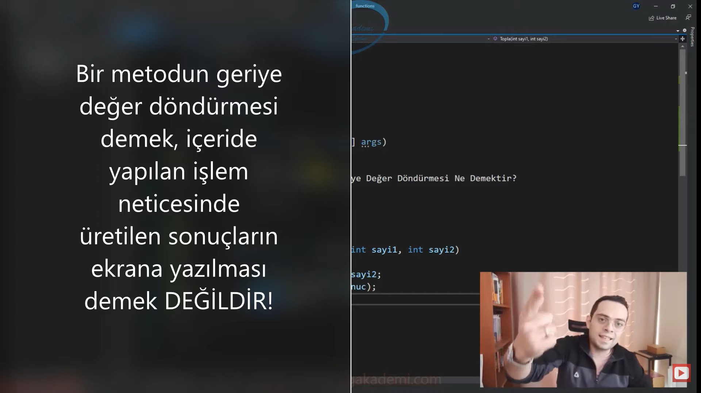

- Metodun değer döndürmesi demek ekrana çıktı vermesi demek değildir.

- Metodun değer döndürmesi demek, metodun yaptığı işlem neticesinde üretilen değeri ekrana/console/veritabanına herhangi bir log ekranına/web uygulamasına yani neresi olursa olsun mobile yani bir çıktı vermesi demek DEĞİLDİR!!!

- `return` ettiğin değer geriye döndürdüğün değerdir.

- Metdoun geriye döndürdüğü değer programatik olarak yakalanıp algoritmanın akışında farklı yönlendirmelere sebebiyet verebilen değerdir!!!

- Metotta bir işlem yapıyorsun yapmış olduğun süreçte işlem neticesinde bir sonuç elde ediyorsun elde ettiğin sonucu sen metotta geriye değer döndürürsen ilgili metodun çağırıldığı yerde o değeri sen yakalayıp algoritmanın devamında o değeri yani geri dönen değeri kullanıp farklı işlemlere tabi tutabiliyorsun. Yani metodun geriye değer döndürdüğü değer algoritmada akışta kullanılabilir değer oluyor.

- Metodun geriye döndürdüğü değer algoritmanın akışında kullanılabilir değerdir!!!

- Ekrana vermiş olduğunuz çıktı algoritmanın akışında kullanılabilir bir çıktı mıdır? Tabikide değildir. Sen ekrana merhaba dünya yazdın ya algoritma nerden bilsin ekrana ne yazdığını. Sen onu evirip çevirip farklı değerler yazabilirsin. Ya da ekrandaki farklı bir makyaja da tabi tutulabilir. Metodun geri dönüş değeri söz konusuysa bizi ekran çıktıları ya da veritabanına yazılanlar ilgilendirmiyor. Bizi metodun geriye dönen değeri bu yapılan işlem ile ilgili bir sonuç geriye döndürür. Bu sonucu da algoritmik olarak değerlendirebiliriz. 
    * Şimdi bir metodumuz var ve bu metot bir veritabanına personel ekleme operasyonu gerçekleştiriyor. Ama bizim şöyle bir kıstasımız var. Personel 20 yaşın altındaysa veritabanına eklenmesin. Şimdi sen metotta başlıyorsun ilgili değerleri gönderiyorsun. Adını soyadını, medeni halini vs. gönderdin. İçeride ekleme işlemi yapıyor ve buradaki değerleri veritabanına ekliyor. Eğer ki personelin yaşı 20'nin altındaysa eklemiyor. Şimdi sen bu göndermiş olduğun parametrelere uygun personelin veritabanına eklenip eklenmediğini nerden anlıyorsun. Senin metodun geriye `true` ya da `false` döndürüyor. Yakalıyorsun o değeri diyorsun ki eğer metodun döndürdüğü değer `true` ise demek ki veritabanına ekleme işlemi gerçekleştirilmiş Yok eğer `false` ise ekleme işlemi gerçekleştirilmemiş anlamına geliyor. Yani ben daha kodun devamını getiriyorum. Metottan dönen değer her neyse ben onu yakalayıp kodun içerisinde algoritmaya tabi tutabiliyorum. Algoritmamı ona göre şekillendirebiliyorum. Ama sen veritabanına veri kaydetmişsin kaydetmemişsin ekrana merhaba dünya yazmışsın o anda döviz kurunu takip ediyorsun ekranda başka şeyler dönüyor beni onlar ilgilendirmiyor `true` ya da `false`.
    * Şimdi ben PersonelEkle metodunu kullanırken personelin eklenip eklenmediğini gidip veritabanından kontrol etmeyeceğim bakmayacağım orada he demek ki eklenmiş o zaman bu herif 20'nin üzerindeymiş falan demeyeceğim. Metotta kontrol edip `true` ya da `false` döndüreceğim.

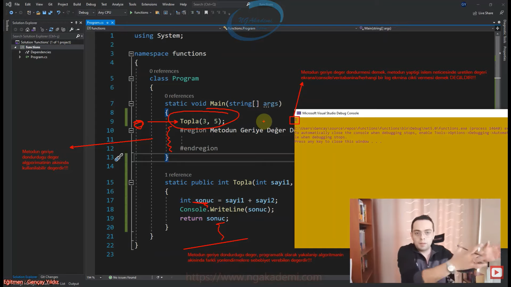

- Eğer bir metot geriye değer dönüyorsa aynı türde bir değişkenle ilgili fonksiyonun dönmüş olduğu değeri programatik olarak yakalayıp artık bu sonucun üzerinde farklı işlemler gerçekleştirebilirsin. Fonksiyonun geriye döndürdüğü sonucu değeri yakalayıp algoritmada farklı algoritmaları devreye sokabiliyorum. 

- Ekrana çıktı vermek ilgili metodun geriye döndürdüğü değerle alakalı bişey değildir. İlgili metodun geriye döndürdüğü değer algoritmada yakalanıp kullanılabilir orada tabi edilebilir bir değer oluyormuş.

- Akıştaki metodun yapmış olduğu değere göre sonucu elde edip farklı algoritmaları devreye sokabiliyorum. Bu sonucu farklı bir metoda gönderip orada farklı işlemler yaptırabiliyorum. vs vs vs. Yani anlayacağınız metodun geriye değer döndürmesi demek ekrana çıktı vermek demek değildir bu değeri programatik olarak yakalayıp farklı işlemlere tabi tutabilmemizi sağlayan bir özelliktir metotların yapısal niteliğidir.

- Eğer ki yazılımcı olacaksanız işin felsefesine hakim olmanız lazım haliyle bu felsefelerle bilinç altımızı ya da bilgilerimizi yoğurarak sağlam yazdığımızın ne olduğunu yazarken neyi yazdığımızı ne şekilde yazdığımızı hangi mantıkla yazdığımızı bilelim ki konuya tam hakim olalım. Yani biz bilgisayarla konuşurken kullandığımız dile ne kadar hakim olursak o kadar sağlam anlaşabiliriz. O kadar sağlam yazılımlar ortaya koyabiliriz. Bunlara bu bakış açılarını ne kadar iyi bilirseniz ileri düzeyi daha rahat anlarsınız. Yani bu temelde zorlandığın kadar ileri düzeyde zorlanmayacaksın. 

```C# 
static void Main(string[] args)
{
    int sonuc = Topla(3, 5);
    if (sonuc > 10)
    {
        System.Console.WriteLine("Sonuç 10'dan büyük");
    }
    bool sonuc2 = PersonelEkle("Rıfkı","Cümbül",25);
    if(sonuc2)
    {
    }
    else
    {
        
    }
    #region Metodun Geriye Değer Döndürmesi Ne Demektir?
    #endregion
}
    
static public bool PersonelEkle(string adi,string soyadi,int yas)
{
    if(yas>= 20)
    {
        //....Veritabanına eklendi
        return true;
    }else
    {
        System.Console.WriteLine("Personel 20'den küçük olamaz!");
        return false;
    }
}
static public int Topla(int sayi1, int sayi2)
{
    int sonuc = sayi1 + sayi2;
    System.Console.WriteLine(sonuc);//Burada ekrana yazdırdığın değer bu metodun döndürdüğü değer değil.
    return sonuc;
}
```

***
# 390) Metotlarda Optional Parameters(İsteğe Bağlı Parametreler)
- Metotlar parametrik yapılandırmalardır.

- Opsiyonel isteğe bağlı demek ister yap ister yapma. Örneğin sen arkadaşınla akşam görüşecek misin diye sorduğumda ya opsiyonel diyorsun yani belki görüşürüm belki görüşmem. İşte sallıyorum yarın maça gidecek misin opsiyonel belki giderim belki gitmem. Opsiyonel isteğe bağlı belki yaparsın belki yapmazsın.

- Opsiyonel parametreler yani parametreye ister değer gönder ister gönderme.

- Bir metot eğer parametreliyse normal şartlarda o metodu kullanırken/çağırırken/tetiklerken o metodun parametrelerini türlerine uygun değerleri göndermek zorundasın.

- Sen bir metot kullanıyorsan ve o metot parametreliyse bu parametrelere değeri göndermek zorundasın.

- Sen bir metodu kullanırken o metodun parametrelerine değer gönderme zorunluluğunu atmak istiyorsan o parametreleri opsiyonel şekilde göndermek ya da göndermemek istiyorsan opsiyonel hale getirmek istiyorsan ilgili parametreyi o parametre opsiyonel parametre olması gerekiyor.

- Parametreli bir metot kullanılırken/çağırılırken/tetiklenirken parametrelerine uygun değerler gönderilmek ZORUNLUDUR! 

- Eğer ki bir metodun parametrelerine zorunlu bir şekilde değer göndermek istemiyorsak, parametreye değeri isteğimize göre/opsiyonel olarak göndermek istiyorsak o parametrenin bu durumu karşılayabilecek bir özellikte olması gerekmektedir. İşte bu özelliğe opsiyonel parametreler denmektedir.

- Yani ilgili parametre eğer opsiyonel fıtratta bir parametreyse sen ona bir değer göndermek zorunda kalmıyorsun.

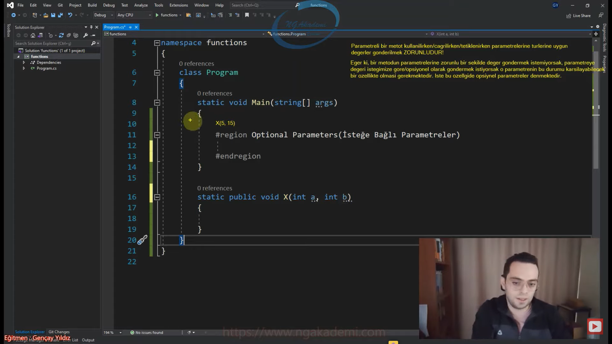

- `static public void X(int a, int b){}` direkt bu fonksiyonu çağırdığımızda hata alırız. Diyor ki bana ya gardaşım X'i çağıracaksan normal parametrelerine değeri göndermek zorundasınd aksi taktirde derleyici buna izin vermez sen bunu derlediğin zamanda hata alacaksın.

- Bir metot kullanılırken o metodun parametrelerine değer göndermek zorundasın.

- Bir parametrenin opsiyonel olması demek o parametrenin varsayılan/default değeri olması demektir. 

- Eğer ki sen bir parametreye değer göndermediğinde o parametre derleyici tarafından hangi değeri alacağını biliyorsa default olarak yani varsayılan olarak o zaman senin göndermene gerek duymuyor. Yani adam diyor ki ya gardaşım ben varsayılan bir parametreyim bana istersen değer gönder gönderdiğin değeri kabul ederim ona göre işleme tabi tutarım. Yok eğer değer göndermiyorsan benim varsayılan bir değerim var onu işleme tabi tutarım. Yani fonksiyona dış dünyadan illaki bir değer benden gidecek. Bu değer senin gönderdiğinde olabilir ya da default olarak bana verilen değerde olabilir. Artık buradaki karar senin diyor. Haliyle varsayılan bir default değer ayarlamamız gerekiyor.

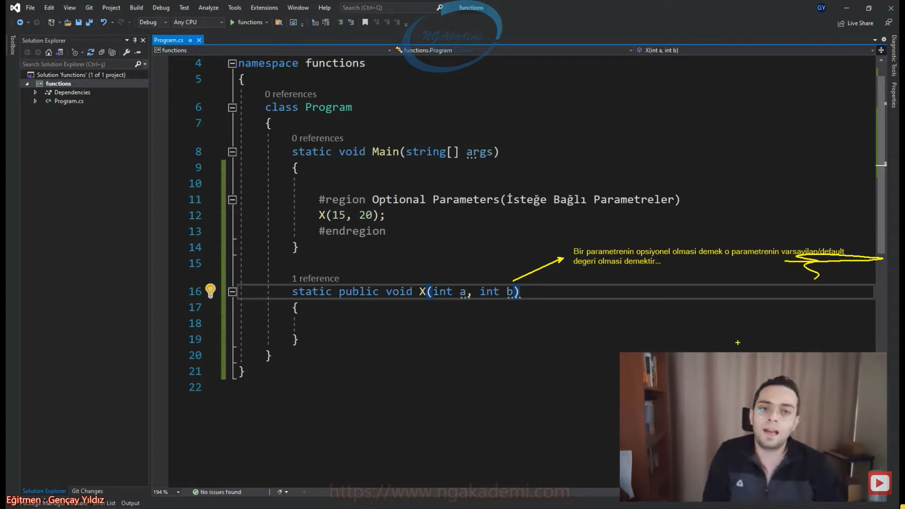

- Biz metotlarımızda parametrelerimize default değer atarsak o parametreler opsiyonel parametreler olacaktır. 

- Eğer ki parametreye assign operatörü(`=`) ile değer atarsam varsayılan değerini bildirmiş olurum. 

- Metot parametrelerine assign operatörü(`=`) ile bir değer atanırsa eğer o parametreye varsayılan değeri atanmış olur. Haliyle opsiyonel parametre haline getirilmiş olunur...

- Opsiyonel parametreye kullanıcı kullanırken bir değer göndermek zorunda değil.

- Bir metodun birden fazla parametresi de opsiyonel olabilir.

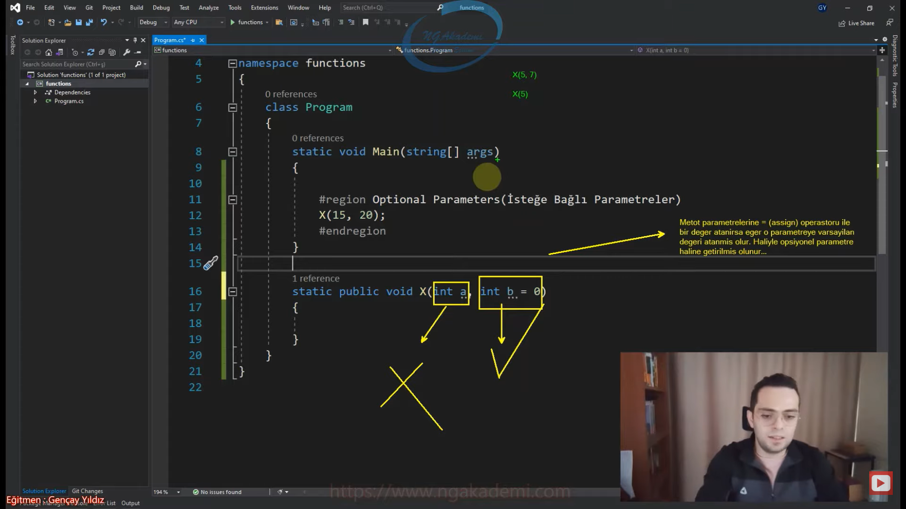

- Birden fazla parametre içerisinde bir kısmı opsiyonel olabilir mi?
    * Birden fazla parametre durumunda opsiyonel olanlar sağ tarafta TANIMLANMALIDIR!

- Opsiyonel olan parametreden sonra zorunlu olan bir parametre tanımlarsanız derleyici hatası alırsınız. Çünkü kullanım durumunda tutarsızlık meydana gelir.

- Buradaki karışıklığı engellemek için C# geliştiricileri tarafından opsiyonel olmayan parametreler sol tarafta opsiyonel olanlarda sağ tarafta olacak şekilde tanımlanması gerektiği söylenmiştir bu şekilde de problem ortadan kaldırılmıştır.

- Normalde bir metodun parametrlerine hizalı bir şekilde değerler göndermek zorundayız.

```C#
static void Main(string[] args)
{
    #region Optional Parameters(İsteğe Bağlı Parametreler)
    X(15, 20);
    X(15);
    X();
    X(5, 7);
    X(5);
    #region Kritik 1
    //Tüm parametreler opsiyonel olabilir.
    #endregion
    #region Kritik 2
    //Birden fazla parametre içerisinde bir kısmı opsiyonel olabilir mi?
    //Birden fazla parametre durumunda opsiyonel olanlar sağ tarafta TANIMLANMALIDIR!
    X(5, 10, 15);
    X(5,10);
    #endregion
    #endregion
}
static public void X(int a, int x, int y, int b = 0, int c = 0)
{
}
```

***
# 391) Tanımlanmış Metodun Kullanımı - Tanımlandığı Sınıf İçerisindeki Metotlar Tarafından Kullanımı
- Metotu biz `class` dediğimiz yapılanma içerisinde oluşturuyoruz. İleride OOP'de `struct` denilen yapılanmada da oluşturabildiğimizi göreceğiz.

- Bir metot tanımlandığı sınıf içerisindeki farklı bir metot içerisinden çağırılacaksa eğer tek yapılması gereken sadece isminin çağırılmasıdır/tetiklenmesidir/çalıştırılmasıdır.

- Aynı sınıfın içerisinde birden fazla metodumuz var. Bu metotlar birbilerini kullanacaksa eğer sınıfın ismiyle ilgili herhangi bir şey yazmana gerek yok. Aynı sınıfın içerisinde olduklarından dolayı bu metotlar isimsel olarak birbileriyle haberleşebilir. Yani birbirlerini tetikleyebilirler.

- Aynı sınıfın içerisinde tanımlanmış olan metotlar direkt kendi isimleri üzerinden başka bir metodun içinde çağrılabilmektedirler/tetiklenebilmektedirler.

- Bunun başka yöntemleri yok mu? İleri düzey programlamada göreceğiz Reflection dediğimiz yapılanma var. Onun dışında delegate dediğimiz yapılanma var bunla da sen herhangi bir metodu tetikleyebiliyorsun.

- Aynı sınıf içerisinde birden fazla metot var ve bu metotlar kendilerini çağırmaları tetiklemeleri gerekiyorsa direkt metodun ismini çağırman yeterli olacaktır.

- Metotların kullanımında şu ana kadar yapmış olduğumuz tüm çalışmalarda alışılageldiği üzere metodun imzasındaki parametreler neyse o parametrelere uygun değerleri göndermemiz gerekiyor. 

- Tanımlandığı sınıf içerisinde bir metodu farklı bir metotta kullanmak istiyorsanız ismi üzerinden erişim yapmanız yeterli olacaktır.

- `static` olan bir yapının içerisinde başka bir yapıyı metodu tetikleyeceksek onun da `static` olması gerekir.

```C#
class Program
{
    static void Main(string[] args)
    {
        #region Tanımlanmış Metodun Kullanımı
        //Tetikleme = Çağırma = Kullanım
        #region Tanımlandığı Sınıf İçerisinde Kullanımı
        //Bir metot tanımlandığı sınıf içerisindeki farklı bir metot içerisinden çağırılacaksa eğer tek yapılması gereken sadece isminin 
çağırılmasıdır/tetiklenmesidir/çalıştırılmasıdır.
        X();
        #endregion
        #region Başka Sınıflarda Kullanımı
        #endregion
    }

    static void X()
    {

    }
}

class Ornek
{
    public void A()
    {
        B();
    }

    private void B()
    {
        C(5);
    }
    private int C(int a)
    {
        return a;
    }
}
```