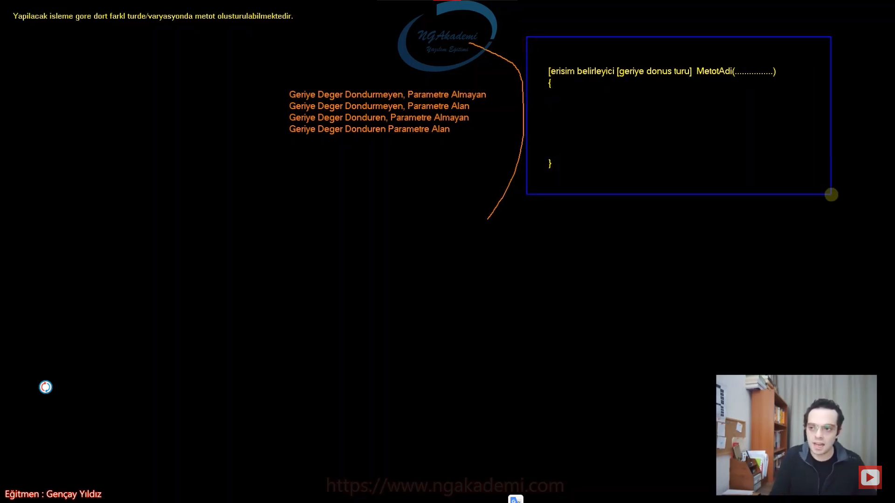

***
# 381) Metot Nedir? Bir Programcı Gözünden Ne İşe Yarar?
- Prosedürel programlamanın artık Object Oriented'a geçişini zorlayacak olan konudur metotlar.

- Nihayetinde metot sınıfın bir member'ıdır.

- Günlük hayatta biz metoda terminolojik açıdan yöntem/yordam/function diyebilmekteyiz. Yani bir fiili/eylemi/fiiliyatı temsil eden kelimelerdir.

- Örneğin ben günlük hayatta ben bir aşçıyım yemek yapıyorum yapmış olduğum yemekte kullandığım uyguladığım yöntem benim metodolojimi temsil eder. Yani metot dediğin kavram fiiliyatın ta kendisidir. onun terminolojik karşılığıdır/izahıdır.

- Diyelim ki ben bir akademisyenim araştırma yapıyorum yapmış olduğum araştırmalarda hatta akademik kaynağı elinize aldığınızda oradaki yapılan araştırmayla ilgili ya da yöntemle ilgili bilgi verilir size der ki buradaki araştırma şu metodoloji kullanılarak yapılmıştır. Bunu şöyle düşünebilirsiniz bir veri üretilmesi gerekiyor akademik dalda hangi yöntemle hangi terminolojiyle üretildiği ilgili kaynakta yazar. Biz buradaki istatistiksel verileri anket metodolojisini uygulayarak gerçekleştirdik. Yok efendime söyleyeyim gözlem metodolojisini uygulayarak gerçekleştirdik. 

- Metot dediğimiz yapılanma fiiliyattır/yöntemdir. Sen nasıl ki bir yemeği yaparken bu yöntemi kullanıyorsun yani oradaki metodu uygulamış oluyorsun. 
 
- Yazılımda gerçekleştirdiğimiz, fiili olarak gerçekleştirdiğimiz tümmmmmm operasyonlar bir metottur. Yazılıma geldiğimizde senin fiili açıdan gerçekleştirdiğin tüm operasyonlar bir metodolojidir haliyle bunların hepsi metot içerisinde olması gerekmektedir.

- Matematiğe gidersek eğer matematikte fonksiyonlar dediğimiz konular vardı fonksiyon yazılımdaki metodun ta karşılığıdır. Matematikteki fonksiyon ne yapıyorsa yazılımda da metotlar aynısını yapıyor. Metotlara bir diğer ismi fonksiyonda diyebiliyoruz birebir aynı isimle kullanılabilmekte. Şimdi sen matematikte diyorsun ki ya kardeşim benim elimde bir f(x) fonksiyonu var burada x'e verilen değer içeride bir bağıntıya/fiiliyata tabi tutulur. İşte metotta da böyle olacak yazılım açısından olayı değerlendirdiğinde sen diyeceksin ki benim elimde X diye bir metodum olacak bu metot şu operasyonları gerçekleştirecek diyeceksin yani yazılımda sen bir fiiliyat/operasyon gerçekleştireceksen bir algoritma yapacaksan `for` döngüsü `while` döngüsü `try - catch` mekanizması vs. yani kodu yazmak istiyorsan bunu metot içerisinde yapman gerekiyor.

- Sen bir operasyon gerçekleştirecen bir kod yazacaksın bunu metotlarda yapman gerekiyor.

- Metot prosedürel programlamanın temel elemanıdır. Bir iş/fiiliyat/operasyon yapan en küçük program parçacıklarıdır. 

- Metotlar bir yandan da Object Oriented'da object dediğimiz yapılanmanın temel member'ıdır. Dolayısıyla çok kritik bir konudur

- Seni bir yazılımın var bu yazılım istediğin gibi basitte olabilir çok devasa ağır yüksek bir yazılımda olabilir farketmiyor. Basit bir hesap makinesi eline al bu hesap makinasında operasyon/fiiliyat/işlem mi gerçekleştireceksin bunları kesinlikle metotla yapmak zorundasın. Aynı şekilde uzaya gönderdiğin bir füzen olsun orada devasa işlemler yapıyorsun buradaki işlemlerde metotta olmak zorunda. Yani metot yazılımın içerisinde fiiliyatı/operasyonu/algoritmayı çalıştırabileceğin tek yer başka bir yer yok. Metodun içerisinde kod yazabilirsin. Metodun dışındaki yerler tanımlama yerleridir. `class`/`struct`/`interface` tanımlarsın mimariyi oluşturursun ama kodu yazmazsın kodu yazdığın operasyonu/algoritmayı gerçekleştirdiğin yer metottur.

- Programlama açısından bir işi yapan en küçük programlama parçacığı metottur. 

- Örneğin yazmış olduğumuz kod otomasyonel bir kod olsun ve makinalara hitap eden ve hükmeden bir kod olduğunu düşünelim. Şimdi makinalara hitap eden hükmeden kod fiiliyat açısından hangi işi yapıyorsa orada bir metot tetikleniyor diye düşünebilirsiniz. Şöyle bir kod yoktur. Makinaya şunu diyemezsiniz ya hadi kapıyı aç kodunu çalıştır diyemezsiniz. Çünkü öyle bir kod yoktur. Makinaya kapıyı aç metodunu yazarsınız o metotla makinanın kapısı bir şekilde açılır. Metot işlem yapmanı sağlayan bir program parçacığıdır. Yani senin kapıyı açabilmen için oradaki motorları çalıştırman lazım belirli bir açıya kadar kapı dönecek işte döndüğü zaman durdurman lazım burada aslında çok fazla parametre var ve buradaki operasyonların hepsini bir bütün olarak program parçacığı olarak değerlendirirsek işte biz bunu metot olarak yazılımda tasarlıyoruz. Dolayısıyla sen otomasyonel bir sistemde kapıyı açan kodlarını/operasyonlarını yazdığın yapılanma kesinlikle metot olmak zorunda. Facebook'ta beğen butonu var değil mi? Beğen butonuna tıklandığında oradaki içeriği beğeniyor. İşte oradaki beğenme aktivetisinde bulunan yapılanma kesinlikle bir metot olmak zorunda. Youtube'a girdin Youtube'da gittin yorum yazdın değil mi? Yorumu yazdın dedin ki senin yapacağın videonun falan diye orada bir güzel yazdın yorumunu ardından enter'a bastın ya da yorum yap dedin oradaki yorumu alıp ilgili videoya yerleştiren o operasyonun sorumluluğunu üstlenen yapılanma kesinlikle bir metot olmak zorunda.

- `class` dediğimiz yapılanma var `interface` dediğimiz yapılanmalar var. Bilmediğin onlarca yapılanma var. Bunların hiçbirinde kod yazamazsın. Bunlarda en fazla yapabileceğin şey yapı tasarlamak. Yani ilgili örneğin `struct`. `struct` değer türlü nesneler oluşturmanı sağlayan bir yapılanma. E peki bu değer türlü nesne oluşturmanı sağlayan yapılanma bir operasyon yapar mı yapmaz.`struct` belki devas bişeymiş gibi gözükebilir sana ama operasyon yapmana müsaade etmez. Senin operasyon yapabilmen için nerede çalışıyorsan çalış bir tane metoda ihtiyacın var.

- Bir programcının yazılım içerisinde genel mimarisel tasarım genel böyle algoritmik yapılanmadan bahsetmiyoruz. Mimarisel tasarım ileride design pattern'ları göreceğiz. Hani belirli mimarisel kod tasarımlarımız vard. Bunların dışında özel spesifik algoritmalar/programlar/program parçacıkları/fiiliyatları yazarken bir yazılımcının kesinlikle metoda ihtiyacı vardır. Yani biz metotlar sayesinde kodlarımızı yazabiliyoruz algoritmalarımızı oluşturabiliyoruz.

- İleride property dediğimiz yapılanmalar olacak Object Oriented'da `class` memberlarında bunu göreceksiniz. Şimdi property dediğimiz yapılanmanın içerisinde de kod yazabiliriz orada herhangi bir algoritma yapabiliriz. Property özünde compiler seviyesinde bir metot olduğunu bilmeliyiz.

- Sen kod yazabiliyorsan algoritma operasyon yapabiliyorsan %1000 metodun dışında başka bir yerde çalışamazsın. Daha da ileride şey göreceğiz Nesnelerde kod yazabildiğimiz algoritmalarımızı oluşturabildiğimiz `constructor` yapılanmasını göreceğiz. `constructor`da bir metottur. Yani sen kod yazıcan,`if` yazıcan döngüler oluşturacaksın yok efendime söyleyeyim `try - catch`ler `switch - case`ler bilmemneler bunları yazabilecek kodun içerisinde bir yer arıyorsan kesinlikle bunun bir metot olması lazım.

- Biz bugüne kadar programlamayı öğrendiğimiz programlamayı öğrenirken yapmış olduğumuz işleri fiiliyatları operasyonları yazdığımız yer Main metoduydu. Main'de bir metottur. Çünkü şu ana kadar öğrendiklerimizi metodun dışında yazamazdık. Haliyle main bir ana metottur.

- Bir yazılımın var bu yazılımın içerisinde fiiliyat yapan en küçük bir kod parçacığıdır diyebiliriz. Yani burada bir algoritma/operasyon/fiiliyat mı yapacaksın işte bunları yapmanı sağlayan yapılanma metottur. Kodun diğer yapılanmaları işte Object Oriented'da öğreneceğimiz diğer yapılanmalar hep mimarisel açıdan tasarımla alakalıdır.

- Kodun içinde uzaya da füze göndersen hesap makinesi de yapsan hangi yazılım olduğu önemli değil herhangi bir kodun içerisinde 2 ile 2'yi toplamak istiyorsan yani bir fiiliyat/operasyon/iş değil mi bu. Bu işi yapabilmem için benim metoda ihtiyacım var. Metot koymadan yapamayız. Al yazılımı çöpe at bu vakit.


***
# 382) İşlevsel Açıdan Metot Bize Ne Kazandırır?
- Metot prosedürel programlamanın temel elemanıdır yani olmazsa olmaz yapılanmadır.

- Bir iş yapan en küçük iş parçacıklarına biz metot diyoruz. Buradaki işten kastımız algoritma/operasyon bir başka deyişle kodun içinde fiiliyat yani eylemde bulunmak istiyorsanız sen kesinlikle bir metotla çalışman gerekmektedir.

- Biz şu ana kadar bütün operasyonlarımızı Main metodunun içinde gerçekleştirmiştik.

- Biz yapacağımız fiiliyatlar algoritmalar operasyonlar her neyse bunların hepsi aynı kapıya çıkacak yani sen kodun içerisinde bir iş yapmak istiyorsan bu iş kesinlikle bir metodun içerisinde olmalıdır. Geri kalanı tasarımsal kısmıdır. Yani senin kodun içinde algoritmayı yazabilmen için gerekli tasarımı uygulaman lazım. İşte burada yeri gelecek `namespace` oluşturman lazım yeri gelecek bir `class` oluşturman lazım ki artık ilgili `class`ın içerisinde bir metod oluşturup kodunu yazabilesin.

- Metot dediğimiz yapılanmalar sınıfların elemanlarıdır. Birde ileride `struct` denilen yapılanmalar göreceğiz. Metotlar hem `struct`larda hem de `class`larda eleman olarak tanımlanabilmektedir. Yani kodun içerisine senin bir metot oluşturabilmen için ya bir `class` dediğimiz yapılanma içerisinde bu metodu tanımlaman lazım ya da ileride göreceğin `struct` dediğimiz yapılanma içerisinde tanımlaman gerekecektir. C# 9.0'da `record` dediğimiz yapılanmalar geldi bunlar fıtrat olarak `class`lar. Ama davranışsal olarak farklı `class`lar. Dolayısıyla bu `class`ların içerisinde de metotlar tanımlayabiliyoruz.

- Yani sen bir metot tanımlamak istiyorsan ya `class`ın içerisinde tanımlayacaksın ya da `struct`ın içinde tanımlayacaksın. Bunun dışında dediğim gibi metot operasyonu/eylemi gerçekleştirmek için çalıştığın alanı sana veriyor bu geri kalan yapılanmalar tanımlama aşamaları yani kodu inşa etmeni sağlayan yapılanmalar. Kodu operasyonu gerçekleştirdiğin fiiliyatı uyguladığın yer metodun ta kendisi.

- Basit bir hesap makinesinde 2 ile 2'yi toplamaya çalıştığınızda buradaki iş/fiiliyatta bir metodun içinde olduğunu söyleceksiniz. Benzer mantıkla devasa bir yazılım uzaya füze gönderdin giden füzenin işte veri alıyor değil mi bu verileri alıp işleyip sana bu verileri gönderen kodun içindeki alanında bir metot olduğunu bileceksin. Çünkü bu da bir eylem 2 ile 2'yi toplamakta bir eylem. Eylem mi var kodun içerisinde kesinlikle metodun içerisinde çalışmamız gerektiğini artık biliyoruz. 

- Hangi dile giderseniz gidin bu dillerin hepsinde operasyonlarınız kesinlikle metotlarda gerçekleştirilmekte. Hatta biz bu metotlar sınıf ve `struct` elemanları dedik. İleride bu sınıf ve `struct` elemanlarının altında bir de property dediğimiz diğer elemanları da inceleyeceğiz. Property'lerde özlerinde bir metot olduğunu konuşacağız. Nihayetinde property'lerde yapısal olarak içerisinde algoritmalar yani fiiliyatlar yapmamızı sağlayan yapılardır. Dolayısıyla bunu yapmanı sağlayan yapı kesinlikle metottur dediğim halde property bununla denk geldiğinde şunu bilmen gerekir. Property özünde yani compiler seviyesinde bir metottur.

- Metot bir kodun içerisinde operasyonel anlamda iş gerçekleştiren en küçük program parçası.

- Bir kodun var bu kodun içerisinde bir fiiliyatta/algoritma da bulunacaksan işte bunu yapmanı sağlayan metodundur.

- Metot dediğimiz yapılanma kodun içerisindeki tekrarları ortadan kaldırmamıza yaramaktadır. En önemli unsurlarından birisi de budur. Hem operasyon yapmanı sağlıyor hem de kodun içerisinde tekrar eden kodları tek seferlik tanımlayıp inşa edip ondan sonra her seferinde metot üzerinden bir daha inşa etmeye gerek kalmaksızın çağırmanı sağlayan bir yapılanmadır metot dediğin yapılanma.


- Şimdi bir operasyonunuz var. Diyelim ki bir sayılar dizisi oluşturdunuz ve buna da elemanlarını rastgele olarak döngüyle beraber atadınız ve sonra bu dizideki elemanları teker teker ekrana yazdırdığınızı varsayalım Peki bu operasyonu 3 defa art arda yapmak istersek ne yapacağız. Şimdi bu operasyonu 3 kere art arda yapabilmenin yolları birden fazla. Örneğin bu yapılanmayı döngüye alabiliriz. Ama diyelim ki biz arada farklı işlemler yapıyoruz. Yapmış olduğumuz bu farklı işlemler neticesinde ben aynı kodu bir daha tetikleyecem. Yani döngüyle hep belirli bir konsepti tetiklemeyecem. Belirli noktalarda hani sabit bir konsept üzerinde olmayan tekrarları yapmam gerektiği durumlarda benim buradaki tekrarlara ya manuel şekilde gerçekleştireceğim. yani tekrar sayısı kadar yazacağım. Kodu tekrar etmek çokta tercih edilir bir durum değildir. Nihayetinde siz burada yönetilebilirliği düşürmüş oluyorsunuz. Burada çıktıyı alırsınız sıkıntı yok ama bu kodun yönetilebilirliğine baktığınızda çıktıdan ziyade kaynağa baktığınızda yönetilebilirlik oldukça zayıf çünkü tekrarlarımız var. Eğer ki bir kodun içinde tekrarlar varsa bu kod bir sorgulanmalı. Evet kodun içinde tekrarlar var ve ben bunu döngüye alamıyorum çünkü arada farklı işlemler var ve bu farklı işlemler neticesinde benim bu kodu tekrarlı bir şekilde çağırmam lazım. İşte böyle bir durumda ben bu kodu yani tekrar eden kodu metoda alırız. Bir metot haline getiririz ve bu kodları lazım olduğu taktirde bu metodu ilgili yerlerde çağırırız. Bu şekilde tek seferde yazdığım kaynağı lazım olduğu taktirde tekrara düşmeden tekrar tekrar tetikleyebileceğim. Çağırmakla kodu tekrar yazmak arasında fark var. Tekrar tetiklemek bizim zaten amacımız bu ama tekrar tekrar kodu inşa etmek bu maliyetli ve kaçtığımız bir durum. Yani kesinlikle bir kodu tekrar tekrar yazmamanız lazım. Bir kere yazmanız lazım. Lazım olduğunda ilgili yerden yazmış olduğunuz yerden çağırmanız lazım. İstenmeyen hal burada kodun tekrar etmesidir. Ben bu kodu bir metod haline getirip buralardaki tekrarları bu metot üzerinden çağırırsam işte ideal koda bu şekilde erişmiş olurum.

- Metotlar içerisine yazılan kodun tekrarlı bir şekilde kullanılmasını sağlarlar.... ve bunu yaparken kaynak kodun tekrar etmesini de engellemiş olurlar.... Böylece ideal koda erişmiz oluruz.... 

- İdeal kod mümkün mertebe tekrar etmeyen koddur. Bir başka deyişle de ideal kodlamada tekrar etmeyen tekrarı engelleyen lazım olduğu taktirde bir kere tanımlayıp ondan sonraki her lazım olan noktada bu çağırabilen kodu inşa etmektir bizim amacımız. Örneğin ben bir aşçı olarak bir metodoloji uyguluyorum. Uyguladığım metodoloji sayesinde yemeğimi icra edebiliyorum. Yemek oluşturabiliyorum yani yemeğim ortaya çıkıyor. Şimdi aynı metodu başka bir aşçıya söylediğim zaman metodu birebir uyguladığında aynı lezzet birebir aynı şekilde aynı görüntüde aynı tadında yemek ortaya çıkacaktır. Dolayısıyla bir metot nerede çağırırsan çağır aynı işlemi yapacaktır ve senin yapmış olduğun bu metot bu metodun işlevini bir daha tekrar etmeni engelleyecektir. İşte çağırdığın yerde bu metot işlevsel olarak orayı işleyecek ama kodun tekrarını engelleyecek.


- Yazılmış olan bir kodu tekrar çağırmakla, tekrar yazmak arasında fark vardır!


***
# 383) Metot Anatomisi Nasıldır? Gelin Metot İmzasını İnceleyelim
- C# programlama dilinde bir metot oluşturabilmek için `class` içinde çalışmanız gerekmektedir.

- Kod dosyasına baktığınızda kodun içinde `class` yapılanmasının scope'unun içinde metodunuzu tanımlayabilirsiniz.

- Metot içinde metot tanımlayamıyoruz ta ki local function'ları öğrenene kadar. Diğer alternatifleri boşvereceğiz ve `class` elemanlarıdır diyeceğiz. Sadece `class` içinde tanımlanabilir diye kabul edeceğiz.

- Bir metot oluşturabilmek için yapmamız gereken bildiriler bulunmaktadır. 

- [erişim belirleyici] [geri dönüş değeri] [metot adı] () {}
    * Bir metot tanımlama sürecinde öncelikle metodun dışarıdan erişilebilirliğini ayarlayan erişim belirleyicisi(access modifiers) dediğimiz yapılanma bildirilir.
    * İkinci olarak tanımlamız gereken geri dönüş değeri vardır. 
    * Sonuncu olarak ise metodun adını bildirmemiz gerekecektir. 
    * Ardından bir metot tanımlaması yaptığımızdan dolayı parantez açıp kapatacağız. Parantezin içerisinde parametre dediğimiz yapılanmalar olacak. 
    * Nihai olarak ilgili metoda dair operasyonel kodlarımızı barındıracak olan kısmı yani scope'larımızı açıp kapatacağız.

- Erişim belirleyicisi dediğimiz keyword ile ilgili metodu işaretleyeceğiz. Ardından bu metot geri dönüş değeri ne olabilir bunu bildireceğiz ve ardından bu metoda her şeye verdiğimiz gibi bir isim vereceğiz nasıl ki değişkenlere veriyoruz `class`lara veriyoruz aynı şekilde metoda da bir isim vereceğiz. Bir metodun olmazsa olmazı parantezi açıp kapatacaksınız ve son olarak scope yani yapılacak operasyonları barındıracak kodları yazılacağı yer olan scopelarımızı açacağız. 

- Erişim belirleyicileri(access modifiers) ileride göreceğimiz yapılardır. Oluşturulmuş olan bir yapının dışarıdan erişilip erişilmeyeceğini belirlemizi sağlayan komutlardır. Sen bir kod yazdın metot yazdın yazdığın metoda dışarıdan erişilsin mi erişilmesin mi bu dışarıdan kastımız bilgisayarın dışı ya da farklı bir aygıt değil bu bizzat bu kodun içerisinde bu metodun yazıldığı sınıfın nesnesi üzerinden erişilsin mi erişilmesin mi? 

- Dışarıdan erişilmesini istiyorsan yani yazılmış bu fonksiyona metoda erişilsin birisi kullanabilsin istiyorsan bunu `public` ile işaretlemen lazım. Yok eğer erişilmesin kardeşim benim yazdığım metoda bir tek ben erişebilirim başkası erişemez diyorsan `private` ile işaretlemen lazım.

- Metotlar yaptıkları operasyonlar/algoritmalar/işlemler neticesinde geriye değerler dönebilmektedirler. Bu değer programatik olarak yakalanabilir ve programatik olarak işlemlere tabi tutulabilir. Geri dönüş değerini ekranın çıktısıyla karıştırmamak gerekmektedir... Metodun geriye dönmüş olduğu bu değer programatik olarak kullanılabilir. Yani bu metotta yapılan işlem neticesinde Console'a ekrana bir çıktı veriyorsun ya o geri dönüş değeri değildir KARIŞTIRILMAMALIDIR! Geri dönüş değeri dediğin kavram programatik olarak tetiklenen metodun yapmış olduğu işlem neticesinde döndüğü değeri kodun içerisinde devam edebilmek yani o değeri alıp kodun içinde farklı yerlerde kullanabilmektir. Geri dönüş değeri programatik olarak kodun içinde kullanılabilen bir değerdir.

- Sen şimdi ekrana Merhaba Dünya diye bir çıktı verdin. Sen fonksiyon üzerinden vermiş olabilirsin ama bu fonksiyonun geri dönüş değeri değildir. Bu operasyonun gereğinden birisidir. Ekrana bişey yazması mı lazım yapılan algoritma da yani ilgili metodun içerisindeki operasyon ekrana bunu yazması gerekiyorsa bunu yazmıştır. Bu çıktı geri dönüş değeri olmuyor ama geri dönüş değeri dediğimiz kavram programatik olarak yani senin ekrana yazmış olduğun Merhaba Dünya programatik olarak yakalnıp içeride işleme tabi tutulmaz. Amma velakin senin metodun geriye 1/3/5/"Hilmi" dönebilir. Dönen bu değerleri biz programatik olarak yakalayıp işleme tabi tutabiliriz. `if`le `switch`le vs. böyle akış kontrol mekanizmalarıyla kontrol edip farklı algoritmaları tetikleyebiliriz. 

- Programın içerisinde bu metodun yapmış olduğu sonuç neticesinde ben daha farklı işlemler yapacaksam geri dönüş değerini kullanmam gerekecek. Örneğin diyelim ki bir öğrencinin geçip kalma durumunu hesaplayan bir fonksiyon geliştirdiğimi düşünün. Şimdi bu fonksiyon içinde yapmış olduğu işlem neticesinde geriye `true` ya da `false` dönüyor. Bu `true` ya da `false`a göre bu metodun dönmüş olduğu değere göre ben ilgili fonksiyonun değerini yakalayıp gerçek çıktıyı verebiliyorum. Diyorum ki kaldın ya da geçtin kardeşim. İşte bunu yapabilmem için ilgili fonksiyon içerideki işlem neticesinde bu öğrencinin kalıp geçtiğini programatik olarak geri döndürmeli ki ben bunu tekrardan check edip ona göre çıktılar verebileyim.

- Programlama geleneğinde her yapılanmanın bir ismi vardır. Dolayısıyla metodunda bir ismi olması gerekmektedir.

- Metotlarda da diğer yapılarda olguğu gibi bir isim almaktadırlar. Temel isimlendirme kuralları geçerlidir.

- Metot dediğimiz bu yapılanmalar dış dünyadan parametreler alabilmekte ve bu parametlerdeki değerler üzerinde işlemler gerçekleştirebilmektedir... İşte bu parametreleri parantez içerisinden alabilmekteyiz..... Bir metot illaki parametre almak zorunda değildir. Eğer ki parametre alıyorsa burada alınacak parametrenin türü cinsi belirtilmelidir.  Birden fazla parametre alabilir.
    * Örneğin `(int sayi1)` `(int sayi1, int sayi2)` ,`()`

- Metot dediğimiz yapılanma dışarıdan değerler alıp ki biz bu değerlere parametreler diyoruz. bu parametrelerden gelen değerler üzerinde kendi içinde işlemler gerçekleştirebiliyor. Haliyle bunu yaparken bu parametreleri tanımlayabildiğimiz yegane yer parantezin içidir. Parantez içerisinden biz parametreleri alabilmekteyiz. 


- Scope'lar Metodun gerçekleştireceği operasyonu/fiiliyatı/eylemi/algoritmayı oluşturduğumuz kodladığımız faaliyet alanıdır...

- `[erişim belirleyici] [geri dönüş değeri] [metot adı] ()` => Sen bir metodu ele aldığında hangi dilde olursan ol bu kısım metodun imzası diye geçer.
- `{}` => Metodun gövdesi diye geçer.
    * Bu çok önemlidir. Çünkü ileride `interface`leri ele alırken `interface`lerde metotların sadece imzaları tasarlanır gövdeleri oluşturulmaz. Gövdeleri concrete'lere bırakılır.


```C#
static void Main(string[] args)
{
    
}
```

- Main bir metottur. Eğer ki bir metodu hiçbirşeyle işaretlemiyorsan default olarak `private`tır. Ama yine de istersen `private` ile işaretleyebilirsin.
    * `void` geri dönüş değeridir.
    * `string[] args` parametresi vardır. Metot gövdesinden `args`a erişim sağlayabilirsin.

***
# 384) İşlevine Göre Metot Türleri Nelerdir?
- Metodu oluşturabilmek için metot imzasını bilmek gerekiyor. Ama sadece iş bilmekle yetmiyor Bu imza üzerinden yapacağınız işleme göre yapacağınız faaliyete göre metodun türünü varyasyonunu da belirlemeniz gerekiyor.

- Bir operasyon yapmanız lazım ve yapacağınız operasyonu artık bir metotta yapmanız gerektiğinin farkındasınız. Çünkü yapacağınız bu operasyon farklı yerlerde çağırılması temas edilmesi gereken bir operasyon olabilir. Şimdi farklı yerlerin her birinde sen bu kodları tekrar yazmaktansa bunu metot içerisinde yazacaksın. Yazdıktan sonra ilgili metodu lazım olan noktalarda çağıracaksın. Metodun en önemli noktası zaten bu. Yani bir program parçacığı haline gelen bu yapılanmayı sen istediğin yerde tetikleyebiliyorsun.

- Yapacağınız işe göre işin niteliğine göre ya da sonuca göre yazacağınız metot bu imza fıtratında değişkenlik yani varyasyon gösterebilir. İmza değişmez imza aynı olacak sadece farklı varyasyonlarda metot oluşturmanız gerekecektir.
 * Örneğin yapacağın işleme göre bir metot oluşturulacaksa bu işlem dışarıdan parametre alıyorsa oluşturduğun metot parametre alan bir metot olmalı. Ya da ilgili işlemi yaptıktan sonra geriye programatik bir değer döndüreceksen geriye değer döndüren bir fonksiyon olmalıdır.

- Yapılacak işleme göre 4 farklı türde/varyasyonda fonksiyon/metot oluşturulabilmektedir. Bu tüm programalama dilleri için geçerlidir. Tüm türlerin yani varyasyonların imzası yani imza fıtratı gövdesi vs. hepsi aynı. Sadece buradaki yapı değişiyor.
    1. Geriye Değer Döndürmeyen. Parametre Almayan. => Yapacağın işleme göre ilgili metot geriye değer döndürmeyebilir. Aynı zamanda parametre almayanda bir metot olabilir. Yani oluşturacağın metot hem dışarıdan bir değer almıyor hem de geriye bir değer döndürmüyor.
    2. Geriye Değer Döndürmeyen Parametre Alan.
    3. Geriye Değer Döndüren Parametre Almayan => Yapacağın fonksiyon geriye bir değer döndürüyor programatik ama dışarıdan bir değer almıyor.
    4. Geriye Değer Döndüren Parametre Alan 

- Programlamada hangi dilde çalışırsanız çalışın bir fonksiyonu oluşturabilmeniz için yapacağınız işleme göre işlemin niteliğine göre işlemdeki amacınıza göre bu 4 farklı varyasyon üzerinden fonksiyon oluşturmanız gerekecektir.


- `[erişim belirleyici] [geriye dönüş türü] [Metot Adı](......){}` => Tüm varyasyonlarda imzamız yine birebir olacaktır. Bu kalıp üzerinde 4 farklı şekilde fonksiyon yaklaşımı oluşturabilmekteyim



***
# 385) Metot Tanımlama/Oluşturma Varyasyonları - Geriye Değer Döndürmeyen Parametre Almayan Metot Türü
- Metotlar `class` elemanıdır. İleride Object Oriented'da da `struct` dediğimiz yapılanmada eleman olarak kullanacağız.

- Local Function'lara gelene kadar metot içinde metot oluşturmuyoruz.

- Bir metot oluşturmam lazım yapacağım bir algoritma var. Eğer ki bu algoritma dışarıdan herhangi bir parametre almayacaksa ve yapılan işlem neticesinde programatik olarak geriye bir değer döndürmeyecekse geriye değer döndürmeyen parametre almayan metotun içerisinde yapılabilmektedir.

- `[erişim belirleyici] [geri dönüş değeri] [metot adi](...........)`
    * [Erişim Belirleyici] => Metot tanımlarken ilk olarak erişim belirleyicisi dediğimiz keywordü yazıyoruz.
        + Bu oluşturacağım yapının erişilip erişilmemesinin kararını veriyordu.
    * Ardından geri dönüş değerini bildiririz.
    * Ardından metoda bir isim veriyorduk.
    * Ardından parantezlerimizi açarak parametreleri tanımlıyorduk ve scope'umuzu açarak gerekli işlemlerimizi gerçekleştiriyoruz.
    
- Bir metot geriye değer döndürmüyorsa geriye dönüş değerini boş bırakamazsınız. C#'ta bir metodun geriye değer döndürmeyeceğini ifade edebilmeniz için `void` Keywordünü kullanmanız lazım 

- Bir metot geriye değer döndürmüyorsa bunun `void` ile bildirilmesi ZORUNLUDUR!!

- Sen `void`i gördüğün zaman diyeceksin ki bu metot geriye herhangi bir değer döndürmüyor. `void` yerine başka bişey olsaydı örneğin `int`,`string`, `ahmet` diye bir tür işte o zamanda ne yazıyorsa onu geriye döndürmen gerekiyordu.


- Eğer ki bir metot dışarıdan değer almayacaksa yani parametre almaycaksa parantez'i açıyorsun kapatıyorsun. İçeriye herhangi parametre bildirisinde bulunmana gerek yok.

- Geriye değer döndürmek demek ekrana çıktı vermek demek değildir bunu unutmayın!!!

```C#
#Geriye Değer Döndürmeyen, Parametre Almayan Metot
private void Metot1()//=> Metot1 isminde bir metot oluşturduk dışarıdan erişilemeyen Metot1 ismindeki bu metot geriye herhangi bir değer dönmüyor ve parametre 
almıyor. Bu metotla istediğinizi yapabilirsiniz. İçeride istersen `for` döngüsüyle milyonlarca dön `switch - case`ler `try catch`ler artık aklına ne geliyorsa 
ihtiyacın neyse onu yap. Sadece geriye bir değer döndürmüyor dışarıdan da değer almıyor. 
{
    System.Console.WriteLine("Geriye Değer Döndürmeyen, Parametre Almayan Metot oluşturuldu");
}
```

***
# 386) Metot Tanımlama/Oluşturma Varyasyonları - Geriye Değer Döndürmeyen Parametre Alan Metot Türü
- Eğer ki yapacağınız operasyon geriye herhangi bir değer döndürmeyecek ama dış dünyadan herhangi bir değer alacaksa bu şekilde bir imzada fonksiyon oluşturmamız gerekecektir.

- Yine fonksiyon oluştururken erişim belirleyicisi ile başlayacağız. Geriye değer döndürmediği için `void` keywordünü kullanırız. Daha sonra bir isim veririz. Şimdi bunun parametre alabilmesi için parametre alan bir fonksiyon olabilmesi için burada benim herhangi bir türde parametre tanımlamam gerekiyor.

- `void` keywordünü gördüğünde aklına ne gelecek? bu metot geriye herhangi bir değer göndermiyor/döndürmüyor.

- Metotlardaki parametrelerde normal bildiğiniz değişkenlerin ta kendileridir.

- Metotlarda sınırsız sayıda parametre değeri girebilirsiniz. 

- Parametreler bizim için normal bildiğiniz değişkenlerdir.

- Oluşturmuş olduğunuz metotlardaki parametre değerlerine metodun gövdesinden yani scope'undan yani bir başka deyişle faaliyet alanında erişebilmekteyiz. Ve bu değerleri içeride kullanabilmekteyiz.

- Eğer ki bir değişken metodun parametre kısmında tanımlanıyorsa biz buna terminolojik olarak parametre diyeceğiz. Yok eğer bu değişken metodun içerisinde ya da `class`ın içerisinde tanımlanıyorsa biz buna değişken diyeceğiz. Hatta OOP'ye geçtiğimizde orada göreceksiniz ki bir değişken `class`ın içerisinde tanımlanıyorsa buna biz field diyeceğiz. Yani tanımlandığı yere göre ismi değişiyor. Çünkü sorumluluğu değişiyor. Davranışı değişiyor.

- Geriye değer döndürmeyen parametre kaç tane olursa olsun en az bir tane aldığı sürece parametre alan bir fonksiyon oluşturduk.

- Bir iş yaparken oluşturacağınız fonksiyonun ulan Updageriye değer döndüren parametre alan diye düşünmenize gerek yok. Yapacağınız iş hangi türde fonksiyon oluşturmanız gerektiğini size söyleyecektir.

- Bir fonksiyonun geriye değer dönüp dönmemesi bir parametre alıp almaması senin yapacağın işle/senle alakalıdır. Bunu belirleyecek olan iş ve sensin.

```C#
#Geriye Değer Döndürmeyen, Parametre Alan Metot
public void Metot2(int a)//Burada `int` türünde a isminde bir değişken tanımladım artık oldu mu sana geriye değer döndürmeyen parametre alan bir fonksiyon.
{
} 
public void Metot3(int a, bool b)
{
}
public void Metot2(int a, bool b, char c)
{
    
}
```

***
# 387) Metot Tanımlama/Oluşturma Varyasyonları - Geriye Değer Döndüren Parametre Almayan Metot Türü
- Bu fonksiyonlarda geriye programatik kesinlikle bir değer döndüreceğiz. Bu değerden kastımız herhangi bir türdeki değer olabilir. `int`/`ahmet`/`mehmet`/`char` olabilir. `string`/`boolean` aklına ne geliyorsa olabilir. Amma velakin dışarıdan parametre alıyor mu almıyor mu ona göre zaten varyasyonlarımızı değerlendireceğiz.

- ` [erişim belirleyici] [geri dönüş değeri] [Metot Adi](........){}`  Yine aynı imzaya sahip olmalı.
    * İlk olarak erişim belirleyiciyi yazarız. 
    * Ardından geriye değer döndüren fonksiyon oluşturacaksak eğer `void` diyemeyiz. Onun yerine döndüreceğimiz türü bildirmeliyiz. 
    * Ardından ismini bildirmeliyiz.

- geriye değer döndüren fonksiyon oluşturacaksak eğer buna `void` diyemeyiz. `void`de geriye bir değer döndürmediğinizi ifade ediyordunuz. Artık geriye bir değer döndüreceğinizi bildirmeniz gerekiyor. `int` gibi `bool` gibi `char` gibi geriye değer döndüreceğiniz değerin türünü bildirmeniz gerekiyor. Bunu bildirerek benim fonksiyonum geriye bildirdiğim türde değer döndürecek demiş oluyoruz.

- Eğer ki bir metot geriye herhangi bir türde değer döndüreceğini ifade ediyorsa yani herhangi bir türde ben geriye değer döndüreceğim diyorsa kesinlikle o türde bir değer DÖNDÜRMELİDİR!!! Aksi taktirde HATA VERİR.


- Bir metot geriye değer döndüreceğim diyorsa ve biz eğer ki içeride/metot gövdesinde belirtilen türde değer döndürme yapmazsak eğer hata verir. Geriye değer döndüren fonksiyonlarda geriye bir değer döndürmek zorunludur. 

- Geriye değer döndüren fonksiyonlarda ilgili türde geriye bir değer döndürebilmemiz için `return` keywordünü kullanmaktayız. `return` geriye değer döndüren fonksiyonlarda değeri döndürmemizi sağlayan bir keyworddür. Kodun içerisinde herhangi bir yerde `return` diyip geri dönüş türüm neyse o türde bir değer döndürürüz.

- Geriye değer döndüren fonksiyonlarda bildirilen türde bir değer döndürebilmek için `return` keywordünü kullanmamız gerekmektedir. `return` keywordü ilgili fonksiyonda geriye değer döndürmemizi sağlıyor. 

- `return`; nerede işlenirse orada ilgili fonksiyondan/metottan çıkılır. Yani bir fonksiyon içerisinde herhangi bir yerde `return` komutunu tetiklettiysem o fonksiyon komple sona erecektir. Dolayısıyla bunun ikinci sorumluluğuda burada devreye giriyor. `return` tetiklendiği yerde ilgili fonksiyondan çıkış yaparken bir yandan da eğer ki o fonksiyon geriye değer döndürüyorsa değer de döndürmeni sağlayan bir keyworddür.


- Biz belirli şartlara göre geriye değer döndürebiliriz.

- Belirli bir şarta göre değer döndüreceğiniz durumlar varsa şunu sakın demeyin. Ben `return`ü kullandığım halde hala bu hata veriyor. Niye veriyor. Şimdi compiler az buçuk bunu da bir yapay zeka olarak düşünün. Nihayetinde diyor ki adam sana şartın `false` olduğu durumlarda da bu fonksiyonu çağırdığında ilgili fonksiyon geriye yine bir değer döndürebilmelidir. Yani şartın her iki durumunda da değer döndürmen gerekir. Bunu unutmayacaksın aksi taktirde yine hata verecektir.

- İçeride bir condition kullanıyorsan eğer tüm durumlara göre `return` değeri döndürmen gerekiyor. 

- Bir metot geriye değer döndürecekse döndüreceği değerin türü neyse bildirilmelidir. 

- Aynı şekilde eğer ki bir metot geriye değer döndürecekse yani bildirim yapıldıysa kesinlikle geriye bir değer döndürmelidir.

- Bildirilen tür ne ise o türe uygun değerler döndürülmelidir. Eğer ki sen `char` dediğin halde `bool` bir değer döndürmeye çalışırsan derleyici hatası alırsın. Zaten bu programlamada da geçerli olan bir ahlak. Elimdeki herhangi bir değişkene o değişken türünden değer nasıl atıyorsam elinde bir türü yani geri dönüş türü her neyse o türden bir değeri geriye döndürebiliyorum. Hep tür neyse o türdeki değerlerle çalışabiliyorum. Zaten programlamanın temel mantığı buradan gelir.

- Bir fonksiyonu oluştururken eğer ki `private` olacaksa yani dışarıdan erişilmesini istemiyorsanız `private` keywordünü kullanmanıza gerek yok. Yazsan da `private` `private`tır. Yazmadığın taktirde de C# programlama dilinde default olarak tanımlanan erişim belirleyicisi yine `private` olacaktır. Eğer ki `public` olmasını istiyorsan o zaman gidip iradenle bunu yazman gerekecektir.

- Fonksiyonda geriye değer döndürme sürecinde artık değeri nerede döndürüyorsanız ilgili yerde `return` keywordünü zaten kullanmak zorundasınız. Koca programlamada `return`den başka geriye değer döndüren bir keyword yok. 

- `return`ü kodun içinde görüyorsanız bilin ki ilgili fonksiyonun değerini sonlandırıyor ve varsa yanında bir değer o değeri de geri döndürüyor. Haliyle yazmış olduğunuz algoritmanın içinde `return`le herhangi bir değeri döndürüyorsanız orada fonksiyon sona erecek ve oradaki değeri geriye döndürecektir. Sonraki `return`lerin hiçbirini tetiklemeyecektir. Bu `return`ün normal davranışı olarak bizlere yansımaktadır.

```C#
#Geriye Değer Döndüren, Dışarıdan Parametre Almayan Metot
private char Metot5()//Metot5 isminde dışarıdan erişilemeyen geriye de `char` türünden bir değer döndüren fonksiyon oluşturmuş olduk. Eğer ki bu fonksiyon geriye değer döndüreceğini bildirdiği halde değer döndürmezse hata verir. Aynı şekilde geriye değeri `return` ile döndürdüğümde hata da gidiyor.
{
    return 'a';
}
private int Metot6()
{
    if (DateTime.Now.Second > 10)
        return 5;
    return 123;
}
```

***
# 388) Metot Tanımlama/Oluşturma Varyasyonları - Geriye Değer Döndüren Parametre Alan Metot Türü
- Yine aynı şekil metot imzası geçerlidir.

- ` [erişim belirleyici] [geri dönüş değeri] [Metot Adi](........){}`  Yine aynı imzaya sahip olmalı.
    * İlk olarak erişim belirleyiciyi yazarız. 
    * Ardından geriye değer döndüren fonksiyon oluşturacaksak eğer `void` diyemeyiz. Onun yerine döndüreceğimiz türü bildirmeliyiz. 
    * Ardından ismini bildirmeliyiz.

- Bir metot geriye değer döndürüyorsa kesinlikle `return`le bildirilen türde bir değeri geriye döndürmemiz gerekiyordu. Geriye döndürdüğümüz tür bildirdiğimiz türle uyumlu olmalıdır.

- `return [işlem yapılabilir]` keywordü devamında işlem yapmaya müsaade eder. Yani şöyle bir işlem örneğin ternary operatörü ile gelip burada bir değer dönebilirsiniz. Ya da belirli karşılaştırma ya da mantıksal sonuçlar dönebilirsiniz. Eğer ki `bool` türde birşey dönüyorsak. Yani sen ilgili türde değer dönde nasıl işlem yaparsan yap önemli değildir.

- Basit bir hesap makinesi de yapsanız uzaya füzede gönderseniz farketmiyor yapacağınız tüm işlerde kesinlikle bu 4 varyasyondan birini oluşturmanız gerekecek. Bunun dışında başka bir varyasyon yok. 

- Siz bir operasyon yaparken bir metot oluşturacaksanız eğer ulan ben geriye değer döndüren mi oluşturacam parametre alacak mı vs. diye düşünmene gerek yok. Bunları düşünerek kod yazamazsın. Yapacağın işlemi düşün yapacağın işlem zaten olması gereken fonksiyonu sana koyacaktır/yaptıracaktır. Sen buradan yola çıkarak yapacağın işlemi uygun bir fonksiyon koyamazsın. İşten yola çıkarak o işe uygun fonksiyonu ortaya koyabilirsin.

- Metodu kullanmak demek çağırmak ya da ilgili metodu tetiklemek demektir.

```C#
#Geriye Değer Döndüren, Parametre Alan Metot
public bool Metot7(int x)
{
    return true || false;
}
public int Metot8(int x)
{
    return DateTime.Now.Year > 2000 ? 1 : 0;
}
```

***
# 389) Metodun Geriye Değer Döndürmesi Ne Demektir?
- Metot kod yazma sürecinde bir işlemi bir faaliyeti yani bir fiiliyatı bir operasyonu bir algoritmayı yapıyorsa bunu yapmanı sağlayan ortamı sağlayacak olan yapıdır. Yani bir başka deyişle metot bir işlem/operasyon/algoritma artık bunun gibi bir fiiliyatı yaptığın yegane yerdir. Bir işlem yapacaksan programlamada metodun içerisinde yaparsın. Başka hiçbir yerde yapamazsın.
    * Veritabanına veri göndermek bir işlem midir? işlemdir. Bir fiiliyat var. Veritabanına veri ekliyorsun. Bir fiiliyatın olduğu bu işlem metodun içinden başka bir yerde yapılamaz. 1 + 1 bir işlem midir? işlemdir. Metodun dışında başka bir yerde yapamazsın. Yani sen dünyanın en iyi programcısı ol metodun dışında 1 ile 1'i toplayamazsın. Onun dışında uzaya da füze gönder. Uzaya füze gönderirken bunu da metodun içinde yapman lazım. Bu da bir işlem yani algoritma gerektiren her türlü süreç metotların içerisinde yapılması gerekir.

- 1 ile 1'i toplayabilmen için kod dosyasının içerisinde illaki bir metodun olması gerekiyor. 1 ile 1'i toplamak bir işlemse bir fiiliyatsa ki fiiliyat bunu metodun dışında yapamazsın.

- Metot en küçük program/algoritma/operasyon/işlem/fiiliyat parçacığıdır... 
    * Yani sen veritabanına kayıt örneğinden yola çıkarsak bu algoritmayı gerçekleştireceksen bir metodun içinden başka şansın yoktur.
    * Neden En küçük program parçacığıdır diyorsun da program parçacığıdır demiyorsun?
        + Diyelim ki ben bir evi temizleyeceğim ben temizlik metoduyum bir yandan da perdeleri asacağım şimdi ben temizlik ve perde asma işleri ayrı işler ayrı fiiliyatlar olduğundan dolayı her ikisini yapabilirim ama ileride SOLID prensiplerini göreceksin. SOLID prensibi der ki bir metot iş yapsa dahi bir metot sadece bir iş yapmalı prensip olarak bunu prensip edin gardaşım der. Dolayısıyla bir metot sadece bir işlem yapacaksa iki tane işlemi yapabilir ama bir tanesine odaklı yap haliyle en küçük işlem yapan program parçacığı olsun mantığında hareket edilir. Bir metot birden fazla işlemi hem temizliği hem perde asmayı yapabilir. Ama ben diyorum ki perdeyi ben asayım temizliği sen yap. Ya da temizliği ben yapayım perdeyi sen as. Yani herkes bir tane iş yapsın. Dolayısıyla ondan dolayı en küçük program parçacığıdır denir. Ama bu en küçük program parçacığında birden fazla sorumluluk iş yaparak küçüklüğünden ziyade daha rezil hani tavsiye edilmeyen birden fazla sorumluluğu olan metotlar oluşturabilirsiniz. Bir yandan toplama işi yapıp bir yandan da veri tabanına kaydetme işlemini de bir metot yapabilir mi yapabilir ama prensip açısından bu doğru değildir. Yapabilirsin ama ilkelere aykırıdır. Dolayısıyla tanım açısından da buraya en küçük kelimesini getiriyoruz.

- Metot program parçacığıdır. Yani iş yapar. En küçük program parçacığı olmasının sebebi bu bizim ilkelerimiz doğrultusunda arzuladığımız halidir.


- Metot oluştururken access modifiers'larımızla başlarız.
    * public => Bu metodun dışarıdan erişilebilir olmasını sağlar.

- Metotlar geriye değer döndürebilen yapılardır. Eğer ki sayısal döndüreceksem `int` diyebilirim. mantıksal döndüreceksem `bool` diyebilirim. hiçbişey döndürmeyeceksem `void` diyebilirim.

- `void` keywordü kullanılıyorsa eğer bu metot iş yapar ama geriye bir değer döndürmez.

- Metodun ne iş yapacaksa ona göre imzayı oluşturuyordun.

- Bir metot geriye değer döndüreceğini bildirdiği halde içeride bir yerde geriye değer döndürmediysen o türde bir değer döndürmediysen hata verir. Der ki ya gardaşım sen bana hem burda değer döndüreceğini söylüyon hemde döndürmüyon bende ondan dolayı hata veriyorum. Değeri `return` keywordüyle döndürebiliriz.

- Oluşturduğum metodu `static` olan Main metodunda kullanabilmek için `static` ile işaretlememiz gerekir.

- Bir metodun geriye değer döndürmesi demek, içeride yapılan işlem neticesinde üretilen sonuçların ekrana yazılması demek DEĞİLDİR!


- Metodun değer döndürmesi demek ekrana çıktı vermesi demek değildir.

- Metodun değer döndürmesi demek, metodun yaptığı işlem neticesinde üretilen değeri ekrana/console/veritabanına herhangi bir log ekranına/web uygulamasına yani neresi olursa olsun mobile yani bir çıktı vermesi demek DEĞİLDİR!!!

- `return` ettiğin değer geriye döndürdüğün değerdir.

- Metdoun geriye döndürdüğü değer programatik olarak yakalanıp algoritmanın akışında farklı yönlendirmelere sebebiyet verebilen değerdir!!!

- Metotta bir işlem yapıyorsun yapmış olduğun süreçte işlem neticesinde bir sonuç elde ediyorsun elde ettiğin sonucu sen metotta geriye değer döndürürsen ilgili metodun çağırıldığı yerde o değeri sen yakalayıp algoritmanın devamında o değeri yani geri dönen değeri kullanıp farklı işlemlere tabi tutabiliyorsun. Yani metodun geriye değer döndürdüğü değer algoritmada akışta kullanılabilir değer oluyor.

- Metodun geriye döndürdüğü değer algoritmanın akışında kullanılabilir değerdir!!!

- Ekrana vermiş olduğunuz çıktı algoritmanın akışında kullanılabilir bir çıktı mıdır? Tabikide değildir. Sen ekrana merhaba dünya yazdın ya algoritma nerden bilsin ekrana ne yazdığını. Sen onu evirip çevirip farklı değerler yazabilirsin. Ya da ekrandaki farklı bir makyaja da tabi tutulabilir. Metodun geri dönüş değeri söz konusuysa bizi ekran çıktıları ya da veritabanına yazılanlar ilgilendirmiyor. Bizi metodun geriye dönen değeri bu yapılan işlem ile ilgili bir sonuç geriye döndürür. Bu sonucu da algoritmik olarak değerlendirebiliriz. 
    * Şimdi bir metodumuz var ve bu metot bir veritabanına personel ekleme operasyonu gerçekleştiriyor. Ama bizim şöyle bir kıstasımız var. Personel 20 yaşın altındaysa veritabanına eklenmesin. Şimdi sen metotta başlıyorsun ilgili değerleri gönderiyorsun. Adını soyadını, medeni halini vs. gönderdin. İçeride ekleme işlemi yapıyor ve buradaki değerleri veritabanına ekliyor. Eğer ki personelin yaşı 20'nin altındaysa eklemiyor. Şimdi sen bu göndermiş olduğun parametrelere uygun personelin veritabanına eklenip eklenmediğini nerden anlıyorsun. Senin metodun geriye `true` ya da `false` döndürüyor. Yakalıyorsun o değeri diyorsun ki eğer metodun döndürdüğü değer `true` ise demek ki veritabanına ekleme işlemi gerçekleştirilmiş Yok eğer `false` ise ekleme işlemi gerçekleştirilmemiş anlamına geliyor. Yani ben daha kodun devamını getiriyorum. Metottan dönen değer her neyse ben onu yakalayıp kodun içerisinde algoritmaya tabi tutabiliyorum. Algoritmamı ona göre şekillendirebiliyorum. Ama sen veritabanına veri kaydetmişsin kaydetmemişsin ekrana merhaba dünya yazmışsın o anda döviz kurunu takip ediyorsun ekranda başka şeyler dönüyor beni onlar ilgilendirmiyor `true` ya da `false`.
    * Şimdi ben PersonelEkle metodunu kullanırken personelin eklenip eklenmediğini gidip veritabanından kontrol etmeyeceğim bakmayacağım orada he demek ki eklenmiş o zaman bu herif 20'nin üzerindeymiş falan demeyeceğim. Metotta kontrol edip `true` ya da `false` döndüreceğim.


- Eğer bir metot geriye değer dönüyorsa aynı türde bir değişkenle ilgili fonksiyonun dönmüş olduğu değeri programatik olarak yakalayıp artık bu sonucun üzerinde farklı işlemler gerçekleştirebilirsin. Fonksiyonun geriye döndürdüğü sonucu değeri yakalayıp algoritmada farklı algoritmaları devreye sokabiliyorum. 

- Ekrana çıktı vermek ilgili metodun geriye döndürdüğü değerle alakalı bişey değildir. İlgili metodun geriye döndürdüğü değer algoritmada yakalanıp kullanılabilir orada tabi edilebilir bir değer oluyormuş.

- Akıştaki metodun yapmış olduğu değere göre sonucu elde edip farklı algoritmaları devreye sokabiliyorum. Bu sonucu farklı bir metoda gönderip orada farklı işlemler yaptırabiliyorum. vs vs vs. Yani anlayacağınız metodun geriye değer döndürmesi demek ekrana çıktı vermek demek değildir bu değeri programatik olarak yakalayıp farklı işlemlere tabi tutabilmemizi sağlayan bir özelliktir metotların yapısal niteliğidir.

- Eğer ki yazılımcı olacaksanız işin felsefesine hakim olmanız lazım haliyle bu felsefelerle bilinç altımızı ya da bilgilerimizi yoğurarak sağlam yazdığımızın ne olduğunu yazarken neyi yazdığımızı ne şekilde yazdığımızı hangi mantıkla yazdığımızı bilelim ki konuya tam hakim olalım. Yani biz bilgisayarla konuşurken kullandığımız dile ne kadar hakim olursak o kadar sağlam anlaşabiliriz. O kadar sağlam yazılımlar ortaya koyabiliriz. Bunlara bu bakış açılarını ne kadar iyi bilirseniz ileri düzeyi daha rahat anlarsınız. Yani bu temelde zorlandığın kadar ileri düzeyde zorlanmayacaksın. 

```C# 
static void Main(string[] args)
{
    int sonuc = Topla(3, 5);
    if (sonuc > 10)
    {
        System.Console.WriteLine("Sonuç 10'dan büyük");
    }
    bool sonuc2 = PersonelEkle("Rıfkı","Cümbül",25);
    if(sonuc2)
    {
    }
    else
    {
        
    }
    #region Metodun Geriye Değer Döndürmesi Ne Demektir?
    #endregion
}
    
static public bool PersonelEkle(string adi,string soyadi,int yas)
{
    if(yas>= 20)
    {
        //....Veritabanına eklendi
        return true;
    }else
    {
        System.Console.WriteLine("Personel 20'den küçük olamaz!");
        return false;
    }
}
static public int Topla(int sayi1, int sayi2)
{
    int sonuc = sayi1 + sayi2;
    System.Console.WriteLine(sonuc);//Burada ekrana yazdırdığın değer bu metodun döndürdüğü değer değil.
    return sonuc;
}
```

***
# 390) Metotlarda Optional Parameters(İsteğe Bağlı Parametreler)
- Metotlar parametrik yapılandırmalardır.

- Opsiyonel isteğe bağlı demek ister yap ister yapma. Örneğin sen arkadaşınla akşam görüşecek misin diye sorduğumda ya opsiyonel diyorsun yani belki görüşürüm belki görüşmem. İşte sallıyorum yarın maça gidecek misin opsiyonel belki giderim belki gitmem. Opsiyonel isteğe bağlı belki yaparsın belki yapmazsın.

- Opsiyonel parametreler yani parametreye ister değer gönder ister gönderme.

- Bir metot eğer parametreliyse normal şartlarda o metodu kullanırken/çağırırken/tetiklerken o metodun parametrelerini türlerine uygun değerleri göndermek zorundasın.

- Sen bir metot kullanıyorsan ve o metot parametreliyse bu parametrelere değeri göndermek zorundasın.

- Sen bir metodu kullanırken o metodun parametrelerine değer gönderme zorunluluğunu atmak istiyorsan o parametreleri opsiyonel şekilde göndermek ya da göndermemek istiyorsan opsiyonel hale getirmek istiyorsan ilgili parametreyi o parametre opsiyonel parametre olması gerekiyor.

- Parametreli bir metot kullanılırken/çağırılırken/tetiklenirken parametrelerine uygun değerler gönderilmek ZORUNLUDUR! 

- Eğer ki bir metodun parametrelerine zorunlu bir şekilde değer göndermek istemiyorsak, parametreye değeri isteğimize göre/opsiyonel olarak göndermek istiyorsak o parametrenin bu durumu karşılayabilecek bir özellikte olması gerekmektedir. İşte bu özelliğe opsiyonel parametreler denmektedir.

- Yani ilgili parametre eğer opsiyonel fıtratta bir parametreyse sen ona bir değer göndermek zorunda kalmıyorsun.


- `static public void X(int a, int b){}` direkt bu fonksiyonu çağırdığımızda hata alırız. Diyor ki bana ya gardaşım X'i çağıracaksan normal parametrelerine değeri göndermek zorundasınd aksi taktirde derleyici buna izin vermez sen bunu derlediğin zamanda hata alacaksın.

- Bir metot kullanılırken o metodun parametrelerine değer göndermek zorundasın.

- Bir parametrenin opsiyonel olması demek o parametrenin varsayılan/default değeri olması demektir. 

- Eğer ki sen bir parametreye değer göndermediğinde o parametre derleyici tarafından hangi değeri alacağını biliyorsa default olarak yani varsayılan olarak o zaman senin göndermene gerek duymuyor. Yani adam diyor ki ya gardaşım ben varsayılan bir parametreyim bana istersen değer gönder gönderdiğin değeri kabul ederim ona göre işleme tabi tutarım. Yok eğer değer göndermiyorsan benim varsayılan bir değerim var onu işleme tabi tutarım. Yani fonksiyona dış dünyadan illaki bir değer benden gidecek. Bu değer senin gönderdiğinde olabilir ya da default olarak bana verilen değerde olabilir. Artık buradaki karar senin diyor. Haliyle varsayılan bir default değer ayarlamamız gerekiyor.


- Biz metotlarımızda parametrelerimize default değer atarsak o parametreler opsiyonel parametreler olacaktır. 

- Eğer ki parametreye assign operatörü(`=`) ile değer atarsam varsayılan değerini bildirmiş olurum. 

- Metot parametrelerine assign operatörü(`=`) ile bir değer atanırsa eğer o parametreye varsayılan değeri atanmış olur. Haliyle opsiyonel parametre haline getirilmiş olunur...

- Opsiyonel parametreye kullanıcı kullanırken bir değer göndermek zorunda değil.

- Bir metodun birden fazla parametresi de opsiyonel olabilir.


- Birden fazla parametre içerisinde bir kısmı opsiyonel olabilir mi?
    * Birden fazla parametre durumunda opsiyonel olanlar sağ tarafta TANIMLANMALIDIR!

- Opsiyonel olan parametreden sonra zorunlu olan bir parametre tanımlarsanız derleyici hatası alırsınız. Çünkü kullanım durumunda tutarsızlık meydana gelir.

- Buradaki karışıklığı engellemek için C# geliştiricileri tarafından opsiyonel olmayan parametreler sol tarafta opsiyonel olanlarda sağ tarafta olacak şekilde tanımlanması gerektiği söylenmiştir bu şekilde de problem ortadan kaldırılmıştır.

- Normalde bir metodun parametrlerine hizalı bir şekilde değerler göndermek zorundayız.

```C#
static void Main(string[] args)
{
    #region Optional Parameters(İsteğe Bağlı Parametreler)
    X(15, 20);
    X(15);
    X();
    X(5, 7);
    X(5);
    #region Kritik 1
    //Tüm parametreler opsiyonel olabilir.
    #endregion
    #region Kritik 2
    //Birden fazla parametre içerisinde bir kısmı opsiyonel olabilir mi?
    //Birden fazla parametre durumunda opsiyonel olanlar sağ tarafta TANIMLANMALIDIR!
    X(5, 10, 15);
    X(5,10);
    #endregion
    #endregion
}
static public void X(int a, int x, int y, int b = 0, int c = 0)
{
}
```

***
# 391) Tanımlanmış Metodun Kullanımı - Tanımlandığı Sınıf İçerisindeki Metotlar Tarafından Kullanımı
- Metotu biz `class` dediğimiz yapılanma içerisinde oluşturuyoruz. İleride OOP'de `struct` denilen yapılanmada da oluşturabildiğimizi göreceğiz.

- Bir metot tanımlandığı sınıf içerisindeki farklı bir metot içerisinden çağırılacaksa eğer tek yapılması gereken sadece isminin çağırılmasıdır/tetiklenmesidir/çalıştırılmasıdır.

- Aynı sınıfın içerisinde birden fazla metodumuz var. Bu metotlar birbilerini kullanacaksa eğer sınıfın ismiyle ilgili herhangi bir şey yazmana gerek yok. Aynı sınıfın içerisinde olduklarından dolayı bu metotlar isimsel olarak birbileriyle haberleşebilir. Yani birbirlerini tetikleyebilirler.

- Aynı sınıfın içerisinde tanımlanmış olan metotlar direkt kendi isimleri üzerinden başka bir metodun içinde çağrılabilmektedirler/tetiklenebilmektedirler.

- Bunun başka yöntemleri yok mu? İleri düzey programlamada göreceğiz Reflection dediğimiz yapılanma var. Onun dışında delegate dediğimiz yapılanma var bunla da sen herhangi bir metodu tetikleyebiliyorsun.

- Aynı sınıf içerisinde birden fazla metot var ve bu metotlar kendilerini çağırmaları tetiklemeleri gerekiyorsa direkt metodun ismini çağırman yeterli olacaktır.

- Metotların kullanımında şu ana kadar yapmış olduğumuz tüm çalışmalarda alışılageldiği üzere metodun imzasındaki parametreler neyse o parametrelere uygun değerleri göndermemiz gerekiyor. 

- Tanımlandığı sınıf içerisinde bir metodu farklı bir metotta kullanmak istiyorsanız ismi üzerinden erişim yapmanız yeterli olacaktır.

- `static` olan bir yapının içerisinde başka bir yapıyı metodu tetikleyeceksek onun da `static` olması gerekir.

```C#
class Program
{
    static void Main(string[] args)
    {
        #region Tanımlanmış Metodun Kullanımı
        //Tetikleme = Çağırma = Kullanım
        #region Tanımlandığı Sınıf İçerisinde Kullanımı
        //Bir metot tanımlandığı sınıf içerisindeki farklı bir metot içerisinden çağırılacaksa eğer tek yapılması gereken sadece isminin 
çağırılmasıdır/tetiklenmesidir/çalıştırılmasıdır.
        X();
        #endregion
        #region Başka Sınıflarda Kullanımı
        #endregion
    }

    static void X()
    {

    }
}

class Ornek
{
    public void A()
    {
        B();
    }

    private void B()
    {
        C(5);
    }
    private int C(int a)
    {
        return a;
    }
}
```

***
# 392) Başka Sınıfta Tanımlanmış Metotların Erişimi-Referans ve Nesne İlişkisine Hafiften Temas Edelim
- Bir metot neden başka bir sınıfta tanımlanır? 
  * Kaşığını çatalını çekmecede belirli alanlara koyarsın değil mi? Kaşıklar belli alanda bulunur Çatallar ayrı bir alanda bulunur. Yani senin birine ihtiyacın olduğu zaman nereye bakacağını bilirsin. Ya da Tornavidadır yan keskidir pensedir bunun gibi alet çantaları belli bir kutuda bulunurken işte faredir klavyedir elektronik cihazlardır bunlar ayrı bir kutuda bulunur. Senin böyle tornavidaya ihtiyacın olduğu zaman nereye bakacağını bilirsin elektronik bir cihaza ihtiyacın olduğu zaman başka bir kutudur oraya bakacağını bilirsin. 
  * Yani günlük hayatta işini kolaylaştıracak şekilde nesneleri kategorize ediyorsun değil mi? Aslında metotlarıda farklı sınıflarda oluşturmamızın sebebi bizzat budur. Senin bir metodun var toplama işlemi yapıyor. Bir başka metodun daha var çıkarma işlemi yapıyor bir başka metodun daha var çarpma işlemi yapıyor dikkat edersen matematiksel işlem yapan metotlarım var. Şimdi bunların tanımladığın sınıfla veritabanı işlemi yapan metodun tanımlandığı sınıf aynı olursa eğer belirli bir güncelleme yapman gerektiğinde ya da çalışma durumu gerektiğinde bir karşıklık ortaya çıkmayacak mı? Nihayetinde veritabanı işlemleri yaptığın sınıfın ayrı olsa matematiksel işlemleri yaptığın metotlarında farklı bir sınıfta olsa bu daha anlamlı olmuyor mu? Yani günlük hayatta senin yapmış olduğun bu kategorizeyi yazılımda da yapmış olmanı sağlamıyor mu? İşte bu mantıkla metotları farklı sınıflarda tanımlarız

- İleride design pattern'da göreceksin ki biz solid prensiplerimiz vardı bu solid prensiplerinde tek sorumluluk prensibi var. Şimdi sınıflar tek bir sorumluluğa odaklı olmalı. Bir sınıf hem matematik işlemleri yapan metotları barındırıp hem de bir yandan veritabanı işlemleri yapan bir yandan reflection işlemi yapan bir yandan uzaya füze gönderen işlemleri yapan metotları barındırmamalı. Her birbirine yakın olgu farklı sınıflara dağıtılmalı ki tek sorumluluk prensibi olsun. Biz bu ihtiyaca istinaden belli kategorize edilmiş örneğin matematik fonksiyonları gibi bunu matematik sınıfında tanımlanmayı tercih ederiz. Yani kategorize etmek için metotlarımızı farklı sınıflara parçaladığımızı düşünebilirsiniz.

- Değersel boyutta düşünürsek eğer bizim için şu ana kadar bildiğimiz ilkel türler eşlik edebiliyor. 3 diyince `int` diyebiliyorsun. "Ahmet" deyince `string` diyebiliyorsun. Ama kompleks değerlerimiz de olabiliyor. İşte örneğin Gençay Hoca başlı başına ne bir `string`tir ne de `int`tir. Başlı başına daha fazla anlam ifade eden bir yapılanmadır. Yani Gençay Hocanın bir adı vardır. Soyadı vardır. yaşı vardır. medeniHal vardır. gözRengi vardır. Gençay Hocayı ifade eden değerler bütünüdür. Haliyle biz bu değerler bütününe nesne diyoruz. adı `string`, soyadı `string` yas `int` medeniHal `bool` olabilir ama bunların hepsi bir araya geldiği zaman bir bütün olarak Gençay Hocayı ifade edeceğinden dolayı Gençay Hoca daha kompleks bir türdür. Haliyle bu türün karşılığı bunlardan biri değil hepsinin bir araya gelmiş halidir. Biz buna nesne diyoruz.

- Yazılımda kompleks değerler üretmemizi sağlayan yapılar vardır. Bu yapılardan biriside yani nesne dediğimiz olguyu oluşturmamızı sağlayan yapı `class`tır. Diğer yapılar ise `strut`, `record`.

- `class` kompleks değerlerin bir bütün olarak bir nesneyi yer yüzündeki bir olguya karşılık gelen halini oluşturmamızı sağlayan yapılanmadır. Sen bir sınıf oluşturduğunda kompleks bir tür ortaya koyabiliyorsun. Bir Gençay Hocayı ifade edebiliyorsun. Bir arabayı ifade edebiliyorsun yeryüzündeki herhangi bir olguyu `class` denen yapılanmayla bir bütün olarak ifade edebiliyorsun. Yani `class` yeryüzündeki olguları ifade edebilmeni sağlayan yazılımsal olarak bunları modelleyebilmeni sağlayan bir yapılanmadır.

- Nesne `class`ın veri halidir. `class` bir modelse nesne `class`ın verisidir. Yani ben `class` denen yapıdan bu modelden yeryüzündeki herhangi bir olguyu modellediğim bu yapıdan bir nesne üretiyorum ve o nesneyle o olgudan bir tanesini modelliyorum.
  * Örneğin adı soyadı yaşı medeniHal gözrengi vs. tarzında bir modelleme olan `class`ın Gençay'a uygun halini oluşturmak istiyorsam buna nesne diyorum.

- Nesne dediğimiz kavram `class`ın bir verisidir. Yani sen `class`tan bir data oluşturacaksan o kompleks datanın karşılığı nesnedir.
  * Örneğin benim bir `class`ım var adı Ogrenci olsun
    + `string adi;`
    + `string soyadi;`
    + `int yas;`
    + `int sinif;`
  * Bir öğrenciyi modelledik dikkat ederseniz bir öğrenci tek başına `int` ya da `string` değil ama bunların bir araya gelmiş hali bir öğrenciye karşılık oluyor. Bu bir öğrenciye karşılık gelebilecek genel bir modelleme. Şimdi bundan bir tane nesne oluşturalım
    + adi = "Ahmet"
    + soyadı = "Yılmaz"
    + yas = 20;
    + sinif = 3;
  * Üstteki modelden Ahmet'e özel verileri tutan bir nesne oluşturmuş olduk. Yani Ogrenci `class`ından bir değer oluşturdum. bu kompleks değere ben nesne diyorum. İşte bu nesne bizim kompleks değerimizin nesnesidir. Bundan ben istediğim kadar oluşturabilirim
    + adi = "Mehmet"
    + soyadı = "Yıldız"
    + yas = 24;
    + sinif = 2;
  * `class`tan üretilen değerlere nesne diyoruz. Bu nesnenin içerisinde değerler olduğu gibi metotlarımızda olabilir. Bu metot tanımlamalarıda `class` içerisinde yapılır.

- Bizler nesnelerimizin içlerindeki verileri işleyebilmek için o verileri işleyecek temel basit program parçacıkları koyuyoruz `class` içerisine. Metotlarla o `class`ın içerisindeki alanlardaki/değişkenlerdeki değerleri nesneler üzerinde hızlı bir şekilde işleyebilmemizi sağlıyor.

- Bir `class` var bu `class` ın içinde metotlarımız var ve bu `class`tan üretilen nesneler üzerinden o metotlara rahatlıkla erişim sağlayarak tetikleme yapabiliyoruz.

- Demek ki bizim ürettiğimiz `class`ın içerisindeki bir metoda erişebilmek için o `class`ın objesine yani nesnesine ihtiyacımız var ve o nesne üzerinden ilgili metoda erişim sağlayabiliyoruz.

- Farklı sınıflarda oluşturulmuş metotlara erişebilmek için o sınıflardan nesne oluşturmamız gerekiyor. Nesneyi `new` keywordüyle oluşturuyoruz. `new` keywordü yanına vermiş olduğumuz type ne ise ki bu type `class` türüdür /`class` türü neyse o türde bir nesne oluşturur. 
  * `Randon r = new Random();` Örneğin `Random` sınıfı vardı `Random` sınıfının üzerinde işlem yapabilmen için onun metotları üzerinde işlem yapabilmen için onun nesnesini oluşturuyordun.
  
- `Type type = new Type();` Eğer ki sen bir nesne oluşturduğunda bu nesneyi rahat bir şekilde erişim göstermek istiyorsan bu nesneyi aynı türde bir değişkenle işaretlemen gerekiyor. `Random`dakiyle aynı mantık. `Random` türünde r diye bir değişken oluşturduk ardından `new Random();` yazarak esasında `Random` türünde bir nesne oluşturup artık bu değişken üzerinden bu nesnenin içerisindeki metotlara erişilebilir vaziyette hali hazırda bir nesne elde etmiş olduk.

- Bundan sonra ben Ogrenci diye bir sınıf oluşturursam ve Ogrenci sınıfının içerisindeki bir metoda erişmek isteyeceksem Ogrenci türünde herhangi bir isimde değişken oluşturup onun karşılığına da `new Ogrenci()` diyerek bir nesne oluşturacam ve o nesneyi buradaki referansla işaretleyeceğim. Artık bu referans üzerinden ilgili nesnede ki metotlara çok rahat erişim gösterip kullanabilecem.

- Biz başka bir sınıfta tanımlanmış bir metoda erişebilmek için o sınıfın nesnesine ihtiyacımız var ki o nesne üzerinden metoda erişebiliyoruz. Nesne `class`ın verisel halidir. `class`tan bir veri oluşturacaksak `class`ın bir verisini bir datasını elde etmek istiyorsan buna biz nesne diyoruz. Nesneyi kullanırken referansla kullanıyoruz. Referans oluşturulan nesnenin işaretlenmesini sağlayıp o nesneye de işaretleyerek benim erişmemi sağlayan bir değişken. Ben o değişken üzerinden ilgili nesne içerisindeki metotlara erişip başka sınıfta tanımlanmış metodu kullanmış oluyorum.


- Sınıf (Class) = Yeryüzündeki herhangi bir olguyu modellememizi sağlayan yapılanma! İçerisinde ilgili olguya dair verileri tutacak alanları(field) barındıran ve 
bu alanlar üzerinde işlem yapmamızı sağlayacak olan(metot) metotları barındıran bir yapı!

- Nesne = Class'tan üretilen değer/veri

- Referans = Class'tan üretilen değeri kullanmamızı sağlayan yapı!

- Bir `class`ım var ve bu `class`ın içinde bir tane metodumuz olsun. Eğer ki ben bu `class`taki bu metoda erişmek istiyorsam eğer Öncelikle bu `class`tan bir değişken oluşturuyorum ve bu değişkenin karşılığı olarakta ilgili `class`tan new operatörü ile bir nesne oluşturuyorum. assign/atama operatörünün(`=`) sağındaki değer eğer ki bir `class`sa artık assign/atama operatörü(`=`) değil referans etme operatörü olacaktır.

- Bir metodun erişim belirleyicisi `public` ya da `private` olabilir. Eğer `public` ise dışarıdan erişilebilir `private` ise sadece bu sınıfın içerisinde erişilebilir.


```C#
#Tanımlanmış Metodun Kullanımı
#Başka Sınıflarda Kullanımı
#Referans ve Nesne İlişkisine Hafiften Temas Edelim
// Sınıf (Class) = Yeryüzündeki herhangi bir olguyu modellememizi sağlayan yapılanma! İçerisinde ilgili olguya dair verileri tutacak alanları(field) barındıran ve 
bu alanlar üzerinde işlem yapmamızı sağlayacak olan(metot) metotları barındıran bir yapı!
// Nesne = Class'tan üretilen değer/veri
//Referans = Class'tan üretilen değeri kullanmamızı sağlayan yapı!
```

***
# 393) Başka Sınıfta Tanımlanmış Metotların Erişimi
- Biz kendimize ait herhangi bir `class` oluşturacaksak bunu `class`ın dışında da oluşturabilirsiniz `class`ın içerisinde de oluşturabilirsiniz. `namespace` scope'unun içinde birden fazla `class` oluşturabiliyoruz. Başka yerlerde de oluşturabiliyoruz. `namespace`in dışında da oluşturabiliyoruz.

- Nerde oluşturursanız oluşturun eğer ki oluşturacağınız bir `class`sa o `class`ın içerisindeki herhangi bir metoda erişim her yerde aynıdır. Eğer ki metot `static` değilse ve tabiki `public` olacak. Yani ilgili metoda dışarıdan erişilebilir olacak.

- İlgili fonksiyonun içerisinde barındırıldığı sınıftan bir tane referans oluşturuyoruz.

- Eğer ki değişken `class` türündeyse `int` `byte` `bool` gibi primitive türlerde değilse biz buna değişken demiyoruz referans diyoruz.

- `Matematik matematik = new Matematik();`
    * Burada matematik referansı ile Matematik nesnesini işaretlemiş olduk. matematiği her kullandığın yerde Matematik nesnesini kullanmış olacaksın. 
    * Artık başka bir sınıftaki memberlara/elemanlara/fonksiyonlara/property'lere/field'lara erişilebilir hale getirmiş olduk.

- Erişim belirleyicisi bir sınıfın içerisindeki herhangi bir fonksiyonu o sınıfın dışındaki öteki sınıflardan erişilebilir olup olmamasını ayarlayan özel keywordlerdir.

- Bir sınıftaki fonksiyonu farklı bir sınıf içerisinde kullanmak istiyorsan ilgili fonksiyonun bulunduğu sınıfta `public` olması gerekiyor. İlgili fonksiyonun tanımlaması `public` olarak tanımlanmış olması gerekiyor.

- İlgili yapının metodun dış sınıflardan diğer sınıflardan erişilebilir olması için `public` ile işaretlenmiş olması gerekiyor.

```C#
class Program
{
    static void Main(string[] args)
    {
        #region Başka Sınıfta Tanımlanmış Bir Metodun Kullanımı
        Matematik matematik = new Matematik();//Burada matematik referansı ile Matematik nesnesini işaretlemiş olduk. matematiği her kullandığın yerde Matematik nesnesini 
kullanmış olacaksın. 
        //Artık başka bir sınıftaki memberlara/elemanlara/fonksiyonlara/property'lere/field'lara erişilebilir hale getirmiş olduk.
        //Program farklı bir sınıf Matematik farklı bir sınıf. Bunlar birbirleri için öteki. Erişim belirleyicisi bir sınıfın içerisindeki herhangi bir fonksiyonu o 
sınıfın dışındaki öteki sınıflardan erişilebilir olup olmamasını ayarlayan özel keywordlerdir. Bir sınıftaki fonksiyonu farklı bir sınıf içerisinde kullanmak 
istiyorsan ilgili fonksiyonun bulunduğu sınıfta `public` olması gerekiyor. İlgili fonksiyonun tanımlaması `public` olarak tanımlanmış olması gerekiyor.
        System.Console.WriteLine(matematik.Carp(3, 5));  
        #endregion
    }
}

class Matematik
{
    public int Topla(int sayi1, int sayi2)
    {
        return sayi1 + sayi2;
    }

    public int Cikar(int sayi1, int sayi2)
    {
        return sayi1 - sayi2;
    }

    public int Carp(int sayi1, int sayi2)
    {
        return sayi1 * sayi2;
    }

    public int Bol(int sayi1, int sayi2)
    {
        return sayi1 / sayi2;
    }
}
```

***
# 394) Metotlarda Non Trailing Named Arguments Özelliği
- Bir metodumuz var ve bu metodu kullanırken kullanabildiğimiz ekstra bir özelliktir. Şimdi normalde sen bir metodu kullanırken o metodun imzasına uygun bir şekilde parametrelerine değer göndermeye dikkat edersin. Yani parametreleri yollarken sıralı bir şekilde değerleri göndermelisin.

- Normal şartlarda bir fonksiyonda varolan parametrelere sıralı bir şekilde değerlerini göndermek zorundasın. bunun dışında ilgili parametreleri değer gönderirken sırasını bozmak istiyorsan ya da uygun sıralamayı kendine göre seçmek istiyorsan Non Trailing Named Arguments özelliğini kullanabilirsin.

- Bir metodun parametrelerine isimlerini baz alarak direkt hedef gönderim yapmak istiyorsanız sıra bazlı değilde isimsel bazda hedefsel gönderim yapmak istiyorsanız bu özelliği kullanabilirsiniz.

- Non Trailing Named Arguments özelliğini kullanıyorsanız mümkün mertebe tüm parametreler için kullanmaya bakın aksi taktirde karışıklık yaşayacaksınız.

- Bazen bazı fonksiyonlarımız olur bir sürü parametre alıyordur. Şimdi onlarca parametrenin arasından ben istediğim değerleri göndermek istiyorsam ve diğer parametreler optional'sa yani onlara değer göndermem gerekmiyorsa Non Trailing Named Arguments özelliğini kullanabilirim. İstediklerine hedef olarak gönderiyorsun diğerleri de default değerleri neyse onu kullansın istiyorsak bu tarz durumlarda bu özellik kullanabiliyoruz.

- Hangi parametreye hangi değerlerin gönderildiğini direkt görebilmek için bu özelliği kullanırız.

- Göreceli bir şekilde çok parametreli fonksiyonlarda hedef parametrelere değer göndermemizi sağlayan bir özelliktir.

```C#
static void Main(string[] args)
{
    #region Non-Trailing Named Arguments
    X(3, 5, "abc");
    X(c: "abc", a: 5, b: 15);
    //Hangi parametreye hangi değerlerin gönderildiğini direkt görebilmek için bu özelliği kullanırız.
    //Göreceli bir şekilde çok parametreli fonksiyonlarda hedef parametrelere değer göndermemizi sağlayan bir özelliktir.
    #endregion
}
static void X(int a, int b, string c)
{
}
```

***
# 395) Metotlarda In Parametreleri (C# - In Keywordü)
- Metot dediğimizde 3 tane farklı keyword devreye girecek. 
    1. `ref`, 
    2. `out`,
    3. `in`
- Bu keywordler sayesinde farklı davranışlar sergileyerek işlemlerimizi daha profesyonel bir şekilde gerçekleştirebiliyoruz.

- Metotlar parametre alan yapılanmalardır. Metotlardaki parametreler dış dünya da yani metodun çalıştığı ekosistemin dışından herhangi bir değeri metot içerisine alıp işleyebilmemizi sağlayan yapılanmalardır.

- Metotun parametreleri üzerinde; 
    1. Parametrenin değerini metodun içerisinde herhangi bir noktada çağırıp artık hangi algoritmayı tetikliyorsak ne işlem yapıyorsak orada o değeri kullanabilirim.
    2. Parametrenin değerini üzerinde değişiklik yapacak şekilde kullanabilirim. 
        + Metodun parametresi bir değişken değil mi? Değişken yani değeri değişebilen bir yapı. Haliyle değeri değişebilen bir yapı olduğundan dolayı içeride bir değer oluşmuştur o değeri bir değişkene atmam gerekir. O değişkeni manuel bir şekilde oluşturmaktansa var olan parametrenin üzerine atayabilirim. Yani dış dünyadan gelen değeri de ezip yeni içeride oluşturulmuş olan değeri bu parametrenin üzerine ekleyebilirim.

- Parametrenin değerini metodun içerisinde herhangi bir yerde çağırıp kullanabiliriz.

- Metot içerisinde üretilen herhangi bir değeri tutacak değişken oluşturmaktansa parametre üzerinde bu değeri tutabiliriz. Yani parametreni değerini değiştirebiliriz (Çünkü parametreler özünde bir değişkendir.)

- Biz metotlardaki parametrelerimizin dış dünyadan gelen değerleri bizim için kritik olabilir. Haliyle o anki developer'ın dalgınlığına gelip o değerin değiştirilmesine bile müsaade edilmeyecek şekilde ilgili parametrenin değerini sabit hale getirmek isteyebiliriz. Yani metotlardaki parametreler dış dünyadan gelen değer metodun içerisinde sürekli sabit olmasını istiyorsak yani bunu developer'ın insiyatifine bırakmak istemiyorsam `in` keywordünü kullanabilirim. 

- `in` komutu sayesinde parametreye verilen değeri sabit tutabilmekteyiz.

- `in` komutunu kullanmadığın için metodun içerisinde ilgili parametrenin değerini çok rahat değiştirebiliyorsun. Ama `in` komutunu kullandığında metodun içerisinde o metodun parametresi olan `in` komutuyla kullanılmış olan parametresinin değerini değiştiremeyeceksin. Derleyici hatası verecektir.

- `in` komutu, metodun parametresini readonly(Sadece okunabilir) hale getirir.

- Dış dünyadan bir değer gelecek ve bu değeri parametre temsil edecektir. Bu parametrenin değerini sen içeride değiştireme `in` keywordü sayesinde ilgili parametrenin değerini koruruz. Yani salt okunur/readonly hale getiriyoruz.

- `in` komutunun kullanıldığı eğer ki metot içerisinde farklı bir assign durumu söz konusu olursa derleyici hatası verecektir.

```C#
class Program
{
    static void Main(string[] args)
    {
        //1. Parametrenin değerini metodun içerisinde herhangi bir yerde çağırıp kullanabiliriz.
        //2. Metot içerisinde üretilen herhangi bir değeri tutacak değişken oluşturmaktansa parametre üzerinde bu değeri tutabiliriz. Yani parametreni değerini 
değiştirebiliriz (Çünkü parametreler özünde bir değişkendir.)
        #region In Parameters
        //`in` komutu sayesinde parametreye verilen değeri sabit tutabilmekteyiz.
        //`in` komutu, metodun parametresini readonly(Sadece okunabilir) hale getirir.
        //`in` komutunun kullanıldığı eğer ki metot içerisinde farklı bir assign durumu söz konusu olursa derleyici hatası verecektir.
        #endregion
    }
    static void X(in int a, int b, in char c)
    {
        a = 123;
        b = 5;
        c = 'a';
    }
}
```

***
# 396) Local Functions(Metot İçerisinde Tanımlanabilir Yerel Metotlar)
- Metotlar sade ve sadece `class` içinde tanımlanmamaktadırlar. `interface`lerde, `struct`larda, `abstract class`larda tanımlanabilir.

- Bir metot içerisinde tanımlanmış olan metotlardır.

- C# 7.0 ile birlikte metotların içinde metot tanımlayabiliyoruz.

- Bir metoda özel metod tanımlama işlemine biz local function diyebiliyoruz. C# bunu destekleyebiliyor.

- Eğer ki sen bir metodu salt bir şekilde tanımlayacaksan senin normal bir metoda ihtiyacın varsa `class` içerisinde tanımlaman yeterli.

- Bir metodu bir metodun içerisinde tanımlayabilirsin. O tanımladığın metoduda sadece tanımladığın metodun içerisinde kullanabilirsin.

- C#'ta metotlar sade ve sadece `class` içerisinde tanımlanırlar diye söylemiştik! Halbuki OOP'de göreceğimiz `struct`, `abstract class`, `interface`, `record` yapılanmalarında da metotlar tanımlanmaktadır. Metotlar bu saydıklarımızın dışında KESİNLİKLE başka bir yerde tanımlanamaz!!!

- Metotlar kesinlikle metotların içerisinde tanımlanamaz demiştik!!! Halbuki C# 7.0'Da gelen Local Function özelliği sayesinde metot içerisinde metot tanımlabilmektedir.

- `[erişim belirleyicisi] [getiye dönüş değeri] [metot adı](.......){}`
    * `[erişim belirleyicisi]` => Tanımlanmış metodun tanımlandığı sınıf dışından erişilip erişilememesi durumunu belirleyen ifadelerdir!
        + Bir metodu sınıfın içerisinde tanımlıyorsam eğer dışarıdan o sınıf üzerinden erişilip erişilmemesi için erişim belirleyicisi kullanıyorum.
        + Metot içerisinde olan bir metot sınıfın elemanı olmuyor Haliyle metoda ait bir eleman olduğu için metotlarda sadece tetiklenebilir yapılar olduğu için biz bu metodun içindeki metoda başka bir yerden zaten erişemeyiz.
        + Erişim belirleyicisini belirtmezsek defaultta `private`tır.

- Local Function'larda erişim belirleyicileri yoktur! Yani direkt geri dönüş değerinden başlanır.

- Bir metot içerisinde oluşturacağım Local Function'ın yine `private` olması lazım dışarıdan zaten erişilebilir gibi bir özelliği olmamalı. Metot dışarıya değer döndürür en fazla. Bir nesne vermez bişey yapmaz. Hani metot başlı başına bir içinde erişilebilir bir yapılanma değildir. Metot ya tetiklenir ve sonuç olarak sana bir değer döndürür. Dolayısıyla metodun içerisinde tanımlanmış bir local function sadece o metodun içerisinde erişilebilir olacaktır. Haliyle herhangi bir erişim belirleyicisi tanımlayamayacağımızdan dolayı ki zaten syntax olarak buna da müsaade etmeyecek haliyle `private` olacaktır.


- Ben metot içerisinde bir metot tanımlarken `[erişim belirleyicisi]` access modifiers denen zımbırtıyı tanımlamıyorum.

## Tanımlama Kuralları
1. Erişim belirleyici(Access Modifier) yazılmaz!

2. Local Function olarak tanımlanan fonksiyon adı tanımlandığı fonksiyonun adından farklı olmalıdır! Aksi taktirde derleyici hatası VERMEZ!!!
    * Recursive fonksiyolarda bir metot kendini çağırabilir. Yani tanımlandığı bünyesinde kendini tetikleyebilir.
    ```C#
    public int X()
    { 
        void X()
        {

        }   
        X();//Local Function eğer ki tanımlandığı metotla aynı isimde olursa onun ismini kendi içinde eziyor. Haliyle recursive'e giremiyorsun. Onun için olmamalıdır. Dikkat edin. Aksi taktirde derleyici hatası vermediğinden dolayı burada sen kendisini çağırmaya çalıştığını düşünürken local function'ı çağırıyorsundur farkına da varmama ihtimalin var.
        return 0;
    }
    ``` 
        
## Kullanım Kuralları
1. Bir local function sade ve sadece tanımlandığı metodun içerisinde kullanılabilir

2. Local function tanımlandığı metodun içerisinde her yerden erişilebilir.

- Local function bir metodun içerisinde tanımladın tanımladığın local function o metodun içerisinde dikey bir düzlemdeymiş gibi düşünme. Bu özünde arka planda bir metot. Bu metot her yerden tetiklenebilir bir yapıymış gibi düşünebilirsin. Sadece metodun içerisinde erişilebiliyor. Haliyle metodun içerisinde tanımlandığı noktadan önce ya da sonra erişilebiliyor. Değişkenlerdeki mantıktaki gibi düşünmene gerek yok. Değişken tanımlandıktan sonra erişilebilir. Ama metotta öyle bişey yok. Metot tanımlandıktan önce ya da sonra yatay düzlemde olacağından dolayı çok önemli değildir. Yani her iki taraftanda erişebilirsiniz. Öncelik yoktur.


## Amacı
1. Local function, sadece tek bir metotta tekrarlı bir şekilde kullanılacak bir algoritamayı/kod parçacığını/işlemi o metoda özel bir şekilde tek seferlik tanımlamamızı ve kullanmamızı sağlamaktadır.

- Bir metot düşünün bu metot içerisinde birden fazla böyle manevratik algoritma kullanıyor ama bu algoritmaları sade ve sadece bu metot kullanıyor başka da metot kullanmıyor işte böyle bir durumu düşün. Böyle bir durumda ilgili parçaları `class` member olacak şekilde farklı metotlara dağıtmaktansa biz bu metodun içerisindeki bu algoritmaları Local Function olarak dağıtarak kullanmayı tercih edebiliyoruz.
    * Metodun içerisinde tekrar eden algoritmaları sadece o metodun içerisindeki tekrar edecek algoritmaları farklı bir sınıfın elemanı olan metodu almaktansa sadece bu sınıfta kullanılacağından dolayı local function haline getirip tekrar eden algoritmaları tek bir fonksiyon olarak tetiklemeyi tercih edebiliyoruz. Bunu şöyle düşün bir tane fonksiyonun var içinde 15 tane merhaba yazacam. Ama sadece o merhaba algoritmasını o metotta yazacam

- Bir metotta yapılacak işlem, o metotta birden fazla kez yapılacaksa local function kullanılabilir

## Muadilleri 
1. Anonim, Delagate, Func

- Biz bir metodun içerisinde farklı bir metoda ihtiyacımız olduğu durumlarda local functionlar yerine anonim dediğimiz function'ları kullanıyorduk. Ya da Delegate dediğimiz yapıları kullanıyorduk. Ya da Func dediğimiz özel tanımlı fonksiyonlarımız vardı. expression dediğimiz yapılanmalar. Bunlarda metodun içerisinde metot tanımlamamızı sağlayan yapılanmalar

- Delegate'ler metotları temsil eden yapılanmalar.

```C#
static void Main(string[] args)
{
    #region Local Functions
    //Bir metot içerisinde tanımlanmış olan metotlardır.
    //C#'ta metotlar sade ve sadece `class` içerisinde tanımlanırlar diye söylemiştik! Halbuki OOP'de göreceğimiz `struct`, `abstract class`, `interface`, `record` yapılanmalarında da metotlar tanımlanmaktadır. Metotlar bu saydıklarımızın dışında KESİNLİKLE başka bir yerde tanımlanamaz!!!
    //Metotlar kesinlikle metotların içerisinde tanımlanamaz demiştik!!! Halbuki C# 7.0'Da gelen Local Function özelliği sayesinde metot içerisinde metot tanımlabilmektedir.
    #endregion
    #region Tanımlama Kuralları
    //1. Erişim belirleyici(Access Modifier) yazılmaz!
    //2. Local Function olarak tanımlanan fonksiyon adı tanımlandığı fonksiyonun adından farklı olmalıdır! Aksi taktirde derleyici hatası VERMEZ!!!
    #endregion
    #region Kullanım Kuralları
    //1. Bir local function sade ve sadece tanımlandığı metodun içerisinde kullanılabilir
    //2. Local function tanımlandığı metodun içerisinde her yerden erişilebilir.
    #endregion
    #region Amacı
    //Local function, sadece tek bir metotta tekrarlı bir şekilde kullanılacak bir algoritamayı/kod parçacığını/işlemi o metoda özel bir şekilde tek seferlik tanımlamamızı ve kullanmamızı sağlamaktadır.
    #endregion
    #region Muadilleri
    //Anonim, Delagate, Func
    #endregion
}
public static int X()
{
    Y();
    void Y()
    {
        System.Console.WriteLine("Merhaba");
    }
    Y();
    return 0;
}
```

***
# 397) Static Local Functions(Metot İçerisinde Tanımlanabilir Statik Yerel Metotlar)
- Bir metot esasında başka bir metodun içinde de tanımlanabiliyordu. Biz buna local function diyoruz.

- Local function içerisinde bulunduğu metodun parametresine ya da o metotta tanımlanmış olan herhangi bir değişkene erişim sağlayabiliyor.

- C# geliştiricileri Normal bir fonksiyonun içerisindeki yerel local değişkenlerin ya da parametrelerin local function'ın içerisinde erişim sağlayabilmesi oldukça maliyetli bir süreç aslında. Yani arka planda compile seviyesine baktığınız zaman bu sürecin maliyetli olduğunu söylüyorlar. Dolayısıyla adamlar demişler ki Biz bir metodun içerisindeki herhangi bir parametrenin ya da değişkenin local function'dan direkt erişimini engellemek istiyorsak ya da buradaki maliyeti minimize etmek istiyorsak yani ortadan kaldırmak istiyorsak local function'ı `static` keywordüyle işaretlememiz yeterli olacaktır. Dolayısıyla buradaki `static` keywordünün bizlere getirmiş olduğu özellikten kaynaklı ilgili metodun içerisindeki parametreye ya da local değişkene direkt local function içerisinden erişim sağlanamamaktadır.

- Bir local function içerisinde bulunduğu diğer/üst metodun içerisindeki yerel değişkenlere erişim sergilerken buradaki maliyeti ortadan kesin kaldırmak istiyorsan herhangi bir dalgınlıkla erişim yapılmasını istemiyorsan bu local function'ı `static` ile işaretle.`static` ile işaretledeğinde değişkenler artık içeriden erişilebilir olmuyor yani erişemiyorsun.

- Buradaki maliyet ortadan kalktıktan sonra artık sen dışarıdaki değişkenleri içeri sokacaksan bunları parametre ile almak zorunda kalıyorsun. Birgün bu local function'ı kullanıyorsam eğer tetiklerken parametre olarak bu üst metot parametrelerini ve local değişkenleri verebiliyoruz. Bu şekilde ilgili yerel değişkenlerimi/parametrelerimi/değerlerimi local function içerisine gönderebiliyorum.

- `static` local function kullanmak local function'lara nazaran daha performanslıdır.

- Bir yapı `static`se bu bir metot olabilir, local metot olabilir farketmiyor herhangi bir `static` yapı gördüysen `static` olmayan başka bir yapı onun içerisinden erişilemez. 

```C#
class Program
{
    static void Main(string[] args)
    {
        Console.WriteLine("Hello, World!");
    }

    public void X(int a)
    {
        int b = 0;
        static void Y(int a, int b)
        {
            System.Console.WriteLine(a);
            System.Console.WriteLine(b);
        }

        Y(a, b);
    }
}
```

***
# 398) Metotlarda Overloading(Çoklu Yükleme)
- Bir class içerisinde aynı isimde birden fazla metot tanımlanamaz.

- Bir sınıfın içerisinde aynı isimde birden fazla metot tanımlanamaz dedik ama özünde tanımlanamaz! belirli kurallar dışında!

- Bir sınıfın içinde aynı isimde birden fazla metot tanımlayabiliyorsan yani o kuralları sağlıyorsan buna overloading diyoruz. Buradaki overloading'ten kasıt o isme birden fazla metot yüklemiş oluyorsun bundan dolayı çoklu yükleme deniliyor.

- Bir `class`ta aynı isimde birden fazla metot tanımlanmışsa eğer(belirli kurallar çerçevesinde) o isme overloading yapılmıştır.

- Aynı nitelikteki birden fazla metodu farklı şekilde oluşturman gerekiyor. Aynı nitelikteki birbirine yakın nitelikteki birden fazla metodu oluştururken farklı isimlerde oluşturmak yerine bunları tek bir isimde oluşturuyorsun amma velakin bu metotlar fiziksel olarak farklı metotlar ve davranışsal açıdan da farklı metotlar olacaklarından dolayı biz bunlara overloading diyoruz. Yani bir metodun birden fazla türevi söz konusu olabilir. 

- Nitelik olarak birbirlerine yakın olduklarından dolayı tüm bu operasyonları aynı isim altında birleştiriyorum/overload ediyorum ama davranışlarını ayırıyorum.


- Overloading : Çoklu Yükleme

- Bir `class` içerisinde belirli kurallar çerçevesinde aynı isimde birden fazla metot oluşturmaya Method Overloading denir.

- Bir metodun birden fazla overloading'i yani aynı isimde birden fazla metot söz konusuysa aynı sınıfta bunlar artık birbirlerinin overload'ı oluyor. Yani aynı isimde farklı işlem yapan metotlar bulunur.

- Bizde kendi metotlarımızı oluştururken benzer nitelikte aynı mahiyette yakın davranışlarda olacak metotlarımızı  metot1 metot2 metot3 diye isimlendirmek yerine bunları overloading'e tabi tutabiliriz ki tutmalıyızda zaten.

- Yani istersek biz metotlarımıza ayrı isimler vererekte kullanabiliriz. Ama hiç kullanışlı olmaz. Bir el çantan var senin bu el çantası o kadar karışık ki her şeye isim vermişsin yani her bir çivinin numarası var gerek var mı? Çiviyse çivi kardeşim al kullan. Yani ismi aynı olmalı bu metotların. Sen artık hangi parametreleri yolluyorsan ona göre compiler hangisini kullandığını bilmeli. Ayrı isimler verebilirsin ama işin sanatına belagatına uygun değil.

## Overloading Kuralları
- Bir sınıf içerisinde birden fazla aynı isimde metot tanımlayabilmek için şu kurallara dikkat edilmesi gerekmektedir.

- Metot Overloading işlemini yapabilmek için metotların isimleri aynı olmalıdır.

- Bu metotlar içerisinde fark yaratmamız gerekmektedir.

- Bu fark bizzat metot imzalarında OLMALIDIR!

- Metotlar arasında farkı yaratırken erişim belirleyicileri ve geri dönüş değerleri aktif rol oynamamaktadır.

- Parametre sayıları ya da parametre türleri farklı olmalıdır.

- Şimdi aynı isimde birden fazla metot oluştururken bu metotların hepsi birebir birbirleriyle aynı olurlarsa tabiki de sen bunları oluşturamazsın compiler dicek ki ya kardeşim sen bunlardan çağırıyon da hangisini çağırıyon. Ama yapısal olarak bu imzalarında bir fark yaratabilirsen eğer yaratılan bu farka göre kullanıcı hangi metodu kullandığını compiler'a rahat bir şekilde bildirimde bulunabilir.

- Algoritmada farklılık olabilir bu Overloading kuralları için geçerli değil Overloading kuralı olabilmesi için metotların imzaları farklı olması gerekiyor. Amma velakin burada erişim belirleyicisi ve geri dönüş değeri aktif rol oynamamaktadır.

- Bir metot ismine overloading yapacaksan dikkat etmen gereken tek nokta parametre sayıları ya da parametre türlerinin farklı olmasıdır. Aynı isimde oldukları zaman bu fark sağlanıyorsa compiler zaten buradaki tanımlamaya müsaade edecek ve ilgili metot adına overloading'i sağlamış olacaktır.

- Parametreler imzada fark yaratıyorsa hiçbir sıkıntı yok. 

- Bir metot ismiyle daha derli toplu bir şekilde aynı nitelikte birden fazla metodumu kullanabilmekteyim.


- Overloading işlemine tabi tutulmuş metotlardan istediğimizi kullanabilmek için o metodun imzasına uygun parametreleri tetiklememiz(ya da bir başka deyişle o imzadaki metodu kullanmamız) yeterli olacaktır.

- Overloading yapılanmasında herhangi bir metodu kullanabilmenin tek yolu ilgili metodun imzasına uygun değerleri göndermektir.

- Aynı sayıda parametre barındıran overload'larda eğer ki bu parametrelerin her biri sayısalsa burada dikkat edilmesi gereken nokta temel varsayım öncelikle `int`tir.

- Programlamada bir sayı temelde direkt olarak `int`tir.
 
- Sayısal türlerde temel varsayılan tür `int`tir. Varsayılan değerde 0'dır.

- `class`'larda aynı isimde birden fazla metot tanımlayabilmeye overloading denmektedir. Bir `class`ın içerisinde birden fazla aynı isimde metot tanımlayabilmek için belirli kurallarımız vardır. Bu kurallarımız iki tanedir;
    1. Parametrelerin türleri farklı olacak
    2. Parametrelerin sayıları farklı olacak
- Bu kurallar çerçevesinde oluşturacağınız nitelik olarak birbirine yakın olan bütün fonksiyonları overload hale getirebilir ve şık daha güzel daha düzenli bir yapı inşa edebilirsiniz.

- Eğer ki C# yada Java overloading yapılanmasına destek vermeseydi artık biz herhangi bir basit sınıfa'da nokta dediğimizde karşımıza onlarca lüzumsuz metot gelecekti çünkü overloading'e izin vermiyorsa demek ki metotlarda işlevsel yakınlığı olsa dahi isimsel fark yaratabilmek için saçma sapan isimlerle metotlar görecektik. Çok şükür ki programlamada overloading denen mekanizma var ki daha şık bir şekilde kodumuzu farklı davranışlarla hızlı bir şekilde inşa edebilmekteyiz.

```C#
class Program
{
    static void Main(string[] args)
    {
        #region Method Overloading(Çoklu Yükleme)
        //Overloading : Çoklu Yükleme
        //Bir `class` içerisinde belirli kurallar çerçevesinde aynı isimde birden fazla metot oluşturmaya Method Overloading denir.

        Random random = new Random();
        random.Next();

        Matematik matematik = new Matematik();
        matematik.Topla(2, 5);
        matematik.Topla(2, (byte)5, 1, 2);

        #region Overloading Kuralları
        //Bir sınıf içerisinde birden fazla aynı isimde metot tanımlayabilmek için şu kurallara dikkat edilmesi gerekmektedir.
        //Metot Overloading işlemini yapabilmek için metotların isimleri aynı olmalıdır.
        //Bu metotlar içerisinde fark yaratmamız gerekmektedir.
        //Bu fark bizzat metot imzalarında OLMALIDIR!
        //Metotlar arasında farkı yaratırken erişim belirleyicileri ve geri dönüş değerleri aktif rol oynamamaktadır.
        //Parametre sayıları ya da parametre türleri farklı olmalıdır.
        #endregion
        #endregion

        //Overloading işlemine tabi tutulmuş metotlardan istediğimizi kullanabilmek için o metodun imzasına uygun parametreleri tetiklememiz(ya da bir başka deyişle o imzadaki metodu kullanmamız) yeterli olacaktır.
    }
}
class Matematik
{
    //Bir class içerisinde aynı isimde birden fazla metot tanımlanamaz
    public int Topla(int sayi1, int sayi2)
    {
        return sayi1 + sayi2;
    }
    public int Topla(int sayi1, double sayi2)
    {
        return (int)(sayi1 + sayi2);
    }
    public int Topla(int sayi1, int sayi2, int sayi3)
    {
        return sayi1 + sayi2 + sayi3;
    }
    public int Topla(int sayi1, double sayi2, int sayi3, int sayi4)
    {
        return (int)(sayi1 + sayi2 + sayi3 + sayi4);
    }

    public int Topla(int sayi1, byte sayi2, int sayi3, int sayi4)
    {
        return sayi1 + sayi2 + sayi3 + sayi4;
    }
}
```

***
# 399) Recursive(Tekrarlamalı/Özyinelemeli) Metotlar
- Özünde bir fonksiyonu kullanım çeşididir bir yaklaşımdır.

- Recursive bir teknik yapılanma değildir. Recursive bildiğin metodun üzerinden farklı bir semantik kazandıran teknik bir yapılanma değildir. Recursive denen bildiğin metotların kullanım yaklaşımıdır.

- Recursive Fonk : Kendi içerisinde kendisini çağıran/tetikleyen fonksiyonlardır.

- Bir fonksiyon tasarlıyorsun bunu başka bir fonksiyondan çağırıp tetikleyebilirsin bunda sıkıntı yok ama bu fonksiyonu kendi içerisinde kendinde tetikliyorsan kendinde çağırıyorsan işte bu bir farklı yaklaşımdır. İşte bu farklı yaklaşıma Recursive fonksiyonlar diyoruz.

- Özyinelemeli/Tekrarlamalı Fonk.

- Yani bir fonksiyon kendi içerisinde kendisini tetikliyorsa çağırıyorsa biz buna Özyinelemeli/Tekrarlamalı yani kendini tekrar ediyor kendini durmadan tetikliyor bu yaklaşımı/manevrayı benimseyen fonksiyonlara biz recursive fonksiyon diyoruz.

- Recursive fonksiyonlar bir yaklaşımdır!

- Recursive fonksiyon bir özellik değil bir teknik tanımlama değil herhangi bir yapı değil bildiğin fonksiyonu kullanım yaklaşımı.

- Yazılımda algoritma oluşturuyorsun bu algoritmalardaki uç noktalar vardır. Belli durumlara profesyonel çözümler getirmeye çalışıyorsun ya işte bu algoritma seviyesinde uç noktadır Recursive Fonksiyon. Haliyle zordur.

- Anlaşılması, kullanması ve anlatılması zordur!

- Recursive Fonksiyonlar ne amaçla kullanılmaktadır?
    * Bir iş yapacaksın öngörülemeyen durumlar var öngörülemeyecek kadar tekrar etmen lazım.
    * Bir işlem yapacaksın yapacağın işlemde bir derinlik mevzusu var ve orada tahmin edemiyorsun ne kadar derin olacağını Örneğin bir klasör dizinindeki dosyaları çıkarman lazım. Peki klasör dizinin içindeki alt klasörleri, onların altındakileri, onların altındakileri diye öyle gider. Derinliğinin biliyor musun? Haliyle burada öyle bir çözüm getirmen gerekiyor ki o klasör yapısının klasörün altındaki derinliğini/derecesini bilemediğim klasörlerdeki/klasör yapılanmasındaki dosyaları getirebilmek onları tahmin edebilmek onları ekrana yansıtabilmek recursive durumu düşünmenizi gerektirebilir. Kendini tekrar ede ede bilemediğiniz derinliklere kadar inip sondan bütün dosyaları toplayıp getirebilirsiniz.
    * Sonu bilinmeyen durumlarda döngüler yerine kullanmayı tercih edebilirsiniz.

- Öngöremediğin tekrarlı durumlar varsa, derinliğini tahmin edemediğin algoritmalar/operasyonlar yapman gerekiyorsa ya da sonunu bilemediğin işlem sayısının sonunu bilemediğin durumlara gitmen gerekiyorsa döngüleri düşünebilirsin sıkıntı yok ama birde recursive'i düşün.

- Bir fonksiyon kendi içinde kendini çağırıyorsa Recursive fonksiyon.

- Hiçbir recursive fonksiyon kendi içinde tetiklenen fonksiyon kendisini çağıran ana fonksiyona geri dönemiyor çünkü her seferinde işini bitirmeden başka bir fonksiyon çağırıyor. Yani recursive olarak sonsuza kadar iç içe gidiyor.

- Recursive fonksiyonlarla ilgili kod yazarken yazmış olduğunuz algoritmayı iyi yönetebilmeniz lazım aksi taktirde sonsuza kadar gider yönetemezsiniz. Yani sonsuza kadar giden bir yapılanmada artık istediğiniz çözümleri sağlayamayabilirsiniz.

- Bir şekilde Recursive fonksiyonu kontrol etmen gerekiyor unutma bu bir şekildeki yegane çözüm parametrelerdir. Recursive fonksiyonlarda parametrelerden kontrol sağlayabilirsin.

- Belirli şartlara göre bu Recursive fonksiyonda işlem yaptırmak istiyorsan yani recursive'le şart varsa parametre üzerinden bu şart haberleşir.


- Recursive fonksiyon gider geri gelir. Yani derinliğe inersin derinlikten geri gelirsin. Yani boomerang gibi. Koşarak gittiğin yoldan sürünerek geri gelirsin öyle düşün :)

- Döngülerin kullanıldığı her noktada recursive fonksiyonlar kullanılabilir. Amma velakin recursive fonksiyonların kullanıldığı her yerde döngü KULLANILAMAZ!!!

- Recursive fonksiyonu kullandığın her noktada döngüyü kullanamazsın çünkü döngü öngörülebilir düz bir hizada gider derinlik yoktur. Ama recursive derinliklere inebilmeni sağlar. Derece kavramını recursive'de sağlayabilirsin. Ama döngüde lineer bir şekilde dümdüz yardırırsın. Döngünün kullanıldığı her yerde recursive kullanabilirsin. Ama recursive kullandığın her yerde döngü kullanamazsın kullanabilmen için saçmalaman lazım. 

- Recursive ciddi manada bazı noktalara cuk diye oturur. Döngüyü o noktaya oturtabilmen için 40 takla atman gerekir. Ama döngüyü kullandığın yerde yine recursive'i rahat bir şekilde kullanabilirsin.

```C#
class Program
{
    static void Main(string[] args)
    {
        //Recursive Fonksiyon : Kendi içerisinde kendisini çağıran/tetikleyen fonksiyonlardır.
        //Özyinelemeli/Tekrarlamalı Fonksiyon

        //Recursive fonksiyonlar bir yaklaşımdır!

        //Anlaşılması, kullanması ve anlatılması zordur!

        //Recursive Fonksiyonlar ne amaçla kullanılmaktadır?
        //Öngörülemeyen, derinliği tahmin edilemeyen, sonu bilinmeyen durumlarda tercih edilebilir.

        //Döngülerin kullanıldığı her noktada recursive fonksiyonlar kullanılabilir. Amma velakin recursive fonksiyonların kullanıldığı her yerde döngü KULLANILAMAZ!!!

        // X();
        // System.Console.WriteLine(Topla(0, 50));
        List<FileInfo> files =  DosyaYazdir("");
        foreach (FileInfo file in files)
        {
            System.Console.WriteLine(file.FullName);
        }
    }

    // static void X(int a = 1)
    // {
    //     System.Console.WriteLine(a + ". Merhaba");
    //     if (a < 3)
    //     {
    //         X(a++);
    //     }

    // }
    // void X(int a = 1)
    // {
    //     System.Console.WriteLine("Merhaba");
    //     if (a < 7)
    //     {
    //         X(++a);
    //     }
    //     System.Console.WriteLine("Dünya");
    // }

    #region Örnek 1
    //Belirli değer aralığındaki 5'in katı olan tüm sayıları toplayan recursive fonksiyonu yazalım.

    static int Topla(int baslangic, int bitis)
    {
        if (baslangic % 5 == 0)
            return baslangic + Topla(++baslangic, bitis);
        if (baslangic <= bitis)
            return Topla(++baslangic, bitis);
        return 0;
    }

    #endregion
    #region Örnek 2
    List<FileInfo> DosyaYazdir(string path)
    {
        List<FileInfo> fileInfos = new();

        DirectoryInfo directoryInfo = new DirectoryInfo(path);
        DirectoryInfo[] directoryInfos = directoryInfo.GetDirectories();

        if (directoryInfos.Any())
            foreach (DirectoryInfo directory in directoryInfos)
                DosyaYazdir(directory.FullName);
        else
            fileInfos.AddRange(directoryInfo.GetFiles());

        return fileInfos;


    }
    #endregion
}
```

***
# 400) C#'ta ref Keyword'ü Nedir? Ne Amaçla Kullanılmaktadır?
- `ref` keywordü genellikle metotlard üzerinden örneklendirilen bir keyword. Günlük hayatta operasyonlarımızda `ref` keywordünü genellikle metotlarda kullanıyor olabiliriz. Ama bu `ref` keywordünün metot denilen yapının atomik bir parçası olduğu anlamına gelmemektedir. `ref` keywordü başlı başına bir yapılanma.

- `ref` keywordü referansın kısaltmasıdır.

- Referans Nesne tabanlı programlamanın asli unsurudur.

- ref keywordü referanstan gelmektedir.

- Referans OOP kavramıdır.

- OOP'de nesneler(object) RAM'de HEAP bölgesinde tutulmaktadır.

- HEAP bölgesinde tutulan objelere direkt bizim erişim yetkimiz yoktur.

- RAM'de 2 bölge bulunmaktadır. Biri STACK, Biri HEAP

- Bir yazılımcının STACK'e direkt erişmesi mümkündür. STACK'teki verilere değişkenlere vs. direkt erişmesi mümkündür. Amma velakin bir yazılımcı doğrudan HEAP'teki verilere direkt erişemez. Mümkün değildir. 

- HEAP'te objelerimiz vardır. Obje bir veriden daha fazlasını daha fazla anlam ifade edebilen bir yapılanmaydı. Bir değerdi. Tamam başlı başına bir veriydi ama salt bir veriden daha fazlasını daha fazla anlam ifade edebilen bir veriydi. Örneğin benim adım Gençay. Gençay bir veridir ama obje değildir. Yaşım var mesela 30 yaşındayım bu bir veridir ama obje değildir saçımın rengi siyah bir veridir ama obje değildir. Obje nedir? Obje bir bütündür. Bu verilerin bir araya gelip beni oluşturmasıdır. Yani ben bir objeyim.

- HEAP'teki objelere direkt erişmemiz mümkün değil. Yani HEAP'teki objeyi kullanabilmemiz için dolaylı yoldan HEAP'e bir şekilde erişmemiz gerekiyor. Burada referans dediğimiz mekanizmayı kullnıyorduk. Peki referans nedir? Referans benim yazılımcı olarak direkt erişebildiğim alanlara oluşturulabilen ve o alandan HEAP'teki nesneyi işaretleyebilmemi/referans etmemi sağlayabilen değişkenlerdi.
  * Yani STACK'te bir değişken oluşturuyorum oluşturduğum bu değişkenin bir ismi oluyor r olsun bu r referans türünde bir değişkense bununla ben HEAP'teki herhangi bir nesneyi işaretleyebiliyordum ya da bir başka deyişle referans edebiliyordum. Dolayısıyla ben direkt STACK'e erişebiliyorum STACK'te r referansı var. r'ye erişiyorsam r'de HEAP'teki objeye erişebiliyorsa ben dolaylı yoldan HEAP'teki objeyi elde etmiş oluyorum ondan sonra istediğin operasyonu çekebiliyorsun. Yani o nesne üzerinden istediğin işlemleri gerçekleştirebiliyorsun. 

- Referansın değer türlü değişkenlerden temel farkı bir objeyi işaretleyebilmesi. Uzaktaki farklı bir ortamdaki bir şeyi refere ediyor onu temsil ediyor ondan dolayı biz buna değişken demiyoruzda referans türlü değişken diyoruz.

- STACK'te bir referans daha oluşturduğumuzu düşünelim r2 diyelim. 
    * `r2 = r;` dediğimiz zaman burada değişkenlerimiz referans türlü değişkenlerse artık `=` bu operatör assign operatörü değildir referans etme operatörüdür. r olarak ben bir referansım r2'de haliyle referans. r'nin referans ettiği nesneyi r2'de referans etsin demiş oluyoruz.
    * Burada her iki değişkende aynı nesneyi referans edecektir. r2 ile r aynı nesneyi temsil etmektedir.
    * r üzerinde yapılan değişiklik r2'ye yansıyacak aynı şekilde r2 üzerinde yapılan değişiklikte r'ye yansıyacaktır. 
    * Referanslar birbirlerine `=` operatörü kullandığında aynı nesneyi işaretlettirmektedirler. Yani bir nesne birden fazla referans üzerinden işaretlenebilmektedir.

- Referans özünde HEAP'teki bir objeyi erişilebilir kılan değişken türüdür.


- Biz burada bu davranışı değer türlü değişkenlerde nasıl yapabiliriz diye sorarsanız eğer işte orada cevabı `ref` keywordüyle veriyoruz.

- RAM'de herhangi bir veriyi tutmak istiyorsak değişkenleri kullanırız.

- Haliyle adı üzerinde değişken. Sen değişkene bir değer atadığın zaman başka bir değeride gönderebiliyorsun.

- OOP'de referanslar `=` operatörü ile iletişime geçebilmektedirler. Bir referans, işaretlediği herhangi bir nesneyi `=` operatörü sayesinde farklı bir referansa işaretletebilir.

- Yani referanslar da `=` operatörü neticesinde herhangi bir verisel/nesnesel türeme söz konusu olmamakta, işaretlenmiş nesne diğer referans tarafından işaretlenmektedir.

- Eğer ki arada `=` operatörü varsa ve bu değerler sol ve sağ taraftaki kullanılan yapılar değer türlü değişkenlerse buradaki operatörümüzün adı assign/atama operatörü olur.

- `int b = a;`
  * Atama operatörü söz konusu olduğunda atama operatörünün(`=`) sağında bulunan değişken neyse o değişkenin değeri atama operatörünün sağında olduğu için değeri geliyor onun yerine.
  * Bu davranışı değer türlü değişkenlerde yaptığında referans türlü değişkenlerde olduğu gibi referans etme durumu falan olmuyor. Değer türüyor/kopyalanıyor. Deep Copy diyoruz biz buna.
  * Değer türlü değişkenleri birbirine atarsak ortaya çıkan sonucu Deep Copy olarak değerlendiriyoruz. Çünkü buradaki değerler türüyorlar.
  * Bellekte alanımız var buna 5 değerini koyuyorsun ve bu alanı sen bir değişkenle işaretlemiş oluyorsun. Daha sonra bu işlemden sonra yine bellekte başka bir alana yine 5 değerini koyuyorsun bunu da başka bir değişkenle işaretlemiş oluyorsun. Bu durumda önceden bellekte bir adet 5 değeri varken artık 2 tane 5 değeri var yani sen veriyi klonlamış oluyorsun.

- `ref` keywordü değer türlü değişkenlerde referans operasyonları yapmamızı sağlayan bir keyworddür. 

- `ref` keywordü değer türlü değişkenlerin referanslarını çağırmamızı/kullanmamızı sağlayan bir keyworddür.

- yani sen `ref` keywordünü kullanıyorsan değer türlü değişkenin referansını çağırmış kullanmış oluyorsun.

- `int b = a;`
  * Normalde a'yı assign'ın sağında çağırdığında a'nın yerine  gidiyor. 5 gittiğinden dolayı b'ye de 5 atanıyor haliyle burada değerimiz çoğaltılmış oluyor. Ben burada a'yı gönderirken bu değer türlü değişkende yani 5 yerine a'nın bizzat referansını göndermiş olsaydım burada a'nın bellekte işaretlemiş alanı göndermiş olacaktım haliyle bu alanda b'ye işaretletmiş olacaktım. İşte bunu yapabilmek için yani ben bellek üzerinde sadece tek bir alanı iki farklı değer türlü değişkene işaretletebilmek için ya da bir başka deyişle değer türlü değişkenleri belleğin STACK'inde referans türlüymüş gibi kullanabilmek için `ref` keywordünü kullanacaktım.

- `ref int b = ref a;` a'nın referansını göndermek istediğimizde böyle tanımlarız.
  * Burada artık b değişkenine bir değer gelmemektedir. b'ye referans gelmektedir.
  * a değişkenin referansı geliyor.
  * a'nın kendisi gidecektir. b değişkeni a'nın kendisini işaretlemiş olacaktır bunu kullanacaktır.
  * artık buradaki assign operatörü referans atama operatörüne dönüşecektir.
  * Artık her iki değişkende aynı bellek adresinden besleniyor anlamına gelecektir.
  * Bu operasyondan sonra a değişkenin değeri değiştiğinde b'ye b değişkeninin değeri değiştiğinde a'ya yansıyacaktır.

- `ref` keywordü yanındaki değişkenin referansını temsil eder.


- Değer türlü değişkenlerde referans çalışması yapmak istiyorsak eğer `ref` keywordü kullanılır!

- `ref` keywordü, değer türlü değişkenlerin referans türlü değişkenler gibi çalışmasını sağlayan bir komuttur.

- Değer türlü değişkenlerde shallow copy yapmamızı sağlayan bir keyworddür.

- Shallow copy yüzeysel kopyalamadır. Yani sen yapmış olduğun işlem neticesinde veri türetmiyorsan RAM'deki mevcut veri bir iken iki olmuyorsa dolayısıyla shallow copy yapmış oluyorsun. İşte bunu değer türlü değişkenlerde yapabilmek için `ref` keywordünden istifade ediyoruz.


- Referansı gönderilen bir değişkeni değer türlü bir değişken karşılayamaz programlamanın temel mantığına aykırı değer geliyorsa değer karşılayacaksın `int` geliyorsa `int` karşılayacaksın `string` geliyorsa `string` karşılayacaksın `ahmet` geliyorsa `ahmet` karşılayacaksın. Haliyle referans geliyorsa artık bir değer gelmiyorsa onu değer olarak bekleyemezsin artık bir referans geleceğini bildirmen gerekiyor.

- `ref int b = ref a;`
  * referansı referans karşılar.
  * a'nın referansını b referansıyla işaretlemiş olduk.
  * `=` operatörümüz her ne kadar değer türlü değişkenler olsa da bir assign operatörü olarak davranış sergilememektedir çünkü referansları işaretlemektedir.
  * bu operasyonda a'da b'de aynı bellek adresini görmektedir. Çünkü a'nın referansını b referansıyla işaretliyoruz.
  * Bu saatten sonra a'yı da b'yi de aynı bellek adresinden beslediğimizden dolayı ikisinin üzerinde yapılan herahngi bir değişiklik diğer değişkene de yansıdığını göreceğiz.

- Değer türlü değişkenlerde referans mantığında çalışmak istiyorsak ya da değer türlü değişkenlerin referanslarını çağırmak istiyorsak `ref` keywordünü kullanıyoruz.

- Bir metoda ya da assign'ın sağına bir değişkeni gönderiyorsak parametre olarakta gönderirken oraya değeri giderdi. 

- Bir metoda bir değişkenin değerinden ziyade değişkenin referansını göndermek istiyorsan `ref` keywordünü kullanman gerekiyor.


- Bir şeyin kendisinin gitmesiyle değerinin gitmesi arasında fark var. Mesela kavgaya gidiyorsun senin adına küfretmeleriyle direkt senin sıfatına küfretmeleri arasında fark var yani adını bir kağıda yazıp orada değerin üzerinde işlem yapmak var birde ağzının yüzünün üzerinde işlem yapmak var. Kendin gittiğinde değişkenliği direkt hissedersin.


```C#
class Program
{
    static void Main(string[] args)
    {
        #region Ref Keywordü
        //ref keywordü referanstan gelmektedir.
        //Referans OOP kavramıdır.
        //OOP'de nesneler(object) RAM'de Heap bölgesinde tutulmaktadır.
        //OOP'de referanslar `=` operatörü ile iletişime geçebilmektedirler. Bir referans, işaretlediği herhangi bir nesneyi `=` operatörü sayesinde farklı bir referansa işaretletebilir.
        //Yani referanslar da `=` operatörü neticesinde herhangi bir verisel/nesnesel türeme söz konusu olmamakta, işaretlenmiş nesne diğer referans tarafından işaretlenmektedir.
        //Değer türlü değişkenlerde referans çalışması yapmak istiyorsak eğer `ref` keywordü kullanılır!
        //`ref` keywordü, değer türlü değişkenlerin referans türlü değişkenler gibi çalışmasını sağlayan bir komuttur.
        //Değer türlü değişkenlerde shallow copy yapmamızı sağlayan bir keyworddür.

        #region Örnek 1
        int a = 5;
        ref int b = ref a;

        System.Console.WriteLine(b);
        System.Console.WriteLine(a);

        a *= 5;
        System.Console.WriteLine(b);

        b -= 10;
        System.Console.WriteLine(a);
        #endregion

        #region Örnek 2
        int y = 10;
        X(ref y);
        System.Console.WriteLine(y);

        void X(ref int a)
        {
            a = 25;
        }
        #endregion
        #endregion
        #region Ref Returns
        #endregion
    }
}
```

***
# 401) C#'ta Ref Returns Özelliği Nedir? Ne Amaçla Kullanılmaktadır?
- `ref` keywordü referanstan gelir.

- Referans dediğimiz OOP'deki referans objeleri, HEAP'teki nesneleri işaretlememizi sağlayan bir değişken iken `ref` ise objeleri değil STACK'teki değer türlü değişkenlerin referanslarını temsil etmemizi sağlayan bir keyworddür. Haliyle burada `ref` değer türlü değişkenlerin referanslarını ele almamızı sağlıyor. Yani buradaki mevzu bahis değer türlü değişkenlerdir.

- Değer türlü değişkenlerin referansları mevzu bahis olduğunda `ref` keywordünü kullanıyoruz. `ref` keywordü üzerinden değer türlü değişkenlerin referanslarını yani kendilerini sağa sola gönderiyoruz istersen başka bir değişkene gönder istersen herhangi bir metoda gönder bu tarz referans işlemleri yapmamız gerektiği durumda `ref` keywordünü kullanıyoruz.

- `ref` keywordüyle bir değer türlü değişkenin referansını bir yere gönderiyorsan eğer gönderdiğin yerde artık değer değil referans karşılayan bir değişken olmalıdır. Değişken değer almak zorundadır.

- Değer türlü değişkenlerde shallow yani yüzeysel kopyalama yapmak istiyorsanız `ref` keywordünü kullanabilirsiniz.

- Ref returns değer yerine referans return etmemi/döndürmemi sağlayan bir özelliktir. 

- Return işlemi metotlarda yapılır. Ref returns özelliği sadece metotlarda kullanılır.

- ref returns özelliği sadece metotlarda geçerlidir.

- Ne olursa olsun bişeyi  geri döndürüyorsan metoda ihtiyacın var.

- Metotlar geriye değer döndürebilen yapılardır. Ayrıca metotlarda geriye nesnelerde döndürebilmekteyiz. Ayrıca ref returns özelliği sayesinde değer türlü değişkenlerin referanslarınıda geriye döndürebilmekteyiz.

- Nesneyi ya da referansını döndürdüğü durumda bu nesneyi ya da referansı başka bir noktada yani metodun çağırıldığı noktada yakalayıp farklı bir referansa atama işlemini gerçekleştirebiliyorum. Şimdi bu işlemi nesnelerin dışında değer türlü değişkenler içinde gerçekleştirebiliyoruz ref returns özelliği sayesinde.

- ref returns özelliği metotlarda değer türlü değişkenlerimizin referanslarını geriye döndürmemizi sağlıyor. İlla bir nesne olmasına gerek yok bir değer türlü değişkenin vardır bunu sen metoda göndermişsindir referans olarak içeride işlem yapılmıştır ve bu işlem neticesinde bu referansı sen tekrardan dışarı çıkarmak istiyorsan yani metottan geri döndürmek istiyorsan ref returns özelliğini kullanman yeterli olacaktır.


- Metotlardan değer türlü değişkenlerimizin referansını geriye döndürmek istediğimizde ref returns özelliğini kullanmamız yeterli oluyor. Haliyle ref returns özelliğini kullanabilmemiz için metodun geri dönüş değerini bildirdiğimiz noktada `ref` ile burada referansın döneceğini ifade etmemiz gerekiyor aksi taktirde zaten normal bir değer döndüren bir metot olacaktır. Eğer ki ben referans geriye döndüren değer türlü değişkenlerin referansını geriye döndüren bir metot oluşturmak istiyorsam yani ref returns niteliğini kazandırdığım bir metot oluşturmak istiyorsam metot imzasını düzenlemeliyim.

```C#
#region Ref Returns
//ref returns özelliği sadece metotlarda geçerlidir.
//Metotlar geriye değer döndürebilen yapılardır. Ayrıca metotlarda geriye nesnelerde döndürebilmekteyiz. Ayrıca ref returns özelliği sayesinde değer türlü değişkenlerin referanslarınıda 
geriye döndürebilmekteyiz.
#region Örnek 1
int a = 5;
int b = X(ref a);
System.Console.WriteLine(a);
System.Console.WriteLine(b);
ref int X(ref int y)
{
    y = 25;
    return ref y;
}
#endregion
#endregion
```

***
# 402) C#'ta out Keyword'ü Nedir? Ne Amaçla Kullanılmaktadır?
- Programlamada dikkat ederseniz eğer algoritmalarla erişemeyeceğimiz belirli davranışları bize kazandıran belli başlı keywordler vardır. Örneğin `ref` keywordü. `ref` keywordü herhangi bir değişkenin referansını elde edip belirli operasyonlara tabi tutmamızı sağlayan bir keyworddür. Şimdi ben algoritmalarla bir değişkenin referansını elde edip belirli operasyonlara tabi tutabilmek çok zor olacaktır. Pointerlara gir onu yap bunu yap. Bayaa bayaa uzun işlerle uğraşmam gerekecek. Haliyle bu tarz kritik bir manevrayı bana sağlayan `ref` keywordü sayesinde ihtiyaç doğrultusunda hızlı bir şekilde bu manevrayı sağlayabiliyorum kullanabiliyorum ve gerekli işlemleri yapabiliyorum. Bunun gibi önceden gördüğümüz ve sonradan göreceğimiz farklı keywordlerimizde var. Örneğin `in` keywordü var, `params` keywordümüz var şimdi inceleyeceğimiz `out` keywordümüz var. Yani bu keywordler programlama dilinde senin algoritma yeteneğinin dışında farklı nitelikler kazanımlar sağlayan keywordlerdir.

- `out` keywordü adı üstünde bak out yani bişeyi dışarı çıkarmamızı sağlayan bir keyword bir davranış sergiliyor o davranış dışarı çıkarma davranışı adından belli.

- Bir sistem düşünelim bu sistem açık ya da kapalı bir sistem olabilir. Sistemden kastım şirket olabilir istihbarat teşkilatı olabilir ya da programlamadaki herhangi bir metot olabilir. Şimdi sistemlerde şöyle bir kaide vardır. Bir sisteme dış dünyadan herhangi bir veri geliyorsa eğer biz bu gelen verinin davranışına INPUT deriz. Benzer mantıkla bir sistemden dış dünyaya bir veri çıkıyorsa biz bu çıkan veriye buradaki davranışa OUTPUT deriz.
  * Örneğin bir metoda dış dünyadan gelen veriler yani parametreler INPUT'ken bir metottan dış dünyaya yani dışarıya gönderilen değerler OUTPUT'tur. Örneğin bir metodun `return` ettiği herahangi bir değer metodun içinden dış dünyaya dışarıya gönderilen değer midir? evet değerdir. Haliyle bu OUTPUT değeridir.

- Bir sistemde dış dünyaya bir değer gönderiyorsan biz buan output diyoruz. Haliyle `out` keywordü programlamada bir yerden/metotlardan dışarıya değer göndermemizi sağlayan bir keyworddür.

- `out` keywordü metotların parametreleri üzerinden dışarıya değer göndermemizi sağlayan bir keyworddür.

- `return` yanına yazdığımız değer metodun dışına değeri göndermemizi sağlar. Bu da bir OUTPUT'tur. Ama ben metodun `return` komutuyla değil parametreleri sayesinde dış dünyaya bir değer göndermek istiyorsam bunu da biz `out` keywordüyle sağlıyoruz.

- `out` keywordü metodun parametresi üzerinden dışarıya değer göndermemizi sağlar.

- Bir metodun parametreleri varsayılan olarak INPUT'tur. Haliyle metotlarda tanımlanmış parametreler direkt olarak içeriye değer almaya odaklanırlar.

- Çoğu metotta ilgili parametreye biz değer göndeririz. İlgili değeri alıp metodun içinde işlenebilir hale getirdi. Yani dış dünyadan metodun içerisine bir değer sokmak istiyorsanız parametre tanımlamanız gerekiyor. ve tanımladığımız parametreler default olarka INPUT olacaktır.

- Eğer ki bir metodun parametresi dışarıya değer çıkaracaksa o parametrenin `out` keywordüyle işaretlenmesi gerekmektedir. 

- Bir parametre `out` ile işaretlendiyse metodun dışarısına değer gönderecek bir parametre olmuş oluyor.

- Default davranış olarak INPUT söz konusu iken OUTPUT davranışı sergilemek istiyorsak eğer `out` keywordünü kullanıyoruz.


- Bir metotta birden fazla parametrenin bir kısmı INPUT bir kısmı OUTPUT olabilir. 

- Bir metotta eğer ki OUTPUT parametreler varsa kesinlikle o metodun içerisinde OUTPUT parametrelere değer verilmesi gerekir. Çünkü madem bu parametreler dışarıya değer gönderecek o değeri seve seve göndermek zorundasın. Bir metot geriye değer döndürüyorsa onu nasıl ki seve seve `return` etmek zorundaydık ya benzer mantıkla bir method `out` parametreler barındırıyorsa bunlara kendi içerisinde değer vermek zorunda.

- Metodu çağırırken `out` olan parametrelere benim değer göndermemem gerekiyor. Çünkü `out` içeriden bana değer verecek e haliyle içeriden değer verecek bir parametreye o değeri karşılayacak bir değişken tanımlamam lazım.

- OUTPUT parametre barındıran bir metodu kullanırken `out` parametrelerden gelecek olan değerleri karşılayacak değişkenler tanımlanmalıdır!

- `out` parametrelere o parametrelerden gelecek olan değerleri karşılayacak değişkenleri verirken salt olarak vermiyoruz bunları biz `out` keywordü ile işaretliyoruz. Çünkü biz buraya ilgili değişkenin değerini değil karşılayacak olan değişkeni yollamış oluyoruz.

- Bir metodun içerisinde parametre üzerinden dış dünyaya değer göndereceksek ilgili parametreyi `out` ile işaretliyoruz dış dünyadan o parametreden gelecek olan değeri yakalayacak olan değişkeni de kullnırken `out` ile işaretleyerek kullanıyoruz.

- Tür dönüşümlerinde elimizdeki değerlerin hedef türe uygun olup olmamasını bu duruma göre dönüşümün sağlanmasını `TryParse` fonksiyonlarıyla çok rahat bir şekilde sağlayabilmekteyiz.

```C#
#region Out Keyword
//OUTPUT parametre barındıran bir metodu kullanırken `out` parametrelerden gelecek olan değerleri karşılayacak değişkenler tanımlanmalıdır!
#region Kullanım 1
int _b = 0;
string _d = "";
int a = X(out _b, 123, out _d);
#endregion
#region Kullanım 2
int a = X(out int _b, 123, out string _d);
System.Console.WriteLine(_b);
System.Console.WriteLine(_d);
#endregion
int X(out int b, int c, out string d)
{
    //Bir metot `out` parametre(ler) barındırıyorsa o parametrelere kendi içerisinde değer atanması gerekmektedir! Aksi taktirde derleyici hatası alınacaktır.
    b = 25;
    d = "ahmet";
    return 0;
}
#region TryParse
string s = "123";
if (int.TryParse(s, out int r)) { }
else { }
#endregion
#endregion
```