***
# 36) Değişken Nedir? Bir Programcının Değişkene Neden İhtiyacı Olur?

- Bizler yazılım oluşturacağız peki amaç yazılım oluşturmak mı? hayır amaç ne : Elimizdeki verileri oluşturduğumuz yazılımlarla doğru bir şekilde işleyip sonuçlar elde edebilmek.

- Sen Facebook'ta yapsan, Twitter'da yapsan, Instagram'da yapsan xyz bir muhasebe uygulaması da yapsan farketmiyor elinde bir veri var varolan bu veriyi doğru bir şekilde işleyip çıktısını almak senin amacın/çaban/gayretin.

- Amaç burada bir veriyi doğru bir şekilde işleyebilmek doğru bir şekilde işlerken bu veriyle ilgili operasyonları gerçekleştirebilmek yazılımın amacı budur hangi yazılım olursa olsun.

- Değişken bu yazılım sürecinde bir amaca hizmet eden yapılanmadır.

- Yazılımlar verileri doğru bir şekilde işleyip çıktı veren yapılanmalardır. Burada merkeze veriyi alırsak bu veri yazılımın neresindedir? İşte işlenecek bir veri var ve bunu yazılımda bir yerde tutmam lazım.

- Bilgisayarda RAM dediğimiz bir kısım vardır. RAM'e geçici bellek ya da önbellek deriz. O anki çalıştığımız verileri RAM'e koyuyoruz.

- Dolayısıyla işlem yapma esnasında işlem yapılan/işlenen veri RAM'de tutulur.

- RAM kendi içerisinde bölümlere ayrılmış bir yapılanmaya sahiptir.

- Yazılımda biz şunu yapıyoruz diyoruz ki kardeşim benim elimde 5 diye bir değer var bu 5 değerini benim RAM'e koyup oradan daha sonra yazılımda işleyebilmem gerekiyor. Yazılımın RAM'deki bu 5'i alabiliyor kendi bünyesinde işleyebiliyor ya da ürettiği 5'i yine RAM'e koyabiliyor.

- Yani yazılım veri tutmaz. Yazılım veriyi RAM'den alır RAM'e yerleştirir. Yazılım da veri tutulmaz RAM'de tutulur.

- Yazılım da yapılacak işlemlerin en küçük en merkezi noktası olan veriyi biz RAM'de tutarız.

- Bir yazılımda işlenecek veriyi RAM'de tutabilmek için değişkenler kullanılır...

- Değişken dediğimiz yazılım adına RAM'e veri koymamızı ve ihtiyaç doğrultusunda o RAM'deki veriyi elde etmemizi sağlayan yapılardır.

- Yani sen bir veriyi işleyebilmek için o veriyi yazılıma koyabilmen için onu gidip RAM'e koyman lazım o yazılım adına. İşte o yazılım adına veriyi RAM'e koyan yapılanmaya değişken denir.

- Adı üstünde değişken değişebilir.

- Bir programcı verisini tutabilmek için değişkene ihtiyaç duyar.

- İşlenecek veriler veritabanında tutulur doğru ama siz yine bunu işleme esnasında yine bu verileri RAM'e almamız gerekecektir.

- İşlem boyutundayken veritabanındaki bir veriyi sen işleyemezsin. RAM'deki veriyi işleyebilirsin.

- Biz iş yapıyorsak %100 RAM'de çalışmalıyız.

- Bir yazılımın RAM'de çalışabilmesi, RAM'e değer koyabilmesi, RAM'deki bir değeri elde edebilmesi için değişkenleri kullanacağız.

- Değişken bir programcının yazılımda işleyeceği veriyi RAM'de o program adına tutabilmesi için kullandığı bir yapılanmadır.

- Yazılımda işlenecek veriyi yazılım adına RAM'e yerleştirebilmek için biz programcılar değişkenleri kullanırız.

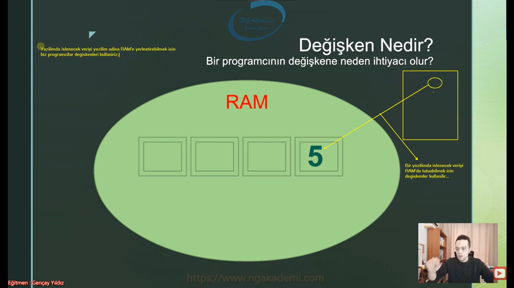

***
# 37) Value Type - Primitive Type - Değer Tipli Değişkenler
- Değişkenler bilgisayarda yazılım adına RAM'de veri tutan yapılardır. Yeri geldi mi bu değerler üstünde işlem yapmamızı sağlayan bu değerleri elde etmemizi sağlayan yeni üretilen değerleri yazılım adına tekrardan RAM'de depolamamızı sağlayan yapılardır.

- Yazılımda çalışırken değişken sayesinde yazılımda işleyeceğiniz veriyi değişken vasıtasıyla RAM'e yerleştirip orada işleyeceksiniz ya hani işlerken RAM üzerinde tutmanız gerekecek ya Dolayısıyla RAM diyor ki bize ya kardeşim sen bana vereceğin değerin türünü bildirmek zorundasın.

- C# programlama dili diyor ki benim RAM'e yerleştireceğim verinin türü neyse onu başta bildirmen gerekiyor ki ben ona göre bir alan tahsisinde bulunayım.

- C# programalama dilinde mantık şöyledir. RAM'de örneğin int bir alan tanımlanırsa oraya sadece int türde bir değer atanmak zorundadır.

- C# diyor ki ya kardeşim senin vereceğin değeri benim RAM'e yerleştirebilmem için bu değerin nasıl koyulacağını int mi, string mi, char mı, ahmet mi, mehmet mi senin burada bildirmen gerekiyor. İşte burada türler karşımıza çıkıyor.

- C# programalama dilinde RAM'de veri tutabilmek/depolayabilmek için tanımlanacak olan değişkenin türü/veri türü bildirilmelidir.

- Diyelimki bir değeri işliyoruz ve bu değer için değişken tanımlıyoruz. Ben değeri hangi türde gönderiyorsam yani hangi türü tahsis ediyorsam o türde bir alan tahsis edilecek ve ona göre ilgili alanda tutulacaktır.

- Tür elimizdeki veriye göre bildirilir.

- Elimizdeki verinin türünü elimizdeki veri belirliyor. RAM'de hangi değeri tutacaksan o elindeki veriden türü çıkartıyorsun.

- C# RAM'e diyor ki ya kardeşim ben bu veriyi işleyecem böyle bir alan tahsisinde bulunmak istiyorum oraya bu veriyi koyacam bu verinin türü şu. İlgili RAM'e o türde bir alan tahsisinde bulunuyor.

- Bir değişkenle RAM'de alan tahsisinde bulunulduğunda buna Değer türlü değişken diyoruz. Yani yuttuğu değer bir normal değer olan değişkenlere Değer türlü denmektedir.

- RAM'de alan tahsisi bulunan bu değişken içerisinde 3, 5, hüseyin, hilmi gibi değerler tutuyor. Değişken içerisinde değer tutar. İşte tuttuğu değerin karşılığında bir alan tahsisi yapan değişkenlere biz Değer Türlü değişkenler diyoruz. Normal bir değer 3, 5, yaşın, adın, doğum tarihin gibi normal değerler.

- Referans türlü değişkenler değer tutmaz değerden daha fazlasını tutarlar.

- Örneğin bir değişken var benim adımı tutuyor bu değer türlüdür çünkü adım bir değerdir. Ama bir değişken daha var komple beni tutuyor. Ha ben bir değer değilim değerlerin bütünüyüm. Adım, yaşım vs var. 

- Hem adım hem ben birer veriyiz ama adım bir değer türlü veriyken ben farklı bir veri türüyüm biz buna nesne deriz. İşte nesneleri tutan değişkenlere de referans türlü değişken diyeceğiz.

- Değer türlü değişkenler sade ve sadece bir değeri tutan değişkenlerdir. Yani adimiz, soyadimiz, doğum tarihimiz gibi değerleri tutarlar. 

- Adının yaşının doğum tarihinin hepsinin bir değeri var yaş sayısaldır. adın metinseldir. adının baş harfi chardır. İşte biz bunun gibi yapıları tutan değişkenlere değer türlü değişken diyeceğiz.

- Primitive Type en ilkel türdür. Primitive yani türetilmemiş ham sade bir veri. Örneğin byte bir primitive türdür. Lakin byte'lardan meydana gelmiş olan decimal türü ise primitive değildir byte'lardan türemiştir. Lakin value type'dır...

- Hiçbirşey olmasa bile var olan tür Primitive türdür. Mesela decimal olabilmesi için byte'ların olması gerekir. byte'lardan meydana gelen decimal normal value type'dır. byte ise tek başına bir veri hiçbirşey olmadan tek başına varolan bir tür olduğu için primitive dir. Bir yandan da value type'dır.

- Value typelar primitive typler'ı kapsarlar.

- Değişken tanımlarken RAM'e tutulacak veriye uygun bir alan tahsisinde bulunulması gerekmektedir. RAM'de alan tahsisinde bulunabilmek için ilgili değişkenin türünden hareket edilir.

- RAM'de alan tahsisinde türü belirlemek yine değişkenin türünden belirlenecektir.

- Bir türde tanımlanmış alana farklı bir türde değer atayamazsınız.

- RAM'de değişkenler sayesinde değer tutabilmekteyiz. Değişkenler değer türlüyse yani değer tuttuğumuz değişkenlerse bu değerin karşılığını türünü RAM'e bildirmek zorundayız.C#'ta RAM diyor ki ya kardeşim ben senin tutacağın veriyi ben bilmem sen bana bildireceksin ben buraya bir veri koyacam sen bunun altın mı dolar mı gümüş mü olacağını ne olduğunu bildireceksin ki ben ona göre koyup ona göre sana geri vereyim. Dolayısıyla burada değişkenlerdeki türler RAM'de tutulacak verilerin hangi türde olduğunu bildiren yapılanmalardır. Biz bunları bildirmek zorundayız. RAM'de çalışırken hangi türlerle çalıştığımızı bildirmek zorundayız.

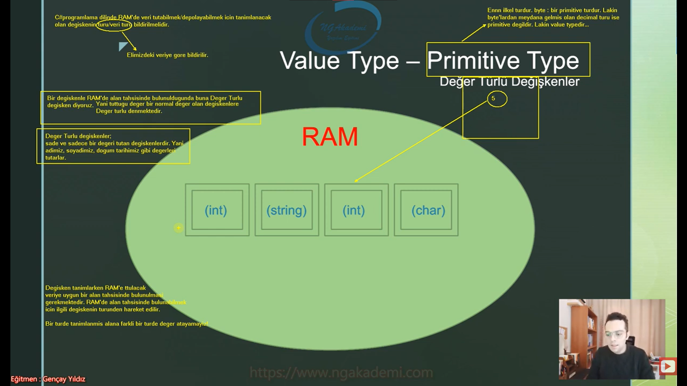

- string metinsel ifadeleri tuttuğumuz değişken türüdür.

- Sayısal türlü değişkenlerin maksimum ve minimum değerleri vardır bu aralıklarda değişkenlerin değerlerini girebilirsiniz. Elinizde tutacağınız sayısal ifadenin boyutuna göre değişken türünü belirlemelisiniz. 

- Mesela 3 değerini tutacaksınız. byte'da tutabilirsiniz int'de de ama RAM'de bu kadar alan tahsis etmek var bir de 3'e en yakın sınırlarda olan alanı tahsis etmek var hangisi daha mantıklı/ az maliyetli olacaktır? 
    * Tabiki de kendisine yakın olan yani alana tam sınırında girebilen değişken türünü tercih etmeniz en doğrusu olacaktır. Bunlar optimize kod yazarken/ yazılımın daha hızlı/performanslı çalışması için dikkat ettiğimiz kurallardır.

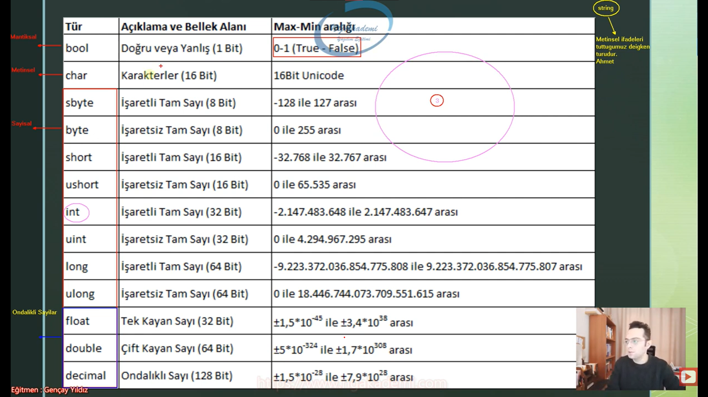

***
# 38-) Değer Türlü Değişkenlerde Primitive Kontrolü - Isprimitive
- Bir türün primitive olup olmadığını 'typeof(value type).IsPrimitive' ile inceleyebiliriz.

- Bunun için 'typeof' keywordünü kullanıyoruz. 'typeof' keywordünde hangi keywordü/türü denetleyeceksek parantez içine onu yazıyoruz ardından '.' operatörü (member access => üye erişimcisi, kodun devamını getirecek olan erişimi sağlayacak olan bir operatör olduğunu inceleyeceğiz) ile 'IsPrimitive' komutunu çağırarak Primitive olup olmadığını kontrol edebiliriz.

- IsPrimitive komutu verilen türün  Primitive olup olmadığını true ya da false olarak bizlere geri döndürecektir.

- 'decimal' bir primitive tür değildir. Çünkü arkada 'byte''lardan daha doğrusu int türlerden oluşturulur/meydana gelir. Değer türlüdür amma velakin 'Primitive' değildir. Buna nazaran 'int' ve 'byte' hem değer türlüdür hem de  'Primitive''dir Yani herhangi bir başka türden meydana getirilmezler.

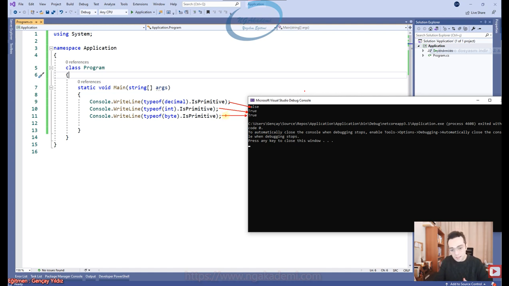

***
# 39) Değişken Türleri Nelerdir? Detaylı İnceleyelim
- Değişken türleri değişkenlerde tanımlama yaparken bir değer tutarken RAM'de bunun türünü bildirmemiz gerekiyordu.

- Örneğin ahmet değerini tutacaksam eğer oluşturacağım değişken üzerinden RAM'e kardeşim ben sende 'string' türde bir değer tutucam bilgin olsun.

- Sayısal türlerde tutacağınız değer hangi aralığa giriyorsa en yakın aralığa gireni tercih etmeniz uygulamanın bellek yönetimi/maliyeti/performansı açısından her zaman size avantaj sağlayacaktır.

- Örneğin 1000 değerini tutmak istiyorum bunu tutacak olan değişkeni bunu RAM'e koyacak olan değişkeni tanımlarken sbyte ve byte'da tutamayız çünkü aralık dışında kalmaktadır. Amma velakin short veri tipinde tutabiliriz. Biz bunu int'tede tutabiliriz. Amma velakin büyük bir alanı ziyan etmiş oluruz.

- Bir ev yapacaksın yapacağın evin metrekaresi 100m2 olacağını varsayalım ama sen 500m2 lik bir alanı harcıyorsun oraya beton döküyorsun ne kadar mantıklı olabilir? Programlama da aynı şekilde tutacağın değer neyse ona en yakın sınırdakini tutta bari geri kalan alanlara daha rahat başka alanlar tahsis et. 

- Biz yazılımcılar bonkör insanlar değilizdir. Yani mümkün mertebe işi sınırlandırırız. En uç noktada işi törpüleriz ki fazladan bir açık/sızıntı/lüzumsuz bir veri tahsisi söz konusu olmasın. Biz cimriyizdir yani bellekte bir alan tahsis ederken mümkün mertebe elimdeki veriye uygun olanı tahsis ederim lüzumsuz yere alanlar tahsis ediyorsam ben kötü programcıyımdır.

- Profesyonel hayatta aradaki farkları tolere etmeniz bellok optimizasyonu açısından da ciddi bir fark yaratacaktır.

- string metinsel ifadeleri tuttuğumuz değişken türüdür. char'da ise sadece tek bir karakter tutabiliriz.

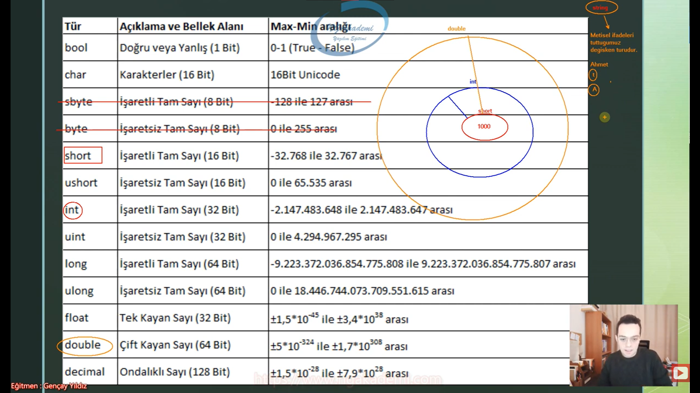

***
# 40) C# Temel Kuralları
- Main fonksiyonun {} parentezleri arasında biz kodlamayı öğreneceğiz.

- {} => Scope/faaliyet alanı

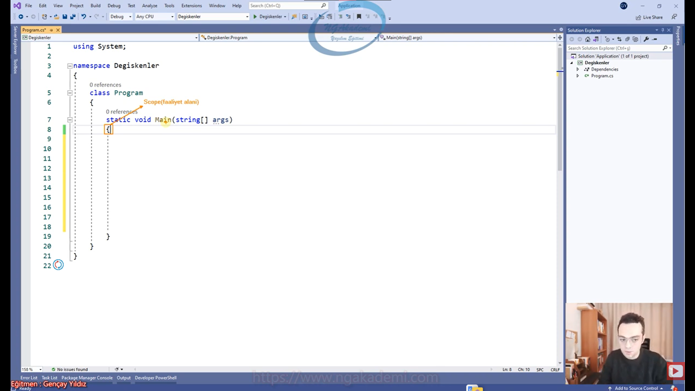

## C# Dil Özellikleri
1. C# programlama dili büyük küçük harf duyarlılığına sahip olan bir dildir. => Ahmet AhMet ahmet AHMET bu dördü birbirinden farklıdır.

2. C# programlama dili tip güvenliği olan bir dildir. RAM'e değişken aracılığıyla koyacağımız verinin türünü önceden bildirmemiz gerekiyordu. Bildirmeden hareket edemiyorduk illa bildirmem gerekiyordu ve bildirdiğim tür ne ise o türde bir veriyi koymam gerekliydi işte buna tip güvenliği denir.

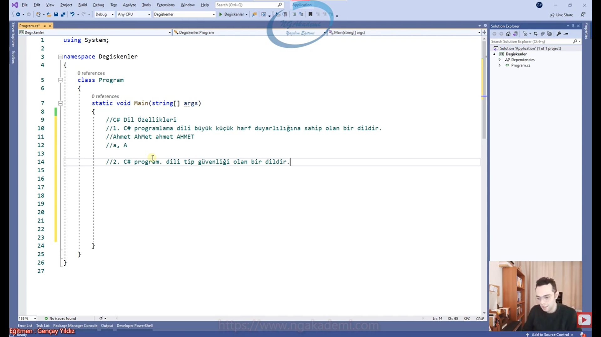

***
# 41) Değişken Tanımlama
- Değişken tanımlamak bir konsept meselesidir.

- Bir değişken tanımlamak istiyorsanız öncelikle değişkenin modelini/prototipini oluşturmanız gerekiyor.

- Prototip : degisken_turu degisken_adi; => ilk olarak değişkenin türünü bildiriyoruz daha sonrasında ise değişkenin adını ve en son ; ile konsepti kapatıyorum.
    * int x;
    * string adi; Bu uygulama derlendiğinde bellekte string türde adi isminde bir değişken tanımlanmış olacak.
    * int yas; Derlendiğinde bellekte int türünde yas isminde bir alan tutacaktır. 

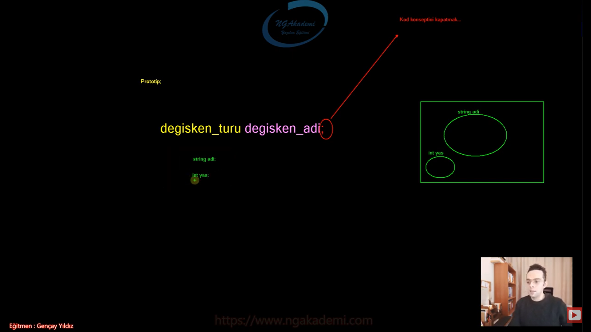

```C#
#region Değişken Tanımlama
    int yas;
    bool medeniHal;
    string soyadi;
#endregion
```

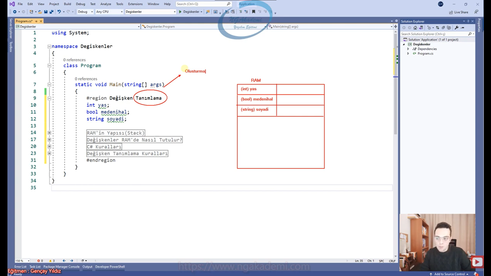

***
# 42) RAM'in Yapısı(Stack)
- Temelde iki tane yapılanmadan oluşmaktadır.Bu yapılanmalar Stack ve Heap'tir.

- Bu yapılanmalar RAM'in temelde kullandığımız iki alanıdır.

- Stack => İçerisinde değer türlü değişkenleri tutabildiğimiz bölümdür.

- Heap => Nesneleri tutabildiğimiz bölümdür.

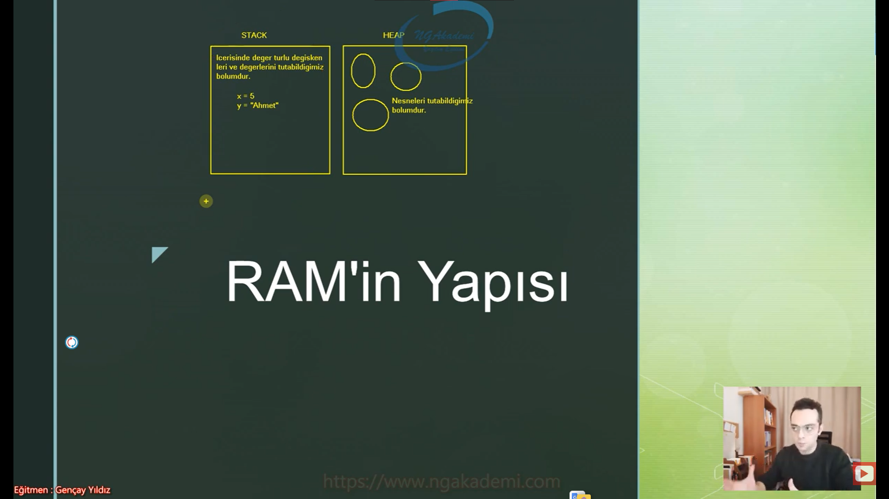

- RAM'in yapısında birçok bölüm vardır. Bunlardan bir tanesi Stack'tir. 

- Stack içerisinde farklı değerler tutabilmektedir. İçerisinde tuttuğu yapılar;
    * Değiken türü, adı ve değeri
    * Metot isimleri(Bellek adresleri)

- Stack sadece değişkenin değerini değil ,değer türlü değerleri değil Değer türlü değişkenleri de burada tutuyor bunların türlerinin bilgisini de burada tutuyor ve aynı zamanda adlarını da tutmaktadır.
    * int a = 5 => hepsi Stack'te tutulur
- Stack'te tutulan değişken ismini nadirde olsa referans dendiğini görebilirsiniz.(Değer türlü olsa bile)

- a referansı dendiğinde tuttuğu değere referanslık eden isim.

- Metotların bellek adresleri de Stack'te tutulur.

- Metotlarımızı oluşturuyoruz. Metotlar oluşturulduğunda belleğin Stack kısmında tutulurlar. Metodu ismi üzerinden çağırabilirsin o isminin bellekteki karşılık gelen bellek adresi Stack'te tutulur.

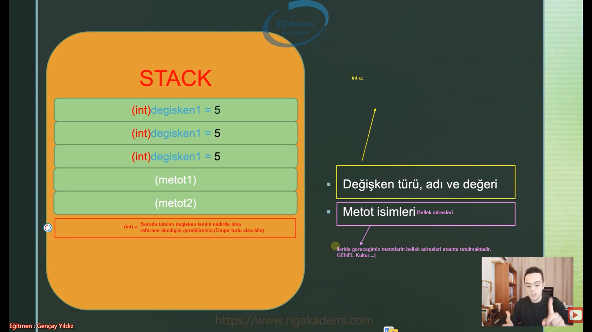

***
# 43) Değişkenler RAM'de Nasıl Tutulur?
- Değişkenler koda yazılır yazılmaz alan tahsisinde bulunmazlar kod ne zaman çalıştırılır ne zaman o alan compiler tarafından derlendikten sonra yani runtime'da/calıştırılma anında/çalışma zamanında kodlara karşılık alan tahsisleri gerçekleştirilir.

- Senkronizasyona göre kodu çalıştırdığınızda genellikle yukarıdan aşağı doğru nitelendirilen konsept konsept ilerleyerek bellekte yerler ayrılır.

- Senkronizasyona göre sırayla Compiler Stack'te tanımlama yapar.

- Yani değişkenler sırasıyla konseptte hangisi öncelikliyse o öncelik sırasına göre Stack'te tanımlanacaktır.

- Stack LIFO (Last In First Out) mantığına göre çalışır. Yani Son giren ilk çıkar.

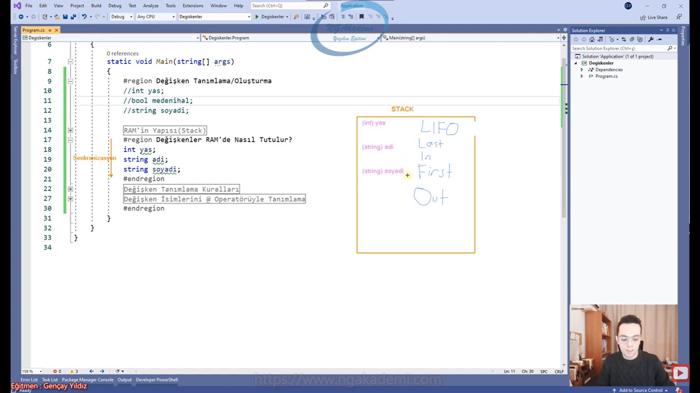

***
# 44) Değişken Tanımlama Kuralları
## Anlamlı İsimlendirme
- Değişken isimleri süreçte developer açısından bir karışıklığa mahal vermemek için anlamlı olmalıdır.

- Diyelim ki bir personelin yaşını tutacaksam eğer 'int yas, int personelYas' gibi tutacağım değerin anlamını ifade eden bir isim vermem developer sürecinde bize çok faydalı olacaktır.

- Eğer anlamsız bir isim verirsem yaş tutacağın değişkene 'int x, int y, int huseyin' gibi saçma sapan değerler verirsen bu süreçte inanılmaz bir karışıklığa yol açacaktır.

- Kod yazma iradesi bizde ben neyi nerde tuttuğumu düzenli bir şekilde isimlendirebilme hakkına sahibim. Siz bu iradenizi hakkınızı kullanacaksınız anlamlı isimlendirme yapacaksınız.

- Ne yazık ki bazen gerçekten yazılan kodlarda sembolik terimler kullanılan kodlarla karşılaşacaksınız. Bunun gibi karışıklığa sebeb olan şeyler hem sizin açısından hem de başka bir developer açısından kodun analizini yaparken ciddi manada sıkıntı oluşturucaktır. Keza sonraki süreçte kodu yazma esnasında yukarılarda tanımlanan bir değişkeni kodun aşağılarında bir yerlerde çağırmaya çalıştığınızda bile ciddi manada sıkıntı yaşabiliyorsunuz. Kompleks algoritmalarda değişkenlerin isimlerinin anlamlı olmasına özellikle dikkat edeceğiz.


## Özel Karakterler
- Değişken isimleri ' , . vs. gibi özel karakterler barındıramazlar!

- '_' karakteri istisnadır.

- '_' özel karakterler arasında değişken isimlerinde kullanabildiğimiz yegane tek bir özel karakterdir.

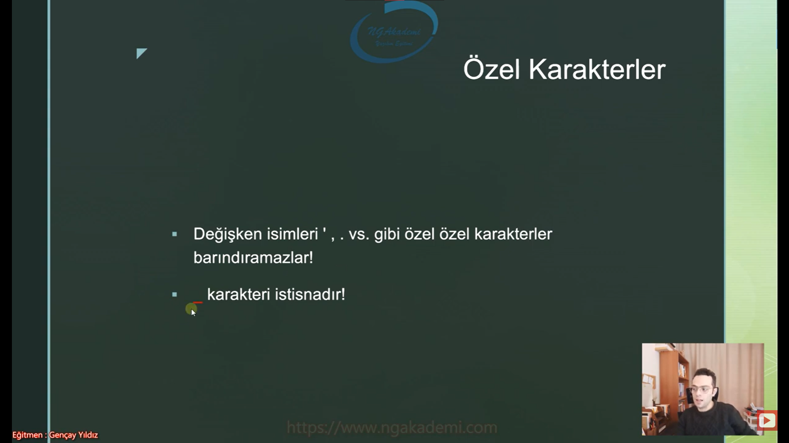

## Sayısal İfadeler
- Değiken isimleri sayısal ifadelerle başlayamaz!

- Lakin sayısal ifade barındırabilir.

- Bir scope içerisinde aynı isimde birden fazla değişken TANIMLANAMAZ


```C#
Değişken Tanımlama Kuralları
    //1.Anlamlı isimlendirme
    int yas;
    int personelYas;
    int x;
    int y;

    //2. Özel karakter olmamalı!
    double stok_adedi;
    // double ?av;

    //3. Sayısal İfadeler 
    int sayi1;
    int sayi2;
    // int 3sayi;
        
    //4. Bir scope içerisinde aynı isimde birden fazla değişken TANIMLANAMAZ
```

***
# 45) İsimlendirme Kuralları - Name Convention(Pascal Case/Camel Case /Snake Case)

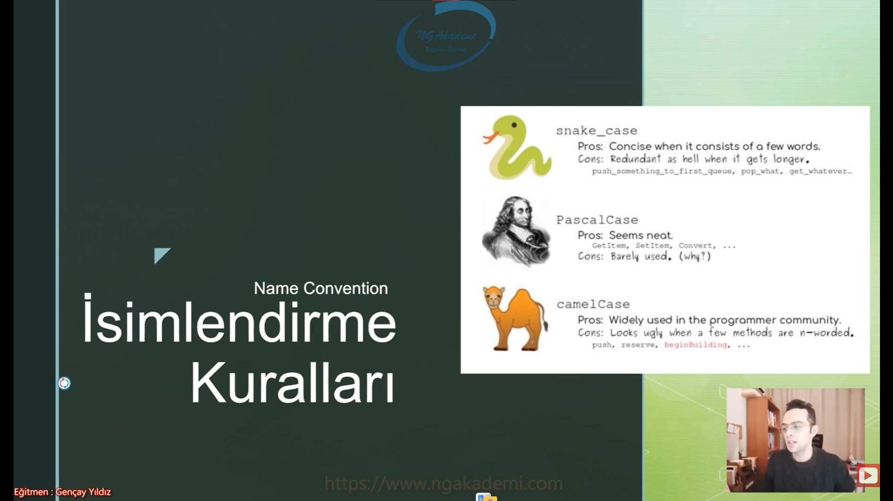

## Pascal Case
- Her kelimenin ilk harfi büyük yazılmalıdır.
    * AdSoyad
    * TcKimlikNo
    * Satislar
    * DogumTarihi


- Kısaltma iki harfliyse her iki harfte büyük yazılmalıdır.
    * In/Out = IO
    * InOutStream = IOStream

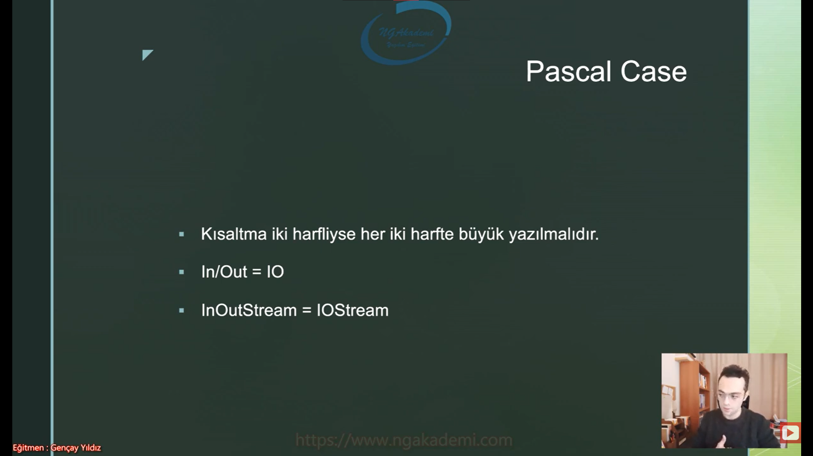

## Camel Case
- İlk kelime haricindeki tüm kelimelerin baş harfi büyüktür.
    * satisDurumu
    * personelAdi
    * orderId
    * userName
    * user
    * userNamePassword

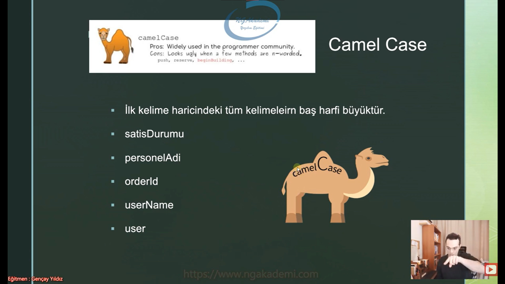

## Snake Case
- Tüm kelimeler küçük olarak başlamalı ve araları _ karakteri ile ayrılmalıdır.
    * kullanici_adi
    * isim_soyisim
    * personel_giderleri


***
# 46) Değişken İsimlerini @ Operatörüyle Tanımlama
- Bir değişkenin ismi sade bir şekilde de olabilir ya da başına @ işaretini koyduğumuzda da olabilir.

- @ işareti kelimenin başında özel karakter anlamına gelmemektedir. Ama kelimenin içinde kullanırsanız özel karakter anlamına gelmektedir hata alırsınız.

- Değişken isminin başına getirilen @ özel bir karakterden ziyade anlamlı bir karakter haline geliyor.

- Değişken isimlerinde programatik keyword kullanılmaz! Eğer ki bir değişken isminde programatik olarak kullanılan bir keywordü vermek istiyorsanız eğer bunu @ operatörü ile ezebilir ve öylece verebilirsiniz.

- Eğer ki programatik keyword kullanacaksanız başına @ işareti koyarak programatik keywordü ezebilir ve artık o keyword programatik keyword değil normal bir metin olduğunu ifade edebilirsiniz. 

- @ operatörü ile anlamlı keywordleri değişken ismi olarak kullanabiliyorsunuz.

- Programlama da bir keyword'e karşılık gelen metini değişken ismi olarak kullanmak istiyorsanız onun başına @ işaretini/operatörünü koymanız gerekmektedir.

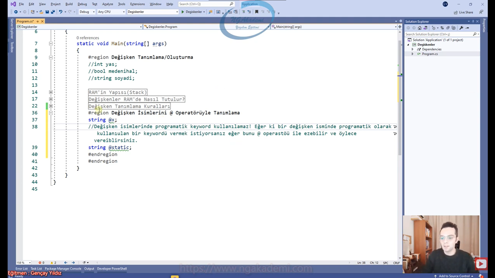

***
# 47.1) Tanımlanmış Değişkene Değer Atama
- Tanımlandıktan sonra değer atayabiliriz çünkü bir değişken tanımlamadan değer atayamayız.

- Tanımladığımız değer türlü değişkenler, değerleri, tür bilgileri belleğin Stack kısmında tutulur.

- Tanımlama esnasında değişkene değer atayacaksam eğer assign/atama operatöründen(=) faydalanırım Örneğin `int x = 5;` 

- Assing(=) operatörü atama işleminin sorumululuğunu üstlenir.

| int | = | value |
|---|---|---|

- `=` Assign operatörü diye geçer atama operatörüdür. Matematikteki = ile alakası yoktur. Matematikte 3 = 3 dediğimiz operatör oradaki eşitlik anlamına gelir. Yazılımda ise C# dilinde `=` operatörü atama yapar

- `=` Assign operatörü sağdaki tarafra verilen değeri soldaki değişkene, field, property'e vs. atar.

- Bir değişkene değer atayacaksanız değişken sol tarafta olmalı atayacağınız değer sağdan gönderilmelidir. Assign operatörü (`=`) sağındaki değeri soldundaki değişkene gönderecektir.

- Bir değişkene değer atarken bellekte ilk olarak verdiğin türde bir alan tahsisinde bulunulur ve compiler kodu işlerken daha sonlandırmadan atayacağın değeri burada tahsiste bulunulmuş alana atar.

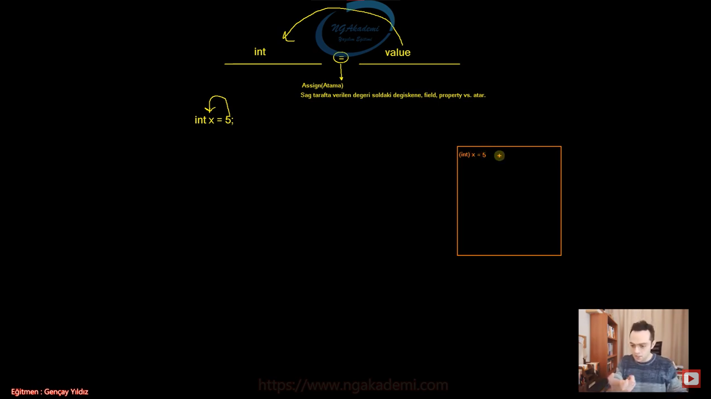

- Normalde değişkeni tanımlarken sadece tanımlayacaksam konsepti değişken adının sonunda `;` ile sonlandırıyorum. Yok eğer tanımlama yaparken değer de atayacaksam artık değerin sonunda `;` ile konseptimi sonlandırıyorum.
    * `int x;` 
    * `int x = 123;`

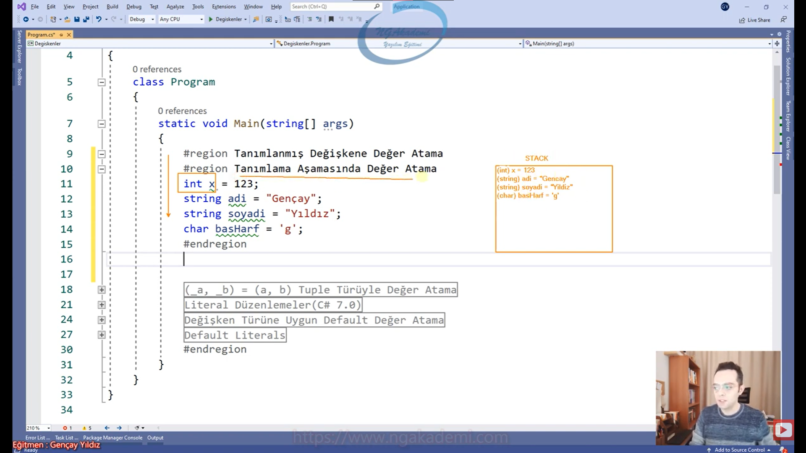

- Eğer ki bir değişken ismi assign operatörünün(`=`) solunda çağırılıyorsa o alana değişkenin kendisi gelecektir. Yani o alan tahsisi gelecektir. Onun için senin atadığın değer ilgili değişkene yani oradaki alana gönderilmiş olacaktır.

- Değişken ismi assign operatörünün(`=`) soluna geliyorsa oraya değişkenin kendisi gelir değeri atadığında bulunan alan tahsisinin içine değer koyulur.
 
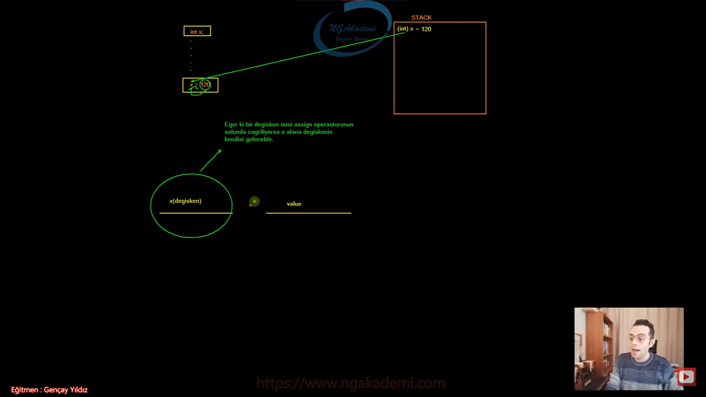
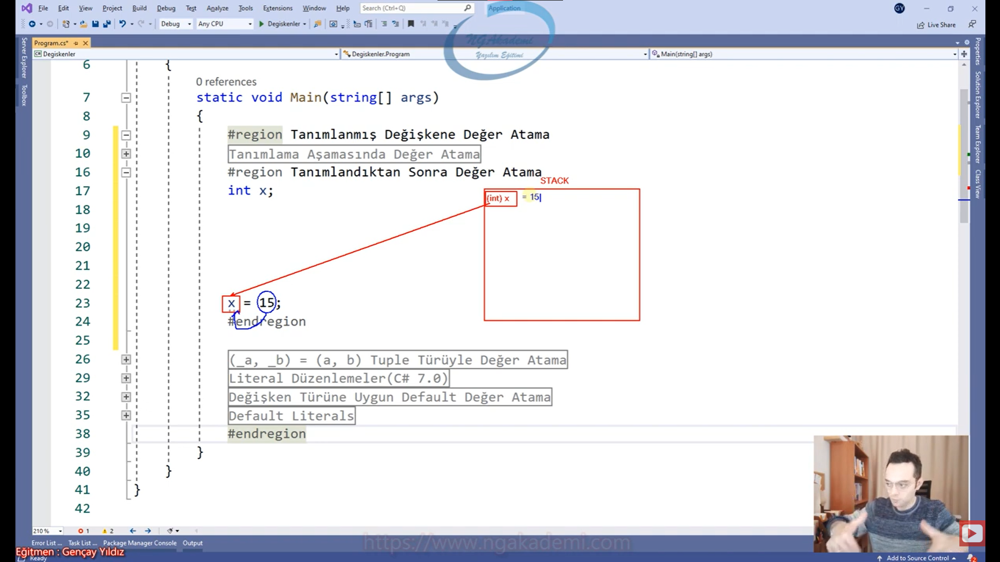
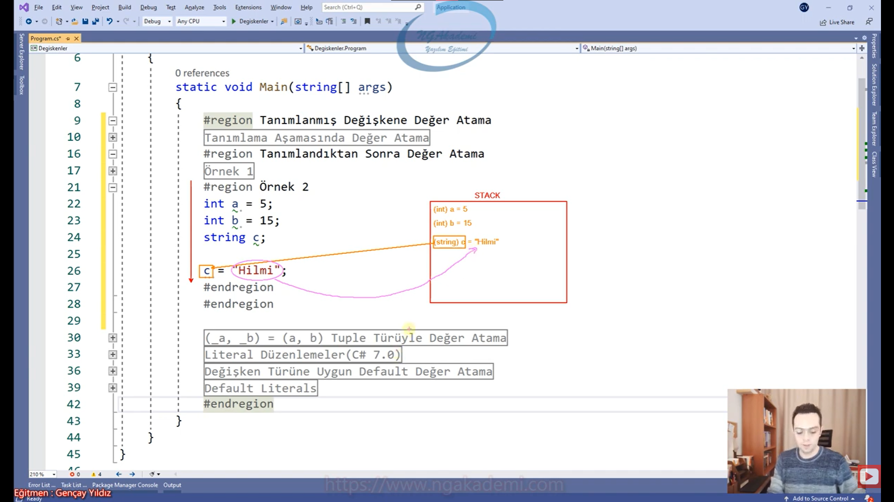
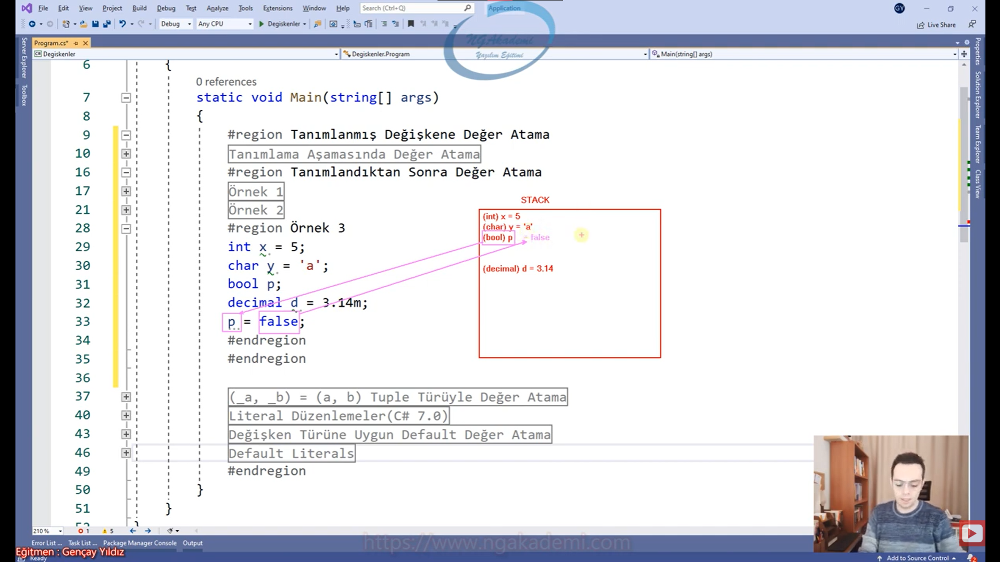

- Dikkat 
    * Bir değişkene atanan en son değer geçerlidir.
    * Eğer atama varsa tahsis edilen alandaki tutulan değer değiştirilir. Yeni bir alan tahsisinde bulunulmaz. Yani tutulan değer ezilir.
    ```C#
        int a = 5;
        a = 15;
        a = 20;
    ```
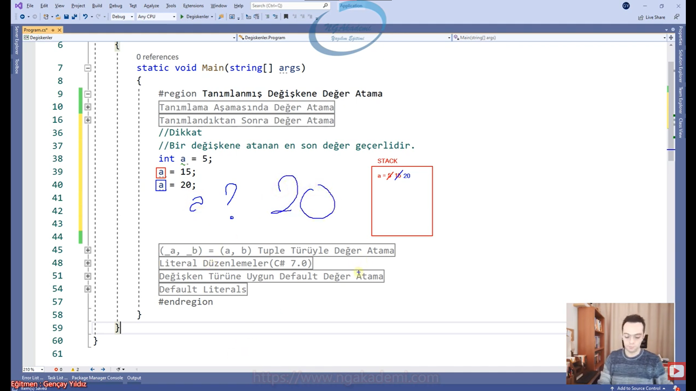

# 47.2) Tanımlanmış Değişkene Değer Atama
- Tanımlanmış olan değişkene türüne uygun bir değer atılmalıdır.

- değişken int ise int değer, string ise string değer atanmalıdır. 

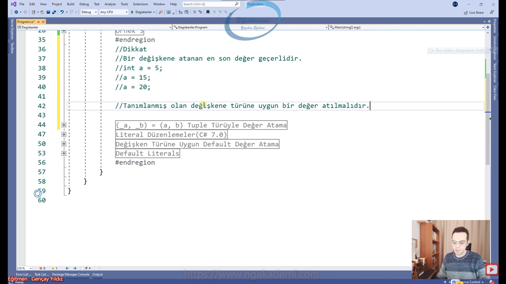

***
# 48) Değişkene Değer Atama Kuralları
- 4 Kategori de değer türlerimiz var 
    * Metinsel Değerler
        - `string` keywordü ile tutulmaktadırlar.
        - `string` keywordunde tutulan metinsel değerler çift tırnak(`"...."`) içerisinde tutulmalıdır.
        - `"Musa"`, 
        - `"12345678901"` Bir sayısal ifade metinsel olarak tutuluyorsa eğer yazılım açısından o metinsel bir ifadedir. Yani üzerinde matematiksel işlem yapılmayan ve `"Hüseyin"` `"Ahmet"` vs. gibi metinsel ifadelerden farkı olmayan bir değerdir.
        - Metinsel ifadelerde herşeyi tutabilirsiniz. Örneğin `"Musa 23 Yaşındadır."`
        - Çift tırnak (`""`) içerisine yazılan tümmmm değerler string keywordüyle karşılanmalıdır.  `string x = "asfsafasdafasf";`

    * Karaktersel Değerler
        - `char` keywordü ile tutulmaktadırlar.
        - Karaktersel değerler tek tırnak(`''`) içerisinde yazılmalıdır.
        - Örneğin `char x = 'M';`, `','`,`'.'`,`'?'`
        - İçerisinde sadece tek bir karakter barındırabilir.

    * Mantıksal Değerler
        - `bool` keywordü ile tutulmaktadırlar.
        - Mantıksal ifadeler direkt olarak `true` ya da `false` ile belirtilir.
        - Örneğin `bool medeniHal = true;`
        - `true`:1'e karşılık gelir yani doğruya karşılık gelir.
        - `false`:0'a karşılık gelir yani yanlışa karşılık gelir.

    * Sayısal Değerler
        - Değer babında en kompleks değerlerdir diyebiliriz. Çünkü çok fazla sayısal değerimiz var.
        - Sayısal ifadelere değer atarken direkt olarak değeri göndeririz.
        - Sayısal ifadelerde bir değer default/varsayılan olarak integer(`int`) kabul edilir.
        - Örneğin `1000`

    * Ondalıklı Sayılar
        - Tümm ondalıklı sayıları karşılayabilirler. 
        - `float`, `decimal`,`double`
        - `float` türünde bir küsuratlı değer tutarken ilgili değerin sonuna f ya da F getirilmelidir. örneğin `3.14f` ya da `3.14F` `float f = 3.14f;`
        - `double` türünde bir küsuratlı değer tutarken ilgili değerin sonuna d ya da D getirilmelidir. örneğin `3.14d` ya da `3.14D`
        - `decimal` türünde bir küsuratlı değer tutarken ilgili değerin sonuna m ya da M getirilmelidir. örneğin `3.14m` ya da `3.14M`
        - Ondalıklı türlerde bir değer default olarak `double`'dır ve default olduğundan dolayı ondalıklı bir değeri double ile tutarken d ya da D'yi kullanmak zorunda değiliz!

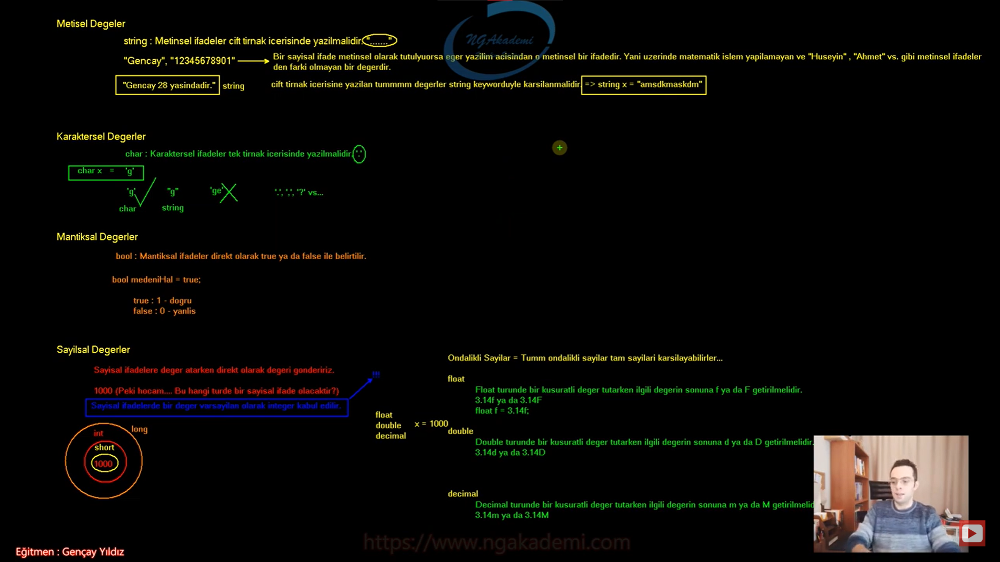

- Soldaki tür neyse sağdaki değerle/değerin türüyle eşdeğer olmalı. 

- Bir sayısal tür değer aralığına girmeyen değeri tutamaz! Compiler hata verir!

- Sayısal ifadelerin kendi aralarında tür dönüşümü sırasında veri kaybı soz konusu olabilir.

- Dolayısıyla değeri karşılayabilecek en uygun tür neyse onda tutulması mantıklıdır.

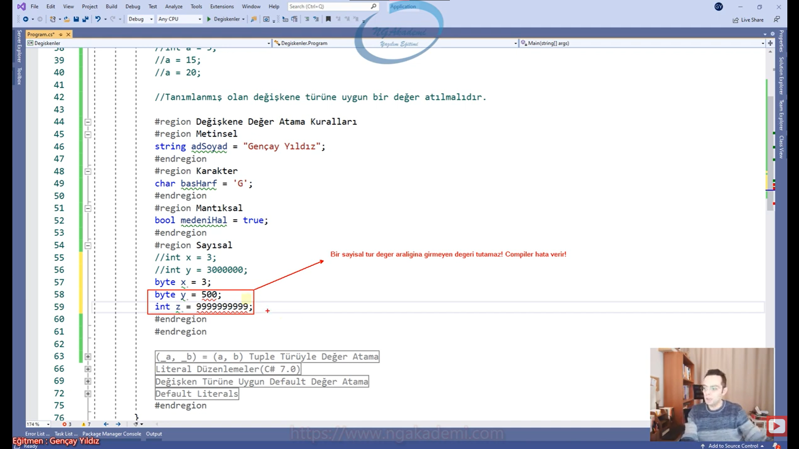
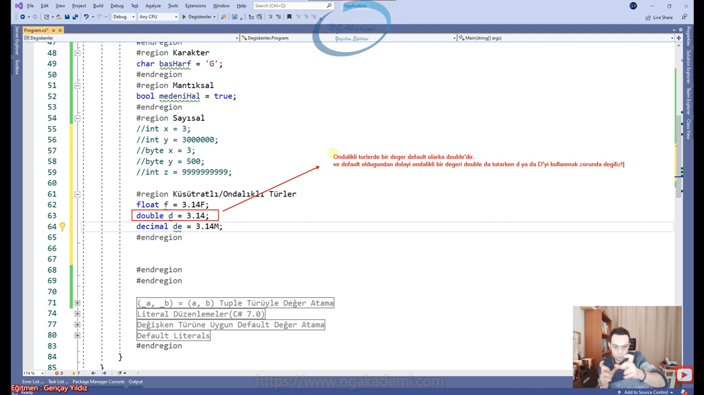

***
# 49) (_a, _b) = (a, b) Tuple Türüyle Değer Atama
- Tek bir syntax üzerinde birden fazla değişken tanımlamamızı sağlayan bir nesnedir.

- Örneğin; `(int a,int b,type c, type d,...)z;`

- Tuple değişkenin içerisinde birden fazla aynı türde veyahut farklı türde değişken tanımı olur.

- Tuple dediğimiz nesne içerisinde bir veya birden fazla nesne tanımlayabildiğimiz tek bir tanımlık nesnedir.
    * `(int a,string b) c = (5,"ahmet")` 
    * bizim bunlara erişebilmemiz için `c.a` => değişkeni getirecektir. `c.b` => string türdeki değişkeni getirecektir.

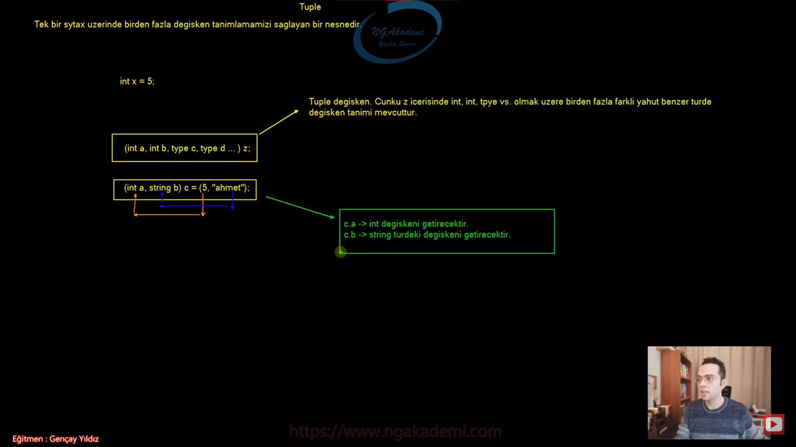

- Tek bir değişken içerisinde birden fazla değişken tutan konsept tuple konseptidir.

- Tuple Stack'teki davranışı diğer değişkenlerde olduğu gibi aynıdır.

- Nesnenin değerden farkı değerlerle bir araya gelmesidir.

- Tuple nesne olarak tutulur.

- Oluşturduğumuz değişkende sıralı bir şekilde yani buradaki değerlere karşılık gelecek şekilde değerlerini atamak zorundayız.

```C#
    (_a, _b) = (a, b) Tuple Türüyle Değer Atama
    int a = 5;
    int b = 10;

    (int x,int y) c = (5,10);
    (int yas,string adi,bool medeniHal) kisi = (23,"Musa",true);
    kisi.yas = 5;

    (int x,char y) z;

    z = (5, 'a');
```

***
# 50) Literal Düzenlemeler(C# 7.0)
- Kompleks sayısal ifadeleri _(Alt tire) ile düzenlememizi sağlayan özelliktir. `int sayi = 1_000_000;`

- Değişkenlerimizin değerlerini alt tire(`_`) ile daha görsel daha hoş okunabilir semantik kullanabiliriz.

***
# 51) Değişken Türüne Uygun Default Değer Atama
- Tüm değişkenlerin bir default değeri vardır.

- İleride OOP dediğimiz yaklaşımı gördüğümüzde class içerisinde tanımlanan değişkenlerin default değerlerinin otomatik atandığını konuşacağız...

- default keywordü : içerisine verilen türün varsayılan değerini geriye döndürür.

- Main içerisinde oluşturulan değişkenlerin ilk değerlerini manuel atmaya özen gösteriniz.

- Main içerisinde oluşturduğunuzun ilk değerlerini Compiler kendisi veremez. Class'ta verir


- Metinsel değerlere null atanır null değersiz demektir. Null ile boş arasında fark vardır. Null boş demek değildir. Boşluk space dediğimiz bir karakterdir. Null değeri yok anlamına gelir.
    * `string` : `null`
    * `char` : `\0`
- Sayısal ifadelerin hepsinde varsayılan 0 söz konusudur.
    * `int` : `0`
    * `float` : `0`

- boolean'da ise false'tur.
    * `bool` : `false`

- Elimizdeki değişkene default değerini biz atamak istersek `default(değişken türü)` 'nü atama yaparız.
    * `bool x = default(bool)`
    * `int y = default(int);`
    * `string z = default(string);`  	
    * `char c = default(char);`

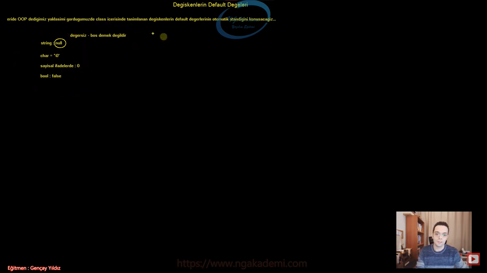

```C#
//default keywordü : içerisine verilen türün varsayılan değerini geriye döndürür.
bool x = default(bool);
int y = default(int);
string z = default(string);
char c = default(char);
//Main içerisinde oluşturulan değişkenlerin ilk değerlerini manuel atmaya özen gösteriniz.
// Main içerisinde oluşturduğunuzun ilk değerlerini Compiler kendisi veremez. Class'ta verir
```

***
# 52) Default Literals (C# 7.1)
- C# 7.1 versiyonuyla gelen Default Literals özelliği sayesinde biz değişken türlerine uygun default değerleri atarken kullandığımız `default` keywordünü daha spesifik halde kullanabilmekteyiz.

- Önceden default keywordünden sonra parantez içinde türü belirtirken artık bu şekilde değilde direkt default keywordüyle değişken tipine uygun default türü atamaktadır. 

- `default` keywordünü hangi değişkene karşı assign ediyorsan otomatik sana o değişkenin varsayılan değerini geri döndürecektir.

```C#
bool x = default;
decimal y = default;
```

***
# 53) Tanımlanmış Değişkenin Değerini Okuma
- Bir değişkenin değerini okuyabilmemiz için öncelikle ilgili değişkeni tanımlamamız gerekiyor ardından değer atamamız gerekiyor.

- Bir değişkenin değerini elde edebilmek için değişkenin isminden/adından faydalanmaktayız.

- Bir değişkenin adı assing(`=`) operatörünün sağında yahut metotların parametrelerinde çağırılıyorsa ilgili değişkenin değeri gönderilir.

- `Console.WriteLine()` ekrana çıktı veren, ekrana bişey yazmamızı sağlayan bir komuttur
    * Console bir sınıftır/class'tır. Bu sınıfın üzerinden direkt bir member'a erişilebildiği için `static` bir yapılanmadır. Bu static member'ın bir metot olduğunu buna erişirkende static yapılanmadan faydalanıp erişebildiğimizi `.`'nın modifier access operatörü olduğunu metotların parametre alabildiğini ileride göreceğiz.

- `Console.WriteLine(x)` => metodun parametresinde çağrıldığı için x'in kendisi değil değeri gidecektir.

- `int y = x;` => x assign'ın sağında kaldığı için y değişkenine x'in değeri atanacaktır.

- Tanımlanmış değişkenin değerini biz değişkenin ismi üzerinden okuruz. Bu yüzden değişkenin adı anlamlı olmalıdır. 

- Bir değişkende bir değeri alacaksan eğer o değişkenin isminden alacaksın. Yaşını tuttuğun değişkene x maaşını tuttuğun değişkene y dersen ulan x'miydi y'miydi diyene kadar direkt yaş ve maaş isimlerini kullanman daha mantıklı olacaktır. 

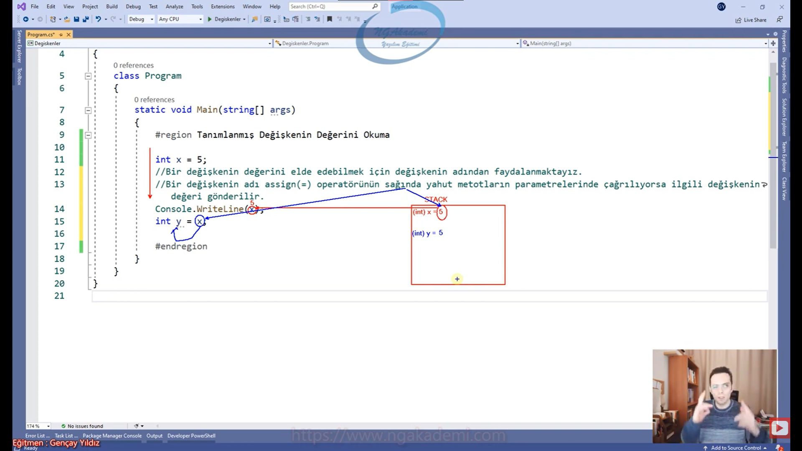

***
# 54) Tanımlanmış Değişkenin Değerini Okuma - Kritik 1
- Bir değişken assign operatörünün(`=`) sağındaysa değeri gelir.

- Bir değişken ismi assign operatörünün solundaysa kendini getiriyor.

- Değişkenler sürekli değişebilir amma velakin her zaman bir değişkenin değeri son atanan değerdir. Önceki değerler ezilecek/silinecektir.

```C#
int a = 5;
int b = 10;
int c = b;
int d = a;
b = a;
c = b;
```

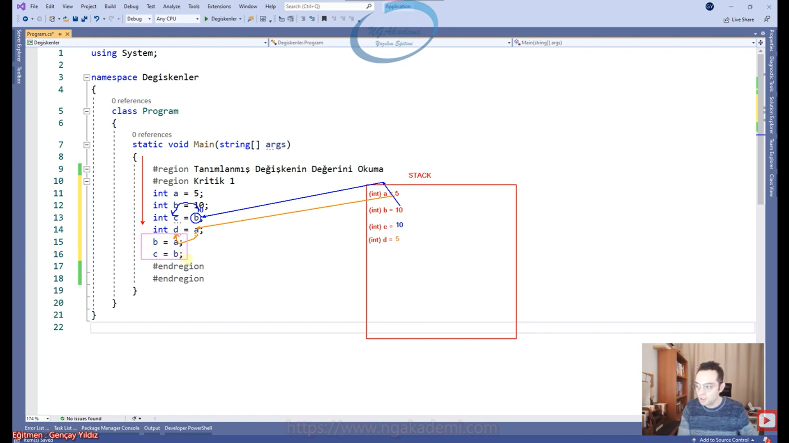
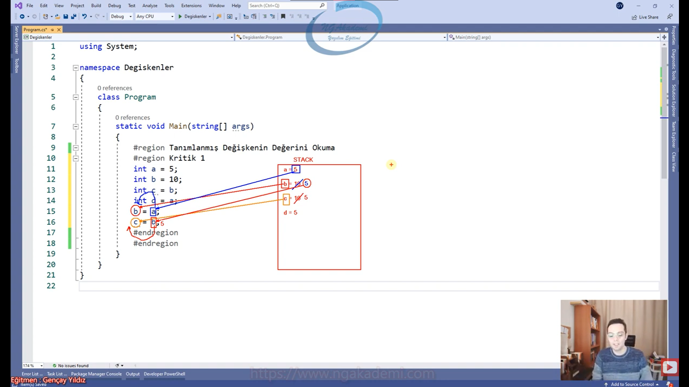

***
# 55) Tanımlanmış Değişkenin Değerini Okuma
- Bir değişkenin kendisini kendi değerine atama yaparsak eğer assing operatörünün(`=`) sol tarafında kalan yere değişkenin kendisi yani bellek adresi gelecektir. assing operatörünün(`=`) sağ tarafında kalan yere ise değişkenin değeri yani bellek adresinde tutulan değer gelecektir. ve değişkenin önceden var olan değeri silinecek ve gelen değer değişkene set edilmiş olacaktır.

```C#
int a = 5;
a = a;
```

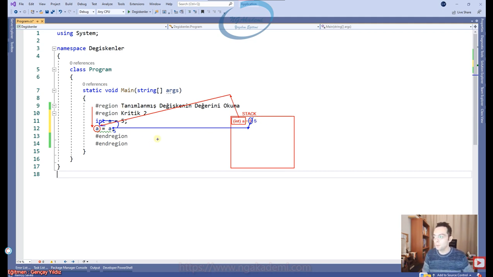

***
# 56) Değeri Olmayan Değişkenler!
- Bir değişkeni Main metodu içerisinde oluşturduğunuzda bu değişken için Stack'te bir alan tahsisinde bulunuldu amma velakin içerisinde herhangi bir değer yok.
`int a;`

- Class içerisinde tanımladığımız değişkenlerin varsayılan default değerleri atanacaktır. Ve bu default değerlerde;
    * Metinsellerin `null`
    * Sayısalların  `0`
    * Mantıksalların `false`
    * Charların `\0` 'dır.

- Varsayılan değeri olmayan ya da değeri olmayan değişkenle hiç bişey yapamazsınız.

- Örneğin;
    * İlk başta bir değeri olmayan değişkeni bir yerde çağıramazsınız. `Console.WriteLine(a);`
    * Bir başka değişkene değerini atayamazsınız. `int b = a;`

- Class içerisinde tanımlanan değişkenlerde varsayılan değer otomatik atanmaktadır. Lakin main içerisinde tanımlanan değişkenlerde varsayılan değer atanmadığı için böyle boş tanımlanan değişkenlerde ilk değeri manuel vermediğimiz sürece işlem yapamayız!

- Bir metot içerisinde tanımlanan değişkenlerin ilk değerlerini manuel olarak vermeyi alışkanlık haline getiriniz... Çünkü programın rahatça işlenebilir ve kodlanabilir olması için

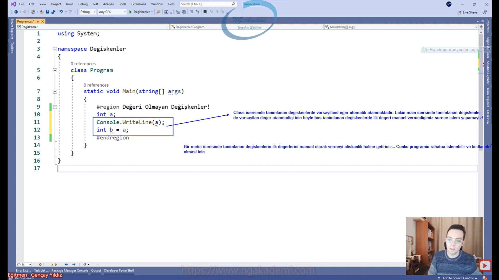