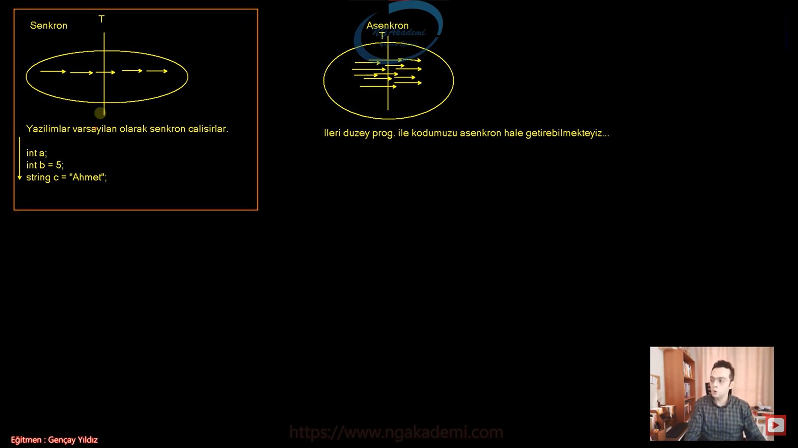
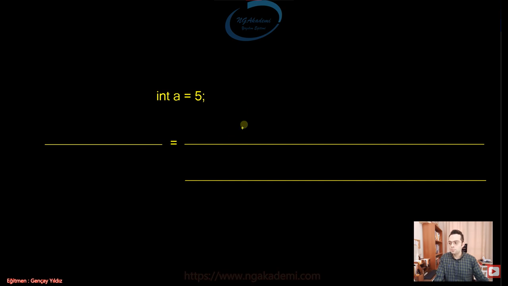
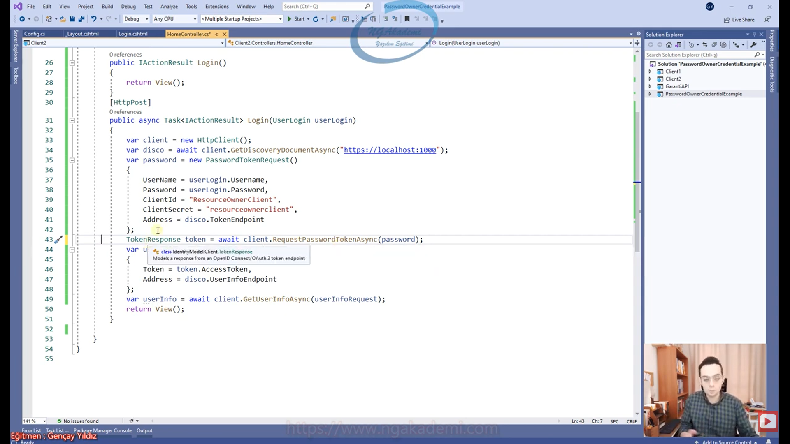

***
# 72) Kod Nasıl Çalışır? Nasıl İşlenir?
- Kod konsepti kodun nasıl çalıştığı, satır satır kod mantığının olmadığı `;` operatörü ne amaca hizmet ediyor gibi ifadeleri açıklar.

- Kod iki türlü çalışır;
    * Senkron olarak çalışır.
        - Bir işlem bitmeden öbür işleme geçmez.
        - Bildiğiniz yoldaki trafiğin ta kendisidir. Öndeki araba gitmeden sen devam edemezsin. gidemezsin.
        - Herhangi bir T zamanda yapılan işi çok rahat bir şekilde hesap edebilirsin. 
        - Herhangi bir T zamanda yapılan iş bellidir.
        - Bir kodun işlemi bitmeden diğer kod çalışmaz
    * Asenkron olarak çalışır.
        - Senkronizasyon yoktur.
        - Aynı anda paralel bir şekilde işlemler yürür.
        - Herhangi bir T zamanda yapılan işi hesaplamak biraz zahmetli olacaktır. 
        - Bir işlem yapılırken diğer işlemi beklemek zorunda kalmıyorsun.
        

- Yazılım varsayılan olarak senkron çalışır.

- Yazılımda yazılan kodlar varsayılan senkron çalışırlar.

- İleri düzey programlama ile kodumuzu asenkron hale getirebilmekteyiz.

- Günümüzdeki çoğu yazılım haliyle asenkron çalışıyor.

- Asenkron ile Senkron arasındaki fark şudur. Düşünelim ki image processing işlemi yapıyoruz. Gözü algılayana kadar kod takılır. Senkron'da göz algılayacaksın gözü algılayana kadar bir algoritma çalışacak. Algoritma sona erene kadar program takılır orada kitler. Senkron olduğu için bir sonraki kod çalışmaz. Ama bu son kullanıcı deneyimi açısından pek fazla tercih edeceğimiz yöntem değildir. O yüzden asenkron yaparız. Gözü tarayan kod asenkron çalışırken paralel de ya da aynı anda asenkron bir şekilde farklı bir kodu da çalıştırırız o da orada bambaşka birşey yapar. sonucun devam ettiğini ona göre rapor verdiğini vs bişeylerden bahseder. En azından kullanıcıyı kitlemez. Kullanıcıyı bir şekilde oyalar.

- Siz bir yandan oyun oynarken bir yandan müzik dinleyebilirsiniz. Bir asenkronluk vardır. Düşünsene oyun oynarken oyun bitmeden müzik dinleyemiyorsun ne kadar saçma olur ne kadar kullanışsız olur. İşte biz yazılımlarımızı aslında asenkron geliştireceğiz.

- Bizim kodumuz senkron bir şekilde derlenir ve senkron bir şekilde çalışır.

***
# 73) Kod Konsepti Nasıldır? Nasıl Oluşturulur?
- `int a = 5;` Bir kodu inşa ederken genellikle C#'ta bu şekilde yazacağız.
    * Yani sol tarafta bişey olacak bir karşılayıcı/tür/referans/değişken arada assign ya da referans etme operatörü olacak ve sağ taraftan gelen kod upuzun bir kod olabilir farketmiyor. Bu kod bir işlem yapıp değer döndürecek genellikle konseptimiz bu şekilde olacak.

- Ya da sağ taraftaki kod değer döndürmeyen kodda olabilir direkt sağdaki kodumuzu inşa edeceğiz. Herhangi bir değer döndürmeyecekse sadece bir işlem yapacak ama bir değer döndürmeüyorsa direkt bu şekilde bırakacağız. herhangi bir yere assign ya da referans etmeyeceğiz.

- Bir işlem yapacaksın bunun gelen değerini soldaki bir değere atayacaksın oradan devam edeceksin başka bir işlemde yine soldakine atayacaksın böyle böyle devir daim gidecek. Koda baktığınızda neredeyse %95 kullanacağımız bir konseptten bahsediyoruz. 

- Bir işlem yaptın sonuç mu var bir yere ata. Tabikide sonucuna türüne uygun bir yere ata.

