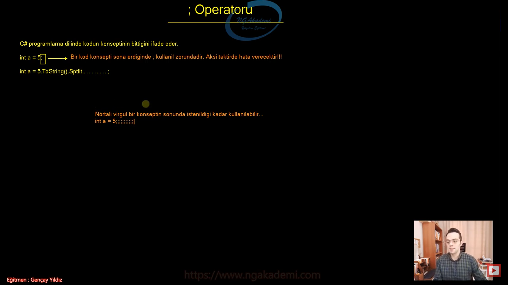

***
# 72) Kod Nasıl Çalışır? Nasıl İşlenir?
- Kod konsepti kodun nasıl çalıştığı, satır satır kod mantığının olmadığı `;` operatörü ne amaca hizmet ediyor gibi ifadeleri açıklar.

- Kod iki türlü çalışır;
    * Senkron olarak çalışır.
        - Bir işlem bitmeden öbür işleme geçmez.
        - Bildiğiniz yoldaki trafiğin ta kendisidir. Öndeki araba gitmeden sen devam edemezsin. gidemezsin.
        - Herhangi bir T zamanda yapılan işi çok rahat bir şekilde hesap edebilirsin. 
        - Herhangi bir T zamanda yapılan iş bellidir.
        - Bir kodun işlemi bitmeden diğer kod çalışmaz
    * Asenkron olarak çalışır.
        - Senkronizasyon yoktur.
        - Aynı anda paralel bir şekilde işlemler yürür.
        - Herhangi bir T zamanda yapılan işi hesaplamak biraz zahmetli olacaktır. 
        - Bir işlem yapılırken diğer işlemi beklemek zorunda kalmıyorsun.
        

- Yazılım varsayılan olarak senkron çalışır.

- Yazılımda yazılan kodlar varsayılan senkron çalışırlar.

- İleri düzey programlama ile kodumuzu asenkron hale getirebilmekteyiz.

- Günümüzdeki çoğu yazılım haliyle asenkron çalışıyor.

- Asenkron ile Senkron arasındaki fark şudur. Düşünelim ki image processing işlemi yapıyoruz. Gözü algılayana kadar kod takılır. Senkron'da göz algılayacaksın gözü algılayana kadar bir algoritma çalışacak. Algoritma sona erene kadar program takılır orada kitler. Senkron olduğu için bir sonraki kod çalışmaz. Ama bu son kullanıcı deneyimi açısından pek fazla tercih edeceğimiz yöntem değildir. O yüzden asenkron yaparız. Gözü tarayan kod asenkron çalışırken paralel de ya da aynı anda asenkron bir şekilde farklı bir kodu da çalıştırırız o da orada bambaşka birşey yapar. sonucun devam ettiğini ona göre rapor verdiğini vs bişeylerden bahseder. En azından kullanıcıyı kitlemez. Kullanıcıyı bir şekilde oyalar.

- Siz bir yandan oyun oynarken bir yandan müzik dinleyebilirsiniz. Bir asenkronluk vardır. Düşünsene oyun oynarken oyun bitmeden müzik dinleyemiyorsun ne kadar saçma olur ne kadar kullanışsız olur. İşte biz yazılımlarımızı aslında asenkron geliştireceğiz.

- Bizim kodumuz senkron bir şekilde derlenir ve senkron bir şekilde çalışır.


***
# 73) Kod Konsepti Nasıldır? Nasıl Oluşturulur?
- `int a = 5;` Bir kodu inşa ederken genellikle C#'ta bu şekilde yazacağız.
    * Yani sol tarafta bişey olacak bir karşılayıcı/tür/referans/değişken arada assign ya da referans etme operatörü olacak ve sağ taraftan gelen kod upuzun bir kod olabilir farketmiyor. Bu kod bir işlem yapıp değer döndürecek genellikle konseptimiz bu şekilde olacak.

- Ya da sağ taraftaki kod değer döndürmeyen kodda olabilir direkt sağdaki kodumuzu inşa edeceğiz. Herhangi bir değer döndürmeyecekse sadece bir işlem yapacak ama bir değer döndürmeüyorsa direkt bu şekilde bırakacağız. herhangi bir yere assign ya da referans etmeyeceğiz.

- Bir işlem yapacaksın bunun gelen değerini soldaki bir değere atayacaksın oradan devam edeceksin başka bir işlemde yine soldakine atayacaksın böyle böyle devir daim gidecek. Koda baktığınızda neredeyse %95 kullanacağımız bir konseptten bahsediyoruz. 

- Bir işlem yaptın sonuç mu var bir yere ata. Tabikide sonucuna türüne uygun bir yere ata.


***
# 74) C#'ta ;(Noktalı Virgül) Operatörü Nedir? Ne Amaçla Kullanılır?
- Kodun konseptinin bittiğini ifade etmemizi sağlayan operatördür.

- C# programlama dilinde kodun konseptinin bittiğini ifade eder.

- Sen bir kod yazıyorsun konsepti oluşturdun oluşturduğun konsept devam ededebilir bitede bilir. Örneğin;
    * `int a = 5;` 
    * `int a = 5.ToString().Split().. .. . ..;`

- `;` operatörü kod konseptinin o aşamada sona erdiğini ifade eder. Devam edebilecek koduda sonlandırabiliyorsunuz bu şekilde.

- Kod konseptinde sona gelindiğini ifade eden bir operatördür.

- Compiler `;` operatörü ile kod konseptlerini ayırıp konsept konsept kodları yorumlamaktadır. 

- Bir kod konsepti sona erdiğinde `;` operatörü kullanılmak zorundadır. Aksi taktirde hata verecektir!!! Compiler bu kodu compile etmeyecek derlemeyecektir.

- `;` operatörü bir konseptin sonunda istenildiği kadar kullanılabilir.
    * `int a = 5;;;;;;;;;;;;;;`
    * `int a = 123.ToString().Split().Rank;;;;;;;;;;;;;;;;;;;;;;;;;;;;`
    * `int a = 123.ToString().Split().Rank;`

- Tabikide bir konsepti ifade edebilmek için sadece bir tane `;` operatörü kullanmanız hani 2 tane 3 tane gereksiz yere kullanmanızdan daha temiz bir kod görüntüsü karşılayacağından dolayı yeterli olacaktır.



***
# 75) C#'ta Satır Satır Kod Mantığı Hatası!
- Genellikle düşünürken yanlışa sürükleyen line to line yani satır satır kod konseptinin aslında bir yanlıştır.

- Kod satır satır okunmaz.

- Kod satır satır compiler tarafından yorumlanmaz. Derlenmez.

- Siz zannediyormusunuz ki compiler kodu yukarıdan aşağı satır satır okuyor. Belki bilgisayar bilimlerinde bunun bir yeri olabilir ama bizim direkt temasta bulunduğumuz bu kod yüzeyinde böyle bir kural yoktur.

- Compiler kodu derlerken satır satır değil konsept konsept derliyor.

- `namespace LineToLine;class Program{ static void Main(string[] args){int a = 5;string b = "Musa";}}` Kodu tek satırda yazmamıza rağmen hala kod derlenmekte ve çalışmakta aynı zamanda işlemler devam etmektedir.

- Biz kodu satır satır yazmamızın sebebi yazdığımız kodu daha rahat okuyabilmek hızlı bir şekilde koda adapte olabilmek yani okunabilir kod inşa etmek yoksa sen kodları tek satırda da yazabilirsin.

- Satır satır kod bizim seviyemizde yoktur yanlıştır. Bilgisayar bilimleri seviyesinde belki olur öyle bir kavram vardır ama C#'ı yazarken biz bunla ilgilenirken kodu inşa ederken satır satır mantığıyla değil konsept konsept mantığıyla düşüneceğiz. Yani kodları satır olarak değilde bir konsept olarak değerlendireceksin.

- Kodlar aynı satırda olabilir ama aynı satırdaki iki farklı komutu konseptler ayıracaktır. Bu konseptleri de ayırmamızı sağlayan `;` operatörüdür. Tabi ileride farklı scope gibi kavramlarında konsepti ayırdığını göreceğiz.

```C#
namespace LineToLine;
class Program
{ 
    static void Main(string[] args)
    {
        int
         a
          =
           5
           ;
        string b = "Musa";
    }
}
```
- Eğer satır satır kod diye bir mantık olsaydı bu işlemi gerçekleştiremezdiniz. Bu kod yine derlenecek ve çalışacaktır. Çünkü konsept konsept işlem görür.


```C#
namespace LineToLine;
class Program
{ 
    static void Main(string[] args)
    {
        int a = 5;
        string b = "Musa";
    }
}
```

***
# 76) C# Kod Konseptini Özetleyelim
- Kod Nasıl Çalışır?
- Kod Konsepti Nasıldır?
- ; Operatörü
- Satır Satır Kod Mantığı Yoktur!
- Özet