***
# 77) Tür Dönüşümü Nedir? Neden Verilerin Türlerini Değiştirmek/Dönüştürmek İsteriz?
- Elimizde varsayalım ki T1 türünde bir n değeri var ve biz bu T1 türündeki n değerini süreçte T2 türüne dönüştürme yapmak istersem tür dönüşümünden yararlanırım.

- Yazılım sürecinde elimizdeki değerlerin türlerini değiştirebilmekteyiz. 

- Örneğin bir tane elma var bu elmayı biz elma türünde de tutabilirim ya da bunu meyve türünde de tutabilirim. Yani türü biraz daha genişletedebilirim ya da daraltadabilirim. Bir object'te tutup boxing'te yapabilirim.

- Bir yazılımcı hiçbir şeyi lüzumsuz yere yapmaz. Laf olsun dur ben burada bunun türünü değiştireyim diye durduk yere bir iş yapmaz.

- Örneğin senin elinde `string` -> `"123"` değeri vardır. Eğer ki sen bu 123 değerinde matematiksel işlem yapmak istiyorsan yapamazsın çünkü elimizdeki metinsel olarak tutulan sayısal değerin içerisinde/üzerinde matematiksel işlem gerçekleştiremeyiz.

- Amma velakin elimde ısrarla `string` bir tür var ve içerisinde metinsel değilde sayısala yatkın bir değer var 123'te olduğu gibi biz bunun üzerinde matematiksel işlem yapmak istersek bunu `int`,`short`,`byte` gibi türlere dönüştürüp üzerinde matematiksel işlem gerçekleştirebilirsin.

- Tür dönüşümlerinde elinizdeki verinin mahiyetine uygun bir türe dönüştürüp o türdeki işlemleri yapabilmek için kullanabiliyoruz.

- Tür dönüşümleri elimizdeki verinin fıtratındaki/mahiyetindeki türe uygun işlemlere tabi tutabilmek için uygulanabilir.
    * Elimdeki sayısal olan ama string olarak tutulan bir değeri aritmetik işleme tabi tutmak istiyorsam eğer bu değeri ben matematiksel yani sayısal değerlere dönüştürebilirim.
    * Diyelim ki uzaktan sana veri gelebilir ve diyelimki bu veri şu şekilde `string` tipinde `"true"` şeklinde olabilir. Gelen veriyi diyelim ki `if(...)` parantezleri içinde kullanmak istiyorum bu veri `string` geldi diye operasyondan vazmıgeçicem bu operasyonu gerçekleştirmeyecek miyim? Tabikide operasyondan vazgeçmeden bu gelen `string` veriyi `boolean`'a dönüştüreceksin ve operasyonu gerçekleştireceksin.

- Farklı servislerden gelen değerleri uygun türlere dönüştürmek isteyebiliriz.

- Mesela elinde `int` türünde 50 değeri var. Ben burada işlem yapacağım ama buradaki değerin üzerinde yapacağım işlemler neticesinde veri daha da büyüyor. Bu yüzden bu değeri decimal'a/long'a çevirirsin.

- Yazılımcı olarak elimizdeki veriyi kendi irademle istediğim gibi oynayabiliyorum zaten yazılımcının özelliği/özgürlüğü budur. Tabikide oynayacaksın tabikide türünü değiştireceksin.

- Ama buradaki amaç şu değildir. Dikkat!!!!
    * Elimde veri var değil mi veri ney? Elma. Elmayı meyveye dönüştürebilirim, Meyveden elmaya dönüştürebilirim amma velakin elmayı armuta dönüştüremem 

- Tür dönüşümlerinde amaç türü dönüştürmektir. Yani elimizdeki veriye uygun bir türe geçiş yapmaktır. Yani elimizdeki veriyi uygun olmayan bir türe dönüştürmeye çalışırsak bu mümkün değildir! Hata verecektir.

- Sen sayısal türe dönüşebilecek bir string ifadeyi sayısala dönüştürüyorsan amenna sıkıntı yok ama Ahmet diye bir string ifade vardır e her string değer sayısalla karşılanamaz ki o zaman sen gidip Ahmet'i int yapamazsın ki demek ki buradaki genellememiz Elimizdeki türe uygun dönüşüm yapılmalıdır. Elmayı armut olarak dönüştürmeyeceğiz.

- Amaç veriyi dönüştürmek değil amaç o veriyi karşılayabilecek farklı bir türe verebilmek.

- Amaç veriyi değiştirmek değildir!!! Amaç elimizdeki veriyi karşılayabilecek farklı bir türe dönüştürmektir.

- Amaç tür dönüştürmek değeri dönüştürmek değil 
    * Amaç `int`'i `short`'a dönüştürmek.
    * Amaç `int` içindeki 123'ü `bool` türdeki false ya da true'ya dönüştürmek değil Veriyi değil türü dönüştürmektir. 

- Zaten hiçbir zaman veriyi dönüştürmek gibi derdimiz olamaz eldeki veri ya işlenir ya da işlenmez. Dönüştürmek diye bir derdin olmaz veriyi. Türünü dönüştürürsün veriyi işlersin ondan bir sonuç üretirsin ama dur lan elimdeki veriyi başka birşey yapayım diye bir derdin olmaz.

- Zaten elindeki elmayı armut yapmak istiyorsan elmadan armut çıkaramayacağını bilmen lazım bir kodlama sürecinde. Armutu farklı algoritmayla üretmen gerektiğini de farketmen gerekiyor.

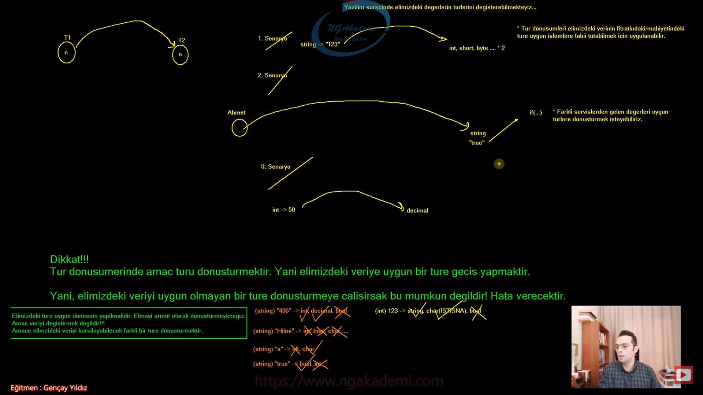

***
# 78) Metinsel İfadelerin Diğer İfadelere Dönüştürülmesi - Parse Fonksiyonu
- Parse metodu sadece string dataları hedef türe dönüştürürken kullanılır!

- `int` değeri `char`'a dönüştürürken Parse metodunu kullanamazsın!

- Elindeki `string` ifadeyi herhangi bir type'a herhangi bir T türüne dönüştürmek istiyorsan Parse metodunu kullanabilirsin.

- Parse'ın fıtratı şu şekildedir.
    * `string a = 123;` sen bu değeri hangi türe dönüştürmek istiyorsan öncelikle o türü yazıyorsun ardından (`type.Parse(....)`) .Parse() diyerek  ardından parantez içine string ifadeyi yerleştiriyorsun bu bir değişkende olabilir ya da direkt manuel olarak yerleştirebilirsin artık bu komut buradaki `type` ne ise geriye o türde değer döneceğinden dolayı o türle karşılanabilir o değer. Örneğin;
        * `type y = type.Parse(.....);`


- Tür dönüşümlerinde dikkat edilmesi gereken tek bir husus vardır ki, o da ; dönüşüm yapılacak verinin türüne uygun bir hedef tür belirlenmelidir.
    * Yani elinde elma varsa elmayı karşılayabilecek türlere dönüştürmen en doğrusu olacaktır. Nihayetinde elinde elma var sen gidipte bunu karpuza dönüştürmeye çalışırsan haliyle orada hata alacaksın.

- Dönüşüm yaparken derleme zamanında sıkıntı olmaz. Yani semantik açıdan olayı değerlendirirsek syntax'ta herhangi bir problem olmaz. Compiler bunu derlerken sıkıntı yaşamayacak Runtime'da hata verecek. Çünkü dönüşüm Runtime'da gerçekleşir.

- Dönüşüm sırasında dönüştürülen türe verilen değer eğer uygun olmayan bir değerse ya da uygun olmayan formatta bir değerse dönüşüm yapamayacak hata vercektir/fırlatacaktır. Patlayacaktır.

- Parse metodu elimizdeki string ifadeyi hedeflediğimiz türe dönüştürmemizi sağlayan bir metod sen bu metodu istediğin yerde istediğin türe dönüşüm yapmak için kullanabilirsin. Sadece elindeki değerin hedeflediğin türe uygun olup olmaması çok önemli ona dikkat ediyorsun ondan sonrasını/geri kalanını fonksiyonumuz hallediyor.

```C#
Metinsel İfadelerin Diğer İfadeler Dönüştürülmesi
//Tür dönüşümlerinde dikkat edilmesi gereken tek bir husus vardır ki, o da ; dönüşüm yapılacak verinin türüne uygun bir hedef tür belirlenmelidir.
Parse Metodu
//Parse metodu sadece string dataları hedef türe dönüştürürken kullanılır!


string x = "123";
// System.Console.WriteLine(x * 5);
short x2 = short.Parse(x);
System.Console.WriteLine(x2 * 5);
System.Console.WriteLine(short.Parse(x) * 5);


//Tür HATALI
string a = "Ahmet";
int a2 = int.Parse(a);
System.Console.WriteLine(a2);


//Tür HATALI
string medeniHal = "Evli";
bool medeniHal2 = bool.Parse(medeniHal);
System.Console.WriteLine(medeniHal2);


//Tür HATALI
string v = "ab";
char v2 = char.Parse(v);
```

***
# 79) Metinsel İfadelerin Diğer İfadelere Dönüştürülmesi - Convert Fonksiyonları
- Convert fonksiyonu bir tek Parse fonksiyonunda olduğu gibi stringleri diğerlerine dönüştürmüyor her birini birbilerine karşı dönüştürme işlemini sağlıyor.

- Burada türüne uygun bir veriyi dönüştürmeye dikkat edeceksiniz. Nihayetinde uygun değilse yine hata verecektir.

```C#
Convert Fonksiyonları

string x = "25";
int x2 = Convert.ToInt32(x);


string y = "3,14";
double y2 = Convert.ToDouble(y);
System.Console.WriteLine(y2 * 5);
```

***
# 80) Diğer İfadelerin Metinsel İfadelere Dönüştürülmesi
- Eğer ki elimizdeki veriyi string'e dönüştürmek istersek Convert fonksiyonunu ve ToString fonksiyonunu kullanabiliriz.

- Elimizdeki veri dönüşüm yapacağımız veriye kesinlikle uyması gerek demiştik burada buna dikkat etmenize gerek yok. Herhangi bir veri `string` ile çok rahat bir şekilde ifade edilebilir.

- Hangi veri varki string'le ifade edemeyeceğiniz? Dolayısıyla aklınıza gelen tüm verileri string'e dönüştürebiliyorsunuz.

- Diğer ifadelerin metinsel ifadelere dönüşmesini hızlı bir biçimde yapmamızı sağlayan ToString fonksiyonu mevcuttur.

- Bir yazılım sürecinde genellikle tür dönüşümlerinde metinselden diğer türlere değil de diğer türlerden metinsel'e doğru olur. Elinizdeki herhangi bir veriyi metinsele daha çok dönüştürüyorsunuz.

- ToString fonksiyonu tümmmm ama tüm türlerde mevcuttur.

- Kalıtımsal bir işlem neticesinde tüm türlere aktarılan bir fonksiyondur.

```C#
Diğer İfadelerin Metinsel İfadelere Dönüştürülmesi
Convert Fonksiyonu

int a = 25;
string a2 = Convert.ToString(a);


ToString Fonksiyonu
//ToString fonksiyonu tümmmm ama tüm türlerde mevcuttur.

float f = 35F;
string f2 = f.ToString();
```

***
# 81) C# Sayısal İfadelerin Kendi Aralarında Tür Dönüşümü
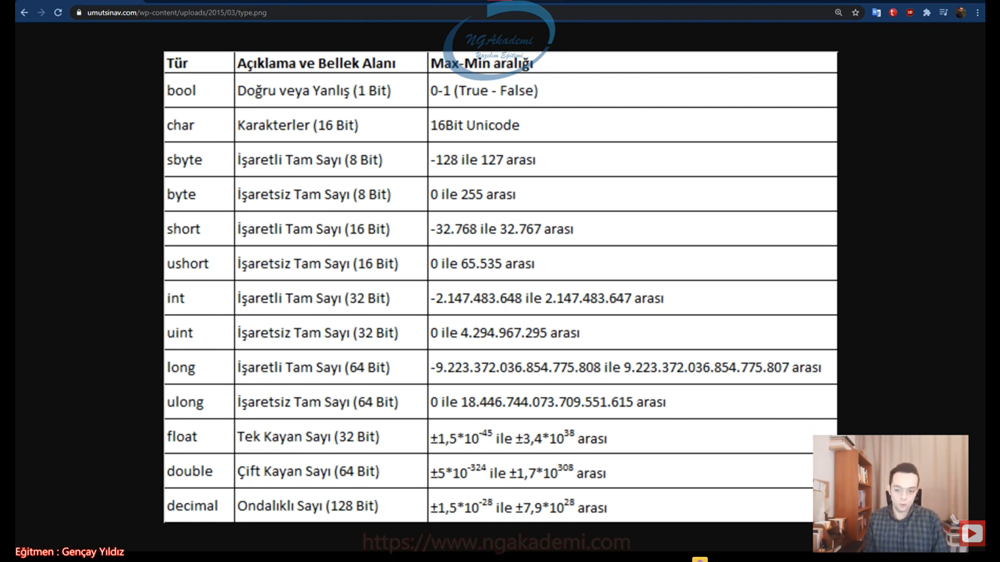

- Sayısal türler kendi aralarında dönüşüm yaparken birazcık farklı bir derinlikte kontrol gerektirebiliyor.

- Bir sayısal değeri tuttuğum türün üstündeki değerlere dönüştürürken herhangi bir dönüşüm yapmaya ihtiyacımız yoktur.

- Diyelim ki elimizde `int` türünde bir n değerimiz var. Bu değeri `long`'a, `float`'a , `decimal`'a  yani `int` aralığına giren tüm değerler bu aralıklara da girecektir. O yüzden burada ekstradan bir dönüşüm yapmaya gerek yoktur.

- Sayısal türler arasında eğer ki bir veriyi kendisinden üst olan türe dönüştürüyorsanız biz buna bilinçsiz tür dönüşümü diyeceğiz.

- `int` türde tuttuğumuz değeri daha dar aralıklara sahip olan sayısal türlere dönüştürmeye çalışırsan çok dikkat etmek zorundasın. Çünkü int` aralığa sığan her değerin `short`'a `byte`'a ya da daha az değer aralığındaki türe sığabileceğinin garantisini veremiyoruz.

- Kendisinin tutulduğu alanın değer aralığının altındaki bir türe dönüştürmeye çalışırken burada alt türe dönüşüm esnasında o değer aralığına sığmayabilir değerimiz. Yani `int` aralığa sığan her değerin `short`'a `byte`'a sığabileceğinin garantisini veremiyoruz.

- Eğer ki bir sayısal değer nasıl ki kendisinden tutulduğu türden üst türlere dönüştürülürken bilinçsiz tür dönüşümü diyorsak artık kendisinin tutulduğu türden alt türlere dar aralıklı sayısal türlere dönüştürülürken buna bilinçli tür dönüşümü diyoruz.

- Bir sayısal değer kendi türünden daha büyük değer aralığına sahip olan diğer türlere dönüştürülürken burada herhangi bir işlem yapmamıza gerek kalmayacağı için bu dönüştürme işlemine bilinçsiz tür dönüşümü denir.

- Bir sayısal değer kendi türünden daha küçük değer aralığına sahip olan diğer türlere dönüştürülürken hedef türün ilgili veriyi karşılayamama(değer aralığına sığamama) riskinden dolayı buradaki işlemi bilinçli yapmamız gerekecek haliyle buna bilinçli tür dönüşümü denir.

- Bilinçli ve bilinçsiz tür dönüşümü var bu iki kavram sayısal türlerde ve ileri düzey programlamada da var. Nesneler arasında biz bunu sağlayacağız. Ama temelde sayısal türlerde geçerlidir.

- Elimdeki bir değeri kendisinden büyük olan türlere dönüştürüyorsam bununla ilgili benim bilinçli iradeli bir şekilde işlem yapmama gerek yok. O zaman ben yapmıyorsam bu işlemi bilinçsiz tür dönüşümüdür. Elimdeki bir değeri kendisinden daha dar aralığa sahip olan bir sayısal türe dönüştürürken burada sığmama ihtimali var aralıktan daha büyük olma ihtimali var. Bilgisayar diyor ki y kardeşim ben bu ihtimali göze alamam o kadar da değil. Developer olarak bilinçli bir şekilde tür dönüşümünü yap diyorum orada irademizi ortaya koyuyoruz. Alta doğru giderken değer aralığı daraldıkça elindeki veriyi oradaki daralan değer aralığına dönüştürürken buradaki kararı sen kendi iradenle vermiş oluyorsun. Buradaki iradeye bilinçli tür dönüşümü diyoruz. Diğerinde senin iradene gerek yok bişey yapmana gerek yok kendisi zaten yapıyor. İradeni ortaya koymana gerek yok buna da bilinçsiz tür dönüşümü diyoruz.

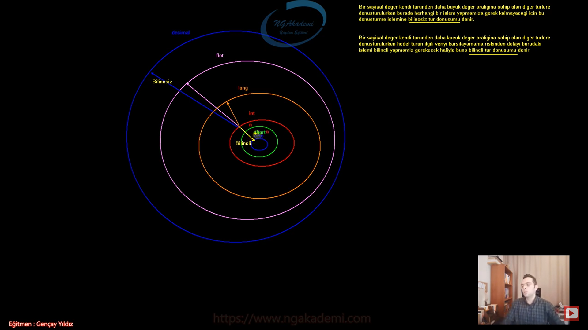

- Diyelim ki elimde 37000 değeri var ve biz bunu `int` türde tutuyoruz. Şimdi `int`'de tuttuğumuz 37000 değeri kendisinden büyük olan diğer değer aralıklarına otomatik girer. Bunlara dönüşüm yaparken bilince ihtiyaç yok bilgisayar kendisi hallediyor. İradeli bir şekilde karar vermiyorsun kendisi bilinçsiz bir şekilde hallediyor. Amma velakin elindeki `int`'de tutulan 37000 değerini sen `int`'den küçük olan sayısal değerlere dönüştürürken her değer aralığına girmeme ihtimali vardır. Yazılım diyor ki sana ya kardeşim senin elindeki değerle ben ilgilenmem bir sayısal türün içerisindeki değer ne olursa olsun 3'te olsa farketmiyor kendisinden küçük olanlara dönüştürülmeye çalışıldığında buna ben müsaade etmem sen kendi iradenle yapacaksın ben bunu kendim yapmam senin iradenle bunu yaparım. Senin sorumluluğun lazım burada diyecektir. Buradaki riski developer alır.

- Bir sayısal türün alt türüne bir veriyi dönüştürdüğümüzde eğer ki veri o alt türün değer aralığına girmiyorsa veri kaybı söz konusu olacaktır. Evet dönüşüm sağlanacak ama veri kaybı olacaktır. Yani dönüştürmeye çalıştığımız değeri alt türün değer aralığına göre modunu alacak ve kalanı oraya yazacaktır.
    * Örneğin `int` türde tutulan 37000 değerini `byte`'a dönüştürdüğümüzde veri kaybı olacaktır.Evet dönüşüm sağlanacak ama veri kaybı olacaktır. `byte`'ın değer aralığı 0-255 arasındadır. Durmadan verdiğimiz değeri 256'ya bölecek yani 256'ya göre modunu alacak ve kalan değeri oraya yazacaktır. Kalan değer olacaktır geri kalanı da değer/veri kaybı olarak geçecektir. İşte compiler diyor ki buradaki sorumluluğu ben almam kardeşim sen yapacaksın. bunu diyor.

- Compiler bilinçsiz tür dönüşümünü ben hallederim diyor.Herhangi bir türdeki sayısal değeri kendisinden büyük olan sayısal değere dönüştürme yaparken bunun sorumluluğunu üstleniyor ama elimizdeki bir sayısal değeri kendisinden küçük olan sayısal değerlere dönüştürürken Compiler orada veri kaybı ihtimali olduğu için bu riski/sorumluluğu almıyor. Taşın altına elini sokmuyor. Sen kendi iradenle karar ver. İşte buradaki karar durumu da bilinçli tür dönüşümü oluyor.

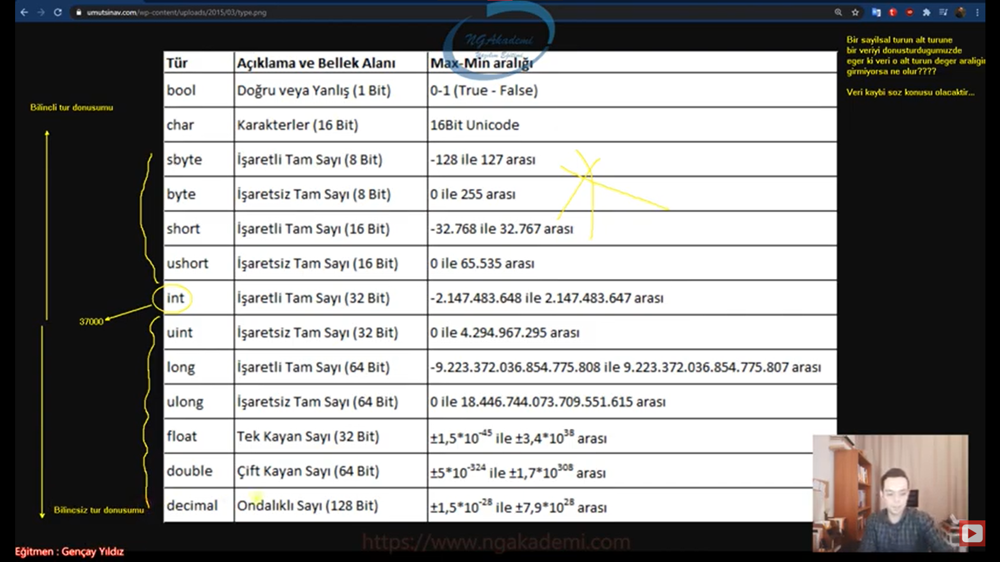

***
# 82) C# Bilinçsiz Tür Dönüşümü - Implicit Type Conversion
- Elimizdeki sayısal ifadenin bulunduğu türden daha geniş aralıklardaki türlere dönüşüm yapılırken bunu compiler'ın kendisinin sorumluluğu alması yani bizim irademize/bilincimize/kararımıza gerek kalmaksızın dönüşümü otomatik olarak gerçekleştirmesidir.
    * 3000 değerini biz `int` türünde ele alırsak şimdi `int`'den büyük olan bir tane değer/tür örneğin `float` türü bu değeri `int` türünden `float` türüne dönüştürmeye çalıştığımda zaten `float`'ta 3000 değerini kapsayan bir tür olduğundan dolayı buradaki dönüşüm otomatik gerçekleşecektir. Yani compiler diyecek ki ulan zaten `int`'e giren değer `float`'a da her halükarda girecek o yüzden buradaki dönüşüm sorumluluğunu ben kendim üstleniyorum diyecektir. İşte burada biz developer'ın herhangi bir sorumluluğu olmadığından dolayı biz buna bilinçsiz tür dönüşümü diyoruz.
    * `int a = 3000;`
    * `float f = a;` Burada bir tür dönüşümü söz konusudur. Çünkü elimde `int` tutulan bir değeri `float` cinsinden RAM'de depolayabildim. Yani türünü dönüştürdüm. Lakin buradaki tür dönüşümü bizim irademizle/kararımızla/bilincimizle yaptığımız bir dönüşüm değildir. Zaten compiler bunu otomatik kendisi algıladı. Dolayısıyla `float` `int`'i kapsadığı için otomatik buradaki tür dönüşümünü herhangi bir sıkıntı olmadan zaten herhangi bir sıkıntı olacak durum yok Compiler buradaki sorumluluğu kendisi üstlenmektedir. Dolayısıyla tür dönüşümü başarılı bir şekilde gerçekleşmiştirilmiştir.
    * Normalde sol sağ kuralı vardı. Soldaki türümüz neyse sağdaki değeri karşılayan bir tür olmalıydı. Ama istisnai durumlar vardır. Mesela kapsayıcı durumlar. Hatta ileride göreceğiz kalıtımda polimorfizm dediğimiz çok biçimlilik var bu çok biçimlilikte de farklı referanslar farklı türdeki nesneleri karşılayabilmektedirler. 
    * Mesela elimdeki `int` türdeki a değişkeninin değerini `float`'a verdiğim zaman herhangi bir tür dönüşümü yapmama gerek yok.

- Bir sayısal türün kendisinden daha geniş aralıktaki bir başka sayısal türe atanması bilinçsiz tür dönüşümüdür.


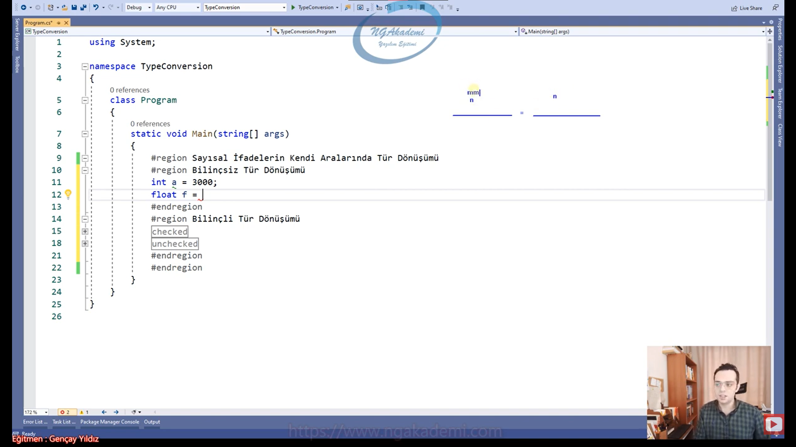
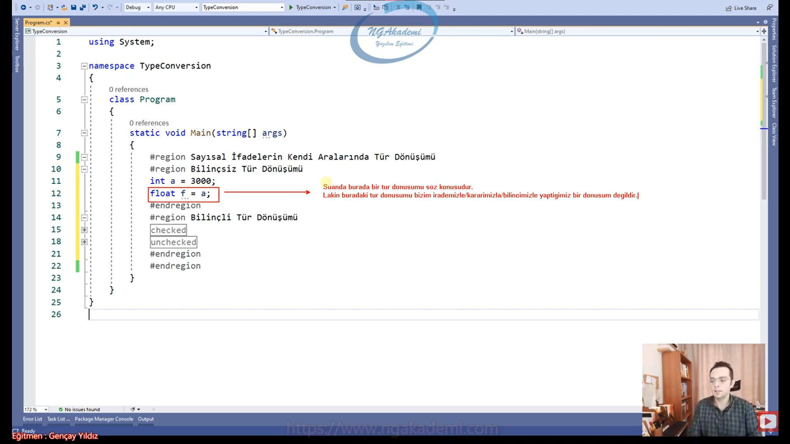

```C#
Bilinçsiz Tür Dönüşümü
//Bir sayısal türün kendisinden daha geniş aralıktaki bir başka sayısal türe atanması bilinçsiz tür dönüşümüdür.

int a = 3000;
float f = a;


short x = 123;
long y = x;

```
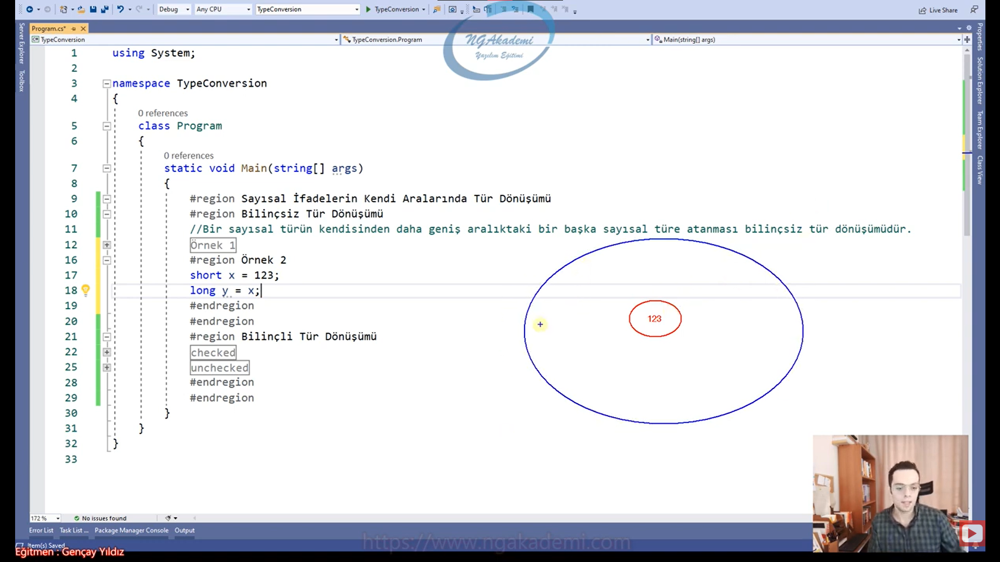

***
# 83) C# Bilinçli Tür Dönüşümü - Explicit Type Conversion
- Sayısal türlerin kendi aralarında tür dönüşümünde en önemlisi olan bilinçli tür dönüşümüdür.

- Elimizdeki herhangi bir sayısal ifadeyi kendisinden daha dar/küçük alana sahip olan bir türe atamaya çalıştığımızda compiler burada veri kaybı söz konusu olabileceğinden dolayı sorumluluğu almıyor üstlenmiyor. Diyor ki kardeşim bunu ben yapmam taşın altına sen elini sok veri kaybı olacaksa da bunun kararını sen ver en azından beni bu belaya sürükleme ve bilinçli bir şekilde kararını ver diyor. Buradaki veri kaybı ihtimalini bilinçli bir şekilde kararını/sorumluluğunu sen al diyor.
    * `int x = 3000;`
    * `short y = (short)x;`
    * Elimizdeki `int` türündeki 3000 değerini `short` 'a atamaya çalıştığımızda biliyoruz ki `short` türü normalde 3000'i karşılayabilir ama compiler şu anda elimizdeki değerle ilgilenmiyor direkt prensiple ilgileniyor. Diyor ki ya kardeşim bu değişken değerden bağımsız olarak `int`'de tutuabildiğin bir değer her daim `short`'a sığmayabilir. Sığmama ihtimali olduğundan dolayı da hangi değer olursa olsun istersen sığan olsun istersen sığmayan olsun farketmez büyük türden küçük türe bir atama söz konusu varsa buradaki dönüşümün sorumluluğunu ne olursa olsun ben almam. Değişkenin değerine bakmam sen sorumluluğun kararını vereceksin. Sorumluluğu sen üstleneceksin. Dolayısıyla hata verecektir.
    * Elimdeki x değeri normalde `int`, `int` `short`'a compiler kendisi atamıyor. Şimdi irademizde diyeceğiz ki kardeşim `int` olan x değişkenini sen `short`'a ata buradaki sorumluluğu ben alıyorum. Yani burada x değişkeninin içerisindeki veriyi sen `short` ile karşıla varsa bir veri kaybı bunu ben üstleniyorum diye bunu bilinçli bir şekilde yazdık

- Bilinçsiz tür dönüşümünde biz atamayı çok rahat bir şekilde yapabiliyorduk ve orada bir dönüşüm vardı görmesekte Compiler'ın üstlendiği bir bilinçsiz bir tür dönüşümü söz konusuydu ama burada diyor ki ya kardeşim bunu ben yapmam bunu senin yapman lazım işte görüldüğü üzere elimizde herhangi bir değer kendisinden daha küçük değer aralığına sahip türe dönüşüm yaparken elimizdeki değer ilgili dönüşüm yapmaya çalıştığımız hedef türün dışındaysa burada veri kaybı olacaktır. Modunu alıyordu. Böyle bir durumda sorumluluğu compiler almıyor. Buna bilinçli tür dönüşümü diyoruz.

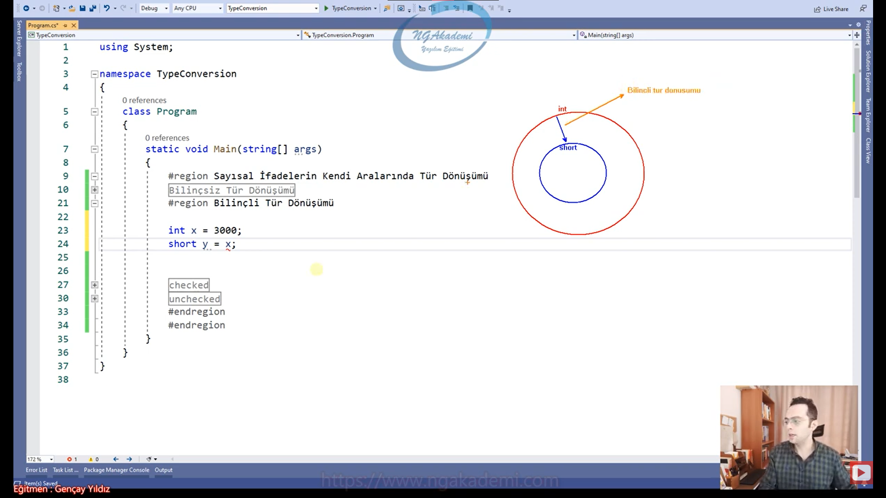

- Bilinçli tür dönüşümü yazılımda yine cast operatörüyle `()` gerçekleştirilir.

- Boxing işlemlerinde tanıştığımız cast operatörü bilinçli tür dönüşümünde de sayısal türleri kendi aralarında dönüştürürken iradeli bir şekilde bu işlemin yapılmasını sağlayan bir operatördür.

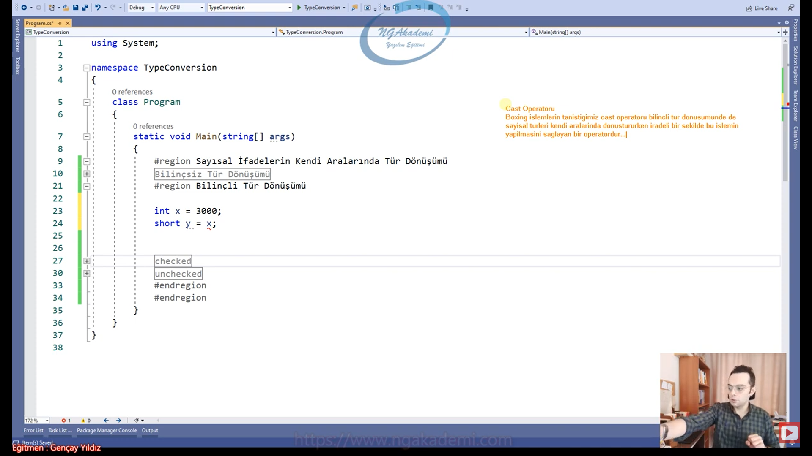

- Bilinçsiz tür dönüşümünde ilgili değişkeni cast etmenize gerek yoktu ama bilinçli tür dönüşümünde cast edeceksiniz sen bilinçli bir şekilde bu talimatı vereceksin.

- Senin dönüştüreceğin sayısal değer hedeflediğin sayısal türün aralığına girerse herhangi bir veri kaybı olmaz. Amma velakin aralığa girmezse o zaman veri kaybı yaşanacaktır.

- Bilinçli tür dönüşümünde veri kaybı olmasının altında yatan şey buradaki sorumluluğu bilinçli bir şekilde bizim almamızdır. Bilgisayar burada kendisini aklıyor.

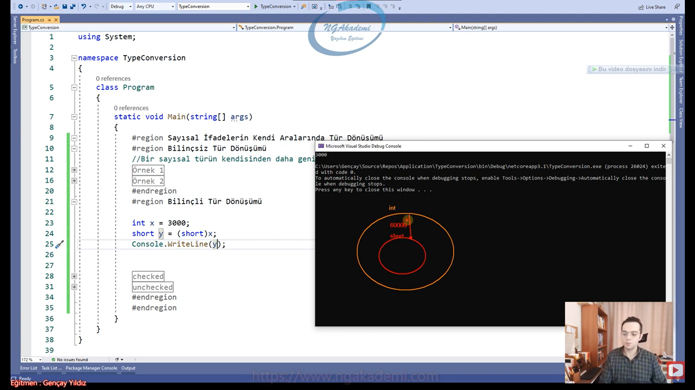

```C#
Sayısal İfadelerin Kendi Aralarında Tür Dönüşümü
Bilinçli Tür Dönüşümü

int x = 3000;
short y = (short)x;
Console.WriteLine(y);


int a = 60000;
short b = (short)a;
Console.WriteLine(b);


Örnek 3
int c = 60000;
byte d = (short)c;
Console.WriteLine(d);
```

***
# 84) Bilinçli Tür Dönüşümü - Kritik Yapalım(Mülakatlar İçin)
```C#
int a = 3000;
short s = (byte)a;//int'den byte türüne bilinçli bir dönüşüm yapılmıştır. daha sonrasında ise byte olan değeri short'a atama yapmış bu yüzden burada ise bilinçsiz tür dönüşümü yapmıştır.
```
- Bilinçli tür dönüşümü mü yapılmış bilinçsiz tür dönüşümümü.

- `(byte)a` burada bilinçli tür dönüşümü yapılarak elde edilen `byte`'a dönüştürülmüş değer `short` türünden bir değişkene atanarak bilinçsiz tür dönüşümü yapılmıştır.

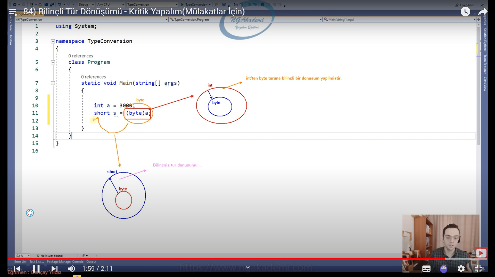

***
# 85) C# checked Bloğu İle Bilinçli Tür Dönüşümü Kontrolü
- `checked` komutu bilinçli tür dönüşümü yapılırken eğer ki veri kaybı söz konusuysa runtime'da bir hata fırlatılmasını sağlar. Örneğin;
    * ` int a = 123;`
    * `byte b = (byte)a;` herhangi bir veri kaybı söz konusu değildir. Nihayetinde a'nın içerisindeki değer `byte`'ın içerisine sığan bir değer olduğu için bu tür dönüşümü esnasında veri kaybı söz konusu olmayacak.

- `checked` veri kaybı olan bilinçli tür dönüşümlerinde bizleri çalışma zamanında hata fırlatarak uyaran bir kod bloğudur.

- `checked` öncelikle checked keywordüyle birlikte scope'larını oluşturuyoruz. Daha sonrasında ise veri kaybı söz konusu olabilecek kodlarımızı bu scope içerisine yerleştiriyoruz.

- Elimizdeki değer eğer ki sınırı aşıyorsa `checked` veri kaybı olacağı durumda bunu kontrol edecek ve biz developer'ı runtime'da uyaracaktır.

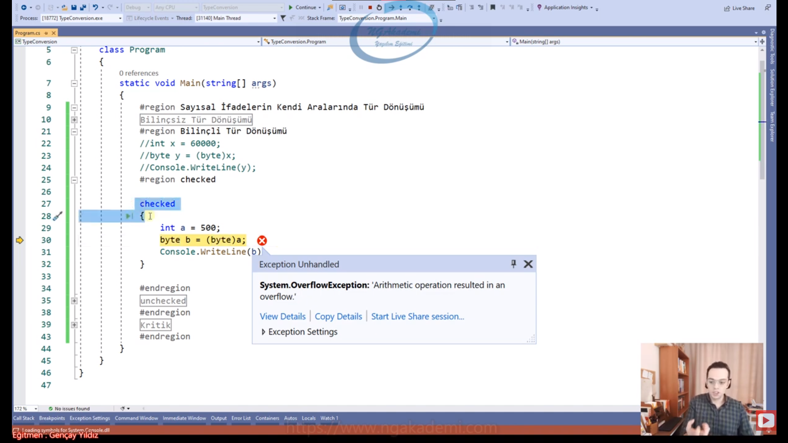

- `checked`'in biz developerlar açısından runtime'da bir veri kaybı söz konusuysa bizi bilgilendirmesidir.

- Bilinçli tür dönüşümü esnasında bir veri kaybı söz konusu olursa eğer runtime'da bizleri uyaracak olan bir kontrol mekanizmasıdır.

```C#
Checked
int a = 123;
byte b = (byte)a;
System.Console.WriteLine(b);
checked
{
    int a = 500;
    byte b = (byte)a;
    System.Console.WriteLine(b);
}
```

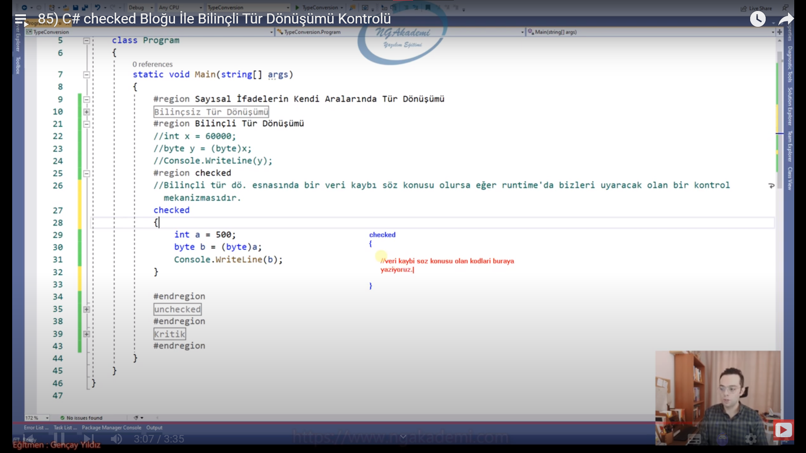

***
# 86) C# unchecked Bloğu İle Bilinçli Tür Dönüşümü Kontrolü
- Bilinçli tür dönüşümü sırasında veri kaybı söz konusuysa eğer bunu görmezden gelir ve runtime'da hata vermez.

```C#
int a = 500;
byte b = (byte)a;
System.Console.WriteLine(b);
```
- Bu kod runtime'da veri kaybına sebep olabilecek bir koddur.

- Eğer ki siz buradaki veri kaybını `unchecked` ile kontrol ederseniz veri kaybını göz ardı edecek ve bu kodu çalıştıracaktır.

- Normal bir kod bloğu default olarak `unchecked`'tir. Yani kodu ha `unchecked` içine yazmışsın ha da `unchecked` kullanmadan yazmışsın farketmiyor. Her halükarda veri kaybına izin verecektir. 

- Default olan `unchecked`'tir. Eğer ki siz bunu kontrol etmek istiyorsanız `checked` yazmanız gerekiyor.

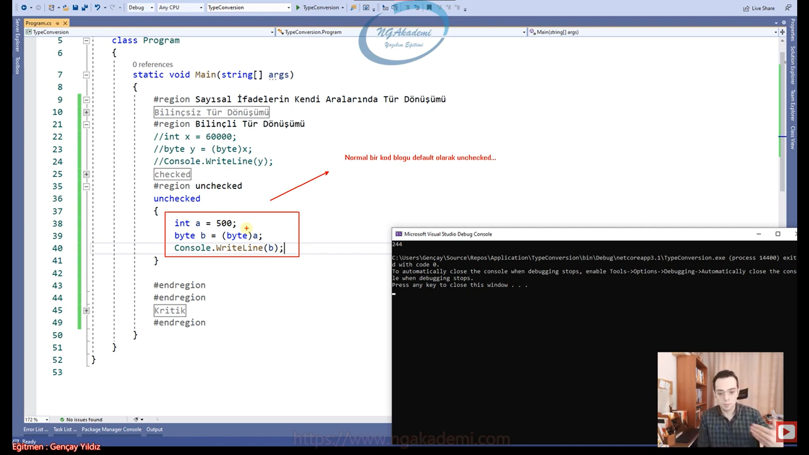

***
# 87) bool Türünün Sayısal Türe Dönüştürülmesi
- İki tane özel türümüz var bu özel türler arasında yapılan dönüşümlerden biri `bool` -> `int` bir diğeri `char` -> `int` arasında yapılan tür dönüşümüdür.

- `bool` türdeki bir değişkeni/değeri sayısal bir türe daha doğrusu `int`'e dönüştürürseniz convert ederseniz direkt elindeki değerin sana sayısal karşılığını verecektir.

- Elimizde `bool` bir değişkenimiz var ve bunun değeri `true` ya da `false` olabilir. Sen bunu `int`'e Convert edersen bunun sonucu sayısal olarak aktarılacak/dönüştürülecektir bu özel bir dönüşümdür. `true`'yu 1 `false`'u da 0 olarak dönüştürecektir.

- Burada sadece `int`'e değil sayısal türlerden herhangi birine de dönüşüm sağlayabilirsiniz.

- Elinizdeki herhangi bir mantıksal değeri herhangi bir sayısal değere dönüştürdüğünüzde onun sayısal karşılığını çok rahat edinebilirsiniz.

- Elimizdeki mantıksal bir değeri herhangi bir sayısal değere convert edersek ilgili değerin mantıksal karşılığını elde edebiliriz...

```C#
bool Türünün Sayısal Türe Dönüştürülmesi
//Elimizdeki mantıksal bir değeri herhangi bir sayısal değere convert edersek ilgili değerin mantıksal karşılığını elde edebiliriz...

bool b = true;
int i = Convert.ToInt32(b);
System.Console.WriteLine(i);

bool c = false;
long l = Convert.ToInt64(c);
System.Console.WriteLine(l);
```

***
# 88) Sayısal Türlerin bool Türüne Dönüştürülmesi
- Elimizdeki herhangi bir sayısal ifadeyi `bool` türüne dönüştürebilmekteyiz.

- Tür dönüşümlerindeki en önemli nokta dönüştüreceğimiz verinin hedef türe uygun olmasıydı.

- 0'ın dışındakilerin hepsi `true` olarak döndürülecektir. Yani sadece 0'ın dışındaki değerler `true` 0 ise `false` olarak değerlendirilecektir.

- tür dönüşümlerinde dönüştürülecek türün hedef türe uygun olması gerekiyordu. Ama burada istisnalar var. Normalde 1'in `true` 0'ın `false`'a eşit olması ve geri kalanının mümkün olmaması gerekmektedir. Halbuki burada 0'ın dışındaki tümmm değerler `true` olarak kabul edilmesi bir istisnadır.

```C#
#region Sayısal Türlerin bool Türüne Dönüştürülmesi
//Tür dönüşümlerinde dönüştürülecek türün hedef türe uygun olması gerekiyordu.
//Burada bir istisna var.
//normal de;
//1 -> true
//0 -> false
//eşit olması ve geri kalanının mümkün olmaması gerekmektedir. Halbuki burada 0'ın dışındaki tümmmm değerler true olarak kabul edilmesi bir istisnadır.

int i = 1;
bool b = Convert.ToBoolean(i);
System.Console.WriteLine(b);


int j = 0;
bool c = Convert.ToBoolean(j);
System.Console.WriteLine(c);


int k = 123;
bool d = Convert.ToBoolean(k);
System.Console.WriteLine(d);


int l = -123;
bool e = Convert.ToBoolean(l);
System.Console.WriteLine(e);
```

***
# 89) char Türünün Sayısal Türe Dönüştürülmesi (ASCII)
- Bilgisayardaki her bir klavyede gördüğünüz karakterin aslında arka planda bir tam sayı karşılığı vardır. Büyük küçük olarakta bunlar ayrılır. örneğin;
    * 'C' karakteri 67 iken 'c' 99'dur.
    * Bunlar standarttır. Yani dünya standardıdır. Her yerde aynıdır. Her bilgisayarda bu ASCII kodları birebir aynı şekilde standart hale getirilmiştir.

- ASCII : Bilgisayardaki her bir karakterin sayısal bir karşılığı vardır. Bu sayısal değerler ASCII kaynak kodu denmektedir.

- Örneğin ben 'a' harfi yazmaya çalıştığımda aslınad bilgisayar onu 97 olarak algılıyor diye düşünebilirsiniz.

- Bir karakteri(`char`) `int`'e cast edersek buradaki işlem neticesinde elimizdeki karakterin bize ASCII kaynak kodunu verecektir.

- Benzer mantıkla elimizdeki herhangi bir `int` değeri `char`'a cast edersek elimizdeki `int`'e karşılık gelen `char`'ın karakterini verecektir. Tabiki elimizdeki `int` değer ASCII kaynaklarından birisi olması gerekmektedir.

- Klavye üzerindeki bütün tuş kombinasyonlarının esasında arka planda bir ASCII kaynak kodu vardır.

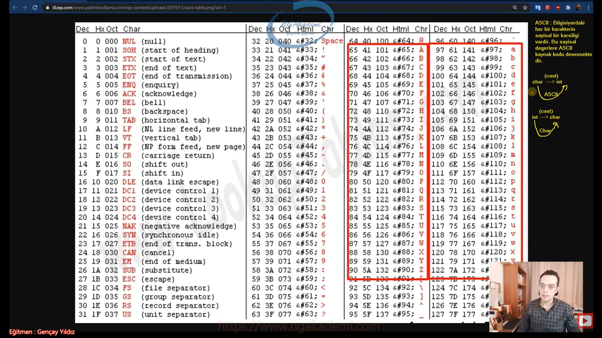

- Cast operatörünü `()` UnBoxing, Bilinçli tür dönüşümü, ve `char` to `int` dönüşümünde kullandık. Bir operatör yeri ve konumuna göre farklı sorumluluklar üstlenebiliyor. Burada da ASCII kaynak kodunu elde etmek için ya da elimizdeki kaynak kodundan `char`'ı elde edebilmek için kullandığımız bir operatöre dönüşüyor cast operatörü `()`

- Sayısal türlerin hepsi için geçerlidir. Herhangi bir farklı tür üzerinde bu işlemi gerçekleştirememekteyiz.

- Elimizdeki herhangi bir karakterin ben ASCII kaynak kodunu elde etmek istiyorsam herhangi bir sayıya cast etmem yeterli olacaktır.

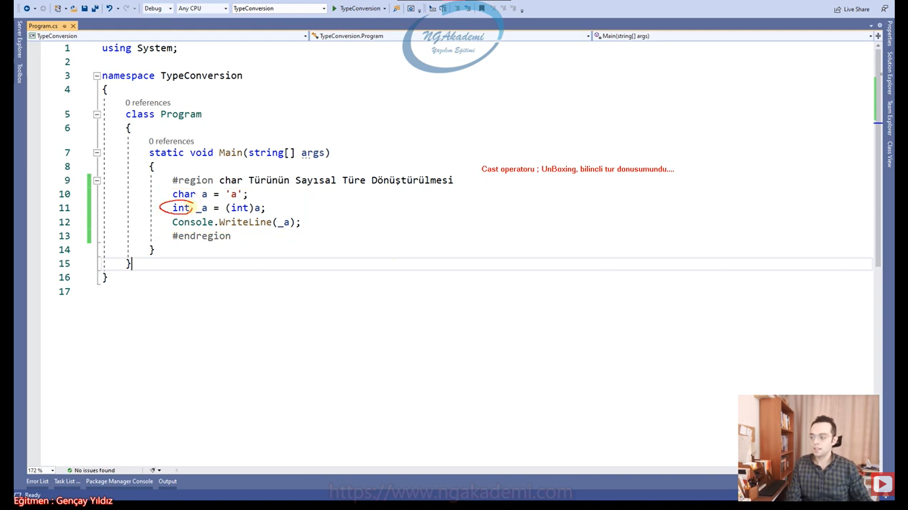

***
# 90) Sayısal Türlerin char Türüne Dönüştürülmesi
- Elimizdeki sayısal türlü değeri eğer ki ASCII kaynak kodunda karşılığı varsa dönüştürme yaparak o karakteri getirecektir.

- Elimdeki kaynak kodlarını `char`'a cast edersem `char` karşılıklarını elde edebilirim.

- Elinizdeki herhangi bir tam sayısal değeri `char`'a cast ederseniz ASCII karşılığı olan karakteri sizlere getirecektir.

```C#
Sayısal Türlerin char Türüne Dönüştürülmesi
int oAscii = 111;
int OAscii = 79;
System.Console.WriteLine((char)oAscii);
System.Console.WriteLine((char)OAscii);
```

***
# 91) Tür Dönüşümlerinde Neler Öğrendik Özetleyelim
- Tür Dönüşümü Nedir? Neden Verilerin Türlerini Değiştirmek/Dönüştürmek İsteriz?
- Metinsel İfadelerin Diğer İfadelere Dönüştürülmesi | Parse Metodu
- Metinsel İfadelerin Diğer İfadelere Dönüştürülmesi | Convert Fonksiyonları
- Diğer İfadelerin Metinsel İfadelere Dönüştürülmesi
- Sayısal İfadelerin Kendi Aralarında Tür Dönüşümü
- Bilinçsiz Tür Dönüşümü
- Bilinçli Tür Dönüşümü
- Kritik(Mülakatlar İçin)
- checked
- unchecked
- bool Türünün Sayısal Türe Dönüştürülmesi
- Sayısal Türlerin bool Türüne Dönüştürülmesi
- char Türünün Sayısal Türe Dönüştürülmesi | ASCII
- Sayısal Türlerin char Türüne Dönüştürülmesi
- Özet
