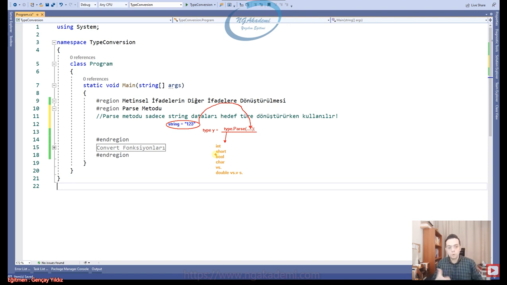

***
# 77) Tür Dönüşümü Nedir? Neden Verilerin Türlerini Değiştirmek/Dönüştürmek İsteriz?
- Elimizde varsayalım ki T1 türünde bir n değeri var ve biz bu T1 türündeki n değerini süreçte T2 türüne dönüştürme yapmak istersem tür dönüşümünden yararlanırım.

- Yazılım sürecinde elimizdeki değerlerin türlerini değiştirebilmekteyiz. 

- Örneğin bir tane elma var bu elmayı biz elma türünde de tutabilirim ya da bunu meyve türünde de tutabilirim. Yani türü biraz daha genişletedebilirim ya da daraltadabilirim. Bir object'te tutup boxing'te yapabilirim.

- Bir yazılımcı hiçbir şeyi lüzumsuz yere yapmaz. Laf olsun dur ben burada bunun türünü değiştireyim diye durduk yere bir iş yapmaz.

- Örneğin senin elinde `string` -> `"123"` değeri vardır. Eğer ki sen bu 123 değerinde matematiksel işlem yapmak istiyorsan yapamazsın çünkü elimizdeki metinsel olarak tutulan sayısal değerin içerisinde/üzerinde matematiksel işlem gerçekleştiremeyiz.

- Amma velakin elimde ısrarla `string` bir tür var ve içerisinde metinsel değilde sayısala yatkın bir değer var 123'te olduğu gibi biz bunun üzerinde matematiksel işlem yapmak istersek bunu `int`,`short`,`byte` gibi türlere dönüştürüp üzerinde matematiksel işlem gerçekleştirebilirsin.

- Tür dönüşümlerinde elinizdeki verinin mahiyetine uygun bir türe dönüştürüp o türdeki işlemleri yapabilmek için kullanabiliyoruz.

- Tür dönüşümleri elimizdeki verinin fıtratındaki/mahiyetindeki türe uygun işlemlere tabi tutabilmek için uygulanabilir.
    * Elimdeki sayısal olan ama string olarak tutulan bir değeri aritmetik işleme tabi tutmak istiyorsam eğer bu değeri ben matematiksel yani sayısal değerlere dönüştürebilirim.
    * Diyelim ki uzaktan sana veri gelebilir ve diyelimki bu veri şu şekilde `string` tipinde `"true"` şeklinde olabilir. Gelen veriyi diyelim ki `if(...)` parantezleri içinde kullanmak istiyorum bu veri `string` geldi diye operasyondan vazmıgeçicem bu operasyonu gerçekleştirmeyecek miyim? Tabikide operasyondan vazgeçmeden bu gelen `string` veriyi `boolean`'a dönüştüreceksin ve operasyonu gerçekleştireceksin.

- Farklı servislerden gelen değerleri uygun türlere dönüştürmek isteyebiliriz.

- Mesela elinde `int` türünde 50 değeri var. Ben burada işlem yapacağım ama buradaki değerin üzerinde yapacağım işlemler neticesinde veri daha da büyüyor. Bu yüzden bu değeri decimal'a/long'a çevirirsin.

- Yazılımcı olarak elimizdeki veriyi kendi irademle istediğim gibi oynayabiliyorum zaten yazılımcının özelliği/özgürlüğü budur. Tabikide oynayacaksın tabikide türünü değiştireceksin.

- Ama buradaki amaç şu değildir. Dikkat!!!!
    * Elimde veri var değil mi veri ney? Elma. Elmayı meyveye dönüştürebilirim, Meyveden elmaya dönüştürebilirim amma velakin elmayı armuta dönüştüremem 

- Tür dönüşümlerinde amaç türü dönüştürmektir. Yani elimizdeki veriye uygun bir türe geçiş yapmaktır. Yani elimizdeki veriyi uygun olmayan bir türe dönüştürmeye çalışırsak bu mümkün değildir! Hata verecektir.

- Sen sayısal türe dönüşebilecek bir string ifadeyi sayısala dönüştürüyorsan amenna sıkıntı yok ama Ahmet diye bir string ifade vardır e her string değer sayısalla karşılanamaz ki o zaman sen gidip Ahmet'i int yapamazsın ki demek ki buradaki genellememiz Elimizdeki türe uygun dönüşüm yapılmalıdır. Elmayı armut olarak dönüştürmeyeceğiz.

- Amaç veriyi dönüştürmek değil amaç o veriyi karşılayabilecek farklı bir türe verebilmek.

- Amaç veriyi değiştirmek değildir!!! Amaç elimizdeki veriyi karşılayabilecek farklı bir türe dönüştürmektir.

- Amaç tür dönüştürmek değeri dönüştürmek değil 
    * Amaç `int`'i `short`'a dönüştürmek.
    * Amaç `int` içindeki 123'ü `bool` türdeki false ya da true'ya dönüştürmek değil Veriyi değil türü dönüştürmektir. 

- Zaten hiçbir zaman veriyi dönüştürmek gibi derdimiz olamaz eldeki veri ya işlenir ya da işlenmez. Dönüştürmek diye bir derdin olmaz veriyi. Türünü dönüştürürsün veriyi işlersin ondan bir sonuç üretirsin ama dur lan elimdeki veriyi başka birşey yapayım diye bir derdin olmaz.

- Zaten elindeki elmayı armut yapmak istiyorsan elmadan armut çıkaramayacağını bilmen lazım bir kodlama sürecinde. Armutu farklı algoritmayla üretmen gerektiğini de farketmen gerekiyor.


***
# 78) Metinsel İfadelerin Diğer İfadelere Dönüştürülmesi - Parse Fonksiyonu
- Parse metodu sadece string dataları hedef türe dönüştürürken kullanılır!

- `int` değeri `char`'a dönüştürürken Parse metodunu kullanamazsın!

- Elindeki `string` ifadeyi herhangi bir type'a herhangi bir T türüne dönüştürmek istiyorsan Parse metodunu kullanabilirsin.

- Parse'ın fıtratı şu şekildedir.
    * `string a = 123;` sen bu değeri hangi türe dönüştürmek istiyorsan öncelikle o türü yazıyorsun ardından (`type.Parse(....)`) .Parse() diyerek  ardından parantez içine string ifadeyi yerleştiriyorsun bu bir değişkende olabilir ya da direkt manuel olarak yerleştirebilirsin artık bu komut buradaki `type` ne ise geriye o türde değer döneceğinden dolayı o türle karşılanabilir o değer. Örneğin;
        * `type y = type.Parse(.....);`



- Tür dönüşümlerinde dikkat edilmesi gereken tek bir husus vardır ki, o da ; dönüşüm yapılacak verinin türüne uygun bir hedef tür belirlenmelidir.
    * Yani elinde elma varsa elmayı karşılayabilecek türlere dönüştürmen en doğrusu olacaktır. Nihayetinde elinde elma var sen gidipte bunu karpuza dönüştürmeye çalışırsan haliyle orada hata alacaksın.

- Dönüşüm yaparken derleme zamanında sıkıntı olmaz. Yani semantik açıdan olayı değerlendirirsek syntax'ta herhangi bir problem olmaz. Compiler bunu derlerken sıkıntı yaşamayacak Runtime'da hata verecek. Çünkü dönüşüm Runtime'da gerçekleşir.

- Dönüşüm sırasında dönüştürülen türe verilen değer eğer uygun olmayan bir değerse ya da uygun olmayan formatta bir değerse dönüşüm yapamayacak hata vercektir/fırlatacaktır. Patlayacaktır.

- Parse metodu elimizdeki string ifadeyi hedeflediğimiz türe dönüştürmemizi sağlayan bir metod sen bu metodu istediğin yerde istediğin türe dönüşüm yapmak için kullanabilirsin. Sadece elindeki değerin hedeflediğin türe uygun olup olmaması çok önemli ona dikkat ediyorsun ondan sonrasını/geri kalanını fonksiyonumuz hallediyor.

```C#
Metinsel İfadelerin Diğer İfadeler Dönüştürülmesi
//Tür dönüşümlerinde dikkat edilmesi gereken tek bir husus vardır ki, o da ; dönüşüm yapılacak verinin türüne uygun bir hedef tür belirlenmelidir.
Parse Metodu
//Parse metodu sadece string dataları hedef türe dönüştürürken kullanılır!


string x = "123";
// System.Console.WriteLine(x * 5);
short x2 = short.Parse(x);
System.Console.WriteLine(x2 * 5);
System.Console.WriteLine(short.Parse(x) * 5);


//Tür HATALI
string a = "Ahmet";
int a2 = int.Parse(a);
System.Console.WriteLine(a2);


//Tür HATALI
string medeniHal = "Evli";
bool medeniHal2 = bool.Parse(medeniHal);
System.Console.WriteLine(medeniHal2);


//Tür HATALI
string v = "ab";
char v2 = char.Parse(v);
```

***
# 79) Metinsel İfadelerin Diğer İfadelere Dönüştürülmesi - Convert Fonksiyonları
- Convert fonksiyonu bir tek Parse fonksiyonunda olduğu gibi stringleri diğerlerine dönüştürmüyor her birini birbilerine karşı dönüştürme işlemini sağlıyor.

- Burada türüne uygun bir veriyi dönüştürmeye dikkat edeceksiniz. Nihayetinde uygun değilse yine hata verecektir.

```C#
Convert Fonksiyonları

string x = "25";
int x2 = Convert.ToInt32(x);


string y = "3,14";
double y2 = Convert.ToDouble(y);
System.Console.WriteLine(y2 * 5);
```

***
# 80) Diğer İfadelerin Metinsel İfadelere Dönüştürülmesi
- Eğer ki elimizdeki veriyi string'e dönüştürmek istersek Convert fonksiyonunu ve ToString fonksiyonunu kullanabiliriz.

- Elimizdeki veri dönüşüm yapacağımız veriye kesinlikle uyması gerek demiştik burada buna dikkat etmenize gerek yok. Herhangi bir veri `string` ile çok rahat bir şekilde ifade edilebilir.

- Hangi veri varki string'le ifade edemeyeceğiniz? Dolayısıyla aklınıza gelen tüm verileri string'e dönüştürebiliyorsunuz.

- Diğer ifadelerin metinsel ifadelere dönüşmesini hızlı bir biçimde yapmamızı sağlayan ToString fonksiyonu mevcuttur.

- Bir yazılım sürecinde genellikle tür dönüşümlerinde metinselden diğer türlere değil de diğer türlerden metinsel'e doğru olur. Elinizdeki herhangi bir veriyi metinsele daha çok dönüştürüyorsunuz.

- ToString fonksiyonu tümmmm ama tüm türlerde mevcuttur.

- Kalıtımsal bir işlem neticesinde tüm türlere aktarılan bir fonksiyondur.

```C#
Diğer İfadelerin Metinsel İfadelere Dönüştürülmesi
Convert Fonksiyonu

int a = 25;
string a2 = Convert.ToString(a);


ToString Fonksiyonu
//ToString fonksiyonu tümmmm ama tüm türlerde mevcuttur.

float f = 35F;
string f2 = f.ToString();
```

***
# 81) C# Sayısal İfadelerin Kendi Aralarında Tür Dönüşümü


- Sayısal türler kendi aralarında dönüşüm yaparken birazcık farklı bir derinlikte kontrol gerektirebiliyor.

- Bir sayısal değeri tuttuğum türün üstündeki değerlere dönüştürürken herhangi bir dönüşüm yapmaya ihtiyacımız yoktur.

- Diyelim ki elimizde `int` türünde bir n değerimiz var. Bu değeri `long`'a, `float`'a , `decimal`'a  yani `int` aralığına giren tüm değerler bu aralıklara da girecektir. O yüzden burada ekstradan bir dönüşüm yapmaya gerek yoktur.

- Sayısal türler arasında eğer ki bir veriyi kendisinden üst olan türe dönüştürüyorsanız biz buna bilinçsiz tür dönüşümü diyeceğiz.

- `int` türde tuttuğumuz değeri daha dar aralıklara sahip olan sayısal türlere dönüştürmeye çalışırsan çok dikkat etmek zorundasın. Çünkü int` aralığa sığan her değerin `short`'a `byte`'a ya da daha az değer aralığındaki türe sığabileceğinin garantisini veremiyoruz.

- Kendisinin tutulduğu alanın değer aralığının altındaki bir türe dönüştürmeye çalışırken burada alt türe dönüşüm esnasında o değer aralığına sığmayabilir değerimiz. Yani `int` aralığa sığan her değerin `short`'a `byte`'a sığabileceğinin garantisini veremiyoruz.

- Eğer ki bir sayısal değer nasıl ki kendisinden tutulduğu türden üst türlere dönüştürülürken bilinçsiz tür dönüşümü diyorsak artık kendisinin tutulduğu türden alt türlere dar aralıklı sayısal türlere dönüştürülürken buna bilinçli tür dönüşümü diyoruz.

- Bir sayısal değer kendi türünden daha büyük değer aralığına sahip olan diğer türlere dönüştürülürken burada herhangi bir işlem yapmamıza gerek kalmayacağı için bu dönüştürme işlemine bilinçsiz tür dönüşümü denir.

- Bir sayısal değer kendi türünden daha küçük değer aralığına sahip olan diğer türlere dönüştürülürken hedef türün ilgili veriyi karşılayamama(değer aralığına sığamama) riskinden dolayı buradaki işlemi bilinçli yapmamız gerekecek haliyle buna bilinçli tür dönüşümü denir.

- Bilinçli ve bilinçsiz tür dönüşümü var bu iki kavram sayısal türlerde ve ileri düzey programlamada da var. Nesneler arasında biz bunu sağlayacağız. Ama temelde sayısal türlerde geçerlidir.

- Elimdeki bir değeri kendisinden büyük olan türlere dönüştürüyorsam bununla ilgili benim bilinçli iradeli bir şekilde işlem yapmama gerek yok. O zaman ben yapmıyorsam bu işlemi bilinçsiz tür dönüşümüdür. Elimdeki bir değeri kendisinden daha dar aralığa sahip olan bir sayısal türe dönüştürürken burada sığmama ihtimali var aralıktan daha büyük olma ihtimali var. Bilgisayar diyor ki y kardeşim ben bu ihtimali göze alamam o kadar da değil. Developer olarak bilinçli bir şekilde tür dönüşümünü yap diyorum orada irademizi ortaya koyuyoruz. Alta doğru giderken değer aralığı daraldıkça elindeki veriyi oradaki daralan değer aralığına dönüştürürken buradaki kararı sen kendi iradenle vermiş oluyorsun. Buradaki iradeye bilinçli tür dönüşümü diyoruz. Diğerinde senin iradene gerek yok bişey yapmana gerek yok kendisi zaten yapıyor. İradeni ortaya koymana gerek yok buna da bilinçsiz tür dönüşümü diyoruz.


- Diyelim ki elimde 37000 değeri var ve biz bunu `int` türde tutuyoruz. Şimdi `int`'de tuttuğumuz 37000 değeri kendisinden büyük olan diğer değer aralıklarına otomatik girer. Bunlara dönüşüm yaparken bilince ihtiyaç yok bilgisayar kendisi hallediyor. İradeli bir şekilde karar vermiyorsun kendisi bilinçsiz bir şekilde hallediyor. Amma velakin elindeki `int`'de tutulan 37000 değerini sen `int`'den küçük olan sayısal değerlere dönüştürürken her değer aralığına girmeme ihtimali vardır. Yazılım diyor ki sana ya kardeşim senin elindeki değerle ben ilgilenmem bir sayısal türün içerisindeki değer ne olursa olsun 3'te olsa farketmiyor kendisinden küçük olanlara dönüştürülmeye çalışıldığında buna ben müsaade etmem sen kendi iradenle yapacaksın ben bunu kendim yapmam senin iradenle bunu yaparım. Senin sorumluluğun lazım burada diyecektir. Buradaki riski developer alır.

- Bir sayısal türün alt türüne bir veriyi dönüştürdüğümüzde eğer ki veri o alt türün değer aralığına girmiyorsa veri kaybı söz konusu olacaktır. Evet dönüşüm sağlanacak ama veri kaybı olacaktır. Yani dönüştürmeye çalıştığımız değeri alt türün değer aralığına göre modunu alacak ve kalanı oraya yazacaktır.
    * Örneğin `int` türde tutulan 37000 değerini `byte`'a dönüştürdüğümüzde veri kaybı olacaktır.Evet dönüşüm sağlanacak ama veri kaybı olacaktır. `byte`'ın değer aralığı 0-255 arasındadır. Durmadan verdiğimiz değeri 256'ya bölecek yani 256'ya göre modunu alacak ve kalan değeri oraya yazacaktır. Kalan değer olacaktır geri kalanı da değer/veri kaybı olarak geçecektir. İşte compiler diyor ki buradaki sorumluluğu ben almam kardeşim sen yapacaksın. bunu diyor.

- Compiler bilinçsiz tür dönüşümünü ben hallederim diyor.Herhangi bir türdeki sayısal değeri kendisinden büyük olan sayısal değere dönüştürme yaparken bunun sorumluluğunu üstleniyor ama elimizdeki bir sayısal değeri kendisinden küçük olan sayısal değerlere dönüştürürken Compiler orada veri kaybı ihtimali olduğu için bu riski/sorumluluğu almıyor. Taşın altına elini sokmuyor. Sen kendi iradenle karar ver. İşte buradaki karar durumu da bilinçli tür dönüşümü oluyor.


***
# 82) C# Bilinçsiz Tür Dönüşümü - Implicit Type Conversion
- Elimizdeki sayısal ifadenin bulunduğu türden daha geniş aralıklardaki türlere dönüşüm yapılırken bunu compiler'ın kendisinin sorumluluğu alması yani bizim irademize/bilincimize/kararımıza gerek kalmaksızın dönüşümü otomatik olarak gerçekleştirmesidir.
    * 3000 değerini biz `int` türünde ele alırsak şimdi `int`'den büyük olan bir tane değer/tür örneğin `float` türü bu değeri `int` türünden `float` türüne dönüştürmeye çalıştığımda zaten `float`'ta 3000 değerini kapsayan bir tür olduğundan dolayı buradaki dönüşüm otomatik gerçekleşecektir. Yani compiler diyecek ki ulan zaten `int`'e giren değer `float`'a da her halükarda girecek o yüzden buradaki dönüşüm sorumluluğunu ben kendim üstleniyorum diyecektir. İşte burada biz developer'ın herhangi bir sorumluluğu olmadığından dolayı biz buna bilinçsiz tür dönüşümü diyoruz.
    * `int a = 3000;`
    * `float f = a;` Burada bir tür dönüşümü söz konusudur. Çünkü elimde `int` tutulan bir değeri `float` cinsinden RAM'de depolayabildim. Yani türünü dönüştürdüm. Lakin buradaki tür dönüşümü bizim irademizle/kararımızla/bilincimizle yaptığımız bir dönüşüm değildir. Zaten compiler bunu otomatik kendisi algıladı. Dolayısıyla `float` `int`'i kapsadığı için otomatik buradaki tür dönüşümünü herhangi bir sıkıntı olmadan zaten herhangi bir sıkıntı olacak durum yok Compiler buradaki sorumluluğu kendisi üstlenmektedir. Dolayısıyla tür dönüşümü başarılı bir şekilde gerçekleşmiştirilmiştir.
    * Normalde sol sağ kuralı vardı. Soldaki türümüz neyse sağdaki değeri karşılayan bir tür olmalıydı. Ama istisnai durumlar vardır. Mesela kapsayıcı durumlar. Hatta ileride göreceğiz kalıtımda polimorfizm dediğimiz çok biçimlilik var bu çok biçimlilikte de farklı referanslar farklı türdeki nesneleri karşılayabilmektedirler. 
    * Mesela elimdeki `int` türdeki a değişkeninin değerini `float`'a verdiğim zaman herhangi bir tür dönüşümü yapmama gerek yok.

- Bir sayısal türün kendisinden daha geniş aralıktaki bir başka sayısal türe atanması bilinçsiz tür dönüşümüdür.


```C#
Bilinçsiz Tür Dönüşümü
//Bir sayısal türün kendisinden daha geniş aralıktaki bir başka sayısal türe atanması bilinçsiz tür dönüşümüdür.

int a = 3000;
float f = a;


short x = 123;
long y = x;

```
