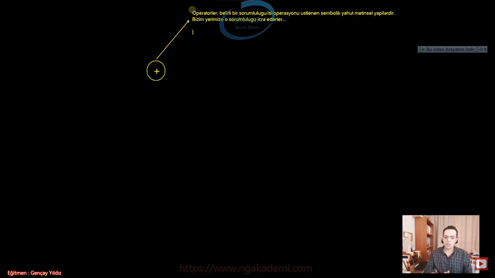

***
# 92) Programlamada Operatör Nedir?
- Yazılımda en önemli yapıtaşlarından biridir.

- Operatörler temel anlamda bir işin sorumluluğunu üstlenen temel yapıtaşlarıdır.

- Bir işin sorumluluğunu üstlenen, sorumluluk alan bir operasyon gerçekleştiren yapılanmalardır.

- Diyelim ki toplama işlemi yapacağız. Biz toplamayı yaparken `+` operatörünü kullanıyoruz. Yazılımda `+` operatörü benim yerime toplama işlemini gerçekleştiren bu sorumluluğunu üstlenen bir değerdir/yapıdır. Nasıl ki `+` ile birşeyleri toplayabiliyorsam diğer operatörlerle belirli işlemleri belirli sorumlulukları gerçekleştirebilmekteyiz. Bu işlemler bu sorumluluklar türlü türlü farklı farklı sorumluluklar olabilir. Bunlara uygun metinsel ya da direkt sembolik operatörlerimiz vardır.

- Operatörler belirli bir sorumluluğu/işi/operasyonu üstlenen sembolik yahut metinsel yapılardır.

- Bizim yerimize o sorumluluğu icra ederler...

- Nasıl ki bir inşaatta o inşaatla ilgili çalışmayı yapan kepçenin kullanıcısı operatörse ne yapıyor benim yerime oradaki işi yapıyor. Buradaki de benim yerime toplamayı yapıyor, kontrolleri yapıyor gerekli dönüşüm işlemlerini yapıyor vs falan aklına ne gelirse yapıyor.

- Operatör dediğimi,z yapının teknik boyutuna girdiğimizde operatörleri kullanırken bir operatör okur yazarlığı gerekiyor.

- Operatör bir işi benim yerime yapan görevlidir/operasyoncudur/operasyonu yürüten işçidir.

- Nasıl ki karakollarda planlamayı yapanlar stratejisyenlerse operasyonu genellikle özel harekatlar yapıyor. İşte özel harekatlar orada operatörler oluyor. Sorumluluğu üstlenen/yapan oradaki stratejik kararda olması gereken işi yapanlar özel harekatsa bizim de yazılımdaki özel harekatlarımız operatörlerimizdir.

- Belirli bir işe ihtiyacın var örneğin 1 arttırman gerekiyor orada `++` operatörünü kullanacaksın senin yerine 1 arttırıyor gibi

- Mesela `null` kontrolü yapacaksın orada `?` operatörü gelecektir.

- Farklı şekilde yapabileceğin uzun uzun yapacağın işlemleri kısaca yapmanı sağlayan sembolik yahut metinsel değerlere operatörler diyoruz.



***
# 93) Programlamada Operatör Okur Yazarlığı
- Herhangi bir operatör genellikle sağındaki ve solundaki değerler üzerinde bir bağıntı oluşturur. Bu operatör aritmetik olabilir mantıksal olabilir ya da herhangi bir işleyişi sorumluluğu üstlenen operatörde olabilir. 

- Operatör dediğin genellikle iki değer arasına konulur ve bu iki değer arasında işlem yapan bir yapıdır.

- Oepratörler genellikle iki değer arasında matematiksel, matıksal yahut farklı bir işlemsel görev/operasyon yapan yapılardır.

- İki değer arasına sen bir operatör yerleştirdiysen o yerleştirdiğin operatörün mahiyetine göre sonuç olarak bir işlem yapacaktır. Bir sonuç dönecektir sana

- Operatörler genellikle yaptıkları işlem neticesinde bir sonuç dönerler. Dönülen sonucu sen alıp başka bir işlemde de kullanbilirsin. Örneğin
    * 3 + 5 Burada `+` operatörü 3 ile 5'i toplar ve sonuçta 8 değerini döndürüyor.

- Operatörleri kullanırken geriye dönüş değerlerine dikkat edilmesi gerekmektedir. Özellikle aritmetik operatörlerde dikkat edilmelidir.

- Bir operatör işlem yaparken geriye ne döndürüyor bu çok önemli buna dikkat etmezseniz eğer ezbere kod yazmış olursunuz.

- Operatör Türleri
    * Aritmetik Operatörler
    * Karşılaştırma Operatörleri
    * Mantıksal Operatörler
    * Diğer/Özel İşlem Operatörler


***
# 94) C# Aritmetik Operatörler Neledir? Geriye Dönüş Değeri Nedir?
- Aritmetik operatörler `+`,`-`,`*`,`/`,`%` olmak üzere 5 tanedir.

- Aritmetik operatörlerin geriye dönüş değerleri vardır.

- Aritmetik operatörler iki sayısal değer üzerinde işlem yapan operatörler oldukları için işlem neticesinde geriye 'uygun türde' sonuç dönerler.

- `int sonuc = 3 + 5;` `+` operatörü diyor ki : Soluma ve sağıma vermiş olduğun iki `int` tür üzerinde ben bir işlem yaparım. Bu işlem neticesinde sana sonucu da `int` döndürürüm.
- `int sonuc2 = x * y;` `*` operatörü diyor ki : Soluma ve sağıma vermiş olduğun değerler üzerinde ben bir işlem yaparım kombinasyon uygularım. Bu işlem neticesinde sana sonucu da `int` döndürürüm.

- Aritmetik operatörlerde işlem yaparken hangi türlerde çalışıyorsanız o türlerde sonuç döner.

- Aynı türde olan sayısal türler üzerinde işlem yaparken sonuç türü aynı olacaktır.

```C#
Aritmetik Operatörler
// +
// -
// *
// /
// %
Aritmetik Operatörler Geriye Dönüş Değeri
//Aritmetik operatörler iki sayısal değer üzerinde işlem yapan operatörler oldukları için işlem neticesinde geriye 'uygun türde' sonuç dönerler.

int sonuc = 3 + 5;


int x = 3,
    y = 5;
// int y = 5;
int sonuc2 = x * y;

//Aynı türde olan sayısal türler üzerinde işlem yaparken sonuç türü aynı olacaktır.

double s1 = 123;
double s2 = 321;
double sonuc3 = s1 + s2;


decimal sayi1 = 123123;
decimal sayi2 = 3214532;
decimal sonuc4 = sayi1 % sayi2;

```


***
# 95) Aritmetik Operatörlerde Kritik Yapalım 1
- İki farklı türde sayısal değerler üzerinde yapılan aritmetik işlem neticesinde sonuç büyük olan türde dönecektir.

- Elinde diyelim ki `int` değer var ve birde `short` değer var yapmış olduğun işlem netice olarak `short`'un kapsam alanını geçebilir. O yüzden aritmetik işlemlerde sayısal türler birbirinden farklıysa varsayılan olarak büyük olan baz alınır. Yani sonuç olarak büyük olan türde sonuç dönecektir.


- Aritmetik operatörler kapsam alanı küçük olan türü kapsam alanı büyük olan türe bilinçsiz bir şekilde dönüştürülerek o şekilde hesap yapılır... O yüzden sonuç büyük olan türde elde edilecektir/edilmektedir.


```C#
(int) * (double)
//İki farklı türde sayısal değerler üzerinde yapılan aritmetik işlem neticesinde sonuç büyük olan türde dönecektir.
int s1 = 10;
double s2 = 5;
double sonuc = s1 + s2;
```
- Burada senin verdiğin `int`'i bakmış ikisine de demiş ki ulan `double` `int`den daha büyük o zaman ben `int`i dönüştürüyorum ve `int` olan değeri `double` mış gibi algılıyorum yani orada bilinçsiz tür dönüşümü yapıyorum sonucu da `double` döndürüyorum.

***
# 96) Aritmetik Operatörlerde Kritik Yapalım 2
- `byte` ile herhangi bir sayısal tür örneğin `int` ile yapılan sayısal işlemi ele aldığımızda kapsam alanı büyük olan yani `int`'de sonuç dönmesini bekliyoruz.

- Genel prensibimiz iki farklı türdeki sayısal değerler kendi aralarında aritmetik işleme tabi tutuluyorsa sonuç kapsam alanı büyük olanın türünde dönecektir.

```C#
(byte) * (int) = ?
int s1 = 3;
byte s2 = 123;
int sonuc = s1 - s2;
```

***
# 97) Aritmetik Operatörlerde Kritik Yapalım 3(Mülakat Sorusu)
- Aynı türlerdeki sayısal değerler üzerinde yapılan herhangi bir aritmetik işlem neticesinde sonuç aynı türde döner.

- Amma velakin iki `byte` arasında yapılan sayısal/aritmetik işlemlerde sonuç her daim `int` olarak dönecektir. 

- Normalde iki aynı türdedeki sayısal değer üzerinde yapılan aritmetik işlem neticesinde sonuç aynı türde dönecekken, bu iki değer `byte` ise sonuç her daim `int` dönecektir. Böyle kabul edilmiştir... İstisnadır...

```C#
(byte) * (byte) = ? (İstisna! - Mülakat!!!)
byte s1 = 10;
byte s2 = 5;
int deger = s1-s2;
System.Console.WriteLine(deger);
```

