***
# 92) Programlamada Operatör Nedir?
- Yazılımda en önemli yapıtaşlarından biridir.

- Operatörler temel anlamda bir işin sorumluluğunu üstlenen temel yapıtaşlarıdır.

- Bir işin sorumluluğunu üstlenen, sorumluluk alan bir operasyon gerçekleştiren yapılanmalardır.

- Diyelim ki toplama işlemi yapacağız. Biz toplamayı yaparken `+` operatörünü kullanıyoruz. Yazılımda `+` operatörü benim yerime toplama işlemini gerçekleştiren bu sorumluluğunu üstlenen bir değerdir/yapıdır. Nasıl ki `+` ile birşeyleri toplayabiliyorsam diğer operatörlerle belirli işlemleri belirli sorumlulukları gerçekleştirebilmekteyiz. Bu işlemler bu sorumluluklar türlü türlü farklı farklı sorumluluklar olabilir. Bunlara uygun metinsel ya da direkt sembolik operatörlerimiz vardır.

- Operatörler belirli bir sorumluluğu/işi/operasyonu üstlenen sembolik yahut metinsel yapılardır.

- Bizim yerimize o sorumluluğu icra ederler...

- Nasıl ki bir inşaatta o inşaatla ilgili çalışmayı yapan kepçenin kullanıcısı operatörse ne yapıyor benim yerime oradaki işi yapıyor. Buradaki de benim yerime toplamayı yapıyor, kontrolleri yapıyor gerekli dönüşüm işlemlerini yapıyor vs falan aklına ne gelirse yapıyor.

- Operatör dediğimi,z yapının teknik boyutuna girdiğimizde operatörleri kullanırken bir operatör okur yazarlığı gerekiyor.

- Operatör bir işi benim yerime yapan görevlidir/operasyoncudur/operasyonu yürüten işçidir.

- Nasıl ki karakollarda planlamayı yapanlar stratejisyenlerse operasyonu genellikle özel harekatlar yapıyor. İşte özel harekatlar orada operatörler oluyor. Sorumluluğu üstlenen/yapan oradaki stratejik kararda olması gereken işi yapanlar özel harekatsa bizim de yazılımdaki özel harekatlarımız operatörlerimizdir.

- Belirli bir işe ihtiyacın var örneğin 1 arttırman gerekiyor orada `++` operatörünü kullanacaksın senin yerine 1 arttırıyor gibi

- Mesela `null` kontrolü yapacaksın orada `?` operatörü gelecektir.

- Farklı şekilde yapabileceğin uzun uzun yapacağın işlemleri kısaca yapmanı sağlayan sembolik yahut metinsel değerlere operatörler diyoruz.


***
# 93) Programlamada Operatör Okur Yazarlığı
- Herhangi bir operatör genellikle sağındaki ve solundaki değerler üzerinde bir bağıntı oluşturur. Bu operatör aritmetik olabilir mantıksal olabilir ya da herhangi bir işleyişi sorumluluğu üstlenen operatörde olabilir. 

- Operatör dediğin genellikle iki değer arasına konulur ve bu iki değer arasında işlem yapan bir yapıdır.

- Oepratörler genellikle iki değer arasında matematiksel, matıksal yahut farklı bir işlemsel görev/operasyon yapan yapılardır.

- İki değer arasına sen bir operatör yerleştirdiysen o yerleştirdiğin operatörün mahiyetine göre sonuç olarak bir işlem yapacaktır. Bir sonuç dönecektir sana

- Operatörler genellikle yaptıkları işlem neticesinde bir sonuç dönerler. Dönülen sonucu sen alıp başka bir işlemde de kullanbilirsin. Örneğin
    * 3 + 5 Burada `+` operatörü 3 ile 5'i toplar ve sonuçta 8 değerini döndürüyor.

- Operatörleri kullanırken geriye dönüş değerlerine dikkat edilmesi gerekmektedir. Özellikle aritmetik operatörlerde dikkat edilmelidir.

- Bir operatör işlem yaparken geriye ne döndürüyor bu çok önemli buna dikkat etmezseniz eğer ezbere kod yazmış olursunuz.

- Operatör Türleri
    * Aritmetik Operatörler
    * Karşılaştırma Operatörleri
    * Mantıksal Operatörler
    * Diğer/Özel İşlem Operatörler


***
# 94) C# Aritmetik Operatörler Neledir? Geriye Dönüş Değeri Nedir?
- Aritmetik operatörler `+`,`-`,`*`,`/`,`%` olmak üzere 5 tanedir.

- Aritmetik operatörlerin geriye dönüş değerleri vardır.

- Aritmetik operatörler iki sayısal değer üzerinde işlem yapan operatörler oldukları için işlem neticesinde geriye 'uygun türde' sonuç dönerler.

- `int sonuc = 3 + 5;` `+` operatörü diyor ki : Soluma ve sağıma vermiş olduğun iki `int` tür üzerinde ben bir işlem yaparım. Bu işlem neticesinde sana sonucu da `int` döndürürüm.
- `int sonuc2 = x * y;` `*` operatörü diyor ki : Soluma ve sağıma vermiş olduğun değerler üzerinde ben bir işlem yaparım kombinasyon uygularım. Bu işlem neticesinde sana sonucu da `int` döndürürüm.

- Aritmetik operatörlerde işlem yaparken hangi türlerde çalışıyorsanız o türlerde sonuç döner.

- Aynı türde olan sayısal türler üzerinde işlem yaparken sonuç türü aynı olacaktır.

```C#
Aritmetik Operatörler
// +
// -
// *
// /
// %
Aritmetik Operatörler Geriye Dönüş Değeri
//Aritmetik operatörler iki sayısal değer üzerinde işlem yapan operatörler oldukları için işlem neticesinde geriye 'uygun türde' sonuç dönerler.

int sonuc = 3 + 5;


int x = 3,
    y = 5;
// int y = 5;
int sonuc2 = x * y;

//Aynı türde olan sayısal türler üzerinde işlem yaparken sonuç türü aynı olacaktır.

double s1 = 123;
double s2 = 321;
double sonuc3 = s1 + s2;


decimal sayi1 = 123123;
decimal sayi2 = 3214532;
decimal sonuc4 = sayi1 % sayi2;

```


***
# 95) Aritmetik Operatörlerde Kritik Yapalım 1
- İki farklı türde sayısal değerler üzerinde yapılan aritmetik işlem neticesinde sonuç büyük olan türde dönecektir.

- Elinde diyelim ki `int` değer var ve birde `short` değer var yapmış olduğun işlem netice olarak `short`'un kapsam alanını geçebilir. O yüzden aritmetik işlemlerde sayısal türler birbirinden farklıysa varsayılan olarak büyük olan baz alınır. Yani sonuç olarak büyük olan türde sonuç dönecektir.


- Aritmetik operatörler kapsam alanı küçük olan türü kapsam alanı büyük olan türe bilinçsiz bir şekilde dönüştürülerek o şekilde hesap yapılır... O yüzden sonuç büyük olan türde elde edilecektir/edilmektedir.


```C#
(int) * (double)
//İki farklı türde sayısal değerler üzerinde yapılan aritmetik işlem neticesinde sonuç büyük olan türde dönecektir.
int s1 = 10;
double s2 = 5;
double sonuc = s1 + s2;
```
- Burada senin verdiğin `int`'i bakmış ikisine de demiş ki ulan `double` `int`den daha büyük o zaman ben `int`i dönüştürüyorum ve `int` olan değeri `double` mış gibi algılıyorum yani orada bilinçsiz tür dönüşümü yapıyorum sonucu da `double` döndürüyorum.

***
# 96) Aritmetik Operatörlerde Kritik Yapalım 2
- `byte` ile herhangi bir sayısal tür örneğin `int` ile yapılan sayısal işlemi ele aldığımızda kapsam alanı büyük olan yani `int`'de sonuç dönmesini bekliyoruz.

- Genel prensibimiz iki farklı türdeki sayısal değerler kendi aralarında aritmetik işleme tabi tutuluyorsa sonuç kapsam alanı büyük olanın türünde dönecektir.

```C#
(byte) * (int) = ?
int s1 = 3;
byte s2 = 123;
int sonuc = s1 - s2;
```

***
# 97) Aritmetik Operatörlerde Kritik Yapalım 3(Mülakat Sorusu)
- Aynı türlerdeki sayısal değerler üzerinde yapılan herhangi bir aritmetik işlem neticesinde sonuç aynı türde döner.

- Amma velakin iki `byte` arasında yapılan sayısal/aritmetik işlemlerde sonuç her daim `int` olarak dönecektir. 

- Normalde iki aynı türdedeki sayısal değer üzerinde yapılan aritmetik işlem neticesinde sonuç aynı türde dönecekken, bu iki değer `byte` ise sonuç her daim `int` dönecektir. Böyle kabul edilmiştir... İstisnadır...

```C#
(byte) * (byte) = ? (İstisna! - Mülakat!!!)
byte s1 = 10;
byte s2 = 5;
int deger = s1-s2;
System.Console.WriteLine(deger);
```


***
# 98) C#'da Matematiksel İşlemlerde Öncelik Sırası Nasıldır?
- Matematiksel kuralların hepsi programlama da geçerlidir.  

- İşlem öncesi dediğimiz kanunlar kurallar parantez mevzuları aynen birebir yazılımda da geçerli olacaktır.

- Matematik prensipleri programlama da %100 geçerlidir.

***
# 99) C# Karşılaştırma Operatörleri Nelerdir?
- İki sayısal değer arasında büyüklük, küçüklük ve eşitlik durumuna göre karşılaştırma yapan ve sonuç dönen operatörlerdir.

- Ayriyeten metinsel değerlerde de eşitlik durumunu kontrol edebiliriz.

- Karşılaştırma operatörlerimiz;
    * `<` (küçüklük) Soldaki ifade sağdakinden küçük mü? `x < y`
    * `>` (büyüklük) Soldaki ifade sağdakinden büyük mü? `x > y`
    * `<=` (küçük veya eşitlik) Soldaki ifade sağdakinden küçük mü veya eşit mi? `x <= y`
    * `>=` (büyük veya eşitlik) Soldaki ifade sağdakinden büyük mü veya eşit mi? `x >= y`
    * `==` (eşitlik) Soldaki ifade sağdakine eşit mi? `x == y`

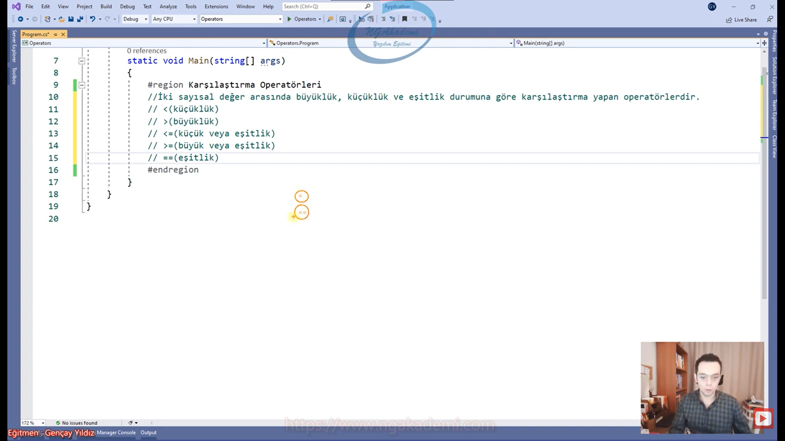

***
# 100) Karşılaştırma Operatörlerinin Geriye Dönüş Değerleri Nedir?
- Karşılaştırma operatörleri sayısal değerler arasında yahut metinsel ifadelerde de iki değer birbirleriyle karşılaştırılıyorsa geriye `boolean` türde yani `true` ya da `false` döndürecektir.

- Karşılaştırma operatörleri geriye her daim bool türde bir değer döndürecektir.

```C#
Karşılaştırma Operatörlerinin Geriye Dönüş Değerleri
//Karşılaştırma operatörleri geriye her daim bool türde bir değer döndürecektir.
int i1 = 123;
int i2 = 321;
bool sonuc = i1 > i2;
```

***
# 101) C# Mantıksal Operatörler Nelerdir?
- Yazılım sürecinde kod yazarken algoritmalar oluştururken genellikle çok kullandığımız o algoritmadaki mantık boyutlarında olmazsa olmaz diyeceğimiz operasyonlarımız operatörlerimiz mantık operatörleridir.

- Belirli şartların durumunu değerlendirip kendine göre sonuç döndüren operatörlerdir. Ve, Veya, Ya da operatörleridir.

- Günlük hayatta beşeri hayatta biz bunları kullanıyoruz Yani kullanış dilimizde var. Birilerinden bişey isterken birilerine talimat verirken ya da aldığımız emirleri yerine getirirken oradaki Ve, Ya da Veya ya dikkat ediyoruz.

- Tüm şartları değerlendirip kendine göre sonuç döndüren operatörlerdir.

- Ve veya'dan farklı kendine göre farklı şekilde değerlendirir. Veya bambaşka durumları değerlendirir.

- ve(`&&`) operatörü, tümmm şartların yerine getirilmiş olmasını isterrrr. 
    * Anne bana mutfaktan patates ve köfte getir dedin. Şimdi annen sana patates ve köfteyi getirirse ve mantığına göre hem patatesin gelmesi gerekecek hem de köftenin gelmesi gerekecek Eğer ki bu ikisinden biri ya da ikisi de gelmezse sen razı olmazsın.
    * İkiside geldiği sürece iki koşul/şart doğrulandığı yerine getirildiği sürece ve doğrulanmış olacaktır.

- veya(`||`) operatörü, şartlardan en az bir tanesinin yerine getirilmiş olması yeterlidir.
    * Anne bana mutfaktan patates veya köfte getirir misin dedin. Şimdi annen sana ya patatesi getirebilir ya da köfteyi getirebilir sen razı olursun tamahkarsın yani sıkıntı yok patatesi de getirebilir, ikisini de getirebilir, köfteyi de getirebilir, sıkıntı yok ama en az bir tanesinin gelmesine razısın.
    * İki şarttan en az bir tanesinin sağlanması gerekmektedir.

- yada(`^`) operatörü şartlardan kesinlike bir tanesinin yerine getirilmesini isterr...
    * Diyelim ki sınıftayız yan sınıfla kavgaya gideceğiz. Sen veya sen benle geleceksin dediğimde ikisinden biride gelebilir olur ikiside gelebilir olur ama ikisi de gelmezse olmaz. Veya kullanıyorsam şartlardan birinin gelmesi yeterlidir.
    Yada da ise sen ya da sen geleceksin dediğim zaman ya sen geleceksin ya da sen geleceksin ikiniz aynı anda gelemezsiniz ikinizin gelmeme durumu da olmaz ikinizin aynı anda gelme durumu da olmaz.
    * En fazla bir tanesinin ve en az da bir tanesinin yerine getirilmesini ister.

- Küçük bir çocuk var yanınızda parayı verdiniz dediniz ki al yeğenim bana parliament ve marlbora al dediniz.
    * Gitti parliament getirdi marlbora getirmedi OLMADI
    * Gitti marlbora getirdi parliament getirmedi OLMADI
    * Gitti ikisini de getirmedi OLMADI
    * Gitti marlbora getirdi parliament getirdi OLDU
    
- Küçük bir çocuk var yanınızda parayı verdiniz dediniz ki al yeğenim bana parliament veya marlbora al dediniz.
    * Gitti parliament getirdi marlbora getirmedi OLDU
    * Gitti marlbora getirdi parliament getirmedi OLDU
    * Gitti marlbora getirdi parliament getirdi OLDU
    * Gitti ikisini de getirmedi OLMADI

- Küçük bir çocuk var yanınızda parayı verdiniz dediniz ki al yeğenim bana parliament ya da marlbora al dediniz.
    * Gitti parliament getirdi marlbora getirmedi OLDU
    * Gitti marlbora getirdi parliament getirmedi OLDU
    * Gitti marlbora getirdi parliament getirdi OLMADI
    * Gitti ikisini de getirmedi OLMADI

```C#
Mantıksal Operatörler
// Tüm şartları değerlendirip, kendine göre sonuç döndüren operatörlerdir.
ve &&
//ve(&&) operatörü, tümmm şartların yerine getirilmiş olmasını isterrrr.
//Patates ve Köfte
// true   && true

veya   ||
//veya(||) operatörü, şartlardan en az bir tanesinin yerine getirilmiş olması yeterlidir.
//Patates veya Köfte
// true/false || false/true

yada ^
//ya da  ^ operatörü şarlardan kesinlikle birtanesinin yerine getirilmesini isterrr...
//true ^ false veyahut false ^ true
```

***
# 102) Mantıksal Operatörler Kullanım Mantığı Nasıldır?
- Mantıksal operatörler iki tane değer arasında mantıksal ilişkiyi değerlendirir.

- Salt veri türlerinde bu operatörleri kullanamayız. Ve veya ile kullanacağın durumlar mantıksal bir spesifikte olmalıdır.

- Eğer ki mantıksal operatörleri kullanıyorsak kullancağımız değerler mantıksal değerler olması lazım.

- Mantıksal operatörler, mantıksal değerler üzerinde kullanılır...

- Diyelim ki sen patates ve köfte durumunu mantıksal olarak değerlendiriyorsun. Sen bunları salt değer olarak mantıksal olarak kullanamazsın en fazla mantıksal olarak verebilirsin. Çünkü elindeki mantıksal operatör patatesin ya geldiğiyle ilgilenir ya da gelmediğiyle ilgilenir. İşte böyle bir durumda patates veya köfte, patates ve köfte, patates ya da köfte durumlarını incelerken biz `boolean` durumları incelemiş oluyoruz. Yani uzun lafın kısası mantıksal operatörleri kullanacağınız değerlerin kesinlikle `boolean` olması gerekmektedir

- Mantıksal operatörler  geriye bool/mantıksal sonuçlar dönerler...

- Özet olarak her iki değer de boolean türden değerler olmalıdır. Başka bir şansınız yoktur.

```C#
Mantıksal Operatörlerin Kullanım Mantığı
bool patetes = true, kofte = false;
bool sonuc1 = patetes && kofte;
bool sonuc2 = patetes || kofte;
bool sonuc3 = patetes ^ kofte;

System.Console.WriteLine(sonuc1);
System.Console.WriteLine(sonuc2);
System.Console.WriteLine(sonuc3);
//Mantıksal operatörler  geriye bool/mantıksal sonuçlar dönerler...
#endregion
```


***
# 103) Mantıksal Operatörlerde Geriye Dönüş Değerleri Nelerdir?
- Mantıksal Operatörler `boolean` türdeki değerler üzerinde işlem yaparlar. Nasıl ki aritmetik operatörler sayısal türler üzerinde işlem yapıyorsa nasıl ki karşılaştırma operatörleri genellikle sayısal türler üzerinde bir karşılaştırma yapıyorsa benzer mantıkla Mantıksal Operatörlerde sadece `boolean` türler üzerinde işlem yaparlar.

- Gidipte sen x, y, z tür üzerindeki değerlerde mantıksal operatörleri kullanıp işlem yapamazsın.

- ve (`&&`)
    * `true && true;` true
    * `true && false;` false
    * `false && true;` false
    * `false && false;` false

- veya (`||`)
    * `true || true;` 
    * `true || false;` 
    * `false || true;` 
    * `false || false;` 

- ve (`^`)
    * `true ^ true;` 
    * `true ^ false;` 
    * `false ^ true;` 
    * `false ^ false;` 

```C#
#region Mantıksal Operatörlerin Geriye Dönüş Değeri
//ve &&
System.Console.WriteLine(true && true);  //true
System.Console.WriteLine(true && false); //false
System.Console.WriteLine(false && true); //false
System.Console.WriteLine(false && false);//false

//veya ||
System.Console.WriteLine(true || true);  //true
System.Console.WriteLine(true || false); //true
System.Console.WriteLine(false || true); //true
System.Console.WriteLine(false || false);//false

//yada ^
System.Console.WriteLine(true ^ true);  //false
System.Console.WriteLine(true ^ false); //true
System.Console.WriteLine(false ^ true); //true
System.Console.WriteLine(false ^ false);//false
//SHIFT + 3 + SPACE

Örnek
System.Console.WriteLine(((true && true) || false && ((true ^ false) && false) || true));//true
```

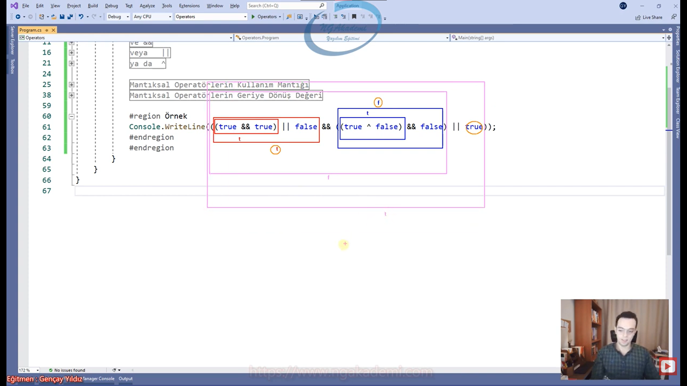

***
# 104) C# Arttırma(++) Azaltma(--) Operatörleri
- Aslında birer aritmetik operatörlerdir.

- Arttırma ve azaltma operatörleri bir sayıyı 1 arttırır ya da bir azaltır.

- Sayısal olarak elimideki bir n sayısı ya 1 arttıracaktır ya da bir azaltacaktır `n+1` ^ `n-1`

- Bu operatörlerin var olmasının sebebi biz yazılım süreçlerinde döngü dediğimiz yapılanmaları sıkça kullanırız. Döngülerde kombinasyonlar vardır. O kombinasyon geçerli olduğu sürece döngü dönmeye devam edecektir. İşte oradaki kombinasyonda genellikle şunu yaparız. Mesela 1'den 100'e kadar bir kombinasyon oluşturursun elinde bir değişken olur bunu 1 arttırırsın. Oradaki kombinasyon 1'den 100'e kadar artarken sen arada 100 kere işlem yapmış olursun. Kombinasyona göre işlem sayını belirliyorsun. Programlama da birşeyi şu kadar yap diye bişey yok. Orada bir kombinasyon oluşturman lazım matematiksel formül koyman lazım. İşte böyle durumlarda genellikle biz elimizdeki sayıları 1 arttırırız.

- Programlama da şöyle bakarsanız eldeki sayıları 1 arttırmak 1 azaltmak aşırı derece de yüksek oranda kullanılan operasyonlardır. Bu operasyonlara özel operatörler geliştirilmiştir. 
    * Arttırma operatörü `++`
    * Azaltma operatörü `--`

- `int i = 10;`
    * `i++;` Öncelikle i değeri döndürür sonrasında ise i değerini 1 arttırır. İlk bellektekini getir sonra bellektekini 1 arttır.
    * `++i;` Öncelikle i değeri 1 arttırılır ardından i değerini döndürür. İlk bellektekini arttır sonra bellektekini getir.
    * `Console.WriteLine(i++)` Önce i'yi döndürecek sonra arttıracak yani 10 değerini ekrana yazacaktır. Ekranda 11 olsa da bellekte 11 olacaktır.
    * `Console.WriteLine(++i)` Önce i'yi arttıracak sonra i yi döndürecektir yani 11 değerini ekrana yazacaktır. Ekrandaki değerle bellekteki değer aynıdır.
    * `i++` Arka planda `i = i + 1` şeklinde çalışır
    * `i--` Arka planda `i = i - 1` şeklinde çalışır

- Arttırma azaltma operatörleri spesifik açıdan çok hızlı hareket etmemizi sağlayan operatörlerdir.

```C#
Arttırma Azaltma Operatörleri
Örnek 1
 // ++
int i = 5;
i++;
System.Console.WriteLine(i);
++i;
System.Console.WriteLine(i++); // Çıktı : 5 | Bellek : 6
System.Console.WriteLine(++i); // Çıktı : 7 | Bellek : 7
// --


Örnek 2 
int a = 5;
int b = a++;
System.Console.WriteLine(a);
System.Console.WriteLine(b);


Örnek 3
int i1 = 5;
int i2 = ++i1;
int i3 = i1;
i2 = ++i2;
//++i2;
System.Console.WriteLine(i1);
System.Console.WriteLine(i2);
System.Console.WriteLine(i3);
```

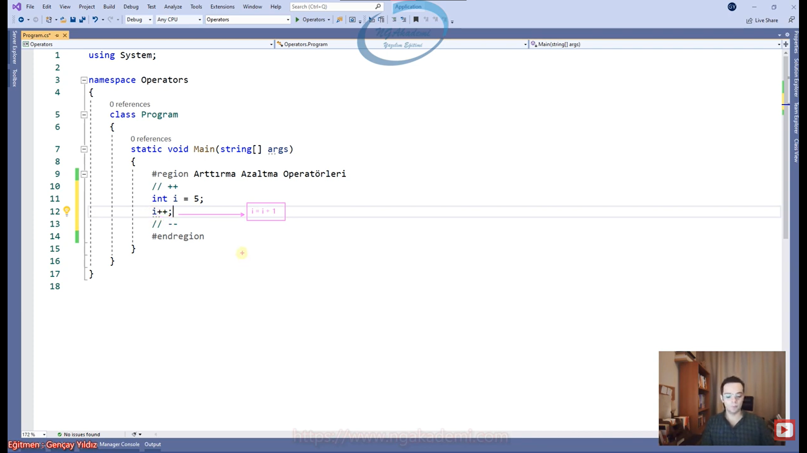

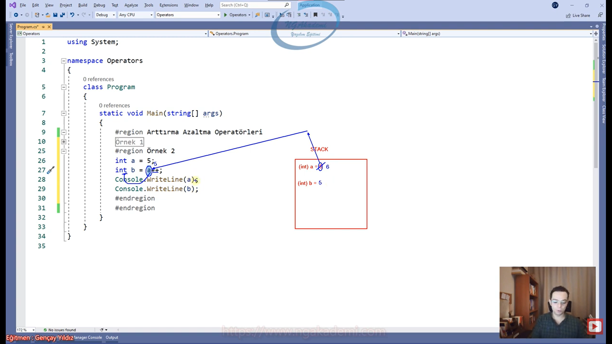


*** 
# 105) Üzerine Ekleme/Yığma Operatörleri
- Birer aritmetik operatörlerdir.

- Pratik şekilde aritmetik işlem yapmamızı sağlar.

- Matematiksel işlemleri daha hızlı daha praitk yapmamızı sağlarlar.

- Genellikle kullanırız. 
    * Çünkü yazılımcılar üşengeçtir. Tembelizdir. Yani tembel derken deli divane çalışırsın amma velakin yazacağın kodun mümkün mertebe daha pratik ve daha okunabilirlik açısından düşünebilirsiniz ama daha kısa kod yazmaktır amacımız.
    * Bonkör değilizdir. Lüzumsuz yera herhangi bir alanda tahsis edilmesini istemeyiz. Ya da bellekte kullanmadığım değerin bulunması beni rahatsız eder.

- Arttırma azaltma operatörleri bir sayının değerini sadece ve sadece 1 arttırmak ya da 1 azaltmak için kullandığımız operatörlerdi. Bunun dışında bir sayısal ifadeye 1 den fazla değer eklemek istiyorsam mesela 3 değerini burada arttırma azaltma operatörlerini kullanamayız işte burada devreye üzerine ekleme/yığma operatörleri girmektedir. Sadece ekleme çıkarma değil tüm aritmetik operasyonları (toplama, çıkarma, çarpma, bölme, mod alma) gerçekleştirebiliriz.
    * `i = i + 3;` Bunu kullanabiliriz. ancak bunun yerine;
        + `i+=3;` arka planda bu şekilde çalışır : `i = i + 3;`
        + `i-=3;` arka planda bu şekilde çalışır : `i = i - 3;`
        + `i*=3;` arka planda bu şekilde çalışır : `i = i * 3;`
        + `i/=3;` arka planda bu şekilde çalışır : `i = i / 3;`
        + `i%=3;` arka planda bu şekilde çalışır : `i = i % 3;`


```C#
Üzerine Ekleme Yığma Operatörleri
// +=
// -=
// *=
// /=
// %=
```


***
# 106) Metinsel İfadelerde Kullanılan Operatörler
- Metinsel ifadeler `+` operatörüyle yanyana birleştirilebilirler. Normalde sayısal değerler `+` operatörüyle aritmetik işleme tabi tutulurlar ama elindeki değerler eğer ki metinselse bu metinsel değerlerde bu sefer metinsel birleştirme operasyonuna tabi tutulurlar.
    * `int a = 5, b = 3; System.Console.WriteLine(a + b);` Aritmetik operasyon yapılır sayılar toplanır. Çıktı : 8
    * `string c = "Ahmet", d = "Mehmet"; System.Console.WriteLine(c + d);` Burada ise metinsel birleştirme yapılır Çıktı : AhmetMehmet

- İşin içinde metin varsa eğer buradaki toplama aritmetik bir toplama değil yanyana birleştirme olacaktır.
    * `int e = 5; string f = "abc"; Console.WriteLine(e + f)`  Burada yine metinsel birleştirme yapılır Çıktı : 5abc
        + Burada `int` değer object'e dönüştürülür. Burada da bilinçsiz bir tür dönüşümü vardır aslında. Boxing yapılmıştır. Boxing esasında bir yandan da bilinçsiz tür dönüşümüne benzer.
        + Elimizde bulunan `int` değeri `object`'e çevirmiş yani boxing yapmış. `string` bize diyor ki sen elindeki herhangi bir `string` ifade ile bir `object` değeri toplarsan/`+` operatörüne tabi tutarsan sonuç yine `string` olacaktır. 

- Tür dönüşümlerinde herhangi bir değeri `string`'e dönüştürebilmek için .ToString fonksiyonunu kullanıyorduk. Ayriyetten ilgili türü `string`'e dönüştürebilmek için `string` bir ifade ile `+` operatörüne tabi tutulması yeterli olacaktır.

- `string` ile herhangi bir türdeki ifadeleri topladığınızda yani `+` operatörüne tabi tuttuğunuzda sonuç `string` dönecektir ve yanyana birleştirme yapılacaktır.

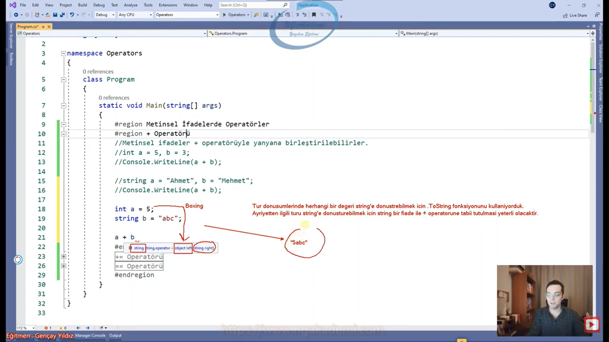

- Metinsel ifadelerde `+=` operatörünü de kullanabilmekteyiz. Yani metinsel ifadeler birbilerinin üstlerine yığılabilmektedir.

- `string g = "ahmet"; string h = "mehmet"; g+=h;` Bu durumda ilk olarak g değişkenine h değişkenini ekleyecek ve bu değeri g değişkenine atayacaktır. Yani buradaki değer g'ye yığılmış olacaktır.

- `==` operatörü ile metinsel ifadeleri kıyaslayabilir yani karşılaştırabiliriz. Eşitlik durumunu karşılaştırabiliyoruz.

- `string i ="Ahmet";string j = "Mehmet"; i == j;` Bu durumda i ve j içerik/değer olarak birbirlerinin aynısı mı? 
    * `==` operatörü iki `string` değeri algılayacak ve sonuç olarak boolean dönecektir.

- `string` değerlerde karşılaştırma operatörlerini direkt kullanamayız. Çünkü `string` ifadeler bir matematiksel aritmetik işlem yapabileceğimiz bir sayısal değer değildir. Dolayısıyla büyüklük küçüklük sayısal değerlere göre olacaktır. Biz insanlar şu bardak öbür bardaktan büyüktür diyebiliyoruz. Ama gözümüzün gördüğü o niceliği hesaplayabildiğinden dolayı bu yorumda bulunabiliyorsun. Ama sen yazılımda iki metinsel ifadeyi birbirleriyle büyüklük küçüklük olarak neye göre ifade etmek istersin örneğin karakter sayısına göre değil mi? İşte burada onu da bildirmek zorundayız.
    * `string i ="Ahmet";string j = "Mehmet"; i.Length > j.Length;`  Bize mevcudiyette bulunan değerin karakter sayısını döndürür `.Length` fonksiyonu 

- Demek ki elindeki metinsel değerlerin birinin diğerinden büyük mü küçük mü olduğunu anlayabilmen için bunların Length'lerini yazdırıp o şekilde kıyaslamaya tabi tutabilirsin. Aksi taktirde elindeki metinlerin türü `string` olduğu sürece davranışsal olarak bunları karşılaştırabilmen mümkün değildir. Çünkü tür karşılaştırmaya uygun değildir.

- Elimizdeki metinsel ifadeleri bizler karşılaştırma da sadece eşitlik durumunu karşılaştırabiliyoruz değersel anlamda onun dışında iki metinsel ifadeyi birbirinden büyük mü küçük mü diye karşılaştırma yapamamaktayız.

- Eşit değil mi operatörünü(`!=`) de kullanabiliyoruz.

***
# 107) C# Operatörler - ! Operatörü
- Programlama da olumsuzluk anlamına gelir yani tersi/değili anlamına gelecektir.

- Mantıksal yapılarda olumsuzluk ifade eder. `true` ya da `false`
    * `!true = false` 
    * `!false = true` 

- `!` operatörü bizlere yine olumsuzluk mahiyetinde eşit değillik durumunu da bizlere bildirmektedir.
    * `==` -> Eşitlik
    * `!=` -> Eşit Değillik

- `!` operatörü gördüğümüz her yerde bir olumsuzluk aklımıza gelmelidir.

- `!` operatörü Null References(C# 8.0) özelliğini de yerine getirmektedir.
    * `string` ifadelerde `null` durumlarında belirli kontroller yapmamızı sağlar. 

- `!` operatörü `!=` dışında sade ve sadece mantıksal değerlerin yanında kullanılabilir...
    * `!3` , `!"Ahmet"` gibi değerlerde kullanamayız.
    * `!true` burada kullanabiliriz. 
    * Mantıksallarda sadece tersine bir olumsuzluk alabiliriz. Doğruyu yanlış yanlışı doğru yapmış oluruz.


- Diyelim ki senin elinde bir veri var ve bu veri yani bri işlem yapıyorsun yapmış olduğun bu işlem `bool` döndüğünü düşünürsek dönen sonucun tersini alabiliriz.

- Manevratik bir operatördür.

- Örneğin Elimizde bir kullanıcının satış yapıp yapmadığına dair verileri çekeceğiz çektiğimiz veriler boş mu dolu mu bunun kontrolünü yaparken `!` operatörü ile manevralar sağlayabiliyoruz.

```C#
System.Console.WriteLine(!true);
int i = 3;
int i2 = 5;
System.Console.WriteLine(i != i2);
System.Console.WriteLine(!(i != i2));
```

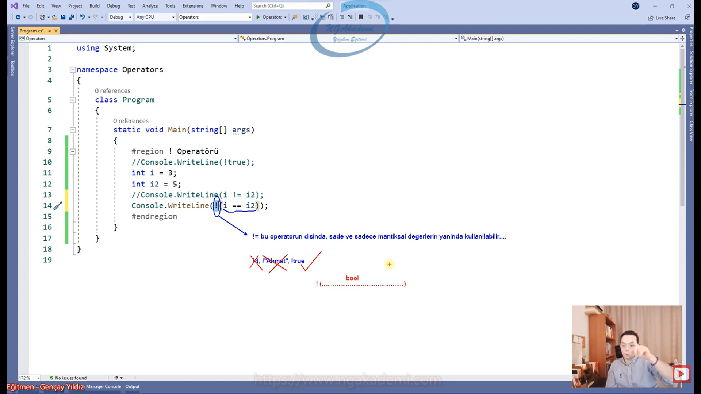


***
# 108) C# Operatörler - Ternary Operatörü
- Kalıpsal bir operatördür. Çok fazla kullanırız.

- Şarta bağlı değer döndüren bir operatördür.

- Akış kontrol şemalarında duruma göre farklı kodları çalıştırmak nasıl gerçekleştirilir ileride bunu inceleyeceğiz.

- Duruma göre farklı değeri döndürebilmek için normalde if ya da switch yapılanmalarını kullanabiliyoruz ama bir değer döndürmek için bu kadar kalıba gerek yoktur. İşte ternary operatörü kendi kalıbında şarta göre duruma göre farklı değerleri döndürmemizi sağlayan bir operatördür.

- Bir değişkene/metoda/property'e değer atarken, eğer ki bu değer şarta göre fark edecekse satır bazlı/tek satırda bu şart kontrolünü yaparak duruma göre değeri döndürmemizi sağlayan bir kalıpsal operatördür.
    * Örneğin eğer hava yağmurluysa şemsiye al yok eğer değilse şemsiyeyi alma.
 
- Diyelim ki biz evlilere ve bekarlara kampanya yapan bir şirkette çalıştığımızı varsayalım Eğer ki evliyse 'Evlilere Kampanya' bekarsa 'Bekarlara Kampanya' sisteminden yararlanacak.
    * `bool medeniHal;` 
    * `string mesaj;`

- Ternary operatörünü kullanmak için; `.......Şart/Durum.......... ? .......Birinci Durum........ : .......İkinci Durum........`
    * Şartta geriye bir değer döndüren, karşılaştırma yahut mantıksal işlem neticesinde bool sonuc...
        + Örneğin medeniHal `true`'mu 3 5'ten büyük mü? hava yağmurlu mu?
        + Eğer şart `true` ise Birinci Durum yok eğer dşart `false` ise ikinci durum döndürülecektir.
    * Ve biz bureadan dönen değeri değişkenimizle karşılarız.
    * Geriye döndüreceğimiz değer iki durumda da aynı türde olmalıdır.
    * Geriye dönen değeri karşılayacağın bir tane türün/değişkenin/alanın olacak. eğer ki birinci durum `string` ikinci durum `int` olursa buradaki karşılayan değişken dönen değere göre şeklini belirleyemeyecektir. Dönecek değerler ikisi de aynı türde olmalıdır.
    * Dönen değerler farklı olabilir ama aynı türde olmalıdır. Dolayısıyla aynı türde olacakki sen ortak türdeki bir değişkenle karşılayacaksın

- C# 9.0 ile Polimorfizm kurallarına göre birbirlerinden türeyen değerlerde artık desteklenmektedir.

- Satır bazlı şarta  bağlı değerleri döndürebildik.

```C#
//Bir değişkene/metoda/property'e değer atarken, eğer ki bu değer şarta göre fark edecekse satır bazlı/tek satırda bu şart kontrolünü yaparak duruma göre değeri döndürmemizi sağlayan bir kalıpsal operatördür.
bool medeniHal = true;
string mesaj = medeniHal == true ? "Evlilere Kampanya...." : "Bekarlara Kampanya....";
System.Console.WriteLine(mesaj);
```

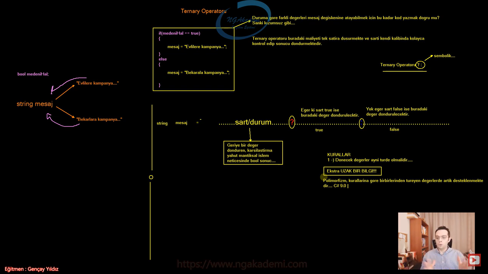
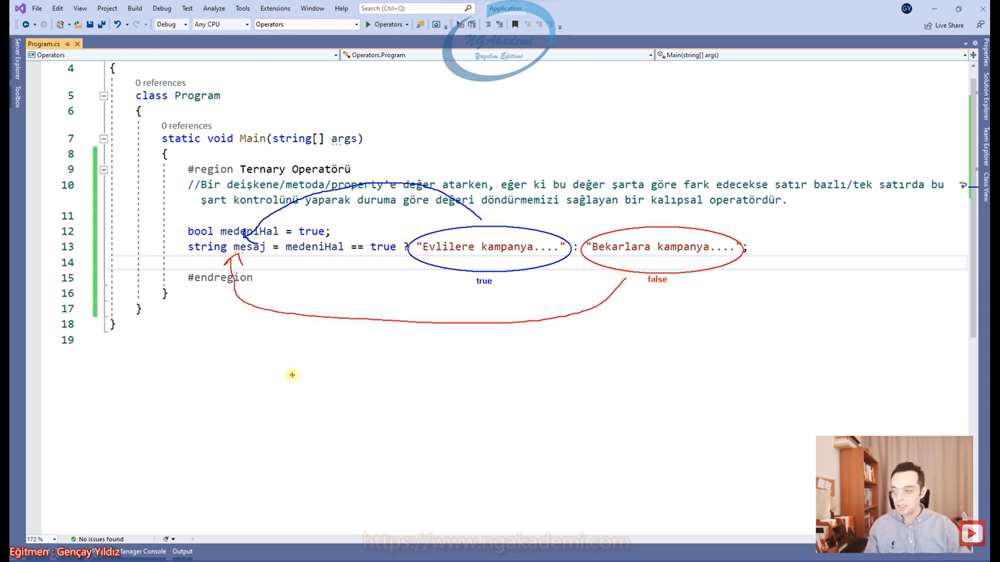
***

# 109) C# Operatörler - Ternary Operatörü - Birden Fazla Condition Uygulamak
- Bazen kontrol etmemiz gereken durumlar birden fazla olabilir. Böyle durumda aynı kalıp üzerinde semantik bir ayar çekmemiz gerekebilir.

- Birden fazla Condition `:` operatöründen sonra tekrardan `?` operatörünü kullanarak çok rahat bir şekilde oluşturulabilir. İstediğimiz kadar kullanabiliriz.
    * `string sonuc = yas < 25 ? "A" : (yas == 25 ? "B" : "C");`

```C#
int yas = 25;
//Yaşı 25'den büyük olanlara A, 25 olanlara B ve 25'den büyük olanlara C değerini döndüren ternary operatörünü oluşturalım
string sonuc = yas < 25 ? "A" : (yas == 25 ? "B" : "C");
System.Console.WriteLine(sonuc);
```


***
# 110) C# Operatörler - Ternary Operatörünü Örneklendirelim 1
```C#
//Kullanıcı tarafından girilen sayının aşağıdaki önergelere göre hesabını gerçekleştiren kodu geliştiriniz.
// sayı < 3                   => sayı * 5
// sayı > 3 && sayı < 9       => sayı * 3
// sayı >= 9 && sayı % 2 == 0 => sayı * 10
// sayı % 2 == 1              => sayı
// Hiçbiri değilse            => -1
System.Console.Write("Sayı Giriniz : ");
// string sayi = Console.ReadLine();
// int _sayi = int.Parse(sayi);
int sayi = int.Parse(Console.ReadLine());// Console.ReadLine() => Kullanıcının girdiği değeri string olarak getiren/yakalayan bir komuttur. Console.ReadLine komutu kullanicinin console'dan bir değer girmesini bekler.
// int sonuc = sayi < 3 ? sayi * 5 : (sayi > 3 && sayi < 9 ? sayi * 3 : (sayi >= 9 && sayi % 2 == 0 ? sayi * 10 : sayi));
int sonuc = sayi < 3 ? sayi * 5 : (sayi > 3 && sayi < 9 ? sayi * 3 : (sayi >= 9 && sayi % 2 == 0 ? sayi * 10 : sayi % 2 == 1 ? sayi : -1));
System.Console.WriteLine("Sonuç : " + sonuc);
```

- `Console.ReadLine()` => Kullanıcının girdiği değeri string olarak getiren/yakalayan bir komuttur.
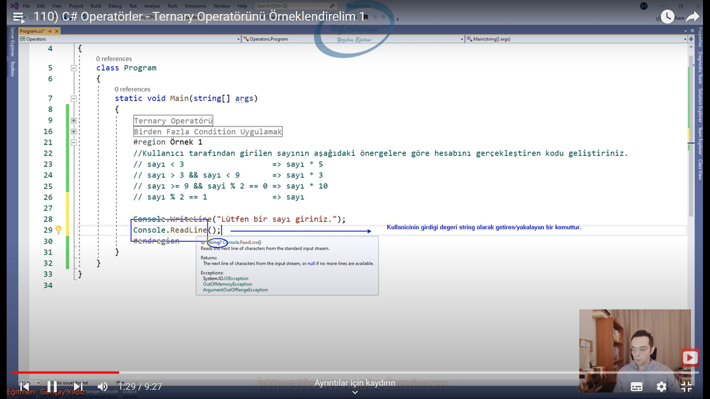

- `Console.ReadLine()` komutu kullanicinin console'dan bir değer girmesini bekler.
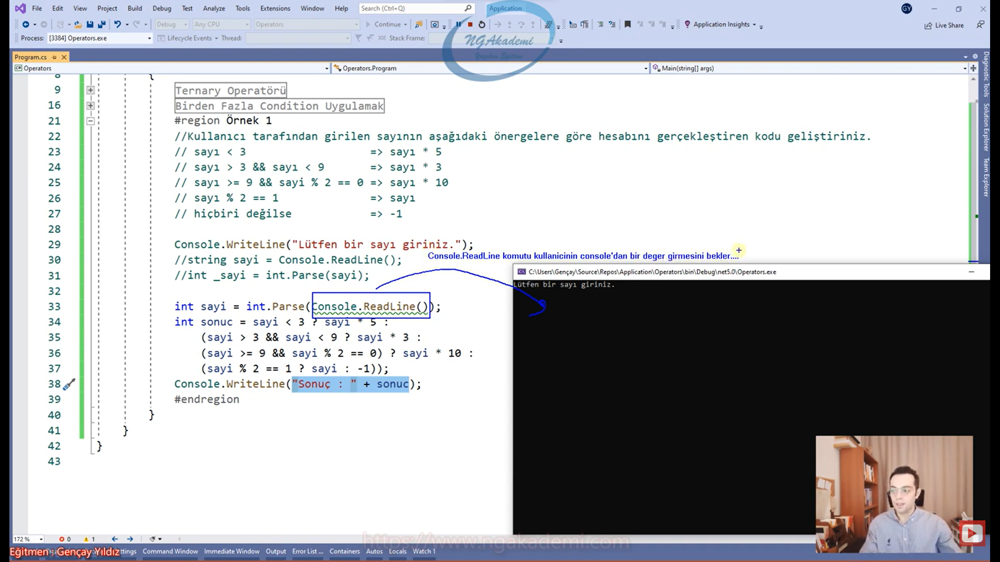

***
# 111) C# Operatörler - Ternary Operatörünü Örneklendirelim 2
```C#
//Hava durumunu tutan string değişkenin değerine göre aşağıdaki önergeleri uygulayan programı yazınız.
//"Yağmurlu" => "Şemsiye almalısın"
//"Güneşli"  => "Bol bol d vitamini alman dileğiyle..." 
//"Kapalı"   => "Yağmur Yağabilir"
string havaDurumu = "";
System.Console.WriteLine(havaDurumu == "Yağmurlu" ? "Şemsiye almalısın" : (havaDurumu == "Güneşli" ? "Bol bol d vitamini alman dileğiyle..." : "Yağmur Yağabilir"));
```

- En sonuncu önerge de şartını bildirmek zorunda değiliz. Zaten en sona geldiğimizde başka ihtimal yok. 

- Bize önerge de verilen duruma göre en son farklı bir olmamazlık gibi yani hiçbir ihtimalin olmayacağı durumu vermezse son önergeyi kontrol etmemize gerek yoktur.

- Algoritmalar da bu böyledir. 3 tane şart verdiyse 3. zaten diğer ikisinin olmadığı durumda geçerli olan şarttır. Yok eğer 4 tane şart varsa artık bu 4.'sü de hiçbirinin anlamına geliyorsa hiçbirinin olmadığı durumlarda geçerliyse 3.'yü de kontrol edersin eğer o da değilse hiçbiri anlamına gelen sonuncu şartın değerini uygularsın.

- Algoritma yazarken aman aman bir eğitime ihtiyacınız yoktur. Algoritma da her daim analitik düşünmeniz lazım. Eğer oraya analitiği yerleştirirseniz zaten takır takır gelecektir.

- Ternary operatörü gelişmiş mimarilerde tek seferlik değer atamayı sağlayan ve şartları hızlıca kontrol etmemizi sağlayan operatördür.

- Bir yazılımcı olarak bunu kullanmak/okumak zahmetli şeklinde ön yargılarla kendini doldurma. Kompleks olup olmaması mesele değil. Burada işine yarayıp yaramaması efektif olup olmaması meseledir. Bazen If blokları ternary operatörünün kullanıldığı yerlerden daha kompleks bir yapıya bürünebiliyor.

***
# 112) C# Operatörler - Atama(Assign) Operatörü
- Assign Operatörü(`=`) bir değişkene/alana/field'a/property'e değer atamamızı sağlayan bir operatördür.

- Atama assign operatörü olarak geçmektedir. Herhangi bir elimizdeki değişkene değer atarken sol taraftaki değişken kısmına sağ taraftaki değeri atamamızı sağlayan bir operatördür.


- Atama operatörünün sağı ve solu bizim için önem arz etmektedir. 
    * Eğer ki bir değişkeni atama operatörünün solunda çağırıyorsak burada değişkenin kendi gelir. 
    * Eğer ki bir değişken atama operatörünün sağında çağırıyorsak burada değişkenin değeri gelir.
    * Assign operatörünün `=` kullanıldığı operasyonlarda değişken sağda çağırılıyorsa o değişkenin değeri yok eğer solda çağrılıyorsa değişkenin kendisi gelecektir ki gelen değeri kendisine o değişkene atayabilsin.

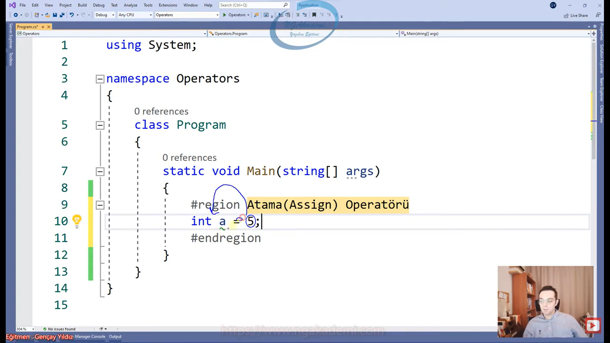

- İleride Referans türlü değişkenlerde atama operatörünün sorumluluğu değişip referans etme operatörü olduğunu konuşacağız...

```C#
int a = 5;
```


***
# 113) C# Operatörler - Member Access(Üye Erişim Operatörü)
- Elimizdeki değerler/değerlerin türleri alt elemanlara sahiptir. Bu alt elemanlara Member Access/Üye Erişim(`.`) operatörü ile erişim sağlayabiliriz.

- `int i= 5;`
    * `i.` dediğimiz anda `int` üzerinden erişebildiğimiz elemanlar karşımıza çıkar. İşte biz bu elemanlara member'lar deriz.

- İleride Object Oriented Programming'te kendi `class`'larımızı oluşturacağız. Örneğin Öğrenci diye bir `class` oluşturacaksın. Öğrencini adı, Öğrencinin soyadı bunlara property diyeceğiz. Bu property'lerde öğrenci `class`ının elemanları olacak. Öğrencinin notunu hesaplayan bir metot koyacaksın. O da bir eleman/member olacak. 

- Yani eleman dediğimiz olay bir türün altındaki kodlardır. Altında erişebildiğiniz Property ya da metotlardır. 

- Bir kodun devamında çağırabildiğin bütün kodlar o kodun o türün memberlarıdır.

- Member Access Operatörü(`.`) elimizdeki kodun değerin türüne uygun memberlara erişmemizi sağlayan bir operatördür. Örneğin;
    * `i.ToString();` `int` türünün member'ı olan `ToString()`'e `.` operatörü ile erişebiliyorum. `ToString()` metodu değeri `string`e çevirir.
    * `ToString()`ten sonra da bizler `.` operatörü ile erişimlerimize devam edebiliriz. Ta ki elimdeki değerin değer olmayacağı duruma kadar. Ya da işim bitene kadar.

- Bir kod yazdın onun altındaki türlerden birine erişmeni sağlayan `.` operatörüdür. Bununda altındaki türlerden birine erişmeni sağlayan `.` operatörüdür.

- Yani devamını getireceksen bir alt member'ı çağıracaksan biz member access `.` operatörünü kullanmaktayız.


- Member access, elimizdeki bir değerin türüne uygun elemanlarını/fonksiyonlarını/metotlarını/property'lerini/fieldlarını erişmemizi/çalıştırmamızı/çağırmamızı sağlayan bir operatördür.

- Member access kodun devamını getirir.

- Sen eğer yazdığın kodunda devamı gelecekse member access'le getirebiliyorsun. .bilmemne.bilmemne.bilmemne şeklinde. Burada şöyle düşünebilirsin bir tane çaydanlık var işte .SuKoy.SuyuIsıt.ÇayKoy.ÇayıDemle gibi Burada istediğin nitelikleri elemanları çağırabilirsin. Çağırıp çağırıp üzerinde işlemler gerçekleştirebilirsin.

- `.` operatörünü gördüğün zaman o değerin altındaki/içerisinde bulunan bir eleman çağırılmış.

```C#
//Member access, elimizdeki bir değerin türüne uygun elemanlarını/fonksiyonlarını/metotlarını/property'lerini/fieldlarını erişmemizi/çalıştırmamızı/çağırmamızı sağlayan bir operatördür.
//Member access kodun devamını getirir.
int i = 5;
System.Console.WriteLine(i.ToString());
```