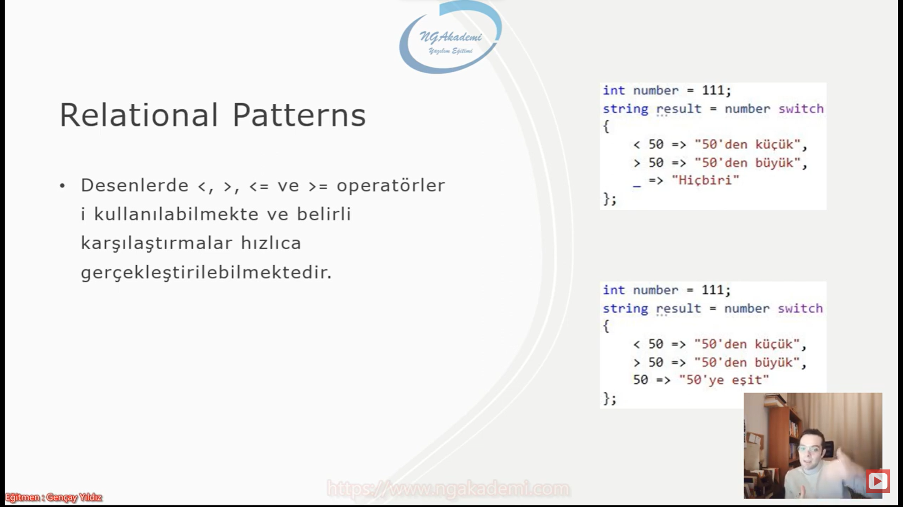

***
# 126) Akış Kontrol Mekanizmaları Nelerdir? Ne Amaçla Kullanılırlar?
- Akışı kontrol eden belirli şartlara göre akışın yönünü değiştiren mekanizmalar. Buradan akıştan kastımız kodun akışı.

- Kod belirli bir akışa sahip. O akış esnasında belirli şarta göre ya şuradaki kodu ya da o akışa göre buradaki kodu işleme durumu/ihtiyacı hissedersiniz işte burada arada buradaki farkı yaratacak buradaki kontrolü sağlayacak ya bunu çalıştır ya da şuradan devam et demeni sağlayacak bir mekanizmaya ihtiyacın var biz buna akış kontrol mekanizması diyoruz.

- Kodun akışında belirli şarta göre gideceğin yönü çalıştıracağın farklı kodları belirlemeni sağlayan yapılanmaya akış kontrol mekanizması denir.

- Akış kontrol mekanizmaları kodun akış sürecinde belirli şartlara göre farklı yönlendirmeleri yapmamızı ve farklı algoritmaları/kodları/yapılanmaları çalıştırmamızı sağlayan mekanizmalardır.

- Temelde bildiğimiz iki tane mekanizma vardır. Yani koca algoritmalarda kodu akışını yönlendirmeni şarta göre akışı farklı bir şekilde yönlendirmeni sağlayan iki tane mekanizma vardır.
    * Birisi bildiğimiz `if - else` yapısı 
    * Birisi `switch` yapılanması

- Yazılım kodunun akış sürecinde şarta göre yönlendirilmesini sağlamaktadır.

- Örneğin ben sana hava yağmurluysa şemsiyeni al diyorum. Hava yağmurlu değilse şemsiyeni almana gerek yok değil mi? işte akış kontrol mekanizmaları günlük hayatta buradaki şarta bağlı nasıl hareket ediyorsan yazılımda da şarta bağlı hareket edebilmen için akış kontrol mekanizmalarını kullanman gerekiyor.

- Eğer hava yağmurluysa şu kodu çalıştır: Git şemsiyeni al. Yok eğer hava yağmurlu değilse şuradaki kod çalıştır: şemsiyeni alma öyle çık.

- Algoritmalarda ciddi manada kullanılan yapılardır. O yüzden yazılımcılar açısından olmazsa olmaz yapılanmalardır...

- İleride uzaya füze de gönderseniz akış kontrol mekanizmalarını her türlü kullanmanız gerekiyor. Ciddi manada kullanılan bir yapılanmadır.

- Akış kontrol mekanizmalarında `if - else` yahut `switch` yapılanmaları aynı işi farklı şekilde yapmamızı sağlayan birbirlerinden farklı yapılanmalardır.

- İkisi arasında teknik olarak fark olsa da işleyiş/kullanım açısından bir fark yoktur!!!

- Akış kontrol mekanizmaları yazılımsal manevratik yapılanma olarak değerlendirilmelidir.


***
# 127) Akış Kontrol Mekanizmaları - Switch Case
- Yazıdğımız algoritma da programda belirli şartlara göre kodun akışını belirlemizi sağlayan yapılanmalardan bir tanesidir.

- `Switch case`, kodun akışında belirli bir şarta göre yönlendirme yapmamızı(farklı algoritma çalıştırmamızı/farklı operasyon gerçekleştirmemizi/tetiklememizi) sağlayan yapılanmadır. Esasında akış kontrol mekanizmalarını hepsi bunu gerçekleştirir.

- Sen programlama da eğer ki `switch case` kullanıyorsan temelde sadece eşitlik durumuna göre bir şart uygular. 

- Eğer ki eşitlik durumuna göre bir şart varsa `switch` kullanılabilir... 

- `Switch case` yapılanması sadece bir değişkenin değerinin sadece eşitlik durumları kontrol ederken kullanılabilir.


- Eşitliğin dışında büyüktür(`>`), küçüktür(`<`), küçük eşittir(`<=`) vs. gibi durumları kontrol ederken `switch case` yapılanmasını kullanamazsınız. Burada `if` kullanılır.

- Akış kontrol mekanizmasında akış kontrolünü yaparken belirli bir eşitliğe göre örneğin gelen bir değer 3'mü ya da değil mi? yani eşit mi? yoksa eşit değil mi? diye kontrol ediyorsan bunu `switch` ve `if` yapılanmalarında yapabilirsin. Ama 3'ten büyük mü? 3'ten küçük mü? büyük veya eşit mi ? gibi diğer koşullara karşılaştırmalara bakıyorsan eğer işte bunu `switch`'te yapamazsın `switch` sadece eşitlik durumuna bakıyor. Bunlara `if` bloğunda bakabiliyoruz. `if` herşeyiyle beraber şartı kontrol edebilirken `switch` yapılanması sadece eşitlik durumuna göre bir kontrol ortaya koymaktadır.

- Sadece eşitlik durumu check edilecekse o zaman `switch` kullanılabilir. Bir tercih meselesidir istersen `if` ide kullanabilirsin.

- C# 7.0'dan sonra belirli desenler geldi. Pattern matching dediğimiz yapılanma da desen eşleştirmeleri dediğimiz başlıklar altında `switch` bloğuyla ilgili çok fazla özellik geldi. Bazen eşitlik durumunu kıyaslamaktan daha fazlasını yapabildiğimizi göreceğiz. Mesela `when` geldi.

- `Switch case` yapılanması sadece bir değişkenin değerini kontrol ederken ama o kontrol eşitlik durumu kontrolü olmalı büyüktür küçüktür `switch`de yapamıyorsun `switch`i unut. Eşitlik varsa `switch`de yapabiliyorsun `if`de de yapabiliyorsun. 

- `switch` kullanabilmek için öncelikle parantez açıyorsunuz ve parantez içerisine süreçte eşitlik durumu kontrol edilecek değeri yazarız. Daha sonrasında ise scope açarız bu `switch`in genel yapılanmasıdır/iskeletidir. bundan sonra kontrol edeceğimiz değeri karşılaştıracağımız/check edeceğimiz diğer harici değerleri `case` bloklarına yazarız.
    * `switch(...................){`
      + `case value1:` //`switch` yapılanmasında verilen değerin eşitlik durumlarını kontrol edeceğimiz diğer değerleri `case` bloklarına yerleştiriyoruz.

      `break;``case` ile break arasına yazılan kodlar ilgli `case`'in doğrulanması sürecinde işlenecek kodlardır. değer ile `case`'e yazılan değerin eşit olması durumunda buradaki kodlar çalışacaktır.
      + `case value2:`

      `break;` 
      + `default:`
      `break`

    `}`

- `switch - case` yapılanmasında kontrol edilen değer ile eşitlik sağlayan `case` varsa diğer `case`lere bakmaksızın `switch` bloğundan çıkılacaktır.

- `switch` yapılanmasında amaç eşitlik durumuna göre belirli bir kod bloğunu tetiklemektir.

- Eğer ki sen eşitliği bir `case`'de sağladıysan diğer `case`'lere bakmana zaten gerek yok sağladığın `case`'deki `case` ile `break` arasındaki kodları çalıştırman yeterli. 

`switch` yapılanmasında hiçbir `case` eşitlik durumunu sağlamıyorsa bu seferde `default` `break` arasındaki kodlar çalıştırılacaktır. `default` kalıbı zorunlu değildir... Eğer `default` bloğu koyduysan hiçbir `case` eşitlik sağlamazsa `default` tetiklenecektir. Hiçbiri sağlamaz ve `default` bloğuda yoksa yapacak bişey yok `switch`'teki herhangi `case` `break` arası tetiklenmeden devam edecektir.


- Eşitlik durumunu kontrol ederken `string`se `string`i kontrol eder `int` ise `int`i kontrol eder. Aynı türde olmasına dikkat ediyoruz.

- `case`'lerin ve şart aranacak değerin tipleri aynı olmalı.


- `switch` yapılanmasında kontrol ettiğimiz değerin sabit bir değer olması gerekiyor.
    * `switch("Hüseyin")` Hüseyin değerini `case`'lerle kontrol edebiliriz
    * `switch(isim)` değişken değerini de `case`'lerle kontrol edebiliriz
    * statik sabit bir değeri de kontrol edebiliriz.

- `case`'e atanan değerler bir değişken olamaz direkt sabit değer olmalıdır.

- `switch` parantezinde kontrol edilen değer bir değişken yahut sabit/statik bir değer olabilirken case bloklarındaki değerler kesinlikle sabit/statik olmak zorundadır. `case`lerdeki değerler değişkenlerden alınamaz!!!


- `default` `case` bloklarından hiçbiri eşleştirmeye uymuyorsa eğer varsa `default` bloğu tetiklenir... yoksa yapacak bişey yok kod akışına devam edecektir.


- Eğer ki bir şart karşılanırsa diğer `case` bloklarına bakmadan `switch` bloğunu terk edecektir. Çünkü burada amaç şartın eşitlik durumuna göre tek bir `case` bloğunu/kod konseptini/algoritmayı tetiklemektir.

- Eşitlik sağlandığı durumda diğer `case`lere bakmadan `switch` bloğundan çıkıp gidecektir...(compiler)


- `case`'lerin sıralaması önemli değildir. Amaç burada eşitlik durumuna bakmak olduğu için `case`'lerin nerede olduğu hiç önemli değil!!!

- `case` bloklarının sıralaması ve `default`'un yerleştirildiği yer önemli değildir.... Rastgele random şekilde bunları yerleştirebilirsiniz.


- `switch` yapılanması kodu belirli bir şarta göre farklı yönlendiren bir akış mekanizmasıdır.

```C#
#region Switch Case
//Switch case, kodun akışında belirli bir şarta göre yönlendirme yapmamızı(farklı algoritma çalıştırmamızı/farklı operasyon gerçekleştirmemizi/tetiklememizi) sağlayan yapılanmadır.
//Switch case yapılanması sadece bir değişkenin değerinin sadece eşitlik durumları kontrol ederken kullanılabilir.
//Sadece eşitlik durumu check edilecekse o zaman switch kullanılabilir.
string adi = "Ahmet";
switch (adi)//kontrol edilen türü ne ise case bloklarında da aynı türde değerlerle kontrol edilmelidir.
{
    case "Mehmet":
        Console.WriteLine("Adı Mehmet");
        break;
    case "Ahmet":
        Console.WriteLine("Adı Ahmet");
        break;
    case "Hilmi":
        Console.WriteLine("Adı Hilmi");
        break;
    default:
        Console.WriteLine("Hiçbiri değil");
        break;
}
```

***
# 128) Akış Kontrol Mekanizmaları - Switch Case'de When Şartı
- `switch` yapılanmasında temelde kullandığımız yapılanma eşitlik durumuna göre bir kıyas oluşturmamızı sağlıyordu. Yani kodun akışı esnasında elindeki bir değerin farklı değerlerle eşitlik durumunu hızlıca `switch` ile kontrol edebiliriz. bu süreçteyken sen ekstradan eşitliğin dışında başka şeyleri de kontrol etmek istiyorsan eğer `when` keywordünü kullanabiliyorsun.

- `switch` yapılanmasında sadece elimizdeki değerin eşitlik durumunu kontrol edebilmekteyiz. Bunun dışında bu kontrol esnasında farklı şartları da değerlendirmek istiyorsak eğer `when` keywordünü kullanabiliriz.

- `when` ilgili eşleştirme/eşitlik durumunu kontrol ederken ekstraları da/başka şartları da kontrol etmemizi sağlayan `switch`i zenginleştiren özel bir keyworddür.


- Şart mı var sonuç her daim mantıksaldır `bool`'dur. Programlama da şart diyince aklına her daim `bool` gelecek.

- `case 100 when (3 == 5):` `when` senden bir şart oluşturmanı bekliyor burdaki şarta göre de buradaki durum bir ve/and(`&&`) hem case eşit olacak ve hem de `when` yapısının içindeki şartta doğrulanmış olacak ancak o zaman komple doğrulandığı zaman buradaki blok tetiklenecektir.

- Biz burada yapısal olarak biz case bloklarındaki eşitliğin yanında ekstradan farklı şartnamelerde koymuş olduk. `when`le ekstradan şartnameler koyabilmekteyiz. 

- `when` ve/and(`&&`) mantığıyla çalışır. Bu yüzden hem `case` şartı hem de `when` şartı doğru olursa o blok çalışabilmektedir.

```C#
int satisTutari = 1000;
switch (satisTutari)
{
    case 1000 when (3 == 5):
        break;
    case 1000 when (3 == 3):
        break;
}
```

***
# 129) Akış Kontrol Mekanizmaları - Switch Case'de goto Keyword'ü
- `goto` komutuyla `switch` yapılanmasında `case` blokları arasında atlama gerçekleştirebiliyoruz.

- `switch case` yapılanmasında sadece eşitlik durumunu inceleyebildiğimiz için mantıksal bir işlem gerçekleştirememekteyiz. Dolayısıyla bazen farklı değerlere eşit olma durumunda aynı operasyonu/kodu/akışı kullanacağımız senaryolarla karşılaşabilmekteyiz...

- Farklı eşitliklerde aynı kodu çalıştıracaksak eğer kod tekrarına girmemek için goto keywordü ile şu `case`'deki kodu çalıştır diyebiliyoruz... Yani `case`ler arasında zıplama yapabiliyoruz....

- Kod tekrarına girme diyelim ki 50 tane `case` bloğum var bunlardan 3'ü 5'i aynı kod bloğunu çalıştıracaksa eğer 3'ünde 5'inde aynı tekrara gireceğine sadece bir tanesini yönlendirip/sadece bir tanesinde var olan yazılmış kodu çalıştırırsın bu şekilde de tekrardan kurtulmuş olursun. Teknik olarakta `case`ler arasında zıplamayı `goto` keywordüyle yapabilmekteyiz.


- Bazen bazı `case`'lerde aynı kodları çalıştırmak zorunda kalabiliriz. İşte böyle durumlarda kodu sadece tek `case`'e yazmalı diğer `case`'de ise `goto` kullanarak kod yazılan `case`'e yönlendirme yapmalıyız. `switch`de veya mantığı yapamayız.


- `goto case 5;` `case` 5'deki kodu çalıştır demiş oluyoruz. `goto` kullanılan `case`de `break` komutunu kullanmıyoruz!!!


- `goto` keywordüyle yolldağın zaman şarta bakmaz direkt algoritmasını/bloğu çalıştırır.

- `goto`keywordünün kullanıldığı case'in eşleştirmesine bakmaksızın direkt olarak kodunu/bloğunu çalıştıracaktır.


- `case 7:`
- `case 10: goto case 5` her ikisinden bir olduğu durumda `case` 5'e yönlendir demiş oluyoruz.


```C#
goto
int i = 10;
switch (i)
{
    case 5:
        System.Console.WriteLine(i * 10); 
        break;
    case 6:
        System.Console.WriteLine(i / 5);
        break;
    case 7:
        // System.Console.WriteLine(i * 10);//kod tekrarı vardır
        // break;
        // goto case 5;
    case 10:
        // System.Console.WriteLine(i * 10);//kod tekrarı vardır
        // break;
        goto case 5;
}
```

***
# 130) C# 8.0 Switch Expressions Nedir?
- C# 8.0 ile gelmiştir.

- Tek satırlık işlemler için maliyet düşürücü ve kullanışlı semantiklerdir.

- switch expression ile denetlenen yapılanma semantik açıdan `switch` öncesine alınır ardından `switch` yazılır. Yazdıktan sonra her bir yazılan değer check edilme durumu yapılacak değerlerdir. Hangi değere denk geliyorsa/eşleşiyorsa o anki denetlenen değer ilgili değer o değişkene atanır. Tek satırlık işlemlerde kullanılan ifadedir


- case ile break arasında tek satırlık bir işlem yapılıyorsa tek satırlık bir işlem olacak ve bu tek satırlık işlemde değişkene değer atama işlemi olacak işte böyle bir durumda switch expressions'ıda kullanabiliyorsunuz.

- kod maliyeti açısından yeni yöntem eski yöntemden bin kat daha iyi.

- Yapısal olarak tüm kurallar burada da geçerli. Senin denetlediğin değer tür neyse o türde bir değerlerle karşılaştırma yapıyorsun ve hangi değişkene atama yapıyorsan o değişkene uygun bir değer gönderiyorsun. Tek satırlık işlem yaparken kullandığımız bir format. Eğer ki çok satırlı işlem yapılıyorsa bu formatı kullanamayız. 
 
```C#
#region Switch Expressions
#region Eski Yöntem
string isim = "";
int i = 10;
switch (i)
{
    case 5:
        isim = "Hilmi";
        break;
    case 7:
        isim = "Rıfkı";
        break;
    case 10:
        isim = "Gençay";
        break;
    case 17:
        isim = "Musa";
        break;
    default:
}
#endregion
#region Yeni Yöntem
int j = 10;
string ad = i switch
{
    5 => "Hilmi",
    7 => "Rıfkı",
    10 => "Gençay",
    17 => "Musa"
};
```

***
# 131.1) C# 8.0 Switch Expressions - when Şartı Uygulamak
- Switch expression'larda `when` şartını da kullanabilmekteyiz. `when` şartını kullanırken dikkat edilmesi gereken nokta hem `when` şartı kullanılabiliyor yani ekstradan senin kullanmış olduğun switch expression ne de olsa bir `switch` ve bu `switch` yapılanmasında eşitlik durumunu kontrol ederken ekstradan başka şartları da devreye sokabiliyorsunuz. Hem de bunu yaparken değişken de tanımlayarak gerçekleştirebiliyorsunuz.

- Siz elinizde kontrol ettiğiniz değeri değişkene tanımlayarak atayabilirsiniz. Dolayısıyla ilgili değişken üzerinden birden fazla farklı condition'ı da verebiliyorsunuz.


- Elimizdeki değeri kontrol ederken eşitlik durumlarını ise operatörlerinden(`=>`) önce yazıyoruz ya burada çalışırken 2 türlü çalışma yapabiliyoruz. `when` şartını kullanabiliyoruz
    1. `5 when ...ŞART... =>`  Direkt `when` şartını kullanma eşitlik değerini yazdıktan sonra ise operatöründen `=>` önce eşitlik değerinden sonra `when` yazıp başka bir şart/başka bir condition koyabiliyorsun ortaya.
    2. `var x when x == 7 && x % 2 == 1 =>` İçeride bir değişken tanımlayıp ve tanımladığımız değişkene kontrol edilecek değerin o anki değerini verip oluşturacağımız condition'a daha derinlemesine bir şart mekanizması oluşturabiliyoruz.
        + Bir değişken kullanıyorsak kullandığımız değişkende direkt eşitlik durumunu kontrol edeceğimiz bir değer tanımlamaya gerek kalmamaktadır.
        + Yani sen bir değişken tanımlamasını gerçekleştiriyorsan sabit bir eşitlik durumu kontrol ettiğin değeri kullanmak yasaklanmıştır/kaldırılmıştır.

- Devamında ise hem `when` şartını normal kullanabiliyorsunuz hem değişken tanımlayıp bir condition kullanabiliyorsunuz ve en son hiçbiri değilse/ hiçbirinin olmadığı durumda ise yapısal olarak `var x = "Hiçbiri"` bunu kullanabiliyorsunuz. Bu default tanımlamasına denk gelecektir.

```C#
int i = 10;
string isim = i switch 
{
    5 when 3 == 3 => "Hilmi",
    var x when x == 7 && x % 2 == 1 => "Rıfkı",
    10 => "Gençay",
    5 when 3 == 3 => "Musa",
    var x => "Hiçbiri",//default : Hiçbirinin olmadığı durumda default tanımlamasına karşılık gelecektir.
};
```

***
# 131.2) C# 8.0 Switch Expressions - when Şartı Uygulamak
- İlgili değişkenin türüne uygun bir değişken tanımlamalıyız. `int x when x == 7 && x % 2 == 1 => "Rıfkı"`

- İster değişkeni `var` keywordü ile karşılabilirsin istersende kendi türünde karşılayabilirsin.

- Tanımlanacak değişkenin türü ya `var` keywordüyle compiler tarafından tanımlanan bir değişken olabilir ya da sen kendi türünü manuel bir şekilde elinle de belirtebilirsin.

```C#
int i = 10;
string isim = i switch 
{
    5 when 3 == 3 => "Hilmi",
    int x when x == 7 && x % 2 == 1 => "Rıfkı",
    10 => "Musa",
    int x => "Hiçbiri"
};
```

***
# 132) C# 8.0 Switch Expressions - Tuple Patterns
- Tuple patterns ise `switch` yapılanmasını tuple nesnelerini kontrol edebilecek şekilde hem standart hemde yeni yapılanmayla bizlere sunmaktadır.

- Eşitlik durumunu kontrol ettiğimiz yere Tuple nesnesi de koyabilmekteyiz. Yani birden fazla değerimizi Tuple olarak buraya verebiliyoruz. Ve verdiğimiz değerleri Tuple olarak eşitlik durumunu kıyaslayabiliyoruz.

- Artık bu özellikte geliştirildi ve tek satırda bu işlemi gerçekleştirebiliyoruz.

- Tek satırlık yapılan bu işlemleri siz bir değişkene atıyorsanız gene değişkende ilgili Tuple nesnesini belirliyorsunuz ve ilgili Tuple'lar tek tek ise operatörü(`=>`) ile değerlendirilmekte atanan sonuç değerler neyse mesaja gönderilmektedir.


- Eski `switch` yapılanmasında bir tane değer kontrol edebiliyordum. Artık birden fazla değer kontrol edebiliyorum.

- Eğer ki `switch case` yapılanmasının içinde tek satırlık işlem yapıyorsak yapmış olduğumuz tek satırlık işlemde bir değişkene değer atıyorsak switch expression mantığını kullanabiliriz.

```C#
int s1 = 10;
int s2 = 20;
string mesaj = "";
switch (s1, s2)
{
    case (5, 10):
        mesaj = "5 ile 10 değerleri";
        break;
    case (10, 20):
        mesaj = "10 ile 20 değerleri";
        break;
}
System.Console.WriteLine(mesaj);
int s3 = 15;
int s4 = 15;
string mesaj2 = (s3, s4) switch
{
    (5, 10) => "5 ile 10 değerleri",
    (10, 20) => "10 ile 20 değerleri",
    (15, 15) => "15 ile 15 değerleri"
};
System.Console.WriteLine(mesaj2);
```

***
# 133) C# 8.0 Switch Expressions - Tuple Patterns when Şartı Uygulamak
- Yine aynı mantıksa ise operatöründen(`=>`) önce `when` şartını kullanabilirsiniz. Ya da değişken tanımlayarak aynı işlemi gerçekleştirebilirsiniz.

- Değişken tanımlarken artık Tuple'ın tipi birden fazla değişkeni bir araya gelmesinden oluştuğu için bunun ortak bir türü yok muadil olarak bu Tuple olduğu için ortak bir türle karşılanmıyor. Dolayısıyla `var` keywordü ile karşılarız.

- Tek dikkat edilmesi gereken Tuple'da tür tek olmadığı için bunu karşılayabilecek bir türümüz yok. O yüzden burada `var` keywordu kullanmanız gerekecek


```C#
int s1 = 10;
int s2 = 20;
string mesaj = (s1, s2) switch
{
    (5, 10) when (true) => "5 ile 10 değerleri",
    var x when x.s1 % 2 == 1 || x.s2 == 10 => "10 ile 20 değerleri"
};
System.Console.WriteLine(mesaj);
```

***
# 134) C# 8.0 Switch Expressions - Positional Patterns
- Positional patterns ise `Deconstruct` özelliği olan nesneleri kıyaslmaak yahut değersel karşılaştırmak için kullanılan bir gelişimdir.

- `Deconstruct` : Nesnelerin direkt özetini veren çıktısında istediğimiz formatta özet veren bir özelliştirilmiş fonksiyondur. Esasında bu geriye Tuple gibi bir değer döner.

- `Deconstruct` bulunduran `class`'tan üretilen bir nesnenin üzerinde sen switch expression ile girdiğin zaman `Deconstruct`ın dönmüş olduğu o özet Tuple ile kıyaslama yapabiliyorsun. İşte bunu yaptığın zaman bir nesne üzerinde `Deconstruct`ın döndüğü Tuple değerine eğer ki sen switch expression'la müdahale bulunuyorsan biz buna Positional Pattern diyoruz. 

- Switch expression'larda eğer ki Tuple kullanıyorsanız kullandığınızın Tuple'ın hiçbiri anlamına gelen değeri discard dediğimiz(`_`) kavramıyla gerçekleştirilmektedir.

- `_ =>` default anlamına gelmektedir. Hiçbiri olmadığı durum anlamına gelmektedir.


***
# 135) C# 8.0 Switch Expressions - Positional Patterns when Şartı Uygulamak
- `when` şartını kullanmak birebir aynı mantıkta bir değeri/nesneyi/class'ı kıyaslarken biz yine `when` şartını ise operatöründen (`=>`) önce ya da değişken eşliğinde kullanabilmekteyiz.


***
# 136) C# 8.0 Switch Expressions - Property Patterns
- Property patterns nesnenin propertylerine girerek belirli durumları hızlı bir şekilde kontrol etmemizi gerçekleştiren ve bunu farklı değerler için birden fazla kez tekrarlı bir şekilde yapmamıza olanak sağlayan güzel bir gelişimdir.

- `class`ımız var ve bu `class`tan bir nesne üretmişiz. bu nesne üzerinden herhangi bir property'e erişerek o nesnenin property'sini `switch` bloğuyla kontrol edebiliyoruz.

- `double maas = ogrenci switch {};` Property pattern ile birlikte nesne üzerinden switch expression'a girerek daha sonrasında nesnenin property'lerine erişebilmek için scope oluşturuyoruz. Yani burada bir anonim tip oluşturuyoruz. Yani oradaki türü temsil eden bir tür oluşturmuş oluyorsun. Nesne oluşturuyorsun ve o nesnenin içerisindeki propery'leri kıyaslama yapabiliyorsun.

- Patternlar desen getiriyor yani kodun maliyetini ve yapısını biraz daha düzenliyor daha yakışıklı bir kod ortaya çıkarmamızı sağlıyor. Kodumuz bunlarla beraber daha profesyonel bir semantiğe kavuşmuş oluyor.


***
# 137) C# 8.0 Switch Expressions - Property Patterns when Şartı Uygulamak
- Diğerlerinden hiçbir farkı yoktur.

- Switch expression'a girdiğimiz zaman nesnenin property'sini direkt kontrol edebiliyoruz ya da istersek değişkenle condition uygulayabiliyoruz ya da ilgili ise operatöründen(`=>`) önce gelecek olan değerin hemen ardından ise operatörü(`=>`) değer arasında her zaman yaptığımız gibi `when` şartını kullanıp yine ekstradan `switch` yapılanmasını zenginleştirebiliyoruz. Daha farklı şartları incelemiş oluyoruz.


***
# 138) Akış Kontrol Mekanizmaları - if Yapısı
- `if` yapılanması da `switch case` gibi bir akış kontrol mekanizmasıdır. Yani uygulama da programın/yazılımın akışı esnasında belirli şartlara göre farklı algoritmaları/operasyonları tetiklememizi sağlayan yapılanmadır.

- `switch` ile aynı amaca hizmet ederler sadece teknik olarak aralarında ufak bir fark vardır. `switch` sadece elimizdeki bir değerin farklı değerlere olan eşitlik durumunu kontrol eder Yani eşitliği kontrol eder ama diğer küçüktür, büyüktür gibi diğer durumları diğer condition'ları ortaya koymamızı sağlamaz `if` yapılanmasında ise biz bütün şartları ortaya koyabiliyoruz. `if` yapılanmasında karşılaştırma operatörlerinin hepsini eşitlik durumu da dahil yani `switch`i de kapsıyor eşit değillik, büyüktür, küçüktür, büyük eşittir, küçük eşittir vs bütün karşılaştırmalar onun dışında mantıksal operatörler neticesinde elde edilen sonuçları da kıyaslamayı `if` ile gerçekleştirebiliyoruz ve hatta operatörlerde örneğin `is null`, `is not null`, `is` operatörü gibi yapılanmalarla daha da zenginleştirebiliyoruz. Yani şartın farklı türevlerini de `if` ile tam olarak kullanabilmekteyiz.

- Programlama da `switch`i değilde `if`i bildiğiniz zaman akış kontrol mekanizmaları bitmiş oluyor.

- `switch` yapılanamsı sadece eşitlik durumunda belki bir nebze olsun bir kolaylık getiriyor hele hele şu son zamanlarda çıkan patternlar sayesinde switch expression konusunun altında incelediğimiz ve bundan sonra inceleyeceğimiz patternlar sayesinde `switch` inanılmaz derece de efektif hale geldi. Yani eşitlik durumlarında `if`e nazaran daha hızlı bir semantikte kod geliştirmemizi sağlayan bir yapılanma oldu.

- `switch case` : Elimizdeki bir değerin sadece eşitlik durumunu check eden/kontrol eden kıyaslayan bir akış kontrol mekanizmasıdır. Yani senin elindeki bir değere göre o değerin eşitlik durumuna göre şu kodu çalıştır şuna eşitse bunu çalıştır diyebildiğimiz bir mekanizmadır. Eşit değilse, küçüktür, büyüktür vs karşılaştırmaları `switch` ile yapamamaktayız.

- `if` yapılanması elimizdeki bir değerin eşitlik durumu da dahil tümmmm aklına gelen bütün karşılaştırmaları yapmamızı sağlayan ve sonuca göre akışı yönlendirmemizi sağlayan bir yapıalnamadır. Zaten bir akış kontrol mekanizmasıdır.

- `if` yapılanamsı `switch`de dahil `switch`in yapmış olduğu eşitlik durumunu kontrol etme de dahil diğer aklınıza gelecek bütün işlemleri bütün kontrolleri yapmamızı sağlayan evrensel bir yapılanmadır.

- `switch` yapıalnamsını bilmeyip sadece `if` yapılanamsını bile bilseniz akış kontrol mekanizmaları bitmiştir. Bundan sonra uzaya füze de göndersen herhangi bir şarta göre farklı bir operasyon gerçekleştireceksen `if` seni her türlü destekleyecektir.

- Eşitlik durumlarında hele hele sonucu tek sonuç döndüğünüz ve bir değişkene atadığınız durumlarda `switch case`i kullanmanız `if`e nazaran daha semantik daha şık ve kısa pratik kod yazmanızı sağlayacaktır. Onun dışında `if` yapılanması da programın yegane yapı taşıdır. Yani herhangi bir programlama dili elinize alın bugün `if` yapılanmasını çok rahat içinde görebilirsiniz. Hiçbirşey bilmeyen `if` yapılanmasını bilir. 

- Prototip : `if(....kontrol edilecek değer/şart....){kodlar}` Eğer ki şart doğruysa/true ise scope'un içi yani scope içindeki kodlar tetiklenecektir. Yok eğer şart doğru değilse/false ise compiler `if`in scope'undan çıkacak/`if`in scope'una hiç girmeyecek ve yoluna devam edecektir.

- Eğer ki sen belirli bir şarta göre belirli bir kodu işleyeceksen `if`i kullanman yeterli olacaktır.


- `if` yapılanmasında şart kısmı her daim `bool` türde olmalıdır...

- Eğer ki bir şart varsa eğer kesinlikle bunun sonucu `bool` olmalıdır. `true` ya da `false`. Ya doğrulanmış olacak ya da doğrulanmamış olacak. Nihayetinde bir şartın sonucu 3, 5, ahmet gibi değerler olamaz. Bu `bool` duruma göre sen şartını belirleyip ona göre kodunu işliyorsun.

- `if`in şart kısmında karşılaştırma operatörleri ve mantıksal operatörlerin hepsi burada kullanılabilir.... Karşılaştırma operatörleri geriye `true` ya da `false` yani `bool` döndürür. Aynı şekilde mantıksal operatörlerde geriye `true` ya da `false` yani `bool` döndürür. Demek ki `if`in içinde hem mantıksal hem de karşılaştırma üzerine bütün operasyonlarını/bütün kıyaslamalarını/bütün şart kontrollerini/bütün kontrollerinin hepsini yapabiliyorsun. İşte buna göre de belirli bir algoritmayı tetikleyeceğiz.


- `if` yapılanmasında sadece işe odaklanılır. Şartın çalıştıracağı koda odaklanılır.

- `if` yapılanması tek başına kullanılıyorsa sadece şarta bağlı çalışacak koda odaklanır..

```C#
bool medeniHal = true;
if (medeniHal == true)
{
    System.Console.WriteLine("Allah tek yatıkta kocatsın...");
}
//if yapılanması tek başına kullanılıyorsa sadece şarta bağlı çalışacak koda odaklanır..
```

***
# 139) Akış Kontrol Mekanizmaları - if Yapısı Üzerine Kritik Yapalım 1
- `if` yapılanmasında illaki `else` kullanmak zorunda değiliz. `if`ten sonra normal kodlarımızı kullanbiliriz. 

- Uygulamayı derleyip çalıştırdığında `if` bloğunda eğer ki şart `true` ise ilk önce scope içindeki kodlar çalışacak daha sonrasında `if` yapılanması sona erdiğinde ondan sonra hangi komut varsa onları işlemeye devam edecektir.

```C#
//if yapılanmasında illaki else kullanmak zorunda değiliz.
int i = 10;
if (i != 10)
{
    System.Console.WriteLine("Merhaba");
}
System.Console.WriteLine("Dünya");
```


***
# 140) Akış Kontrol Mekanizmaları - if Yapısı Üzerine Kritik Yapalım 2
- `if`in şart kısmında eğer ki `bool` değişken değer kullanıyorsak karşılaştırma operatörünü kullanmak zorunda değiliz...

- `bool` türdeki değişkenlerin değerleri zaten `bool` olacağından dolayı karşılaştırma operatörünü kullanmak zorunda değiliz...

- `bool` değerleri kıyaslarken illa karşılaştırma operatörlerini kullanmana gerek yok zaten direkt `bool` değer verebiliyorsun. Çünkü `if(.....Şart.....)` şart kısmı `bool` olmak zorunda. Ulan burası zaten `bool` olacakken sen bir daha karşılaştırma yapıp varolan `bool` üzerine bir daha `bool` aynı sonucu niye elde etmeye çalışıyorsun ki?


- Elindeki `bool` sonucun tersini alman gerekirse `!` operatörünü kullanabilirsin. 
    * `if(medeniHal)` : medeniHal `true` ise 
    * `if(!medeniHal)` : medeniHal `false` ise 

- Elindeki `bool` değerleri siz `if`de check ederken bunu karşılaştırma operatörüne tabi tutmanıza gerek yok direkt değerini yazdırıp oradaki değerin mantığına göre çalışabilirsiniz.

```C#
bool medeniHal = true;
// if (medeniHal == true)
if (!medeniHal)
{
    System.Console.WriteLine("Hayırlı Olsun");
}
#endregion
```

***
# 141) Akış Kontrol Mekanizmaları - if else Yapısı
- `if` şarta göre bir kodun çalışıp çalışmamasını belirlemektedir. Ayriyetten bir kodun şarta göre çalışıp o şartın olmadığı durumda başka bir kodun çalışmasını belirlemek istiyorsak burada `else` durumunu yani değilse durumunu devreye sokmamız gerekiyor. Eğer şöyleyse şunu yap değilse de bunu yap dememiz gerekiyor. 

- `if` yapısı -> Şarta göre bir kodun çalışıp çalışmayacağını belirleyen bir yapılanma...

- `if else` yapısı -> Şarta göre bir kodun çalışıp şartın olmadığı durumda bir başka kodun çalışmasını belirleyen bir yapılanma.... 

- Eğer sen değilseyi devreye sokuyorsan şartın olmadığı durumda da hangi kodun çalıştırılacağını akışı yine yönlendiriyorsun.

- `if` yapısında Normal akan bir kodda eğer ki şartın doğruysa şunu yap sonra yoluna devam et Eğer ki şartın doğru değilse yoluna yine devam et.

- `if else` yapısında ise Normal akan bir kodda eğer ki şartın doğruysa şunu yap sonra yoluna devam et Eğer ki şartın doğru değilse bunu yap demiş oluyorsun. Aslında bir yol var dümdüz giderken karşına 2 ayrı güzergaha giden yol çıkıyor. Sen de şartının doğruluğuna göre birini seçiyor ve gidiyorsun.

- `if else` yapısında illa akışı yönlendirmek zorundasın. Akışa illa `else` ile de olsa `if` ile de olsa araya kod sokmuş oluyorsun.

- `else` yapılanmasında şartın olumsuz/değil durumunda da çalışacak kodu belirlemiş oluyoruz!!!

- Prototip : `if(....Şart....){} else{}` Eğer ki buradaki şart `true` ise `if` bloğu çalışacak. Yok eğer şartımız `false` ise `else` bloğu çalışacaktır/tetiklenecektir..

- `if` bloğunda else varsa şartın `false` olması durumunda kesinlikle else bloğu tetiklenir....

- `if` yapılanmasında `else` bloğunu illaki kullanmak zorunda değiliz. Normalde `if` bloğunda `else` bloğu olmadığı durumlarda Şart `false` ise direkt compiler devam eder. Ama `else` bloğu varsa Şart `false` ise `else` bloğunun içerisindeki kodları tetikleyecektir.

- `if else` yapılanmasında şart doğru olduğunda sadece `if` yanlış olduğunda ise sadece `else` blokları tetiklenir. Aynı anda iki blokta kesinlikle tetiklenemez. Mantığa/Matematiğe aykırıdır.


- Sadece `if` bloğunun kullanıldığı durumlarda şart `true` ise `if` bloğu tetiklenecek yok eğer şart `false` ise yoluna devam edecektir. Amma velakin `if else` yapılanmasının kullanıldığı durumlarda şart `true` ise `if` bloğu tetiklenecek yok eğer şart `false` ise kesinlikle `else` bloğu tetiklenecek ve compiler yoluna devam edecektir. 

- Kalıbın içindeki kodlardan hangisinin tetikleneceğini ve `if` ve `else` durumdaki kalıptaki o davranışa göre belirleyebiliyoruz. Şart eğer `false` ise `else` kesinlikle tetiklenecek `true` ise `if` tetiklenecek.

```C#
int i = 3;
if (i > 5)
{
    System.Console.WriteLine("i değeri 5'ten büyüktür.");
}
else
{
    System.Console.WriteLine("i değeri 5'ten küçüktür.");
}
```

***
# 142) Akış Kontrol Mekanizmaları - if Else Yapısı Üzerine Kritik Yapalım 1
- `if else` yapılanmasında bizler yazmış olduğumuz kodun bazen tersini de yazmak isteyebiliriz. Manevratik bir şekilde onu tersine çevirebiliriz.

- `if else` yapılanmasında şartın işleyişine davranışına göre `true` ya da `false` döneceği için buradaki algoritma takla atabilir. Yani `if`'teki kodu `else`e `else`teki kodu `if`e vereceksin. Buna manevra diyoruz. Aslında kulağı nasıl tuttuğun gibi.

- Elimizdeki değil operatörüyle(`!`) şartın tersini alarak yapabiliriz.

- Algoritmalarda bunu çok kullanıyoruz.

```C#
int i = 10;
if (i == 10)
{
    System.Console.WriteLine("i değeri 10");
}
else
{
    System.Console.WriteLine("i değeri 10 değil");
}

Manevra

if (i != 10)
{
    System.Console.WriteLine("i değeri 10 değil");
}
else
{
    System.Console.WriteLine("i değeri 10");
}
```

***
# 143) Akış Kontrol Mekanizmaları - if Else Yapısı Üzerine Kritik Yapalım 2
- Programlama da DRY(do not repeat yourself/Kendini Tekrar Etme) prensibini öncesinde öğrenmiştik.

- `if else` yapılanmasında eğer şartımız doğruysa `if` bloğuna yanlışsa `else` bloğuna girdiğini biliyoruz. Diyelim ki `if`e de girse `else`e de girse ikisinde de çalıştırmam gereken bir kod parçasının olduğunu varsayalım nasıl bir yol izlemeliyiz?

```C#
int i = 10;
if (i == 10)
{
    System.Console.WriteLine("Merhaba");
    System.Console.WriteLine("i değeri 10");
}
else
{
    System.Console.WriteLine("Merhaba");
    System.Console.WriteLine("i değeri 10 değil");
}
```
- Her iki durumda da aynı kod olacaksa eğer biz bu kodu alacağız ve dışarıya yani kod bloklarının dışına yazacağız... 

- `if else` yapılanmasında `if` ve `else` bloklarında aynı işlemleri yapacaksak eğer bunları ikisinde de ayrı ayrı blok içerisinde tekrarlı bir şekilde yapmamamız GEREKMEKTEDİR!!! 


```C#
int i = 10;
if (i == 10)
{
    System.Console.WriteLine("i değeri 10");
}
else
{
    System.Console.WriteLine("i değeri 10 değil");
}
System.Console.WriteLine("Merhaba");
```

- Kod tekrarı varsa mümkün mertebe tekile indirmeye çalışacaksın. Özellikle kod tekrarları `if`, `if else`, `if else if` yapılanmalarında aşırı derecede olduğu için dikkat edeceksin. Ortak kullanman gerekenleri blokların dışına alacaksın ortak kullanmaman gerekenleri `if` ya da `else` bloklarında ilgili yerlere yerleşetireceksin. 

- Her iki durumda da ortak olacak olan/çalıştırılacak olan komutları `if else` bloğunun dışına yazmamız olayı çözecektir.

- Kod tekrar ediyorsa çok kötü/iğrenç bir kod yazdığının sinyalini bir al. Onu bir yakala.


***
# 144) Akış Kontrol Mekanizmaları - if Else if Yapısı
- `if else if` Yapılanması birden fazla şartın kontrol edilmesini sağlayan bir yapılanmadır. `if` yapılanmasının iskeletinin devamıdır.

- Eğer ki `if` `else` demeden `else if` diyorsanız mevcut şartın dışında başka bir şartı da kontrol edeceğinizi belirtiyorsunuz. Örneğin hava yağmurluysa şemsiyeni al değilse alma şimdi bu `if else` yapılanması. Biz burada şartı şu şekilde versek hava yağmurluysa şemsiyeni al yok eğer hava yağmurlu değil soğuksa montunu giy yok eğer bu da değilse şuysa şunu yap buysa bunu yap farklı şartlar söz konusu. Hiçbiri değilse `else` şunu yap diyebiliyorsunuz.

- Birden fazla şartı kontrol etmemizi sağlayan bir yapılanmadır.

- `if`, `if else`, `if else if` farketmez bunlarda her daim en başta bir tane `if` bulunmak zorunda. Yani sen bir şartı kontrol edeceksin. İlgili şart kontrol edildikten sonra başka bir şart geliyorsa eğer `else if` diyerek devam edeceksin. ve aynı zamanda `if`lerin yanında her daim bir şart bloğu(`(.....Şart.....)`) bulunmak zorundadır  ve `else if` istediğiniz kadar Kaç tane şartınız varsa o kadar belirtebilirsiniz.

- Prototip : `if(...ŞART...){} else if(...ŞART...){}` 

- Hangi şart `true` ise o blok tetiklenecektir. Yani oradaki kodlar çalıştırılacaktır. Hiçbiri doğrulanmazsa eğer `if` bloğundan çıkacak ve yoluna devam edecektir.

- `if` yapılanmasında herhangi biri doğrulandıysa eğer diğer `if`ler denetlenmeyecektir... yola devam edilecektir.

- Tek bir `if` bloğu yazıyorsunuz birden fazla şartı birden fazla durumu kontrol etmek istiyorsanız `else if` yapılanmasını kullanabilirsiniz. Aslında tek bir `if` bloğu var ve biz burada diğer şartlarımız için `else if`lerle uzatılmış bir iskelet yapmış oluyoruz ve bu durumda sadece bir blok tetiklenecektir.


- `if else` yapılanmasında kod akarken ilk önce birinci `if`in şartından başlar eğer `true` ise burdaki bloğu tetikler ve tetiklendikten sonra `if` bloğundan dışarı çıkar. Biri tetiklendiği zaman diğerlerini bir daha kontrol etmez. Yok eğer `false` ise bir sonraki `else if`e geçer aynı işi onda da yapacaktır yani bunda da şartı kontrol edecek eğer doğruysa girecek değilse girmeyecektir ve bu süreç tüm `if`ler için devam edecektir.

```C#
int sayi = 30;
if (sayi > 5 && sayi <= 10)
{
    System.Console.WriteLine(sayi * 5);
}
else if (sayi > 10 && sayi <= 20)
{
    System.Console.WriteLine(sayi * 10);
}
else if (sayi > 20 && sayi <= 30)
{
    System.Console.WriteLine(sayi * 20);
}
#endregion
```

***
# 145) Akış Kontrol Mekanizmaları - if Else if Yapısı Üzerine Kritik Yapalım 1
- `if`, `if else`, `if else if` yapılanmaları birer bütündür. Yani tek bir yapılanma tek bir iskelette olduklarından dolayı sadece tek bir blok tetiklenecektir. `if else` yapılanmasında `if` doğruysa `if` ya da `else if` lerden doğru olan tetiklenecektir.

- Bazen birden fazla şartın doğru olduğu durumlarda birden fazla işlem yapmak isteyebiliriz.

- Birden fazla şartın arasından bir tane operasyon yapmak değilde birden fazla şarta göre birden fazla işlem yapma söz konusu ise burada `else if` bizim için mantıksal hataya sebep olabilir.

```C#
int sayi = int.Parse(Console.ReadLine());
if (sayi > 100 && sayi <= 200)
{
    System.Console.WriteLine("100 ile 200 arasında");
}
else if (sayi > 200 && sayi <= 300)
{
    System.Console.WriteLine("200 ile 300 arasında");
}
else if (sayi > 200 && sayi <= 400)
{
    System.Console.WriteLine("300 ile 400 arasında");
}
```

- Senin `if else` `else if` vs. bunun gibi yapılanmaları kullanırken amacın neyse yapacağın operasyonun fıtratına uygun bir şekilde bunları kullanman lazım. Yani her daim birden fazla şart durumunda `if else if`i de kullanmak doğru değildir.

- Birden fazla şartın doğru olduğu durumda birden fazla işlem yapabilmek istiyoruz.

```C#
int sayi = int.Parse(Console.ReadLine());
if (sayi > 100 && sayi <= 200)
{
    System.Console.WriteLine("100 ile 200 arasında");
}
if (sayi > 200 && sayi <= 300)
{
    System.Console.WriteLine("200 ile 300 arasında");
}
if (sayi > 300 && sayi <= 400)
{
    System.Console.WriteLine("300 ile 400 arasında");
}
```

- `if`ler birbirinden bağımsızdır. 

- `else if` tek başına kullanılamaz.

- Birden fazla şartı kontrol edeceğin durumda şartları `if`le mi yoksa `else if`le mi kontrol edeceğinin kararını vermelisin.

- `if else if` yapılanmasıyla `if` leri parçalayıp yapmak birbirinden farklı işlemlerdir. `if`te `true` da olsa `false` da olsa tüm şartları kontrol eder amma velakin `if else if`te `true` olursa eğer diğer şartları kontrol etmeden bloğu terkeder diğer şartları göz önünde bulundurmaz bile.

- Şartlardan sadece birinin çalıştırılması durumunda birçok geçerli olan şartların içerisinden ilk geçerli olandan sadece bir tanesini çalıştırmakla bütün geçerli olanlardaki algoritmaları çalıştırmak arasında fark olacaktır.

***
# 146) Akış Kontrol Mekanizmaları if Else if Else Yapısı
- Birden fazla şartı kontrol etmemizi sağlıyor ve hiçbiri değilse de `else` bloğuyla var olan akışı karşılamamızı sağlıyor.

`if else if else` yapılanması birden fazla şartı kontrol edip hiçbir şart geçerli olmadığı durumda da `else` bloğunun tetiklenmesini sağlayıp akışı orada karşılamamızı sağlayan bir yapılanmadır.

```C#
int i = 100;
if (i < 100)
{
    System.Console.WriteLine("100'den küçük");
}
else if (i > 100)
{
    System.Console.WriteLine("100'den büyük");
}
else
{
    System.Console.WriteLine("100'e eşit");
}
```

***
# 147) Akış Kontrol Mekanizmaları - Scopesuz If Yapısı
- Tüm `if` yapıları için geçerlidir.

- Eğer ki tek bir konseptlik kaba tabirle tek satırlık bir işlem yapılacaksa bunu scope içerisine yazmak zorunda değiliz.

- `if`in içinde tek bir işlem yapılacaksa bu işlemi scope içerisinde yazabilirsiniz ama mecbur değilsiniz.

- `if` yapılanması tek satırlık/konseptlik bir işlem gerçekleştiriyorsa eğer bunu scope içerisinde yazmak mecburiyetinde değiliz....


- Kodu daha da temizlemek istiyorsanız tek konseptlik/satırlık işlemlerde kabarık yazmaktansa bu yöntemi tercih edebilirsiniz.

- Arada herhangi bir performans kaybı falan vs hiçbişey yok hangisini kullanacaksanız kullanın.

- Eğer ki çok konseptlik bir çalışma yapacaksanız bunları kesinlikle scope içerisine yazmanız lazım.

- Eğer ki birden fazla konsept/işlem/operasyon barındıracaksa bunları kesinlikle scope içerisine almamız gerekmektedir... Aksi taktirde scopesuz çalışılırsa ilk işlemi `if` bloğu alacak diğerlerini almayacaktır...

- Birden fazla işlem yapılıyorsa scope'lu yazmak zorundasınız. Eğer tek işlem yapılıyorsa scope'lu ya da scope'suz yazabilirsin oradaki insiyatif sana kalmış.


```C#
if (true)
{
    System.Console.WriteLine("adsgasgagaf");
}
if (true)
    System.Console.WriteLine("adsgasgagaf");
if (true)
{
    System.Console.WriteLine("A");
    System.Console.WriteLine("B");
}
```

***
# 148) Akış Kontrol Mekanizmaları - if Yapisi Örnek 1

- `Write` yazar kalır. `WriteLine` yazar bir satır aşağı geçer. Dolayısıyla sonraki yazdıklarınız bir satır aşağıda devam edecektir. Ama `Write` ile yazdığın yerde kalır devam edersen yazmaya yanına yazmaya devam eder.

- `Console.ReadLine()` : Kullanıcının girmiş olduğu değeri ben sana `string` olarak getiririm. Ne girerse girsin bu adam ben sana buradaki değeri `string` olarak getiririm.

```C#
//Klavyeden iki ürünün fiyatı girildiğinde toplam fiyat 200 TL'den fazla ise, 2.üründen %25 indirim yaparak ödenecek tutarı gösteren uygulamayı yapalım.
Çözümüm

System.Console.Write("Birinci Ürünün Fiyatını Giriniz :");
float birinciUrunFiyat = float.Parse(Console.ReadLine());
System.Console.Write("İkinci Ürünün Fiyatını Giriniz :");
float ikinciUrunFiyat = float.Parse(Console.ReadLine());
if ((birinciUrunFiyat + ikinciUrunFiyat) > 200)
    System.Console.WriteLine(birinciUrunFiyat + (ikinciUrunFiyat * 0.75));
else
    System.Console.WriteLine(birinciUrunFiyat + ikinciUrunFiyat);
```
```C#
Hocanın Çözümü

System.Console.Write("Lütfen birinci ürünün fiyatını giriniz : ");
int birinciUrununFiyati = int.Parse(Console.ReadLine());
System.Console.Write("Lütfen ikinci ürünün fiyatını giriniz : ");
int ikinciUrununFiyati = int.Parse(Console.ReadLine());

1. Kritik
int toplam = birinciUrununFiyati + ikinciUrununFiyati;
if (toplam > 200)
{
    //.....
}

2. Kritik
if (birinciUrununFiyati + ikinciUrununFiyati > 200)
{
    // int toplamSonTutar = birinciUrununFiyati + (ikinciUrununFiyati * 75 / 100);
    //System.Console.WriteLine(toplamSonTutar);
    System.Console.WriteLine(birinciUrununFiyati + (ikinciUrununFiyati * 75 / 100));
}
else
{
    System.Console.WriteLine(birinciUrununFiyati + ikinciUrununFiyati);
}
```

***
# 149) Akış Kontrol Mekanizmaları - if Yapisi Örnek 2
```C#
Senaryo 2 
//Belirlenen kullanıcı adı ve şifre doğru girildiğinde "Giriş Başarılı", yanlış girildiğinde "Girdiğiniz kullanıcı adı veya şifre hatalı" mesajı veren Console uygulamasını yapalım"

Çözümüm
System.Console.Write("Kullanıcı Adı : ");
string kullaniciAdi = Console.ReadLine();
System.Console.Write("Şifre : ");
string sifre = Console.ReadLine();
if (kullaniciAdi == "Musa" && sifre == "123")
    System.Console.WriteLine("Giriş Başarılı");
else
    System.Console.WriteLine("Girdiğiniz kullanıcı adı veya şifre hatalı");


Hocanın Çözümü
System.Console.WriteLine("Lütfen kullanıcı adınızı yazınız.");
string kullaniciAdH = Console.ReadLine();
System.Console.WriteLine("Lütfen kullanıcı adınızı yazınız.");
string sifreH = Console.ReadLine();
if (!(kullaniciAdH == "musa" && sifreH == "12345"))
    System.Console.WriteLine("if Else ->"+" Girdiğiniz kullanıcı adı veya şifre hatalıdır.");
else
    System.Console.WriteLine("if Else ->"+" Giriş Başarılı");

System.Console.WriteLine(kullaniciAdH == "musa" && sifreH == "12345" ? "Ternary -> "+" Giriş Başarılı." : "Ternary -> "+" Girdiğiniz kullanıcı adı veya şifre hatalıdır.");

string mesaj = (kullaniciAdH, sifreH) switch
{
    var x when x.kullaniciAdH == "musa" && x.sifreH == "12345" => "switch expression -> "+" Giriş Başarılı.",
    _ => "switch expression -> "+" Girdiğiniz kullanıcı adı veya şifre hatalıdır."
};
System.Console.WriteLine(mesaj);
```

***
# 150) Akış Kontrol Mekanizmaları - if Yapisi Örnek 3

- Yazılımcılığın %90'ı olayın tefekkür boyutu yani derin düşünce boyutu. Yapacağın işi herkes yapıyor önemli olan kaliteli yapabilmek.

```C#
Senaryo 3
//Kullanıcıdan alınan iki sayının ve yapılacak işlem türünün (toplama, çıkarma, çarpma, bölme) seçilmesiyle, sonucu hesaplayan programı yazalım.

Çözümüm
System.Console.Write("Birinci sayıyı giriniz :");
float sayi1 = float.Parse(Console.ReadLine());
System.Console.Write("İkinci sayıyı giriniz :");
float sayi2 = float.Parse(Console.ReadLine());
System.Console.Write("Yapılacacak İşlem Türünü Seçiniz\n1-Çarpma\n2-Bölme\n3-Toplama\n4-Çıkarma\n:::: ");
int islemTuru = int.Parse(Console.ReadLine());
float sonuc = islemTuru switch
{
    1 => sayi1 * sayi2,
    2 => sayi1 / sayi2,
    3 => sayi1 + sayi2,
    4 => sayi1 - sayi2,
    _ => (float)Math.PI
};
System.Console.WriteLine(sonuc);
#endregion
#region Hocanın Çözümü
System.Console.WriteLine("Birinci sayıyı giriniz :");
int sayi1H = int.Parse(Console.ReadLine());
System.Console.WriteLine("İkinci sayıyı giriniz :");
int sayi2H = int.Parse(Console.ReadLine());
System.Console.WriteLine("Lütfen yapılacak işlem türünü belirtiniz (+, -, *, /)");
char islemTuruH = char.Parse(Console.ReadLine());

1. Kritik
if (islemTuruH == '+')
{
    System.Console.WriteLine(sayi1H + sayi2H);
}
else if (islemTuruH == '-')
{
    System.Console.WriteLine(sayi1H - sayi2H);
}
else if (islemTuruH == '/')
{
    System.Console.WriteLine(sayi1H / sayi2H);
}
// else if (islemTuruH == '*')
else
{
    System.Console.WriteLine(sayi1H * sayi2H);
}

2. Kritik
switch (islemTuruH)
{
    case '+':
        System.Console.WriteLine(sayi1H + sayi2H);
        break;
    case '-':
        System.Console.WriteLine(sayi1H - sayi2H);
        break;
    case '*':
        System.Console.WriteLine(sayi1H * sayi2H);
        break;
    // case '/':
    //     System.Console.WriteLine(sayi1H / sayi2H);
    //     break;
    default:
        System.Console.WriteLine(sayi1H / sayi2H);
        break;
}

3. Kritik
int sonuc = islemTuruH switch
{
    '+' => sayi1H + sayi2H,
    '-' => sayi1H - sayi2H,
    '*' => sayi1H * sayi2H,
    '/' => sayi1H / sayi2H,
    _ => sayi1H / sayi2H,
};
System.Console.WriteLine(sonuc);

4. Kritik
System.Console.WriteLine(islemTuruH == '+' ? sayi1H + sayi2H : (islemTuruH == '-' ? sayi1H - sayi2H : (islemTuruH == '*' ? sayi1H * sayi2H : sayi1H / sayi2H)));
```

***
# 151) Akış Kontrol Mekanizmaları - if Yapisi Örnek 4
- Hepimiz bir şairiz en güzel belagatı yapabilen olmak.

- Kodu herkes yazar önemli olan doğru bir şekilde yazabilmek.

```C#
Senaryo 4
//Girilen sayının değeri 10 değilse ekrana "sayı yanlış" yazdıralım.

Çözümüm
System.Console.Write("Sayı Giriniz : ");
int sayi = int.Parse(Console.ReadLine());
if (sayi != 10)
    System.Console.WriteLine("sayı yanlış");

Hocanın Çözümü
System.Console.Write("Sayı Giriniz : ");
int sayiH = int.Parse(Console.ReadLine());

Kritik 1
if (sayiH == 10)
{
}
else
{
    System.Console.WriteLine("sayı yanlış");
}

Kritik 2
if (sayiH != 10)
{
    System.Console.WriteLine("sayı yanlış");
}

Kritik 3
System.Console.WriteLine(sayiH == 10 ? "" : "sayı yanlış");
```

***
# 152) Akış Kontrol Mekanizmaları - if Yapisi Örnek 5
- Gerçek hayatta bazen `if`, `else if`, `else`, `switch` vs. bunun gibi akış kontrol mekanizmaları kullanırken yapmış olduğun işlemde hangi akış kontrol mekanizması kullanıyorsan ondan çıkıp kod devam etmeye başladığında orada elde ettiği bazı değerleri dışarı taşımak isteyebilir. Yani biz akış kontrol mekanizmalarında elde ettiğimiz sonucu programatik olarak akış kontrol mekanizmalarının dışında isteyebliriz. İşte böyle durumlarda bu sonucu içeriden dışarı taşıyacak bir değişkene ihtiyacım olacaktır.

- Akış kontrol mekanizmalarında şarta göre bir kodu işlediğinizde o kod işlendikten sonra elbet devam edecek compiler, Compiler'ın devam etme sürecinde o şarta bağlı bir değeri süreçte kullanmak istiyorsam onu mekanizmanın içinden dışarıya taşımak gerekecektir.

- İçeride elde ettiğimiz bir değeri dışarıda kullanabiliriz.

- Belirli şartlara göre çalışan kodlarda içeride üretilen değerin içeriden dışarıya çıkarılıp kullanılması için başta tanımlanan bir değişkenin içeride değer atamasıyla böyle bir manevrayla taşıma işlemini gerçekleştiriyoruz.

- İleride Dependency Injection denilen yapılanma var bir tasarımsal kalıptır. bu kalıbı uygularken gene aynı mantığı kullanıyoruz. Dışarıda global olarak tanımlanmış bir değişken içeriden gelen değer ona atanıyor. Dışarıda tanımlandığı için herhangi bir scope'a da gönderilebiliyor oradan da erişilebiliyor farklı scope'lardan da.

```C#
Senaryo 5
//Girilen sayının negatif ya da pozitif olduğunu gösteren uygulamayı yazalım.

Çözümüm
Console.Write("Sayı Giriniz : ");
int sayi = int.Parse(Console.ReadLine());
Console.WriteLine(sayi > 0 ? "Pozitif" : "Negatif");

Hocanın Çözümü
int sayiH = int.Parse(Console.ReadLine());
string sonuc = "";
if (sayiH < 0)
    // Console.WriteLine("Negatif");
    sonuc = "Negatif";
else
    // System.Console.WriteLine("Pozitif");
    sonuc = "Pozitif";
System.Console.WriteLine(sonuc);
```

***
# 153) C# 7.0 Pattern Matching - Type Pattern
- Akış kontrol mekanizmalarında belirli kontrolleri yapabildiğimiz yapılanmaların daha da desenleştirilmiş halidir.
    * Örneğin `is` operatörünü kullanıyorsunuz `is` operatörüyle `object`in içerisindeki herhangi bir türü biz belirleyebiliyorduk. Check edebiliyorduk ve ona göre hareket edebiliyoruz. İşte buradaki `is` operatörüne ekstradan Pattern Matching ile desen getiriliyor. Bu desen olayı daha da kolaylaştırıcı daha da olayı spesifik hale getiren efektif hale getiren bir yapılanma.

- İşte böyle desenler bunun gibi durumları daha da güçlü daha da semantiğe yatkın bir şekilde çözmemizi sağlayan yeniliklere biz Pattern Matching yani tasarım eşleştirmeleri yani şu senaryoya bu tasarım eşleşiyor gibisinden düşünebilirsiniz bunu gibi çözümler getiriliyor bunlara da Pattern Matching deniliyor.

- Pattern Matching dediğimiz olay C# 7.0'da zaten gelmişti ama C# 9.0 ile var olan Pattern Matching'ler daha da güçlendirildi.

- Pattern Matching belirli desenlere eşleştirme söz konusu Belirli senaryolarda bak şu deseni de kullanabilirsin diyebileceğimiz yapılanmaları getiriyor.

- Temelde 4 tane Pattern'ımız var.
    * Type Pattern
    * Constant Pattern
    * Var Pattern 
    * Recursive Pattern


## Type Pattern
- Object içerisindeki bir tipin belirlenmesinde kullanılan `is` operatörünün desenleştirilmiş halidir.

- `is` operatörünün daha da kolay daha da efektif kullanmamızı sağlayan bir versiyonudur.

- `is` ile belirlenen türün direkt dönüşümünü sağlar.

- İlgili türün hangisi olduğunu Runtime'da check edip bulduktan sonra o `object`in içerisindeki değeri UnBoxing yaparken ya `as` operatörü ile ya da cast operatörü(`()`) ile bir şekilde UnBoxing yapıyorum. Biz bunu yaparken uzun uzun kod yazmış oluyoruz. Yani desen olarak desen varken desene nazaran uzuuuuunnnnn kod yazmış oluyorsun.

- Desen diyor ki kardeşim sen check ederken bu check esnasında eğer ki doğrulama söz konusu olursa ben sana bunun direkt sonucu döndürürüm. 

- Type Pattern buradaki `is` kullanımını senaryoyla eşleştiriyor.
    * `object x = 125;`
    * `if(x is string xx)`eğer x `string` ise xx değişkenine değer atanacaktır.


***
# 154) C# 7.0 Pattern Matching - Type Pattern Kritik Yapalım
- Herhangi bir `object`te yani Boxing işlemine tabi tutulmuş bir değerin türünü tespit ettikten sonra cast işlemini `is` operatöründen sonra otomatik olarak yapan bir desendir. Yani `is` operatörünün desenleştirilmiş halidir.

- Type Pattern diyor ki ya kardeşim bu kadar curcunaya gerek yok istiyorsan sen eğer türü belirlediysen tür kesinlike check edildiyse ben sana bunun direkt değerini döndürürüm kardeşim diyor.

- Biz tpye pattern'da tanımlanan değişkenlere manuel olarak dışarıdan erişebiliyoruz.

- `object x = "Musa";`
- `if (x is string a)` C# 7.0'dan itibaren artık if şart bloğu içine direkt değişken ismi belirleyebiliyoruz. Tabi bu değişken ismi öncekilerle çakışmayacak bir değişken ismi olmalı ve anlamlı olmalı.
    * Type pattern diyor ki eğer bu objectin içindeki değer string ise ben bunu a'ya cast eder sana string olarak veririm diyor. Hiç içeride cast yapmaya ihtiyacın yok
- `string _x = (string)x;` Önceden bu şekilde erişim sağlıyorduk yani kendimiz cast operatörüyle birlikte değişkene atıyorduk
    System.Console.WriteLine(a);
    * a değişkeni scope içerisinde yani if scope'u içerisinde tanımlanmamıştır.

- `System.Console.WriteLine(a);` a if scope'u içerisinde tanımlanmadığı için ben a'ya erişebiliyorum. Amma velakin burada hata verecektir. 
    * Biz Type pattern'da tanımlanan değişkenlere manuel olarak dışarıdan erişebiliyoruz. Ama ilgili değişken `null` olma ihtimali olduğundan dolayı dışarıdan erişim sağlarken hata alıyoruz..
    * Burada `x` `string` olmazsa `x`in değerini `a` ya `string` cast etmeyeceğinden dolayı `a` değerinin dolu gelip gelmemesi garanti değil. `a` nın `null` olma durumundan dolayı gönül rahatlığıyla kullanamıyoruz.
    * `if` scope'u içinde kullanabilirsin ama `if` dışında kullanırken sana kızacaktır. Çünkü `if` scope'u içerisinde değer dolu olacaktır ama dışarıda olursa değerin `null` gelme ihtimalinden dolayı compiler kızacaktır.
    * Çağırırken değerini okurken hata verecektir ama yukarıdaki en nihayetinde bir değişken olduğu için değer verirken sıkıntı yaşatmayacaktır.

- Bir değişken `null` ise ne çağırabilirsin ne üzerinden değişken çağırabilirsin ne de değerini çağırabilirsin. Sadece ona bir değer atayabilirsin.

- Bir şeyin yarısı doğru yarısı yanlışsa tamamı yanlış kabul edilir.

- Type Pattern'ı kullanıp dönüşüm yapacaksan aynı isimde değişken tanımlayamazsın.

- Aynı scope içerisinde aynı isimde birden fazla değişken tanımlanamaz.

```C#
Type Pattern
object x = "Musa";
if (x is string a)//C# 7.0'dan itibaren artık if şart bloğu içine direkt değişken ismi belirleyebiliyoruz. Tabi bu değişken ismi öncekilerle çakışmayacak bir değişken ismi olmalı ve anlamlı olmalı.
{//Type pattern diyor ki eğer bu objectin içindeki değer string ise ben bunu a'ya cast eder sana string olarak veririm diyor. Hiç içeride cast yapmaya ihtiyacın yok
    // string _x = (string)x;// Önceden bu şekilde erişim sağlıyorduk yani kendimiz cast operatörüyle birlikte değişkene atıyorduk
    System.Console.WriteLine(a);
    //a değişkeni scope içerisinde if scope'u içerisinde tanımlanmamıştır.
}
else if (x is int b)
{
    
}

a = "agasgasgasg";
System.Console.WriteLine(a); //a if scope'u içerisinde tanımlanmadığı için ben a'ya erişebiliyorum. Amma velakin burada hata verecektir. 
//Biz Type pattern'da tanımlanan değişkenlere manuel olarak dışarıdan erişebiliyoruz.
```

***
# 155) C# 7.0 Pattern Matching - Constant Pattern
- Elimizdeki veriyi sabit bir değer ile karşılaştırabilmemizi sağlayan bir desendir.

- Elimizdeki herhangi bir değişken normalde `==` operatörüyle değerini karşılaştırırken ya da `switch` ile karşılaştırma yaparken `is` operatörüyle de direkt değerini karşılaştırmamızı yapabilen bir operatördür.

- Yapısal olarak Constant Pattern direkt `==` operatörünün yaptığı kontrolü sağlayan patterndır.

- `is` operatörü direkt `==` operatörüne karşılık gelmektedir.


- `int x = 123;`
    * `Console.WriteLine(x == 123)` ya da `Console.WriteLine(x is 123)` kullanılabilir.


***
# 156) C# 7.0 Pattern Matching - Constant Pattern Kritik Yapalım
- Constant Pattern `is` operatörüne sabit değerleri check etmemizi sağlayan yani `==` durumunu/eşitlik durumunu kontrol etmemizi sağlayan bir desendir.

- `is` operatörü bir değişkenin türünü sormamızı/belirlememizi sağlayan bir operatördür ve bu operatörün kullanıldığı değişkenlerin türü illa bir referans türlü olmak zorunda değildir.

- İsterseniz değer türlü değişkenlerde de `is` operatörü kullanılabilmektedir ve hatta primitive türlerde bile kullanılabilmektedir...

- Yani senin `is` operatörünü kullanacağın değişkenin türü illaki `object` olmak zorunda değil. Biz şu ana kadar `object`i kontrol ettik `object`in içerisindek, boxing edilmiş orjinal türü kontrol ettik ama sen elindeki herhangi bir değer türlü değişkende de bunu yapabilirsin.

- Eğer ki `is` operatöründe tür kontrolü yapıyorsanız bu Constant Pattern değildir. Yok eğer elindeki herhangi bir değişkende tür değilde değer kontrolü yapıyorsanız bu Constant Patterndır. Tabiki de bu değerlendirme türe uygun bir değerlendirme olmalıdır. Yani `int` değeri `string` değer ile karşılaştırmamalıyız!!!
    * `int a = 5;` Değerlendirme aşamasında `int` değerler ile karşılaştırmalıyız.
        + `System.Console.WriteLine(a is 5);` bu şekilde karşılaştırma yapılmalıdır.
        + `System.Console.WriteLine(a is "beş");` bu şekilde karşılaştırma yapılmamalıdır. Hata verecektir. Türe uygun değildir.

- Değer kontrolü yaparken türe göre değerlerle karşılaştırma yapılmalıdır. 

- Tür kontrolü yaparken zaten türü bilmediğimizden dolayı her türle karşılaştırma gerçekleştirebilirsiniz.

- `is` operatörüne bir değer check etme operasyonu artık Constant Pattern ile yüklenmiştir.

- `System.Console.WriteLine(a is string);` Buradakiler ise normal `is` operatörünün kendi fıtratındaki işlemdir.

- `System.Console.WriteLine(a is 5);` Eğer ki is operatörüyle bir değişkenin değerini == operatörünün sorsumluluğuyla check ediyorsak işte buna Constant pattern denmektedir...

```C#
//is operatörü bir değişkenin türünü sormamızı/belirlememizi sağlayan bir operatördür ve bu operatörün kullanıldığı değişkenlerin türü illa bir referans türlü olmak zorunda değildir.
//İsterseniz değer türlü değişkenlerde de is operatörü kullanılabilmektedir ve hatta primitive türlerde bile kullanılabilmektedir...
int a = 5;
System.Console.WriteLine(a is int);
System.Console.WriteLine(a is string); //Buradakiler ise normal `is` operatörünün kendi fıtratındaki işlemdir.
System.Console.WriteLine(a is bool);
System.Console.WriteLine(a is 5); //Eğer ki is operatörüyle bir değişkenin değerini == operatörünün sorsumluluğuyla check ediyorsak işte buna Constant pattern denmektedir...
System.Console.WriteLine(a is "5");
System.Console.WriteLine(a is "asasgsafasfa");
System.Console.WriteLine(a is false);
```

***
# 157) C# 7.0 Pattern Matching - Var Pattern
- Eldeki veriyi `var` değikeni ile elde etmemizi sağlamaktadır.

- Elimizde bir tane değişkenimiz var ve bu değişken üzerinde türü belirlemek için `is` keywordüyle türünü sorman gerekir. `x is int`, `x is string` buradaki işlemi sorduktan sonra ya Type Pattern'la bir değişkene alıyoruz ya da içeride cast ediyoruz. Buradaki operasyon bizim açımızdan daha da kolaylaştırılmıştır ve Var Pattern ortaya konulmuştur. Var Pattern ile değişkenin türü ne olursa olsun o türde sen direkt şu değişkene çıkart.

- `var` keywordü verilen değerin türüne bürünen bir keyworddür.... Runtime'da bürünme işlemini gerçekleştirmektedir.

- Elindeki ilgili değişkenin değerini direkt kendi türünde sana verecektir. Yani Type Pattern'ın daha da hızlandırılmış halidir diyebiliriz.


***
# 158) C# 7.0 Pattern Matching - Var Pattern Kritik Yapalım 1
- Elimizdeki ifadenin türünü belirlerken `is` operatörüyle ardından türünü yazıyoruz ya içeride cast ediyoruz ya da Type Pattern kullanarak direkt değişkene alabiliyoruz.

- `if (x is string a)` x eğer string'se al sana değişkeni tanımla demiş oluyorsun. Normalde bu Type Pattern'ın ta kendisi.
'
- `if (x is var a)` x'in türü her ne olursa olsun direkt `var` runtime'da ilgili x'in türünü UnBoxing edecek ve sana a olarak getirecektir. Type Pattern'ın bir üst versiyonudur.

- `var`ın üzerine geldiğimizde atanan değer ne ise o değere direkt bürünüyordu yani derleme sürecinde bürünüyordu ama burada `var` runtime'da bürünme işlemini gerçekleştirecektir.

- Type Pattern'a nazaran türler birden fazla hangisiyse direkt onunla dışarı çıkartabiliyoruz.

```C#
Var Pattern - Kritik
object x = "agasgasgsagsagsag";
if (x is var a)
{
    
}
```


***
# 159) C# 7.0 Pattern Matching - Var Pattern Kritik Yapalım 2
- Normal `var`dan farkı `var` normalde derleyici sürecinde türü belirlerken Var Pattern'daki `var` runtime'da türü belirlemektedir. Aradaki fark budur.

- Mormalde senin tanımlamış olduğun `var` bir değişken aldığı değerin türüne derleme zamanında otomatik bürünmektedir. Ama Var Pattern'daki kullanılan `var` değişkeni ise almış olduğu değeri runtime'da alacağından dolayı türü runtime'belirlenir.

- `if (x is var a)` x'in türü her neyse x'in değerini burada cast edip a'ya vereceğinden dolayı bu işlemi runtime'da yapacaktır. Runtime'de türü belirlenecektir.

- `var` keywordü ile Var Pattern'deki `var` yapılanması arasında davranış farkı vardır.
    * `var` keywordü : Derleme zamanında türünü belirler
    * Var Patterndaki `var` yapılanması : Runtime'da türünü belirleyecektir.

- İkisinde de yapısal benzerlik var ikisinde de `var` keywordünü kullanıyoruz. Ama davranış açısından ikisi de birbirinden farklıdır. Birisi derleme zamanında bir diğeri Runtime'da

```C#
Var Pattern - Kritik
object x = "asfsafsafsaf";
var b = "faassafafasf";
if (x is var a)//x'in türü her neyse x'in değerini burada cast edip a'ya vereceğinden dolayı bu işlemi runtime'da yapacaktır. Runtime'de türü belirlenecektir.
{
    
}
```


***
# 160) C# 7.0 Pattern Matching - Var Pattern Kritik Yapalım 3
- Var Pattern'daki `var` keywordü runtime'da türünü belirlemektedir dedik ama Runtime'da türünü belirleyen bir keyword daha biliyorduk o keyword `dynamic` keywordü.

- Burada `dynamic` keywordünü kullanamıyorsunuz. Var Pattern `var` keywordüyle kullanılan bir desendir. 

- Siz eğer ki değişken babunda atanan değerin türüne Runtime'da bürünmek istiyorsanız bu `dynamic`tir. Ama bir pattern uyguluyorsanız buradaki gibi bu senaryo da `var` keywordünün yerini `dynamic` keywordü alamaz. 

- `dynamic c = "aswfasfasfasf";` Runtime'da türü belirlenecek bir değişken.

- `var b = "asgfassdafsa";` Derleme aşamasında türü belirlenecek bir değişkendir.

- Ama sen hem elindeki değerin türünü kontrol edip ardından o değeri kendi öz türünde/verisinde/tipinde UnBoxing edeceksen yani kendi özünde elde edeceksen burada bir pattern kullanacaksan Var Pattern'dan başka şansın yok.

- `if (x is var a)` var pattern bu formatta kullanılmalıdır.

***
# 161) C# 7.0 Pattern Matching - Recursive Pattern
- Bu desen `switch - case` yapılanması üzerinde birçok yenilik getirmektedir.

- `switch` bloğunda referans türlü değişkenlerde kontrol edilebilmektedir.

- Eğer ki C# 7.0'dan önceki sürümlerde olsaydık `switch(...Şarta Uğrayacak Değer...)` bloğunda değer türlü değişkenleri kontrol edebiliyorduk taa ki C# 7.0'a kadar.


- Recursive Pattern sayesinde biz `switch` bloğunda biz değer türlü değişkenler dışında da referans türlü değişkenleri kontrol edebilmekteyiz.

- Ayrıca `switch` bloğuna `when` komutu ile çeşitli şart/koşul niteliği kazandırılmıştır.

- Recursive Pattern ile `when` komutu gelmiştir.

- Interface yapılanması bir referans türlü değişkenleri referans edebilen bir türdür. İleri de OOP'de  göreceğiz.

- Recursive Pattern tür kontrolü yaptığı için Type Pattern'ı kapsamaktadır. Yani sen `switch - case` yapılanmasında referans türlü değişkenlerin türlerini check edebiliyorsun ve check ettikten sonra değişkenlerde bunları karşılayabiliyorsun.

- Recursive pattern, `case null` komutu ile ilgili türün/referansın `null` olup olmamasını kontrol edebilmesinden dolayı Constant pattern'ini kapsamaktadır.

- Recursive pattern `switch` yapılanmasında çoğu özelliği getiren `switch`i daha da esnek hale getiren pattern'dır. Bunun dışında ekstradan diğer pattern'ları da kapsayan daha gelişmiş bir yapılanmadır.


***
# 162) C# 7.0 Pattern Matching - Type ve Var Pattern Üzerine Kritik Yapalım
- Patternlar sadece akış kontrol mekanizmalarında değil birçok yerde kullanılabilmektedirler.

- Var Pattern, Type Pattern'ı akış kontrol mekanizmasına ihtiyaç duymadan da kullanbiliyorsun.

- `object x = "asfsasafasf";`
- `bool result = x is string o;` değişkenlere `if` dışında eriştiğimizde değişkenlerin `null` olma ihtimallerinden dolayı kullanamıyoruz.
    * x `string` ise result değerine `true` ya da `false` değerini yani `bool` sonucu aldık.
    * Aynı zamanda x değişkeninin değerini o değişkenine `string` olarak cast ettirmiş olduk.
    * Dolayısıyla burada x'in olmadığı durumda o'nun `null` olma ihtimali var. İşte bu `null` olma ihtimalinden dolayı kullanamıyoruz.
    * Burada tanımlayabiliyorsun ama kullanırken sıkıntı çünkü `null` olma ihtimali var. `null` olma ihtimalinden dolayı kullanmaya kalkarsak burada hata alırız

- Hem `if` e bağlı değiliz hem de `if`in dışında kullanmaya çalıştığımızda ilgili değişkenleri yani tanınlanan Type Pattern'la, Var Pattern'la tanımlanan değişkenleri `null` olma ihtimalinden dolayı kullanmamıza müsaade etmiyor.


- `object x = "asfsasafasf";`
- `if (x is string a)` `true` döndüğü sürece sen bunu `if` ile kullandığın zaman a'nın bir değere sahip olduğu kesinlikle %100 garantidir. O zaman bunu compiler'da biliyor. Bu desenler `if` yapılanmasıyla compiler açısından derleme aşamasında güvenceye alınmış.
    * Eğer ki sen bunu `if` yapılanamsının içinde kullanıyorsan bu a kesinlikle dolu geleceği için burada yani `if` scope'unda sen bu a değişkenini kullanbilirsin.

- Desen eşleştirmeleri budur. Yani `if`in içerisindeki bir senaryoyla eşleştirilen desenlerdir bunlar illaki siz bunu `if`te kullanmak zorunda değilsiniz ama oradaki senaryoya eşleştiği için bu deseni kullanıyoruz.

- `var` keywordü derleme aşamasında türü belirlerken Var Pattern'daki `var` runtime'da türü belirler.

- `bool result = x is var o;` x'in türü ne olursa olsun buradaki o değişkenine ata. Hangi tür olursa olsun atayacağından dolayı runtime'da bunun `null` gelme ihtimali olmadığından dolayı da kullanabiliyoruz.
    * Type Pattern ya da Var Pattern kullanırken Var Pattern her türlü türü karşılayacağı için yani `var` olduğu zaman o o türün değerini direkt kendi öz türünde alacağından dolayı `null` gelme ihtimali olmayacak. Dolayısıyla ilgili değeri/değişkeni kullanmamızı sağlayacak.

- `bool result = x is string o1;`
- `System.Console.WriteLine(o1);`  
    * Type Pattern'da x değişkeninin değerinin `string` olmama ihtimalinde o1'in `null` olma ihtimali söz konusu olduğu için o1 kullanılırken hata vermektedir..

- `bool result2 = x is var o2;`
- `System.Console.WriteLine(o2);`
    * Var Pattern'da ise x değişkeninin değeri ne olursa olsun var ile o2'ye atanacağından dolayı o2'nin `null` olma ihtimali yoktur. Dolayısıyla o2'yi rahatça kullanabilmekteyiz...

```C#
object x = 123;
if (x is string a)
{
}
if (x is var b)
{
}
bool result = x is string o1;
System.Console.WriteLine(o1);
bool result2 = x is var o2;
System.Console.WriteLine(o2);
```


***
# 163) C# 9.0 Pattern Matching Enhancements
- Bu geliştirmeler C# 9.0 ile beraber gelmiştir.

- Bu geliştirmeler;
    * Simple Type Pattern => Normal Pattern Matching yapılanmalarındaki Type Pattern'ın daha geliştirilmiş haline denk geliyor.
    * Relational Pattern 
    * Logical Pattern 
    * Not Pattern 


***
# 164) C# 9.0 Pattern Matching - Simple Type Pattern
- Normal Type Pattern'ın birebir karşılığıdır. Daha da geliştirilmiş halidir.

- Bir değişken içerisindeki değerin belirli bir türde olup olmadığını hızlı bir şekilde kontrol etmemizi sağlayan desendir.

- C# 9.0'dan önce Type Pattern ile yapılan tür bildirimlerinin yanına değişken adı tanımlanması yahut discard ifadesinin(`_`) kullanılması zaruriydi. C# 9.0 ile bu gereksiz zorunluluk ortadan kaldırılmış ve direkt olarak tür kontrol işlemine odaklanılması sağlanmıştır.

- Simple Type Pattern ufakta olsa değişken isimlerinin zorunluluğunu ortadan kaldıran bir özelliktir var olan Type Pattern'ı daha da güçlü, daha da semantik açıdan anlamlı hale getirmiştir.


***
# 165) C# 9.0 Pattern Matching - Relational Pattern
- İlişkisel kıyaslamayı yapabildiğimiz bir pattern'dır.

- Desenlerde `<`, `>`, `<=`, `>=` operatörleri kullanılabilmekte ve belirli karşılaştırmalar hızlıca gerçekleştirilebilmektedir.

- `switch` özü itibariyle sadece eşitlik durumunu inceleyen akış kontrol şemasıydı... Relational Pattern ile diğer türlü karşılaştırmaları da yapabilmekteyiz.


- Eşitlik durumunu kontrol etmek istiyorsanız değerin direkt kendisini yazmanız yeterli olacaktır. Onun dışında kıyaslama yapılacak değerlerin başına `<`, `>`, `<=`, `>=` operatörleri yazabiliyorsunuz.



***
# 166) C# 9.0 Pattern Matching - Relational Pattern Kritik Yapalım
- Bir gün mülakatta `if` ile `switch` arasındaki farkı sorarlarsa eğer `switch` normal eşitlik durumuna bakmakta `if` ise bütün karşılaştırmaları yapabilmektedir cevabını beklerler. Amma velakin Relational Pattern sayesinde artık `switch` sadece eşitlik durumuna değil tüm ihtimallere tüm karşılaştırma durumlarına bakabilmektedir. Dolayısıyla artık `switch` durumu eşitliğe bakmakta ama C# 9.0 versiyonuyla gelen Relational Pattern ile de diğer kıyaslamaları da yapabilmektedir.

***
# 167) C# 9.0 Pattern Matching - Logical Pattern
- Programlamaya mantıksal bir desen getiren pattern'dır.

- `and`, `or`, `not` gibi mantıksal operatörler kullanılabilmektedir.

- Tek satırlık işlem gerçekleştirebiliyorsunuz.


- Relational Pattern ile oldukça uyumludur.

- `switch` ile Relational Pattern üzerinden kontrol yaparken değer aralıklarını belirleyebilmek için `and` gibi `or` gibi keywordleri bu şekilde kullanbiliyoruz.

- `not` keyword'ünü de Logical Pattern sayesinde programlamaya kazandırdık. Dolayısıyla bunu da burada kullanabiliyoruz. Yani `switch` yapılanmasında eşit değillik durumunu `not` keywordüyle belirtebiliyorsunuz.

- Artık `switch` sade ve sadece eşitlik durumunu değil bütün kıyas durumlarını kontrol edebildiğimiz bir akış kontrol mekanizmasına dönüştürülmüş türdür.

- Logical Pattern'da `and`, `or`, `not` gibi keyword'ler `switch` tarafından bile kullanıbilir hale getirilmiştir.


***
# 168) C# 9.0 Pattern Matching - Not Pattern
- `not` operatörünün kullanılabildiği bir desendir.

- `not` operatörü Logical Pattern'da gelen hani değilse mantığını kullandığımız bir operatör. Bir yandan Not Pattern altında da değerlendirilen bir keyworddür.

- İlgili türün/değerin hangisi olmadığını `not` keywordünü kullanarak inceleme yapmaktayız. 

- Hem mantıksal bir keyword olarak kullanabiliyoruz hem de Not Pattern adı altında telaffuz edilen bir keyworddür.

- `not` keywordünü `is not null`, `is not`, `is not type` gibi durumlarda kullandığımız gibi `switch` bloğunda da, Relational Pattern durumlarında da aynı şekilde kullanabiliyoruz. Yeter ki uygun yer olsun.


***
# 169) Akış Kontrol Mekanizmalarında Neler İnceledik Gelin Özetleyelim
- Akış Kontrol Mekanizmaları Nedir?
- Switch Case
    * when
    * goto
    * Switch Expressions (C# 8.0)
        + Switch Expression
            - Switch Expression when Şartı Uygulamak
        + Tuple Patterns
            - Tuple Patterns when Şartı Uygulamak
        + Property Patterns
            - Property Patterns when Şartı Uygulamak
        + Positional Patterns
            - Positional Patterns when Şartı Uygulamak
- if …. else Yapısı
    * if Yapısı
        + Kritik 1
        + Kritik 2
    * If – Else Yapısı
        + Kritik 1
        + Kritik 2
    * If – Else If Yapısı
        + Kritik
    * If – Else If – Else Yapısı
    * Scopesuz If Yapısı
    * Örnek Senaryolar
        1. Senaryo
        2. Senaryo
        3. Senaryo
        4. Senaryo
        5. Senaryo
- Pattern Matching (C# 7.0)
    * Type Pattern
        + Kritik
    * Constant Pattern
        + Kritik
    * Var Pattern
        + Kritik 1
        + Kritik 2
        + Kritik 3
    * Recursive Pattern
    * Type ve Var Pattern Üzerine Kritik
- Pattern Matching (C# 9.0)
    * Simple Type Patterns
    * Relational Patterns
        + Kritik
    * Logical Patterns
    * Not Patterns
- Özet