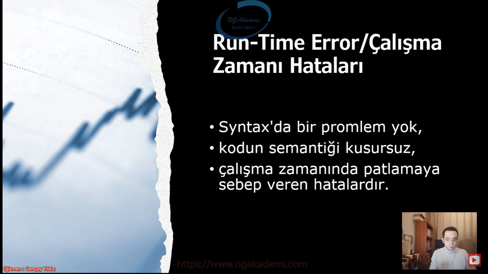
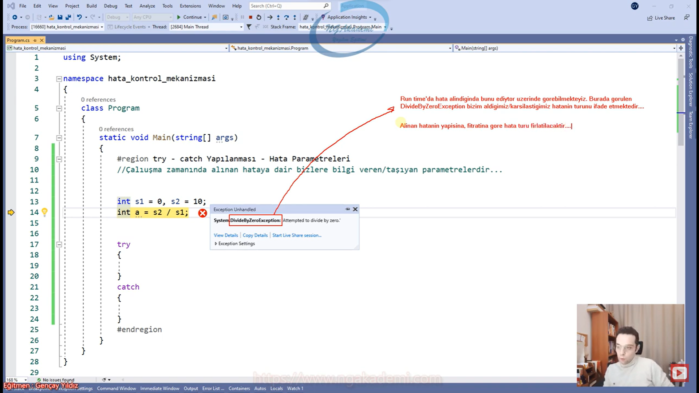
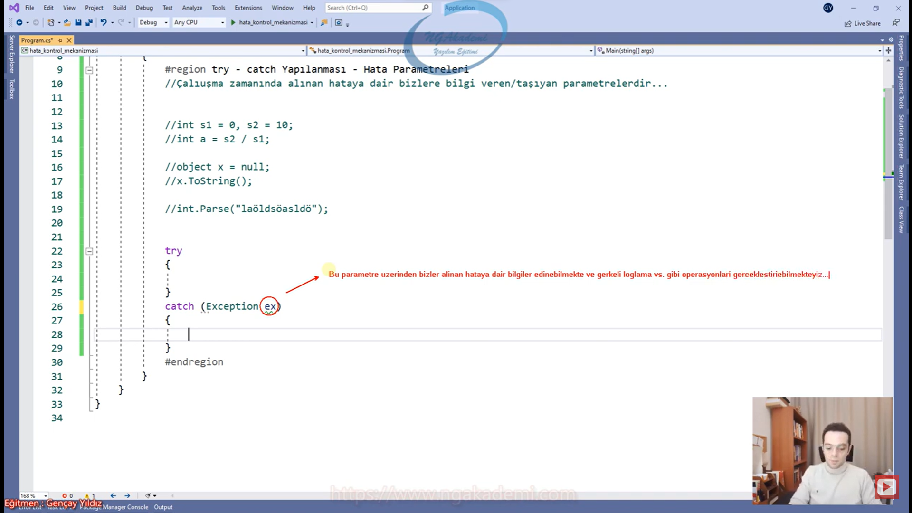
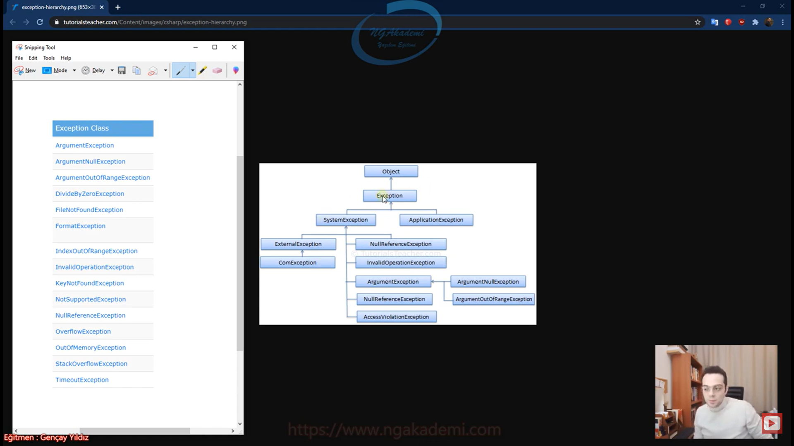
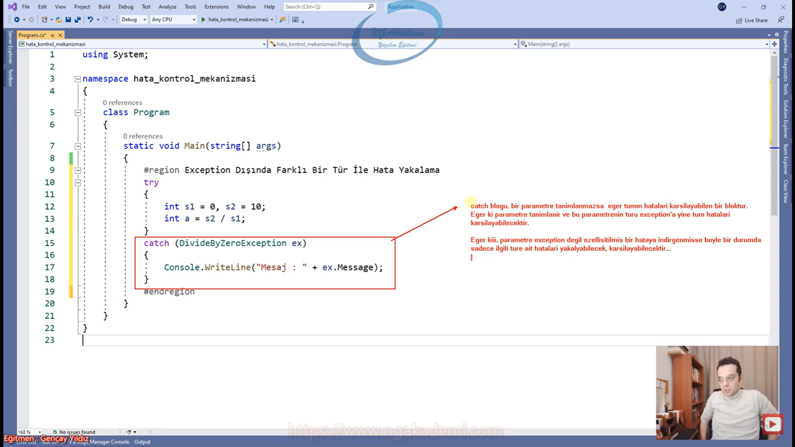
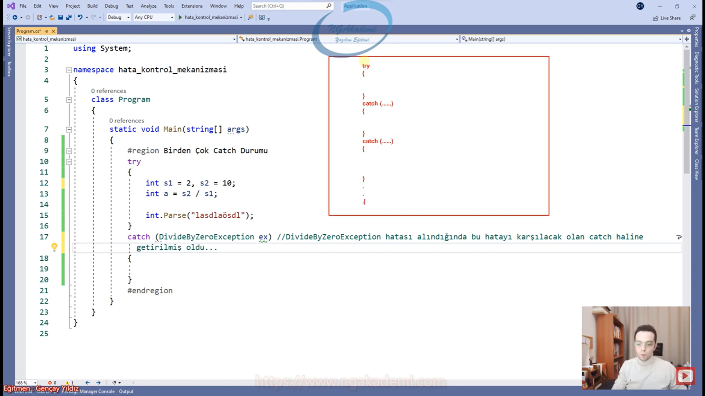
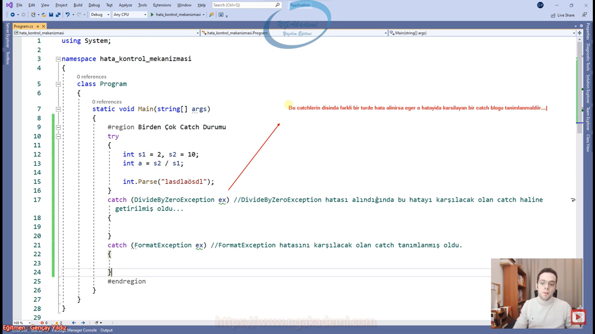

***
# 170) Hata Kontrol Mekanizmaları Nedir? Ne Amaçla Kullanılır?
- Artık bir yazılımın temel doğasında/fıtratında olan bir şeydir hata.

- Yazılım süreçlerinde en çok aldığımız ve esas olan birşey varsa o da hatadır.

- Şimdi sen geliştirdiğin yapılanmada ister istemez mükemmel muazzam bir strateji yapsan da beklenmeyen noktalarda kah gözünden kaçan noktalarda kahta yapmış olduğun hesaplamaların yanlışlığından dolayı yazılım sürecinde ister istemez birçok hatayla karşılaşacaksın. İşte bu hataları biz nasıl manipule edeceğimizi nasıl karşılayacağımızı hata kontrol mekanizmaları başlığı altında a'dan z'ye inceliyor olacağız.

- Bir yazılımcının hata dediğimiz kavram esasıdır. Yani günlük hayatta çok karşılaştığımız için artık bize yabancı değildir hata. En nihayetinde olayı şöyle düşünün ilk başta çok hata yapacaksınız ve yaptığınız hatalardan panik olmamanız lazım. Çünkü biz bunları daha nasıl yöneteceğimizi bilmiyoruz. Öğrendikten sonra farkettikten sonra hata türlerini gördükten sonra daha çok önümüz görülebilir hale gelecek daha çok böyle gözümüz açılacak diyecez ki ya arkadaş benim aldığım bu hatalar tamam bunlar çözülebilir şeyler. Hata dediğin şey zaten bu işin doğasında var.

- Biz günlük hayatta bir bardağa su doldururken bile yanlışlıkla gidip suyu yere masaya dökebilen insanlarız. Dolayısıyla ince hesap gerektiren bu tür yazılımsal durumlarda hata mı yapmayacağız? Bir mimari boyutta yazılım geliştireceksin ve hata yapmayacaksın? Bu gayet doğal hata yapacaksın önemli olan bu hatanın mahiyetini bilebilmek bunu yorumlayabilmek bunu değerlendirebilmek.

- 3 tür hatamız vardır;
    * Derleyici/Söz Dizimi Hataları
    * Runtime/Çalışma Zamanı Hataları
    * Mantıksal Hatalar

- Hatanın aslında bir yazılımcının yolundaki taş değilde ta işinin kendisinin olduğunu göreceğiz. Yazılımcı bir yerden sonra yapıları öğrenir. Bir yerden sonra bir amaca hizmet eden algoritmanın tasarısını koyar. Koduktan sonra yoldaki problemleri çözerek o yolu kazıyarak yolu inşa eder. Yani bir yerden sonra bizim işimiz hata çözmek oluyor. İster istemez işin bu oluyor. Ya mimaridleri öğreniyorsun vs. vs. Algoritmayı oluşturduğunda işin artık oradaki hataları temizlemek oluyor. Onun için bu konu bizim için çok önemli.

***
# 171) Hata Türleri - Derleme/Syntax/Sözdizimi Hatası
- Ferah ol... Hata bizim özümüzde var...


- Programlama dili kurallarına aykırı olan hatalardır.
    * Örneğin Değişken tanımlama kurallarına uymadan değişken tanımlamaya çalışırsan kodunu derleyemezsin. Çünkü syntax hatası alacaksın.

- Özellikle gelişmiş editörler(VS) sayesinde söz dizimi hataları derlemeye gerek bile kalmaksızın fark edilebilmektedirler.

- Hatanın bulunduğu satır derleyici tarafından rapor edilir.

- O yüzden fark edilmesi ve çözülmesi ennnnn kolay hata türüdür.

- Yazılması gereken konseptte kodu inşa etmediğiniz sürece syntax hatası alacaksınız. Bu hata derleme sürecine hata verecek bir hatadır. Yani derleme esnasında ortaya çıkacak hatalardır. Compiler bakacak kodu derlerken hop kardeşim sen burada bu kurallara uymamışsın burada böyle bir kod yok burada böyle bir syntax yok diye seni uyaracaktır. Normalde bunu ilkel editörler kullanırken compiler seviyesinde öğrenebiliyoruz ama gelişmiş editörler sayesinde söz dizimi hataları uygulamayı/kodu derlemeye gerek kalmaksızın anında fark edilebiliyor ve direkt bizlere sunabiliyor.

- Gelişmiş editörler diyor ki Sen burada kodunu yazdın ben bunu derlemeye göndermem çünkü sen burada hata yaptın diyor.

- Gelişmiş editörler(Visual Studio, Intellij Idea) yapılan derleyici hatalarını/syntax hatalarını derlemeye göndermeye gerek kalmaksızın zaten direkt bizlere sunan bir editördür.

- Hatanın bulunduğu satır direkt derleyici/editör tarafından bizlere sunulmaktadır. Normalde derleyici compiler tarafında söyler. Şu satırda şu noktada bir hatan var diyecektir. Gelişmiş editörlerde direkt koda nokta atışı yapacak hatanın nerede olduğunu bizlere sunacaktır.

- Örneğin : Bir `class`ın scope'ları olmalıdır. Eğer ki scope'ları silersen sana hata verecektir.
    * Bir keywordü bambaşka şekilde yazarsan/bozarsan/semantiğe aykırı bir keyword yazarsan/var olan imzayı bozarsan/olması gereken yerde olması gereken şeyi bulundurmazsan/bir şeyi olmaması gereken yere koyarsan bu tarz yerlerde biz syntax hatası alırız.
    * C# büyük küçük harf duyarlılığına sahip bir dildir. Bu yüzden bir keywordü dikkat etmeden yazarsan söz dizimi hatası alırsın.
    * Değişken tanımlama kurallarında özel karakterler değişken isimlerinde belirtilemezdi. Eğer ki belirtirsen hata alırsın.

- Gelişmiş Editörlerin altını çizdiği hatalara biz derleyici/syntax/söz dizimi hataları diyoruz. Direkt altını çizdiği yer bizim hatamızda odaklanacağımız yer olacağı için fark edilmesi en kolay hatadır. Direkt ne yapacağını hani hatayı gördün tüh burada yanlışlıkla bunu buraya yazmışım ya da özel karakter kullanmışım diyebildiğin için çözümü de en kolay olan hata türüdür.

- Hataları bilebildiğimiz/görebildiğimiz/anlayabildiğimiz/farkına varabildiğimiz için çözülmesi ve fark edilmesi ennnnn kolay hata türüdür.


***
# 172) Hata Türleri - Run-Time(Çalışma Zamanı) Hataları
- Kodunuzu yazdınız;
    * Syntax'da bir problem yok,
    * kodun semantiği kusursuz,
    * çalışma zamanında patlamaya sebeb veren hatalardır.
    * Kodunuz derleniyorsa,
    * Derlendikten sonra çalışma zamanında hatalar alıyorsanız işte bu hatalara/patlamalara sebebiyet veren hatalardır. 



- Yazılım ayaktayken ortaya çıkan bir takım aykırı durumlardan dolayı programın işletim sistemi tarafından kesilmesiyle/sonlandırılmasıyla sonuçlanır.

- Uygulamayı sen ayağa kaldırdın çalışma zamanında herhangi bir hata bir aykırılık söz konusu olursa işletim sistemiyle hani entegrasyon oluyordu ya hani bir iletişim kuruyorduk nihayetinde işte işletim sistemi kendi üzerinde çalışan yazılımlardan herhangi birinde bir aykırı durum görürse onu çalışma zamanında sonlandırıyor ve sonlandırırken de belirli bir mesaj gönderir.


- Çalışma zamanı hataları programın işleyişinin ortasında direkt kullanıcıyla temas edebilecek hatalardır. 

- Yani sen kullanıcın diyelim ki Word'ü kullanıyorsun yazdın yazdın yazdın orada bir aykırı durum oluştu yazılımsal boyutta karşına bir hata çıktı işte o hata çalışma zamanı hatasıdır.

- Bilgisayar kullanıcıları oynadığı oyunlarda çalıştırdığı programlarda çalışma zamanı hatalarıyla çok fazla karşılaşabilirler.

- Ve hiçbir yazılımcı son kullanıcının hatayla karşılaşmasını istemez...

- Genellikle kültürden kültüre boyutu değişse de bir hatayla karşılaşan son kullanıcı derinden kulak kaşındırabilir.

- Böyle bir durumda çalışma zamanında alınabilecek olan hataları yönetmek ve bir şekilde manipule etmemiz gerekecektir.

- Son kullanıcıya bir yazılımın hatayı göstermesi kullanıcı kullanım esnasındayken hatayla karşılaşması ticari açıdan da sıkıntı yaratacaktır. Nihayetinde kullanıcının tercihi nasıl ki bir insan mont alırken kaliteli bir markadan kaliteli bir mont alıyor aynı şekilde kullanıcı senin yazılımını kullanabilmesi için tercih edebilmesi için hatalardan arındırılmış arayüzü güzel kullanıcının işlemlerine hızlıca ve efektif boyutta eşlik eden bir yazılım olması gerekiyor. Arada böyle hata fırlatan kullanıcıyı böyle iş yaparken durduk yere böyle ekranlarla oyalayan bir yazılımı hangi kullanıcı tercih edebilir ve nihayetinde şöyle düşünün siz hangi yazılımı yazarsanız yazın elbette bir rekabete girdiğiniz başka bir marka tarafından aynı yazılım üretiliyordur. Mümkün mertebe bir yazılımın son kullanıcıya hata göstermemesi gerekiyor.

- Senin çalışma zamanında alacağın olası hataları bir şekilde tespit edebilmen lazım ve tespit edebildiğin durumlarda alınabilecek olası çalışma zamanı hatalarını kullanıcıya çaktırmadan göstermeden manipule etmen lazım.


- Çalışma zamanı hataları genellikle kullanılan mimari de öntanımlı mesajları verecektir.
    * Örneğin Olmayan bir dosyayı yazılımınızda açmaya çalıştığınızda mimarinizde olmayan dosyayı yazılımla açmaya çalıştığınıza dair ön tanımlı bir mesaj varsa bunu verecektir. Yoksa bu hatayı işletim sistemi seviyesinde verecek. İşletim sistemi tarafından hatanın karşılığı hangi mesajsa İşletim sisteminde tanımlanmış o mesaj verilecektir. 

- Eğer ki alınan hatanın mimaride bir karşılığı yoksa işletim sistemi dili kullanılacak ve daha kompleks bir açıklamayla karşılaşılacaktır.

- Bir yazılım kendisinde çalışma zamanında alınan hataları işletim sistemi seviyesinde mesajlarla veriyorsa bu mesajlar çok anlamsız ve kompleks bir türde olabilir. Dolayısıyla biz bunları da istemeyiz. 
    * Şimdi kullanıcı orada örneğin metinsel bir değer yazması gereken yere sayısal bir değer yazdı diyelim ya da bununla ilgili arkada çalışan kod metinsel çalışan bir kod olduğu için sayısal değerde hop patladı. Şimdi biz burada şunu yazmalıyız kullanıcı şunu görmeli; Ya kardeşim işte metinsel yazman gereken yere sayısal bir değer yazdın diye görmeli. Bunu görmeyipte işletim sistemi seviyesinde karman çorman bir hata alıyorsa kullanıcı da neden hata yaptığını bilemez ve bunu loglama sistemleri de olacak ileride mimarisel yapılanmalarda yazılım hata veriyorsa verilen hata bir yere kaydedilir ki biz yazılımcılar daha sonraki süreçte onu daha sağlam bir şekilde geliştirelim onları minimize edelim diye loga baktığında da birşey anlamazsın işletim sistemi seviyesindeki mesajlardan.


- Dolayısıyla çalışma zamanı hatasında olması gereken durum hataların önceden prograncılar tarafından tespit edilip daha anlaşılabilir bir şekilde düznelenmesi gerekiyor.

- Olması gereken ise çalışma zamanı hatalarının çmceden tespit edilip programcı tarafından daha anlaşılabilir bir şekilde düzenlenmesidir.

- Sen bir yazılım geliştirdin geliştirdiğin yazılımda çalışma zamanında alabileceğin olası hatalı durumlar varsa bunlar senin önceden tespit etmen, öngörebilmen ve bir şekilde önlem alman lazım. Ya da anlamlı şekilde manipüle etmen lazım. 

- Tabi bunun içinde çalışma zamanı hatalarının sağlam bir öngörüyle tespit çalışması yapılması gerekmektedir. 


- Çalışma zamanı hatalarını önceden kestirmek oldukça zor olabilmektedir.

- Nihayetinde sen bir yazılım yaptın ama yani önceden bunun süreçte verebileceği hatalar belki 1 dk sonra belki 3 gün sonra verebileceği hataları öngörebilmen bazen zor olabiliyor.

- Bu hataları öngörebilmek genellikle testerların işidir.

- Yazılımcı olarak sen bunu görüyorsun uygulamayı yapabildiğin kadar yapıyorsun uygulamayı koydun. Tester dediğimiz testçi arkadaşlara verdin artık onlar durmadan test ediyor uygulamanın hangi çalışma zamanı durumlarında hataları var bunların hepsini test ede ede  yani kullanarak kullanıcı olarak test ederek bunlar uygulamadaki çalışma zamanı hatalarını rapor ediyorlar ve tespit edilenler biz yazılımcılar tarafından tespit edilen noktaya göre uygun çözümlerle manipüle ediliyor.

- Uygulama mümkün mertebe test edilerek çalışma zamanı hataları tespit edilmeli ve programcı tarafından tanımlanmalıdır.

- Diyelim ki iki sayıyı toplayan bir yazılım geliştirdin ve tester'a yolladın. Şimdi iki sayıyı toplayan ve bu iki sayının dışarıdan kullanıcı tarafından girildiğini varsayalım. Toplama işlemi sayısal türlerde yapılır. Şimdi kullanıcının girmiş olduğu değerler ya sayısal değilse sayısal olmadığı durumda patlıyor işte bak semantikte bir sıkıntı yok. Sen Ahmet'le Mehmet'i toplamaya çalıştığında aritmetik işleme tabi tutmaya çalıştığında orada uygulama patlıyor. Gittin testera verdin tester bunu deniyor 3'ü girdin 5'i girdin sonuç olarak orada 8 değeri döndü bunda sıkıntı yok birde tester dedi ki ya ben burada metinsel değer yollayıp toplayabiliyor muyum dedi ve ahmetle hilmiyi toplamaya çalıştı ve program orada patladı ve tester sana yani kodu yazana rapor ediyor senin yazmış olduğun bu uygulama da şu noktada şu cinste değerleri girdiğimde patlıyor bak ya bunları engelle sadece tek bir cinste veri girilebilsin. Ya da patlama oluyorsa düzgün bir şekilde kullanıcıyı uyaralım. İşte tester dediğiniz durmadan ilgili yazılımı dener. Deneme yanılma yöntemleriyle de hangi durumlarda hangi değerlerde hangi parametrelerde bu yazılımın çalışma zamanı hatası verdiğini tespit ederler.

- Tüm bunlara rağmen gözden kaçan durumlar olması oldukça normaldir. Dolayısıyla bir programın gelişimi sahadaki belli bir sürece bağlıdır.

- En nihayetinde Facebook olsun instagram olsun bunlar senin benim sayemde gelişti. Yani sen bşey yapıyorsun hop patlıyor orada değil mi adamlara rapor gidiyor onu düzeltiyorlar. Yani milyarlarca insanın günlük hayatta kullandığı bir yazılımda aldıkları hatayı 3 5 kişilik arkadaki ekip ne kadar hangi ömürle kaç tane kaç kere denemeyle test edebilir ki?

- Son kullanıcın da almış olduğu hataları log mekanizmalarıyla toplayıp nerelerde hangi durumlarda hangi değerlerde hangi parametrelerde çalışma zamanı hataları alınıyormuş tespit edilebilir. İşte bu da artık yapılan yazılımı süreçteki kullanıcıdan gelen dönütlere bilgilere bağlı olacaktır. Zaten hayatta böyle birisi araba üretiyor ürettiği araba ilk ürettiğiyle 2000'de ürettiği segmentle şimdiki ürettiği segment arasında tank farkı var neredeyse. Diğeri yürürken dağılacak ama şimdiki arabalar bayaa hani gelişmiş vaziyette. İşte burada gelişim sürecini tamam bilim ilerletiyor ilerletmesine ama kullanıcılardan gelen trafiklerden gelen kaza oranlarından gelen bütün raporların değerlendirilmesi sonucu gelişiyor. işte bazı şeylerin artık sahaya sürülmesi gerekiyorsa da sürülüyor.

- Bu süreçten toplanan loglar ve son kullanıcı dönütleri değerlendirilerek çalışma zamanı hataları tespit edilip arındırılabilir.

- Sahaya sürülmüş bir yazılımda bu sahadaki sürecinde toplanan loglar ve son kullanıcı dönütleri değerlendirilerek çalışma zamanı hataları gene tespit edilebilmekte.


- Tespit edilen çalışma zamanlarının manipülasyonunun oldukça önemli olduğunu söyledik.

- Nihayetinde bodoslama kullanıcıya vermektense hatayı ilgili patlamayı sen manipüle edip sen kullanıcıya başka bir şekilde başka bir hata vermen daha doğru olacaktır. Hani kullanıcı onu bir yazılımın gereği gibi düşünsün. Hani bir patlama hata değilde yazılımın gereği olan bir uyarı gibi düşünmesini sağlaman lazım.


- Yazılımdaki hata kontrol mekanizmalarını devreye sokarak...

- Hata kontrol mekanizmaları çalışma zamanı hatalarını kullanıcıya hissettirmeden yakalayabilmek ve ilgili hatayı manipüle edebilmek için var olan bir yapıdır.

- `try catch` yapılanmasını hata kontrol mekanizmasının ta kendisidir.

- Hata kontrol mekanizması çalışma hataları için vardır. Syntax/semantik hatalar için `try catch` yapılanmasını kullanamazsınız ya da mantıksal hatalarda da gidip `try catch` yapılanmasını kullanamazsınız. Onların çözümleri başka. Ama bizim ticari açıdan kritik arz eden çalışma zamanı hatalarının bir şekilde manipüle edebilmek için işte `try catch` dediğimiz hata kontrol mekanizmaları bunlar için soz konusudur. Çalışma zamanı hatası için söz konusudur.


- Çalışma zamanı semantik açıdan/syntax açısından herhangi bir problemin olmadığı bir durumda alınan hatalardır. Bunlar kullanıcıya gösterilmeksizin manipüle edilmesi gereken hatalar çünkü ticari açıdan risk taşıyor. Risk taşıdıklarından dolayı bunları çalışma zamanında olası olan bu hataları bir şekilde manipüle etmemiz lazım işte bunu da yapabilmek için hata kontrol mekanizmlarını yani `try catch` bloklarını kullanmamız gerekecek.

***
# 173) Çalışma Zamanı/Run-Time Hata Durumları​na Örnek Verelim
- Olmayan bir dosya olmayan bir nesne üzerinde işlem yaparken alınan hatalardır.

- Olmayan bir dosyayı açmaya yahut üzerine yazmaya okumaya vs. çalışmak

- Olmayan değer üzerinde işlem yapmaya çalışmak 

- Uygun olmayan formatlarda çalışmak.

- Veritabanı bağlantısının kopması.

- Çalışma esnasında varolan bağlantının kopması durumunda.

- Başta olmayan bir bağlantı derleme zamanında zaten yok. Zaten kuramazsın derleme zamanında sonra eğer hiç veritabanı bağlantısı yoksa. Ama varolan bir veritabanı bağlantısı süreçte koptuğunu düşünürsek bu çalışma zamanında bir hataya sebep olacaktır. Ya da bunun gibi başka bağlantıların entegrasyonel yapılanmaların birbirinden kopması bağlantıların kesilmesi uzaktan dinlediğimiz servislerin yanıt vermemesi gibi durumlar çalışma zamanlarında hatalara sebep olacaktır.


- Çalışma zamanındaki olası parametrik değerler üzerinde olası vermiş olduğumu değerler üzerinde alınan çalışma zamanı hatalarını iyi tespit edip bunlara göre önlem almamız gerekiyor.

- Önemli olan problemin ne olduğunu bilebilmek. Sen zaten problemin ne olduğunu biliyorsan gerisi artık teferruata kalır. Problemi tespit edebilmek sıkıntı. Yazılım süreçlerinde her daim bizim problemimiz yani bizim asıl gayemiz problemi teşhis edebilmek. Problemi çözmek değil Problemi çözmekte sıkıntı yok.


```C#
Çalışma Zamanı Hata Durumları Örnek

System.Console.WriteLine("Lütfen birinci sayıyı giriniz.");
int sayi1 = int.Parse(Console.ReadLine());
System.Console.WriteLine("Lütfen ikinci sayıyı giriniz.");
int sayi2 = int.Parse(Console.ReadLine());
System.Console.WriteLine("Toplam : " + (sayi1 + sayi2));
```

- Olası hatayı verebilecek olan kodu keşfettikten sonra bunların üzerinde manipülasyon işlemi yapabilmemizi sağlayacak olan yapılanma `try catch` yapılanmasıdır.

***
# 174) try - catch Mekanizması Teorik Anlatım
- Runtime'da alınan hataları manipüle etmemizi/karşılamamızı/kontrol etmemizi sağlayan bir programatik yapıdır.

- Programalama dilinin dahilindedir.

- Runtime'daki patlamalarda hata durumlarına ilgili hatayı kontrol etmemizi/doğru manipülasyonlar ya da istediğimiz manipülasyonları yapmamızı sağlayan yapılanmaya `try catch` yapılanması diyoruz.

- Çalışma zamanında alınan olası hataları kontrol etmemizi, karşılamamızı, manipüle etmemizi sağlayan bir yapılanmadır.

- Gelen bir şeyi doğru bir şekilde manipüle etmek mesela dövüş sanatında karşıdan gelen saldırıyı manipüle edip ya sonlandırabiliyor ya da karşıdan gelen saldırıyı manipüle edip aynı etkiyi kendisine döndürüyor. Yani manipülasyon demek gelen etkiyi istediğiniz gibi birşeye dönüştürebilmek dolayısıyla burada bir patlama oluyor. Burada bir etki oluşuyor oluşan bu etkiyi başka bir şeye dönüştürmek kullanıcıya hissettirmeden bir mesaj vermek bir patlama değilde sanki yazılımın doğal bir süreciymiş gibi yazılımda bir refleks göstermektir manipülasyon. İşte biz bunu `try catch` yapılanmasıyla gerçekleştiriyoruz.

- `try - catch` yapılanamsı, uygulama sürecinden yaşanan olası hatayı kullanıcıya hissettirmeksizin farklı bir durum ya da olağan bir mesaj gibi göstermemizi sağlayan ve bunun yanında patlamaya/hataya dair bizlere bilgi sunan ve böylece bu bilgiler eşliğinde kayılar/log oluşturmamızı sağlayan bir programatik yapılanmadır.

- Uygulama da ister istemez hatalar alacağız. İşte bu alacağımız hatalar çalışma zamanında alınıyorsa bunları biz kontrol ederken `try - catch` yapılanamsını kullanıyoruz.

- `try - catch` yapılanamsının amacı;
    1. Kullancıya alınan hatayı hissettirmemek
    2. Alınan hatanın nedenine dair kullanıcıya bilgilendirmek.
        * orada bir patlama oluyor sen kullanıcıya hissettirmeden güzel bir şekilde manipüle etmen gerekiyor. Ya kardeşim bak sen bunu burada yaptığın zaman bu olmuyor diye kullanıcıyı uyarabilmen lazım bilgilendirebilmen lazım bunu uygulama sona ermeden yapabilmen lazım işte `try - catch` yapılanması ile yapacaksın.
    3. işletim sistemleri aykırı durum yaşandığında uygulamayı sonlandırmak isterler ve sonlandırırlar. `try - catch` yapılanması ile alınan hataya dair bir manipülasyon gerçekleştiriliyor ve uygulamanın kapanmadan devam edilmesi sağlanabiliyor...
        * Alınan her çalışma hatasında uygulamayı sonlandırmaktansa hatayı doğru bir şekilde manipüle edip uygulamanın devam etmesini sağlamak ve bu hataya sebep olan durumlara karşı doğru uyarılarda mesajlarda bulunmak bizim amacımız bu.
        * Örneğin banka sistemlerine giriş yaparken senden sayısal bir değer istiyor telefona mesaj gönderiyor gelen mesaj üzerinden diyor ki işte oradaki sayısal değeri buraya yaz. Oradaki sayısal değerin yerine gidip metinsel karakterlerde yazmaya çalıştığında seni uyarıyor. Hop kardeşim buraya sen metinsel yazamazsın. Yazacağın değerler sayısal olması gerekiyor. işte bu durumu biz arka planda daha gelişmiş yapılanmalarda Validation'lar falan kullanılıyor ama şöyle düşünün sen oraya metinsel bir ifade yazdın gönderdin arkada patlıyor patlayınca manipüle ediyor ve seni uyarıyor buraya sadece sayısal ifadeler girebilirsin diye.

- `try - catch` yapılanması hataları kontrol etmemizi hataları doğru şekilde manipüle etmemizi yönlendirmemizi sağlayan bir yapılanma.

- Prototip : `try {Olası çalışma zamanı hatalarını verebilcecek kodları buraya yazıyoruz...} catch(){try içerisinde olası hata söz konusuysa kodun akışı orada kesilecek ve akış catch bloğundan devam edecektir.}`

- Olası çalışma zamanı hatası veren ve belirli parametlere/değerlere göre çalışma zamanında hata fırlatan kodlarımı `try` bloğu içine yazarız.

- Hata alındıktan sonra yapacağın işlemleri de `catch` bloğu içerisine yazarız.

- Örneğin `Console.ReadLine()`dan gelen `string` ifadeyi eğer ki elimizdeki ifade integer'a dönüştürülemeyecek bir ifadeyse orada biz patlıyorduk. İşte oradaki kodları `try` bloğu içerisine yazacağız. Çünkü runtime'da verilen değerin türüne göre/formatına göre çalışma zamanı hatası üretebiliyor işte ürettiği zamanda `catch` bloğu içerisine Lütfen sayısal değer giriniz diyeceğiz. Ya da beklenmyen bir hata oluştu diyeceğiz. Ama uygulama hata verdiği noktada kesilmeyecek uygulama `catch`den devam edecek ve ondan sonra ne yapıyorsanız artık o işlemden devam edecektir.

- Uygulama da çalışma zamanında alınan hataları yönetmemizi kontrol etmemizi sağlayan yapılanma `try - catch` yapılanmasıdır. Uygulama hata verdiği zaman bu yapılanma sayesinde Runtime'da alınan hata neticesinde manipülasyon edilecektir hata ve hatayla ilgili bize bilgi verecektir. İstediğimiz bilgiyi elde edebiliyoruz. Loglama ya da kayıt işlemlerini yapmamıza imkan tanıyor. Bunun dışında bir de ekstradan uygulamayı sonlandırmadan uygulamanın yaşamasını/uygulamanın ayakta kalmasını devam ettiren bir yapılanmadır. 

```C#
#try - catch Yapılanması
System.Console.WriteLine("Lütfen birinci sayıyı giriniz.");
int sayi1 = int.Parse(Console.ReadLine());
System.Console.WriteLine("Lütfen ikinci sayıyı giriniz.");
int sayi2 = int.Parse(Console.ReadLine());
System.Console.WriteLine("Toplam : " + (sayi1 + sayi2));
```


***
# 175) try - catch Mekanizması Pratik Anlatım
- `try` bloğunda olası çalışma zamanı hatası verebilecek kod yazılır. Çalışma zmaanında bir hata alınırsa eğer direkt uygulama/akış `catch` bloğuna düşer. Hataya dair ya da hata alındıktan sonra neler yapılacaksa onları burada belirtiyoruz.

- Olası çalışma zamanı hatalarını barındıran/verebilecek olan kodları `try` bloğuna yazıyoruz.

- try içerisinde bir hata söz konusu olduğunda catch bloğu tetiklenecektir Hataya dair;
    * log
    * Kullanıcı bilgilendirme
    * Kontrollü kapanış vs.
- `catch` bloğu artık son bişey yapman içindir. Sen hata alındı artık bu hataya dair gerekli manipülasyon yapacağın neyse onu burada yapacaksın. Genellikle kullanıcıya doğru bir bilgi sunarız ve loglama işlemlerini yaparız ama bu demek değildir ki birtek bunları yaparız istediğin neyse yani oradaki ihtiyacımız her neyse onların hepsini `catch` bloğunda yapabiliriz.

- Uygulama normalde `try catch` kullanmıyorsanız sonlanıyor `try catch` kullanıyorsanız hata alındığında sonlanmıyor `catch`den devam ediyor.

- `try` da hata alınıyor `catch`e düşüyor. `catch`de yapacağını yapıyorsun ondan sonra uygulama devam ediyor akışa.

- `try` bloğunda hata alınmazsa `catch` bloğu çalışmayacaktır. `catch` bloğunun çalışabilmesi için `try` bloğunda bir patlama olması gerekmektedir. Yani bir çalışma zamanı hatasının meydan gelmiş olması gerekiyor.

- Sen durumun farkındasın kullanıcı hangi durumda hangi parametreyi girdiğinde çalışma zamanı hatası fırlattığını farkındasın yazılımcı dediğin bunun farkında olur ve bütün senaryolarda bu bellidir zaten. Senaryoya göre kullanıcıyı uyarman lazım. Alakasız bir şekilde uyarmaman lazım. Ya da geniş böyle ne olduğu belli olmayacak detaysız bir şekilde uyarı da vermemek lazım. Örneğin bir hata alınmıştır. Kullanıcı diyecek tamam kardeşim bir hata alınmıştır da neye gör bir hata alınmıştır? Hani ben ne yaptımda hata alındı onu bana söylersen ben ona göre bu uygulamayı kullanırım diyecek.

- `catch` bloğu sadece hata durumlarında çalışan bir bloktur.

```C#
#try - catch Yapılanması
#try -catch İskelet Yapısı
try
{
    //Olası çalışma zamanı hatalarını barındıran/verebilecek olan kodları buraya yazıyoruz.
}
catch
{
    //try içerisinde bir hata söz konusu olduğunda catch bloğu tetiklenecektir. 
    //Hataya dair; log, Kullanıcı bilgilendirme, Kontrollü kapanış vs.
}

try
{
    System.Console.WriteLine("Lütfen birinci sayıyı giriniz.");
    int sayi1 = int.Parse(Console.ReadLine());
    System.Console.WriteLine("Lütfen ikinci sayıyı giriniz.");
    int sayi2 = int.Parse(Console.ReadLine());
    System.Console.WriteLine("Toplam : " + (sayi1 + sayi2));
}
catch 
{
    System.Console.WriteLine("Lütfen doğru bir ifade giriniz.");
}
```

***
# 176) try - catch Mekanizması Kritik Yapalım
- `try catch` yapılanmasında olası hata verecek kodları `try` bloğunda yazılır. Hata neticesinde çalışacak kodlar ise `catch` bloğuna yazılır.

- `try catch` yapılanması olası hata verecek kodları durmadan denetleyen bir yapılanmadır. Yani bir transaction var gibi düşünebilirsiniz veritabanındaki olan yapılanmadaki gibi. Durmadan işlemi check eden durmadan o kodlarda bir patlama var mı yok mu kontrol eden bir yapılanmadır.

- `try catch` yapılanması olası hatanın ihtimali olduğu kodları durmadan kontrol eden maliyetli bir yapıdır. Dolayısıyla `try` içerisinde kontrol edilen kodlar lüzumsuz yere tüm kodlar olmamalıdır. Sadece olası hata verebilecek kodları barındıran bir yaklaşım sergilememiz kontrol maliyeti açısından daha verimli ve performanslı olacaktır.

- Bir uygulama da ne kadar çok `try catch` yapılanması kullanılıyorsa o uygulama o kadar maliyetlidir. Yani sistemleri sunucuları ve kaynakları çok fazla tüketir. Dolayısıyla `try catch` yapılanmasında sizin tasarruflu kullanım yapmanız lazım. 

- Şimdi biz bütün kodları `try catch` yapılanması ile kontrol etmektense sadece ihtimal dahilinde olanları uygun algoritmayla kontrol etmem daha doğru olacaktır.

- `try catch` yapılanması maliyetli bir yapılanma olduğu için hedef yani olası hatayı verebilecek noktayı bloklayıp orayı almak orayı manipüle etmek geri kalanını dışarı da tanımlamak gerekiyor.


- `try` içerisine koyulan kodlar hedef kodlar yani sadece olası hatayı verebilecek kodların olması bizim için tercihtir. Böyle bişey yapabiliyorsanız bu tercihi yapabilecek seviye de bir algoritma oluşturabiliyorsanız bunu yapın yok eğer çok artık curcunaya dönüyor arap saçına çevirmen gerekyior kodları bir yerden sonra orada dur tamnam yine `try catch` kullanman gereken yerde kullan ne varsa koy içine. Koyabilidğin en az şekilde yine koyman gerekenleri koy.

- `try catch` yapılanması alınan hataya/patlamaya dair bize bilgi veren bir yapılanmadır.

```C#
#try - catch Yapılanması
#try -catch İskelet Yapısı
try
{
    //Olası çalışma zamanı hatalarını barındıran/verebilecek olan kodları buraya yazıyoruz.
}
catch
{
    //try içerisinde bir hata söz konusu olduğunda catch bloğu tetiklenecektir. 
    //Hataya dair; log, Kullanıcı bilgilendirme, Kontrollü kapanış vs.
}

System.Console.WriteLine("Lütfen birinci sayıyı giriniz.");
int sayi1 = 0, sayi2 = 0;
try
{
    sayi1 = int.Parse(Console.ReadLine());
    System.Console.WriteLine("Lütfen ikinci sayıyı giriniz.");
    sayi2 = int.Parse(Console.ReadLine());
}
catch
{
    System.Console.WriteLine("Lütfen doğru bir ifade giriniz.");
}
System.Console.WriteLine("Toplam : " + (sayi1 + sayi2));
```

***
# 177) try - catch Hata Parametreleri
- Çalışma zamanında alınan hataya dair bizlere bilgi veren bilgi taşıyan parametrelerdir.

- Farklı hata durumlarına göre farklı parametrelerle hatalar fırlatılmakta.

- Runtime'da hata alındığında bunu editör üzerinde görebilmekteyiz. Bu hatanın türünü görebilmekteyiz.

- Alınan hatanın yapısına/fıtratına göre hata türü fırlatılacaktır. 

- `int a = 10 / 0;` Bir sayıyı sıfıra bölmeye çalıştığınızda DivideByZeroException türünde hata fırlatılacaktır.

- `object x = null;`
- `x.ToString();` Herhangi bir değeri `null` olan değişken üzerinde işlem yapmaya çalışıyorsak. `null` olan yani Olmayan bişey üstünde işlem yapmaya çalışmak bir tutarsızlık bir aksi durum söz konusu. Dolayısıyla bu da çalışma zamanı hatasına sebebiyet verecektir. NullReferenceException türünde hata fırlatılacaktır.

- `int.Parse("asgsagdasfalkfsa");` Elimizdeki herhangi bir metinsel ifadeyi sayısal ifadeye `Convert` ya da `Parse` ederken eğer ki metinsel ifade sayısal ifadenin formatına uygun değilse yine hata alacağız. FormatException türünde hata fırlatılacaktır.
 


- Yapmış olduğumuz işlem neyse ona göre hata fırlatılıyor.

- Çalışma zamanında alınan hataya göre bize bir hata türü fırlatıyor. İşte biz çalışma zamanında alınan hatanın hangisi olduğunu bu türleri yakalayarak çok rahat raporlayabiliyoruz.

- `try catch` yapılanmasında `try`da hata oldu mu patlamayı `catch` bloğu karşılar. Hangi hata bilgisi olduğunu bize taşıyacak/getirecek olan blok `catch` bloğudur.

- Exception : Bizlere fıraltılan hatayla ilgili tümmm bilgileri getirecek olan bir üst türdür... Yani bütün hataları karşılayabilen bir türdür.


- `catch (Exception ex)` bloğunun parametresi olan ex sayesinde bizler alınan hataya dair bilgiler edinebilmekte ve gerekli loglama vs. gibi operasyonları gerçekleştirebilmekteyiz...



- `try` bloğunun içinde alınan hata her neyse onu `catch` bloğunun parantezinin içinde yani parametresinde yakalayabiliyorum.

- Çalışma zamanında alınan hatalar alındığı duruma göre farklı türlerde fırlatmalar yapıyor. İşte bu farklı türleri de farkettikten sonra hangi türde hata aldığımızı Exception üzerinden bunu çok rahat bir şekilde öğrenebiliyoruz.

- Exception parametresi `catch` bloğuna yazılmak/tanımlanmak zorunda değildir... Eğer ki tanımlama yapılırsa hataya dair bilgi alabiliriz... Yok eğer tanımlama yapılmazsa hata neticesinde `catch` bloğu çalışacak lakin bilgi alamayacağız...

```C#
#region try - catch Yapılanması - Hata Parametreleri
//Çalışma zamanında alınan hataya dair bizlere bilgi veren bilgi taşıyan parametrelerdir...
int s1 = 0, s2 = 10;
int a = s2 / s1;
object x = null;
x.ToString();
int.Parse("asgsagdasfalkfsa");
try
{
    int s1 = 0, s2 = 10;
    int a = s2 / s1;
}
catch (Exception ex)
{
    System.Console.WriteLine("Mesaj : " + ex.Message);
}
#endregion
```


***
# 178) try - catch Hata Türleri
- Hata durumları birer türe aittir.


- `catch` bloğunda hataya dair parametre tanılmayabiliyoruz. O parametreyi de şu ana kadar `Exception` ile tanımladık.

- Tüm hatalar `Exception`dan türer.

- Tüm hata türleri `Exception` tarafından karşılanabilir.

- Eğer ki istiyorsanız `catch` parametresine ilgili hata türlerini de yazabilirsiniz. Fırlatılan tür `DivideByZeroException` sa onu `catch` bloğunun parametresinde `DivideByZeroException` ile karşılaştırabilirsin/karşılayabilirsin. Ama başka bir türde bir hataysa `DivideByZeroException` ile karşılayamazsın. Biz bütün hepsini ortak olarak karşılayabilmek için `Exception`la karşıladık.

- Özelleştirilmiş parametrelerle de hata karşılayabilmekteyiz.

- `Exception` tüm hata türlerinin atasıdır. Bütün veri türlerinin atası `Object`tir. `Exception` referans türlü bir değişkendir/değerdir/türdür




***
# 179) try - catch Exception Dışında Farklı Bir Tür İle Hata Yakalama
- `Exception` hataları kapsayan bir tür olduğundan dolayı hangi hatayı verirse versin biz `Exception` ile ilgili hatayı yakalayabiliyor ve hatayla ilgili bilgi edinebiliyorduk. Bir de ekstradan biz alınacak hatanın türüne uygun bir parametrede tanımlayabiliyoruz.

- `DivideByZeroException` `Exception`ın altında olan `class`lardan birisidir.

- `catch` bloğu bir parametre tanımlanmazsa eğer tümm hataları karşılayabilen bir bloktur. Eğer ki parametre tanımlanır ve bu parametrenin türü `Exception`sa yine tüm hataları karşılayabilecektir. Eğer ki parametre `Exception` değil özelleştirilmiş bir hataya indirgenmişse böyle bir durumda sadece ilgili türe ait hataları yakalayabilecek/karşılayabilecektir.

- `Exception` dışında başka bir türle hata yakalayabiliyoruz ama birtek o türde yakalayabiliyoruz.



- `catch` bloğunda varolan hataya uygun olmayan bir hata fırlatılırsa `try` bloğunda yine patlama meydana gelecektir.

- Eğer ki `catch` bloğu tek bir hata türüne özgü ise(Genel Olmayan,yani `Exception` değilse) böyle bir durumda sadece o türden hataları yakalayabilen/karşılayabilen bir yapı haline gelmektedir. Eğer ki `catch`bloğu hatayı karşılamazsa `try catch` bloğu kullanıldığı halde fiziksel olarak patlama meydan gelecek ve uygulama sona erecektir.

- Dolayısıyla `try catch` bloğu hangi parametre tanımlandıysa o parametrenin yakalayabileceği türdeki hataları manipüle etmekte eğer ki parametrenin dışında farklı bir türde hata fırlatırlırsa `try catch` bloğu ilgili hatayı manipule etmeyecek ve fiziksel olarak uygulamayı patlatıp sonlandıracaktır....

- Çözüm olarak bu durumda birden fazla `catch` bloğu ile diğer türdeki parametreleri kontrol etmek olacaktır....

- Dikkat ederseniz `catch` bloğu verilen parametrenin türüyle bağdaşmaktadır... Senin verdiğin parametrenin türü ne ise o türe uygun hatalarda birtek tetiklenmektedir.

```C#
Exception Dışında Farklı Bir Tür İle Hata Yakalama
try
{
    int s1 = 0, s2 = 10;
    int a = s2 / s1;
    int.Parse("asfasfsafsa");
}
catch (DivideByZeroException ex)
{
    System.Console.WriteLine("Mesaj : " + ex.Message);
}
```


***
# 180) try - catch Birden Çok Catch Durumu
- Bir `try catch` yapılanmasında birden fazla `catch` durumuna ihtiyacımız olabilir. Çünkü `try` içerisinde kontrol/check edilen kodlar çalışma zamanında birden farklı türde hata fırlatabilme ihtimali vardır ki ondan dolayı.

- `catch` bloğuna `Exception` parametresini geçersek eğer her hata türünde de aynı davranışı sergileyecektir. Dolayısıyla farklı durumlardaki hata durumlarında bu şekilde bir fark oluşturamayız...
    * Örneğin `DivideByZeroException` da şu kodu çalıştır `FormatException` dada şu türü çalıştır demek istiyorum. İşte böyle durumlarda birden fazla `catch` bloğu bildirebilirsiniz.


- Farklı parametrelerle birden fazla `catch` bloğu oluşturabiliyorsunuz.



- `catch` de tanımalanan parametrelerin dışında farklı bir türde hata alınırsa eğer o hatayı da karşıalyan bir `catch` bloğu tanımlanmalıdır...



- Eğer ki tüm hataları öngörememek gibi bir durum varsa öngörebildiklerini `catch` parametrelerine yazarsın ve en son bir `catch` bloğuna genel tüm hataları kapsayan `Exception` parametresini geçersin.

- `Exception` tüm hata durumlarını karşılayabilen bir türdür. Eğer ki sen `catch` bloklarının en sonuna `Exception`ı tanımlarsan üsttekilerden hiçbiri değilse en son bu tetikleyecek ve karşılayacaktır.

- `catch` bloklarının en sonuna `Exception` türünde `catch`e parametre tanımlarsan alınan hata üstteki türlerden herhangi biri değilse kesinlikle bu `Exception` tarafından karşılanabilir olacağından dolayı en kötü bu `catch` bloğuna girecektir.


- Anlaşılıyor ki `try - catch` yapılanamsı olası runtime hatası alındığında `catch` sıralamasına göre/senkron bir şekilde/oradaki sıralamaya riayet ederek kontrol etmektedir. Sıralama burada önemlidir.

- Bu sıralama önemlidir....

- Eğer ki birden fazla `catch` bloğunun tanımlanmasında `Exception` parametresi kullanılacaksa eğer bu `Exception`ının ennn sona tanımlanması gerekmektedir!!!


- Eğer ki sen gelipte `Exception`ını en başa yazarsan her daim alınan hatalar `Exception` olduğundan dolayı diğerlerine zaten bakmayacaktır. `Exception` varsa özelleştirilmiş türler önce yazılır ardından `Exception` yazılır. Hatta `Exception`ı başa yazarsan compiler buna izin vermeyecektir. `Exception` türünde kontrol yapan `catch` bloğu en sona yazılmak zorundadır.

- `try` bloğu içerisinde alınan hatanın türüne göre farklı işlemler yapacaksanız bunları farklı `catch`lere bölüp türlerinden farkı oluşturabilirsiniz. İşte burada alınan türle hangi `catch`in tetikleneceğini buradaki tür kıyaslaması sağlamaktadır.

- Sıralama çok önemli `Exception` en sona yazılması gerekiyor. Onun dışında özel türlerin sıralaması önemli değil `Exception` yazmasanızda olur ama sizin öngörebildiğiniz türlerin dışında varsa bir ihtimal bunu da `Exception`la yakalayıp en azından olası hatayı manipüle edip uygulamanın sonlanmasını engelleyebilirsiniz.

```C#
Birden Çok Catch Durumu
try
{
    int s1 = 0, s2 = 10;
    int a = s2 / s1;//DivideByZeroException
    int.Parse("asasfsadasfsaf");//FormatException
}
catch (DivideByZeroException ex)//DivideByZeroException hatası alındığında bu hatayı karşılayacak olan catch haline getirilmiş oldu...
{
}
catch (FormatException ex)//FormatException hatası alındığında bu hatayı karşılayacak olan catch haline getirilmiş oldu...
{
}
catch (Exception ex)
{
}
```

***
# 181) try - catch finally Bloğu
- `try` bloğunda hata verme ihtimali olan kodları
- `catch` bloğunda ise hata alındıktan sonra yapılacak işlem kodlarını yazarız.

- `try - catch` yapılanmasında `catch` bloğuna girse de girmese de her iki durumda da hata alınsa da alınmasa da tetiklenmesi gereken bazı kodlar vardır. O kodları biz `finally` bloğunda tetikleriz.

- `finally` bloğu `try catch` yapılanmasında hata alınsa da alınmasa da her iki durumda da tetiklenmesi/çalıştırılması gereken kodları yazdığımız bloktur.

- `finally` bloğu `try catch`ten sonra en sona tanımalanır. Birden fazla `catch` bloğunuz olsa dahi en sona gelip `finally` bloğunu tanımlayabilirsiniz.

- `finally` bloğunu en sona tanımlamamız gerekiyor. En son ne yapacağına dair bilgilendirme yaptığın gerekli en son her iki durumda da çalışmasını istediğin kodları bu blokta belirliyorsun.

- Eskiden veritabanına bağlantıyı yapıyorduk daha sonra veritabanıyla işimizi bitirdikten sonra bağlantıyı koparıyorduk. Veritabanı bağlantısını açıyorduk işlem yapıyorduk eğer ki bir patlama olursa `catch` bloğunda artık veritabanından bağımsız bir yere düşüyorsun yani veritabanına erişememe ihtimalin var vs. Program patlamış bambaşka bir noktaya gelmişsin yani olay akış değişiyor. İşte ne olursa olsun `try` başarılı bir şekilde sonlansa da ya da `catch`e düşsek de çalışma zamanı hatasından dolayı farketmeksizin her iki durumda da veritabanı bağlantısını kesmemiz gerekiyorsa eğer bunu `finally`de yapıyoruz. `finally`de yapıp ne olur ne olmaz her türlü veritabanı bağlantısını kes diyorduk.

```C#
#finally Bloğu
//finally bloğu try catch yapılanmasında hata alınsa da alınmasa da her iki durumda da tetiklenmesi/çalıştırılması gereken kodları yazdığımız bloktur.
try
{
    //hata verebilecek kodlar buraya
    System.Console.WriteLine("try");
}
catch
{
    //hata alındıktan sonra yapılacak işlemler buraya
    System.Console.WriteLine("catch");
}
finally
{
    //Her iki durumda da çalışmasını istediğimiz kodlar buraya
    System.Console.WriteLine("finally");
}
```

***
# 182) try - catch when Yapısı İle Hata Filtreleme (C# 6.0)
- `try - catch` yapılanmasına C# 6.0 sürümünde `when` keywordüyle ekstradan şart ifadeleri ekleyerek hataları daha da detaylı filtrelememizi sağlayan yeni bir özellik gelmiş bulunmaktadır. 

- `when` keywordünü kullanmak isterseniz `catch` keywordünden sonra kullanabilirsiniz. Parametreden sonra ya da parametre tanımlı değilse direkt `catch` keywordünden sonra direkt tanımlayabilirsin. `when` deki mantık ve mantığıdır.

- `when` keywordüyle elimizdeki hataları daha da detaylı bir şekilde filtreleyebiliyoruz.

- Diyelim ki `catch` parametresinde gelen hatayı yakaladın ama `when` şartını karşılayamadın o zaman hata verecek ve uygulama patlayacaktır. Her ikisini de tutturman gerekiyor. ve kapısı gibi. Bu durumda ne olur olmaz diye `Exception` türünde bir parametreli `catch` bloğu tanımlamak akıl karı olacaktır.

- `try catch` bloklarına `when` keywordü ile şart uygulayabilmekteyiz...

```C#
#when Yapısı İle Hata Filtreleme(C# 6.0)
//try catch bloklarına when keywordü ile şart uygulayabilmekteyiz...
string x = "a";
try
{
    int s1 = 0, s2 = 10;
    int a = s2 / s1;
}
catch (DivideByZeroException ex) when (x == "a")
{
    System.Console.WriteLine("Mesaj : " + ex.message);
}
catch (DivideByZeroException ex) when (x == "b")
{
    System.Console.WriteLine("Mesaj : " + ex.message);
}
catch (Exception ex)
{
}
```

***
# 183) Hata Türleri - Mantıksal Hatalar
- Programın mantığında/akışında/algoritmasında/stratejisinde bir takım şeylerin yanlış hesaplanması/düşünülmesi/tasarlanması neticesinde alınan hatalardır.

- Mantıksal hatalar genellikle yapılan hamleyle alakalıdır. Yazılımsal bir hata değil mantığıyla ilgili hatadır. Sen nasıl satranç oynarken kurallara uygun bir şekilde hamle yapabilirsin ama yapmış olduğun hamle bazen mantığa hatalı aykırı olabilir. İşte yazılımda da yapmış oldupun hatalar aynen bu şekilde. Mantıksal mantığa aykırıdır. Senin normalde ışığın yanıp ynamadığını ona göre bir sensörün veri alıp almama durumunu kontrol ettiğini varsayalım. Işık yanıyorsa sensör veriyi alsın ışık yanmıyorsa sensör veriyi almasın. Şimdi böyle bir durumda sen kodu ışığın yanmadığı durumda sensör veriyi alsın diye kodlarsan bu kod derlenebilir ama mantıksal bir hata yapmış olursun.


- Syntax'ta kodnun derlenmesinde de hatta çalışma zamanında da hata yoktur. 

- Kod çalışır sonuç verir.

- Lakin sonuçlar hatalıdır. Beklenen sonuçlar elde edilemez!

- Anlaşılan kodun mantığında ve hesapta bir yanlış vardır.


- Mantıksal hatalar ancak test süreçlerinde yahut müşteri kullanımında tespit edilebilir.


- Bazen hesaplanması gereken bir değerin eksik hesaplanmasıyla, bazen yanlış katsayının kullanılmasıyla, bazende mantıksal işlemdeki yapılan bir hatayla ortaya çıkabilir.


- Günlük hayattaki karşılığı 'Bug'tır.

- Günlük hayatta yazılımlarda biz bug dediğimiz böcek anlamına gelen terim işte bu mantıksal hatalar için geçerlidir.

- Facebook herhangi bir fiziksel bir hata veriyor mu vermior ama Facebook'ta belirli bir kombinasyon uyguladığın zaman kişinin profil bilgileri tarayıcı da depolanıyor. Bu bir bug'tır. Burada mantıksal bir hata var. Kullanıcının bilgilerini oradaki mantıksal hata sayesinde kötü niyetli insanlar elde edebiliyor. Ya da günlük hayatta kullandığınız herhangi bir yazılımda belirli bir işlem yaparken işlemin sonucu bambaşka bir şekilde gelebiliyor. Nihayetinde buna da biz bug diyoruz


- Tespiti çok zor olduğu için hata türleri arasında en tehlikeli hatadır.

- Nihayetinde herhangi bir derleyici olsun editör olsun size yardımcı olmuyor bütün kod herşey akışında aslında bilgisayar açısından herşey normal sen hangi amaca hizmet etmek istiyorsan o amaç doğrultusunda yapacağın işlemin sonuçları hatalı geliyor. Yani mantıksal bir hata var semantik bir hata yok işte onuın için tespiti çok zor ve hata türleri arasında en tehlikeli diyebileceğimiz hatadır. 

- Hatta hatayı çözme sürecinde en maliyetli hatadır diyebiliriz. Çünkü bulunma hatayı keşfedebilme sürecimiz inanılmaz derecede fazla olabiliyor.
 


- Mantıksal hatalarda bazen tek çözüm debug'dır.

- Debug koddaki hataları giderebilmek ve bu mevcut olan mantıksal hatalardaki durumları tespit edebilmek için değişkenlerin akışın vs. kontrol edilmesini sağlayan bir teknoloji adım adım kodu biz tek tek inceleyip ona göre koddaki durumun gidişatın ne şekilde olduğunu inceleyebiliyorduk debug sayesinde  

- Mantıksal hatalar bazen tek çözüm debug'tır dememizin altında yatan sebep yani koddaki akışı kontrol etmeden yaşanan durumla ilgili yorum yapmak neredeyse bazı durumlarda profesyonel hayatta imkansız olabiliyor. 

- Debug olmasaydı dünya 60 yıl önceki teknolojide olurdu. Nihayetinde mantıksal hatalarla kaynayan bu teknolojinin hızlı bir şekilde gelişmesi için mantıksal hatalardan arındırılması lazım. Dolayısıyla biz burada efektif olarak Debug yöntemini kullanıp mantıksal hataları arındırabilmekteyiz. Bu bile zahmetli oluyor artık siz düşünün bunun olmadığı durumu.


***
# 184) Mantıksal Hata Durumlarına Örnek 1
- Kodun semantiğinde/syntax yapılanmasında/gramerinde herhangi bir sıkıntı yok kod derlendi çalışma zamanında herhangi bir hata yok sonuç alındı. Ama istediğmiz sonucu elde edemedik. İşte biz buna mantıksal hata diyoruz. Çünkü ben bir işlemde/operasyonda/tasarımda buradaki işlemlerde hata yapıyorsam eğer buna mantıksal hata diyoruz.

- Kompleks yapılanmalarda mantıksal hataları bulup düzeltmek çok kolay olmayacaktır.

```C#
Mantıksal Hatalar - Örnek 1
//Senaryo 2 ile 5'i çarpmamız istendi
System.Console.WriteLine(2 * 6);
```

***
# 185) Mantıksal Hata Durumlarına Örnek 2

```C#
Mantıksal Hatalar - Örnek 2
//Senaryo => Bir evlilik durumunu tutan değişkeni check edelim ve kişi evliyse bir promosyon/hediye gönderelim değilse de göndermeyelim.
bool medeniHal = true;
if(!medeniHal){
    System.Console.WriteLine("Hediye Gönder...");
}
else{
    System.Console.WriteLine("Hediye Gönderme...");
}
```