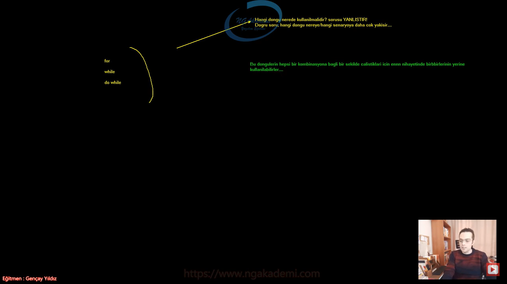
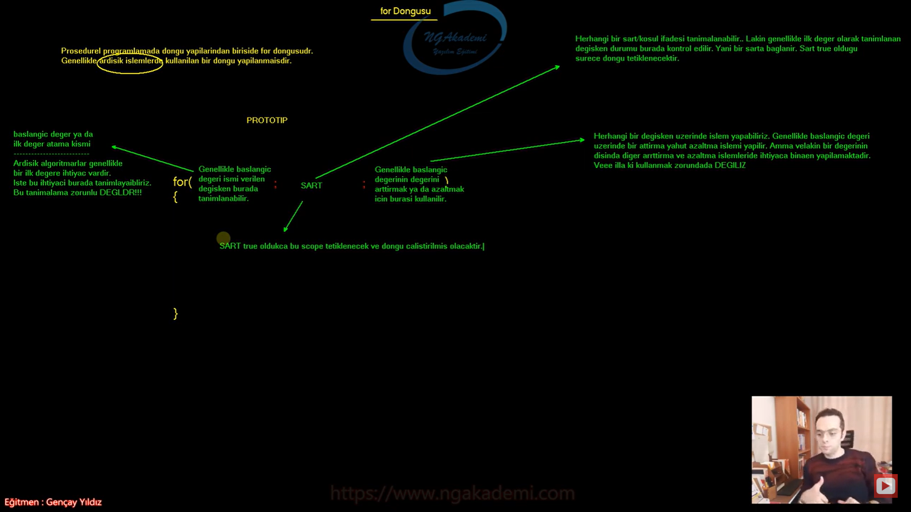
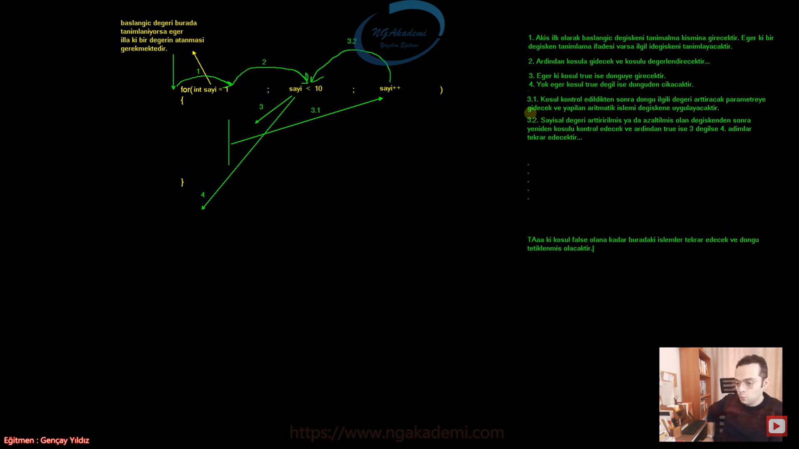
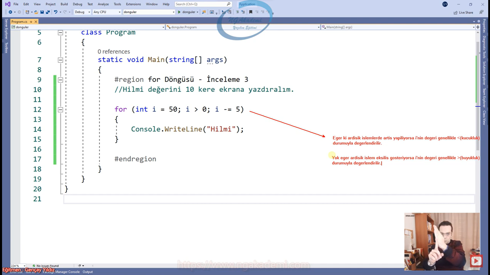
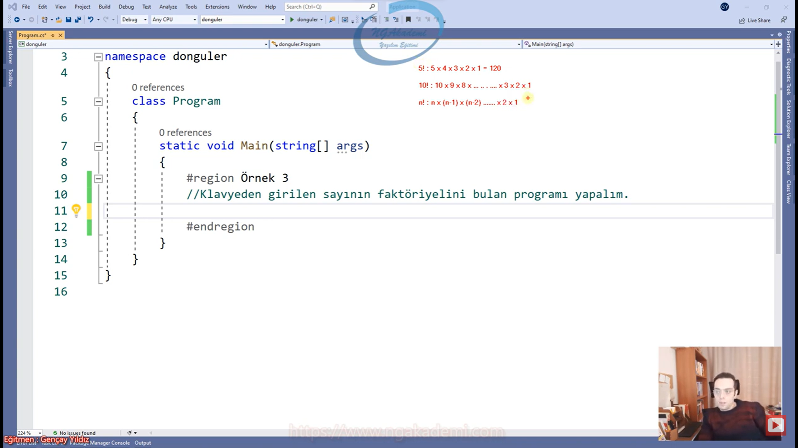
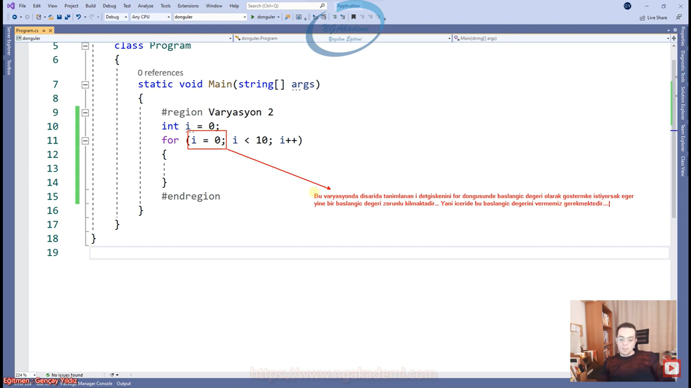
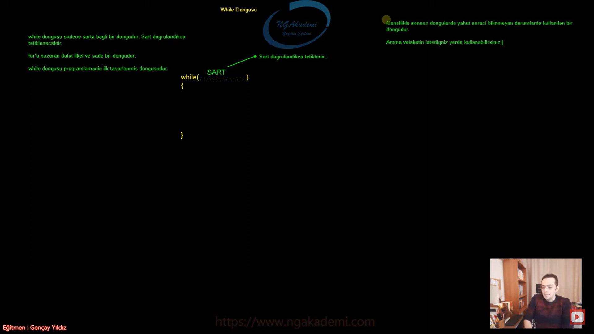
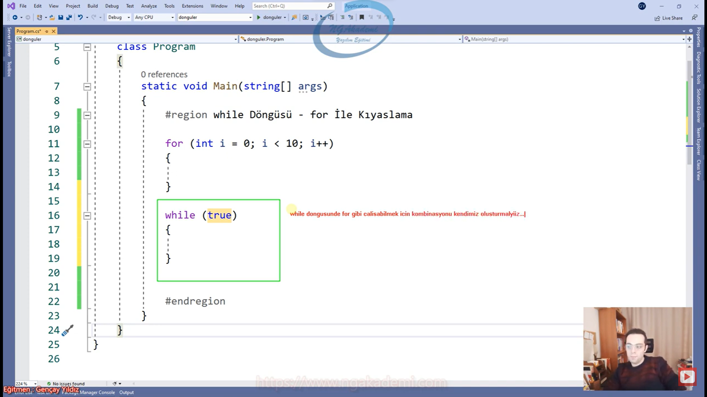
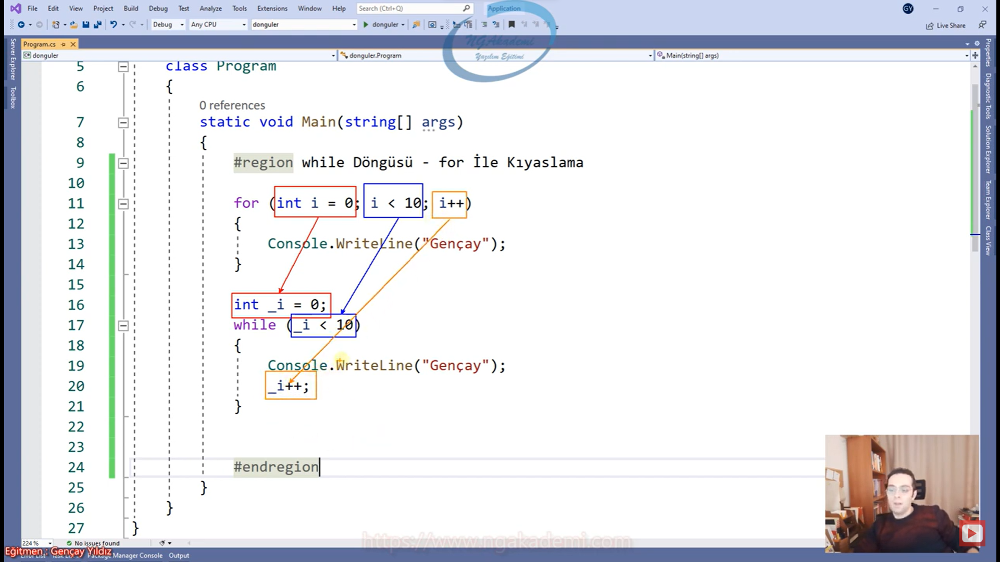
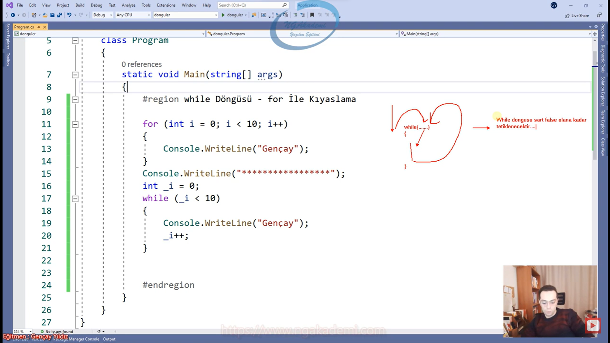

***
# 188) Programlamada Nedir Bu Döngüler? Ne Amaçla Kullanılır?
- Tekrar eden yapılanmaları tekrar eden kodlarımızı tekrar etmesi gereken programlarımızı bir koşula bağlı olarak yani kombinasyona bağlı olarak belirli sayıda tekrarlayabilen işleyebilen yapılara döngü diyoruz.

- Döngü dediğimiz yapı fiziksel olarak dönen ve üzerinde işlem yapılan yapılanma değil. Döngüden kastımız burada dönmesinden kasıt belirli bir koşula belirli bir kombinasyona bağlı olması koşul doğrulandıkça o kombinasyonun koşulu doğrulandıkça bu döngü kendi içerisindeki kodları tekrar eder tekrardan tetikler. Tekrardan tetikleme operasyonu neticesinde buna en güzel isim döngü olarak verilmiştir.

- Döngü yapısı programlamanın temelini teşkil eder. Temel yapıtaşlarından birisidir. Değişkenler nasıl yapıtaşlarından birisi `if else`, `switch`, akış kontrol mekanizmaları hata kontrol mekanizmaları bunlar programlama dilinin kendi fıtratında olan bir temel yapıtaşıysa dögü de aynı şekilde programlama dilinin dahilinde olan bir yapıtaşıdır. Hatta bir programlama dilinde döngü yoksa ki mümkün değil o programlama dilinde hiçbişey yapamazsınız.

- Siz yapısal olarak han daavranış olarak şöyle bir ihtiyaca sahip olabilirsiniz en temelde olayı değerlendirelim. Diyelim ki ekrana 10 defa kendi adımı yazdıracaksam 10 kez `Console.WriteLine("Musa UYUMAZ")` yazarak yazıdrabilirim. Şimdi bir yazılımcı probleme öyle ya da böyle çözüm bulur. Sıkıntı değil. İster 10 defa teker teker yazarsın biz buna ameleus felsefesi diyoruz. Ya da biz burada kodları tekrar etmektense bunlardan bir tanesini numune olarak alır derim ki 1'den 10'a kadar bir kombinasyon oluşturur ve ilk değerimi sayısal bir değeri birer birer arttırarak 10'dan küçük olduğu her bir durumda bu kodu tekrar ettiririm. Dolayısıyla tekrar eden bu tarz kodları döngülerle tek satırda tek tanımlama da belirli kombinasyona dair yani oradaki koşula bağlı bir şekilde istediğim kadar tetiklettirebilirim.

- İstediğin kadar tetiklettirebileceğin bir yapılanma varken bunu manuel bir şekilde yazmak doğru değildir. Döngüler yapısal olarak koşula bağlı belirli sayıda bu koşul sağlandığı sürece ilgili kodu tekrarlayan yapılardır. Ben öyle bir kombinasyon koyacağım ki ortaya benim istediğim sonucu bana verecek tek satırlık/konseptlik/algoritmalık işlem olacak. 

- Döngü dediğimiz yapılanma sizin kodlarınızdaki analitik çözümleri hızlı bir şekilde yapmanızı sağlayan yapılanmadır.

- Temelde 3 tane döngümüz vardır.
    * `for` döngüsü
    * `while` döngüsü
    * `do while` döngüsü

- `foreach` bir döngü değildir iterasyondur.

```C#
# Döngüler Nedir?
System.Console.WriteLine("Musa UYUMAZ");
System.Console.WriteLine("Musa UYUMAZ");
System.Console.WriteLine("Musa UYUMAZ");
System.Console.WriteLine("Musa UYUMAZ");
System.Console.WriteLine("Musa UYUMAZ");
System.Console.WriteLine("Musa UYUMAZ");
System.Console.WriteLine("Musa UYUMAZ");
System.Console.WriteLine("Musa UYUMAZ");
System.Console.WriteLine("Musa UYUMAZ");
System.Console.WriteLine("Musa UYUMAZ");   
```

***
# 189) ‘Hangi Döngü Nerede Kullanılır’ Yanlış Bir Sorudur! Doğru Soru ‘Hangi Döngü Nereye Yakışır’
- Yapısal olarak biz 3 tane döngü yapısını inceleyeceğiz.
    * `for` döngüsü
    * `while` döngüsü
    * `do while` döngüsü

- Hangi döngü nerede kullanılıyor sorusu yanlış bir sorudur. Çünkü hepsi bir kombinasyona bağlıdır. Hepsi bir mantığa göre çalışmakta o kombinasyondaki sonucun doğrulanmasına göre çalışan yapılanmalardır. Yani birini diğerinin yerine kullanabilirsin. Ya da sadece birini öğrenip diğerlerini öğrenmeyebilirsin. Programlama hayatın boyunca da onu kullanbilirsin.

- Döngülerde hepsi birbirlerinin yerine kullanılabiliyor. Ama bazı senaryolara bazı döngüler daha yatkındır. Örneğin ardışık bir sayım işlemi oluyorsa `for` döngüsü daha yatkındır daha çok yakışır. Ya da sonsuz bir yapılanma söz konusuysa `while` ya da `do while` daha çok yakışacaktır. `do while` ise böyle manevratik takla atacağımız belirli bir mantığa göre işleyen bir yapılanmadır. Hepsi birbirinin yerine oturabilmekte nihayetinde hepsinde bir temel bir mantık/kombinasyon işlemekte ama daha çok yakılan yönleri vardır ya da böyle yakışmayan yönleri vardır ama yakışmayan yerde de yine istediğin döngüyü kullanbilirsin.

- Hangi döngü nerede kullanılmalıdır? sorusu YANLIŞTIR! Doğru soru hangi döngü nereye/hangi senaryoya daha çok yakışır...

- Sen bir çözüm bulacan elindeki senaryoya göre bir tane döngüyü seçmen lazım rastgele gözün kapalı seçebilirsin sıkıntı yok ama hangisi daha çok yakışır sorusunu soracaksın cevabını arayacaksın.

- 1'den 100'e kadar sayman lazım bunun için `do while`de de yapabilirsin `while` de de yapabilirsina ama ardışık işlemlerde `for` döngüsünü kullanman bu senaryoda daha çok yakışacaktır.

- Sonsuz bir denetleme yapman lazım sonsuza giden bir durum yani sonunu bilemeyeceğimiz sonunu hiçbir zaman tahmin edemeyeceğimiz durumlarda işlem yapmam gerekiyorsa işte burada `for` ile de yapabilirsin `do while` ile de yapabilirsin. Ama `while`'ı daha çok severiz biz böyle durumlarda. Diğerleriyle yapamazsın anlamına gelmiyor.

- Bu döngülerin hepsi bir kombinasyona bağlı bir şekilde çalıştıkları için ennnn nihayetinde birbirlerinin yerine kullanılabilirler...
 
- Senaryoda istediğin dönügüyü seçebilirsin `for`la çözebildiğini `while`la da `do while`la da çözebilirsin. `do while`la çözdüğünü `for`la da çözebilirsin vs. 

- Nihayetinde bunlar senaryoya uygun iskeletler değil bunlar kombinasyonla sadece tetikleme yapıyor. Bir kombinasyonu var orada ona göre tetikleme yapıyorsa sen buna istediğini kullan. Madem ki bişey döndüreceksin madem ki belirli bir kod tetikleyeceksin istediğin döngüyü kullanbilirsin buradaki önemli olan hangisi daha çok elindeki senaryoya uygundur hangisi daha çok yakışıyor ona bakacaksın.

- Döngülere birbirinden farklı yapılar olarak bakmayacaksın. Birbirlerinden ayrılar farklılar tamam ama senaryo senaryo bakmayacaksın. Diyeceksin ki bu döngülerin hepsi aynı. Aynı şeyi öğreniyorum aynı işi yapabileceğim yapılanmayı öğreniyorum sadece bunlar senaryolara yakışabilecek durumları vardır onun dışında hepsinin kurallarını bildikten sonra kullanımlarıyla aynı sonuçları üretebilirim diyeceksin



***
# 190) For Döngüsünü İnceleyelim
- Prosedürel programlama da döngü yapılarından birisi de `for` döngüsüdür.

- Genellikle kombinasyonel olarak ardışık işlemlerde kullanılan bir döngü yapılanmasıdır

- Örneğin ben 1'den 100'e kadar yazdıracaksam 1'den 100'e kadar olan bütün sayıları birer birer, ikişer ikişer, beşer beşer, on yedişer on yedişer olsun ardışık nihayetinde bunlar için `for` döngüsünü kullanbilirsiniz.

- Ardışık bir işlem ardışık bir algoritma yapacaksanız ardışıklık üzerinden gidecekseniz algoritmanız üzerinde `for` döngüsünü kullanabilirsiniz.

- Prototip `for(int i = 0; i<10 ; i++) {}` Döngü de 3 tane parametremiz olacaktır. Bu parametreleri `;` ile ayırıyoruz.
    * ilk parametre de Genellikle başlangıç değeri ismi verilen değişken tanımlanabilir. İlk parametre olmasa da olur. `for` döngüsünde başlangıç değeri dediğimiz değişken eğer tanımalanacaksa burada tanımlanabilir. Bu birinci parametre kısmı başlangıç değeri ya da ilk değer denilen değişkeni tanımlamak için vardır ama illa kullanmak zorunda değilsin.
    * İkinci parametre de kombinasyonun şartını yazdığımız yer.
    * Üçüncü parametre de genellikle başlangıç değerinin değerini arttırmak ya da azaltmak için burası kullanılır.

- `for` döngüsü parametreleri zoraki yapmak zorundasın demiyor.

- `for` döngüsü belirli bir ardışık algoritmalarda kullanılan bir döngü. Ardışık algoritmalarda bir ardışık işleme başlayabilmek için ilk değere ihtiyacımız var.

- Genellikle for döngüsünde başlangıç değeri olarak `int` bir sayısal değer tanımlanır işte 0'dan ya da 1'den başlatılır ardından şart ilk değere yani başlangıç değerine bağlı bir şekilde şart kontrol edilir. Biz ilk değere yani başlangıç değerine bağlı şart yazmak zorunda da değiliz.

- Örneğin sen ilk değerde 1 değerini tanımladın `int i = 1` dedin şartta da diyorsun ki elimdeki bu i 10'dan küçük olduğu sürece/küçükse diyorsun. i değeri 10'dan küçük olduğu sürece tetiklenecek yani kendi scopeları içerisindeki kodlar tekrarlı bir şekilde işleyecektir.


- Başlangıç değer ya da ilk değer atama kısmı : Ardışık algoritmalalarda genellikle bir ilk değere ihtiyaç vardır İşte bu ihtiyacı burada tanımlayabiliriz. Amma velakin bu tanımlama zorunlu DEĞİLDİR!!!
    * Burası illa sayısal bir değer olmak zorunda değil. Sen bunu metinsel/char/boolean tanımlayabilirsin yani burası bir değişken tanımlama alanı.
    * Genellikle buradaki kombinasyonda kullanacağımız değişkeni tanımlarız.
    * Başlangıç değeri burada tanımlanıyorsa eğer illa ki bir değerin atanması gerekmektedir.

- Şart Kısmı : Herhangi bir şart koşul ifadesi tanımlanabilir. Lakin genellikle ilk döngü olarak tanımlanan değişken durumu burada kontrol edilir. Yani bir şarta bağlanır. Şart `true` olduğu sürece döngü tetiklenecektir. 
    * Genellikle biz başlangıç değeri olarak tanımlanan değişken üzerinden bir şart koyarız. Zorunlu değildir ama bu şekilde şart koyarız.
    * Şart `true` olduğu sürece döngü dönecektir. İçindeki kodları tetikleyecektir.

- Arttırma Kısmı : Herhangi bir değişken üzerinde işlem yapabiliriz. Genellikle bir başlangıç değeri üzerinde bir arttırma yahut azaltma işlemi yapılır. Amma velakin bir değerinin dışında diğer arttırma ve azaltma işlemleri de ihtiyaca binaen yapılabilmektedir. Veee illa ki kullanmak zorunda da değiliz. Arttırma ve azaltma operasyonlarını biz başka yerde yapabiliriz.
    * Genellikle başlangıç değerinin değeri arttırılır.

- Scope Kısmı : Şart `true` oldukça bu scope tetiklenecek ve döngü çalıştırılmış olacaktır.



- `for` döngüsünde parametleri tanımlamak zorunda değilsin. Peki neden oluşturuldu parametreler? Bir algoritma oluşturuyorsun o algoritma da kullanılan parametrelerin onun kalıbında olması kontrol açısından daha kolaylaştırıcıdır.

- Kombinasyonda yapacağın işlemin sadece o işleme özel parametrelerse bunların koordinasyonun yapıldığı noktanında tek bir merkezden yönetilmesi esasında bizim içinde bir avantajdır.

- Temelde biz bir başlangıç değeri tanımlarız ardından bir şart uygularız ilgili başlangıç değişkenine ve ardından ilgili başlangıç değişkeninin değerini arttırırız.

- Compiler kodları tek tek işlerken bir geliyor `for` ahanda `for` şimdi döngüye girecez. İlk olarak `for` u gördükten sonra;
    1. Akış ilk olarak başlangıç değişkeni tanımlama kısmına girecektir. Eğer ki bir değişken tanımlama ifadesi varsa ilgili değişkeni tanımlayacaktır.
    2. Ardından koşula gidecek ve koşulu değerlendirecektir.
    3. Eğer ki koşul `true` ise döngüye girecektir.
        * Koşul kontrol edildikten sonra döngü ilgili değeri arttıracak parametreye gidecek ve yapılan aritmetik işlemi değişkene uygulayacaktır.
        * Sayısal değeri arttırılmış ya da azaltılmış yani değiştirilmiş/değiştirilmemiş olan değişkenden sonra yeniden koşulu kontrol edecek ve ardından `true` ise 3 değilse 4. adımlar tekrar edecektir.
    4. Yok eğer koşul `true` değil ise döngüden çıkacaktır.

- I. adıma bir kereye mahsus girecektir `for` döngüsünde 2. ve 3. adımlar kendi aralarında durmadan paslaşacaktır. Yani ilk önce `for` döngüsüne girdiğinde 1. adıma gidecek değişkeni tanımlayacak 2. adıma gidecek şartı kontrol edecek ardından eğer `true` ise döngüye girecek değilse döngüden çıkacak. Döngüye girerse eğer işlemini bitirdikten sonra değişkenin değerinde değişiklik yapmaya gidecek değeri değiştirecek ya da değiştirmeyecek daha sonra koşula geri dönecek koşul eğer hala sağlanıyorsa bir daha döngüye girecek daha sonra geri bir daha değişkenin değerinde değişiklik yapmaya gidecek daha sonra koşula tekrar gidecek vs şeklinde paslaşma yapacak ta ki koşul `false` olana kadar buradaki işlemler tekrar edecek ve döngü tetiklenmiş olacaktır.

- Yapısal olarak `for` döngüsü bir kombinasyona bir ardışık operasyonlarda kullanılabilirliğe daha yatkın bir döngüdür. Nihayetinde burada arttırma azaltma işlemlerini çok fazla yaparız. O yüzden ardışık operasyonlarda çok kullanırız diye nitelendiriyoruz.



***
# 191) For Döngüsü Kritik Yapalım 1
- Başlangıç değeri her daim tanımlanmak zorunda değildir ama tanımlıyorsanız eğer bir değer atanmak zorundadır.

- Şartımız herhangi bir şart olabilir mesela `true` şimdi şart kısmı normalde şart dediğimiz bir kıyaslamadır kıyaslama neticesinde sonuç `bool` dönecektir `true` ya da `false` eğer sen direkt gelir buraya `true` yazarsan bu döngü hangi değer olursa olsun farketmiyor sürekli sonsuza kadar şartı koşulu `true` olacağından dolayı sonsuz döngü olacaktır.

- Compiler kodun akışında `for` döngüsünü gördüğü zaman öncelikle başlangıç değerini ya da ilk değer dediğimiz değişkeni tanımlama alanına gelecektir. Varsa ilgili değişken tanımlayacaktır tanımladıktan sonra koşula bakacaktır. Koşul `true` olduğu sürece döngüye girecektir. Yani scope içine girecektir. Daha sonrasında değişken değerini değiştime alanına gelecek daha sonrasında ise tekrar koşula bakacaktır.  Koşul `true` olduğu sürece yine döngüye girecektir. Böyle böyle koşul `false` olana kadar devam edecek koşul `false` olduğunda ise döngüden çıkacaktır.

- Ardışık operasyonlarda geliştirilen algoritmalarda `for` döngüsü daha efektiftir. Çünkü hızlı bir şekilde ardışık yapılanmayı sana verecektir

```C#
#for Döngüsü
for (int i = 1; i < 10; i++)
{
    System.Console.WriteLine("Musa UYUMAZ");
}
```

***
# 192) For Döngüsü Kritik Yapalım 2
- Başlangıç değişkenine verilen değer ne ise ona göre bundan sonraki mantıksal kombinasyon şekillenecek.

- `for` döngüsündeki esas mantıktır. `for` döngüsünün parantezleri içerisindeki formülü çözdüğünüz zaman ilgili operasyon o formüle göre tetiklenecektir.

- Biz mümkün mertebe 0'lardan 1'lerden başlatıp olayı ele almayı severiz. Çünkü hesaplaması kolay oluyor.

- Matematik niye var? Minimize edilmiş rakamlarla siz devasa major yapılanmaları göresiniz diye var.

- `for` döngüsündeki mantığı diğer döngülerde de aslında aynı `for` döngüsündeki mantığı kurduğunuz zaman operasyon bitiyor.

- `for` döngüsünde kombinasyona odaklanacaksınız çünkü kombinasyon önemli.

```C#
#for Döngüsü - İnceleme 2
//Serhat değerini 10 kere ekrana yazdıralım.
#Ameleus
System.Console.WriteLine("Serhat");
System.Console.WriteLine("Serhat");
System.Console.WriteLine("Serhat");
System.Console.WriteLine("Serhat");
System.Console.WriteLine("Serhat");
System.Console.WriteLine("Serhat");
System.Console.WriteLine("Serhat");
System.Console.WriteLine("Serhat");
System.Console.WriteLine("Serhat");
System.Console.WriteLine("Serhat");

#Döngü ile
for (int i = 0; i < 50; i += 5)
{
    System.Console.WriteLine("Serhat");
}
```

***
# 193) For Döngüsü Kritik Yapalım 3
- Bir `for` döngüsünde illa hep artış yapmak zorunda değilsiniz. Algoritmayı tersine de alabilirsiniz.

- `for` döngüsündeki kombinasyona ne kadar hakim olursan ne kadar oradaki kombinasyonu çözebilecek analitiğe sahip olursan döngüyle falan problemin kalmıyor.

- Eğer ki ardışık işlemlerde artış yapılıyorsa i'nin değeri genellikle `<`(Küçüklük) durumuyla değerlendirilir. Yani sen burada küçüklüğüne bakıyorsun çünkü o artıyordur bişeyden küçük olduğu sürece oradaki şart doğrulanacaktır. O küçüklük bir gün aştığı zaman yani küçük olmadığı zmaan oradaki döngüden çıkacaktır.

- Yok eğer ardışık işlem eksiliş gösteriyorsa i'nin değeri genellikle `>`(Büyüklük) durumuyla değerlendirilir. Nihayetinde orada büyüklük durumu yani orada i büyüktür belirli bir eşiğe kadar gelecektir bundan büyük oldukça tetiklenecektir. Bu eşiğe eşit ya da küçük olduğu durumlarda tetiklenmeyecektir. 

```C#
#for Döngüsü - İnceleme 3
//Serhat değerini 10 kere ekrana yazdıralım.
for (int i = 50; i > 0; i -= 5)
{
    System.Console.WriteLine("Serhat");
}
```



***
# 194) For Döngüsü Örnek Yapalım 1
- Hangi senaryo da hangisini kullanmalıyızdan ziyade hangi senaryoya hangisi daha çok yakışır diye sorulduğunda eğer ki bir ardışık operasyon varsa `for` döngüsü direkt aklımıza gelecek.

- Benden problem ne istiyorsa benim onu karşılayabilmem lazım.

- İlla değerler sizin için önemli değildir aslında kombinasyon önemli.

- Mümkün mertebe analitik çözüm getirmeye çalışıyorsunuz.

- Kompleksliği analitiklik olarak algılayan yazılımcılar var bu böyle değildir alakası da yoktur. Analitiklik basitlik demektir. Ne kadar basit çözebilirseniz. Ama basitlik profesyonel olmayan kod anlamına gelmiyor Analitiklik, Basitlik, Profesyonellik bunlar birbirine bağlı yapılanmalar. Öbür türlü komplekslik dışarıda bambaşka yapılanma işte komplekslik istemediğimiz sonuç zaten Analitik yazılan Basit yazılan kod profesyoneldir. Dolayısıyla her ikisinide kapsar. Yani kompleks olmaması gerekiyor. Onun için kompleks yapacağım yazdığım kodu daha değerli göstereceğim diye derdiniz o olursa biraz saçmalamış olursunuz. Mümkün mertebe en doğru hamlelerle en doğru verilerle çalışmaya özen göstereceğiz

```C#
#Örnek 1
//1'den 10'a ladar olan sayıları alt alta ekrana yazdıralım.
#1. Çözüm
for (int i = 1; i <= 10; i++)
{
    System.Console.WriteLine(i);
}

#2. Çözüm
for (int i = 50; i < 60; i++)
{
    System.Console.WriteLine(i - 49);
}
```

***
# 195) For Döngüsü Örnek Yapalım 2
- Herşeyi sen bilemzsin problem sana vermeli. Problem sana vermeli. Problem ne istediğini sana vermediği sürece o da ayrı bir problem.

- Bir ardışıklık söz konusuysa aklına `for` döngüsü gelmeli. `while`lada `do while`lada yapabilirsin. Ama `for` döngüsü bu senaryoya en yatkını.

- Senaryo => 1 ile 40(Dahil) arasındaki çift sayıları toplayarak sonucu ekranda gösterelim.
    * `for (int i = 1; i <= 40; i++)` Bu kombinasyon her bir turda 40 ile 1 arasındaki bütün değerleri i değişkeni üzerinden bana veremeyecek mi verecek.
        + Burada başlangıç değerine ve bitiş değerine sen karar vermeyeceksin yazılım karar verecek.
    * Bir sayının çift olma durumunu ilgili sayıyı 2'ye bölerek öğrenebilirim.
    * İlgili sayıyı ikiye böldükten sonra kalanın 0 olup olmamasını nasıl değerlendiririm? Burada bir karşılaştırma değerlendirme var değil mi yani akış kontrol mekanizmaları.
    * `for` içerisinde her şeyi kullanabilirsin. `if`, `switch`, `try catch` vs.
    * Gerek olmayan bişeyi yazmayın. Gördüğün algoritmada şartla bakma. Algoritmaya mantıkla bak akılla bak.

```C#
#Örnek 1
//1 ile 40(Dahil) arasındaki çift sayıları toplayarak sonucu ekranda gösterelim.
int toplamSonuc = 0;
for (int i = 1; i <= 40; i++)
{
    if (i % 2 == 0)
    {
        toplamSonuc += i;
    }
}
#İkinci Çözüm
int toplamSonuc = 0;
for (int i = 0; i <= 40; i += 2)
{
    toplamSonuc += i;
}
System.Console.WriteLine("Toplam Sonuç : " + toplamSonuc);
```

***
# 196) For Döngüsü Örnek Yapalım 3



- Senaryo Klavyeden girilen sayının faktöriyelini bulan programı yapalım.
    * Birinci Çözüm olarak 1'den başlayıp sayıya kadar olan sayıları çarpıp elde edebiliriz.
    * İkinci Çözüm olarak sayıdan'dan başlayıp 1'e kadar olan sayıları çarpıp elde edebiliriz.

- Bir döngünün içerisindeki aritmetik işlemleri toplayan, çarpımların sonuçlarını toplayan kendisinde tutan sayısal ifadeler döngünün dışında tanımlanır. Zaten bu algoritmanın gereğidir. İçeride durmadan değeri ezmektense dışarıda tanımlanmış bir değişkende ilgili değerleri toplamayı yeğleriz.

```C#
#Örnek 3
//Klavyeden girilen sayının faktöriyelini bulan programı yapalım.
System.Console.WriteLine("Faktöriyelini alacağımız sayıyı girelim.");
int sayi = int.Parse(Console.ReadLine());
int faktoriyel = 1;

#1. Çözüm
for (int i = 1; i <= sayi; i++)
{
    faktoriyel *= i;
}
System.Console.WriteLine("Faktöriyel : " + faktoriyel);

#2. Çözüm
int faktoriyel = 1;
string sonuc = "";
for (int i = sayi; i > 0; i--)
{
    faktoriyel *= i;
    sonuc += i + (i == 1 ? " = " : " x ");
    if (i == 1)
        sonuc += i + " = ";
    else
        sonuc += i + " x ";
}
System.Console.WriteLine("Faktöriyel : " + sonuc + faktoriyel);
```

***
# 197) For Döngüsü Varyasyonları 1
- İlk varyasyonu `for(int i = 0; i < 10; i++) {}`
    * İlk parametrede bir başlangıç değeri tanımlarız.
    * İkinci parametrede başlangıç değerine bağlı bir şart oluşturuyoruz genellikle ama illaki bağlı olmak zorunda değil.
    * Üçüncü parametrede ise başlangıç değerini arttırdığımız operasyonunu gerçekleştirdiğimiz alanı tanımlıyoruz.

- Bu varyasyonda hiçbişey zorunlu değil istersen başlangıç değerini tanımla tanımldaıktan sonra şartı bambaşka bişey üstünden ver illa başlangıç değeri üzerinden vermek zorunda değilsin. Herhangi bir değişkenin değerini burada arttırıp azaltabilirsin. İlla ki başlangıç değerini arttırıp azaltmak zorunda değilsin.

- Burada amaç Bir döngüde operasyonel olarak kullanılan tüm parametrelerin tek bir çatı altında toplanması hani bakınca tek bir seferde görebilmektir. Zaten buradaki parametrelerin hiçbiri zorunlu değil.

```C#
#Varyasyonlar
for (int i = 0; i < 10; i++)
{
    
}
```

***
# 198) For Döngüsü Varyasyonları 2
- Başlangıç değerini tanımlamadan direkt dışarıda da tanımlayabilmektesiniz. Başlangıç değerini dışarıda tanımladıktan sonra `for` döngüsünde Başlangıç parametresini boş geçip ardından koşula odaklı bir şekilde değerinizi yazıp başlangıç değerini burada yönetiyor olabilirsiniz.

- Değişkenin değerinin dışarı da tanımlandığı ve içeriye herhangi bir şekilde tanımlama yapılmaksızın direkt koşullarda ve arttırma azaltma noktasında kullanıldığı bir varyasyon.

```C#
#Varyasyon 2
int i = 0;
for (; i < 10; i++)
{
    
}
```

***
# 199) For Döngüsü Varyasyonları 3
- Başlangıç değerinin dışarıda tanımlayarak gene içeride referans gösterebiliyorsunuz. Amma velakin burada bişeye dikkat etmemiz gerekiyor her ne kadar dışarıda tanımlanısada içeride hata verecektir. Çünkü yine başlangıç değeri tekrardan bir değer ataması yapılmak zorunda.

- Dışarıda tanımlıyorsan bir değişkeni içeriye verdiğin taktirde içeride bir daha buna bir değişken başlangıç değeri ataman gerekiyor diye uyarmaktadır.

- Bu varyasyonda dışarıda tanımlanan değişkeni `for` döngüsünde başlangıç değeri olarak göstermek istiyorsak eğer yine bu değişkene bir başlangıç değeri atamamızı zorunlu kılmaktadır... Yani içeride bu başlangıç değerini vermemiz gerekmektedir.... Aksi taktirde derlenmeyecektir kodumuz.

```C#
#Varyasyon 3
int i = 0;
for (i = 0; i < 10; i++)
{
}
```



***
# 200) For Döngüsü Varyasyonları 4
- `for ( ;i < 10;)`
- `for` döngüsünde başlangıç değerini dışarıda tanımlayabiliyorduk aynı şekilde başlangıç değerinin arttırıp azaltma işlemini de yani değişim işlemini de burada yapmak zorunda değiliz. buradan da kaldırıp boş geçebiliriz. Eğer burayı da boş geçiyorsak arttırıp azaltma işlemini de yani değişim işlemini içeride yapabiliriz. Ya da duruma göre uygun bir noktada i'yi/başlngıç değerini arttırıp azaltmanız gerekecektir.

- Varyasyon olarak dışarıda tanımlayıp ne buraya bildirmek zorundasınız ne de burada arttırmak zorundasın.

```C#
#Varyasyon 4
int i = 0;
for ( ;i < 10;)
{   
    i++;
}
```

***
# 201) For Döngüsü Varyasyonları 5
- Şart kısmı illaki başlangıç değerine bağlı olmak zorunda değildir.

- Şart kısmını genellikle başlangıç değerine bağlı olarak kullanırız ama her zaman değil.

- Buradaki parametrelerde illaki normal yüzeysel tanımlar yapılan içeriklerde olduğu gibi illa başlangıç değerin olacak illa şartın ona göre olacak illa arttırman olacak vs. Bunlar olmak zorunda değil hepsi opsiyonel hepsi senin iradene bağlı ama genellikle biz başlangıç değerini tanımlar ona bağlı bir şekilde koşul oluştururuz.

```C#
#Varyasyon 5
string adi = "Serhat";
for (int i = 0; adi == "ahmet"; i++)
{
}

int a = 10;
for (int i = 0; a != i * 2; i++)
{
    Console.WriteLine("Musa");
}
```

***
# 202) For Döngüsü Varyasyonları 6
- Başlangıç değerini vermek zorunda değiliz. Aynı zmaanda koşulu da vermek zorunda değiliz. Hatta arttırma azaltma miktarını da bildirmek zorunda değiliz. Bu şekilde bir `for` döngüsü tanımlanabilir.

- Bu döngü sonsuz döngüdür. Scope'undaki kodlar durmadan işler.

- İçerisinde bulunan ilgili kodları sonsuza kadar ebediyyen yazdıracaktır. 

```C#
#Varyasyon 6
for (; ; )
{
    System.Console.WriteLine("Musa");
}
```

***
# 203) For Döngüsü Varyasyonları 7
- Bir şart belirtiyorsanz bu şarta uygun bir şekilde hareket edecektir. Amma velakin siz başlangıcı ya da artış azalış miktarını belirttiniz ama şartı belirtmiyorsanız bu yine bir sonsuz döngüye alamet olacaktır.

```C#
#Varyasyon 7
for (int i = 0; ; i++)
{
    System.Console.WriteLine("Musa");
}
```

***
# 204) For Döngüsü Varyasyonları 8
- `for` döngüsünün başlangıç değerini tanımlama kısmında birden fazla değişken tanımlaması yapabilmekteyiz. 

- Nihayetinde bakarsanız eğer başlangıç kısmı bir değişken tanımlama kısmı ve burada bir değişken tanımlanmakta dolayısıyla biz , diyerek birden fazla değişken tanımlaması yapabilmekteyim.

- Eğer ki `for` içerisinde birden fazla değişken ihtiyacınız varsa tabikide bu değişkeni dışarıda tanımlayabilirsiniz. Tabiki ezilme pahasına da olsa içeride de tanımlayabilirsiniz ama hani şöyle kalıba baktığında direkt göreyim istiyorsan başlangıç kısmında normal değişken tanımlar gibi tanımlayabiliyorsunuz.

- Aynı şekilde bu değişkene `for` döngüsü içinde erişerek kullanabiliyoruz. Gerek şart kısmında gerek artış kısmında gerekse scope kısmında.

- Bu yapılanmaya baktığımızda `,` ile sen bir değişken daha oluşturdun hem şarta da ekleyebiliyorsun. Şarta normal mantıksal yapılanmayla ekledik. Artış kısmında da `,` ile  diğer değişkeninde değerinde artış azalış yani değişiklik sağlayabiliyoruz.

- Bu şekilde birden fazla tanımlama yapabiliyorsan yine bu şekilde birden fazlasınında değerini arttırıp azaltabilirsin.

- Birden fazla değişken durumunda `,` ile bunları arttırma azaltma kısmında ayırdığımıza dikkatinizi çekerim. 

- İçeri de ise her ikisine de erişim sağlayabiliyoruz.

```C#
#Varyasyon 8
for (int i = 0, i2 = 0; i < 10 && i2 < 5; i++, i2++)
{
    System.Console.WriteLine(i);
    System.Console.WriteLine(i2);
}
```

***
# 205) While Döngüsünü İnceleyelim
- `while` döngüsü `for` döngüsüne bakarak daha sade daha ilkel ilk varyasyonlardan biri gibi.

- Hiçbirşeyi yok sadece bir scope'u ve parantezi var. `while(........) {}`

- `while` döngüsünün parantezinde sadece Şart var ne bir başlangıç değeri var ne bir başka arttırma azaltma noktası var.

- `while` döngüsü şart doğrulandıkça tetiklenir...

- Şart doğrulandığı sürece `while` döngüsü tetiklenecektir.

- `while` döngüsü sadece şarta bağlı bir döngüdür. Şart doğrulandıkça tetiklenecektir.

- `for`a nazaran daha ilkel ve sade bir döngüdür.

- `while` döngüsü programlamanın ilk tasarlanmış döngüsüdür.

- `for` olmayan dil vardır ama `while` döngüsü tüm dillerde vardır. Hiçbir döngü yoksa `while` döngüsü varsa bütün işlemlerini bu döngüyle yapabilirsin. Keza `for` döngüsüyle `while` döngüsüyle ne yapabiliyorsan onuda yapabiliyorsun. 

- Genellikle sonsuz döngülerde yahut süreci bilinmeyen durumlarda kullanılan bir döngüdür. Amma velakin istediğiniz yerde kullanabilirsiniz.

- `for` döngüsünü nerelerde kullandıysan `while` döngüsünü de birebir o noktalarda kullanabilmektesin.

 

***
# 206) While Döngüsünü For İle Kıyaslayalım 
- `for (int i = 0; i < 10; i++) {}` `for` döngüsünün genel iskeleti bu şekilde bir başlangıç değişkenimiz var bir şartımız var ve ilgili değişkenin artış azalış miktarını belirttiğimiz bir operasyonumuz var.

- `while (true){}` `while` döngüsü ise görüldüğü üzere sadece bir şarttan ibaret. Yani buraya sadece şart yazıyoruz.

- `while` döngüsünde `for` gibi çalışmak için kombinasyonu kendimiz oluşturmalıyız.

 

- Kombinasyonu oluşturabilmem için `while` döngüsünün parantezleri içinde parametreleri yok yani bir başlangıç değeri tanımlayabileceğim bir artış azalış miktarını belirleyebileceğim bir alan yok. Dolayısıyla `while` döngüsünde başlangıç değerimi dışarıda tanımlıyorum devamında ise şartım neyse parantez içine bunu yazıyorum daha sonrasında ise artış miktarını her bir döngü döndüğünde kendi içerisinde değeri arttırsın. Yani scope içine yazıyorum. 

 

- Compiler yukarıdan gelecek bakacak `while` döngüsü diyecek ki şarta bakacak eğer ki `true` ise döngüye girecek. Diyelim ki işlemini bitirdi bitirdikten sonra yine şarta bakacak `true` ise yine döngüye girecek yine şarta bakacak döngüye girecek şarta bakacak ta kii `while` döngüsü şart `false` olana kadar tetiklenecektir.

 

- Yapısal olarak `for`dan farkı vardır ama işleyiş olarak mantığı kurduğunuz an hiçbir fark olmayacaktır. Hani sonuçta aynı sonuçları elde edebilirsiniz.

```C#
#while Döngüsü - for İle Kıyaslama
        
for (int i = 0; i < 10; i++)
{
    System.Console.WriteLine("Musa");
}
System.Console.WriteLine("**********************************");

int _i = 0;
while (_i < 10)
{
    System.Console.WriteLine("Musa");
    _i++;
}
```

***
# 207) While Döngüsü Kritik Yapalım 1
- Senaryo :Ekrana 10 kere "Merhaba Dünya" yazdıran bir program yazalım

- 1'den 10'a kadar saydırmak belki `for` ile daha kolay olabilir amma velakin operasyonel olarak `while`da nasıl yapılır buna bakacağız.

- `while` döngüsü şarta bağlı bir şekilde içindeki kodu yazdıran bir döngü. İçindeki kodu şart `true` olduğu sürece çalıştıracaktır/tetikleyecektir.

- Bu senaryoya göre yapacağımız manevralar `for` dakiyle aynı mantıkta olacaktır. Yani benim süreci takip edebileceğim kontrol edebileceğim bir sayısal değer oluşturmam gerekiyor. Ardından buna uygun bir kombinasyonsa koşul yapıyorum. Ve ardından tabikide sayısal değeri attırmam gerekiyor ki sonsuz döngüye girmesin.

```C#
#İnceleme 1
//Ekrana 10 kere "Merhaba Dünya" yazdıran bir program yazalım
int i = 1;
while (i <= 10)
{
    i++;
    System.Console.WriteLine("Merhaba Dünya");
}
```