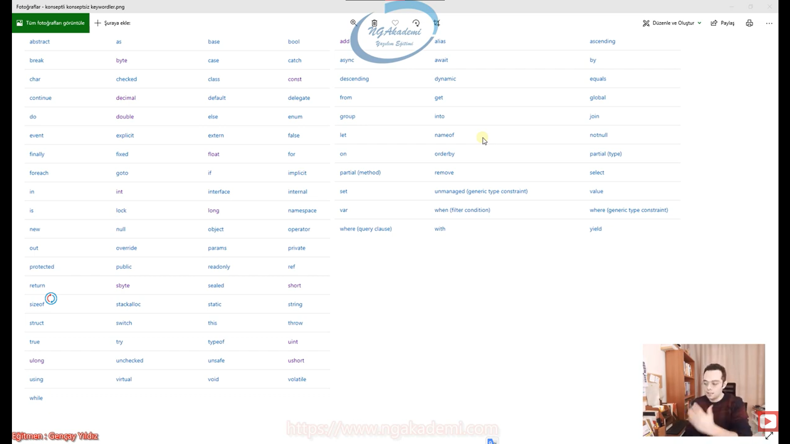
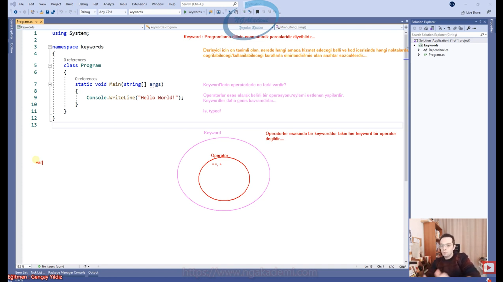

***
# 223) Gelin Koda Bakış Açımızı Genişletelim
- Yazılım yazarken biz yazılımda belirli keywordler kullanıyoruz. Temelde bir hesap makinesi de yapsan uzaya füze de göndersen kullanman gereken keywordlerdir.

- Keyword dediğimiz yapılanma derleyici/compiler için önceden tanımlanmış ve özel anlamlara sahip olan anahtar sözcüklerdir. Belirli işlemleri belirli operasyonları gerçekleştirmemizi sağlayan operasyonel yapılanmalardır. Nihayetinde biz keywordler sayesinde kodlarımızı inşa ediyoruz.

- Örneğin `byte` keywordü değişken tanımlarken kullandığımız bir türdür. `for` döngülerde kullandığımız bir keyworddü. `while` döngülerde kullanıyorduk. `try` hata kontrol mekanizmalarında, operatörlerimiz var `is` OOP'de göreceğiz `new`

- Belirli keywordler var konseptli belirli keywordler konseptsiz kullanılır.

- Bir keywordü öğrenirken altını doldurarak öğrenmeliyiz. Yani konusuyla beraber, senaryosuyla beraber, kritikleriyle beraber ilgili keywordü öğrenmeliyiz.

- Keywordlerden kimisi temel düzeyi ilgilendirirken kimisi ileri düzey programlamada mantığa göre işlem yapan keyworddür. Örneğin `byte` değiken tanımlarken kullanılırken `yield` ise ileri düzey programlama da kullanılır. `int`, `for` temel prosedürel programlamada kullanılırken `add` keywordü ileri düzeyde delegate'lerde kullanıyoruz.



***
# 224) Keyword Nedir? - Operatörden Farkı Nedir?
- Keyword dediğimiz yapılanma programlamada programlama dilinin temel yapıtaşlarıdır. En atomik parçalarıdır.

- Keyword : Programlama dilinin ennnn atomik parçalarıdır diyebiliriz.

- Yani sen keywordler üzerinden programlama dilini şekillendiriyorsun.

- Keywordler atomik düzeyde önceden tanımlanmış olan metinsel yapılanmalardır. 

- Normalde assembly dilinde olan bir yapılanma değil bir keyword bir anahtar sözcük sözcük olduğundan dolayı metinsel diyoruz. Ama arka planda bunun mahiyeti compiler/derleyici açısından bir ön tanımlı nerede hangi amaca hizmet edeceği belli olan bir operasyonel yapılanmadır. Yani dilin atomik yapısı onu oraya koyduğunda bir işleme yarıyor.

- Derleyici için ön tanımlı olan, nerede hangi amaca hizmet edeceği belli ve kod içerisinde hangi noktalarda çağrılabileceği/kullanılabileceği kurallarla sınırlandırılmış olan anahtar sözcüklerdir...

- Hem atomiktirler hem de derleyici için ön tanımlıdırlar. Nerede hangi amaca hizmet edeceği bellidir. Kod içerisinde nerelerde kullanabileceğiniz çağırabileceğiniz bellidir. Bunların belirli kuralları vardır. Sınırlandırılmış yapılanmalardır. Örneğin `class` bir metodun içerisinde çağrılamaz. Metot dediğimiz yapılanma `class` dışında `namespace` içerisinde tanımlanamaz. Ya da `string` ifadesi değişkenlerin önüne gelebilir ama yanına gelemez ya da `class`ın yanına gelemez vs. Bunun gibi nerelerde kullanabileceği bellidir sınırlandırılmıştır.

- Operatörler essas olarak belirli bir operasyonu/eylemi üstlenen yapılardır. Halbuki keywordler daha geniş kavramdırlar.

- Bazen bir keyword bir operatörü temsil edebilir. `is` keywordünde olduğu gibi ya da `typeof` keywordünde olduğu gibi. `typeof` bir keyworddür ama operatör işlemi yapan bir keyworddür. Her keyword operatör değildir. örneğin `static`te olduğu gibi `class`ta olduğu gibi.
 
- Direkt bir eyleme/fiiliyata odaklanan bir yapılanma varsa bu zaten bir operatördür. Ama yoksa örneğin `static`te `class`ta olduğu gibi daha farklı amaçlara hizmet ediyorlarsa eylem değil de daha farklı bir modellemeye falan bunun gibi yapılanmalara hizmet ediyorsa bunlar artık keywordlerdir.

- Operatörler keywordlerin kapsadığı bir yapılanmadır. Her keyword bir operatör değildir ama her operatör esasında bir keyword olarak kullanılabilir. Sembolik operatörler içinde söyleyebiliriz bunları. `==`, `+` operatörüde nihayetinde dilin bir atomik parçası bir işlemi yürüten bir keywordüdür diyebiliriz. Sadece metinsel değilde sembolik bir keyworddür.

- Operatörler esasında bir keyworddür Lakin her keyword bir operatör değildir....

- Kodlarımızı inşa ederken bir konu/mesele var bu konuyu hem öğreniyorsun hem gerçekleştiriyorsun. Burada kullanacağın keywordleri bilmen lazım.

- Keywordleri nerelerde ne amaçla kullandığımızı bilmemiz kesinlikle gerekecektir. 

- Örneğin bizim bir `var` diye keywordümüz var. `var` keywordü hem pattern matchinglerde farklı bir operasyona yarıyor. Normal değişken seviyesinde bambaşka bir operasyona yarıyor. `var` keywordü değişken seviyesinde compile/derleme zamanında atanan değerin türüne bürünüyordu pattern matchingde ise runtime'de bürünüyordu.



***
# 225) Konseptli Keywordler Genel Bakış
- Yapısal olarak tek başına kullanılmayan bir bütün olarak konsepte bağlı şekilde kullanılan keywordlerdir.

- Örneğin `namespace` keywordü tek başına kullandığınızda herhangi bir anlam ifade etmiyor. Amma velakin yanına bir isim verip scope'larını açtığınız zamana yani konseptlerini göz önünde bulundurursanız artık hangi anlamı ifade ediyorsa o şekilde kullanılabiliyor. `class`ta aynı şekilde konseptli bir keyworddür. Tek başına hiçbir yerde hiçbir anlam ifade etmez ama sen `class`ı bir isim vererek scopelarıyla açarsan bu konsepti kullandığın taktirde anlam ifade edecektir. Yani derleyici açısından konsepti uygun bir şekilde yorumlanacaktır. `for` keywordü tek başına bir anlam ifade etmezken kullandığımız konseptiyle beraber bir anlam ifade etmektedir. Keywordün konseptine göre mantık işler. Mesela `while` keywordü. `while` keywordü de yanındaki şarta göre scope'unu tetikliyor. 
 
- Bir keyword tek başına bir anlam ifade etmiyor. Yani keyword oradaki yapacağı eylemi/operasyonel işlemi nasıl şekillendireceğini hangi davranışı göstereceğini kendi kalıbı üzerinden tanımlanmış dolayısıyla bu kalıbını kullanmamız gerekiyor.

- `do while` keywordü programlamada `do` yu kullanabileceğiniz başka herhangi bir yer yok. Benzer mantıkla `while`ıda tek başına kullanamıyorsunuz. `do while` `do` ve `while` keywordleriyle kullanılmak zorundadır.

- Bazı keywordler vardır. Başka operasyonların içerisinde sadece onlara dahili şekilde kullanılırlar. Örneğin `delegate` dediğimiz temsilcilerimiz bizim milletvekilleri nasıl bizim temsilcilerimiz programatik metotlarımızı temsil eden `delegate` dediğimiz yapılanmaların içerisinde `add` keywordünü kullanacağız. Bir metot eklerken kullanabildiğimiz bir keyword. O keywordü orada kullanırken sadece orada kullanabildiğimizin farkına varacaksınız. Bir keyworddür ama bir kalıba bir özel bir operasyona özel bir keyworddür.

- Konseptli keywordlerde dikkat edilmesi gereken mesele konseptli keywordlerin konseptine hakim olmak. Bir keywordün konseptine hakim olabilmek için de editörün size sağlamış olduğu kolaylaştırıcılıklardan uzaklaşmanız ilgili keywordü kullanırken manuel bir şekilde elinizle yazmanızı kesinlikle tavsiye ediyoruz. 

- Bir keywordün konseptine ne kadar hakimseniz ilgili keywordün mahiyetine de hakim olursunuz. Nihayetinde bir yapıya hakim olmak demek o yapının işleyiş mantığını da daha hızlı bir şekilde kavramanız anlamına geliyor. Örneğin askere gittin askerde sana bir silah verdiler ama neyin neye yaradığını söylemediler. Şimdi acil bir durumda sen bu silahı nasıl kullanacağını bilemezsin çünkü mantığını bilmiyorsun. çalışma yapısını bilmiyorsun yapısını bilmiyorsun davranışını bilmiyorsun dolayısıyla eğer ki sen gerçek bir asker olacaksan elindeki silahına nasıl çalıştığını bilmen lazım. Yapısını bilmen lazım gözün kapalı takıp çıkarabiliyor olman lazım vs. Aynı şekilde yazılımda da kendi materyalleri neyse onlara hakim olman gerekiyor ki operasyon anında oradaki o hakim olduğun yapının mantığını operasyona yansıtabilesin. 

- Bunu genellikle oyun oynarız counter oynarız Counter'da silahın hangi mesafe de ne kadarlık açıyla sıktığında nereye gideceğini biliriz artık iç güdüsel olarak biz Türk gençleri. Bunu bol bol tecrübeyle bol bol oyun oynayarak daha da önemlisi kullandığımız silahlara hakimdik. Hangi silahı daha iyi kullandığını bilen hangi silahı hangi noktalarda daha efektif olduğunu bilenler ilgili noktalara en doğru şekilde çıkıp oyunda üstünlük kuruyorlardı. Yazılımda da böyledir durum sen hangi senaryoda hangi keywordü kullanacağını bileceksin o ayrı mesele ama keywordün kalıbını da bileceksin keywordün mahiyetini de bileceksin ki hani ezberinde de olacak. Bu keywordü kağıda yazabilecek bir şekilde inşa edebileceksin ki operasyon esnasında oradaki o mahiyetiyle beraber düşünce sanatını da uygulayabilesin.

- Konseptli keywordlerde konseptleri mümkün mertebe elinizle yazmaya çalışıp hakim olmaya çalışın.

```C#
for (int i = 0; i < 10; i++)
{

}
while (true)
{

}
do
{

} while (true);
do
{

} while (true);
try
{
    
}
catch 
{
    
}
        
```

***
# 226) Konseptsiz Keywordler Genel Bakış
- Bunlar daha azınlıkta olsa da belirli noktalarda kullanılan keywordlerdir.

- Herhangi bir bütüne herhangi bir konsepte ihtiyaç duymaksızın tek başına anlam ifade eden keywordlerdir.

- `return` konseptsiz keywordlerden bir tanesidir. Tek başına bir anlam ifade eder.

- Bu yapılanmalarda çok sınırlıdır. Yani konseptsiz kullanılan keywordler toplasanız 5 tane 10 etmez.

- Bunun dışındaki keyword yapılanmalarının hepsi ya parantez açar ya yanına bir ifade bekler vs. Bir konsept gerektirir.

- Değişken türleri de bir konseptli keyworddür.

- `return` keywordünü herhangi birşey de kullanmaksızın bişeye bağımlı olmaksızın direkt kullanabiliyorsun. Ama `int`i kullanamıyorsun. `int` bir değişken bağlama konseptine bağımlı olmak zorunda.

- Konseptsiz ifadeler çok fazla kullanılan ama çok az olan ifadelerdir.